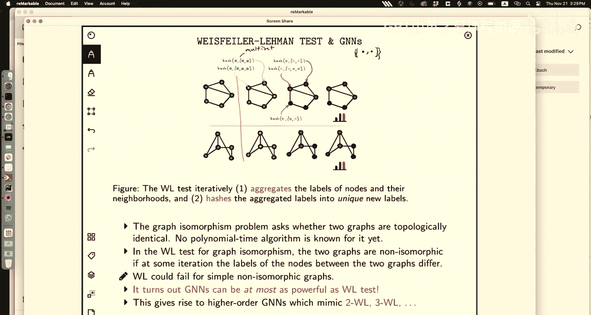

# 25：图神经网络与旋转等变性 2


## 概述
在本节课中，我们将继续学习图神经网络。我们将深入探讨图数据的核心特性——置换对称性，并理解如何构建尊重这种对称性的神经网络架构。我们还将介绍图神经网络的基本框架，并简要探讨其与图同构测试算法之间的深刻联系。

---

## 回顾与修正

上一节我们介绍了图的基本概念和邻接矩阵。本节中，我们来看看一个重要的数学概念——置换。

在上一讲的推导中，价值函数部分存在一个笔误。让我们一起来修正它。

我们想评估策略 `π` 的价值函数 `V^π(s)`，即从状态 `s` 开始，遵循策略 `π` 所获得的期望总回报。

总回报 `G_t` 定义为：
`G_t = R_{t+1} + γ R_{t+2} + γ^2 R_{t+3} + ...`

根据贝尔曼方程，我们可以将其写为：
`V^π(s) = E[ R_{t+1} + γ G_{t+1} | S_t = s ]`

进一步展开期望，我们考虑在当前状态 `s` 下采取动作 `a`，转移到下一状态 `s'` 并获得奖励 `r` 的概率：
`V^π(s) = Σ_a π(a|s) Σ_{s', r} p(s', r | s, a) [ r + γ V^π(s') ]`

这里的笔误在于：在求和符号内部，价值函数 `V^π` 的参数应该是下一状态 `s'`，而不是当前状态 `s`。修正后的公式明确了状态从 `s` 更新到了 `s'`。

---

## 图的置换对称性

现在，让我们回到图神经网络的主题。图数据的一个关键特性是节点没有固有的顺序。

### 什么是置换？
数学上，对一个包含 `n` 个节点的集合，置换是一个双射函数 `π: {1,...,n} -> {1,...,n}`。它将每个节点标签映射到另一个（或相同的）标签。

例如，对于集合 `{1,2,3}`，一个可能的置换是：
`π(1)=2`, `π(2)=3`, `π(3)=1`

我们可以用两行记号表示：
```
[ 1 2 3 ]
[ 2 3 1 ]
```

### 置换矩阵
每个置换都对应一个置换矩阵 `P`。其定义是：如果 `π(u) = v`，则 `P_{u,v} = 1`，否则为 `0`。

根据这个定义，置换矩阵是正交矩阵：
`P^T P = P P^T = I`

### 置换对图表示的影响
假设我们有一个图，其节点特征矩阵为 `X ∈ R^{n×d}`，邻接矩阵为 `A ∈ R^{n×n}`。

如果我们对节点应用一个置换 `π`（对应矩阵 `P`），那么图的表示将如何变换？

*   **节点特征**：新的特征矩阵 `X̃` 是原矩阵行的重排。具体变换为 `X̃ = P^T X`。
*   **邻接矩阵**：新的邻接矩阵 `Ã` 描述了重排后节点间的连接关系。变换为 `Ã = P^T A P`。

关键在于，`(X, A)` 和 `(X̃, Ã)` 表示的是同一个图，只是节点的编号（顺序）不同。

---

## 图神经网络的任务与对称性要求

基于图的任务主要分为两类，它们对对称性有不同的要求：

以下是两类主要任务及其对称性要求：
1.  **节点级任务**（如节点分类）：预测图中每个节点的属性。模型输出应对节点置换是**等变**的。即，如果输入节点被置换，输出预测也应以相同方式置换。
2.  **图级任务**（如图分类）：预测整个图的属性。模型输出应对节点置换是**不变**的。即，无论节点如何编号，对同一个图的预测结果应该相同。

我们的目标是设计神经网络函数 `F` 和 `G`，使其分别满足不变性和等变性要求。由于节点可能的排序方式有 `n!` 种（指数级），枚举所有排序是不可行的。

---

## 从卷积神经网络到图神经网络

为了理解图神经网络的设计思想，让我们回顾一下卷积神经网络。

在CNN中，每个像素（节点）的更新基于其局部邻居（如3x3窗口）的特征。我们可以将此操作抽象地写为：
`h_i^{(l+1)} = σ( W_{self} h_i^{(l)} + Σ_{j ∈ N(i)} W_{neighbor} h_j^{(l)} + b )`

其中 `N(i)` 是像素 `i` 的邻居集合。CNN的关键在于**权重共享**：对于所有位置 `i`，我们使用相同的 `W_{self}` 和 `W_{neighbor}`。这使网络具有平移等变性。

图神经网络继承了这种“基于邻居聚合信息”的思想，但将其推广到更一般的图结构，并要求满足**置换对称性**而非平移对称性。这意味着聚合函数不能依赖于具体的节点ID。

---

## 图神经网络通用框架

图神经网络遵循**邻域聚合**或**消息传递**的哲学。其核心是通过迭代地聚合邻居信息来更新节点表示。

设 `h_v^{(k)}` 表示节点 `v` 在第 `k` 层的表示。初始表示 `h_v^{(0)}` 就是节点的输入特征 `x_v`。

每一层的更新包含两个步骤：

以下是消息传递层的两个核心步骤：
1.  **聚合**：对于节点 `v`，聚合其所有邻居 `u ∈ N(v)` 在上一层的表示。
    `a_v^{(k)} = AGGREGATE^{(k)} ( { h_u^{(k-1)} : u ∈ N(v) } )`
2.  **更新**：将聚合得到的信息 `a_v^{(k)}` 与节点自身上一层的表示 `h_v^{(k-1)}` 结合，生成新的表示。
    `h_v^{(k)} = COMBINE^{(k)} ( h_v^{(k-1)}, a_v^{(k)} )`

函数 `AGGREGATE` 和 `COMBINE` 可以是带参数的可学习函数（如神经网络）。为了满足置换对称性，这些函数的参数必须在所有节点间**共享**（但不同层可以不同）。

### 层次化感知
这种迭代过程产生了层次化的感知能力。在第一次迭代（`k=1`），节点只看到其直接邻居的信息。在第二次迭代（`k=2`），由于邻居的表示在第一次迭代中已经更新（包含了它们邻居的信息），因此节点 `v` 能感知到其两跳邻居的信息。随着层数增加，每个节点能整合来自图中越来越远区域的信息。

---

## 实例：图注意力网络

我们可以基于上述框架推导出复杂的图神经网络架构，如图注意力网络。

在GAT中，`AGGREGATE` 函数不是简单地对邻居特征取平均，而是进行加权和，权重通过注意力机制计算。

对于节点 `v`，其第 `k` 层的聚合步骤为：
`a_v^{(k)} = Σ_{u ∈ N(v)} α_{vu}^{(k)} W^{(k)} h_u^{(k-1)}`

其中，注意力系数 `α_{vu}` 计算如下：
`α_{vu} = softmax_{u ∈ N(v)} ( LeakyReLU( a^T [ W h_v || W h_u ] ) )`

这里，`||` 表示向量拼接，`a` 和 `W` 是可学习的参数。`softmax` 确保对节点 `v` 的所有邻居 `u`，权重 `α_{vu}` 之和为1。这种方式允许节点对其不同的邻居分配不同的重要性。

---

## 图读出与图同构测试

对于图级任务，在通过 `K` 层消息传递得到所有节点的最终表示 `{ h_v^{(K)} }` 后，我们需要一个**读出**函数来生成整个图的表示。

读出函数必须是对节点置换不变的。常见的选择包括：
*   求和：`h_G = Σ_{v∈G} h_v^{(K)}`
*   均值：`h_G = mean( { h_v^{(K)} } )`
*   元素级最大值：`h_G = max_{v∈G} h_v^{(K)}`

得到的图级表示 `h_G` 可以用于后续的分类或回归任务。

有趣的是，图神经网络的消息传递机制与一个经典的图论算法——**Weisfeiler-Lehman** 图同构测试有着深刻的联系。WL测试通过迭代地“染色”和“聚合”邻居颜色来区分图结构，其过程与GNN的邻域聚合高度相似。事实上，WL测试的能力界定了GNN的表达能力上限：如果两个图能被WL测试区分，那么也存在一个GNN能够区分它们。

---



## 总结
本节课我们一起学习了图神经网络的核心思想。我们首先深入理解了图数据的置换对称性，以及它对神经网络设计提出的约束。然后，我们介绍了图神经网络的通用消息传递框架，该框架通过迭代的聚合与更新操作，使节点能够整合来自其局部邻域乃至全局的信息。我们还看到了如何在此框架下实例化具体的架构，如图注意力网络。最后，我们了解了图读出机制以及GNN与图同构测试之间的理论联系。图神经网络为我们处理非欧几里得空间中的复杂关系数据提供了强大的工具。