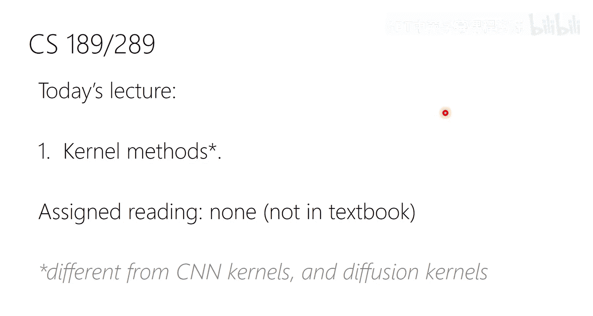
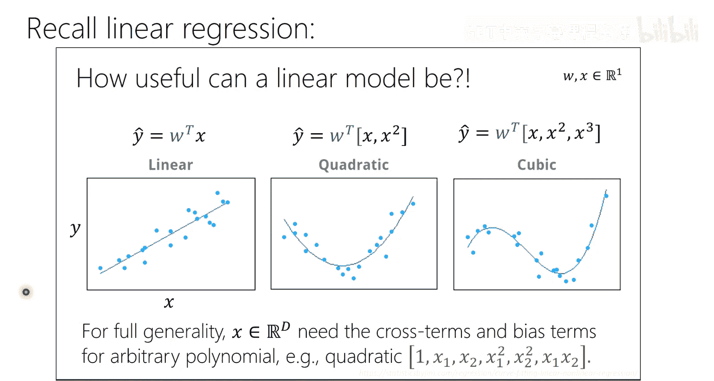
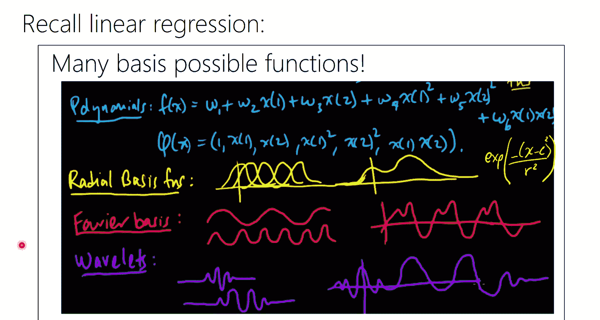
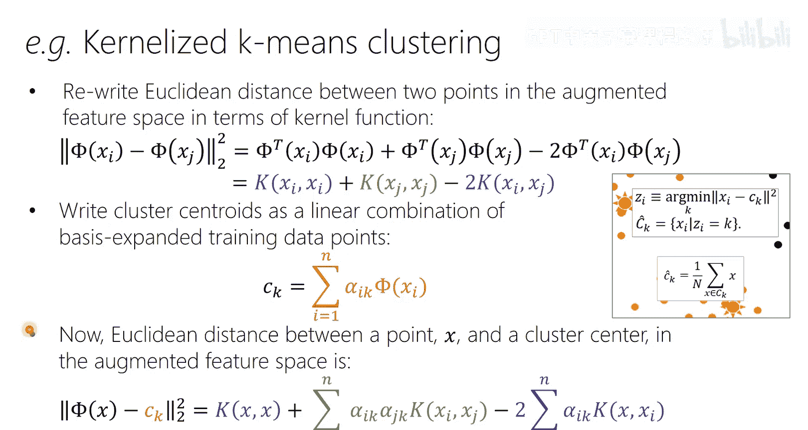

# 26：核方法 🧠

在本节课中，我们将要学习一个经典但至今仍非常重要的机器学习主题——核方法。我们将了解什么是核函数，以及如何利用“核技巧”将线性模型（如线性回归、逻辑回归）扩展到高维甚至无限维的特征空间，而无需显式计算这些高维特征，从而高效地处理非线性问题。

---

## 引言与动机

上一节我们介绍了通过基函数扩展（如多项式基）来增强线性模型表达能力的方法。本节中，我们来看看如何更高效地处理这种扩展。

在机器学习中，“核”这个词有多种含义（例如卷积神经网络中的卷积核），但今天我们将聚焦于一种特定的核，它与特征空间的隐式映射密切相关。

### 为什么核方法仍然重要？
尽管神经网络如今非常流行，但核方法在以下场景中仍有其独特优势：
*   **数据量有限时**：神经网络通常需要大量数据，而核方法在小数据集上可能表现更好。
*   **需要良好不确定性估计时**：高斯过程回归（基于核函数）是提供预测不确定性的先进方法。
*   **理论分析**：在分析神经网络的理论性质（如神经正切核）时，核方法提供了重要工具。
*   **特定领域**：历史上，人们为图结构、蛋白质等特定对象设计过专用核函数。

---

## 回顾：基函数扩展

还记得我们之前讨论过，即使模型在参数上是线性的，只要我们对输入特征进行基函数扩展（例如多项式扩展），就能获得任意复杂的函数。

**核心思想**：给定原始特征 `x`，我们通过一个映射函数 `φ(x)` 将其转换到更高维（甚至无限维）的空间。然后，在这个新空间中使用线性模型。

**例如，多项式扩展**：
对于一个二维输入 `x = [x1, x2]^T`，二阶多项式扩展 `φ(x)` 可能包含 `[1, x1, x2, x1^2, x2^2, x1*x2]^T` 等项。

然而，直接进行基函数扩展有两个主要问题：
1.  **计算成本高**：扩展后的特征维度 `D` 可能极高（例如高阶多项式），导致计算（如求逆 `D×D` 矩阵）变得不可行。
2.  **需要先验知识**：我们通常不知道哪种基函数最适合当前问题。

核方法的精妙之处在于，它允许我们**隐式地**在这个高维空间中操作，而无需显式计算 `φ(x)`。

---

## 核技巧初探

核方法的核心是**核技巧**。其目标是：重写算法，使得所有运算都只依赖于数据点之间的**内积**。

**核函数定义**：核函数 `K(x, z)` 是一个函数，它计算了两个数据点 `x` 和 `z` 在某个隐式的高维特征空间 `φ(·)` 中的内积，即：
`K(x, z) = φ(x)^T φ(z)`

**关键洞察**：如果我们能找到一种方法，不通过显式计算 `φ(x)` 和 `φ(z)`，就能直接计算出这个内积结果（一个标量），那么我们就绕过了高维空间的计算难题。

### 一个具体例子：多项式核

假设我们想计算两个二维点 `x` 和 `z` 在二阶多项式扩展空间中的内积。
*   **显式计算**：需要将 `x` 和 `z` 分别映射为6维向量 `φ(x)` 和 `φ(z)`，然后计算6维内积。
*   **核技巧**：我们可以直接通过原始2维空间中的计算得到相同结果：
    `K(x, z) = (x^T z + 1)^2`

**验证**：
展开 `(x^T z + 1)^2 = (x1*z1 + x2*z2 + 1)^2`，结果包含 `x1^2*z1^2`, `x2^2*z2^2`, `2*x1*z1`, `2*x2*z2`, `2*x1*x2*z1*z2` 等项。这正好对应了 `φ(x)^T φ(z)`，其中 `φ(x) = [1, √2*x1, √2*x2, x1^2, x2^2, √2*x1*x2]^T`（包含特定的缩放系数）。

**意义**：我们仅通过原始空间的内积、加法和平方操作，就得到了在6维扩展空间中的内积结果。对于更高阶 `p` 的多项式核，公式为 `K(x, z) = (x^T z + c)^p`，它能隐式对应一个组合数量爆炸的高维空间。

---

## 如何验证一个函数是有效的核函数？

并非任意一个关于两个点的函数都是有效的核函数。有效的核函数必须对应某个特征空间中的内积。

** Mercer 定理 **（简化版）：
一个函数 `K(x, z)` 是有效核函数的**充要条件**是，对于任何有限的数据集 `{x_1, ..., x_n}`，由该函数计算出的 **核矩阵** `K`（其中 `K_{ij} = K(x_i, x_j)`）是**半正定**的。

**核矩阵**：一个 `n×n` 的对称矩阵，度量了所有数据点对之间的“相似度”。

**示例**：
*   `K(x, z) = sin(x)^T cos(z)` 不是有效核，因为它不对称。
*   `K(x, z) = x^T M z` 是有效核，当且仅当矩阵 `M` 是半正定的。

---

## 构建与组合核函数

我们可以像搭积木一样，从简单的有效核函数构建出复杂的核函数。

以下是构建新核函数的有效规则（假设 `K1` 和 `K2` 是有效核）：
*   **缩放**：对于任意常数 `c > 0`，`c * K1` 是有效核。
*   **加法**：`K1 + K2` 是有效核。
*   **乘法**：`K1 * K2` 是有效核。
*   **函数变换**：将核函数通过具有正系数的多项式函数或指数函数变换后，仍然是有效核。

### 常见的核函数
以下是一些广泛使用的核函数：
*   **多项式核**：`K(x, z) = (x^T z + c)^d`
*   **径向基函数核**：`K(x, z) = exp(-γ * ||x - z||^2)`。这对应一个**无限维**的特征空间。
*   **拉普拉斯核**：`K(x, z) = exp(-γ * ||x - z||_1)`

---

## 核化算法的一般步骤

要将一个算法（如线性回归、PCA）转化为核化版本，通常遵循以下步骤：

1.  **用内积重写算法**：将算法中所有涉及数据点的运算，都表示为数据点之间内积 `x_i^T x_j` 的形式。
2.  **表示定理**：证明或假设待求解的参数（如线性回归的权重 `w`）可以表示为训练数据点的线性组合，即 `w = Σ_i α_i φ(x_i)`。这使我们能将问题转化为求解对偶变量 `α`。
3.  **替换为核函数**：将所有内积 `φ(x_i)^T φ(x_j)` 替换为核函数值 `K(x_i, x_j)`。现在，所有运算都基于核矩阵 `K` 进行。
4.  **在对偶空间中求解**：在新的、只涉及 `α` 和核矩阵 `K` 的优化问题中求解。预测时，新样本的预测值也仅通过核函数与训练数据的计算得出。

这样，算法的计算复杂度就从依赖于特征维度 `D`，转变为依赖于样本数量 `n`。当隐式特征空间维度很高而样本数相对较少时，这带来了巨大的计算优势。

---

## 实例：核化岭回归

让我们将上述步骤应用于岭回归。

**1. 原始岭回归问题**：
损失函数为 `L(w) = Σ_i (y_i - w^T φ(x_i))^2 + λ ||w||^2`。

**2. 表示定理的体现**：
对 `L(w)` 关于 `w` 求导并令其为0，可以得到闭式解：
`w = (1/λ) Σ_i (y_i - w^T φ(x_i)) φ(x_i)`
令 `α_i = (1/λ)(y_i - w^T φ(x_i))`，则 `w = Σ_i α_i φ(x_i) = Φ^T α`，其中 `Φ` 是所有 `φ(x_i)` 组成的矩阵。这证明了 `w` 确实是训练样本的线性组合。

**3. 代入损失函数并核化**：
将 `w = Φ^T α` 代入损失函数，经过代数运算，损失函数可以重写为：
`L(α) = ||y - Kα||^2 + λ α^T K α`
其中 `K = ΦΦ^T` 是核矩阵，`K_{ij} = K(x_i, x_j)`。现在问题变成了关于 `α` 的优化。

**4. 求解对偶变量**：
对 `L(α)` 关于 `α` 求导并令其为0，得到解：
`α = (K + λI)^{-1} y`

**5. 核化预测**：
对于新样本 `x*`，其预测值为：
`y* = w^T φ(x*) = (Σ_i α_i φ(x_i))^T φ(x*) = Σ_i α_i K(x_i, x*) = k*^T α`
其中 `k*` 是 `x*` 与所有训练样本的核函数值向量。

**关键对比**：
*   **原始岭回归**：需要求逆 `D×D` 矩阵（`D` 为特征维度）。
*   **核化岭回归**：需要求逆 `n×n` 矩阵（`n` 为样本数）。当 `D >> n` 时，核化版本更高效。

---

## 实例：核化 K-Means 聚类

K-Means 的核心是计算数据点到簇中心的欧氏距离。核化版本旨在隐式地在高维特征空间中进行聚类。

**1. 用核函数表示距离**：
在高维空间中，点 `φ(x_i)` 和点 `φ(x_j)` 的平方欧氏距离为：
`||φ(x_i) - φ(x_j)||^2 = K(x_i, x_i) + K(x_j, x_j) - 2K(x_i, x_j)`

**2. 表示簇中心**：
假设第 `k` 个簇的中心 `μ_k` 也可以表示为该簇内样本的线性组合（这符合 K-Means 的性质）。

**3. 核化距离计算**：
利用上述两点，数据点 `φ(x)` 到簇中心 `μ_k` 的距离可以完全用核函数 `K(·,·)` 表示，而无需显式计算 `φ(x)` 或 `μ_k`。

**4. 算法流程**：
核化 K-Means 的迭代过程与标准 K-Means 类似：
*   **分配步骤**：将每个点分配到“核空间距离”最近的簇中心。
*   **更新步骤**：更新每个簇的“表示”（即更新定义簇中心的线性组合系数）。
所有计算都通过核矩阵完成。

---

## 总结

本节课中我们一起学习了核方法的核心思想与应用。

*   **核函数** `K(x, z)` 隐式地计算了数据点在高维特征空间中的内积。
*   **核技巧** 允许我们在不显式计算高维特征映射 `φ(x)` 的情况下，在高维空间中运行线性算法。
*   **Mercer 定理** 提供了判断一个函数是否为有效核函数的准则。
*   **核化算法** 的关键步骤包括：用内积重写原算法、利用表示定理、将内积替换为核函数、在对偶空间中求解。
*   我们探讨了**核化岭回归**和**核化 K-Means** 的具体推导，展示了如何将计算复杂度从特征维度转移到样本数量。

核方法是一座连接线性模型与非线性世界的优雅桥梁。尽管深度学习占据主流，但核方法在数据稀缺、需要不确定性估计或进行理论分析的场景中，依然保持着不可替代的价值。理解核技巧，有助于你更深刻地领会机器学习中模型灵活性与计算效率之间的权衡艺术。