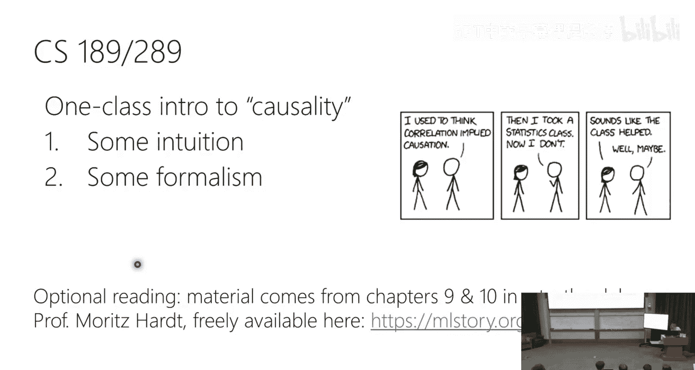

# 27：因果推断





## 概述
在本节课中，我们将学习因果推断的基本概念。我们将了解为什么相关性不等于因果性，以及在进行因果分析时可能出现的常见陷阱，例如辛普森悖论。我们还将介绍一种用于描述因果关系的正式框架——结构方程模型，并探讨如何从观测数据中估计因果效应。

---

## 辛普森悖论与混杂变量

上一节我们概述了因果推断的重要性。本节中，我们来看看一个经典现象——辛普森悖论，它直观地展示了忽视关键变量如何导致完全错误的结论。

假设我们研究两种肾结石治疗方法A和B。总体数据显示，治疗B的成功率（83%）高于治疗A（78%）。我们可能因此认为治疗B更优。

然而，当我们按结石大小（大或小）对数据进行分层分析时，趋势发生了逆转：

*   对于大结石患者，治疗A的成功率（73%）高于治疗B（69%）。
*   对于小结石患者，治疗A的成功率（93%）也高于治疗B（87%）。

这个现象就是**辛普森悖论**：当忽略一个**混杂变量**（此处为结石大小）时，两个变量（治疗方法和成功率）之间的总体关联趋势与在每个分层内的趋势完全相反。

以下是导致悖论的关键点：
*   **混杂变量**：结石大小同时**因果影响**了治疗的成功率以及医生对治疗方案的选择（例如，医生可能更倾向于对小结石使用治疗B）。
*   **非随机分配**：治疗分配不是随机的，而是基于医生的判断，这引入了偏差。
*   **分层分析**：要获得真实的因果效应，必须针对混杂变量的每个取值（大结石、小结石）分别进行分析，然后进行适当加权平均。

这个例子表明，仅凭观测数据中的相关性，无法推断因果关系。我们必须考虑并控制那些同时影响原因和结果的变量。

---

## 结构方程模型：描述因果机制

上一节我们通过例子看到了混杂变量的影响。本节中，我们引入一个正式的框架——**结构方程模型**，来描述变量之间的因果机制。

结构方程模型可以看作一段生成数据的伪代码。它明确指定了每个变量如何根据其因果父变量和一些随机噪声被赋值。这赋予了模型因果解释。

例如，考虑变量：运动量 `X`、体重 `W`、心脏病 `H`。一个可能的结构方程模型伪代码如下：

```
# 随机噪声（外生变量）
U1 ~ Bernoulli(0.5)  # 影响运动
U2 ~ Bernoulli(0.5)  # 影响体重
U3 ~ Bernoulli(1/3)  # 影响心脏病

# 内生变量（我们关心的变量）
X = U1                         # 运动量
W = 0 if X == 1 else U2       # 体重受运动影响
H = 0 if X == 1 else U3       # 心脏病受运动影响
```

从这个伪代码中，我们可以读出因果图：`X -> W` 且 `X -> H`。`W` 和 `H` 之间没有直接的因果箭头。

结构方程模型的关键在于，它允许我们模拟**干预**（`do`操作）。例如，干预“设定体重 `W=1`”，在伪代码中意味着我们**删除** `W = 0 if X == 1 else U2` 这一行，并**替换**为 `W = 1`。然后我们重新运行代码，观察 `H` 的分布是否改变。如果改变，则说明 `W` 对 `H` 有因果效应。

---

## “条件”与“干预”的根本区别

上一节我们介绍了结构方程模型。本节中，我们探讨因果推断中一个核心概念上的区别：**条件概率** `P(Y | X=x)` 与**干预概率** `P(Y | do(X=x))`。

*   **条件概率 `P(Y | X=x)`**：表示在**观测到** `X` 取值为 `x` 的那些数据中，`Y` 的分布。这纯粹是统计上的关联。
*   **干预概率 `P(Y | do(X=x))`**：表示我们**主动强制**将系统中每个个体的 `X` 设置为 `x` 后（如进行随机对照试验），`Y` 的分布。这反映了 `X` 对 `Y` 的因果效应。

在存在**混杂变量** `Z`（即 `Z -> X` 且 `Z -> Y`）的情况下，两者通常不相等：`P(Y | X=x) ≠ P(Y | do(X=x))`。

例如，在运动(`X`)、体重(`W`)、心脏病(`H`)的模型中，即使 `P(H=1 | W=1) > P(H=1)`，我们也不能说“体重导致心脏病”。因为 `W` 和 `H` 都被运动 `X` 影响，观测到的关联是通过 `X` 产生的。当我们干预 `do(W=1)` 时，会发现 `H` 的分布并未改变，证实没有直接因果效应。

**核心洞见**：要从观测数据中估计因果效应，我们需要找到方法将包含 `do` 操作的表达式（无法直接从数据计算）转化为仅包含条件概率的表达式（可以从数据计算）。

---

## 调整公式：从观测数据估计因果效应

上一节我们明确了目标：将 `do` 操作转化为条件概率。本节中，我们介绍最重要的工具——**调整公式**。

当我们关心处理 `X` 对结果 `Y` 的平均因果效应，并且已知一个**混杂变量集合 `Z`** 时，调整公式如下：

`P(Y | do(X=x)) = Σ_z P(Y | X=x, Z=z) * P(Z=z)`

**公式解读**：
1.  `Σ_z`：对混杂变量 `Z` 的所有可能取值求和（或积分）。
2.  `P(Y | X=x, Z=z)`：在 `Z` 固定为某个值 `z` 的子群体中，计算 `X=x` 时 `Y` 的条件概率。在 `Z` 固定的情况下，`X` 与 `Y` 之间的关联可以解释为因果效应。
3.  `P(Z=z)`：用总体中 `Z` 取值为 `z` 的比例进行加权平均。

**应用**：在肾结石例子中，`X` 是治疗方法，`Y` 是治疗成功，`Z` 是结石大小（大/小）。
*   要计算 `P(成功 | do(治疗=A))`，我们分别计算 `P(成功 | 治疗=A, 结石=大) * P(结石=大) + P(成功 | 治疗=A, 结石=小) * P(结石=小)`。
*   同理计算 `do(治疗=B)` 的概率。
*   两者的差异就是**平均处理效应**，它量化了治疗A相对于治疗B的因果优势。

**关键前提**：调整公式的有效性**完全依赖于**我们正确识别了所有相关的混杂变量 `Z`。如果 `Z` 集不正确（遗漏混杂变量或包含错误变量），估计的因果效应将是错误的。

---

## 其他变量类型：中介与碰撞

上一节我们重点讨论了混杂变量。本节中，我们简要介绍在构建因果图时另外两种重要的变量类型，控制它们会导致错误。

### 1. 中介变量
中介变量位于从原因 `X` 到结果 `Y` 的**因果路径**上。例如：吸烟(`X`) -> 肺部焦油沉积(`Z`) -> 肺癌(`Y`)。`Z` 在这里是中介。
*   **错误做法**：如果将中介变量 `Z` 放入调整公式进行控制，我们会**阻断** `X` 通过 `Z` 影响 `Y` 的路径，从而**低估**了 `X` 对 `Y` 的总因果效应。
*   **正确做法**：在估计 `X` 对 `Y` 的总效应时，不应控制中介变量。

### 2. 碰撞变量
碰撞变量是**同时被 `X` 和 `Y` 因果影响**的变量。例如：肺炎(`X`) -> 住院(`Z`) <- 骨折(`Y`)。`Z` 是一个碰撞点。
*   **错误做法**：如果条件于（控制）一个碰撞变量 `Z`，会在 `X` 和 `Y` 之间引入一种**非因果的统计关联**（称为“碰撞偏差”或“伯克森悖论”）。例如，在住院病人中，肺炎和骨折可能表现出负相关，但这并非因为它们在实际人群中存在因果联系，而是因为条件于住院这个共同结果所导致的。
*   **正确做法**：不应控制碰撞变量。

**总结**：在应用调整公式时，**只能**调整**混杂变量**。调整中介变量或碰撞变量都会导致有偏的因果估计。

---

## 总结与挑战

本节课我们一起学习了因果推断的基础知识。

我们首先通过**辛普森悖论**认识到，忽略混杂变量会导致对关联关系的完全误解。接着，我们引入了**结构方程模型**作为描述因果机制的正式语言，它通过伪代码和因果图来明确变量间的生成关系。我们重点区分了**条件概率**与**干预概率**的根本不同，后者才对应因果效应。为了从观测数据中估计因果效应，我们学习了**调整公式**，它允许我们在已知混杂变量的情况下，将 `do` 操作转化为可计算的条件概率。最后，我们指出了除了混杂变量，还有**中介变量**和**碰撞变量**，错误地控制它们会扭曲因果估计。

然而，整个因果推断面临一个根本性挑战：**调整公式以及任何因果结论的有效性，都完全依赖于我们事先已知正确的因果图结构（即知道谁是混杂变量）。** 从数据本身无法唯一确定或完全验证这个结构。这正是**随机对照试验**成为因果推断金标准的原因——它通过随机化处理分配，主动破坏了处理变量与任何潜在混杂变量之间的关联，从而保证了 `P(Y | X=x) = P(Y | do(X=x))`。


因此，虽然因果推断的框架非常强大，但在仅使用观测数据时必须极其谨慎，需要深厚的领域知识来构建合理的因果假设。机器学习中的预测模型，即使非常准确，通常也不代表因果模型，在数据分布发生变化时可能失效。理解这些概念，有助于我们批判性地评估各类数据分析和研究结论。