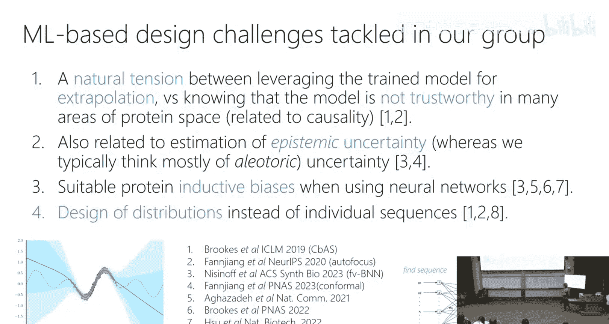

# 28：专题 - 计算生物学

在本节课中，我们将探讨机器学习在计算生物学领域，特别是蛋白质结构预测与设计中的应用。我们将了解这一领域的基本问题、核心方法以及当前面临的挑战。

## 概述：蛋白质与机器学习

蛋白质是生命活动的主要承担者，由氨基酸线性链组成。其功能很大程度上取决于其三维空间结构。几十年来，一个核心的“大挑战”是：能否仅从氨基酸序列预测其三维结构？这个问题被称为蛋白质结构预测。

## 蛋白质结构预测：从序列到结构

蛋白质结构预测的目标是：给定一个氨基酸序列，描述其所有原子在三维空间中的坐标。这是一个定义清晰、有明确评估标准的监督学习问题。

### 关键突破：AlphaFold

DeepMind公司的AlphaFold模型在2020年取得了革命性成功，基本解决了单结构预测问题。其成功得益于几个关键因素：
1.  **清晰的问题定义**：输入是序列，输出是原子坐标，评估指标明确。
2.  **高质量数据**：依赖于一个包含约17万个已知结构的公共数据库，其估算重置成本高达200亿美元。
3.  **领域知识整合**：巧妙利用了进化生物学和统计物理学的见解。

以下是AlphaFold2的核心流程简述：

1.  **输入**：目标蛋白质的氨基酸序列。
2.  **多序列比对（MSA）**：在大型序列数据库中搜索与目标序列进化相关的序列。这些相关序列隐含着关于蛋白质结构约束的信息。
3.  **模板搜索**：在已知结构的蛋白质中，寻找与目标或MSA中序列结构相似的模板，获取初始距离信息。
4.  **Evoformer处理**：使用一个创新的Transformer架构（具有行和列注意力机制）同时处理序列信息和成对距离信息，生成丰富的表示。
5.  **结构模块**：将Evoformer的输出转换为最终的三维原子坐标。该模块引入了**SE(3)等变性**（旋转和平移等变性），确保预测结构在物理变换下保持一致。
6.  **循环（Recycling）**：将初步预测的结构信息反馈回网络进行迭代优化。
7.  **物理精修**：使用基于物理的力场对预测结构进行微调，确保其符合物理化学规律。

AlphaFold的成功公式可以概括为：**大规模监督数据 + 进化信息（MSA） + 强大的端到端深度学习架构（Transformer）**。

### 最新进展与局限：AlphaFold3

AlphaFold3将预测范围扩展到蛋白质与其他分子（如其他蛋白质、DNA、RNA、小分子）的复合物结构。其主要变化包括：
*   **更通用的输入**：可以处理蛋白质、核酸等多种分子类型。
*   **扩散模型**：在结构模块中使用扩散模型进行采样，旨在生成不同的可能构象。然而，它尚未解决预测蛋白质多构象这一核心挑战。

AlphaFold仍存在局限性：
*   **依赖进化信息**：对于在数据库中缺乏同源序列的“孤儿蛋白”，预测效果不佳。
*   **静态单结构**：主要预测最稳定的单一构象，难以捕捉蛋白质的动态变化或多构象。
*   **对突变不敏感**：难以准确预测单个氨基酸突变对结构的细微影响。

## 蛋白质工程：从功能到序列

上一节我们介绍了如何从序列预测结构，本节我们来看看更终极的目标：蛋白质工程。其核心是**设计**具有特定功能的新蛋白质序列。

### 设计任务的挑战

蛋白质工程可以被视为在一个近乎无限的组合空间中进行搜索。对于一个长度为50的蛋白质，其可能的序列数量（20^50）已接近宇宙中的原子数。我们在这个空间中导航时，对绝大多数虚拟蛋白质的性质（如结合亲和力、稳定性）一无所知。

### 传统工程方法

主要有两种非机器学习的主流方法：
1.  **定向进化**：模拟自然进化过程。从某个亲本蛋白开始，通过引入随机突变创建变异库，筛选出具有改进功能的变体，然后迭代此过程。这本质上是一种**局部贪婪随机搜索**。
2.  **基于物理的设计**：使用计算化学中的能量函数来评估和搜索构象空间，寻找低能量（稳定）的结构。这种方法计算成本高，且依赖于对物理定律的近似。

### 机器学习赋能的设计

现代蛋白质工程日益融合机器学习方法，主要方向包括：

**以下是几种核心的机器学习方法：**

*   **表示学习**：利用大量未标注的蛋白质序列数据，训练自监督模型（如蛋白质语言模型），学习比独热编码更丰富的序列表示，用于下游的监督任务。
*   **序列生成模型**：构建生成模型，直接生成新的蛋白质序列。
    *   **无条件生成**：生成类似天然蛋白的、可能具有稳定结构的序列。
    *   **条件生成**：根据特定条件（如所需结构、功能属性）生成序列。例如，**逆向折叠模型**接受蛋白质骨架结构作为输入，生成与之兼容的氨基酸序列。
*   **结构生成模型**：使用扩散模型等生成蛋白质的三维结构坐标。通常需要与逆向折叠模型结合，才能得到最终序列。

一个典型的设计流程可能是：**结构生成模型 -> 逆向折叠模型 -> 得到候选序列**。

### 核心挑战：模型外推与不确定性

在设计超越训练数据范围的新功能时，会面临根本性挑战。如果我们用一个训练好的“序列->功能”模型，通过梯度上升直接优化输入序列以追求超高功能值，模型可能会产生位于输入空间“病理区域”的无效序列（类似于计算机视觉中通过优化输入生成抽象“香蕉”图像的现象）。

这引出了两个关键概念：
*   **认知不确定性**：由于缺乏该区域数据而产生的模型不确定性。
*   **偶然不确定性**：数据本身的测量噪声。

在蛋白质工程中，量化**认知不确定性**对于判断模型预测在训练数据分布之外的可靠性至关重要，是决定设计策略（继续计算探索还是返回湿实验验证）的核心依据。

## 总结与展望

本节课我们一起学习了机器学习在计算生物学，特别是蛋白质科学中的应用。
1.  **蛋白质结构预测**（AlphaFold）通过结合进化信息、大规模数据和深度学习，取得了历史性突破，但主要解决静态单结构预测。
2.  **蛋白质工程**的目标是设计具有新功能的序列，它融合了定向进化、物理建模和多种机器学习方法（生成模型、表示学习等）。
3.  **当前挑战**包括：处理蛋白质动态性与多构象、实现不依赖进化信息的“从头预测”、以及解决模型在外推设计时的可靠性与不确定性量化问题。

该领域正处在一个激动人心的阶段，机器学习正在成为理解和设计生命元件的强大工具，但距离完全可靠地“编程”蛋白质功能，仍有很长的路要走。成功往往需要**湿实验（定向进化）、计算工具（机器学习模型）和领域知识**的紧密结合。