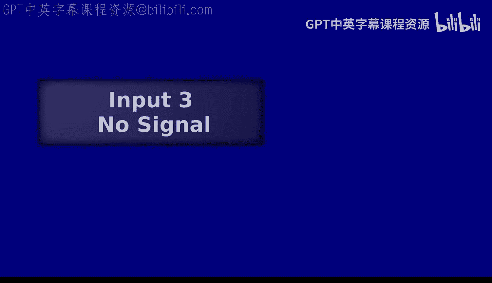
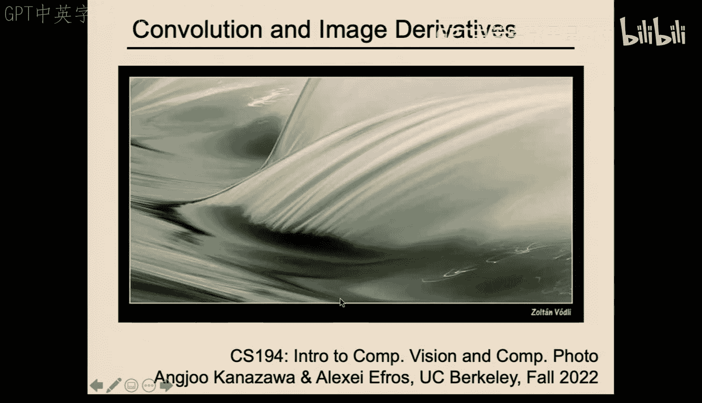
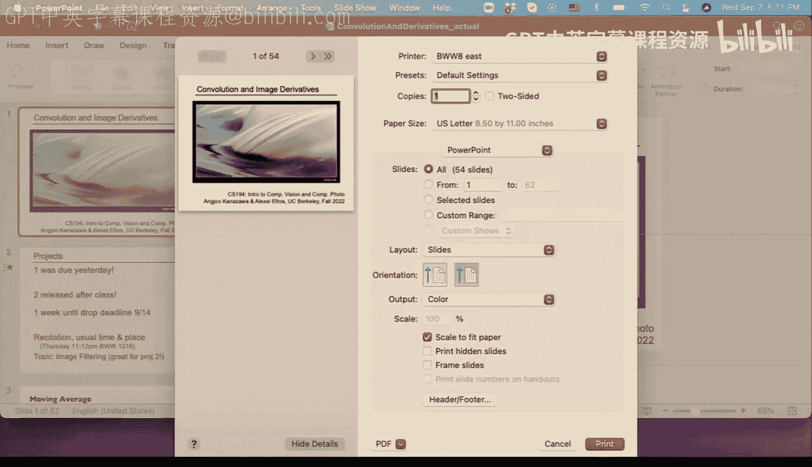
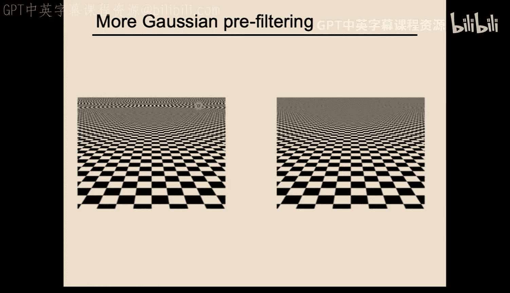
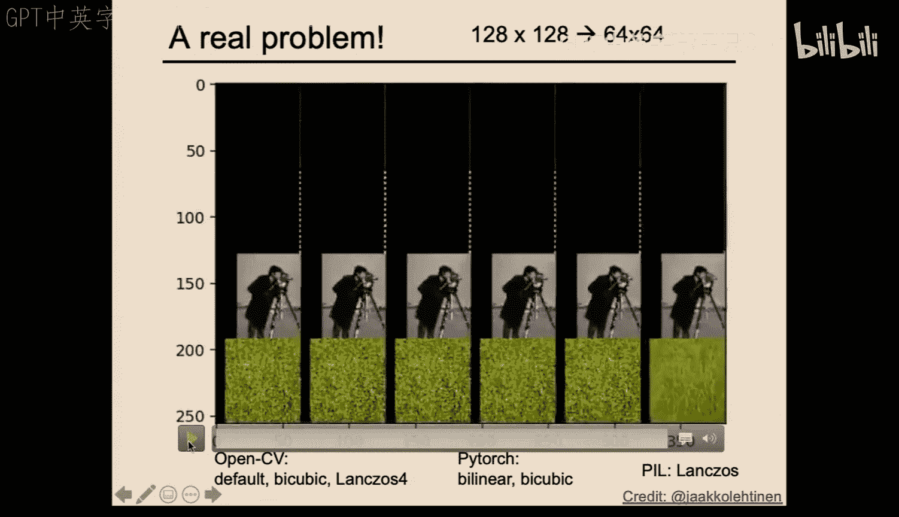
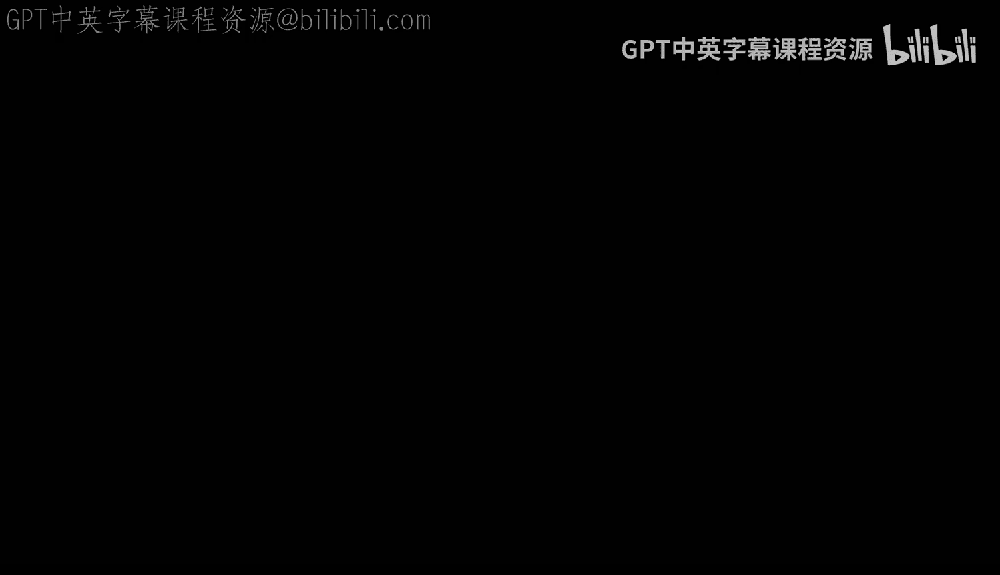
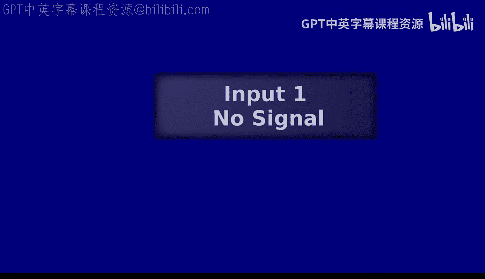
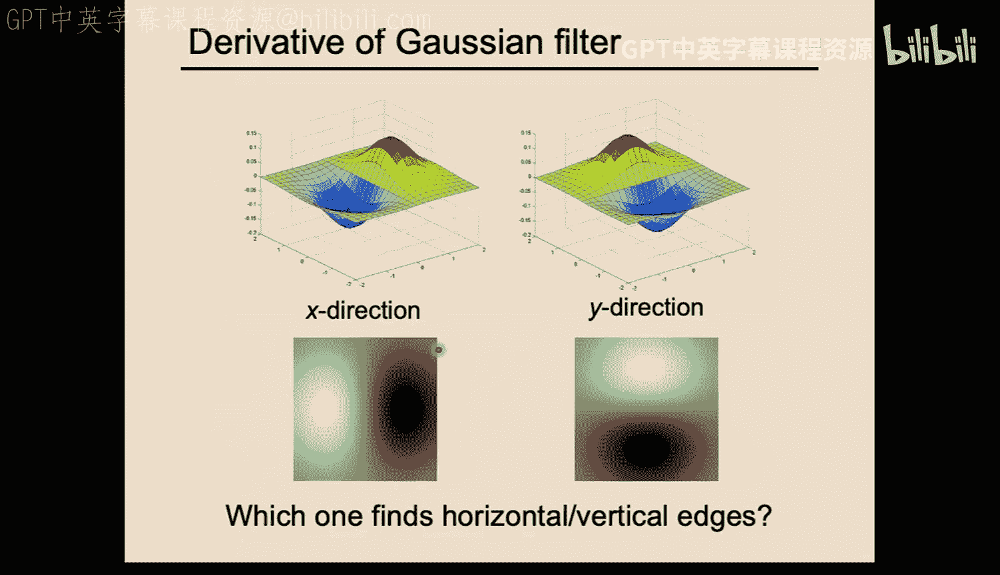

# 03：卷积与图像导数







在本节课中，我们将要学习卷积运算的核心概念，以及如何利用卷积来计算图像的导数。我们将从回顾移动平均和低通滤波开始，逐步深入到卷积的数学定义、其与互相关的区别，并最终学习如何通过卷积来检测图像中的边缘。

## 卷积与高斯滤波

上一节我们介绍了使用移动平均（或盒式滤波器）来平滑图像，以消除噪声和混叠效应。然而，盒式滤波器在处理边缘时会产生不理想的“振铃”伪影。本节中我们来看看一个更优的平滑滤波器：高斯滤波器。

高斯滤波器通过一个钟形曲线（高斯函数）对邻域像素进行加权平均。其核心参数是标准差 **σ**，它控制着平滑的程度。**σ** 越小，滤波器越尖锐；**σ** 越大，滤波器越平坦，最终趋近于均匀的盒式滤波器。

以下是高斯滤波器的核心公式，其中 `(x, y)` 是相对于滤波器中心的坐标：
```
G(x, y) = (1 / (2πσ²)) * exp(-(x² + y²) / (2σ²))
```

在实践中，我们使用一个有限大小的核（例如 3×3, 5×5）来近似这个无限函数。一个经验法则是将核的宽度设置为大约 **6σ**（即从中心向两边各延伸约 **3σ**），以确保捕获高斯函数的主要部分。

## 从互相关到卷积

我们之前通过点积运算进行的滤波操作，在数学上称为“互相关”。然而，在信号处理中，“卷积”是一个具有更优数学特性的运算。

互相关与卷积的主要区别在于，卷积在应用滤波器之前会将其进行**翻转**（先上下翻转，再左右翻转）。对于对称的滤波器（如高斯滤波器），翻转操作不改变滤波器，因此互相关和卷积的结果是相同的。

卷积运算具有两个关键特性，使其非常实用：
1.  **交换律**： `f * h = h * f`。这意味着信号和滤波器的角色可以互换。
2.  **结合律**： `(f * h1) * h2 = f * (h1 * h2)`。这意味着可以先将多个滤波器合并，再与信号进行卷积，这能显著提升计算效率。

在卷积神经网络中，由于滤波器权重是学习得到的，因此通常直接使用互相关运算，其结果与使用卷积是等价的。



## 图像金字塔与抗混叠



当我们想要缩小一幅图像时，简单的做法是直接丢弃每隔一行一列的像素（下采样）。但这会导致高频信息产生混叠，在图像中表现为令人不快的摩尔纹或锯齿状伪影。

解决方案是：在下采样**之前**，先使用一个适当大小的高斯滤波器对图像进行平滑（低通滤波）。这可以移除那些会导致混叠的高频信息。

我们可以递归地应用“平滑 -> 下采样”这一过程，生成一系列分辨率递减的图像，称为**高斯金字塔**。令人惊讶的是，存储整个金字塔所需的总空间仅比原图多出约 **1/3**（一个等比数列求和的结果）。

## 通过卷积计算图像导数

在连续数学中，导数定义为函数值的极限变化率。在离散的图像中，我们可以用卷积来近似计算导数。

对于一维离散信号，导数可以近似为相邻像素的差值。对应的卷积核是 `[-1, 1]`。为了将结果对准中心像素，我们更常使用 `[-1, 0, 1]` 这样的核。

在二维图像中，我们分别计算水平方向（x方向）和垂直方向（y方向）的偏导数。这通过两个卷积核来实现：
*   **x方向导数核**（检测垂直边缘）：
    ```
    [-1, 0, 1]
    ```
*   **y方向导数核**（检测水平边缘）：
    ```
    [-1]
    [ 0]
    [ 1]
    ```

将这两个方向导数的响应组合起来，我们就能得到每个像素点的**梯度向量**。这个向量的**幅度**代表了边缘的强度，而其**方向**则垂直于边缘的方向。

以下是计算梯度幅度和方向的公式：
```
梯度幅度 magnitude = sqrt( (dI/dx)² + (dI/dy)² )
梯度方向 direction = arctan( (dI/dy) / (dI/dx) )
```

## 平滑导数

直接对原始图像求导会对噪声非常敏感，导致梯度图充满杂乱无章的响应。为了稳健地检测边缘，我们通常先对图像进行平滑处理，再计算导数。




得益于卷积的结合律，我们可以将“平滑”和“求导”这两个步骤合并为一个操作：即直接对平滑滤波器（如高斯核）求导，得到一个新的滤波器（例如高斯导数核），然后用这个新滤波器与原始图像进行一次卷积即可。



这种方法不仅计算效率更高，而且能产生更干净、更有意义的边缘响应。



本节课中我们一起学习了卷积运算的原理及其在图像处理中的两大核心应用：图像平滑（抗混叠）和图像导数计算（边缘检测）。我们理解了高斯滤波器优于盒式滤波器的原因，掌握了通过卷积计算梯度来寻找图像边缘的方法，并认识了先平滑再求导对于抗噪声的重要性。这些概念是许多计算机视觉高级任务的基础。