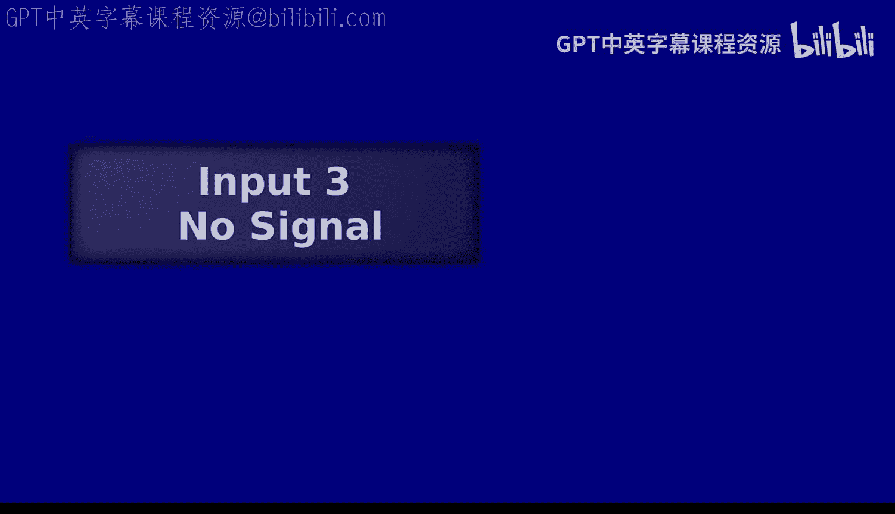
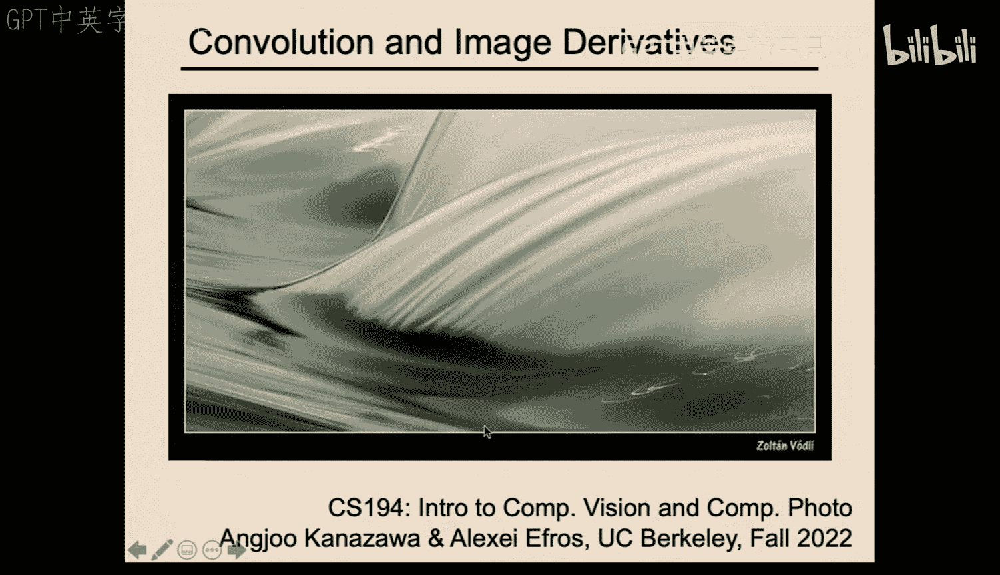
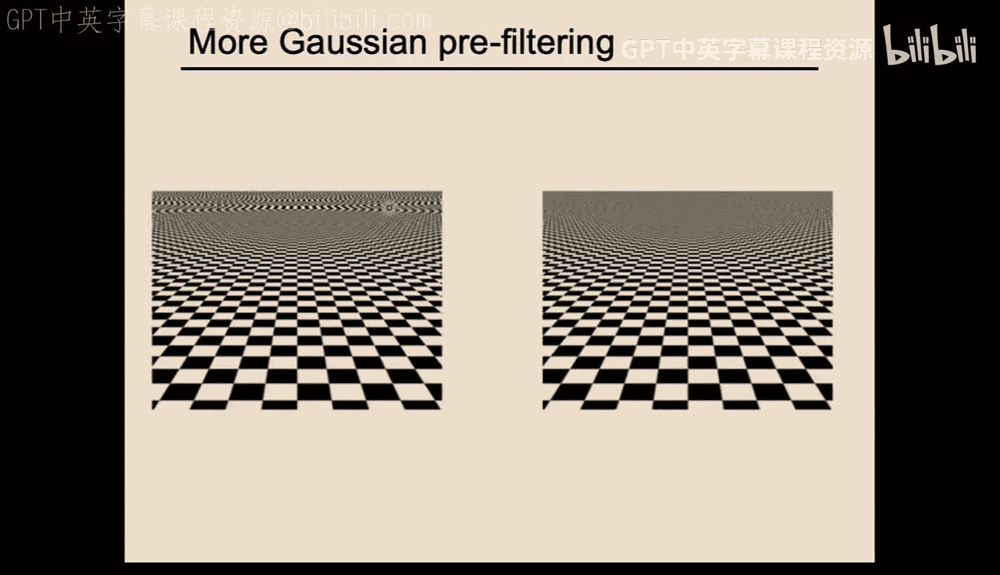
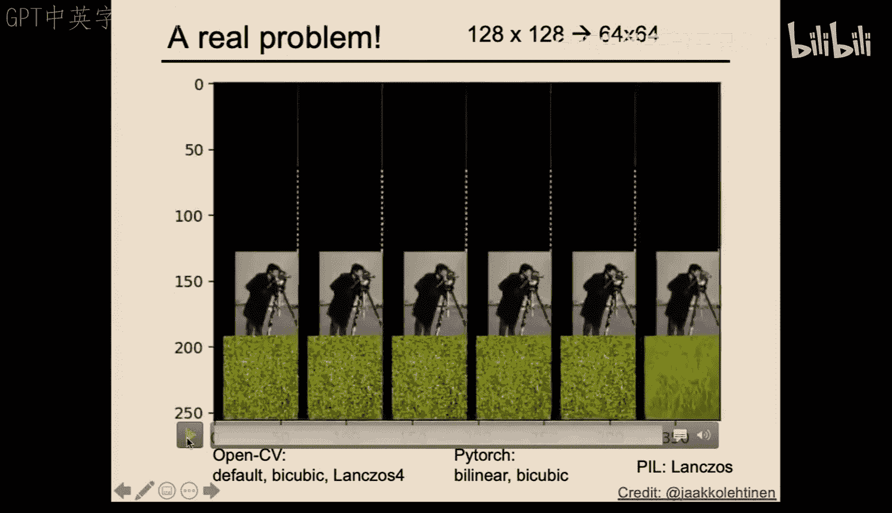
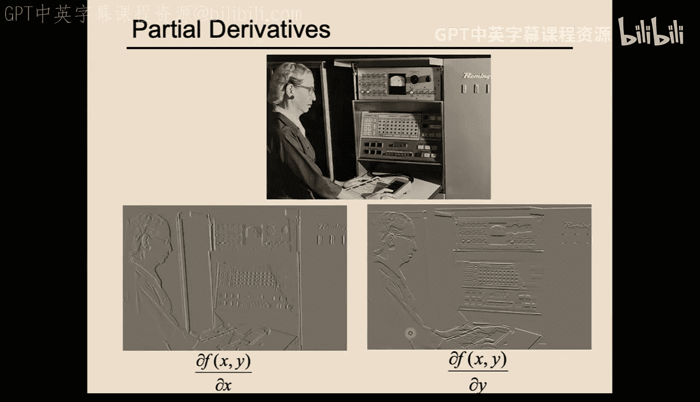
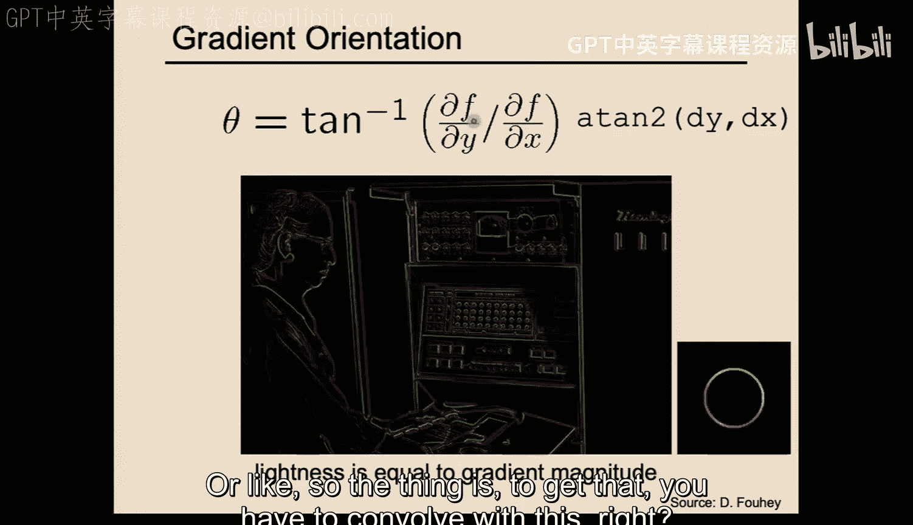
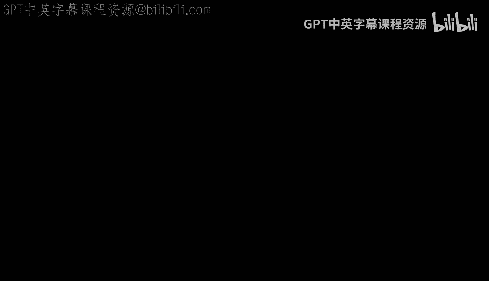
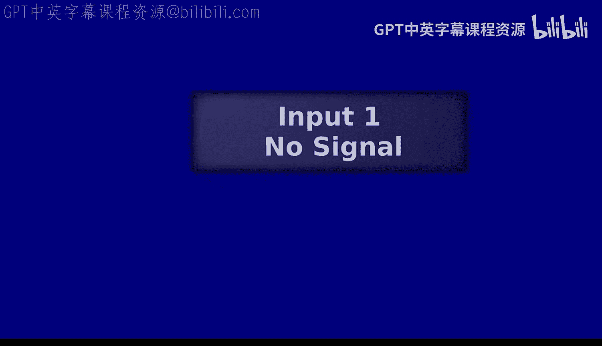
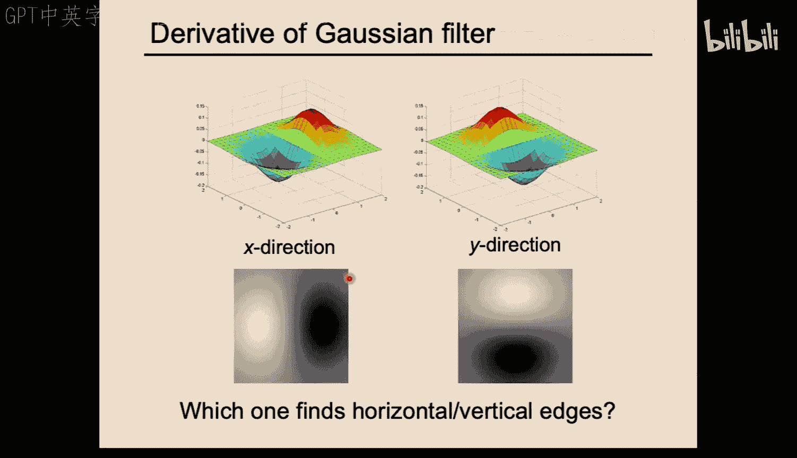

# 04：卷积与图像导数

## 概述

在本节课中，我们将学习图像处理中的两个核心概念：**卷积**与**图像导数**。我们将了解卷积如何用于平滑图像（低通滤波），以及如何通过卷积计算图像的导数来检测边缘。课程将从卷积的数学定义开始，探讨其与互相关的区别，然后介绍高斯滤波器及其在抗锯齿中的应用。最后，我们将学习如何计算图像的梯度，并理解平滑操作对于在噪声中稳健地检测边缘的重要性。

---

## 卷积与互相关

上一节我们介绍了使用移动平均（如盒式滤波器和高斯滤波器）来平滑图像。本节中，我们来看看实现这些操作的更一般化的数学工具：**卷积**。

首先，我们需要区分**互相关**和**卷积**。我们之前所做的点积操作实际上是互相关。

*   **互相关**的公式为：`(f ★ h)[n] = Σ f[i] * h[i + n]`。它不翻转滤波器。
*   **卷积**的公式为：`(f * h)[n] = Σ f[i] * h[n - i]`。它在应用前会先将滤波器**翻转**（先上下翻转，再左右翻转）。

为什么需要这个“翻转”操作？因为它赋予了卷积一些非常优良的数学性质，其中最重要的是**交换律**和**结合律**。这意味着：
*   `f * h = h * f` （交换律）
*   `(f * h1) * h2 = f * (h1 * h2)` （结合律）

结合律特别有用，因为它允许我们将多个滤波器先卷积成一个“超级滤波器”，然后再应用于图像，这可以显著减少计算量。

> 注意：在卷积神经网络中，出于简化，许多实现实际上使用的是互相关。但由于网络中的滤波器是学习得到的，因此使用互相关还是卷积在效果上并无本质区别。

---

## 高斯滤波器与抗锯齿

我们之前看到，简单的盒式滤波器在平滑图像时会产生不理想的“振铃”伪影。高斯滤波器是更优的选择，其核心由标准差 **σ** 控制。**σ** 越大，图像越模糊。

高斯滤波器是一种**低通滤波器**，它衰减图像中的高频信息（如细节和噪声），保留低频信息（如大块区域）。这在**抗锯齿**中至关重要。

当我们想缩小一张图片时，最直接的方法是**下采样**（例如，每隔一个像素取一个）。但如果原图中包含高频细节（如细密纹理），直接下采样会导致**走样**，产生原本不存在的虚假模式（如摩尔纹）。

以下是解决走样问题的标准流程：
1.  首先，使用一个高斯滤波器对原图进行**模糊**（低通滤波），移除会导致走样的高频信息。
2.  然后，对模糊后的图像进行**下采样**。

每次将图像尺寸减半时，所使用的滤波器尺寸（或 **σ**）也应相应增大，以匹配新的采样率。

> 一个实用的经验法则是：将滤波器宽度设置为大约 **6σ**（即半径 **3σ**），以确保捕获高斯的主要部分。

这种“模糊-下采样”的迭代过程可以高效地构建一个**图像金字塔**（也称为Mipmap）。有趣的是，存储整个金字塔所需的总空间仅比原图多大约 **1/3**（这是一个几何级数求和的结果）。

---

## 计算图像导数

现在，我们改变话题，看看如何利用卷积来计算图像的**导数**。导数对于检测图像中的**边缘**（即强度发生剧烈变化的区域）非常有用。

在连续世界中，导数的定义涉及极限。但在离散的图像中，我们可以用简单的差分来近似。对于一维信号 `f = [0, 1, 1, 2]`，其导数可以通过与滤波器 `h = [-1, 1]` 进行卷积来近似计算（注意卷积中的翻转操作）。

将这个思想扩展到二维图像，我们可以计算两个方向的偏导数：
*   **x方向导数**：使用滤波器如 `[-1, 1]`（或其中心化的版本 `[-1, 0, 1]`）。它主要响应**垂直**边缘。
*   **y方向导数**：使用上述滤波器的转置。它主要响应**水平**边缘。

这两个偏导数构成了图像的**梯度向量** `∇f = (∂f/∂x, ∂f/∂y)`。
*   梯度的**幅度** `||∇f||` 表示边缘的**强度**（变化有多大）。
*   梯度的**方向** `θ = arctan((∂f/∂y) / (∂f/∂x))` 表示边缘的**朝向**（变化最快的方向）。

---

## 噪声与平滑导数

然而，直接从真实图像计算导数有一个主要问题：**噪声**。图像传感器会引入随机噪声，这些噪声表现为像素值的微小、快速波动。导数操作会极大地放大这些噪声，导致梯度图充满无意义的杂乱响应，使得真正的边缘难以识别。

解决方案是：**先平滑，再求导**。由于卷积的结合律，我们可以将平滑滤波器（如高斯 `G`）和导数滤波器（如 `D`）合并成一个滤波器：
`边缘响应 = ∂/∂x (G * f) = (∂G/∂x) * f`

这意味着，我们可以预先计算**高斯函数的导数**（DoG），并将其作为一个单独的卷积核直接应用于图像。这样既能有效地平滑噪声，又能计算出清晰的边缘响应。

例如，`∂G/∂x` 这个滤波器看起来像一个有正负瓣的平滑边缘检测器，它正是卷积神经网络中第一层常见的滤波器类型。

---

## 总结

本节课中我们一起学习了：
1.  **卷积**的定义及其与互相关的区别，理解了卷积的交换律和结合律带来的计算优势。
2.  **高斯滤波器**作为优良的低通滤波器，其参数 **σ** 的控制，以及它在构建图像金字塔和**抗锯齿**中的关键作用。
3.  如何通过卷积计算图像的**偏导数**和**梯度**，从而检测边缘的强度与方向。
4.  认识到图像**噪声**对导数计算的严重影响，并掌握了通过**先平滑后求导**（或使用高斯导数滤波器）来获得鲁棒边缘检测结果的方法。

这些概念是图像处理和计算机视觉的基石，将在后续的课程和项目中反复应用。