# 06：金字塔融合、模板匹配与非局部滤波

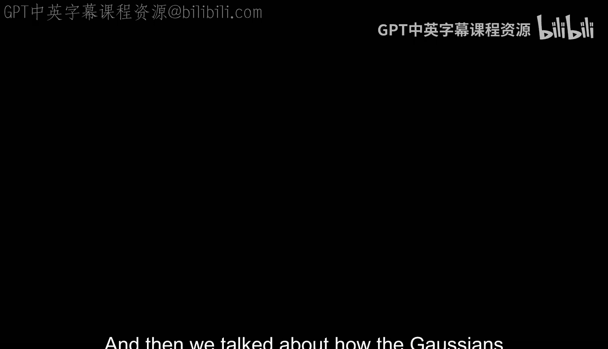

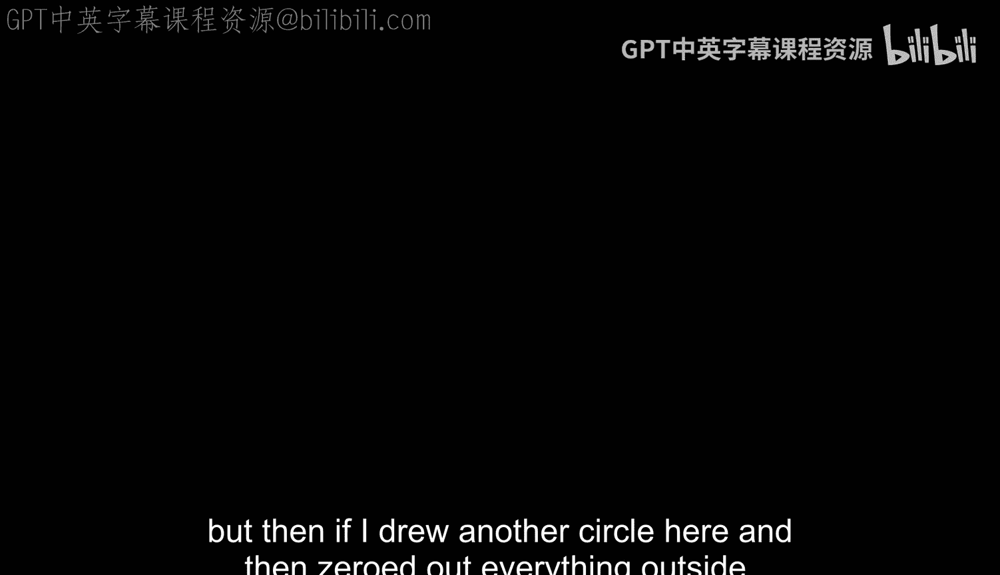

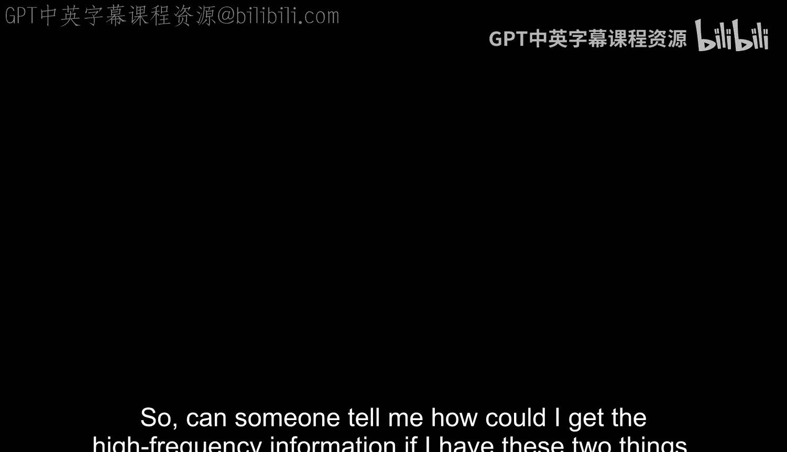

## 概述
在本节课中，我们将学习图像处理中的几个核心概念：如何利用拉普拉斯金字塔进行图像混合，如何使用模板匹配在图像中寻找特定模式，以及如何应用非局部滤波（如中值滤波和双边滤波）进行图像去噪。这些技术是构建更复杂计算机视觉应用的基础。

## 拉普拉斯金字塔与图像混合

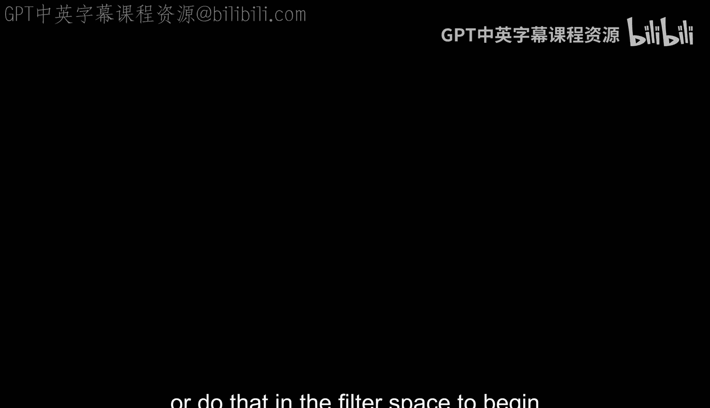

上一节我们介绍了傅里叶变换在频域分析图像的应用，本节中我们来看看如何在空间域通过多尺度分解来处理图像。

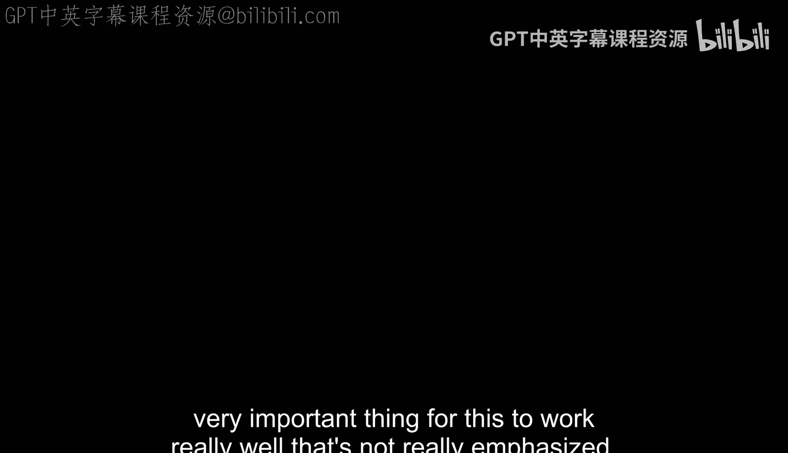

拉普拉斯金字塔是一种无损的图像多尺度表示方法。其核心思想是：通过不断对图像进行高斯模糊和下采样，构建一个高斯金字塔。然后，通过计算每一层与其上一层上采样后图像的差值，得到一系列带通图像，即拉普拉斯金字塔。

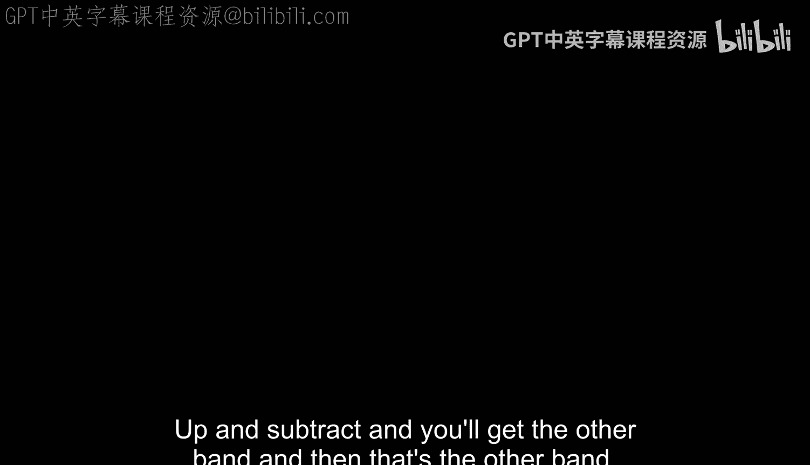

**公式**：对于高斯金字塔的第 `l` 层 `G_l`，其对应的拉普拉斯金字塔层 `L_l` 可以表示为：
`L_l = G_l - UpSample(G_{l+1})`
其中 `UpSample` 表示上采样操作。

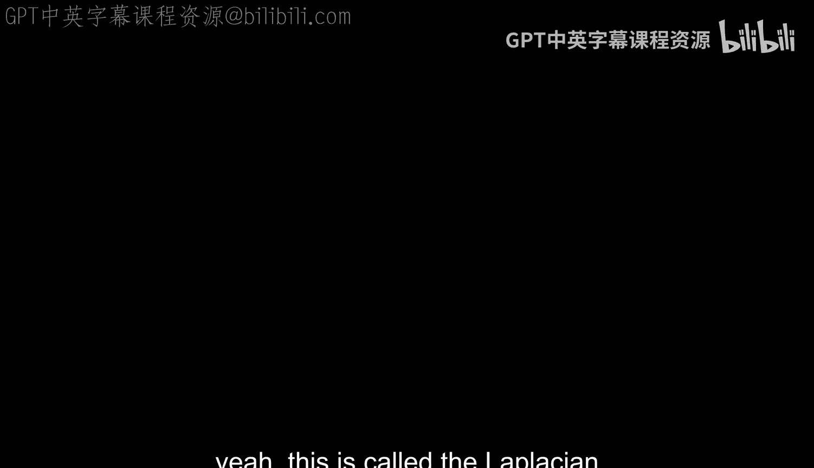

拉普拉斯金字塔的每一层都捕获了原始图像在特定频带内的信息。最高层（最小图像）是低频信息，而最底层（原始尺寸）是最高频的细节。通过保存最顶层的低频图像和所有拉普拉斯层，我们可以完美地重建原始图像。

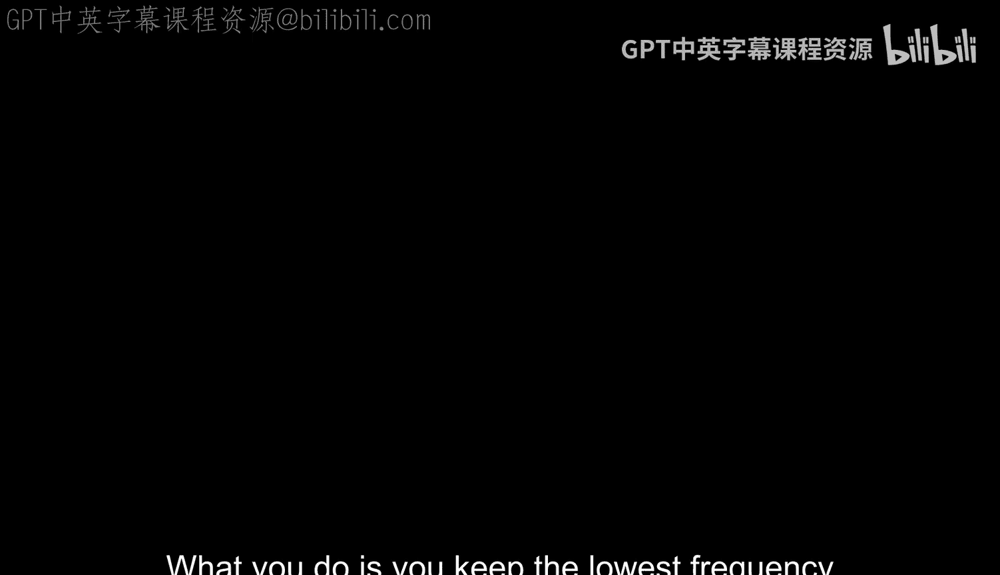

以下是构建拉普拉斯金字塔的步骤：
1.  从原始图像开始，构建高斯金字塔：不断应用高斯模糊并下采样（通常尺寸减半）。
2.  对于高斯金字塔的每一层（除了最顶层），将其上一层图像上采样到当前层尺寸。
3.  计算当前层高斯图像与上采样后图像的差值，得到拉普拉斯层。
4.  保存最顶层的高斯图像（最低频）和所有拉普拉斯层。

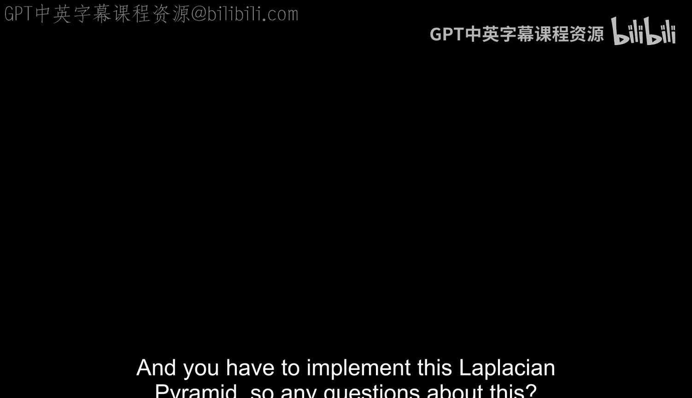

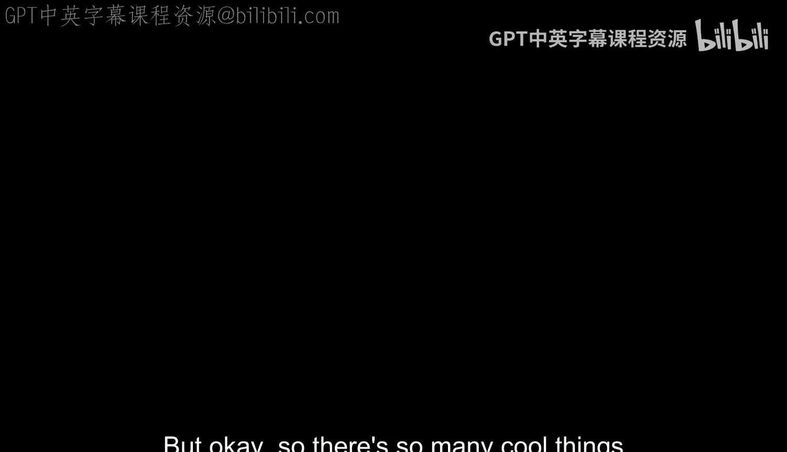

这种表示方法的一个经典应用是创建“混合图像”，例如达芬奇的名画《蒙娜丽莎》。研究表明，画作中人物的表情和视线方向在不同频率层上有所不同，当人眼在不同区域聚焦（感知不同频率）时，会产生神秘莫测的视觉效果。

## 基于金字塔的图像混合

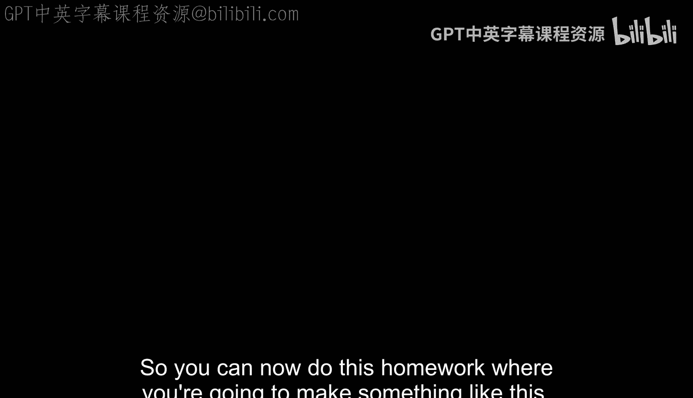

直接使用Alpha混合拼接两张图像时，如果过渡区域选择不当，会出现明显的接缝或重影。问题在于，单一的混合窗口宽度难以同时处理好大尺度特征（如避免切割物体）和小尺度细节（如避免重影）。

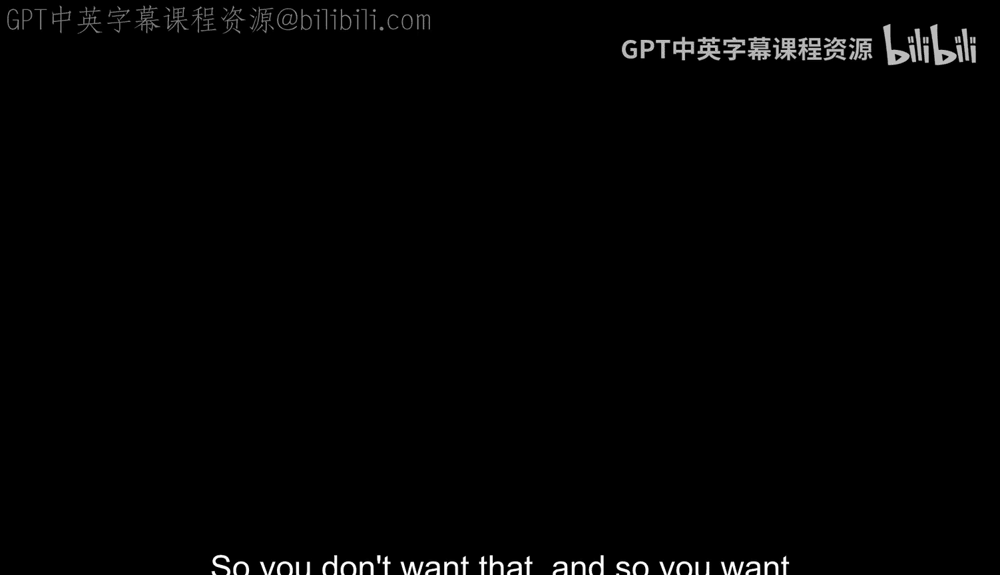

拉普拉斯金字塔为解决这一问题提供了优雅的方案。其核心思想是：在不同频率层上使用不同宽度的混合窗口。对于低频层（包含大尺度特征），使用宽而平滑的过渡；对于高频层（包含小尺度细节），可以使用更尖锐甚至二值的过渡。

以下是基于金字塔混合的步骤：
1.  为待混合的两张图像 `A` 和 `B` 分别构建拉普拉斯金字塔 `LA` 和 `LB`。
2.  创建一个二值掩码 `M`，定义混合区域（例如，左图为1，右图为0）。
3.  对掩码 `M` 构建高斯金字塔 `GM`。每一层的模糊程度递增，这自然地为不同频率层生成了不同平滑度的混合权重。
4.  在每一层 `l`，使用对应的权重进行混合：`LS_l = GM_l * LA_l + (1 - GM_l) * LB_l`。
5.  将混合后的拉普拉斯金字塔 `LS` 求和，重建出最终的无缝混合图像。

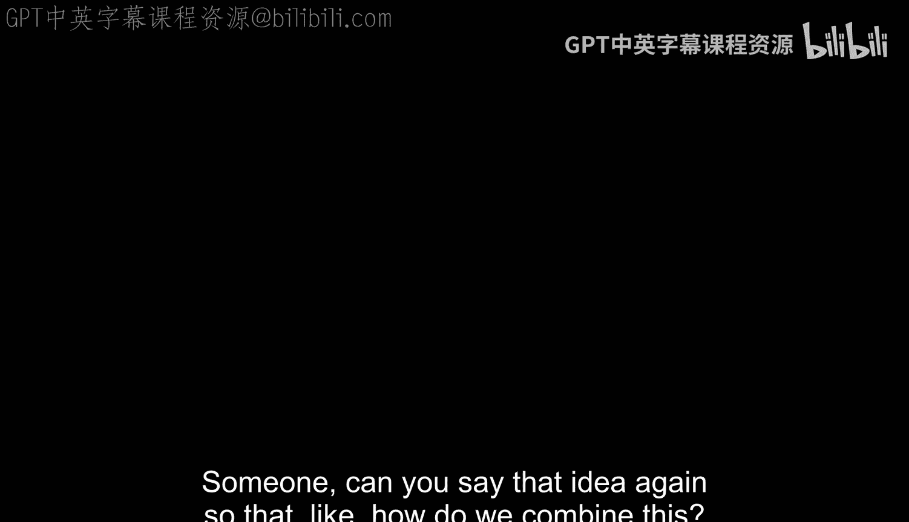

**简化方案**：在实际操作中，一个有效的简化是只使用两层：一个低频层（高斯模糊后的图像）和一个高频层（原始图像减去低频图像）。然后，低频层用平滑的Alpha权重混合，高频层则用二值权重混合。这种方法在图像拼接等任务中非常实用。

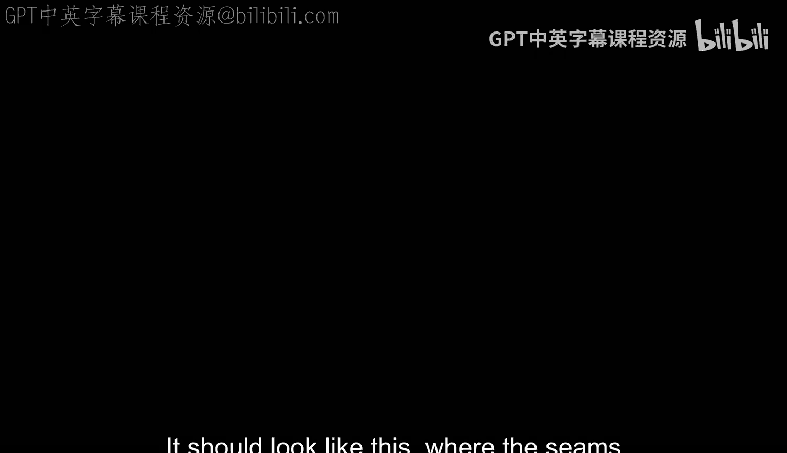

## JPEG压缩原理简介

图像压缩需要在不明显损失视觉质量的前提下减少数据量。JPEG标准采用了有损压缩，其核心是利用了人眼对图像不同频率成分的敏感度不同。

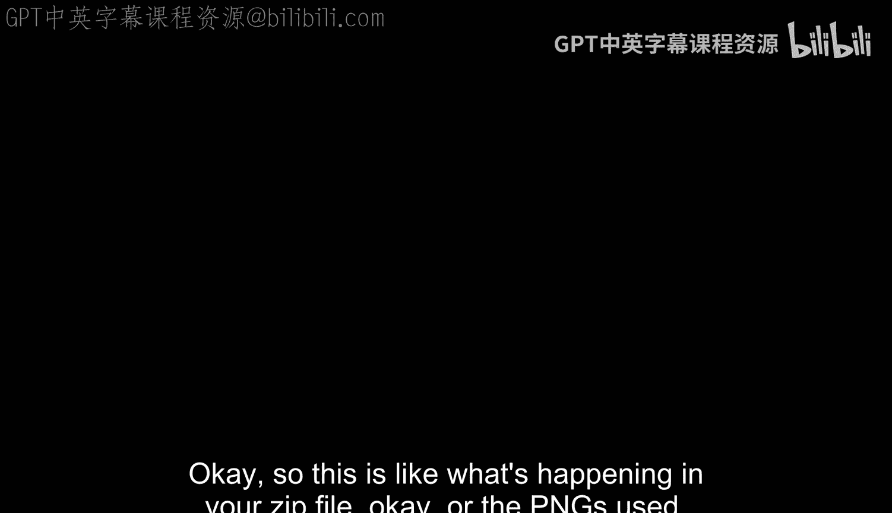

JPEG压缩的主要步骤如下：
1.  **色彩空间转换与下采样**：将图像从RGB转换到YCbCr色彩空间，并对色度通道（Cb, Cr）进行下采样，因为人眼对亮度变化更敏感，对颜色细节不敏感。
2.  **分块与DCT变换**：将亮度通道图像分割成 `8x8` 的像素块。对每个块进行离散余弦变换（DCT），将空间域信息转换到频域，得到 `8x8` 的DCT系数矩阵。左上角系数（DC系数）代表低频（平均亮度），向右下角移动，频率增高。
3.  **量化**：这是有损压缩的关键步骤。使用一个预设的量化表对DCT系数进行除法取整。量化表根据人眼视觉特性设计，对高频系数使用更大的除数，从而将许多高频系数归零，仅保留重要的低频信息。
4.  **编码**：对量化后的系数进行之字形扫描，将二维矩阵转换为一维序列，然后使用游程编码和霍夫曼编码进行无损压缩，进一步减少数据量。

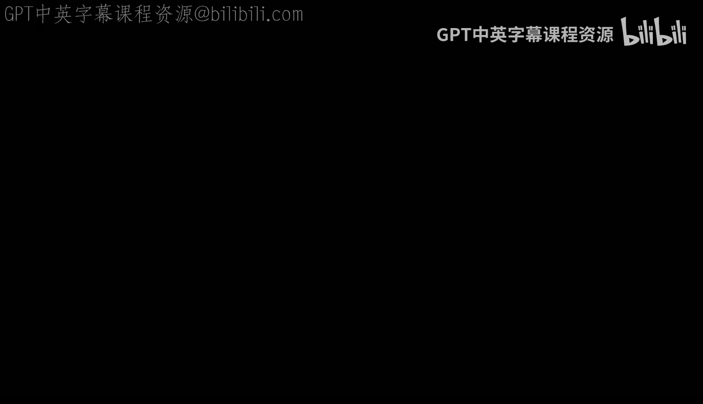

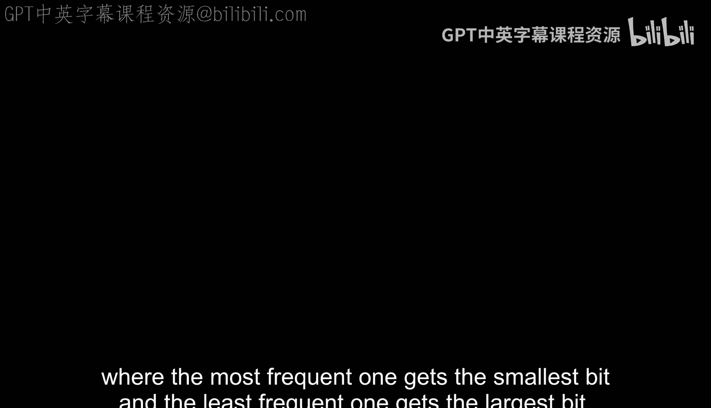

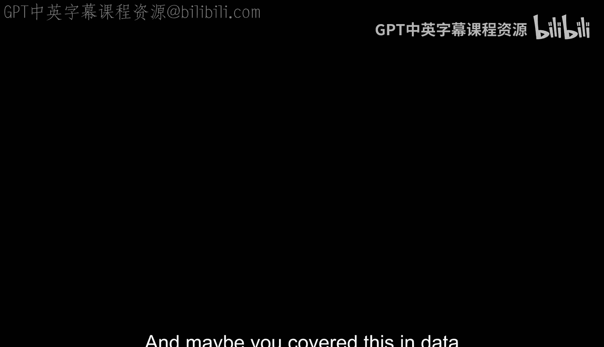

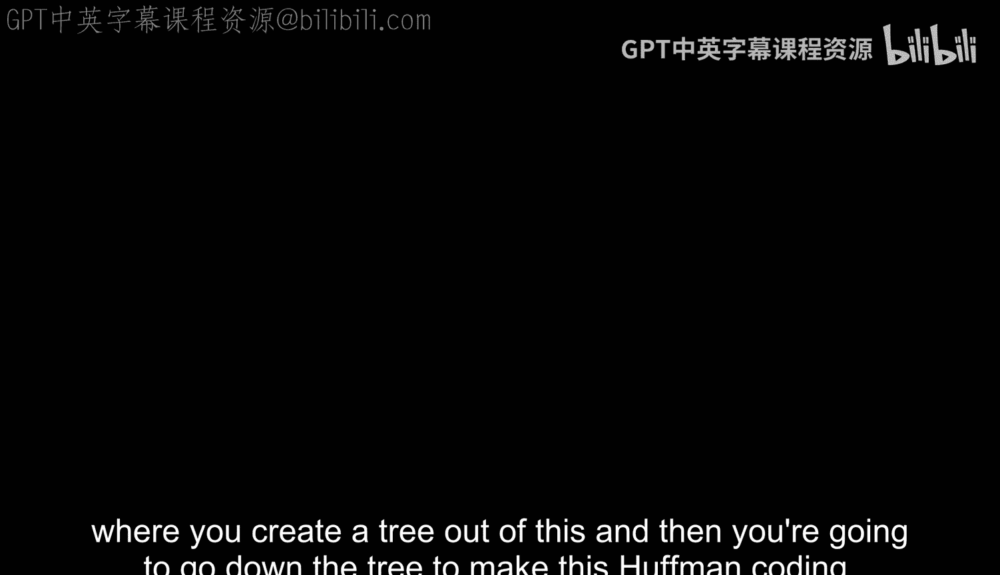

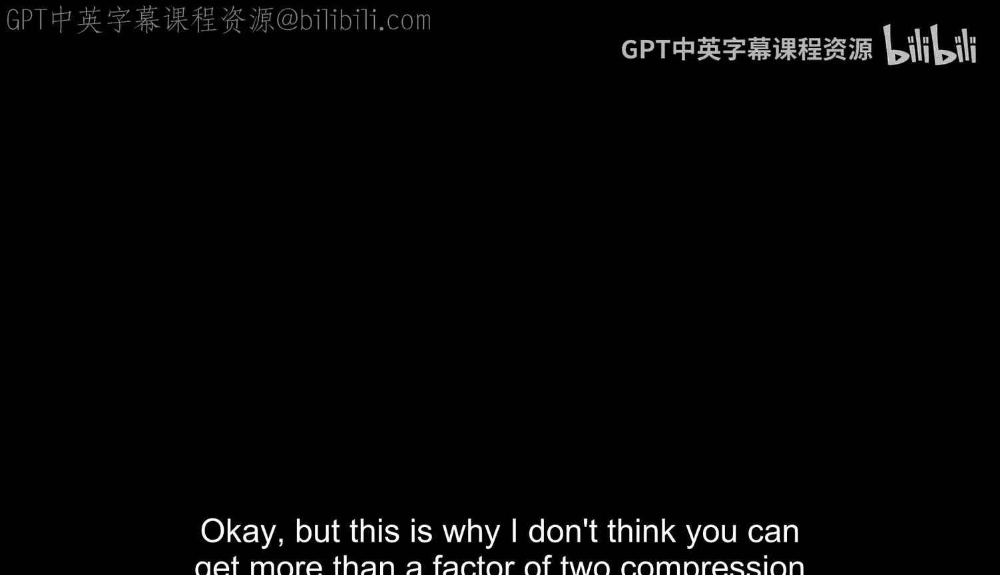

解压时，执行逆过程：解码、反量化、逆DCT变换、上采样色度通道并转换回RGB色彩空间。

## 模板匹配

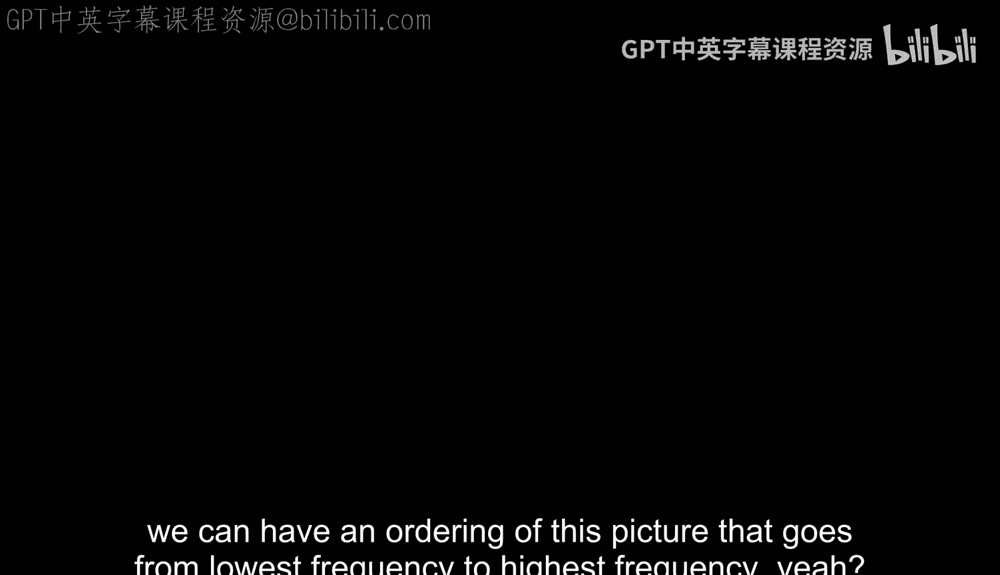

模板匹配的目标是在一幅大图像中定位与给定小模板图像最相似的区域。这可以看作是一种特殊的滤波操作。

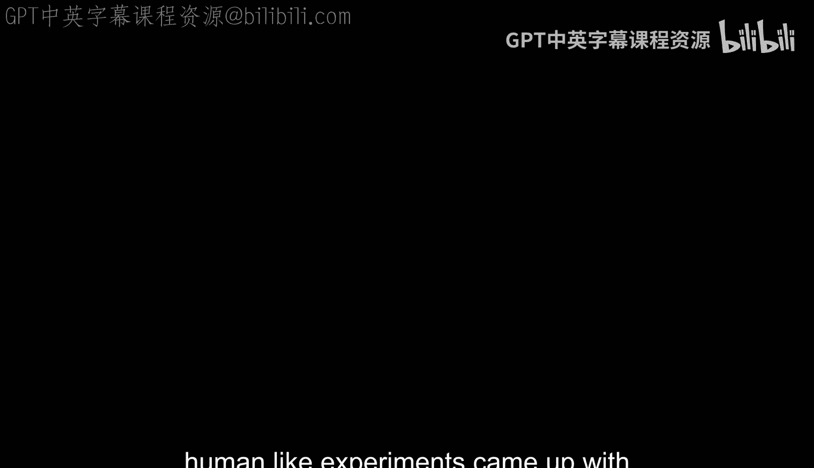

最简单的匹配方法是**直接互相关（Cross-Correlation）**：将模板作为卷积核在图像上滑动，计算每个位置的像素值点积。然而，如果模板和图像区域都是正值，这更像一个平滑滤波器，会对亮区产生强烈响应，而非特定模式。

更好的方法是使用**零均值互相关**：先将模板减去其均值，使其均值为零，这样它就更像一个边缘检测器（导数滤波器），对特定模式的响应更突出。

为了消除亮度变化的影响，需要使用**归一化互相关（Normalized Cross-Correlation, NCC）**。NCC同时减去了模板和图像局部区域的均值，并除以各自的标准差，从而对光照变化具有鲁棒性。

**公式**：在位置 `(u, v)` 的NCC响应 `R(u, v)` 近似为（实际计算中需对图像局部区域进行类似处理）：
`R(u, v) = sum_{x,y} [ (T(x,y) - μ_T) * (I(x+u, y+v) - μ_I(u,v)) ] / (σ_T * σ_I(u,v))`
其中 `T` 是模板，`I` 是图像，`μ` 和 `σ` 分别是均值和标准差。

## 非线性滤波去噪

线性滤波器（如高斯滤波器）在去除噪声的同时也会模糊边缘。非线性滤波器提供了更智能的去噪方式。

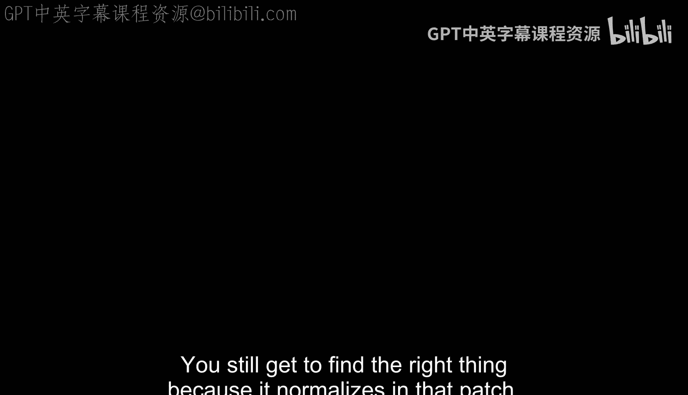

**中值滤波**：在滤波器窗口内，将所有像素值排序，取中值作为输出。中值滤波对“椒盐噪声”特别有效，因为它能完全滤除孤立的极值点（噪声），同时较好地保留边缘。**中值滤波是非线性的**。

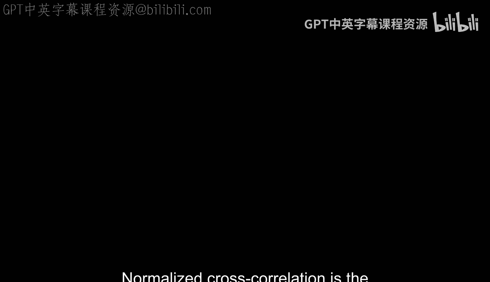

**双边滤波**：这是一种更先进的边缘保持滤波器。它结合了空间邻近度和像素值相似度两个权重。对于当前像素，其邻域内与它颜色越相近的像素，权重越大。这样，在平滑区域内部进行滤波时，不会跨越边缘去平均另一侧的像素值，从而在去噪的同时保持边缘清晰。

## 总结
本节课我们一起学习了多尺度图像处理的强大工具——拉普拉斯金字塔，并利用它实现了无缝的图像混合。我们还探讨了JPEG压缩如何利用频域变换和人眼视觉特性进行高效编码。在模板匹配部分，我们比较了不同匹配方法的优劣，理解了归一化对于光照鲁棒性的重要性。最后，我们介绍了中值滤波和双边滤波这两种非线性去噪技术，它们能在去除噪声的同时更好地保护图像细节和边缘。这些概念是图像处理和计算机视觉领域的基石。