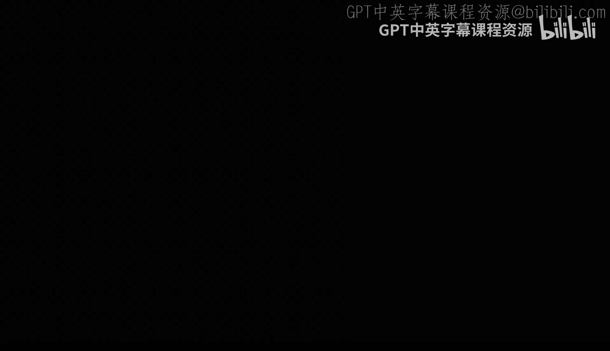
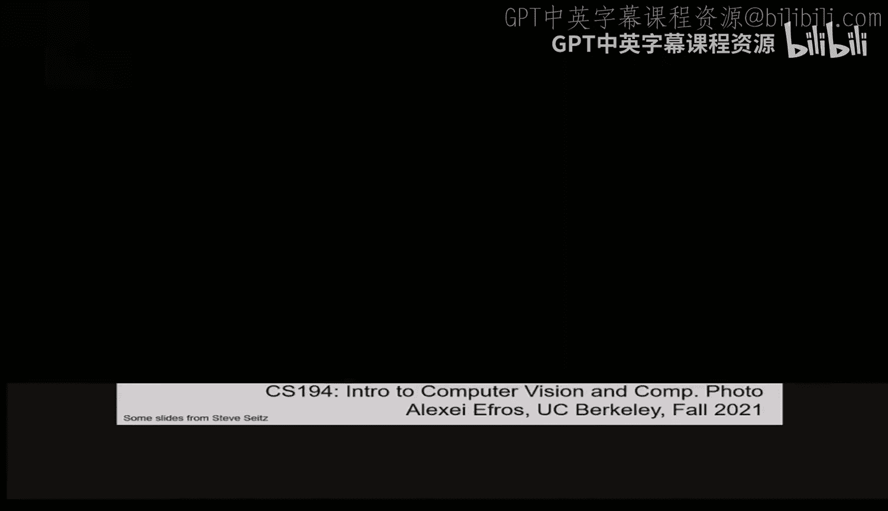
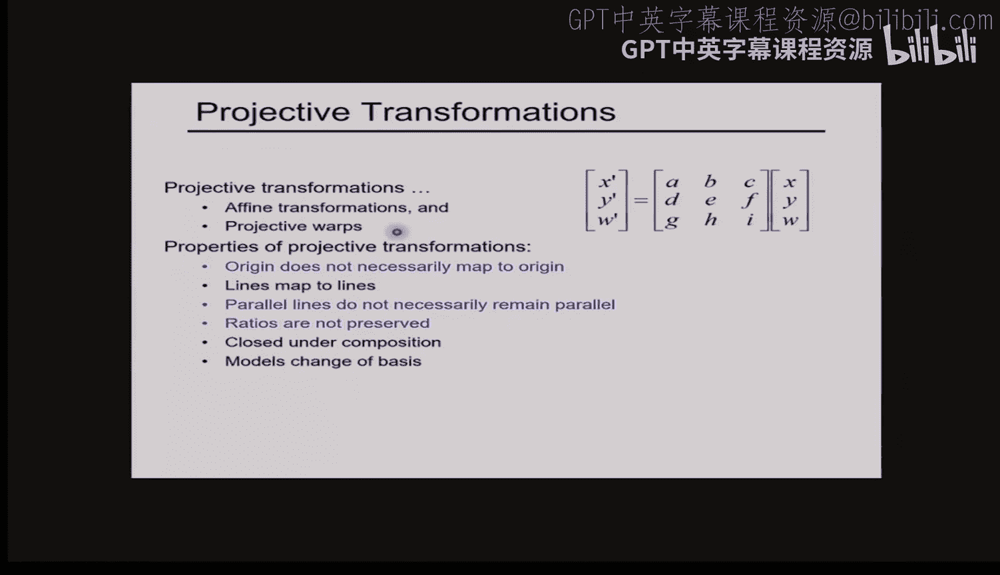

# 07：图像变换





在本节课中，我们将要学习图像变换。我们将探讨如何通过改变图像中像素的坐标位置，而非其亮度值，来对图像进行几何操作。这与我们之前学习的图像滤波（如模糊、锐化）有本质区别。

## 从一幅画说起

上一节我们介绍了图像滤波，它作用于图像的“值域”。本节中，我们来看看另一种变换，它作用于图像的“定义域”，即像素的坐标。

在伦敦国家美术馆，有一幅名为《大使们》的画作。画中除了两位富有的绅士和他们华丽的物品，还隐藏着一个死亡的象征——一个骷髅头。这个骷髅头只有在从画作右侧以特定角度斜视时才能看到。

在文艺复兴初期，这看起来像魔法。但今天我们知道，这只是一种图像变换。画家通过扭曲画布的局部区域，将信息“编码”在了一个特定的视角下。

## 图像变换的类型

图像变换主要分为两大类：
1.  **作用于值域的变换**：即图像滤波，公式为 `G(x) = T( F(x) )`。它改变像素的亮度值 `F(x)`，但不改变其坐标 `x`。
2.  **作用于定义域的变换**：即本节课的重点，公式为 `G(x) = F( T(x) )`。它改变像素的坐标 `x`，但保持其原始的亮度值 `F` 不变。

当然，这两种变换可以组合使用。但今天，我们将专注于定义域的变换。

## 参数化（全局）变换

我们将首先关注一类特殊的变换：**参数化**或**全局**变换。这意味着对于图像中的每一个点 `P`，我们都应用同一个变换公式 `T` 来得到新点 `P'`。

更具体地说，在本讲中，我们假设变换 `T` 是**线性**的。这意味着变换可以用一个矩阵 `M` 来表示：

`P' = M * P`

其中，`P` 是原始坐标 `[x, y]`，`P'` 是变换后坐标 `[x', y']`，`M` 是一个 `2x2` 矩阵。

以下是几种基本的 `2x2` 线性变换：

*   **缩放**：改变图像的大小。
    *   矩阵形式：`S = [[a, 0], [0, b]]`
    *   逆变换：`S_inv = [[1/a, 0], [0, 1/b]]`
*   **旋转**：将图像绕原点旋转一个角度 `θ`。
    *   矩阵形式：`R = [[cosθ, -sinθ], [sinθ, cosθ]]`
    *   逆变换：`R_inv = R^T` (转置矩阵)
*   **剪切**：使图像在一个方向上发生倾斜。
    *   示例矩阵：`[[1, k], [0, 1]]` (沿x轴剪切)
*   **镜像**：沿某条线翻转图像。
    *   示例：`[[-1, 0], [0, 1]]` (沿y轴镜像)

**重要性质**：所有 `2x2` 矩阵表示的线性变换，都可以分解为上述四种基本变换（缩放、旋转、剪切、镜像）的组合。它们具有以下共性：
*   原点 `(0,0)` 映射后仍是原点。
*   直线映射后仍是直线。
*   平行线映射后仍保持平行。
*   这些变换在组合运算下是封闭的。

## 变换的另一种视角：基变换

理解线性变换的另一个强大视角是**改变基向量**。

想象我们有一个点 `Q`。在标准笛卡尔坐标系（基向量 `i=[1,0]`, `j=[0,1]`）中，我们将其坐标写为 `(4,3)`，意思是 `4*i + 3*j`。

现在，假设我们有一个新的坐标系，其基向量是 `u` 和 `v`（不一定是正交的）。在同一点 `P` 在这个新坐标系下的坐标也可能是 `(4,3)`，但此时它表示 `4*u + 3*v`。显然，这两个 `(4,3)` 代表空间中不同的点。

那么，如何将一个点从 `UV` 坐标系转换到 `IJ`（笛卡尔）坐标系呢？很简单：

`[x_I, y_I]^T = [u, v] * [x_U, y_U]^T`

这里，矩阵 `[u, v]` 的列就是基向量 `u` 和 `v` 在笛卡尔坐标系下的坐标。**这意味着任何一个 `2x2` 矩阵，都可以看作是将点从某个特定坐标系（其基向量就是矩阵的列）转换到标准笛卡尔坐标系的变换。**

反过来，从笛卡尔坐标系转换到 `UV` 坐标系，则需要用到该矩阵的逆矩阵：`M_inv`。

如果要在任意两个坐标系 `UV` 和 `WZ` 之间转换，我们可以先通过矩阵 `M1` 从 `UV` 转到笛卡尔系，再通过 `M2_inv` 从笛卡尔系转到 `WZ` 系，组合矩阵为 `M2_inv * M1`。

**特殊情形**：如果新坐标系的基向量是**正交**的（即 `u·v=0` 且 `|u|=|v|=1`），那么变换矩阵就是一个旋转矩阵，其逆矩阵就是其转置矩阵，计算非常方便。

## 引入平移：齐次坐标

到目前为止，我们的 `2x2` 矩阵变换有一个重大缺陷：**无法表示平移**。因为平移需要加法 `x' = x + t_x`，而矩阵乘法只能实现乘法和加法组合，无法直接加一个常数项。

解决方案是一个巧妙的“技巧”：**使用齐次坐标**。我们给二维点 `[x, y]` 增加一个维度，写成 `[x, y, 1]`。这样，我们就可以用一个 `3x3` 矩阵来表示包含平移的变换了：

```
[x']   [a  b  t_x]   [x]
[y'] = [c  d  t_y] * [y]
[1 ]   [0  0   1 ]   [1]
```

计算后，我们得到 `x' = a*x + b*y + t_x`，`y' = c*x + d*y + t_y`。看，平移项 `t_x` 和 `t_y` 出现了！

在齐次坐标中，`[x, y, 1]` 和 `[k*x, k*y, k]` (k≠0) 表示同一个二维点 `(x, y)`。通常我们使用 `w=1` 的规范形式。如果从 `w=1` 开始，并且变换矩阵最后一行为 `[0, 0, 1]`，那么结果点的 `w` 坐标将保持为 `1`。

## 仿射变换与投影变换

使用齐次坐标后，我们得到了一类更强大的变换：**仿射变换**。它包含了所有线性变换（缩放、旋转、剪切）和平移，共有 `6` 个自由度（参数 `a, b, c, d, t_x, t_y`）。

仿射变换的性质与线性变换大部分相同，但有一个关键区别：**原点不再必须映射到原点**，因为我们可以平移它了。仿射变换仍然保持直线的“直”性和平行性。

如果我们把变换矩阵中最后一行 `[0, 0, 1]` 的零也替换成其他值 `[g, h, i]`，就得到了更一般的**投影变换**（或单应性变换）。

```
[x']   [a  b  c]   [x]
[y'] = [d  e  f] * [y]
[w']   [g  h  i]   [1]
```

投影变换包含了仿射变换，并增加了**投影扭曲**的能力。它不再保持平行性，但保持直线的“直”性。这正是《大使们》画作中用来隐藏骷髅头的那种变换，也是计算机视觉中用于校正透视畸变的核心工具。

## 总结

本节课中我们一起学习了图像几何变换的核心概念。
1.  我们区分了作用于值域（滤波）和定义域（几何变换）的两种变换。
2.  我们从最简单的 `2x2` 线性变换（缩放、旋转、剪切）开始，理解了其矩阵表示和性质。
3.  我们从基变换的角度重新解读了线性变换，加深了理解。
4.  为了解决平移问题，我们引入了**齐次坐标**这个关键概念，将变换统一用 `3x3` 矩阵表示。
5.  最后，我们介绍了**仿射变换**（线性+平移）和更一般的**投影变换**，后者是许多计算机视觉应用的基础。



掌握这些变换的数学表示和性质，是进行图像拼接、透视校正、增强现实等后续高级操作的关键第一步。