# 09：数据驱动方法之人脸分析

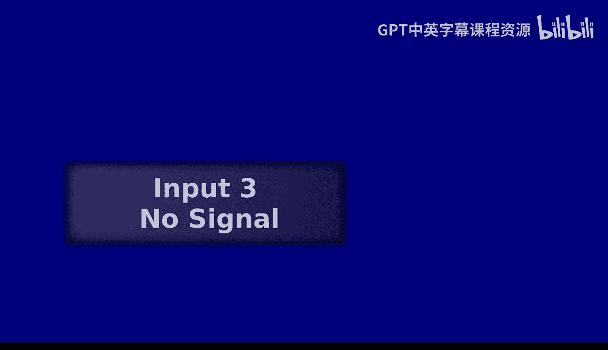

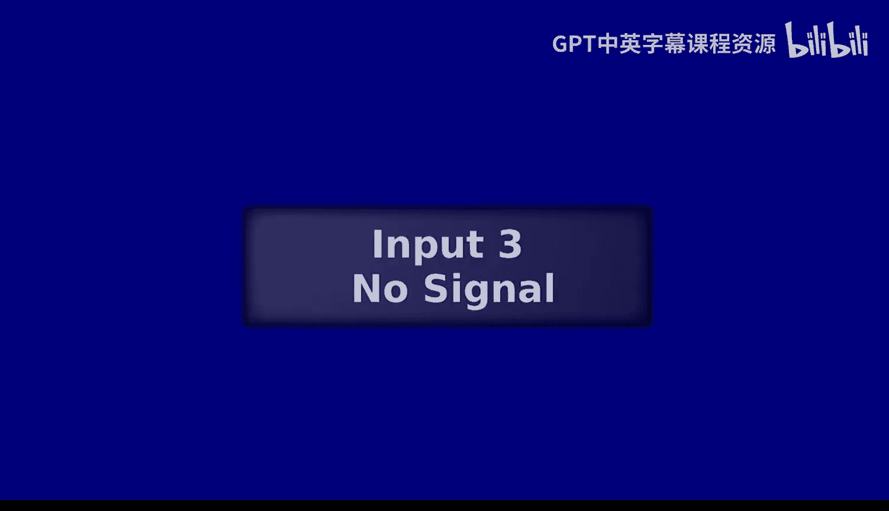

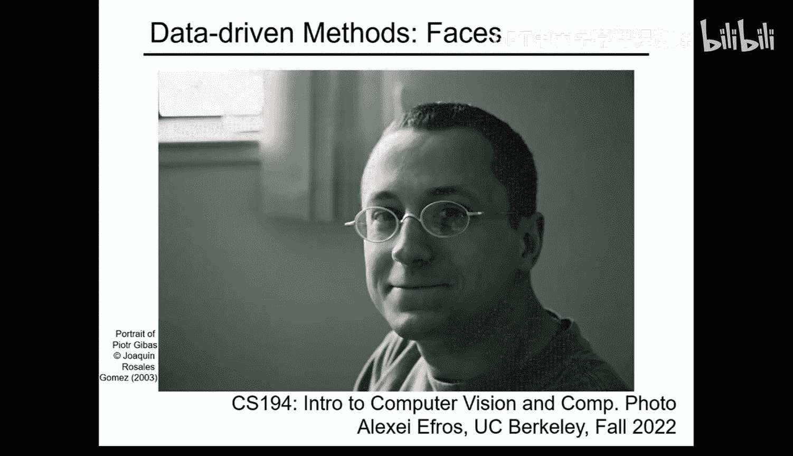

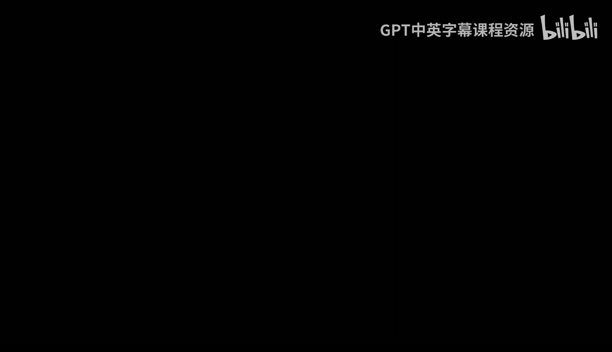

在本节课中，我们将学习如何利用大量数据，特别是人脸图像，来驱动计算机视觉任务。我们将从最简单的数据使用方法——计算平均值开始，逐步探讨对齐、子群均值、偏离均值等核心概念，并了解如何利用这些概念进行人脸分析和操作。

## 从平均值开始 📊

上一节我们介绍了图像变形技术。本节中，我们来看看数据驱动方法中最基础的一步：计算平均值。

平均值是一个强大的统计工具。当我们拥有大量数据时，平均值能提供最核心的信息。在图像处理中，对一系列图像帧进行时间平均，可以揭示出场景中静止的背景部分。

例如，对斯普劳尔广场监控摄像头拍摄的连续帧进行平均，会得到一个没有行人的场景图像。这是因为行人在移动，他们在每个像素位置出现的时间很短，而静止的背景（如红砖）占据了绝大部分时间。因此，在平均图像中，移动的物体被“抹去”，只留下背景。

**公式**：平均图像 `mean_image` 可以通过对 N 帧图像 `frame_i` 的每个像素值进行平均得到：
`mean_image(x, y) = (1/N) * Σ(frame_i(x, y))`

这个原理与摄影中的长时间曝光类似。通过设置长曝光，相机在感光元件上对光线进行时间平均，同样可以消除移动的物体，只留下静止的背景。

## 对齐的重要性 🎯

然而，简单地平均图像并不总是有效。如果图像中的物体没有对齐，平均结果会变得模糊。这是因为我们错误地将不同物体的像素混合在了一起。

以下是确保有效平均的两个关键要求：

1.  **对齐**：我们需要确保在平均时，不同图像中对应的物体（如鼻子、眼睛）位于相同或相似的像素位置。
2.  **线性子空间**：我们平均的对象应该属于同一个“类别”，使得它们的平均值本身也是一个有效的、有意义的对象。例如，平均两张不同的脸是有意义的，但平均一张脸和一个背包则没有意义。

对齐是实现“苹果对苹果”平均的关键。幸运的是，我们不需要对齐图像中的每一个点。由于视觉世界是平滑的，对齐一些关键特征点（如眼角、嘴角）通常就足以使图像的大部分区域对齐。

## 构建平均人脸 😶

现在，让我们将上述概念应用到人脸上。为了计算一个有意义的平均人脸，我们需要一个带有关键点标注的人脸数据集。每个关键点（如左眼、鼻尖）在所有图像中都有相同的编号和语义。

我们拥有两种信息：
*   **外观向量**：图像的RGB像素值。
*   **形状向量**：所有关键点的 (x, y) 坐标。

计算平均人脸的步骤如下：
1.  计算所有图像形状向量的平均值，得到**平均形状**。
2.  将数据集中的每一张人脸图像，根据其自身的形状向量**变形**到上一步计算出的平均形状上。这使得所有人脸在几何上对齐。
3.  对所有已对齐的人脸图像的像素值进行平均，得到**平均外观**。

最终得到的平均人脸图像通常看起来对称、皮肤光滑，甚至比大多数个体更“好看”。这是因为平均过程消除了个体特有的瑕疵（如痘痘、痣），并且由于大数定律，结果趋于对称。

## 利用均值进行分析 🔍

一旦我们有了对齐的数据和均值，就可以进行更深入的分析。主要有两种方式：

### 子群均值

我们可以将整个人群划分为不同的子群（例如，按性别、年龄、情绪），然后分别计算每个子群的平均人脸。这能揭示不同群体之间的系统性差异。

**公式**：子群均值 `subgroup_mean` 的计算方式与总体均值相同，但仅使用属于该子群的图像 `S`：
`subgroup_mean(x, y) = (1/|S|) * Σ_{i in S}(frame_i(x, y))`

通过比较“男性平均脸”和“女性平均脸”，我们可以得到一个向量，这个向量描述了从男性特征向女性特征变化的方向。

### 偏离均值

另一种强大的分析是观察个体与平均值的差异。这被称为“偏离均值”或“残差”。

**公式**：对于个体图像 `individual_image` 和平均图像 `mean_image`，其偏离为：
`delta = individual_image - mean_image`

这个 `delta` 向量编码了使该个体与众不同的特征。在监控场景中，这就是“背景减除”算法，用于检测移动物体。在人脸分析中，这可以用来创建**漫画像**。

漫画像的原理是：将个体与平均值的差异 (`delta`) 进行**外推**（即放大）。例如，如果某人的鼻子比平均鼻子长，漫画像就会将其鼻子画得更长。

**代码概念**：生成漫画像可以表示为：
`caricature = mean_image + α * delta`，其中 `α > 1`。

需要注意的是，基于线性子空间的假设只在 `delta` 被适度放大时有效。过度外推会导致不真实的结果，因为真实的人脸变化并非完全线性。

## 线性子空间与基表示 📐

人脸图像在对齐后，可以近似认为分布在一个线性子空间中。这意味着，任何一张新人脸都可以表示为数据集中某些“基人脸”的线性组合。

更优的方法是使用**主成分分析 (PCA)**。PCA 会自动从数据中学习一组**特征向量**（在图像中常被称为**特征脸**），这些特征向量按照能解释数据方差的大小排序。

*   第一个主成分通常是均值脸。
*   后续的主成分则捕获数据中的主要变化模式，例如光照方向、头发颜色、面部宽度等。

通过 PCA，我们可以用一组系数（`alpha` 向量）来紧凑地表示任何一张对齐的人脸。只需几百个这样的系数，就足以高精度地重建或表示一个新的人脸。这证明了人脸空间的维度相对较低。

## 综合应用：人脸操作实例 🎬

结合对齐、子群均值和 PCA 模型，我们可以实现强大的人脸操作。给定一个输入人脸，我们可以通过在其 PCA 系数上添加从子群均值差中计算出的方向向量，来改变其属性。

例如：
*   **改变性别**：添加（女性平均脸 - 男性平均脸）的方向向量。
*   **改变年龄**：添加（老年人平均脸 - 年轻人平均脸）的方向向量。
*   **改变表情**：添加（微笑平均脸 - 中性平均脸）的方向向量。

这些操作可以在形状空间、外观空间或两者同时进行。早期（例如1999年）的研究已经能够利用一个由200张人脸构建的3D模型，对新的人脸（如汤姆·汉克斯）进行拟合，然后通过调整模型参数使其“变老”，展示了数据驱动方法的潜力。

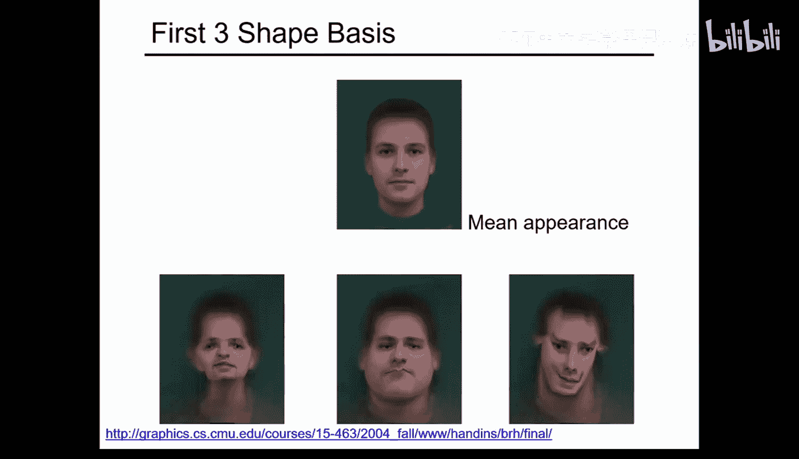

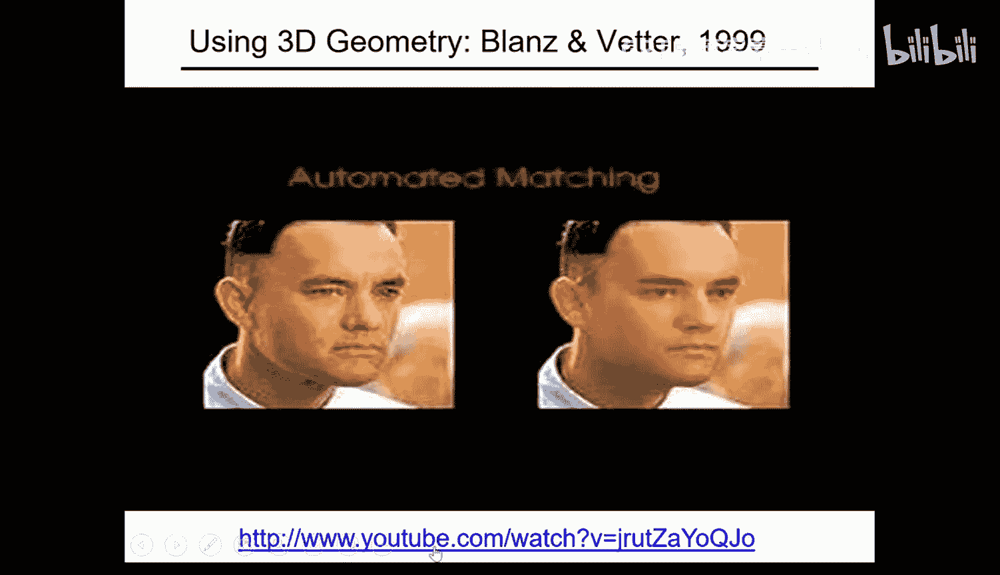

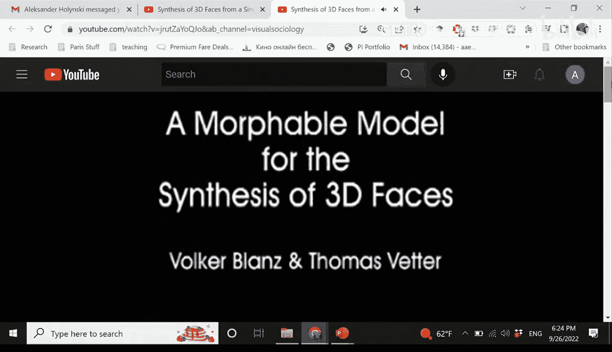

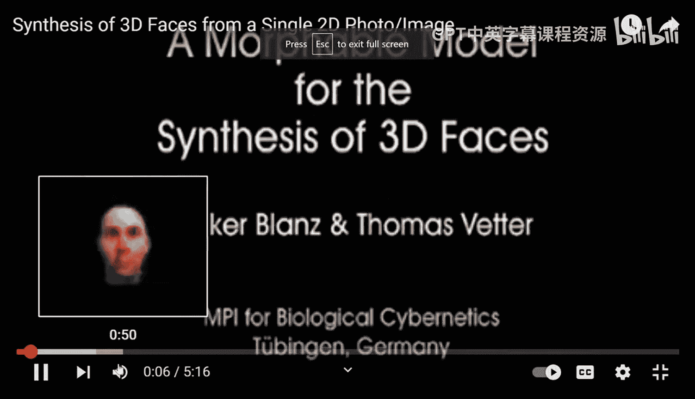

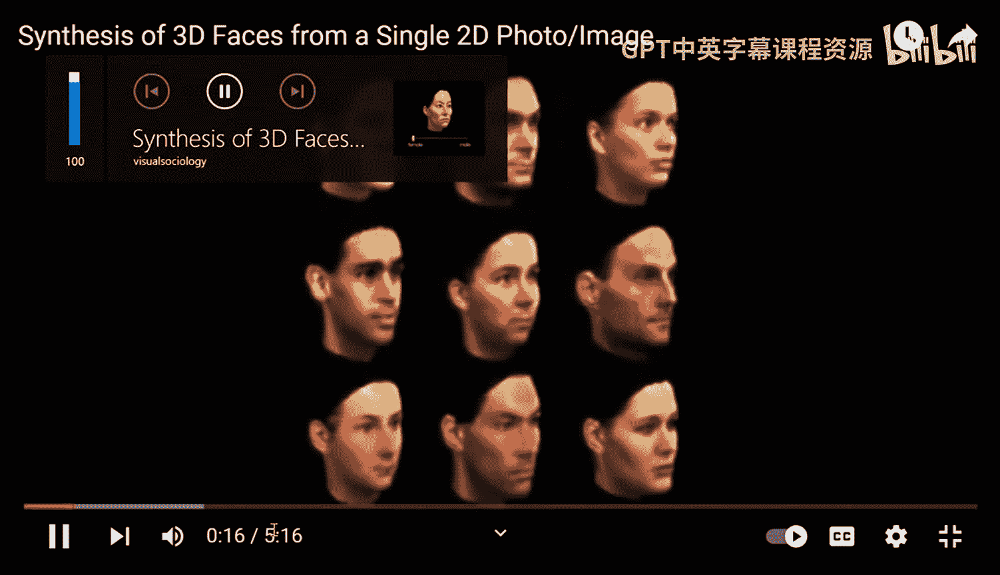

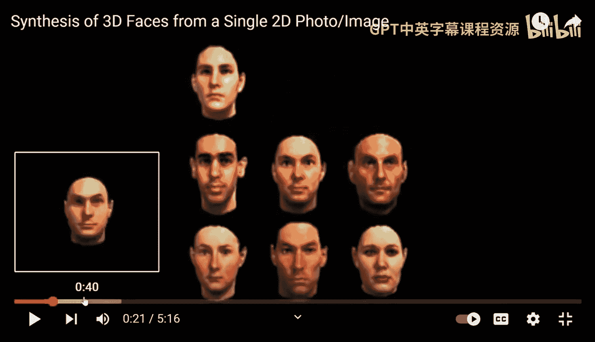

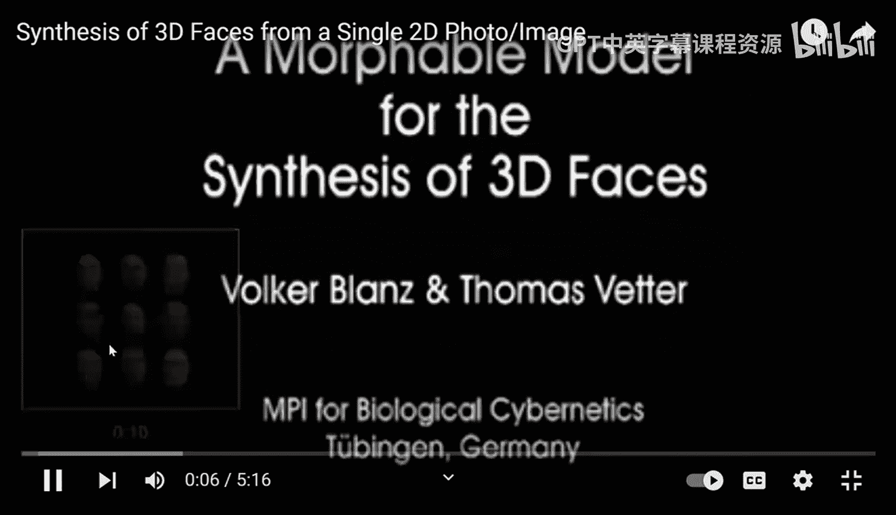

## 总结 📝

本节课中我们一起学习了数据驱动方法在人脸分析中的应用。我们从计算图像平均值这个简单而强大的概念出发，认识到**对齐**是进行有意义的比较和平均的前提。通过计算**子群均值**，我们可以捕捉不同类别间的特征差异。分析个体与均值的**偏差**，则能揭示独特特征并用于生成漫画像。

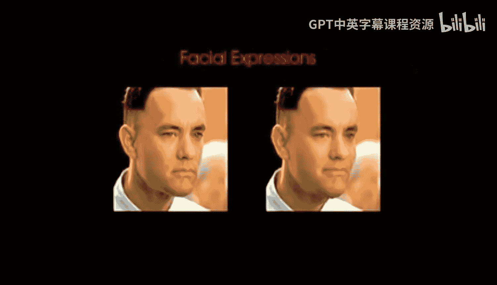

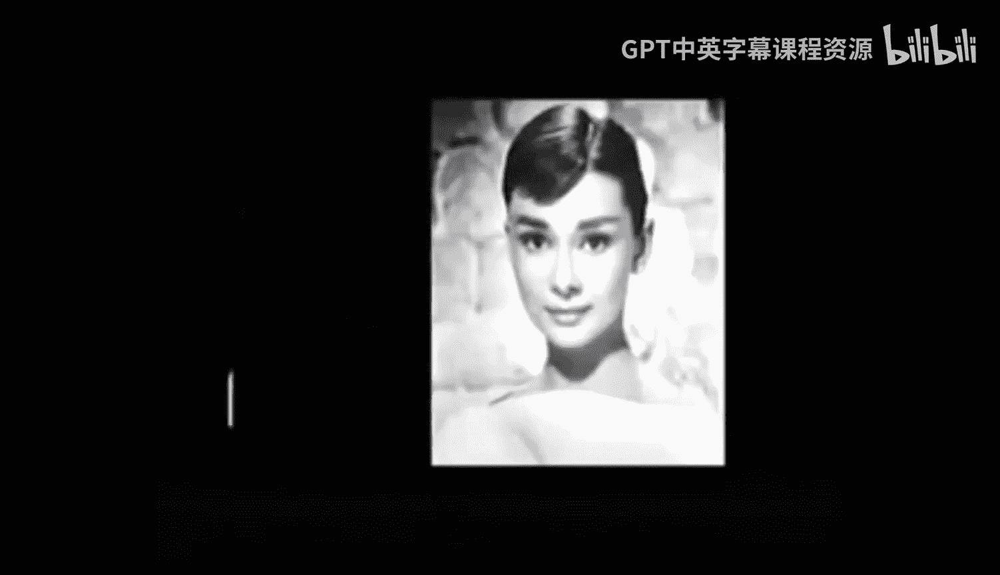

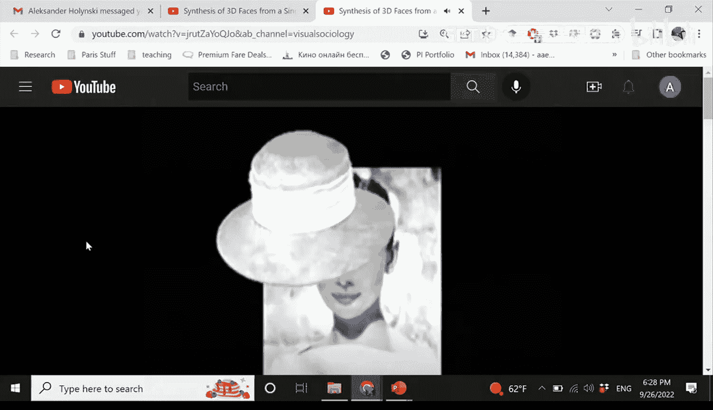

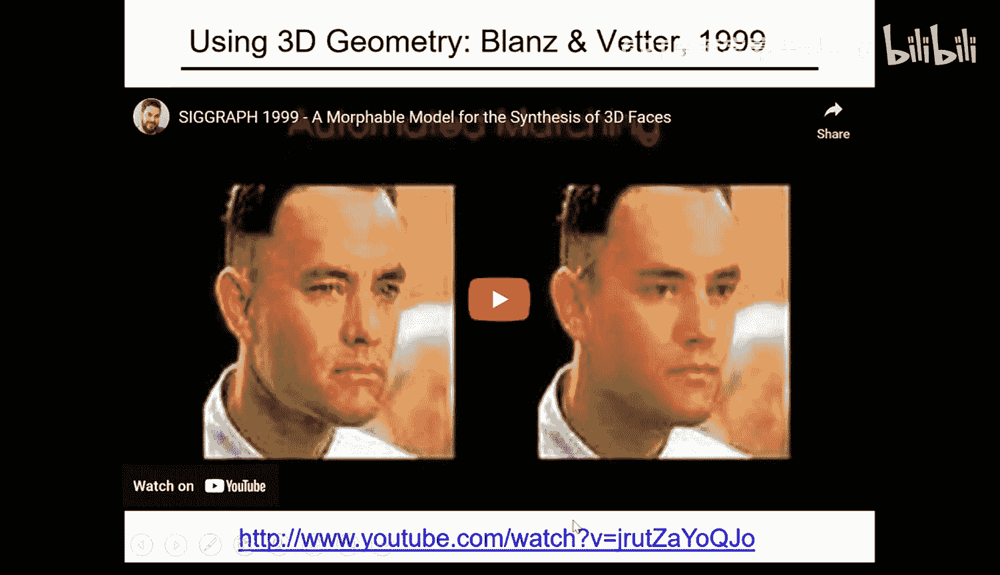

最后，我们了解到对齐后的人脸构成了一个**线性子空间**，可以用**主成分分析 (PCA)** 和**特征脸**来高效表示。这使得复杂的人脸属性操作（如改变年龄、性别）可以通过简单的向量运算来近似实现。这些原理构成了许多现代人脸处理技术的基础。