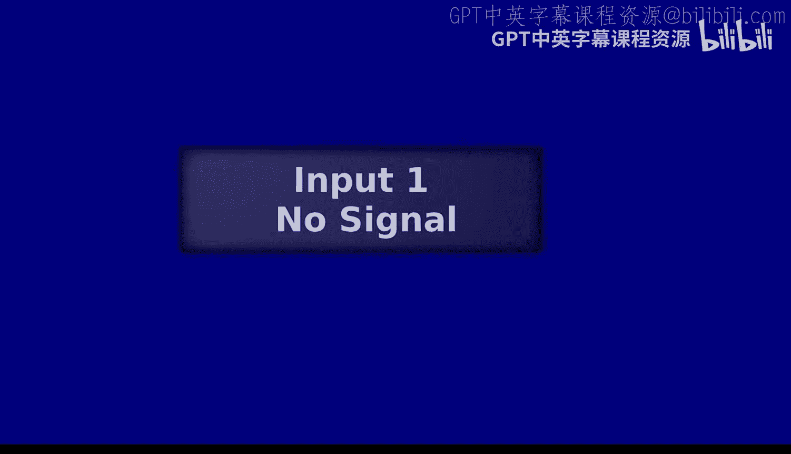
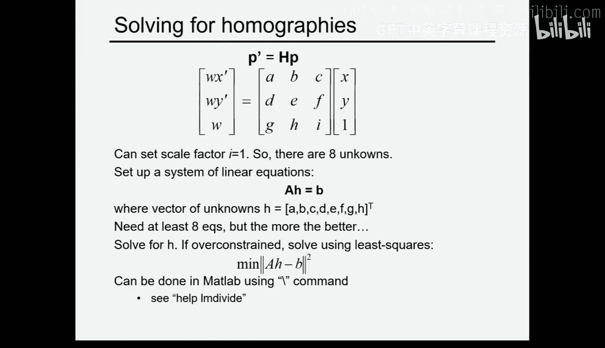
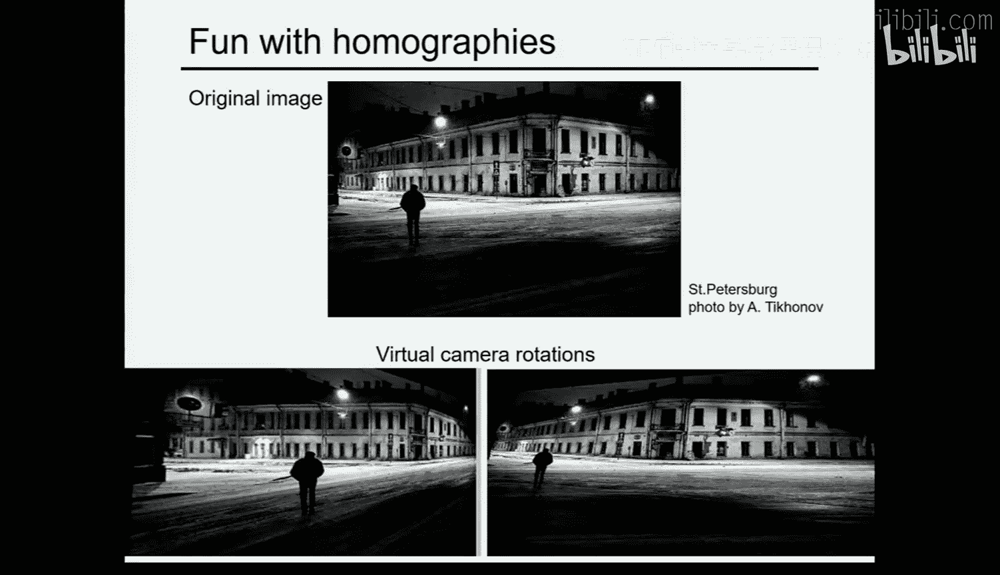
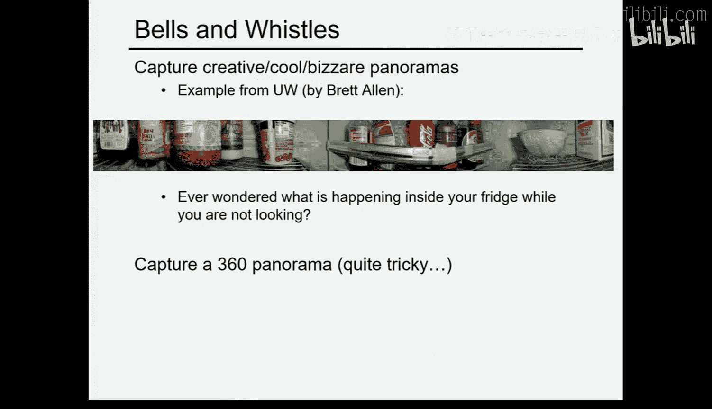
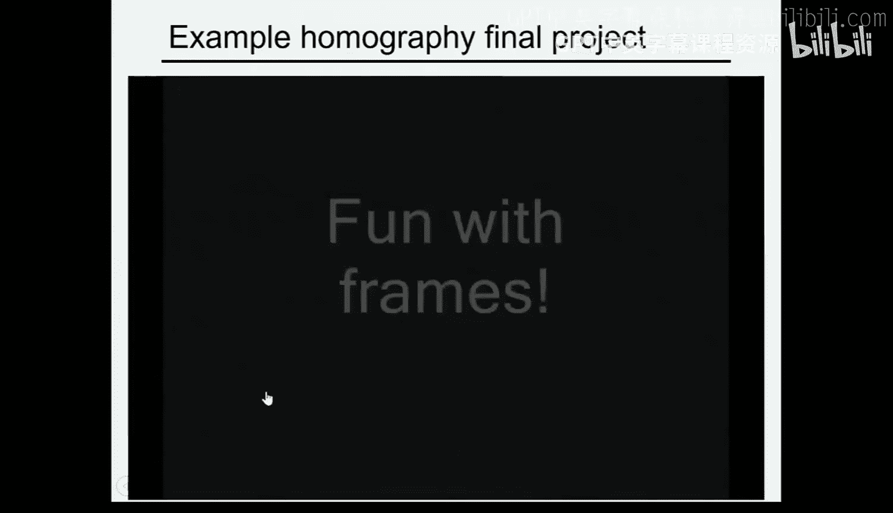
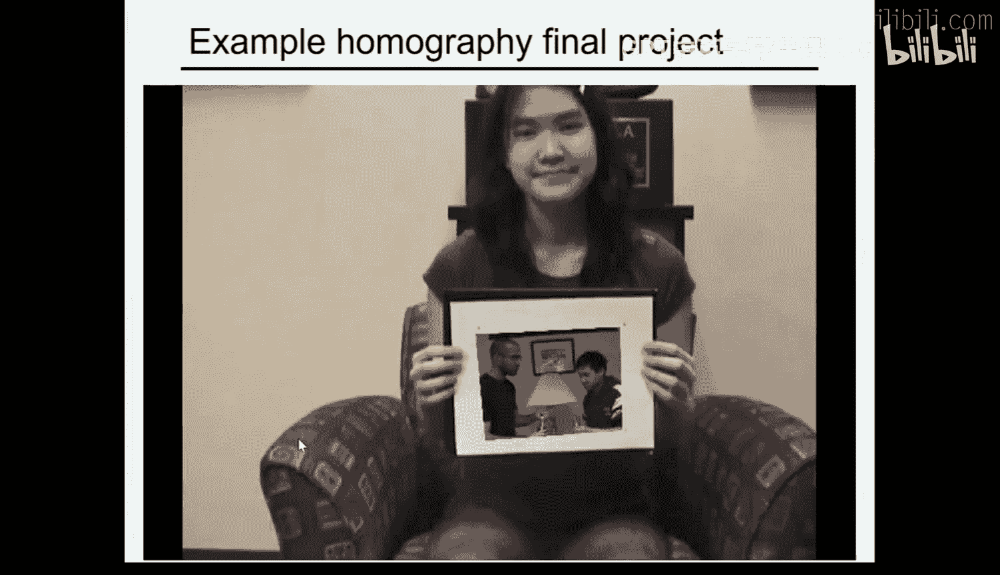
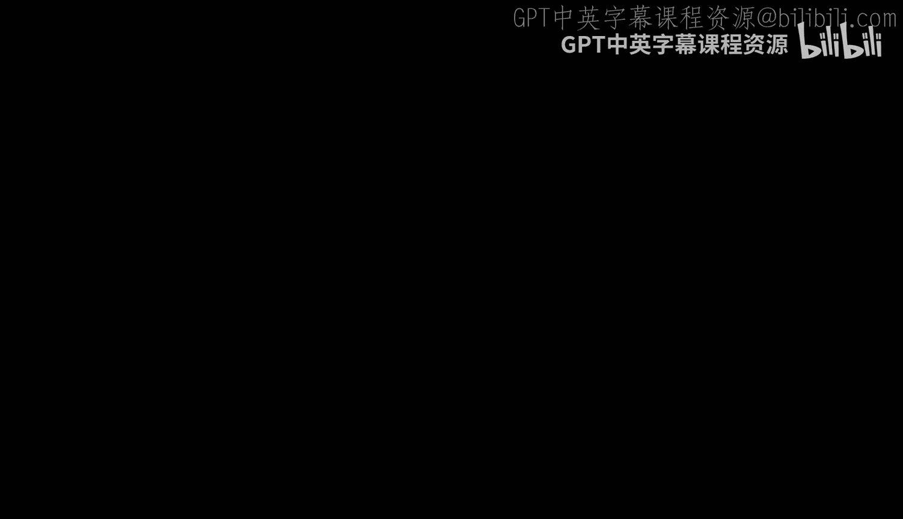
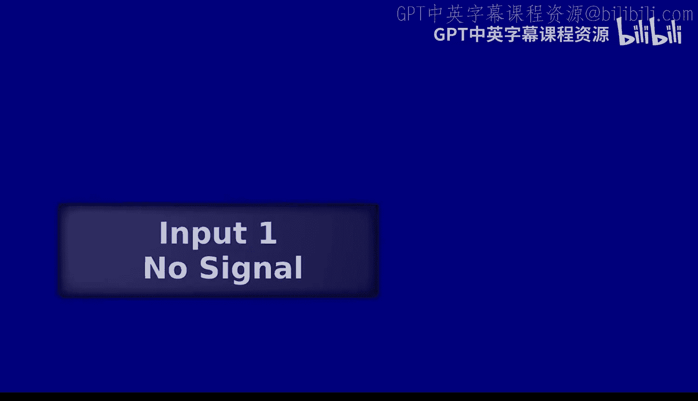

# 11：单应性与全景图拼接




## 概述
在本节课中，我们将要学习单应性（Homography）的概念及其在图像拼接和全景图生成中的应用。我们将从理解光线和视觉感知的基本原理开始，逐步深入到如何利用单应性变换来合成新的视角和创建无缝的全景图像。

---

## 全光函数：我们能看到的一切

上一节我们回顾了相机如何将三维世界投影到二维图像上。本节中，我们来看看如何从理论上描述“所有可能看到的景象”。

这个理论概念被称为**全光函数**。它试图枚举一个观察者在任何位置、任何时间、从任何方向所能看到的所有光线。

### 构建全光函数
以下是构建全光函数的步骤：

1.  **静止的单眼观察者**：想象一个闭上一只眼睛、静止不动的人。他此刻看到的所有光线，构成了一个通过他眼睛这个“针孔”的**光线锥**。这个光线锥可以用球面坐标（θ, φ）来参数化，它是一个二维函数，输入一个方向，输出该方向的光线强度。这本质上就是一张**图像**。

2.  **加入颜色（波长）**：如果我们考虑不同颜色的光（不同波长），这个函数就变成了三维的：`f(θ, φ, λ)`。

3.  **加入时间**：世界是动态的。为了捕捉观察者的完整视觉体验，我们需要加入时间维度 `t`。此时，函数 `f(θ, φ, λ, t)` 描述了一个固定点观察者看到的**彩色视频**。

4.  **加入观察者位置**：最后，为了让函数能描述“所有可能看到的景象”，我们加入观察者在三维空间中的位置 `(X, Y, Z)`。最终的全光函数是七维的：`f(θ, φ, λ, t, X, Y, Z)`。

**核心概念**：
*   **全光函数** `f(θ, φ, λ, t, X, Y, Z)` 理论上包含了从任何位置、任何时间、任何方向看到的所有视觉信息。
*   它完全基于光线，不包含任何关于场景几何（如物体形状、表面）的信息。
*   像 **Google 街景** 这样的产品，就是对全光函数的一种稀疏的、二维的采样应用。

这个函数虽然巨大，但它为我们理解视觉信息提供了一个强大的框架。它表明，如果我们能完整记录一个“光线锥”，我们就能重构出基于该视点的所有图像。

---

## 从全光函数到单张图像

理解了“所有可能”的景象后，我们回到现实：**一张普通的图像包含了多少信息？**

一张图像，最多只是从一个固定视点（投影中心）发出的**整个光线锥的一部分**。即使我们有一个“透明头颅”，能记录下整个球面的光线（即**球形全景图**），它本质上仍然是一个由 `(θ, φ)` 索引的**二维图像**。

**关键洞察**：
*   只要**投影中心保持不变**，无论你如何旋转相机，你所捕获的图像都来自**同一个光线锥**。
*   因此，共享同一投影中心的两张图像（即仅旋转相机拍摄的图像），可以通过一个纯粹的**二维变换**相互关联。
*   **旋转是自由的，平移则是复杂的**。平移会改变投影中心，从而进入一个全新的光线锥，使得图像间的关系变得复杂。

---

## 单应性：连接共享视点的图像

那么，连接两个共享同一投影中心的图像的二维变换是什么呢？它就是**单应性**。

### 什么是单应性？
单应性是一个 **3x3 的投影变换矩阵**，用于将一个投影平面上的点映射到另一个投影平面上，前提是这两个平面共享同一个投影中心。

**数学公式**：
给定一个点 `p = [x, y, 1]^T`（齐次坐标），其对应的点 `p' = [x', y', 1]^T` 通过单应性矩阵 **H** 关联：
```
p' = H * p
```
更具体地：
```
[x']   [h11 h12 h13] [x]
[y'] = [h21 h22 h23] * [y]
[w ]   [h31 h32 h33] [1]
```
然后通过齐次化得到最终坐标：`x'_final = x' / w`, `y'_final = y' / w`。

**核心概念**：
*   单应性矩阵 **H** 有 8 个自由度（9个元素，但整体尺度因子可约去）。
*   它能够描述透视图中所有的变化：透视变形、旋转、缩放等。

### 单应性的应用：图像校正
单应性的一个直接应用是**图像校正**。例如，我们可以将一张拍摄的建筑物侧面图像，“拉直”为正对视图，仿佛相机直接对准了该平面拍摄。

**操作方法**：
1.  在原始图像上选取一个平面的四个点（例如，一扇窗户的四个角）。
2.  定义这四点在我们想要的“正对”视图中的目标位置（例如，一个正方形的四个顶点 `(0,0), (1,0), (1,1), (0,1)`）。
3.  利用这四组对应点，求解出单应性矩阵 **H**。
4.  将 **H** 应用于整个原始图像，即可得到校正后的图像。

**为什么需要四个点？** 因为单应性有 8 个未知参数，一组 `(x, y) -> (x', y')` 对应点提供两个方程，因此至少需要 4 组对应点来求解。

---

## 求解单应性矩阵

在实际应用中，为了得到更稳健的结果，我们通常会使用远多于4对的对应点。这就形成了一个超定方程组，我们需要寻找一个最优解。

### 最小二乘法
以下是求解单应性的步骤：

1.  **建立方程**：对于每一对对应点 `(x_i, y_i) <-> (x'_i, y'_i)`，根据单应性公式可以推导出两个线性方程。
2.  **构建矩阵**：将所有对应点产生的方程堆叠起来，形成一个形如 `A * h = b` 的线性系统，其中 `h` 是由 **H** 矩阵元素组成的 8 维向量。
3.  **求解**：由于系统是超定的（方程数多于未知数），我们使用**最小二乘法**求解，即找到使所有方程误差平方和最小的 `h`。这可以通过求解正规方程 `(A^T A) h = A^T b` 或使用数值计算库（如 MATLAB 的 `\` 操作符或 Python NumPy 的 `lstsq`）来完成。



**核心概念**：
*   **最小二乘法**用于在过约束系统中找到最佳拟合解，最小化预测值与观测值之间的平方误差和。



---

## 全景图拼接

单应性最令人兴奋的应用之一就是**全景图拼接**。这正是你们接下来项目要完成的任务。

### 为什么单应性适用于全景拼接？
拍摄全景图时，我们固定相机位置（或尽可能固定），只进行旋转拍摄多张照片。这些照片都共享（近似）同一个投影中心。因此，任意两张相邻照片之间的关系都可以用一个单应性矩阵来描述。

**拼接流程**：
1.  **拍摄**：固定相机中心，旋转拍摄一组有重叠区域的图像。
2.  **计算单应性**：在重叠区域手动或自动选取多组对应点，计算每张图像与一个**参考图像**（通常是中心图像）之间的单应性矩阵。
3.  **坐标变换**：选择一个大的画布（合成投影平面）。将参考图像放在画布上，然后利用计算出的单应性矩阵，将所有其他图像**扭曲变换**到这个画布的坐标系中。
4.  **混合**：在重叠区域，使用像**拉普拉斯金字塔混合**这样的技术来平滑过渡，消除接缝。

### 注意事项：视差问题
**关键警告**：单应性拼接的前提是相机**只旋转，不平移**。如果拍摄时相机发生了移动，就会引入**视差**。

**视差的影响**：当相机移动后，同一空间点在不同图像上的投影位置可能对应于合成画布上的不同位置，导致“重影”或模糊。就像你交替闭左眼和右眼，手指相对于背景会移动一样。

**例外情况**：如果拍摄的场景本身是**一个平面**（例如，一幅画、一面白板、或非常遥远的风景），那么即使相机有平移，图像间的关系仍然可以用单应性来描述，拼接依然有效。

---

## 总结

本节课中我们一起学习了：
1.  **全光函数**的概念，它从光线角度描述了所有可能的视觉信息。
2.  一张图像本质上是来自一个固定视点的光线锥的子集。
3.  **单应性**是一个 3x3 的投影变换矩阵，它描述了共享同一投影中心的两个图像平面之间的映射关系，公式为 `p' = H * p`。
4.  利用**最小二乘法**，可以通过多组图像对应点求解单应性矩阵。
5.  单应性的两大主要应用：
    *   **图像校正**：将图像中的平面“拉直”为正视图。
    *   **全景图拼接**：将多张只旋转、不平移拍摄的图像无缝拼接成广角全景图。必须注意避免因相机平移带来的视差问题。












现在，你们已经掌握了创建自己全景图的理论基础。接下来就是在项目中实践了！祝你们好运。