# 13：自动图像对齐与光流

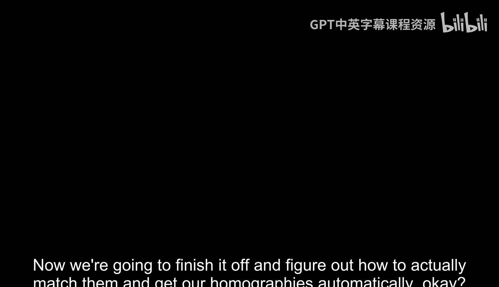

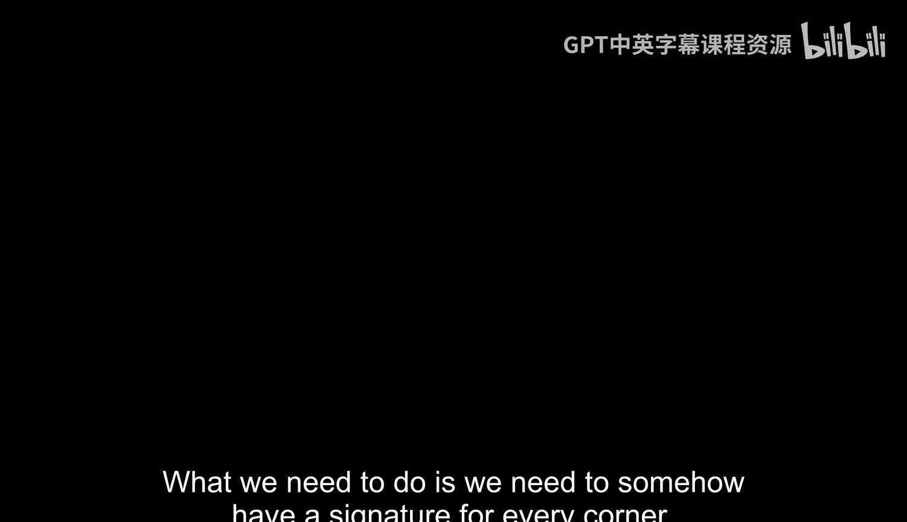

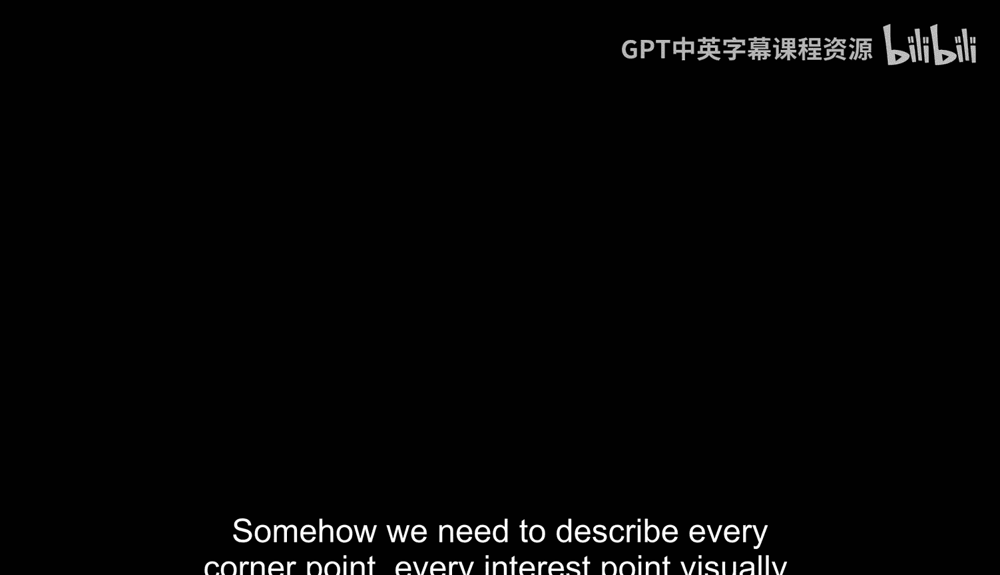

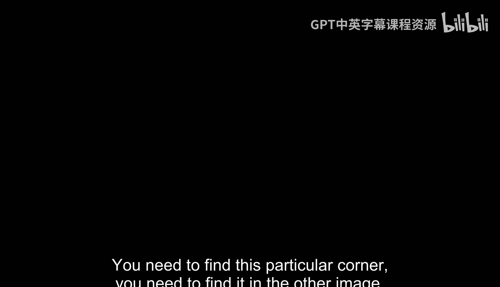

在本节课中，我们将学习如何自动完成图像对齐。上一节我们介绍了如何寻找兴趣点，本节中我们来看看如何匹配这些点，并自动计算单应性矩阵。

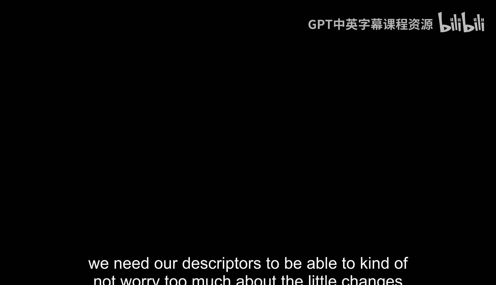

## 特征描述符

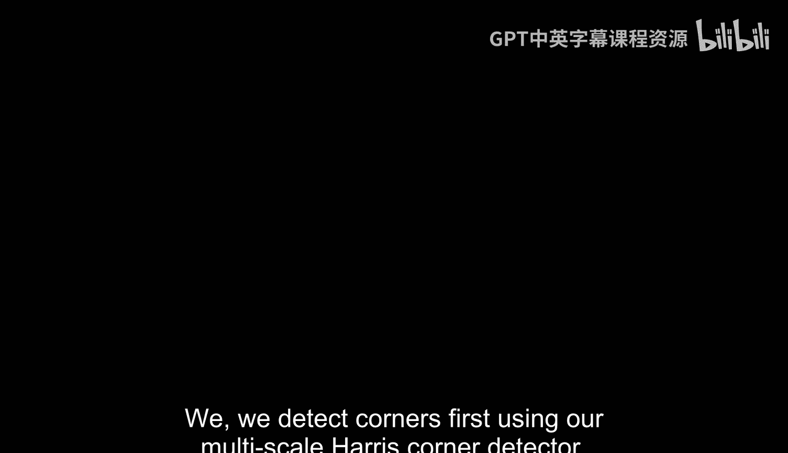

为了匹配在不同图像中检测到的兴趣点，我们需要为每个点创建一个“签名”或描述符。这个描述符需要具备两个关键属性：**独特性**和**不变性**。

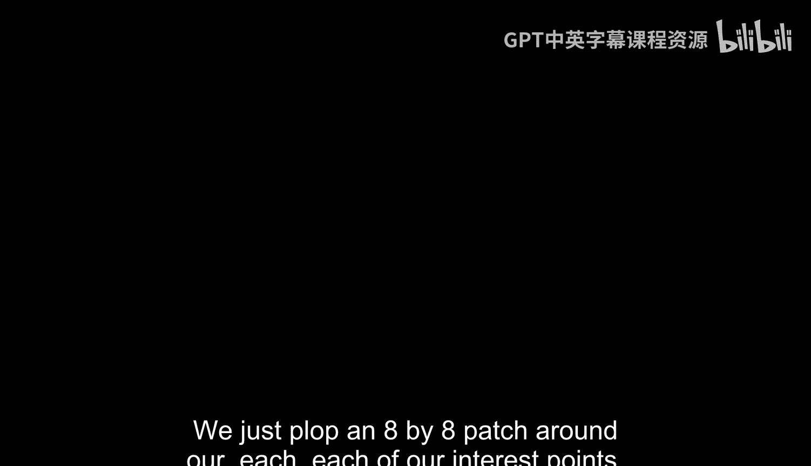

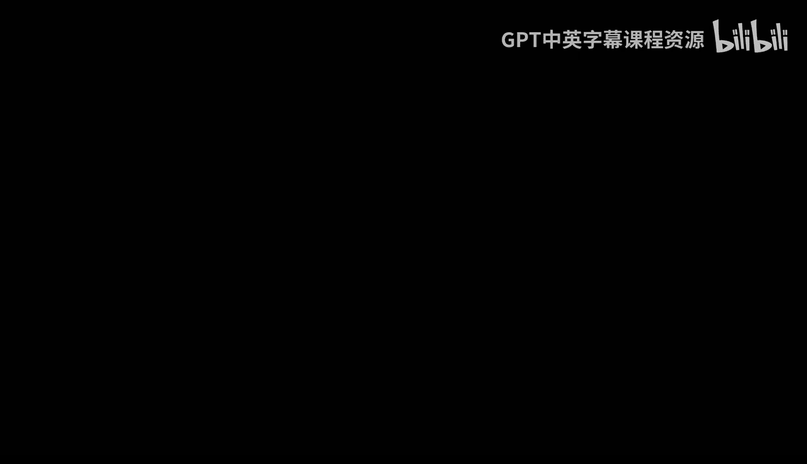

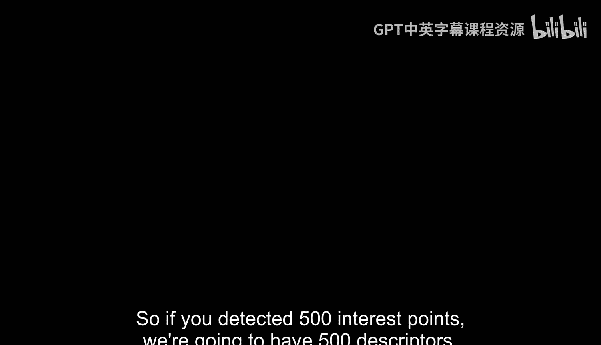

*   **独特性**：描述符应能唯一标识一个点，以便在另一幅图像中找到它。例如，人脸特征点就比栅栏上重复的木桩更独特。
*   **不变性**：即使图像之间存在光照、视角或旋转等微小变化，同一个点在两幅图像中的描述符也应保持相似。

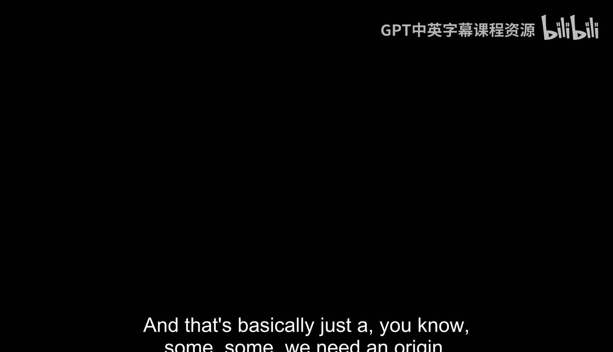

这两个属性有时会相互制约，我们需要在它们之间取得平衡。

## MOPS 描述符

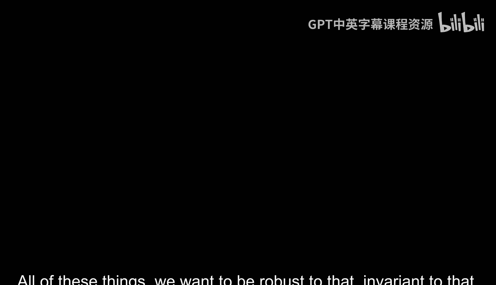

我们将介绍一种简单但有效的描述符：**MOPS**。其核心思想是围绕每个Harris角点提取一个归一化的图像块。

以下是MOPS描述符的构建步骤：

1.  **基础**：从多尺度Harris角点检测器获得的角点开始。这些点已具备尺度和方向信息（通过模糊梯度计算）。
2.  **提取区域**：以角点为中心，根据其尺度，提取一个40x40像素的区域。
3.  **方向归一化**：根据角点的方向旋转该区域，使其方向标准化。
4.  **下采样**：将40x40的区域下采样为8x8的块。
5.  **亮度归一化**：对该8x8块进行**偏置-增益归一化**，即减去均值并除以方差。

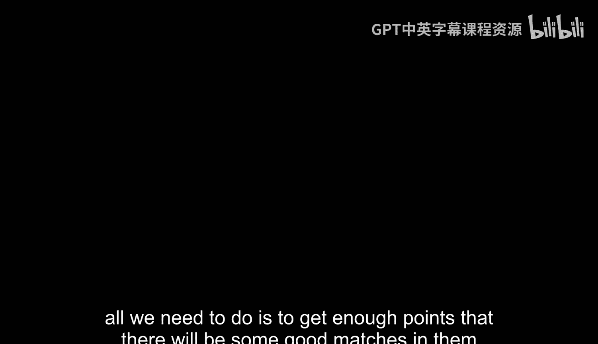

**归一化公式**：
`归一化块 = (原始块 - 均值(原始块)) / 方差(原始块)`

这些步骤（下采样和亮度归一化）的主要目的是**增强不变性**，减少光照变化和微小透视变形（这些变形主要影响高频信息）的影响。最终，每个兴趣点都表示为一个8x8的归一化向量。

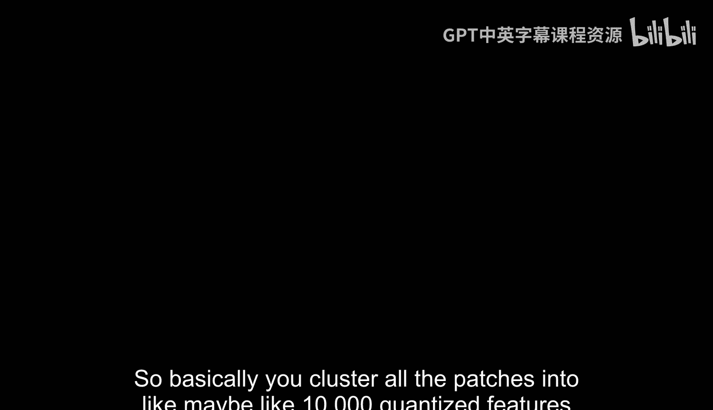

## 特征匹配

现在我们有两组描述符（分别来自两幅图像），需要找到它们之间的对应关系。

最简单的匹配方法是**最近邻搜索**：对于图像A中的每个描述符，在图像B中寻找最相似的描述符（例如，使用平方差和SSD度量）。然而，这种方法存在**外点**问题：图像中许多点可能没有对应匹配（例如，非重叠区域），但它们仍会错误地匹配到某个点。

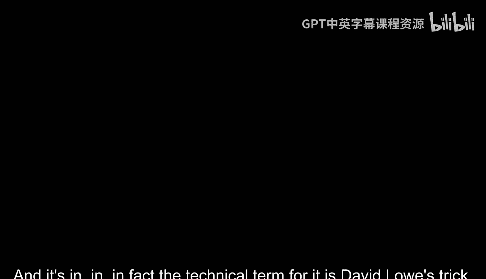

我们需要进行**外点剔除**。一个简单的方法是设置误差阈值，但效果不佳。更好的方法是使用 **David Lowe技巧**（或比值测试法）。

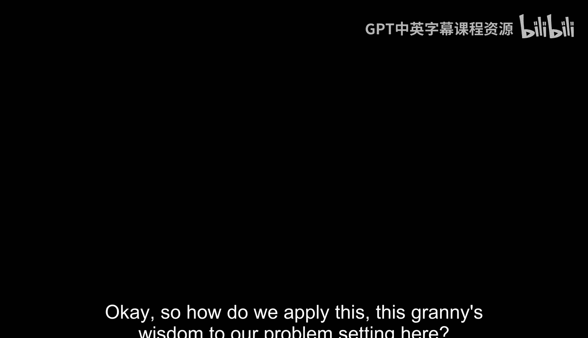

**David Lowe技巧**：
对于图像A中的一个描述符，在图像B中找到其**最近邻**和**次近邻**描述符。计算最近邻距离与次近邻距离的**比值**。如果该比值足够小（例如小于0.3），则接受最近邻为正确匹配；否则拒绝。其原理是：如果两个候选匹配都很相似（比值接近1），那么很可能两者都是错误的。

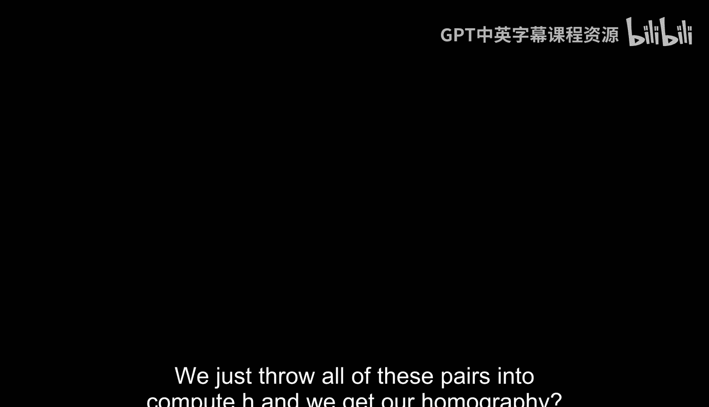

## RANSAC：鲁棒估计

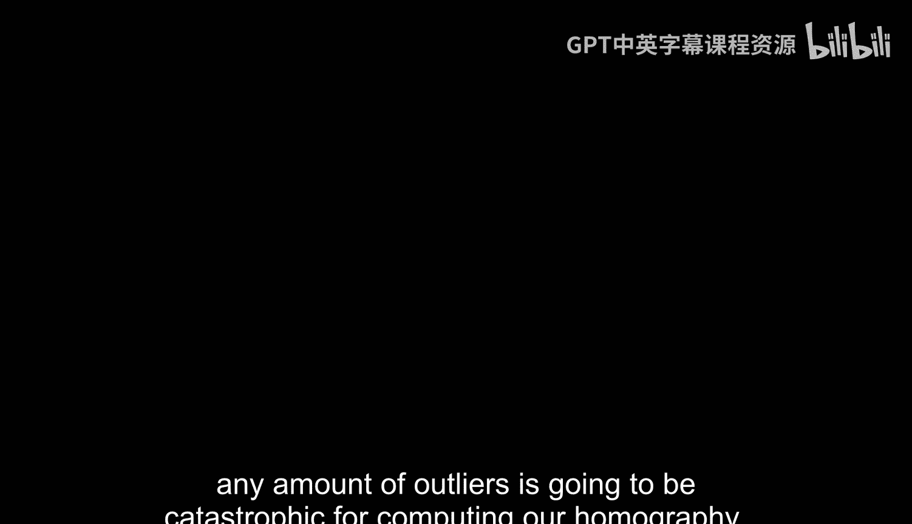

即使经过上述筛选，匹配集中仍可能包含外点。最小二乘法对**外点非常敏感**，即使只有一个错误匹配也可能彻底破坏单应性矩阵的估计。

为了解决这个问题，我们引入 **RANSAC** 算法。其核心思想是：所有正确的匹配（内点）都满足同一个变换模型，而错误的匹配（外点）则各不相同。

以下是RANSAC用于估计单应性矩阵的步骤：

1.  **随机采样**：从匹配集中随机选择**4**对匹配点（因为单应性矩阵有8个自由度，至少需要4对点）。
2.  **模型估计**：用这4对点计算一个单应性矩阵 `H`。
3.  **验证模型**：用这个 `H` 测试所有其他匹配点。如果某个匹配点经过 `H` 变换后的位置与其实匹配位置的距离小于某个阈值（如1个像素），则将其标记为**内点**。
4.  **迭代与选择**：重复上述过程很多次（例如几百或上千次）。最终，选择**内点数量最多**的那个单应性矩阵作为最佳模型。
5.  **精炼**（可选）：使用所有内点，通过最小二乘法重新计算一个更精确的单应性矩阵。

RANSAC的强大之处在于，即使数据中包含大量外点，它也能找到正确的变换模型。

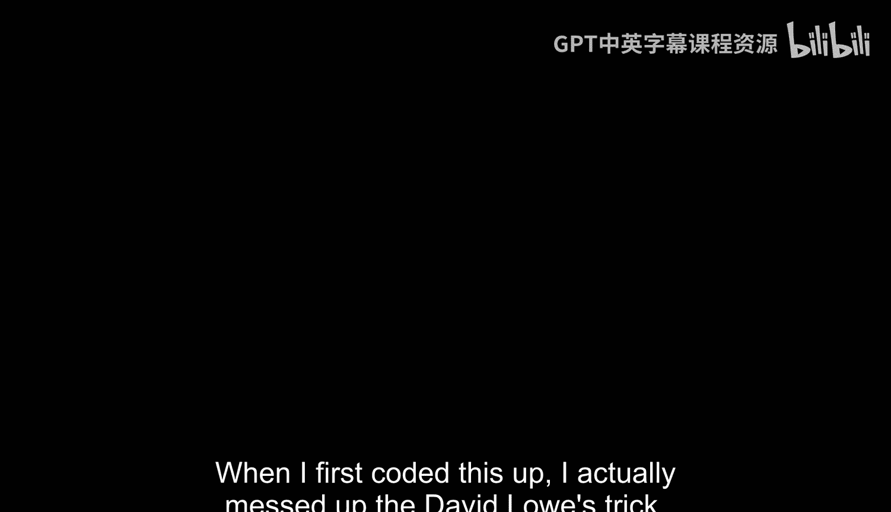

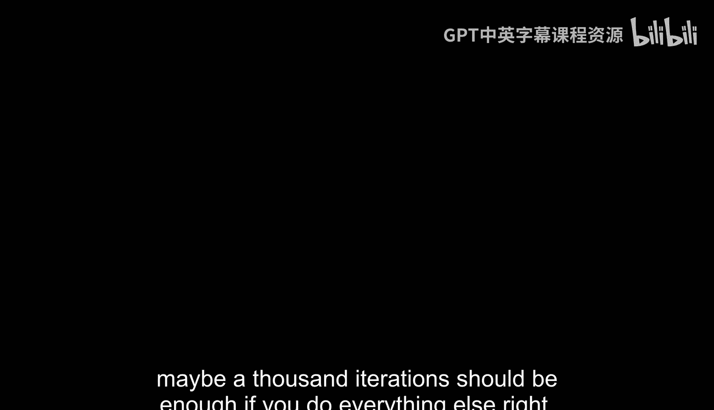

## 光流简介

图像对齐通常假设一个全局变换模型（如单应性）。但在视频等场景中，运动可能更复杂，每个像素的运动向量都可能不同。这就是**光流**问题：估计图像中每个像素从一帧到下一帧的运动向量。

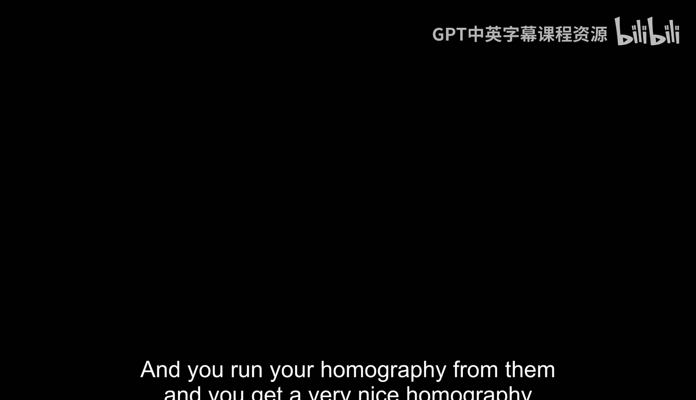

光流基于两个主要假设：
1.  **小运动**：像素在相邻帧间不会移动太远。
2.  **亮度恒常性**：同一个点在相邻帧中的亮度（或颜色）保持不变。

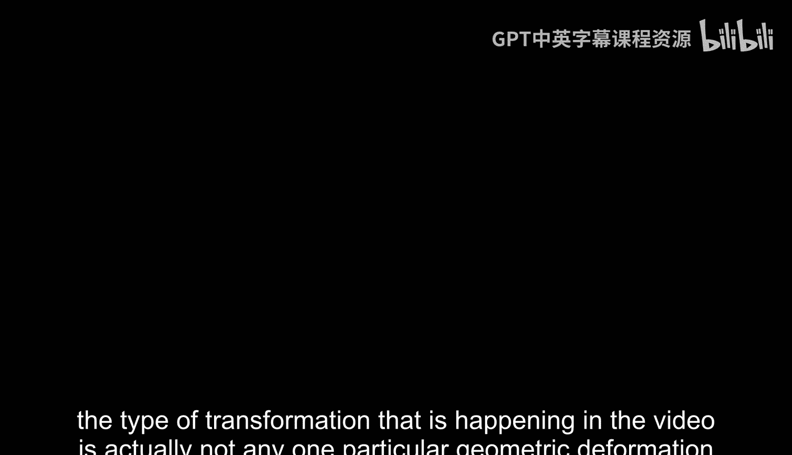

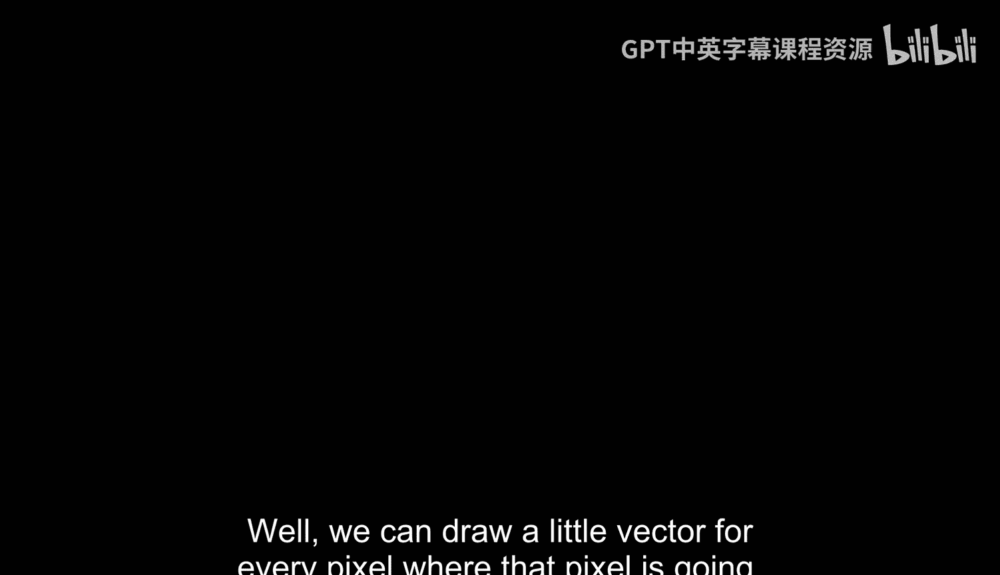

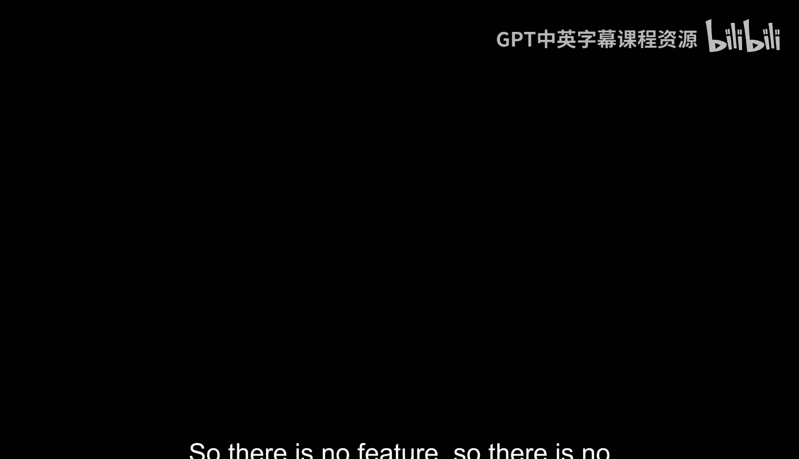

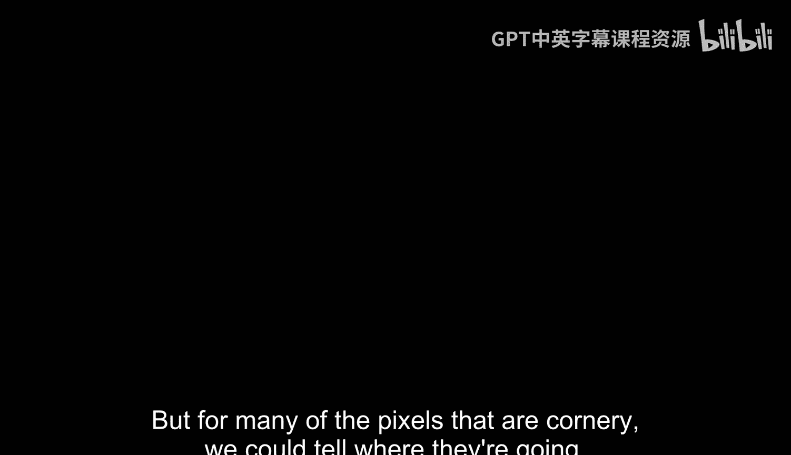

**亮度恒常性约束方程**：
`I(x, y, t) = I(x + u, y + v, t + 1)`
其中 `(u, v)` 是待求的运动向量。

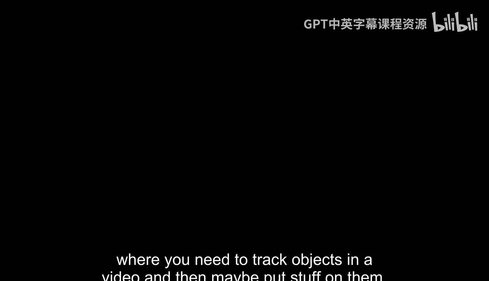

利用泰勒展开和小运动假设，我们可以推导出光流基本方程：
`I_x * u + I_y * v + I_t = 0`
其中 `I_x`, `I_y` 是空间梯度，`I_t` 是时间梯度（帧间差）。

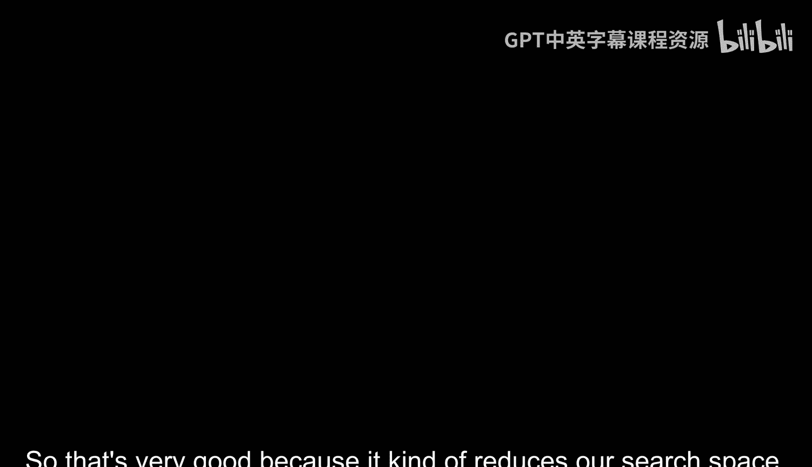

这个方程一个方程有两个未知数 `(u, v)`，无法求解单个像素的运动。这被称为**孔径问题**：我们只能确定垂直于边缘方向的运动分量，而无法确定平行于边缘的分量。

## Lucas-Kanade 光流法

为了解决孔径问题，**Lucas-Kanade方法**假设一个局部窗口内的所有像素具有**相同的运动**。这样，对于一个5x5的窗口，我们就得到了25个方程来求解2个未知数，可以通过最小二乘法解决。

最小二乘解涉及到一个熟悉的矩阵——**二阶矩矩阵**。其可解的条件（矩阵可逆、特征值足够大且条件数好）与Harris角点检测的条件完全相同。这意味着，只有在纹理丰富的角点区域，我们才能可靠地计算光流。

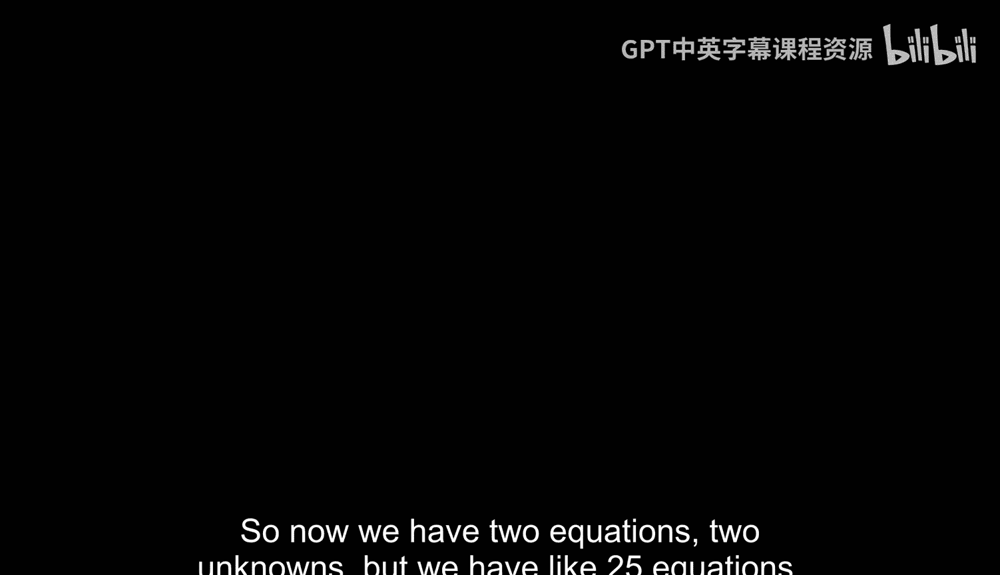

对于实际中大于一个像素的运动，我们再次使用**图像金字塔**，从粗尺度到细尺度逐级计算，以解决大位移问题。

## 总结

本节课中我们一起学习了自动图像对齐的完整流程：
1.  使用MOPS方法为兴趣点构建具有不变性的描述符。
2.  使用David Lowe技巧进行特征匹配并初步剔除外点。
3.  使用RANSAC算法鲁棒地估计单应性矩阵，即使存在大量错误匹配。
4.  我们还简要介绍了光流的概念，以及如何利用Lucas-Kanade方法和图像金字塔来估计像素级运动。

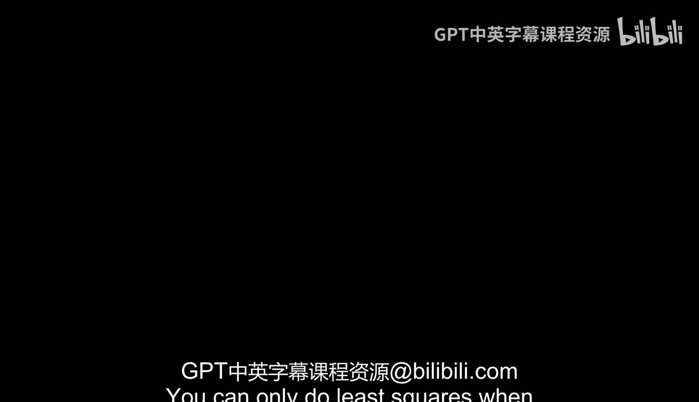

通过结合这些技术，我们可以实现全自动的图像拼接，并理解视频中运动估计的基本原理。