# 15：使用神经网络进行特征学习

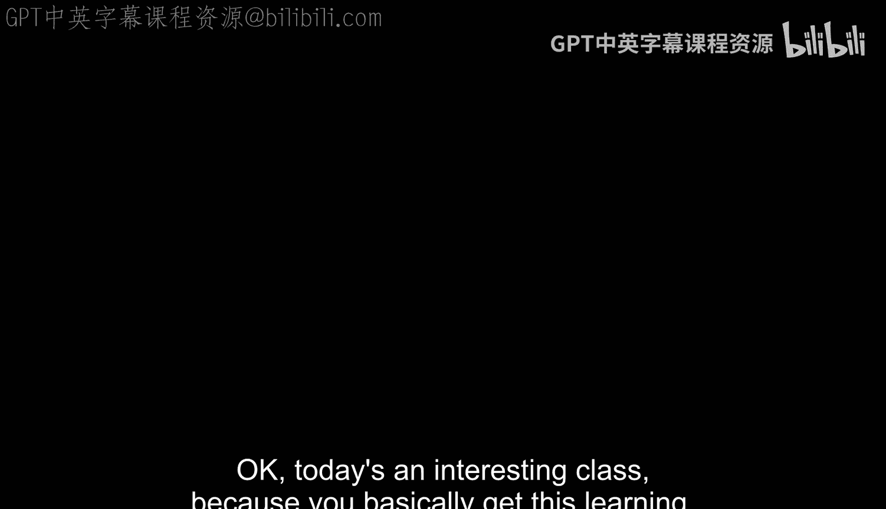

## 概述
在本节课中，我们将学习神经网络的基础知识，特别是如何利用它们从数据中自动学习特征，而不是依赖手工设计的特征。我们将从简单的线性分类器开始，逐步深入到多层感知机（MLP）和反向传播算法，并理解其背后的直观原理。

---

## 从手工特征到学习特征

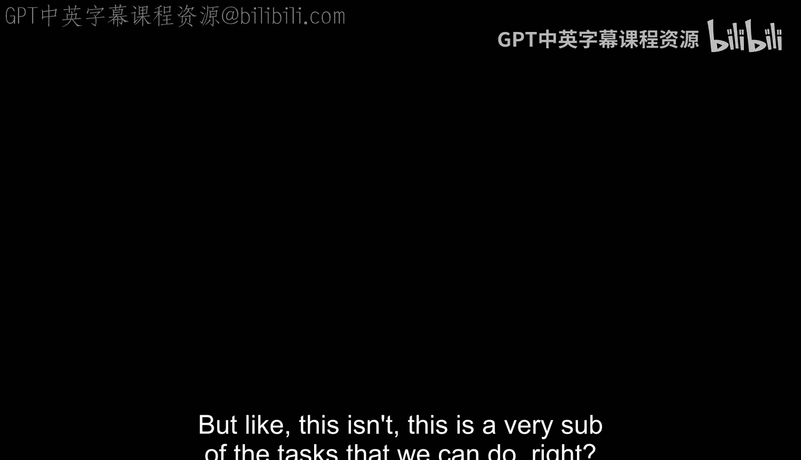

上一节我们介绍了手工设计的特征检测器，如边缘检测器。这些特征基于生物视觉的启发，通过卷积核在图像上滑动，得到响应热图，用于后续的识别任务，例如词袋模型。

然而，手工设计的特征有其局限性，难以捕捉复杂的模式。本节中，我们来看看如何让机器自动从数据中学习特征，并且不仅仅是学习单层线性滤波器，而是学习多层的特征表示。

以下是卷积神经网络学习到的特征可视化示例：
*   **第一层特征**：类似于手工设计的边缘检测器，学习到各种方向的边缘。
*   **深层特征**：学习到更复杂的中间特征，例如眼睛的部件或特定纹理模式，这是手工设计难以做到的。

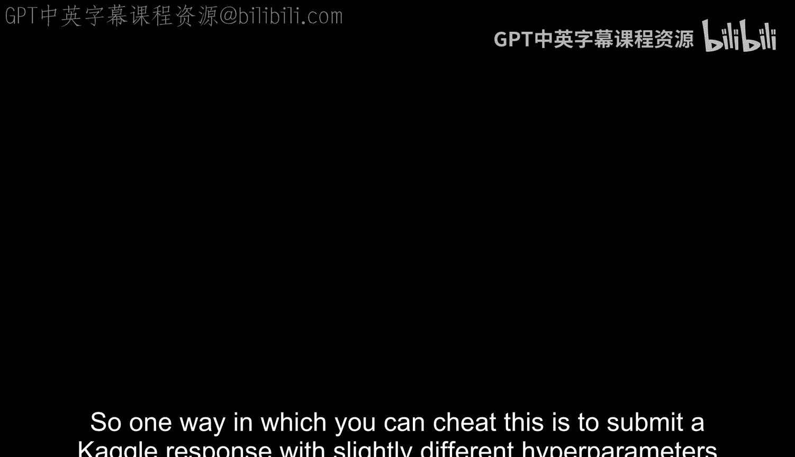

---

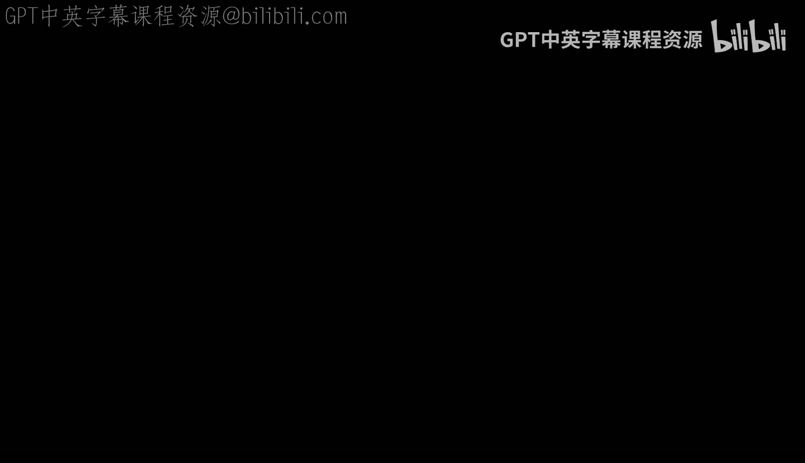

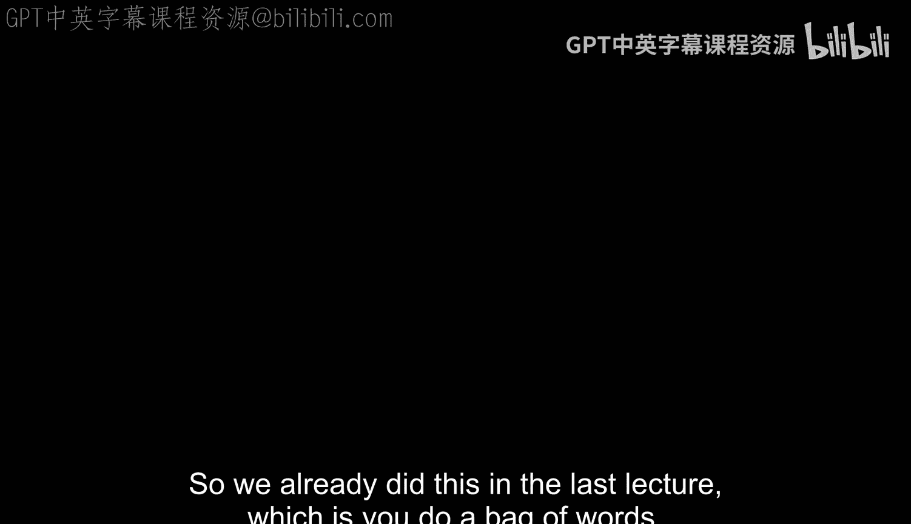

## 学习任务与目标函数

任何学习过程都需要一个**任务**或**目标**。在监督学习中，我们为网络定义一个明确的**目标函数**（或损失函数），网络通过最小化这个函数来学习。

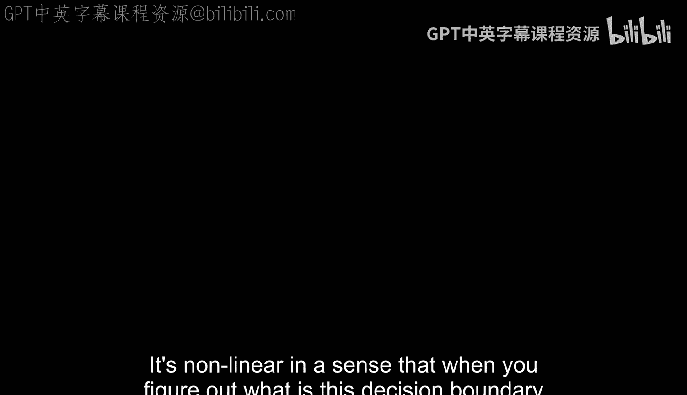

常见的计算机视觉任务包括：
*   **图像分类**：识别图像中的物体类别（如猫、狗）。
*   **目标检测**：定位图像中物体的位置。
*   **关键点识别**：定位物体的特定部位（如眼睛、耳朵）。
*   **图像分割**：为图像的每个像素分配一个类别标签。

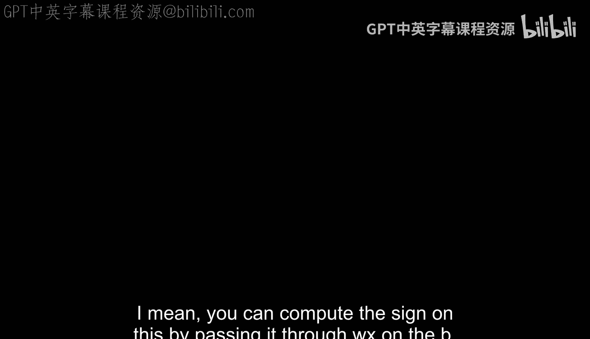

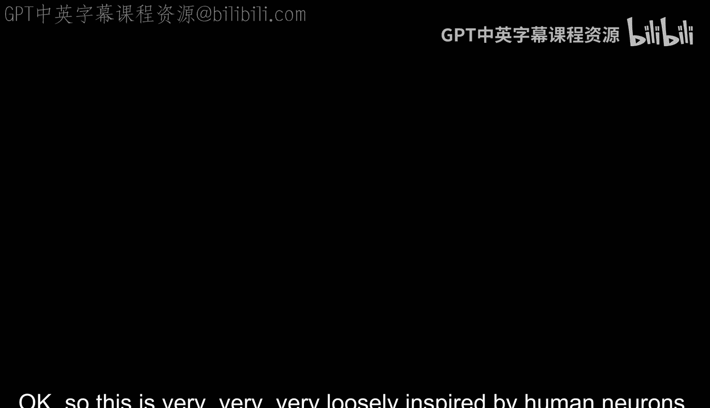

这些任务都是我们为机器定义的、有明确标签的中间任务。最终，我们希望机器能完成更高级、更抽象的目标。

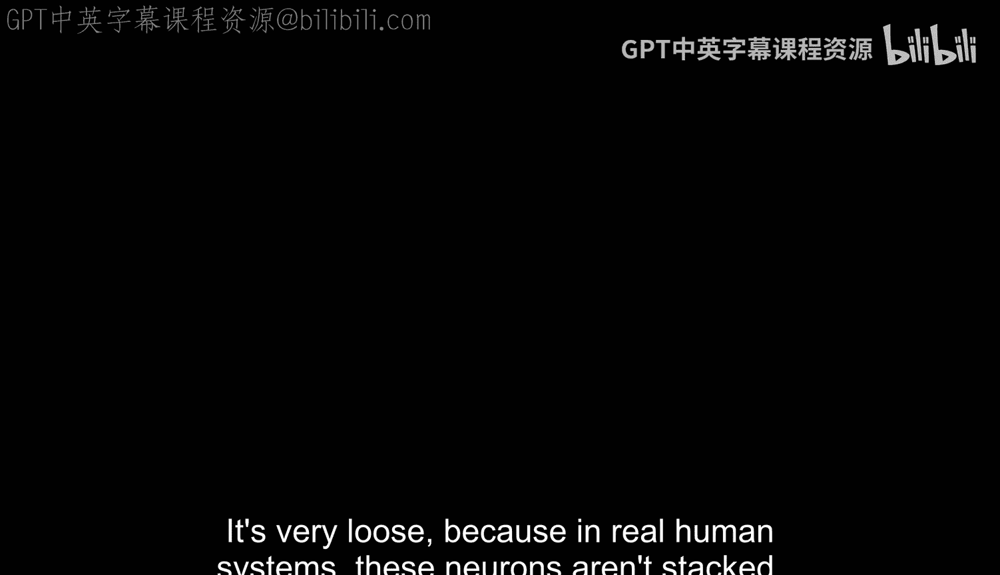

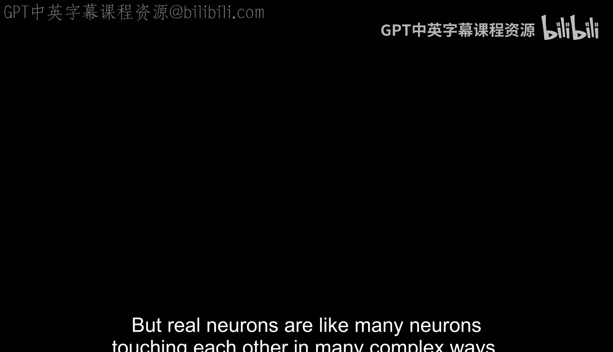

---

## 图像分类框架

在统计学习框架下，图像分类的目标是学习一个函数 **F**，它能够将输入图像 **X** 映射到其类别标签 **Y**。

以下是数据集的划分：
*   **训练集**：用于学习模型参数的已标注数据对 `(X, Y)`。
*   **验证集**：用于调整模型超参数（如学习率），**不能**用于最终性能评估。
*   **测试集**：用于最终评估模型在未见数据上的性能，在训练和调参过程中**绝对不能**使用，否则会导致对性能的乐观估计（即“作弊”）。

一个简单的分类流程是：提取图像特征（如词袋直方图），然后送入分类器（如最近邻分类器）进行预测。

---

## 线性分类器与感知机

一个基础的分类模型是**线性分类器**。其决策函数为：
`f(x) = sign(W * x + b)`
其中，**W** 是权重向量，**b** 是偏置项，`sign` 是符号函数，输出+1或-1。这个函数定义了一个超平面，将特征空间分为两个区域。

**感知机算法**是一种训练线性分类器的简单方法：
1.  随机初始化权重 **W**。
2.  遍历训练样本 `(x_i, y_i)`。
3.  计算当前预测 `y'_i = sign(W * x_i)`。
4.  如果预测错误（`y'_i != y_i`），则按规则更新权重：`W = W + (y_i - y'_i) * x_i`。

这个更新规则直观地理解为：将权重向量向正确类别的方向“推”一点。

然而，`sign` 函数在零点不可导，不利于基于梯度的优化。因此，我们常使用 **Sigmoid** 函数 `σ(z) = 1 / (1 + e^{-z})` 作为激活函数。它将输出压缩到(0,1)之间，可以解释为属于正类的概率。

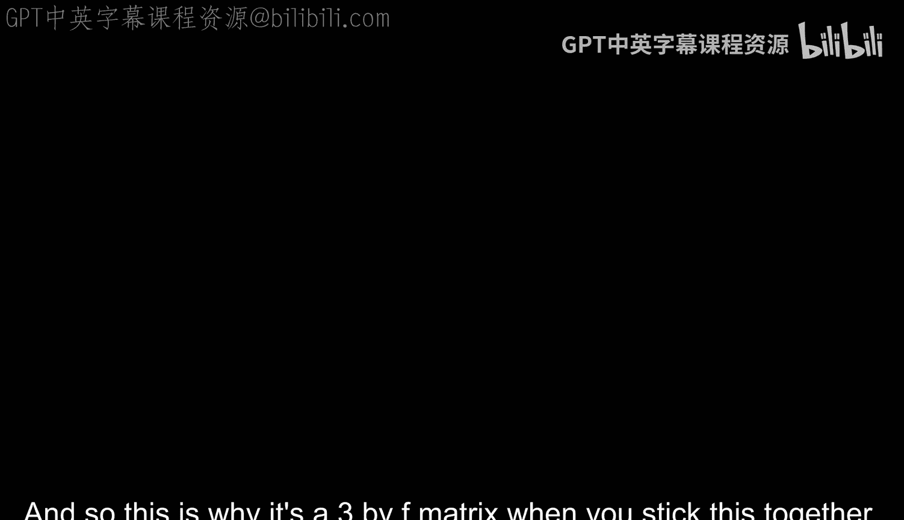

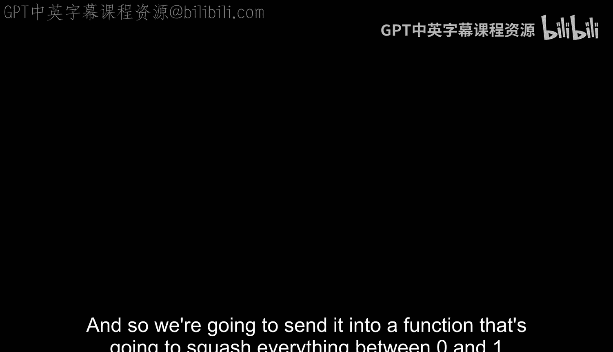

---

## 损失函数与梯度下降

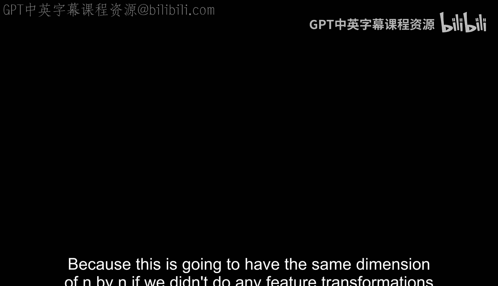

为了更系统地进行学习，我们需要定义一个可微的**损失函数 L**，来衡量预测值与真实值之间的差距。网络学习的目标就是最小化这个损失。

以下是两种常见的损失函数：
*   **均方误差损失**：`L = (y' - y)^2`。这是一个凸函数，误差越大，梯度越大，更新幅度也越大。
*   **对数似然损失（交叉熵）**：用于多分类。假设我们有 K 个类别，网络通过 **Softmax** 函数输出一个概率分布。Softmax 公式为：
    `P(class=i) = e^{z_i} / Σ_{j=1}^{K} e^{z_j}`
    其中 `z = W * x`。对数似然损失鼓励正确类别的预测概率接近1：`L = -log(P(class=y_true))`。

我们通过**梯度下降**来最小化损失。想象损失函数构成一个“地形”，我们站在某个点（当前参数），想要走到最低点（最优参数）。梯度方向指出了当前最陡的下降方向。

**随机梯度下降** 是更常用的变体。它不像标准梯度下降那样使用所有数据计算梯度，而是每次只使用一个**小批量**的数据。这样做计算更快，并且批次的随机性有助于避免陷入局部最优解。

---

## 多层感知机与非线性

单层线性分类器能力有限，无法解决非线性可分问题（例如异或问题）。解决方案是堆叠多个线性层，并在中间插入**非线性激活函数**，构成**多层感知机**。

为什么需要非线性？如果没有非线性激活函数，多个线性层的组合等价于一个线性层：`W2 * (W1 * x) = (W2 * W1) * x`。非线性函数（如 **ReLU: f(x)=max(0, x)**）打破了这种线性，使网络能够学习更复杂的函数。

---

## 反向传播：链式法则的直观理解

训练多层网络的关键是计算损失相对于每一层权重 **W** 的梯度，即 `∂L/∂W`。这通过**反向传播**算法实现，其核心是**链式法则**。

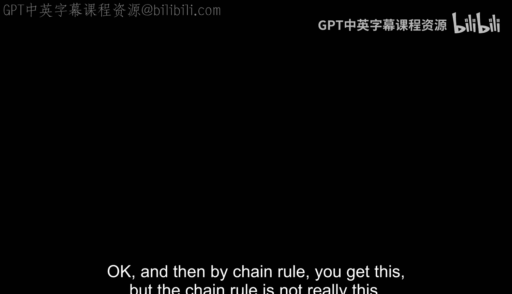

链式法则：若 `y = f(g(x))`，则 `dy/dx = (dy/dg) * (dg/dx)`。

我们可以用一个“公司管理”的比喻来直观理解反向传播：
1.  **前向传播**：信息从底层（输入）向上层（输出）传递，每一层经理根据下属（神经元）的汇报做出决策。
2.  **计算损失**：最高层经理收到外部反馈（损失），得知决策的错误程度。
3.  **反向传播**：最高层经理将“责备”（损失梯度 `∂L/∂y`）向下传递。
    *   他首先调整自己对直接下属的“信任度”（计算 `∂L/∂W_last` 并更新最后一层权重）。
    *   同时，他将“责备”按每个下属的“贡献度”（权重）分摊，传递给下一层经理（计算 `∂L/∂x_last`，作为下一层的损失梯度）。
4.  **逐层回溯**：这个过程逐层向下进行。每一层经理都根据上级传来的“责备”，调整自己对下属的信任度（更新本层权重 `∂L/∂W_l`），并将分摊后的责备继续下传（计算 `∂L/∂x_l`）。

最终，所有层的权重都根据其“责任”得到了相应的调整。`∂L/∂W` 就是“调整信任度”这一步，而 `∂L/∂x` 就是“分摊责备并下传”这一步。

---

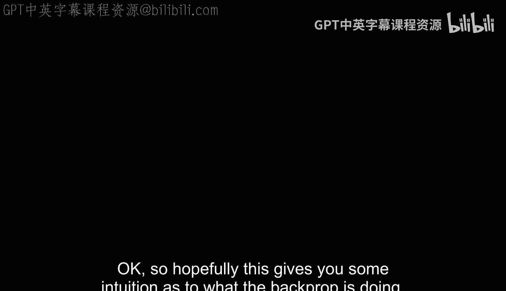

## 案例研究：MNIST 上的单层网络

让我们在 MNIST 手写数字数据集上观察一个单层线性分类器。图像是 28x28 的灰度图，被展平为 784 维向量。我们有 10 个类别（数字0-9），因此权重 **W** 是一个 10x784 的矩阵。

训练后，我们可以将每一行权重（对应一个数字分类器）重新变形为 28x28 的图像进行可视化。结果发现，学习到的权重看起来像是对应数字的“平均模板”。

这揭示了单层线性分类器的核心局限：它本质上是在学习一个**刚性模板**。如果测试数字与这个平均模板在形状、倾角上差异较大，分类器就很容易出错。这正说明了我们需要更强大的模型（多层、非线性、卷积）来应对真实世界中的多样性。

---

## 总结

本节课中我们一起学习了神经网络特征学习的基础。
1.  我们理解了从手工特征到学习特征的动机。
2.  我们明确了监督学习需要定义任务和损失函数。
3.  我们掌握了线性分类器、感知机算法以及 Sigmoid 激活函数。
4.  我们熟悉了均方误差和对数似然损失函数，以及梯度下降优化原理。
5.  我们认识到单层网络的局限性，并引入了多层感知机和非线性激活函数（如 ReLU）的必要性。
6.  我们通过链式法则和直观的管理学比喻，深入理解了反向传播算法的工作原理。
7.  最后，通过 MNIST 案例，我们看到了单层线性分类器的行为及其不足。

下一讲，我们将探讨如何通过**卷积神经网络**，让特征学习在空间上变得更高效、更强大。