# 17：卷积神经网络 II

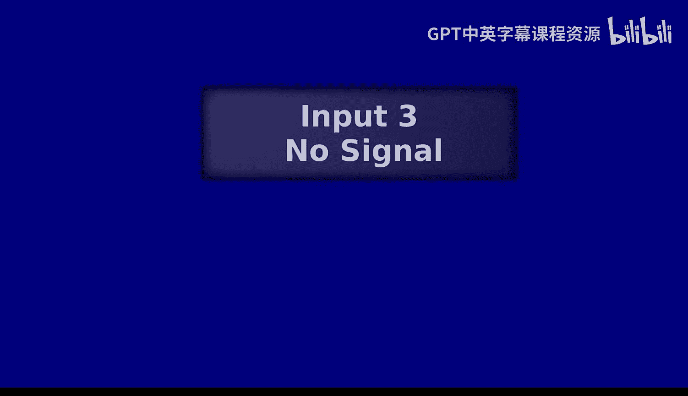

在本节课中，我们将继续探讨卷积神经网络，特别是如何将其应用于图像到图像的转换任务，例如关键点检测。我们将了解为什么回归目标函数有时效果不佳，以及如何通过分类和概率分布的方法来改进。我们还将学习编码器-解码器架构、跳跃连接以及生成对抗网络等关键技术，这些技术对于构建能够输出完整图像的神经网络至关重要。

---

## 从回归到分类：关键点检测的更好方法

上一节我们讨论了使用卷积神经网络直接回归关键点坐标的方法。本节中，我们来看看这种方法存在的一个根本问题。

在回归设置中，网络接收一张图像，并直接输出一个包含所有关键点X、Y坐标的一维向量。然后，我们通过最小化该预测向量与真实坐标之间的L2距离来优化网络。

然而，回归目标函数存在一个主要问题：它迫使网络对每个关键点做出单一、确定的预测。但在许多情况下，图像中可能存在不确定性。例如，在检测人体姿态时，一个局部区域可能既像手臂，也像腿。回归目标无法表达这种不确定性，它要求网络做出“非此即彼”的承诺，这可能导致次优的学习效果。

相比之下，在ImageNet等图像分类任务中，网络的输出是一个概率分布向量，它为每个类别分配一个概率值。这允许模型保留多种可能性，而不是做出绝对的分类决策。

因此，对于关键点检测，一个更好的方法是为每个关键点输出一个概率分布图，而不是一对坐标。这意味着，对于每个关键点，网络的输出是一张与输入图像空间尺寸相关的“热图”，其中每个像素的值表示该位置是关键点的概率。这样，模型就可以表达不确定性，并在存在多种合理可能性的情况下保留这些信息。

---

## 图像到图像的转换：输出完整图像

为了实现上述目标，我们需要网络能够输出完整的图像（即热图），而不仅仅是一个向量。这引出了一类更广泛的问题：图像到图像的转换。

以下是图像到图像转换的一些例子：
*   **深度预测**：输入RGB图像，输出每个像素的深度值图像。
*   **法线预测**：输入RGB图像，输出描述表面朝向的法线图。
*   **语义分割**：输入RGB图像，输出每个像素所属物体类别的彩色标注图。
*   **人体姿态估计**：输入RGB图像，输出人体所有关键点的热图集合。

那么，如何构建一个能输出图像的神经网络呢？以下是几种思路：

**1. 仅使用卷积层（无下采样）**
一个直观的想法是堆叠卷积层，但完全不使用池化层，以保持输出的空间尺寸。但这种方法效率很低。为了获得足够大的感受野来理解全局上下文，需要堆叠非常多的卷积层，导致参数量巨大，计算和内存开销难以承受。

**2. 滑动窗口**
另一种方法是使用一个标准的、输出向量的CNN，以滑动窗口的方式遍历整个输入图像，然后将每个窗口的输出向量重新排列成一幅图像。这种方法的问题是计算严重冗余，因为相邻窗口共享大量重叠区域，但卷积运算却被重复执行多次，效率低下。

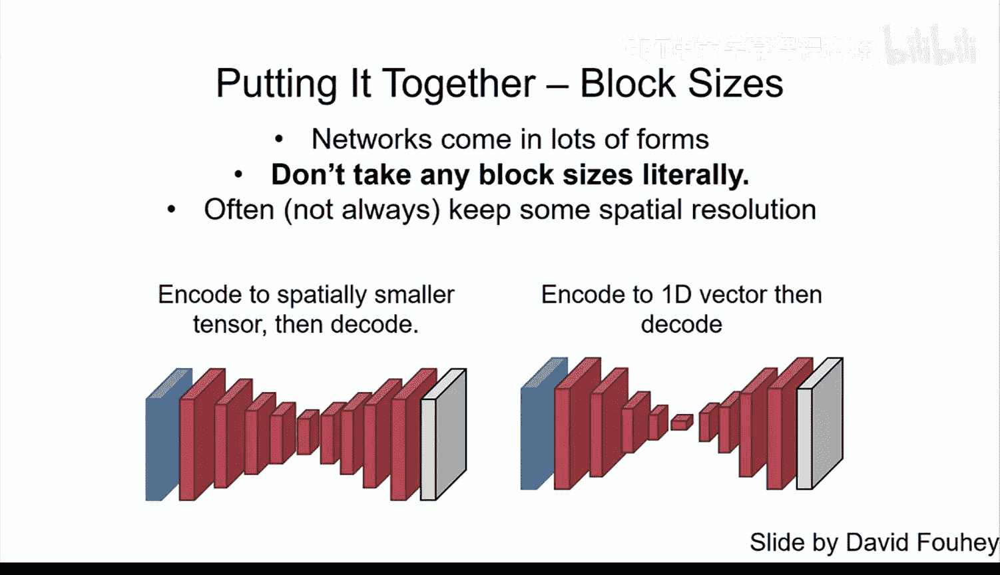

**3. 编码器-解码器架构（正确方法）**
我们需要在“获得大感受野”和“保持计算效率”之间取得平衡。标准解决方案是采用编码器-解码器结构。
*   **编码器**：与标准CNN类似，通过卷积和池化层对输入进行下采样，逐步提取高级特征并扩大感受野，但会缩小特征图的空间尺寸。
*   **解码器**：通过上采样操作（如最近邻插值或双线性插值）逐步将特征图尺寸恢复至原始输入大小。每次上采样后通常接有卷积层，以帮助生成清晰的输出。

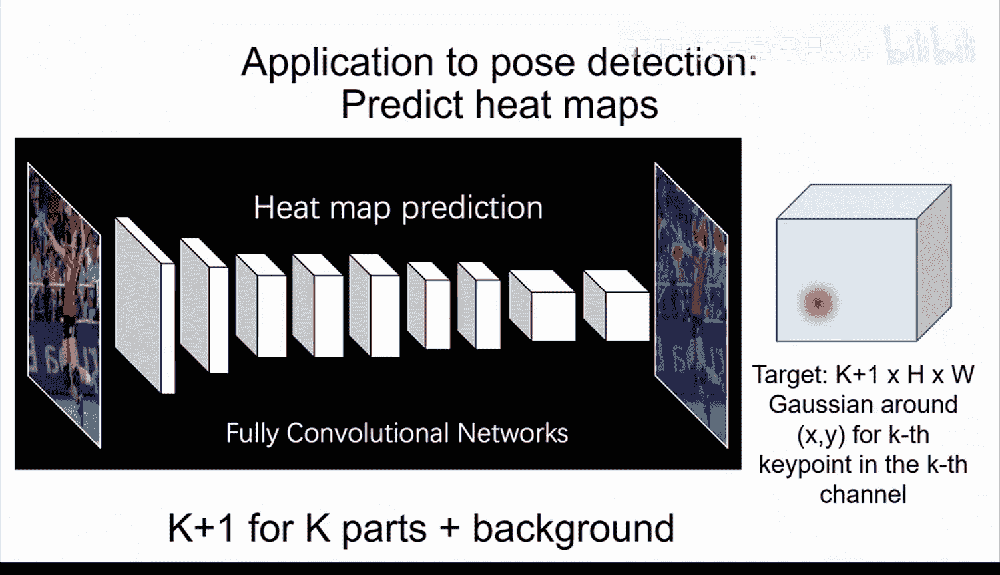

这种结构首先通过下采样高效地捕获全局信息，再通过上采样重建细节。

---

## 跳跃连接：恢复高频细节

然而，标准的编码器-解码器有一个缺点：在编码器的下采样过程中，图像的高频细节（如物体边缘）会丢失。这可能导致解码器输出的图像边界模糊，例如在语义分割任务中。

为了解决这个问题，我们借鉴了拉普拉斯金字塔的思想。我们可以通过**跳跃连接**将编码器中相应层的高分辨率特征图直接传递到解码器的对应层。

具体操作是：将编码器某一层的特征图，直接拼接到解码器对应上采样层的特征图上。这样，解码器在进行卷积时，就能同时利用来自编码器路径的、包含丰富细节的高频信息，以及来自解码器路径的、包含全局语义的低频信息。这显著改善了输出图像的清晰度和边界质量。U-Net是应用这一思想的经典网络架构。

---

## 生成对抗网络：学习“看起来真实”的损失

对于某些图像到图像的转换任务（如图像着色），简单的L2回归损失会导致结果平淡、模糊。这是因为L2损失会迫使网络输出所有可能颜色的“平均”值，从而趋向于不饱和的灰色调。

我们可以再次将问题从回归转为分类，例如将颜色空间离散化为多个小簇，让网络预测颜色簇的概率分布。这能产生更鲜艳、多样的结果。

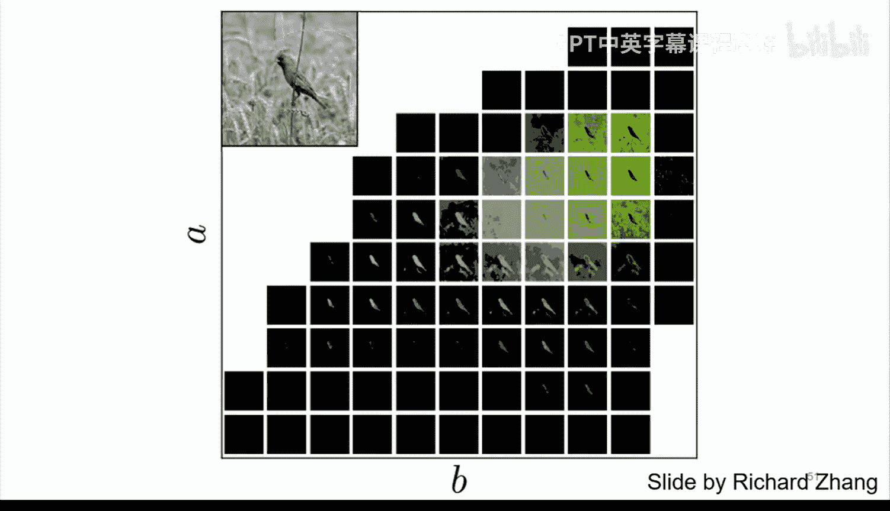

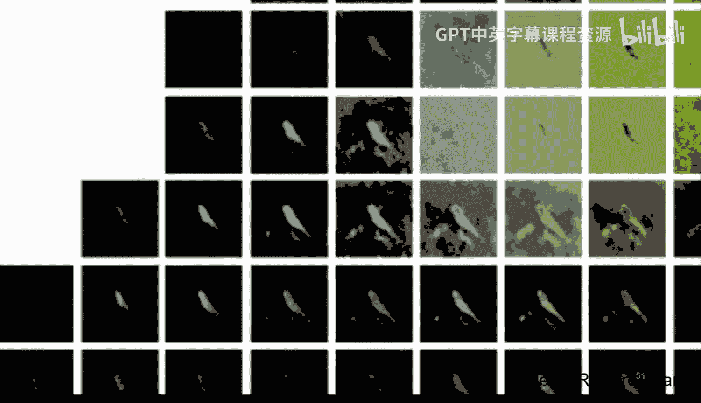

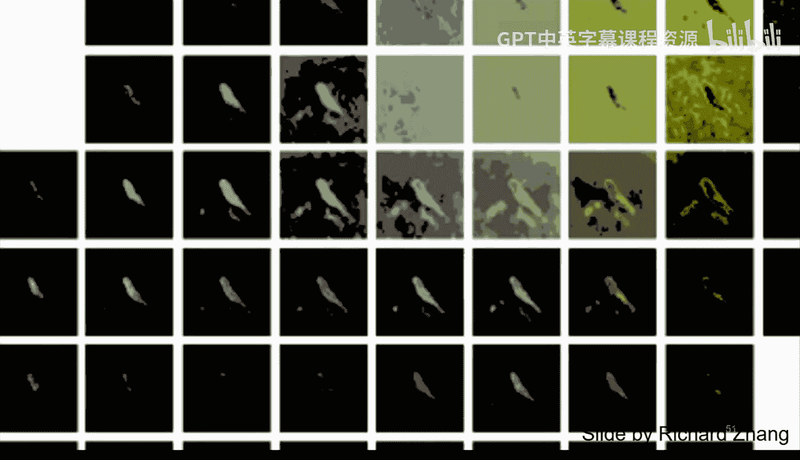

但如何确保生成的图像看起来“自然”呢？一个巧妙的思路是使用**生成对抗网络**。GAN引入了一个额外的网络——**判别器**。
*   **生成器**：负责将输入图像（如灰度图）转换为输出图像（如彩色图）。
*   **判别器**：负责判断一张图像是“真实的”（来自数据集）还是“生成的”（来自生成器）。

这两个网络相互对抗、共同学习：
*   判别器的目标是尽可能准确地区分真实图像和生成图像。
*   生成器的目标是生成尽可能逼真的图像，以“欺骗”判别器。

通过这种对抗训练，判别器学会了一种针对特定任务的、可微分的“真实性”度量标准。生成器则根据这个学习到的标准进行优化，从而产生视觉上更自然的结果。在条件GAN中，判别器会同时观察输入和输出图像，以判断输出是否是与输入匹配的、真实的转换结果。

---

## 迁移学习：利用预训练知识

训练强大的卷积神经网络通常需要大量数据。但**迁移学习**提供了一种有效利用现有知识的途径。

研究发现，在ImageNet等大型数据集上预训练的网络，其深层特征具有强大的泛化能力。即使网络被训练用于区分上千个类别，其学到的特征空间也会自动将语义相似的物体（如不同种类的狗、不同型号的车）聚集在一起。

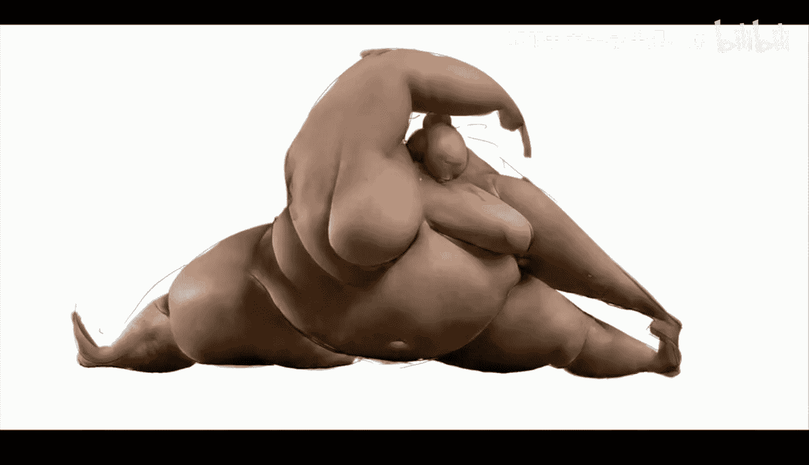

这意味着，我们可以将一个预训练网络（如ImageNet上训练的模型）作为起点，针对新的任务（如我们的关键点检测）进行**微调**。具体做法通常是：
1.  移除预训练网络的最后几层（全连接层和分类层）。
2.  添加并随机初始化适合新任务的新层（如输出热图的卷积层）。
3.  在新数据集上训练整个网络。通常，可以先冻结预训练层的权重，只训练新添加的层；如果有足够数据，也可以解冻所有层进行端到端微调。

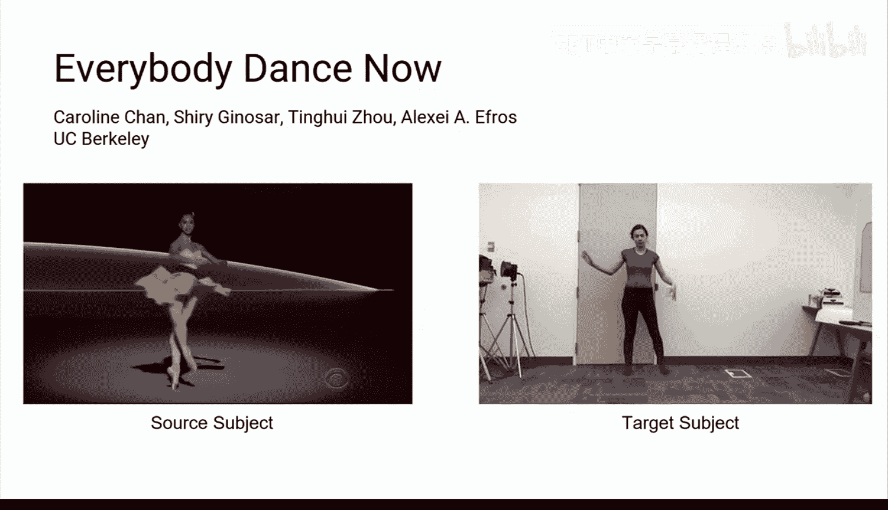

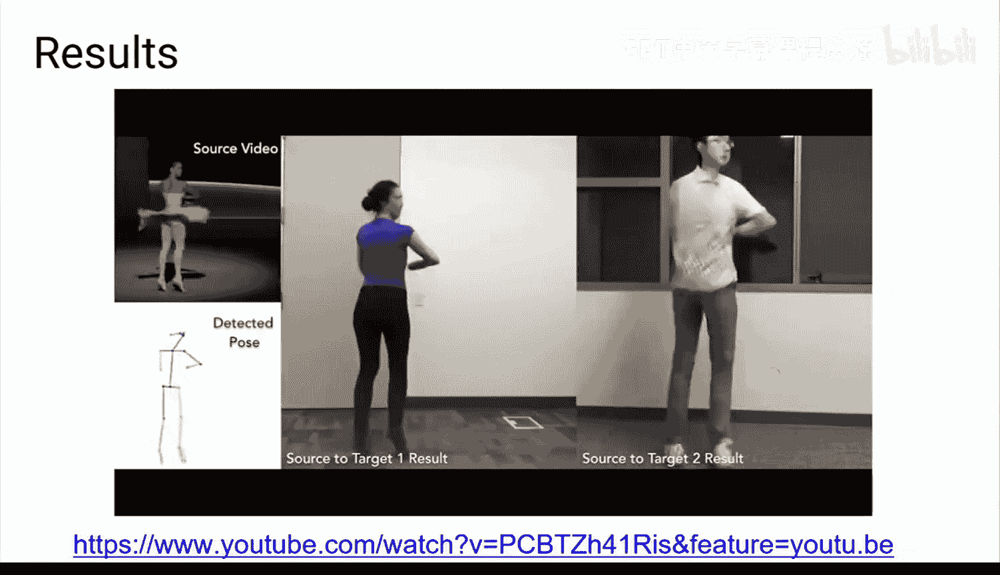

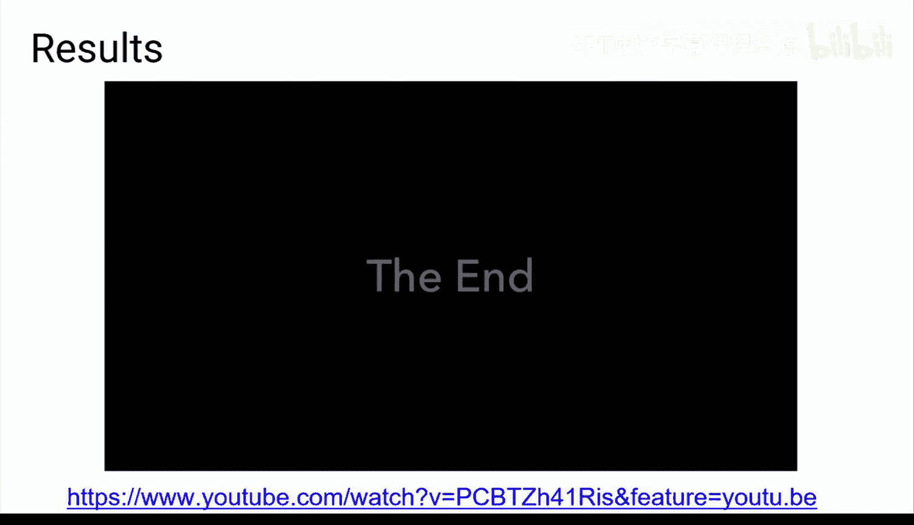

迁移学习能大大加快训练速度，并提升模型在数据有限的新任务上的性能。

---

## 总结

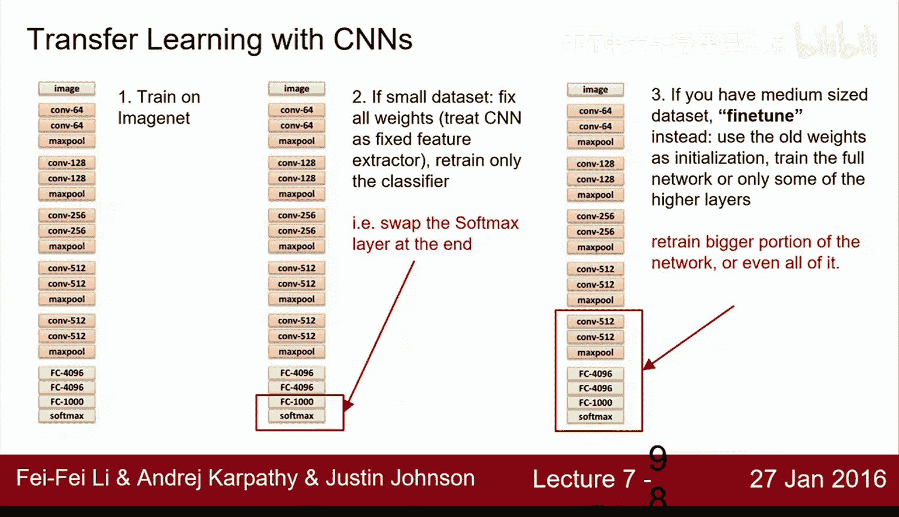

本节课我们一起学习了构建用于图像到图像转换的卷积神经网络的进阶知识。我们首先分析了回归损失函数的局限性，并引入了为关键点输出概率热图的分类方法。接着，我们探讨了编码器-解码器这一核心架构，以及通过跳跃连接来融合高频细节、改善输出质量的技术。然后，我们介绍了生成对抗网络，它通过对抗性训练学习一个“真实性”损失，能够生成视觉上更自然的结果。最后，我们了解了迁移学习和微调，这是一种利用大规模预训练模型来高效解决新任务的有效策略。这些概念和技术为项目五中自动关键点检测任务的实现提供了坚实的理论基础。