# 20：3D视觉：标定与立体视觉

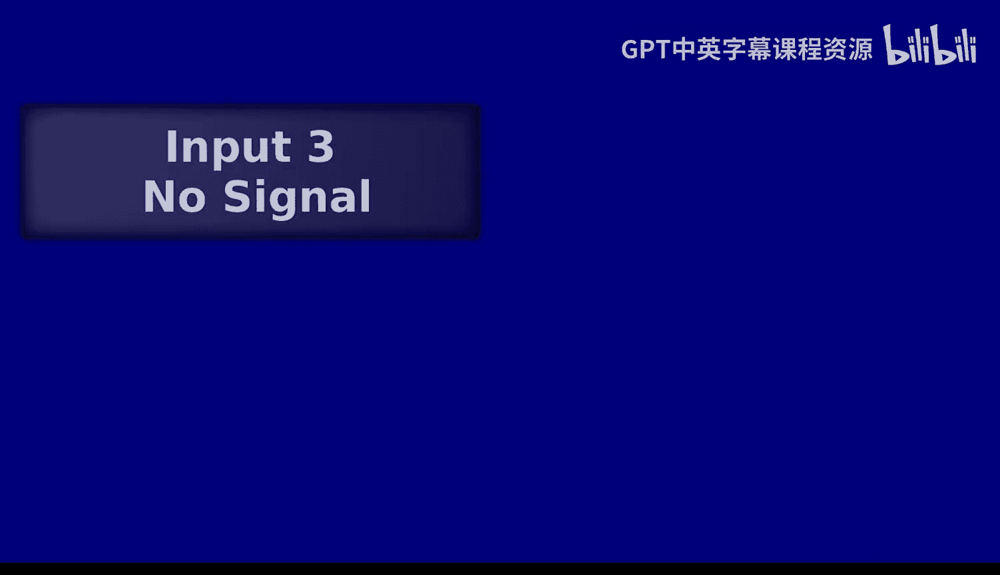

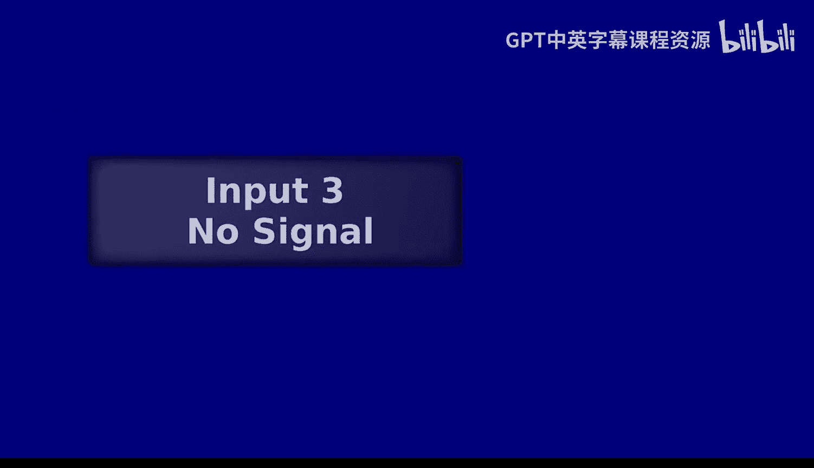

在本节课中，我们将要学习3D视觉的基础知识，特别是相机标定和立体视觉的原理。我们将从2D图像的世界迈向3D场景的重建，理解如何通过多个视角来感知深度。

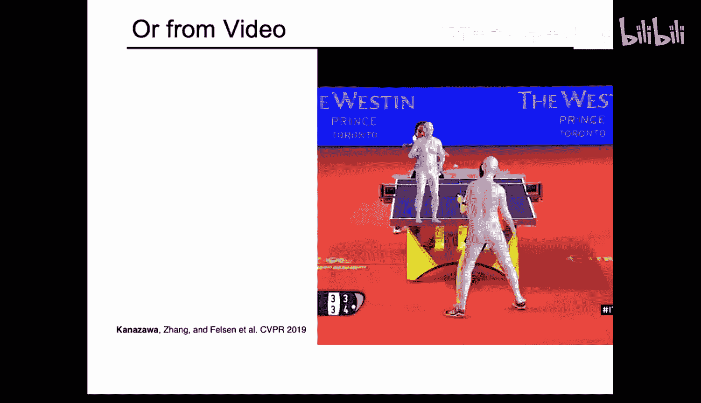

## 概述：从2D到3D

上一节我们讨论了图像处理的各种技术。本节中，我们来看看如何从二维的图像信息中恢复三维的几何结构。这是计算机视觉的核心问题之一，应用广泛，从电影特效到机器人导航都离不开它。

## 坐标系与相机模型

为了理解3D，我们必须首先理解不同的坐标系。世界中的同一个点，可以从不同的视角（坐标系）来描述。

*   **世界坐标系**：一个任意的、固定的三维参考系。
*   **相机坐标系**：以相机光心为原点的三维坐标系，其Z轴通常指向相机的观察方向。
*   **图像坐标系**：三维点投影到二维成像平面上的坐标。

从一个坐标系转换到另一个坐标系需要用到相机参数。

### 相机参数

相机参数分为两类：

1.  **外参**：描述相机在世界坐标系中的位置和朝向。这是一个**刚体变换**，包括旋转矩阵 **R** 和平移向量 **t**。
    *   公式：**X_c = R * X_w + t**，其中 **X_w** 是世界坐标，**X_c** 是相机坐标。
2.  **内参**：描述相机内部的成像几何，将相机坐标系中的点映射到像素坐标。这包括焦距 **f**、主点坐标 **(c_x, c_y)** 等。
    *   通常用一个3x3的内参矩阵 **K** 表示。

从世界坐标到像素坐标的完整投影过程可以用一个3x4的投影矩阵 **P** 表示：
**P = K * [R | t]**

这个矩阵将三维齐次坐标点投影为二维齐次图像坐标，最后一步是除以Z（深度）以完成透视投影。

## 相机标定

对于计算机来说，相机的内外参数通常是未知的。相机标定的目标就是确定这些参数。

以下是标定的基本步骤：

1.  使用一个已知三维几何的标定物（如棋盘格）。
2.  从不同角度拍摄标定物的多张图像。
3.  检测图像中标定物特征点（如角点）的二维像素坐标。
4.  已知这些特征点的三维世界坐标和对应的二维图像坐标，可以建立方程组。
5.  通过**最小二乘法**求解投影矩阵 **P**。
6.  最后，通过矩阵分解（如RQ分解）从 **P** 中分离出内参矩阵 **K** 和外参 **[R | t]**。

标定是许多3D视觉应用的第一步，例如增强现实（AR）中虚拟物体与真实世界的对齐。

## 立体视觉与深度感知

标定好相机后，我们就可以利用多个视角来估计深度。立体视觉是最直观的方法，它模仿了人类双眼的视觉原理。

### 视差与深度

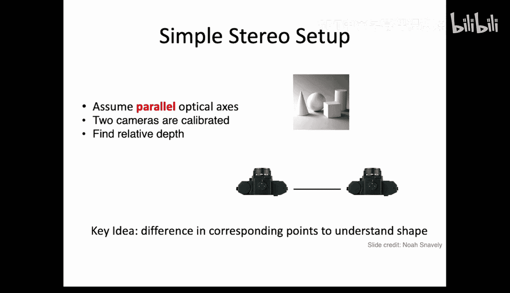

当我们用两只眼睛（或两个相机）观察同一个三维点时，该点在左右两幅图像中的投影位置会有一个水平偏移，这个偏移称为**视差**。

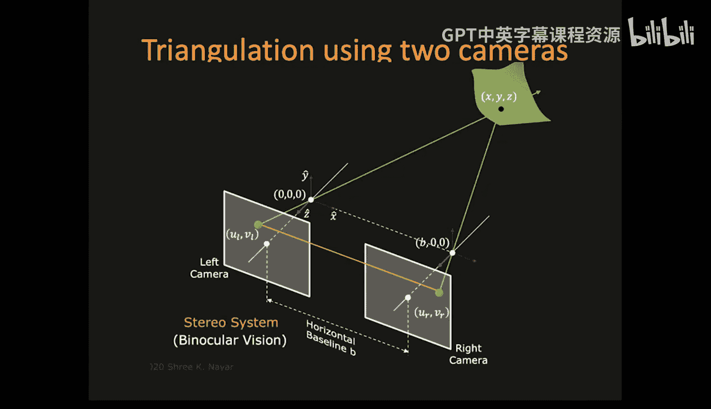

视差与深度存在一个简单而重要的关系：
**深度 Z = (f * B) / d**
其中：
*   **f** 是焦距
*   **B** 是两个相机光心之间的距离（基线）
*   **d** 是视差 **(x_left - x_right)**

**核心结论**：**视差与深度成反比**。物体越近，视差越大；物体越远，视差越小；无限远处的物体视差为零。

### 对应点匹配

要计算视差，我们必须找到左右图像中**对应的像素点**，即来自场景中同一个三维点的投影。这是一个经典的“对应问题”。

在简单的平行双目立体系统中（两个相机光轴平行且成像平面共面），有一个重要的约束可以简化搜索：**一个点在右图中的对应点，必然位于左图中该点所定义的极线上**。在平行双目配置下，这条极线是水平的。

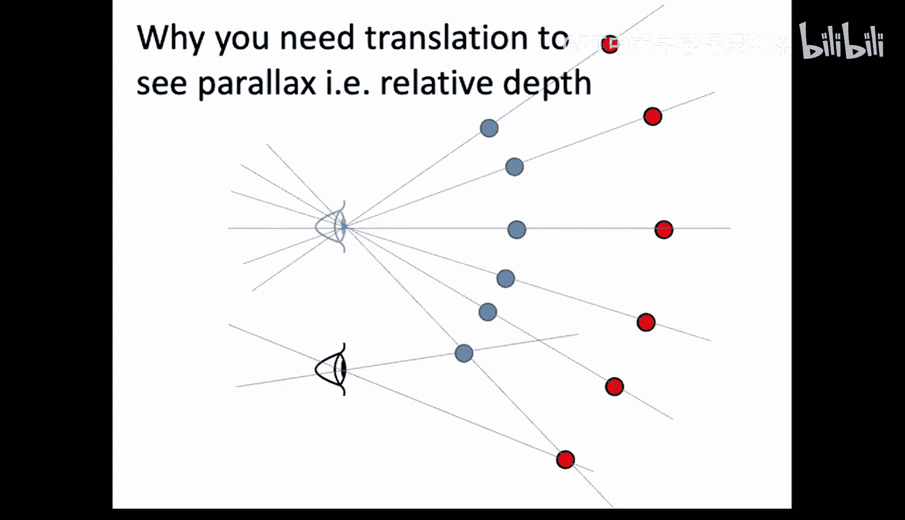

因此，立体匹配算法通常按以下步骤进行：

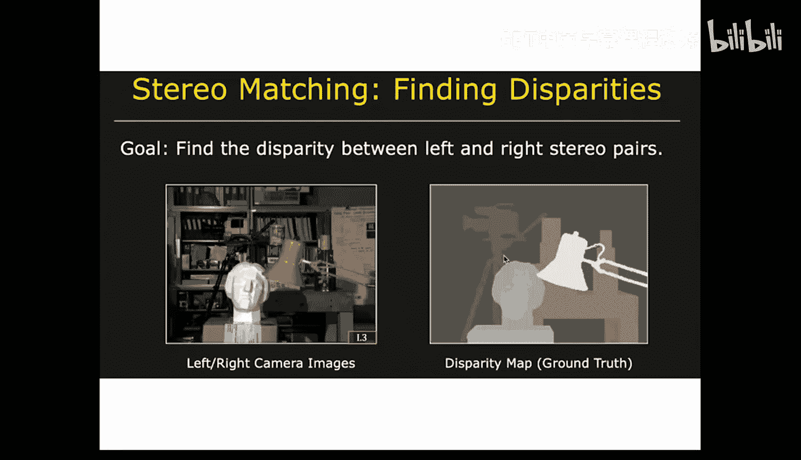

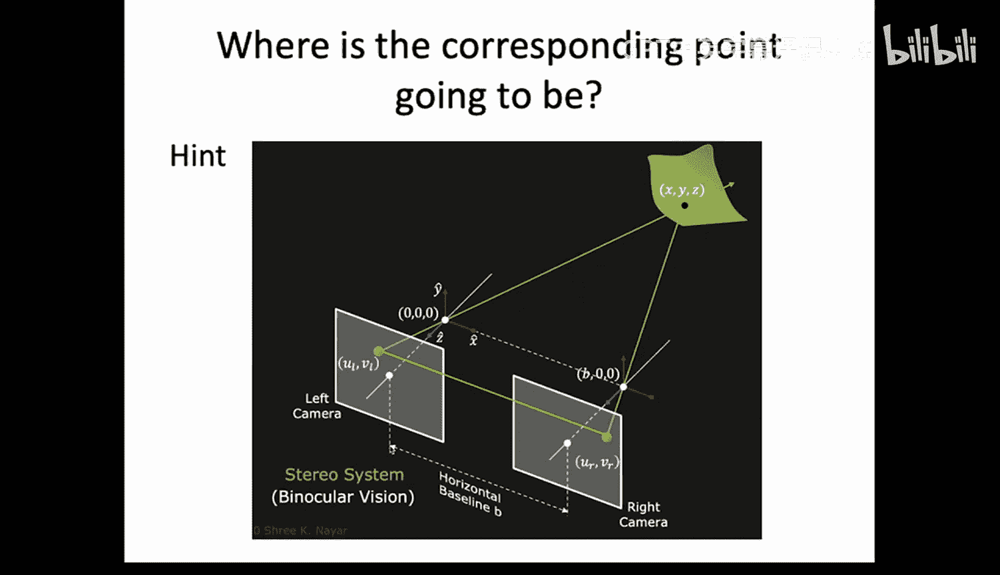

1.  对左图中的每个像素，在其所在的水平扫描线（极线）上搜索右图中的对应像素。
2.  使用相似性度量（如**归一化互相关（NCC）**、**平方差和（SSD）**）来比较左右图的像素块（窗口）。
3.  选择相似度最高的位置作为匹配点，其水平坐标差即为视差。
4.  根据视差公式计算出该点的深度。

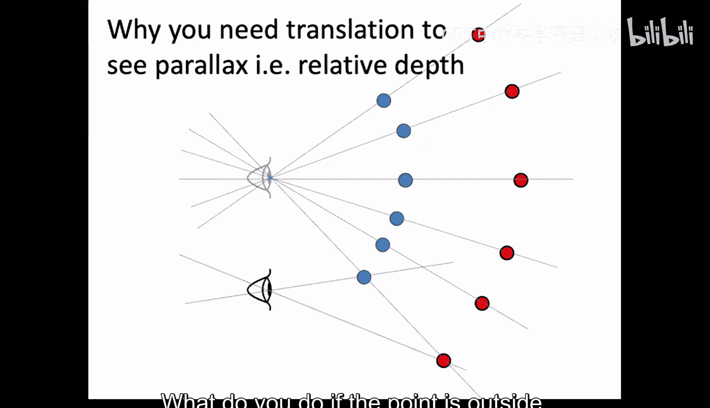

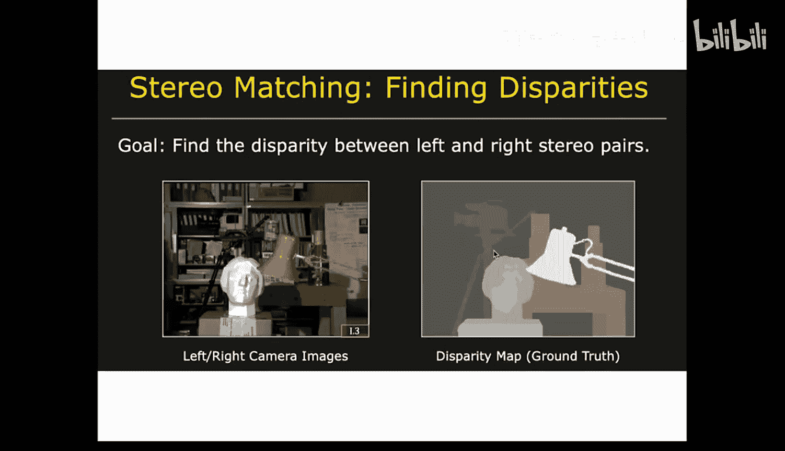

这种方法被称为“密集立体匹配”，最终可以生成一张**视差图**或**深度图**。

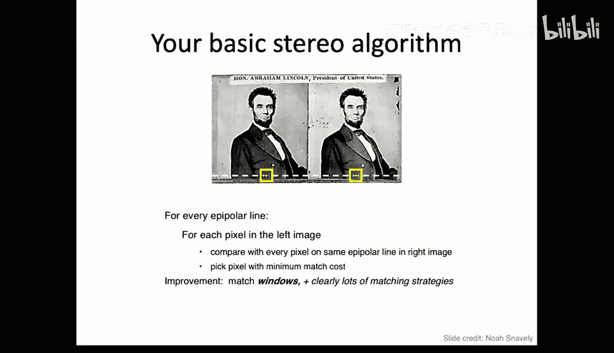

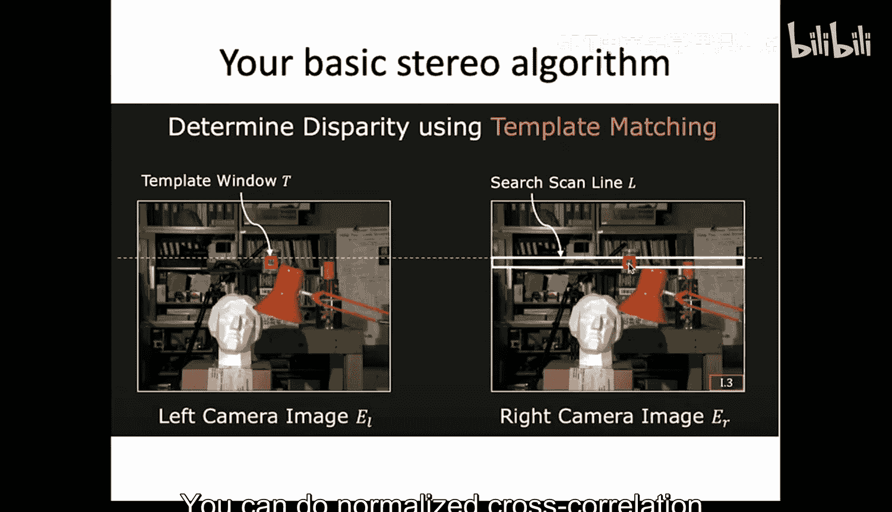

### 挑战与局限性

简单的窗口匹配方法面临一些挑战：
*   **弱纹理区域**：在墙面、天空等区域，缺乏独特的纹理特征，难以找到唯一正确的匹配。
*   **遮挡**：某些点在其中一个视图中可见，在另一个视图中被遮挡，导致匹配失败。
*   **重复纹理**：场景中有周期性图案时，容易产生错误的匹配。
*   **计算量**：尽管极线约束减少了搜索范围，但逐像素匹配的计算量仍然很大。

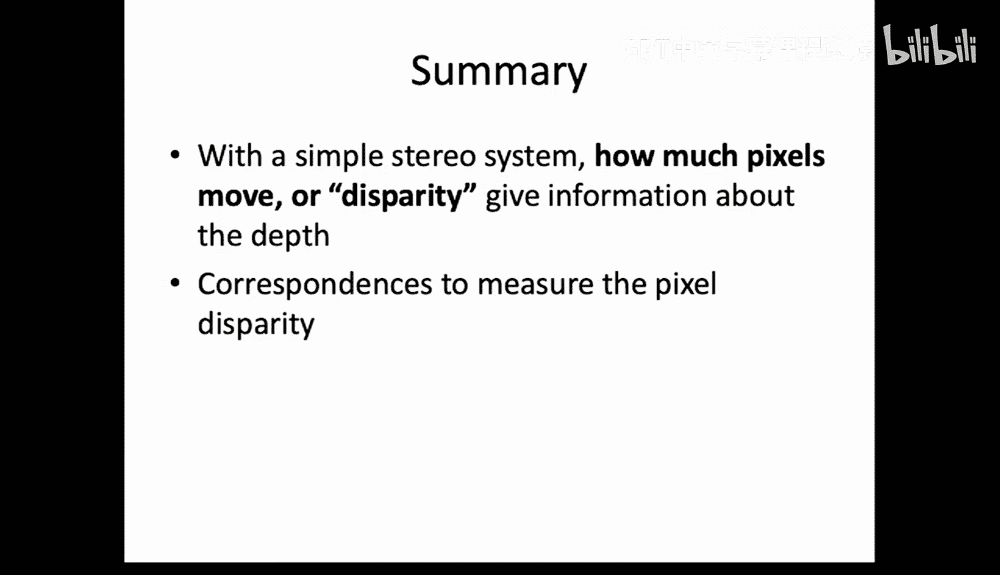

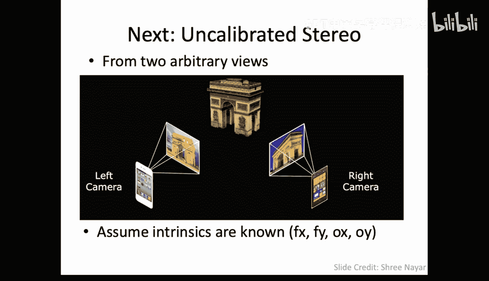

因此，实际的立体视觉系统会采用更复杂的算法，如多尺度分析、全局优化（如动态规划、图割）等来改善结果。

## 总结

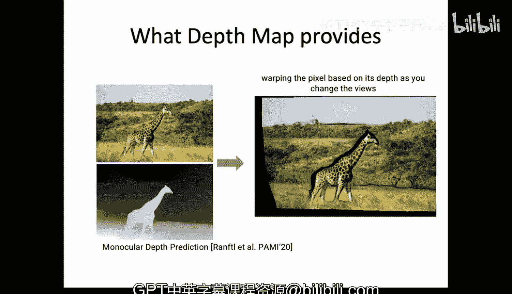

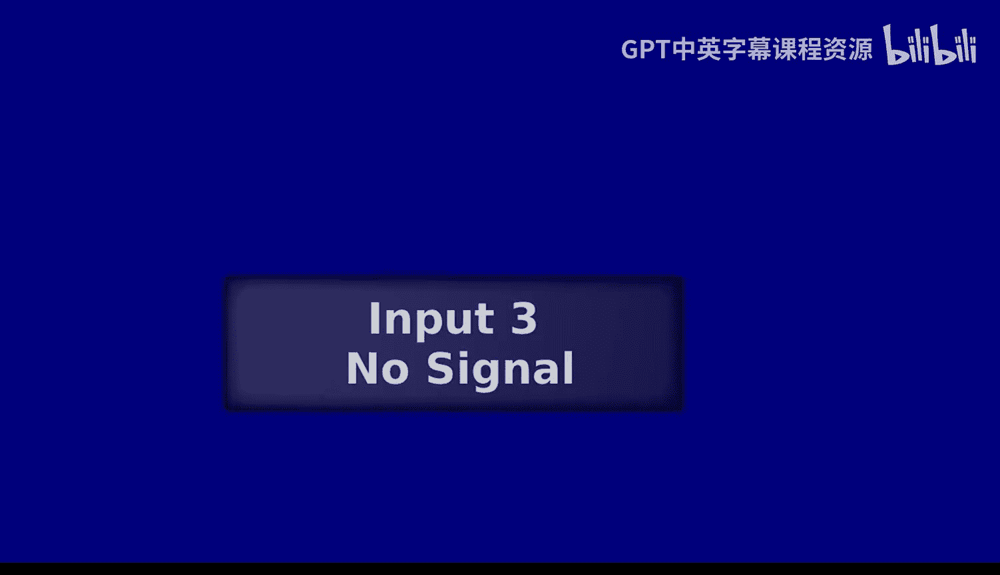

本节课中我们一起学习了3D视觉的入门知识。我们首先介绍了世界、相机和图像坐标系，以及连接它们的相机模型（内参和外参）。接着，我们探讨了如何通过相机标定来估计这些参数。最后，我们深入研究了立体视觉的基本原理：通过两个已标定的相机视图，找到像素间的对应关系，计算视差，并最终根据**公式 Z = (f * B) / d** 恢复出场景的深度信息。理解这些概念是进行更复杂的三维重建、运动估计等高级任务的基础。在下一讲中，我们将探讨更一般化的多视图几何情况。