# 21：对极几何

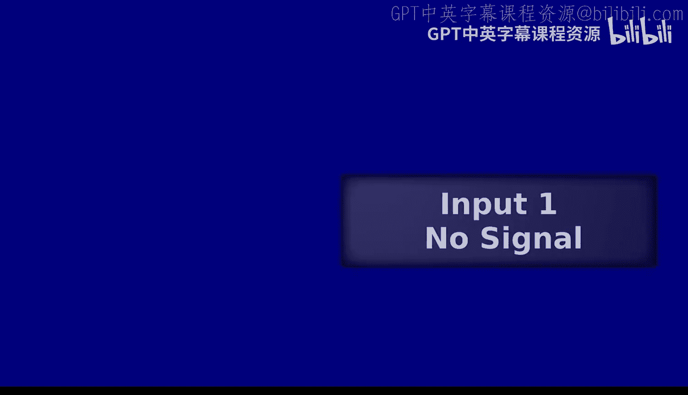

在本节课中，我们将学习对极几何，这是理解双目视觉和三维重建的核心概念。我们将探讨如何利用相机参数来约束对应点的搜索范围，从而更高效地进行三维点云重建。

---

## 概述

上一节我们介绍了相机标定和简单的立体视觉。本节中，我们将探讨更一般的情况：当两个相机不平行（即未校正）时，如何利用对极几何来寻找图像间的对应点，并最终通过三角测量恢复三维结构。

## 从图像坐标到像素坐标

首先，我们回顾一下从世界坐标到像素坐标的转换过程。这里涉及多个坐标系：
1.  **世界坐标系**：描述三维点的位置。
2.  **相机坐标系**：以相机光心为原点的坐标系。
3.  **图像坐标系**：在成像平面上的二维坐标系，原点在图像中心。
4.  **像素坐标系**：以图像左上角为原点的坐标系，单位是像素。

从世界到相机的转换是一个刚体变换（旋转 `R` 和平移 `t`）。从相机坐标到图像坐标需要进行透视投影，并乘以相机的内参矩阵 `K`。内参矩阵 `K` 包含了焦距 `f`、主点坐标 `(ox, oy)` 和纵横比等信息。将图像坐标原点从中心平移到左上角，就得到了像素坐标。

**公式**：像素坐标 `(u, v, 1)^T` 可以通过下式从相机坐标 `(Xc, Yc, Zc)^T` 得到：
`[u; v; 1] = K * [Xc/Zc; Yc/Zc; 1]`，其中 `K = [[f, 0, ox], [0, f, oy], [0, 0, 1]]`。

## 三维重建的大图景

三维重建问题可以分解为三个核心要素的相互求解：
*   **对应点**：不同图像中匹配的二维点。
*   **相机参数**：包括内参和外参。
*   **三维结构**：场景中点的三维坐标。

它们之间的关系是：
*   已知三维点和对应点，可以求解相机参数（**相机标定**）。
*   已知相机参数和对应点，可以求解三维结构（**三角测量**）。
*   已知相机参数，可以帮助寻找对应点（**对极几何**）。
*   已知对应点，可以估计相机参数（**运动恢复结构**）。

我们之前讨论的简单立体视觉（相机平行）是上述关系的一个特例。本节将讨论更一般的双视图几何。

## 对极几何的直观理解

假设我们有两张从不同位置拍摄的图像。对于左图中的一点 `p`，如何在右图中找到它的对应点 `p‘`？

一种低效的方法是进行全图搜索。然而，对极几何告诉我们，`p‘` 必然位于右图中的一条特定直线上，这条线称为**对极线**。

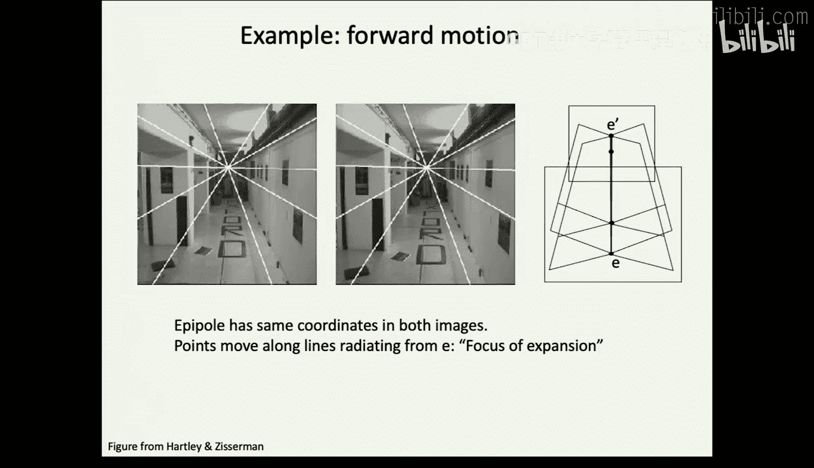

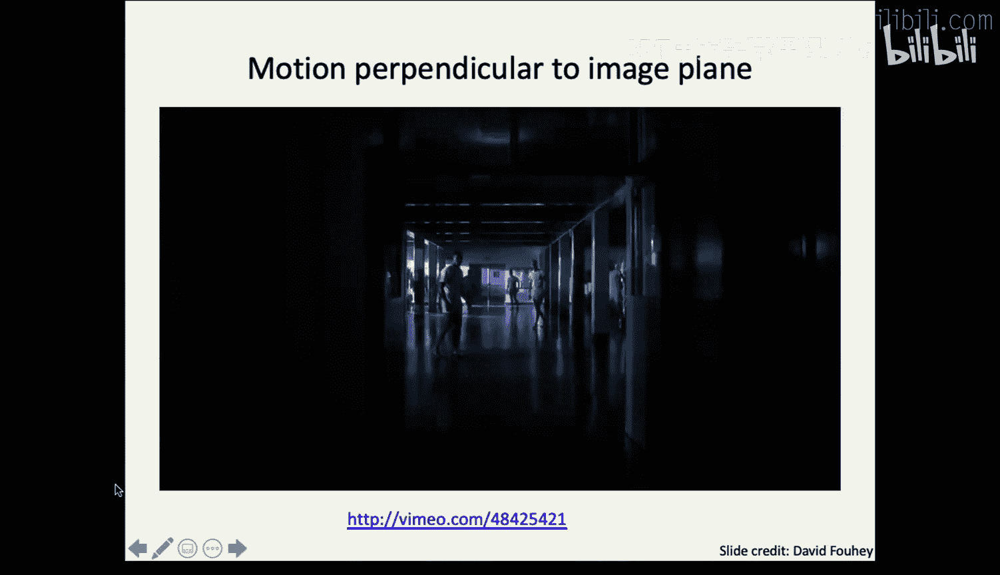

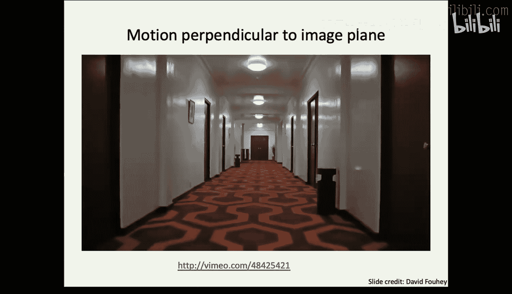

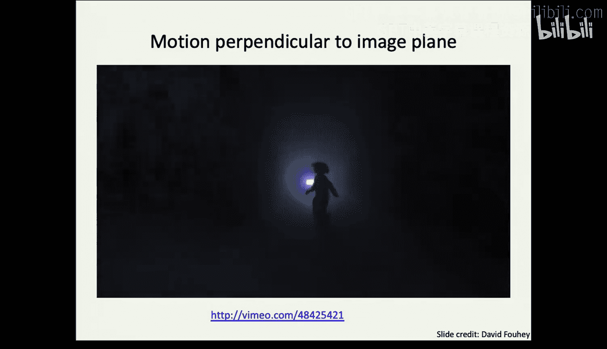

**对极线的来源**：
1.  从左相机光心 `O` 出发，通过左图像点 `p` 发射一条射线。这条射线代表了空间中所有可能投影到 `p` 点的三维点。
2.  将这条三维射线投影到右相机的成像平面上，形成的投影线就是右图中的对极线。
3.  无论真实的三维点在这条射线的哪个位置，它在右图像中的投影点 `p‘` 都必然落在这条对极线上。

因此，对应点的搜索范围从二维平面缩小到了一维直线，极大地简化了匹配问题。同理，对于右图中的点，在左图中也存在对应的对极线。

## 核心概念与定义

以下是理解对极几何的关键术语：

*   **基线**：连接两个相机光心的直线。基线长度会影响三维重建的精度和难度。
*   **对极平面**：由两个相机光心和空间中的一个三维点所确定的平面。
*   **极点**：基线分别与两个成像平面的交点。它也是一个相机光心在另一个相机图像中的投影。
*   **对极线**：对极平面与成像平面的交线。

在简单的平行双目系统中，极点位于无穷远处，对极线是水平的，这就是我们上节课讨论的情况。

## 本质矩阵

为了数学化地描述对极几何，我们引入**本质矩阵**。假设相机已标定（内参 `K` 已知），我们可以将图像坐标**归一化**，消除内参的影响，在归一化坐标下进行分析。

设左相机坐标系为世界坐标系（外参为 `[I | 0]`），右相机相对于左相机的外参为 `[R | t]`。对于一个空间点 `X`，其在左右归一化图像平面上的投影点分别为 `x` 和 `x‘`。

根据共面约束（向量 `(x, t, R^T x‘)` 共面），我们可以推导出如下关系：

**公式**：`x‘^T E x = 0`，其中 `E = [t]_x R` 称为**本质矩阵**。`[t]_x` 是平移向量 `t` 的反对称矩阵。

本质矩阵 `E` 是一个 3x3 的矩阵，具有以下性质：
*   **秩为 2**。
*   **具有 5 个自由度**（旋转 3 个，平移 3 个，但平移尺度不确定，减去 1 个）。
*   对于左图点 `x`，其在右图的对极线 `l‘` 可计算为：`l‘ = E x`。
*   对于右图点 `x‘`，其在左图的对极线 `l` 可计算为：`l = E^T x‘`。
*   极点 `e` 和 `e‘` 分别是 `E` 和 `E^T` 的零空间向量。

## 基础矩阵

如果相机未标定（内参 `K` 未知），我们需要使用**基础矩阵** `F`。基础矩阵描述了在像素坐标系下的对极几何关系。

**公式**：`p‘^T F p = 0`，其中 `p` 和 `p‘` 是像素齐次坐标。基础矩阵 `F` 与本质矩阵 `E` 的关系为：`F = K‘^{-T} E K^{-1}`。

基础矩阵 `F` 也是一个 3x3 的矩阵，性质如下：
*   **秩为 2**。
*   **具有 7 个自由度**（9个矩阵元素，减去尺度因子1个，再因秩为2约束减去1个）。
*   同样，`F p` 给出了右图的对极线，`F^T p‘` 给出了左图的对极线。

## 从对应点估计基础矩阵（八点法）

当我们既不知道相机参数，也不知道三维结构，但有一些图像对应点时，可以直接从这些对应点估计基础矩阵 `F`。

对于每一对对应点 `(p, p‘)`，根据 `p‘^T F p = 0` 可以得到一个关于 `F` 元素的线性方程。由于 `F` 有 7 个自由度，理论上至少需要 7 对点才能求解。但在实践中，通常使用**八点算法**来获得一个线性解。

以下是八点算法的简要步骤：
1.  收集至少 8 对高质量的图像对应点。
2.  利用每对点构建一个线性方程，组成齐次线性方程组 `Af = 0`，其中 `f` 是 `F` 矩阵元素拉成的向量。
3.  对系数矩阵 `A` 进行奇异值分解（SVD），最小奇异值对应的右奇异向量即为 `f` 的解。
4.  将 `f` 重构为 3x3 矩阵 `F_est`。
5.  由于噪声影响，`F_est` 的秩可能不为 2。需要强制其秩为 2：对 `F_est` 进行 SVD，令最小的奇异值为 0，再重新组合矩阵，得到最终的秩 2 基础矩阵 `F`。

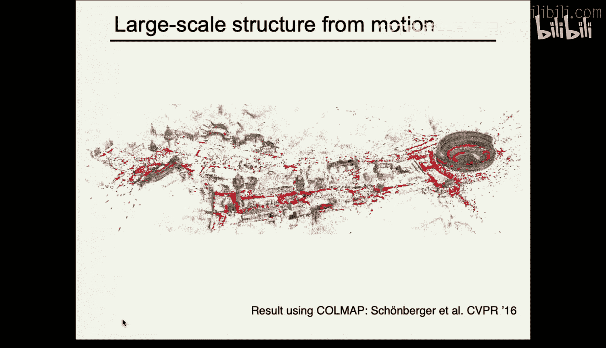

## 三角测量

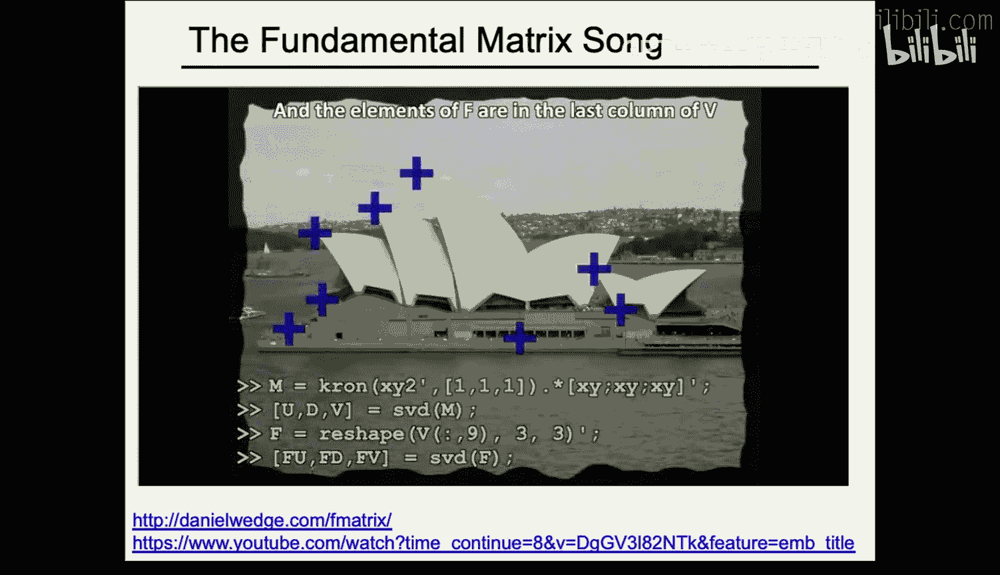

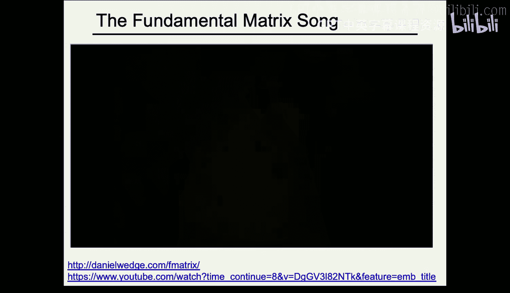

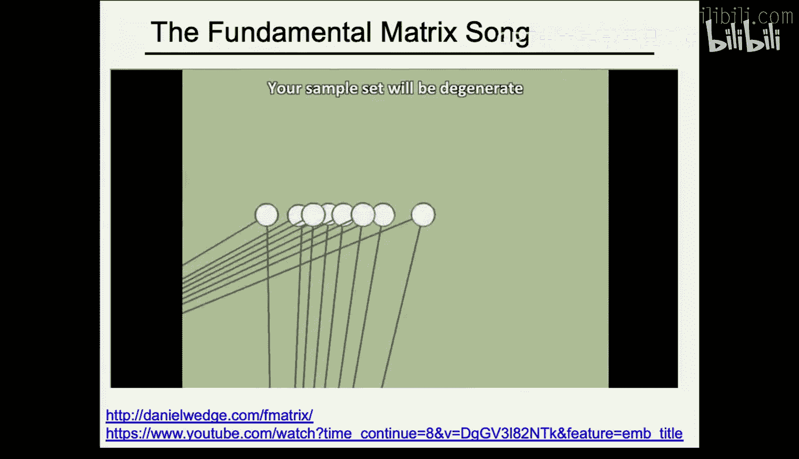

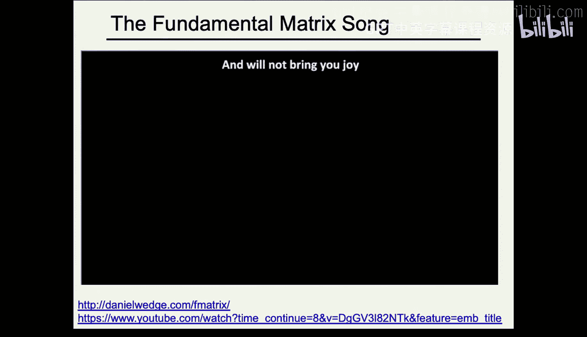

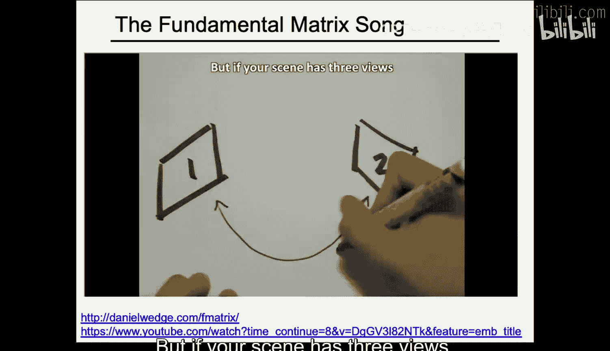

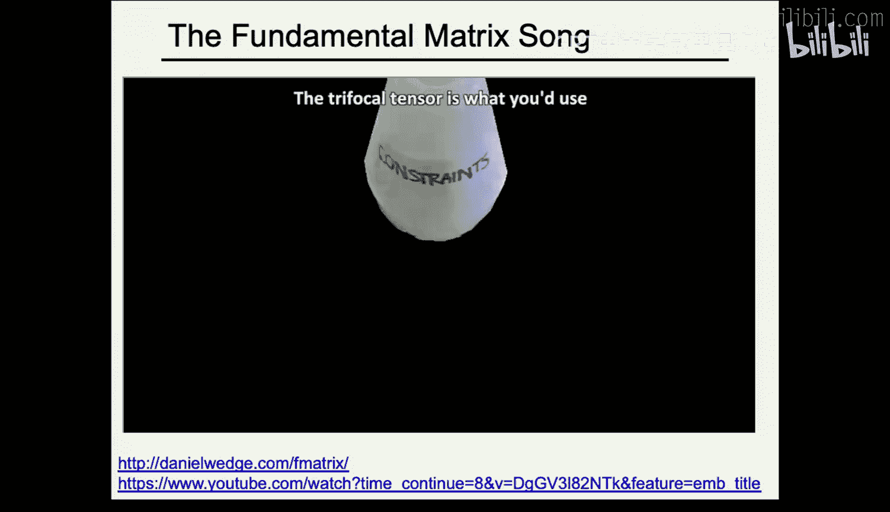

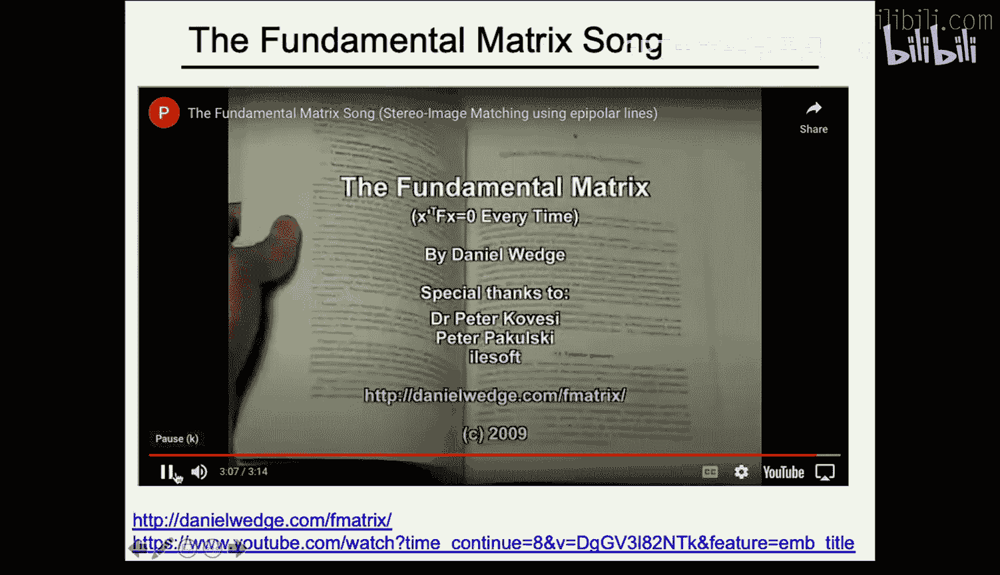

在利用对极几何找到图像间的对应点 `(p, p‘)`，并且已知两个相机的投影矩阵 `P` 和 `P‘` 后，下一步就是通过**三角测量**恢复该点的三维坐标 `X`。

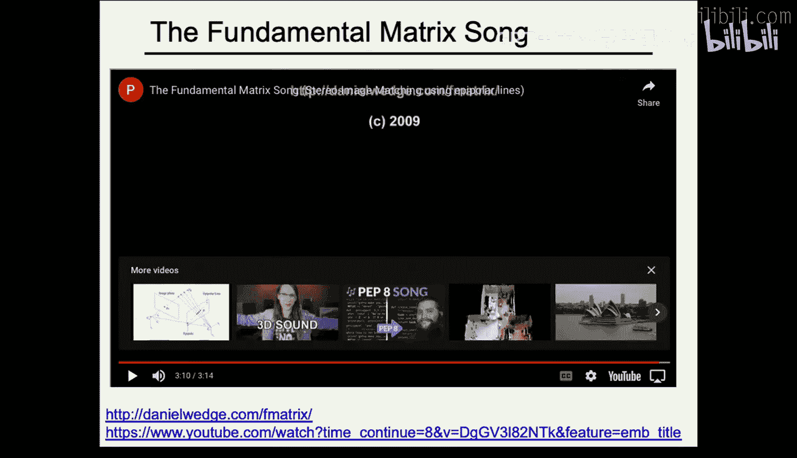

理想情况下，从两个相机光心反向投影的两条射线应该相交于 `X`。但由于相机参数和对应点都存在噪声，这两条射线往往并不相交。

因此，三角测量通常转化为一个最小二乘问题：寻找一个三维点 `X`，使得其投影到两个图像上的位置与观测到的对应点 `(p, p‘)` 的**重投影误差**最小。

**公式**：最小化 `|| p - PX ||^2 + || p‘ - P‘X ||^2`。

这可以通过线性方法（构造方程组 `AX = 0` 求解）或非线性优化方法（如捆绑调整）来求解。非线性方法能更准确地最小化几何误差，是实践中常用的方法。

## 总结

本节课我们一起学习了双视图几何的核心——对极几何。
*   我们首先理解了对极几何如何将对应点的搜索空间从二维图像缩小到一维直线。
*   然后，我们学习了描述已标定相机对极几何的**本质矩阵 `E`**，以及描述未标定相机对极几何的**基础矩阵 `F`**。
*   接着，我们了解了如何仅利用图像对应点来估计基础矩阵的**八点算法**。
*   最后，我们探讨了在获得对应点和相机参数后，通过**三角测量**恢复三维点坐标的过程。

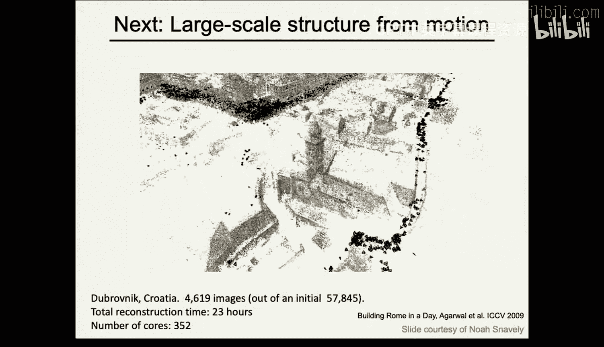

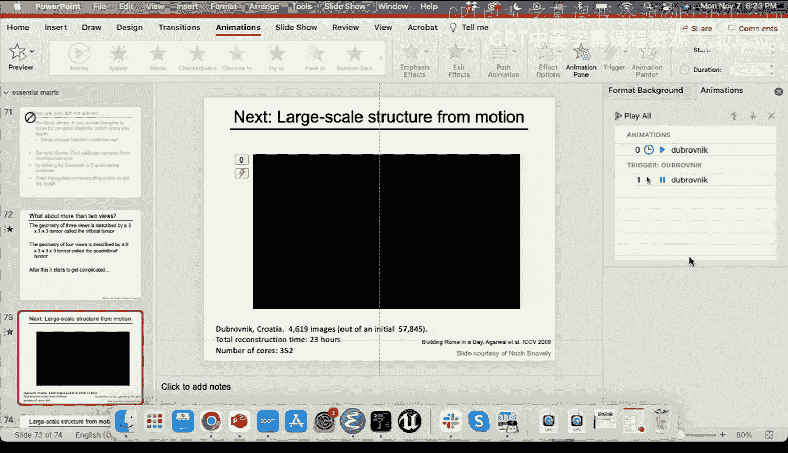

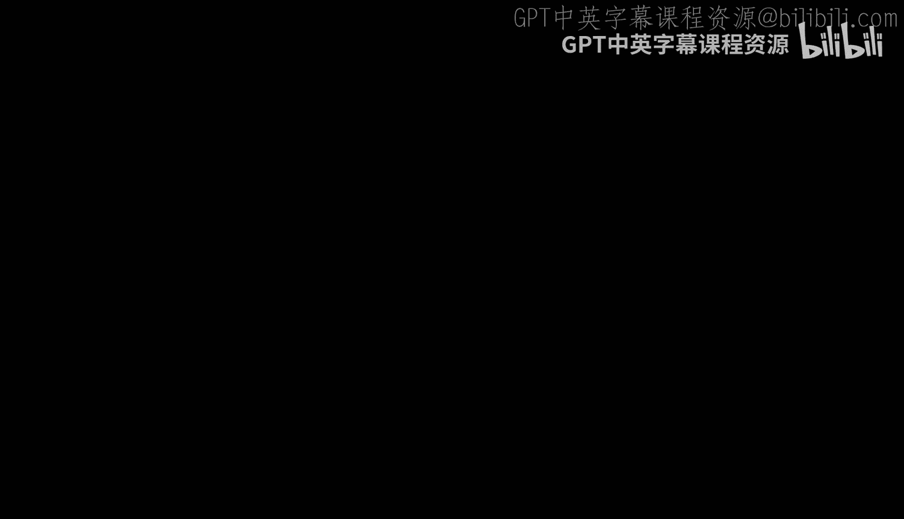

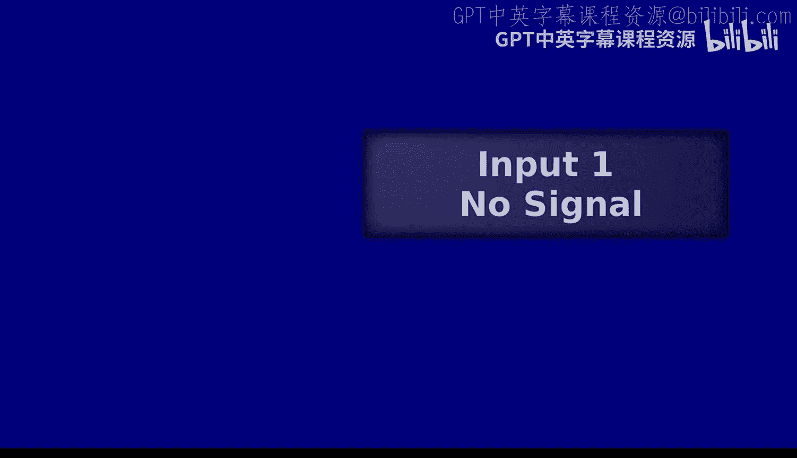

对极几何是连接二维图像与三维世界的关键桥梁，也是后续多视图三维重建（运动恢复结构）的基础。在下节课中，我们将把概念扩展到多张图像，探讨大规模场景的三维重建。