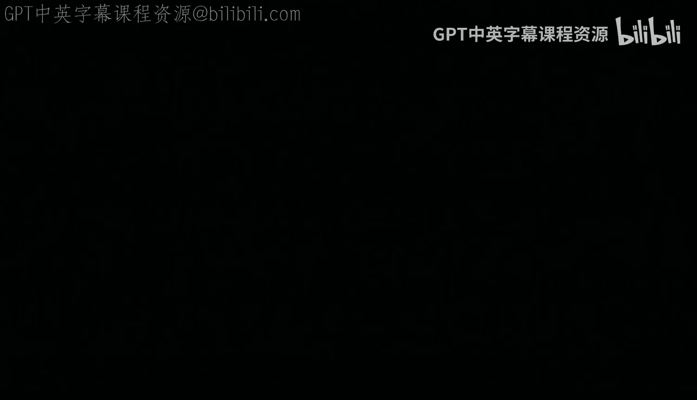
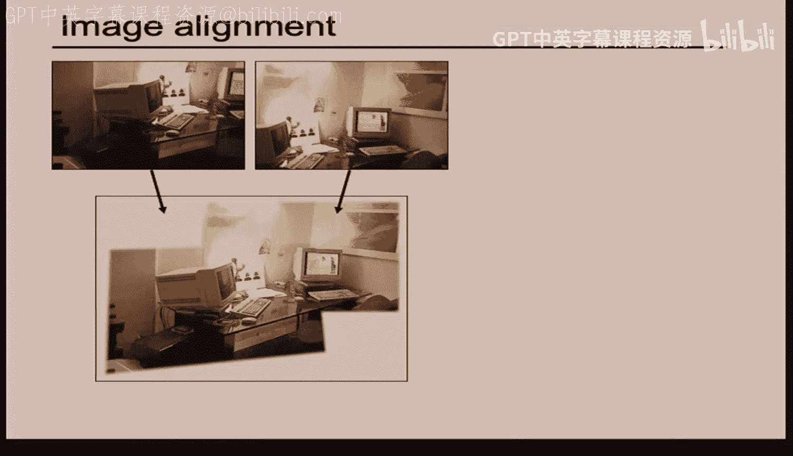

# 22：图像拼接与全景图制作

在本节课中，我们将学习图像拼接的核心原理，特别是如何使用单应性变换将多张图像对齐并融合成一张全景图。我们将深入探讨单应性变换的几何意义、其在不同场景下的应用，以及实现自动对齐和图像融合的技术。

---

## 单应性变换与全景图基础

上一节我们介绍了图像变换的基本概念。本节中，我们来看看如何利用单应性变换进行图像拼接。

图像拼接的目标是，将围绕同一投影中心旋转拍摄的多张照片，通过几何变换对齐到一个共同的平面上，从而合成一张视野更广的图像。这就像用手机拍摄多张照片后合成一张全景图。

其核心原理是**单应性变换**。当所有图像都来自同一个投影中心时，场景中的任意一点在不同图像上的投影坐标，可以通过一个3x3的投影变换矩阵 **H** 相互关联。

**公式：**
`x' = H * x`
其中，`x` 和 `x'` 是齐次坐标下的对应点。

这意味着，只要我们找到两张图像之间足够多的对应点对，就能计算出这个 **H** 矩阵，从而将一张图像“扭曲”到另一张图像的视角下。

---

## 投影中心变化带来的挑战

上一节我们介绍了理想情况下的图像拼接。本节中我们来看看，当拍摄图像的相机位置发生移动时，会带来什么挑战。

如果两张照片不是从同一个点拍摄的（即投影中心不同），那么直接使用单应性变换进行对齐就会出现问题。这是因为场景中的物体具有深度，从不同位置观察时，它们在图像上的相对位置会发生移动，这种现象称为**视差**。

**核心问题：**
对于非平面场景或非无穷远场景，来自不同投影中心的图像无法用一个全局的单应性变换完美对齐。在重叠区域，同一个像素位置可能会对应场景中两个不同的点，导致图像内容冲突。

**例外情况：**
在以下两种情况下，即使投影中心移动，单应性变换依然有效：
1.  场景是**平面**的（例如一面墙、一个白板）。
2.  场景离相机**无限远**（例如远处的风景）。

在这两种情况下，深度信息的影响可以忽略不计，因此图像间的变换仍可用单应性来描述。

---

## 单应性变换的两种应用

理解了基本原理后，我们可以总结单应性变换的两个主要应用场景：

1.  **全景图拼接**：相机绕其投影中心旋转拍摄。此时，图像间的变换是纯旋转，可以用单应性完美对齐。
2.  **平面场景对齐**：将一幅图像（如一张图片）投影到另一个图像中存在的某个平面上（如墙面、屏幕）。此时，两个相机位置可以不同，但目标场景必须是平面。

第二种应用可以实现许多创意效果，例如将一幅画“贴”到街边的墙上，或者将视频投影到建筑物表面。

---

## 图像融合技术

在通过单应性变换将图像对齐后，我们需要将重叠的部分平滑地融合起来。以下是几种常见的融合方法：

*   **简单平均**：在重叠区域对像素值取平均。这种方法简单，但容易在接缝处产生模糊的鬼影。
*   **基于距离的加权融合**：根据像素到各自图像边界的距离来计算权重，进行线性插值。效果比简单平均稍好，但接缝可能依然明显。
*   **拉普拉斯金字塔融合**：这是效果较好的方法。其思想是：
    *   将图像分解为不同频率的带（金字塔层）。
    *   在低频部分（图像的大致轮廓）使用平滑的权重进行融合。
    *   在高频部分（图像的细节、边缘）使用更直接的融合方式（如直接选择某张图像的像素）。
    *   最后将各层融合结果合并。这种方法能有效消除接缝，获得自然的过渡效果。

---

## 超越平面投影：柱面与球面全景图

将图像投影到平面有时会导致边缘拉伸变形，视觉效果不自然。为了解决这个问题，我们可以将图像投影到其他几何表面上：

*   **柱面投影**：将图像投影到一个圆柱面上，然后将圆柱面展开。这适用于水平旋转拍摄的全景图。在展开的柱面图像上，图像间的对齐简化为水平方向的平移搜索，大大降低了计算复杂度。
*   **球面投影**：将图像投影到一个球面上，然后展开（例如生成类似世界地图的等距柱状投影）。这可以处理包含上下视角的全景图（360°x180°）。

这两种投影的关键步骤仍然是：
1.  将每张图像反投影到对应的射线（去畸变）。
2.  通过旋转将射线对齐（估计相机姿态）。
3.  将对齐后的射线投影到目标表面（柱面或球面）。
4.  融合生成最终的全景图。

**挑战**：这些投影高度依赖于相机**焦距**参数的准确性。错误的焦距估计会导致严重的对齐错误。焦距可以从照片的EXIF信息中获取，也可以通过标定或搜索优化来估计。

---

## 自动图像对齐初探

手动选择特征点进行对齐非常繁琐。项目第二部分的目标是实现自动对齐。主要有两类思路：

**1. 直接法（光流法）**
直接在图像像素强度上优化变换参数。例如，通过最小化两幅图像重叠区域的像素差（如平方差SSD）来寻找最佳的单应性矩阵 **H**。
*   **优点**：精度高，能利用所有图像信息。
*   **挑战**：
    *   优化问题非凸，存在大量局部极小值。
    *   搜索空间大（8个参数），计算量大。
    *   严重依赖初始估计，如果初始位置离最优解太远，很容易优化失败。
*   **常用技巧**：使用图像金字塔（从低分辨率到高分辨率）进行由粗到精的优化，可以扩大收敛范围。

**2. 特征点法**
这是更常用、更稳健的方法。其步骤是：
*   **特征检测**：在每幅图像中自动检测具有显著性的关键点（如角点、斑块）。
*   **特征描述**：计算每个关键点周围的局部特征描述符（如SIFT、ORB）。
*   **特征匹配**：通过比较描述符，找到两幅图像之间的对应点对。
*   **模型估计**：使用匹配的点对（如RANSAC算法）鲁棒地估计单应性矩阵 **H**。

特征点法对图像外观变化（如光照、视角）更具鲁棒性，并且能提供较好的初始变换估计，常与直接法结合使用以获得亚像素精度。

---

## 总结

本节课中我们一起学习了图像拼接与全景图制作的核心技术。我们首先回顾了单应性变换的几何原理，并明确了其有效应用的两个条件：固定投影中心或平面场景。接着，我们探讨了图像对齐后的融合技术，特别是拉普拉斯金字塔融合法。为了获得更好的视觉效果，我们介绍了柱面和球面投影方法。最后，我们展望了自动图像对齐的两种主要途径——直接法和特征点法，为接下来的实践项目打下了理论基础。掌握这些知识，你将能够理解并实现如手机全景拍摄、谷歌街景等应用背后的关键技术。