# 24：神经辐射场——未来影像的革命性技术

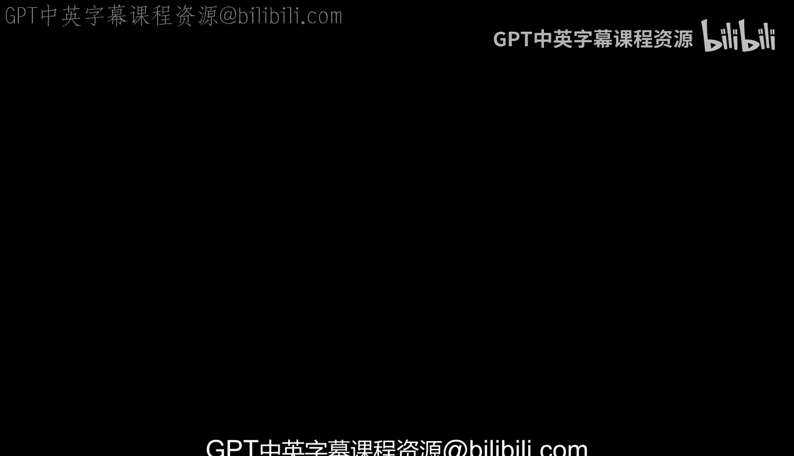

在本节课中，我们将探讨一项名为“神经辐射场”的新兴技术，它如何以惊人的方式捕捉和重建三维场景，并可能彻底改变电影制作和视觉特效领域。我们将从基本原理出发，逐步了解其工作方式、优势、应用场景以及当前面临的挑战。

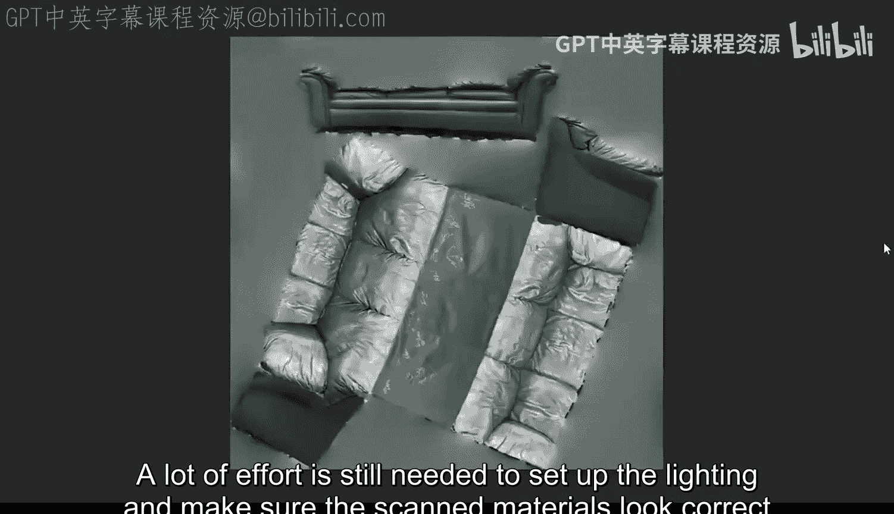

## 概述：从传统扫描到神经渲染

上一节我们介绍了传统摄影测量法的局限性。本节中，我们来看看神经辐射场如何提供一种全新的解决方案。

神经辐射场是一种利用神经网络从一组二维照片中学习并重建三维场景的技术。与传统的摄影测量法不同，它不仅能重建几何形状，还能精确捕捉场景中光线的复杂行为，如反射和折射。

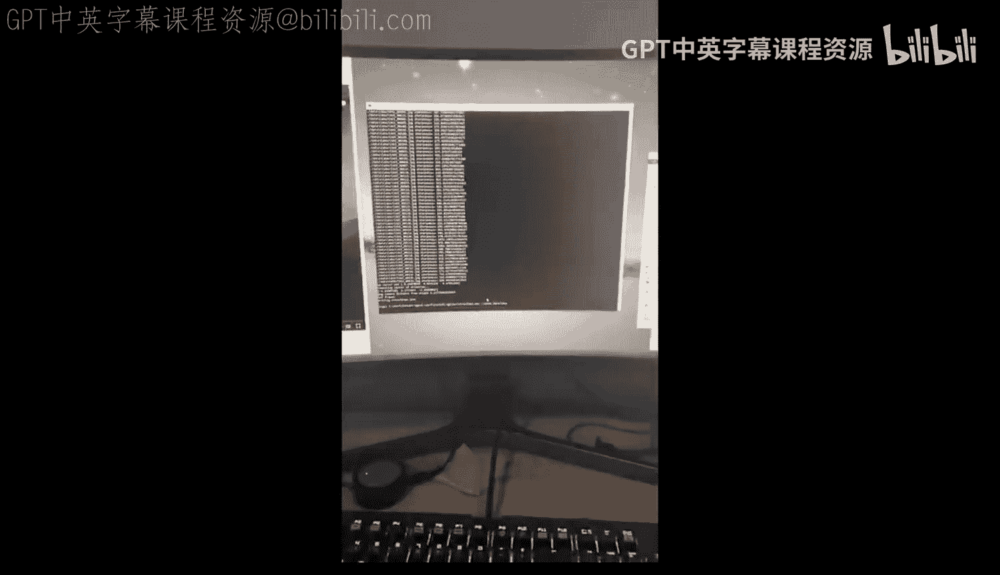

## 核心原理：光线与反射

要理解视觉特效艺术家为何对神经辐射场感到兴奋，我们首先需要理解光线的工作原理。

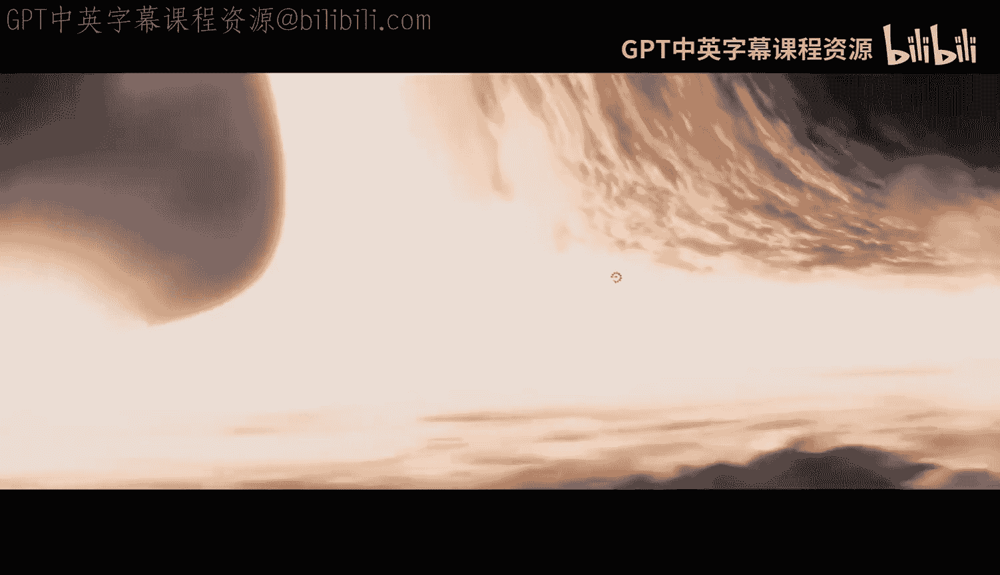

**核心概念**：我们看到的几乎所有东西都是反射光。除非直接观看光源，否则光线在到达我们眼睛之前，必须先从某个物体表面反射。因此，从技术上讲，我们看到的一切都是反射。这些反射在说服我们的大脑相信物体是真实存在的过程中，扮演着微妙但至关重要的角色。

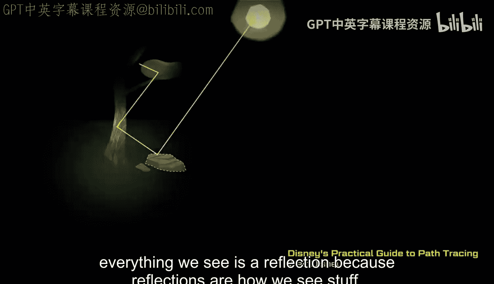

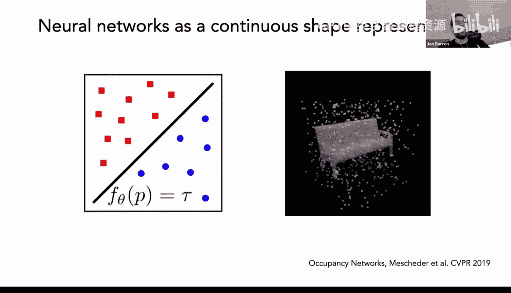

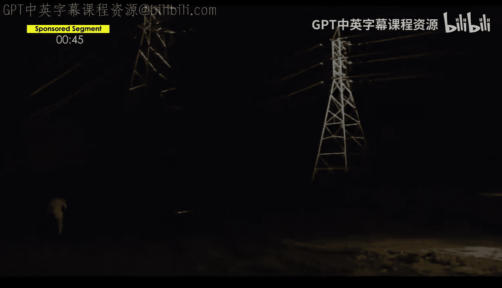

## 传统摄影测量法的挑战

在深入神经辐射场之前，让我们回顾一下传统方法的瓶颈。

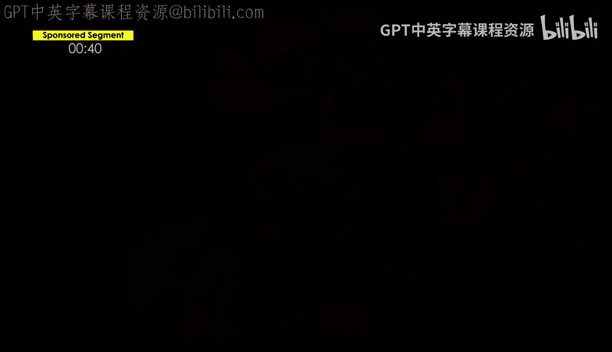

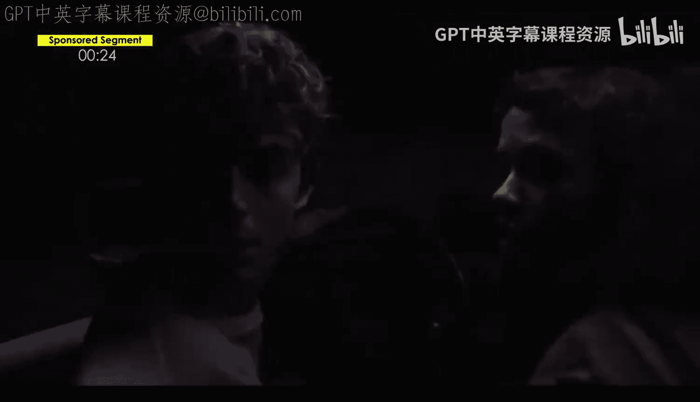

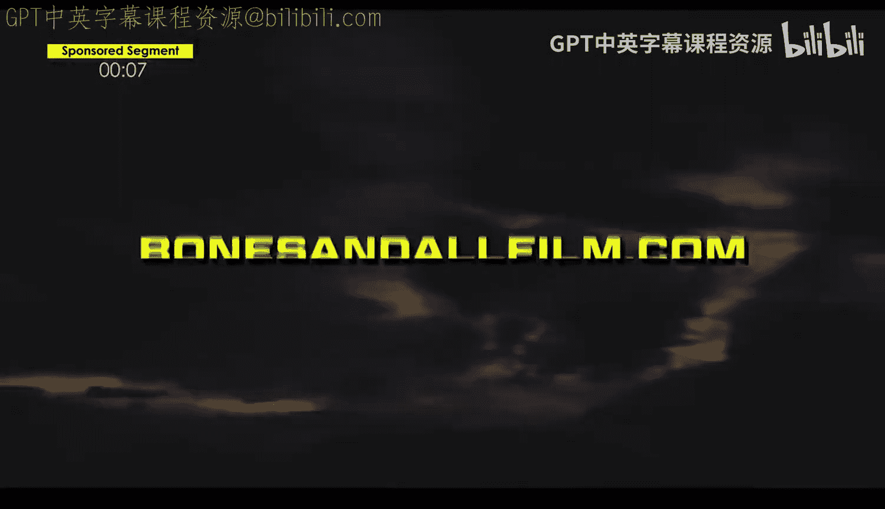

以下是传统摄影测量法难以处理的情况：
*   **高反射表面**：如铬球，其外观随视角变化，导致像素信息不一致，无法重建。
*   **透明物体**：如玻璃瓶，光线穿过而非反射，导致扫描数据缺失。
*   **复杂光照**：需要大量后期工作来设置灯光和校正材质，使其看起来自然。
*   **夜间场景**：在光线不足的条件下，传统扫描通常无法工作。

## 神经辐射场的优势

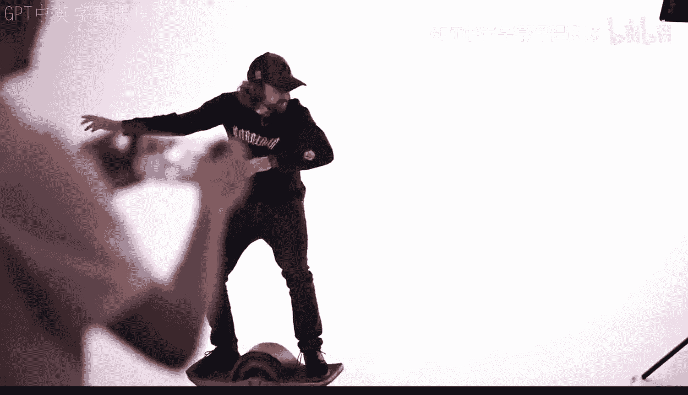

神经辐射场通过“神经渲染”克服了上述许多限制。

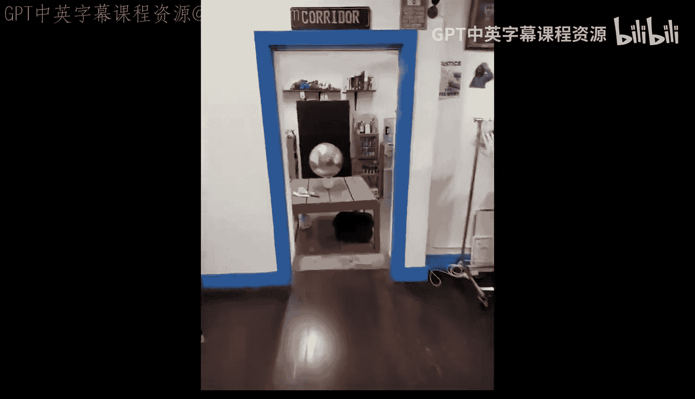

其核心优势在于，它能学习三维空间中每个点的颜色如何随观察角度而变化。当拥有整个空间的这些点信息时，最终得到的结果与用于创建扫描的照片惊人地相似。这意味着它能自动、逼真地处理反射和透明效果，而无需手动添加CG灯光。

## 实践应用与工作流程

了解了原理后，我们来看看如何实际应用这项技术。

神经辐射场的工作流程已变得非常便捷。例如，使用Luma AI等应用程序，你只需拍摄一组照片并上传到服务器，几分钟后即可获得一个神经辐射场模型。这为各种创意应用打开了大门。

以下是神经辐射场的一些具体应用方向：
*   **动态背景替换**：即使摄像机移动，也能将前景人物合成到不同的神经辐射场背景中。
*   **创建视觉门户**：将现实中的门洞变成通往另一个神经辐射场世界的入口。
*   **比例与尺度操控**：通过缩放摄像机运动数据，可以轻松改变人物与场景的相对大小，创造出巨人或微缩景观的效果。
*   **后期摄像机运动**：可以在拍摄后，为静态场景自由选择或创建复杂的摄像机运动轨迹，实现类似“时间冻结”的效果。

## 技术细节与当前局限

尽管潜力巨大，神经辐射场技术仍处于早期阶段。

目前，直接从神经辐射场提取的几何模型（网格）会丢失其最宝贵的神经渲染特性（如视角相关的反射）。提取的纹理是烘焙好的漫反射贴图，不会随视角变化。因此，神经辐射场最强大的用法是将其视为“视频素材”而非用于提取资源的“场景”。

此外，输出结果可能包含模糊、伪影或孔洞。工具链也相对初级，实现复杂效果需要大量手动调整。

## 未来展望与总结

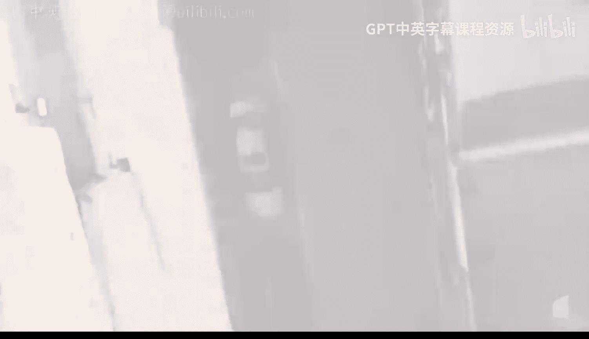

本节课中，我们一起学习了神经辐射场技术。

神经辐射场提供了一种快速、廉价且逼真地复制现实的新方法。其逼真度与用于训练它的摄像机特性（如动态范围、镜头质量）紧密相关。虽然当前结果并非完美，但其潜力巨大。随着技术发展（例如动态模糊、景深等后期效果的集成），未来可能无法区分神经辐射场渲染与真实视频。

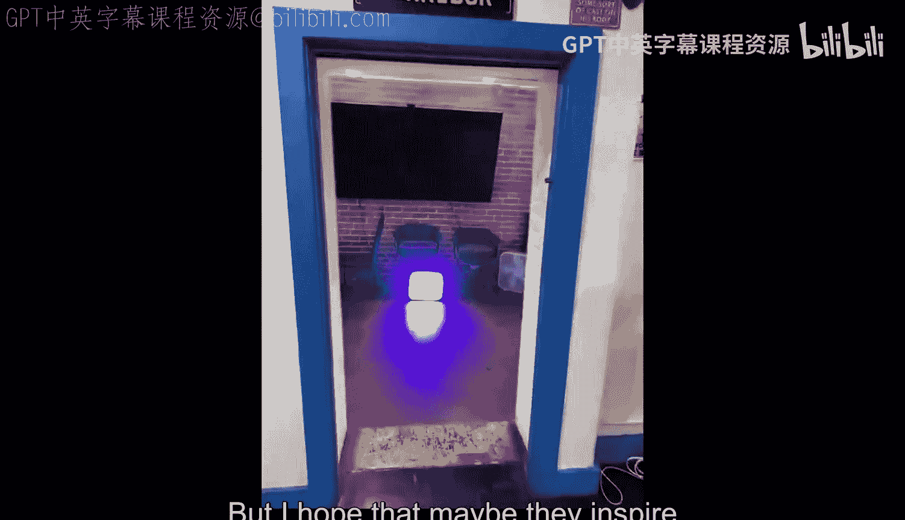

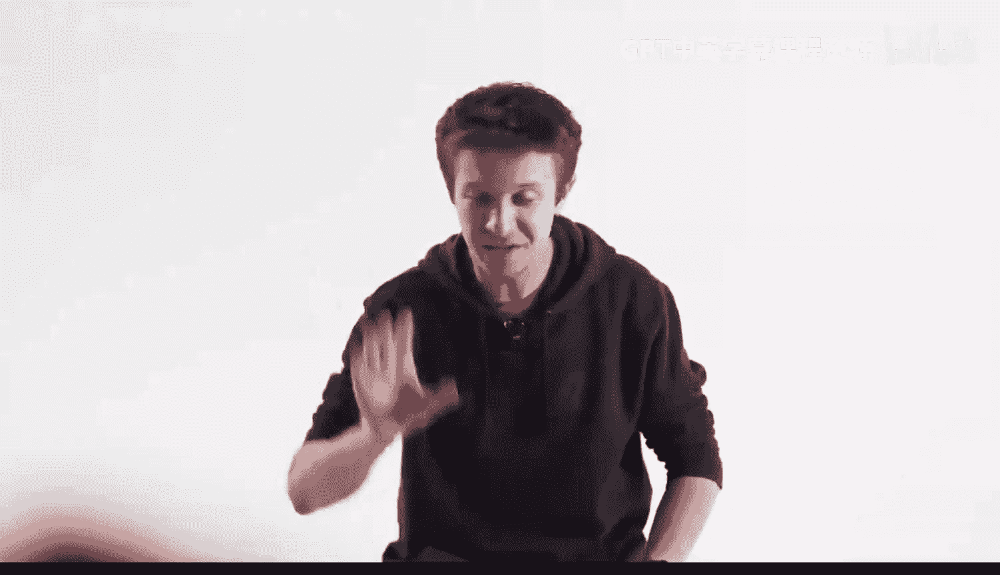

作为艺术家，我们的职责是不断探索并推动这项技术的边界。神经辐射场不仅仅是工具，它代表了一种全新的影像创作思维方式。