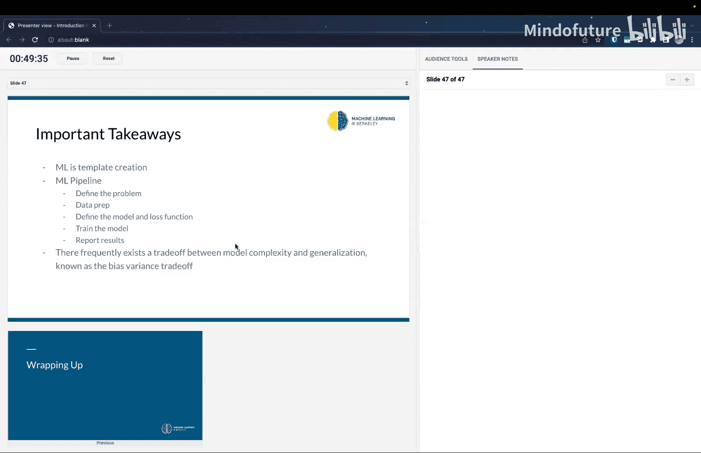

# 001：机器学习导论 🎯


在本节课中，我们将要学习机器学习的基本概念，了解其核心思想、工作流程以及一些关键术语。我们将从一个宏观的视角出发，理解机器学习如何通过数据来“学习”函数，而不是手动编写程序。

---

## 课程介绍与概述

欢迎来到CS 198/126：计算机视觉的深度学习课程。我是Jake，今天的讲师。这门课程旨在为初学者提供一个关于深度学习和计算机视觉的入门训练营。我们的目标是深入探讨计算机视觉领域，并尽可能接近当前的前沿技术，让大家了解这个领域的真实面貌。

这门课程的重点是计算机视觉，我们希望提供一次积极、有趣的首次机器学习体验。课程将涵盖从基础的图像分类、定位，到更高级的主题，如3D视觉和生成式艺术。

---

## 什么是机器学习？

上一节我们介绍了课程的目标，本节中我们来看看机器学习的核心定义。

机器学习是一种通过数据来近似函数的范式。与传统编程不同，传统编程需要我们手动编写代码来实现特定功能。而在机器学习中，我们利用数据来“学习”函数应该是什么样子。

例如，编写一个程序来识别手写数字“7”非常困难。但通过机器学习，我们可以让模型从大量数据中学习如何区分数字“7”和其他数字。这本质上是一种“模板创建”的过程。

我们定义一个函数的结构（模板），但留下一些**参数**（例如公式中的 `a`），这些参数的值将从数据中学习得到。函数的行为由这些参数决定。

一个简单的例子是：
```python
if input > a:
    return True
else:
    return False
```
这里的 `a` 就是一个需要从数据中学习的参数。

---

## 机器学习的类型

了解了基本概念后，我们来看看机器学习有哪些主要类型。

以下是三种主要的机器学习类型：

1.  **监督学习**：数据带有标签。例如，给一张猫的图片打上“猫”的标签。任务包括分类（识别图片内容）和回归（预测连续值）。
2.  **无监督学习**：数据没有标签。目标是从数据本身发现结构或模式，例如对图像进行聚类分组。
3.  **强化学习**：智能体通过与环境的交互来学习如何采取行动以获得最大奖励。本课程不涉及此内容。

---

## 关键术语

在深入流程之前，我们先熟悉一些核心术语。

*   **函数/模型**：一个带有可学习参数的模板。
*   **参数/权重/偏置**：模型中需要从数据中学习的值。权重通常用于乘法，偏置用于加法。
*   **超参数**：在训练开始前设定的、非学习得到的配置。例如，模型的结构、学习率等。
*   **损失函数/成本函数/风险函数**：用于衡量模型预测与真实值之间差距的函数。我们的目标是**最小化**这个函数。
*   **特征**：数据的输入或经过学习得到的表示。

---

## 机器学习流程

现在，让我们看看一个完整的机器学习项目是如何一步步进行的。

机器学习流程通常包含以下几个步骤：

1.  **定义问题**：明确你要解决什么任务，你的数据是什么样子，以及如何衡量成功。
2.  **准备数据**：
    *   **收集数据**：获取高质量、标注良好的数据至关重要。“垃圾进，垃圾出”。
    *   **数字化表示**：将所有数据（图像、文本等）转换为数值形式。
    *   **特征选择与向量化**：选择重要的数据特征，并将它们组织成固定顺序的向量。
    *   **标签表示**：对于分类任务，常用**独热编码**。例如，对于数字“3”（假设共有10类，从0开始索引），其标签向量是 `[0, 0, 0, 1, 0, 0, 0, 0, 0, 0]`。这允许模型输出概率分布，而不仅仅是单个数字。
3.  **定义模型和损失函数**：
    *   **选择模型**：根据问题选择函数模板（例如，线性模型、神经网络）。
    *   **选择损失函数**：定义一个可优化的指标，用于评估模型的好坏。例如，在分类任务中，可以使用均方误差来衡量模型输出与独热编码标签之间的距离。
4.  **训练模型**：使用算法（如梯度下降）来调整模型的参数，以最小化损失函数。
5.  **评估与测试**：使用模型从未见过的测试数据集来评估其真实性能，并与现有技术进行比较。

---

## 泛化、偏差与方差

训练好模型后，我们关心它在新数据上的表现，这引出了泛化的概念。

我们不仅关心模型在训练数据上的表现，更关心它在**新数据**（测试数据）上的表现。这种能力称为**泛化**。

模型的复杂程度会影响泛化能力，这通常通过**偏差-方差权衡**来理解：

*   **偏差**：模型由于过于简单而倾向于做出某些预测，导致在训练和测试数据上都表现不佳。这是**欠拟合**。
*   **方差**：模型由于过于复杂而过度匹配训练数据中的噪声和细节，导致在训练数据上表现极好，但在新数据上表现很差。这是**过拟合**。

我们的目标是找到一个“恰到好处”的模型复杂度，使其既能捕捉数据中的重要模式，又能保持良好的泛化能力。通常需要通过尝试不同的模型和超参数来找到这个平衡点。

---

## 总结

本节课中我们一起学习了机器学习的基础知识。

我们了解到，机器学习的核心是**模板创建**——定义一个带参数的函数结构，并从数据中学习这些参数。我们回顾了机器学习的主要类型、关键术语以及标准的工作流程：定义问题、准备数据、选择模型与损失函数、训练和评估。

最后，我们探讨了机器学习中一个根本性的挑战：**偏差-方差权衡**。理解模型复杂度与泛化能力之间的关系，对于构建有效的机器学习系统至关重要。



希望这为你提供了一个清晰的机器学习入门视角。在接下来的课程中，我们将把这些概念应用到具体的计算机视觉任务和深度学习模型中。