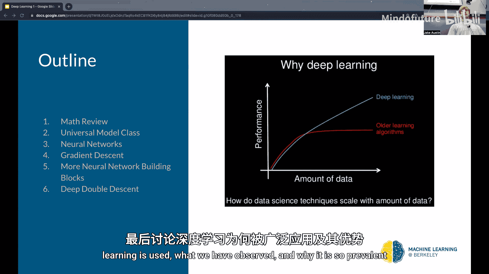
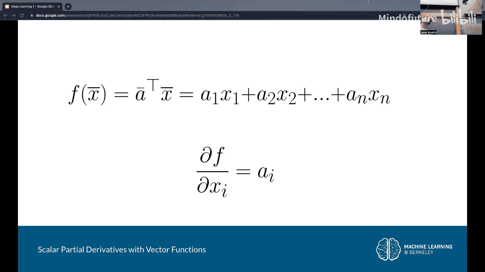
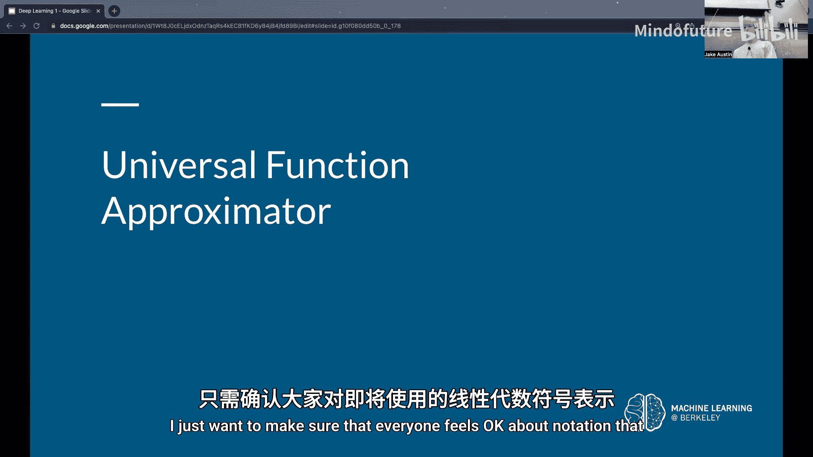
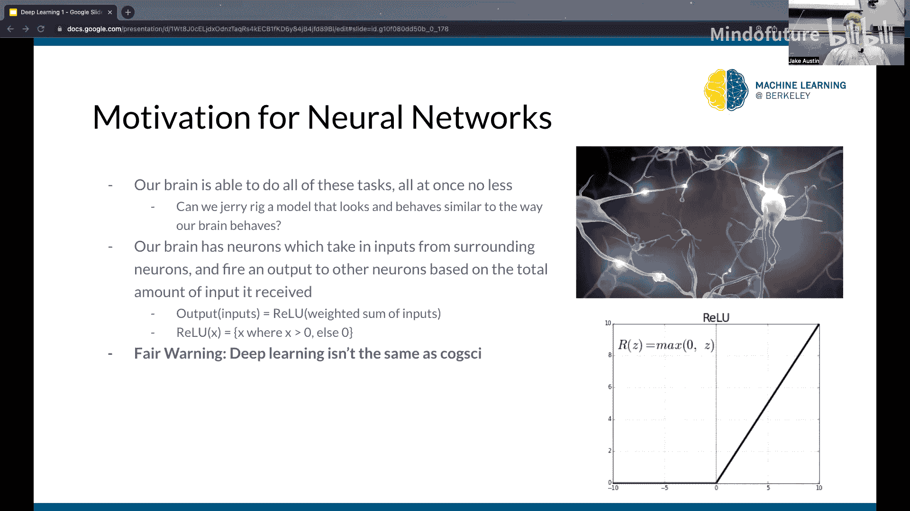
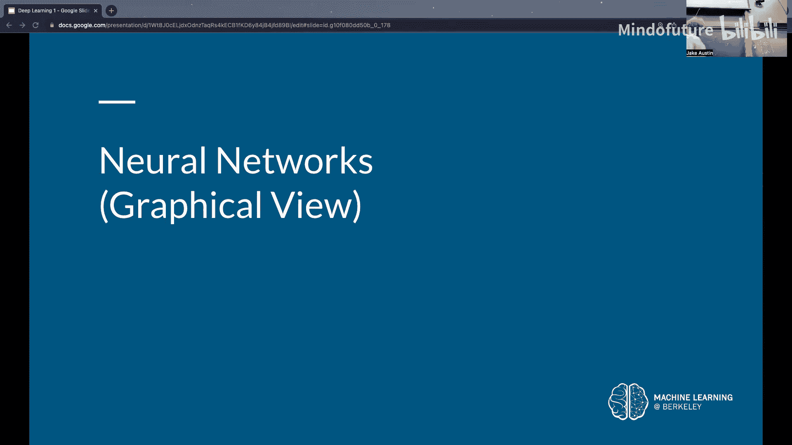
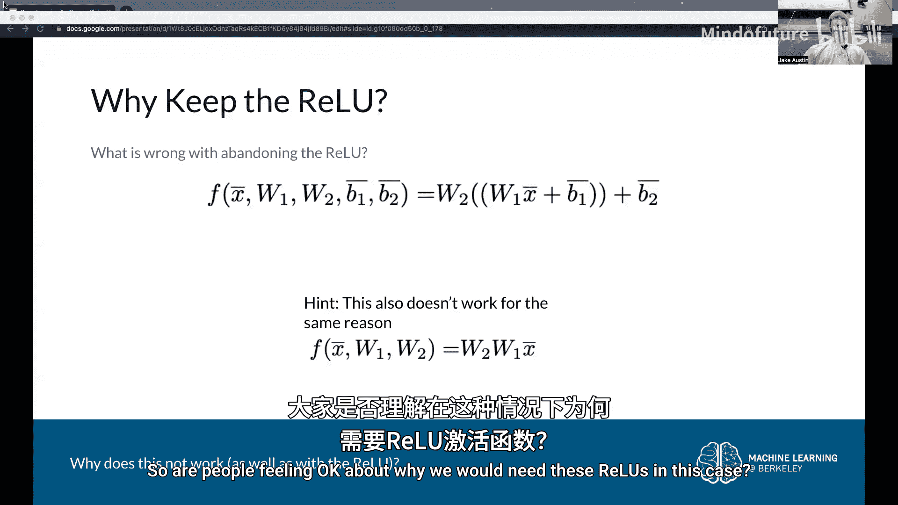
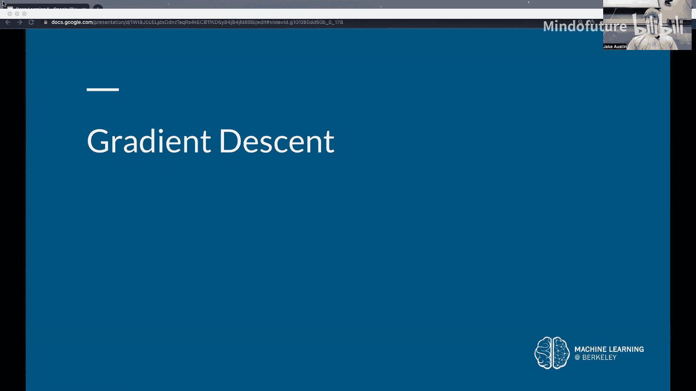
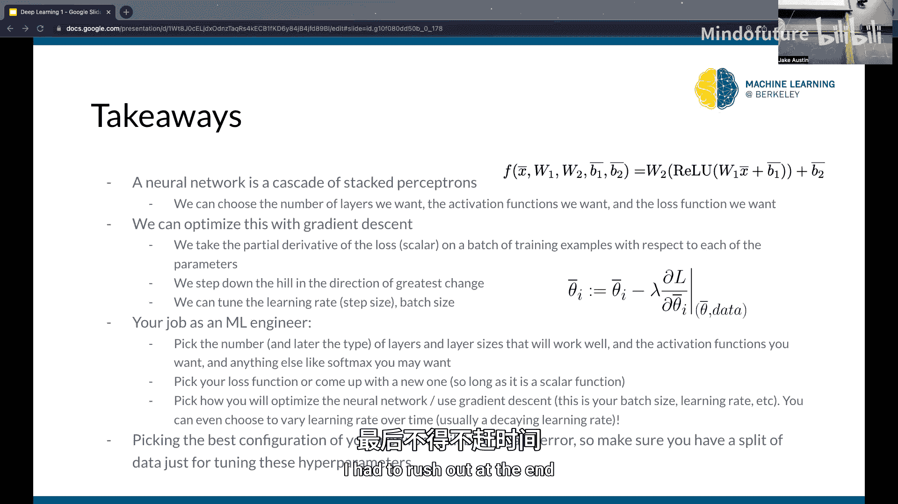

# 002：深度学习导论（第一部分）

在本节课中，我们将学习深度学习的基础知识，包括神经网络的基本构成、前向传播的计算方式以及如何通过梯度下降法来训练模型。我们将从数学基础回顾开始，逐步深入到神经网络的动机、结构及其训练过程。

## 数学基础回顾

上一节我们介绍了课程概述，本节中我们来看看学习深度学习所需的一些基础数学知识，特别是线性代数和向量微积分。

### 向量点积

向量点积是两个向量对应元素相乘后求和的操作。给定两个向量 **w** 和 **x**，其点积定义为：
**w** · **x** = w₁x₁ + w₂x₂ + ... + wₙxₙ
在矩阵表示中，这通常写作 **w**ᵀ**x**，其中 **w** 是行向量，**x** 是列向量。

### 矩阵向量乘法

矩阵向量乘法可以看作是对矩阵的每一行与向量进行点积运算。对于一个矩阵 **W** 和一个向量 **x**，其乘积 **Wx** 是一个向量，其中第 i 个元素是 **W** 的第 i 行与 **x** 的点积。

### 符号约定

在神经网络中，我们使用以下符号：
*   **x**：输入向量。
*   **y**：标签向量（例如，分类任务中的 one-hot 编码）。
*   **W**：权重矩阵，其元素是待学习的参数。
*   **b**：偏置向量，其元素也是参数。
*   **θ**：代表所有参数（如 **W** 和 **b**）的集合。
*   下标（如 bᵢ）表示从向量或矩阵中取出的单个标量值。

### 向量函数的导数

即使函数的输入和输出是向量，我们仍然可以对其求导。例如，对于一个输出为标量的函数 L(θ)，我们可以计算其关于参数向量 **θ** 的梯度 ∇L(θ)。梯度是一个向量，其每个分量是 L 对 **θ** 中相应标量参数的偏导数。

## 神经网络的动机

上一节我们回顾了必要的数学工具，本节中我们来看看为什么需要神经网络。机器学习任务（如回归、分类）常常需要建模非常复杂的非线性函数。我们希望能有一个像人脑一样通用的模型，可以处理各种任务。虽然神经网络只是受人脑神经元结构的启发（而非精确模拟），但它提供了一种构建强大、通用函数逼近器的框架。

## 神经网络基础：感知机与激活函数

神经网络的基本构建单元是感知机，它是对生物神经元的简化数学模型。

一个感知机执行以下操作：
1.  接收多个输入 (x₁, x₂, ..., xₙ)。
2.  为每个输入分配一个权重 (w₁, w₂, ..., wₙ)。
3.  计算加权和并加上一个偏置项 (b)：z = w₁x₁ + w₂x₂ + ... + wₙxₙ + b。
4.  将结果 z 通过一个非线性**激活函数**，如 ReLU（修正线性单元）。

ReLU 函数的定义很简单：
`ReLU(z) = max(0, z)`
这意味着如果输入 z 大于 0，输出就是 z 本身；如果 z 小于或等于 0，输出就是 0。

使用向量表示，感知机的计算可以紧凑地写为：
`output = ReLU(**w**·**x** + b)`
其中 **w** 和 **x** 是向量，b 是标量。

## 构建深度神经网络

单个感知机能力有限。真正的力量来自于将许多感知机组装成层，并将多层堆叠起来，形成深度神经网络。

以下是构建过程：
1.  一个**层**由多个并行的感知机（神经元）组成。每个神经元都有自己的权重向量和偏置，但接收相同的输入向量 **x**。
2.  该层的输出是一个向量，其中每个元素对应一个神经元的 ReLU(**wᵢ**·**x** + bᵢ) 结果。
3.  我们可以用矩阵乘法高效地计算整个层的输出：`**a** = ReLU(**Wx** + **b**)`。这里 **W** 是一个矩阵，每一行是一个神经元的权重向量，**b** 是偏置向量，ReLU 逐元素作用于结果向量 **Wx** + **b**。
4.  通过将前一层的输出作为下一层的输入，我们可以堆叠多个这样的层。

一个两层网络的前向传播公式示例为：
`**output** = **W₂** * ReLU(**W₁x** + **b₁**) + **b₂**`
这里，非线性激活函数 ReLU 至关重要。如果没有它，多层线性变换的复合仍然是一个线性变换，网络就无法学习复杂的非线性模式。

## 输出处理：Softmax 函数

对于分类任务，我们希望神经网络的输出能被解释为属于各个类别的概率。这要求输出向量满足两个条件：所有元素为正，且所有元素之和为 1。

**Softmax** 函数用于实现这一点。给定一个原始输出向量 **z**，Softmax 的计算如下：
1.  对 **z** 的每个元素取指数：`exp(zᵢ)`，确保所有值为正。
2.  将所有指数值求和。
3.  将每个指数值除以总和。

这样，Softmax(**z**) 的每个元素都在 (0, 1) 区间内，并且所有元素之和为 1，可以被视为概率分布。

## 训练神经网络：梯度下降

上一节我们了解了网络如何计算输出，本节中我们来看看如何训练它，即如何找到最优的参数 **W** 和 **b**。

### 损失函数

我们首先需要一个**损失函数 L** 来衡量模型预测 **ŷ** 与真实标签 **y** 之间的差距。损失函数值越小，表示模型性能越好。一个常见的例子是均方误差 (MSE)：`L = Σ (yᵢ - ŷᵢ)²`。损失函数必须是可微的，以便我们使用微积分进行优化。

### 梯度下降的思想

想象你站在一座山上，想要下到谷底（最小损失点），但只能看到脚下附近的情况。最佳策略是沿着最陡的下坡方向迈出一小步，然后在新位置重新评估方向，重复此过程。

在数学上，函数在某点最陡上升的方向是其**梯度**。因此，最陡下降的方向是**负梯度**方向。我们的参数 **θ**（包含所有 **W** 和 **b**）定义了一个高维空间中的“山”。损失函数 L(θ) 的值是这座山的“高度”。

### 参数更新规则

梯度下降的核心步骤如下：
1.  初始化参数 **θ**（通常为随机值）。
2.  计算当前参数下损失函数的梯度：`∇L(θ)`。这个梯度向量包含了 L 对 **θ** 中每个标量参数的偏导数。
3.  沿着负梯度方向更新参数：`**θ** ← **θ** - λ * ∇L(θ)`。
4.  重复步骤 2 和 3。

其中，λ 称为**学习率**，它控制着每一步的步长。学习率不能太大（否则会越过最低点），也不能太小（否则训练太慢）。

### 扩展到整个数据集

上面的更新规则是针对单个训练样本的。为了在整个训练集上优化，我们通常计算所有样本损失的平均值关于参数的梯度（即平均梯度），然后用这个平均梯度来更新参数。在实际操作中，为了计算效率，我们常使用**小批量梯度下降**，即每次只从数据集中取一小批（batch）样本计算梯度并更新参数。

## 为什么深度学习有效？

一个有趣的现象是，与传统机器学习模型不同，当神经网络变得非常大（参数极多）时，它们并不一定会严重过拟合训练数据。相反，其泛化能力（在未见数据上的表现）往往会继续提升。这是一个经验性发现，其理论原因尚未被完全理解，但“更大规模的网络往往表现更好”已成为深度学习实践中的一个重要指导原则。

## 总结

本节课中我们一起学习了深度学习的基础。我们从感知机这个基本单元出发，了解了如何通过堆叠层和非线性激活函数（如 ReLU）来构建深度神经网络。我们学习了如何使用 Softmax 函数将网络输出转换为概率分布以用于分类。最后，我们深入探讨了训练神经网络的核心理念——梯度下降法，它通过迭代地沿着损失函数下降最快的方向调整参数，使模型能够从数据中学习。尽管深度网络结构复杂，但其核心计算可归结为矩阵乘法和简单的非线性变换，而训练过程则依赖于基于梯度的优化。