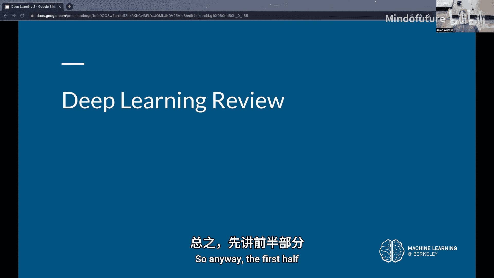
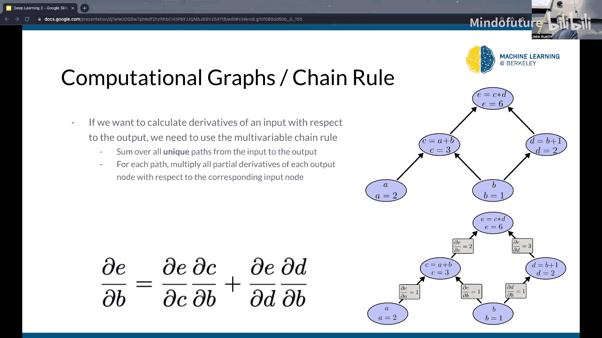
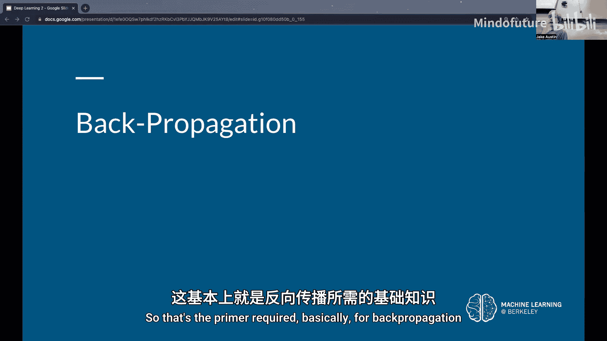
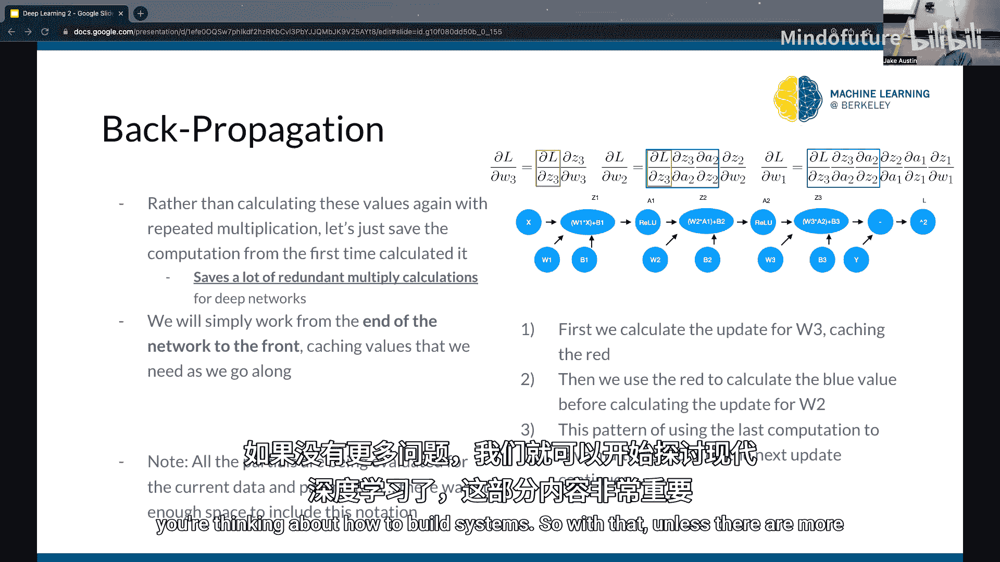
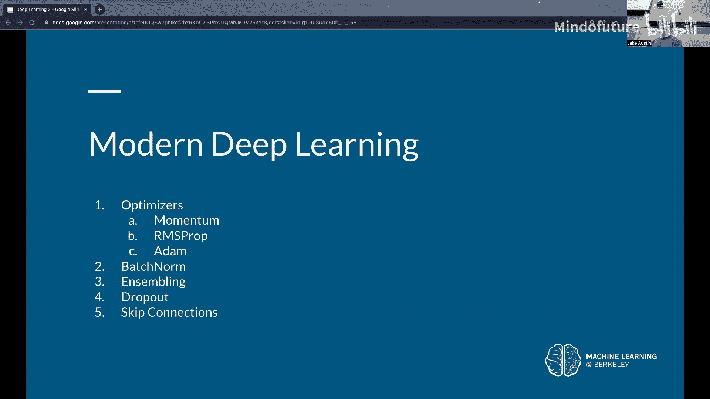
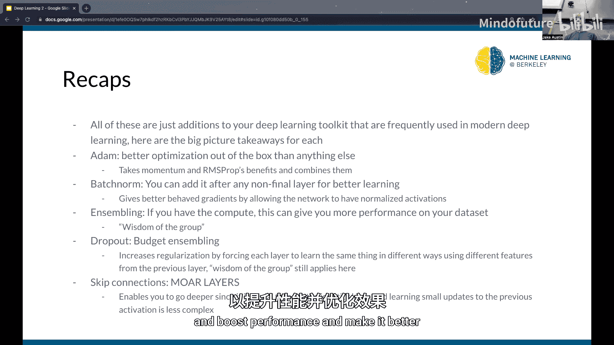
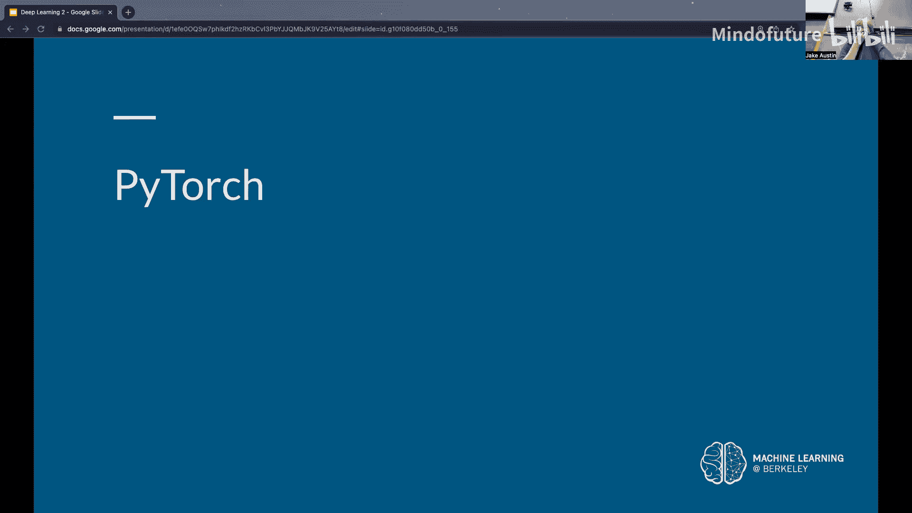
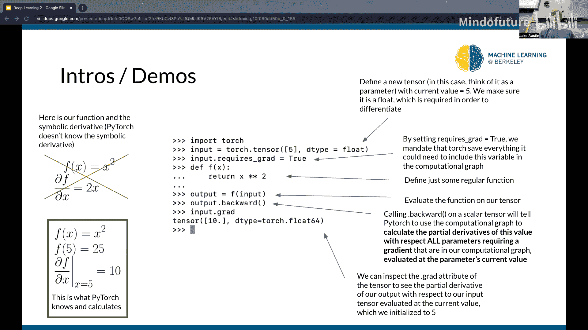

# 003：深度学习导论（第二部分）


在本节课中，我们将要学习深度学习中的核心优化算法——反向传播，以及一系列提升神经网络性能的现代技巧，包括动量、RMSprop、Adam优化器、批归一化、集成学习、Dropout和跳跃连接。




## 反向传播算法



上一节我们介绍了梯度下降的基本概念，本节中我们来看看如何高效地计算梯度。对于包含数百万参数的神经网络，手动计算每个参数的偏导数是不现实的。反向传播算法通过计算图的概念，高效地计算所有参数的梯度。



计算图将复杂的函数分解为一系列基本操作的节点。每个节点代表一个操作（如加法、乘法），其输入是前驱节点的输出。通过这种方式，我们可以清晰地追踪数据流。

链式法则告诉我们，要计算最终输出 `L` 相对于某个早期参数 `W1` 的梯度，可以沿着从 `W1` 到 `L` 的每一条路径，将路径上相邻节点间的偏导数相乘，然后将所有路径的结果相加。

反向传播的核心思想是**避免重复计算**。在从输出层向输入层反向计算梯度的过程中，我们会遇到大量重复的子表达式。反向传播通过缓存这些中间梯度值，在需要时直接复用，从而将计算复杂度从指数级降低到线性级，极大地提升了效率。



在真实的神经网络中，参数是矩阵和向量，这些偏导数变成了标量对矩阵或矩阵对矩阵的导数，其本质是矩阵乘法。反向传播通过缓存矩阵乘法的中间结果，节省了大量计算资源。



总而言之，反向传播是一种利用链式法则和缓存机制，从输出层到输入层高效计算神经网络中所有权重和偏置参数梯度的算法。

## 现代深度学习技巧

理解了如何计算梯度后，我们来看看一系列让现代深度学习模型表现更出色的实用技巧。这些技巧主要解决训练中的常见问题，如陷入局部最小值、梯度消失/爆炸以及过拟合等。

### 优化算法改进

标准的梯度下降法容易陷入局部最小值或平原区域。以下是几种改进的优化算法：

以下是三种主流的梯度下降优化算法：

*   **动量（Momentum）**:
    *   **核心思想**：模拟物理中的动量，使参数更新不仅考虑当前梯度，还累积历史梯度的方向。这有助于冲过平坦区域和小型局部最小值。
    *   **更新公式**:
        ```
        v_t = β * v_{t-1} + (1 - β) * ∇L(θ_t)
        θ_{t+1} = θ_t - λ * v_t
        ```
        其中 `v_t` 是动量项，`β` 是动量系数（通常为0.9），`λ` 是学习率。

*   **RMSprop**:
    *   **核心思想**：自适应地调整每个参数的学习率。它为每个参数维护一个历史梯度平方的指数移动平均值，并以此缩放当前梯度。对于历史梯度小的参数，增大其更新步长；对于历史梯度大的参数，减小其更新步长。
    *   **更新公式**:
        ```
        s_t = β * s_{t-1} + (1 - β) * (∇L(θ_t))^2
        θ_{t+1} = θ_t - λ * (∇L(θ_t) / (√(s_t) + ε))
        ```
        其中 `s_t` 是梯度平方的移动平均，`ε` 是一个极小值（如1e-8）以防止除零错误。

*   **Adam（Adaptive Moment Estimation）**:
    *   **核心思想**：结合了动量和RMSprop的优点，是目前最常用且效果通常最好的优化器。它同时计算梯度的一阶矩（均值，类似动量）和二阶矩（未中心化的方差，类似RMSprop），并进行偏差校正。
    *   **更新公式**（简化版）:
        ```
        m_t = β1 * m_{t-1} + (1 - β1) * ∇L(θ_t)  // 一阶矩（动量）
        v_t = β2 * v_{t-1} + (1 - β2) * (∇L(θ_t))^2 // 二阶矩
        m_hat = m_t / (1 - β1^t) // 偏差校正
        v_hat = v_t / (1 - β2^t) // 偏差校正
        θ_{t+1} = θ_t - λ * m_hat / (√(v_hat) + ε)
        ```

### 网络结构改进

除了优化算法，我们还可以在神经网络结构中加入一些“层”或机制来提升训练稳定性和效果。

*   **批归一化（Batch Normalization）**:
    *   **作用**：在每一线性层之后，对当前批次中每个神经元的激活值进行归一化（减去均值，除以标准差），然后通过可学习的参数 `γ`（缩放）和 `β`（偏移）进行变换。
    *   **好处**：使网络中每层的输入分布保持稳定，缓解内部协变量偏移问题，允许使用更高的学习率，并具有一定的正则化效果。
    *   **公式**（对于单个神经元在批次上的激活 `x`）:
        ```
        μ = mean(x) // 批次均值
        σ = std(x) // 批次标准差
        x_hat = (x - μ) / (σ + ε) // 归一化
        y = γ * x_hat + β // 缩放和偏移（可学习参数）
        ```

*   **Dropout**:
    *   **作用**：在训练过程中，以前向传播时，随机将网络层中一部分神经元（例如50%）的输出置为零。
    *   **好处**：防止神经元之间过度的协同适应（co-adaptation），迫使网络学习更鲁棒的特征，因为不能依赖于任何单个神经元。这是一种有效的正则化手段，有助于减少过拟合。

*   **跳跃连接（Skip Connections / Residual Connections）**:
    *   **作用**：在一个网络块（通常包含几个层）中，将块的输入直接加到块的输出上。这构成了残差块。
    *   **公式**: `输出 = F(x) + x`，其中 `x` 是输入，`F(x)` 是块内层对 `x` 的变换。
    *   **好处**：解决了深度网络中的梯度消失和网络退化问题。它使得学习恒等映射（`F(x) = 0`）变得非常容易，从而允许构建极深的网络（如ResNet有超过1000层），而性能不会下降。

*   **集成学习（Ensembling）**:
    *   **作用**：训练多个不同的模型（可以是相同结构不同初始化，或不同结构），在预测时对它们的输出进行平均（分类任务可投票）。
    *   **好处**：通过“群体的智慧”降低预测方差，通常能比单一模型获得稍好的性能，但需要更多的计算资源。

## PyTorch 简介

最后，我们简要介绍本课程将使用的深度学习框架——PyTorch。PyTorch 的核心特性是**自动微分（Autograd）**。它能够自动计算你定义的任何计算图的梯度。

在PyTorch中，数据存储在 `Tensor` 对象中，其用法与NumPy数组非常相似。关键区别在于，当你对 `Tensor` 进行操作并设置 `requires_grad=True` 时，PyTorch会跟踪所有计算历史。在计算完成后，你可以调用 `.backward()` 方法，PyTorch会自动根据链式法则计算所有相关 `Tensor` 的梯度，并将其存储在 `.grad` 属性中。

这使得实现和训练复杂的神经网络变得异常简单，因为你无需手动实现反向传播。







本节课中我们一起学习了反向传播算法的高效原理，以及动量、RMSprop、Adam、批归一化、Dropout、跳跃连接和集成学习等现代深度学习的关键技巧。这些工具是构建高效、稳定、强大神经网络的基础组件，将在后续的计算机视觉模型中被广泛使用。同时，我们也了解了PyTorch框架如何通过自动微分来简化梯度计算的过程。