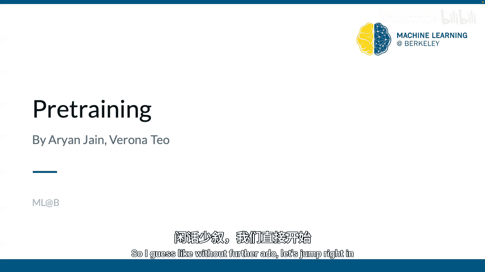
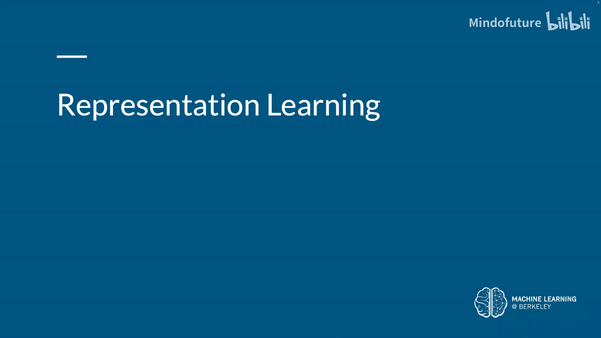
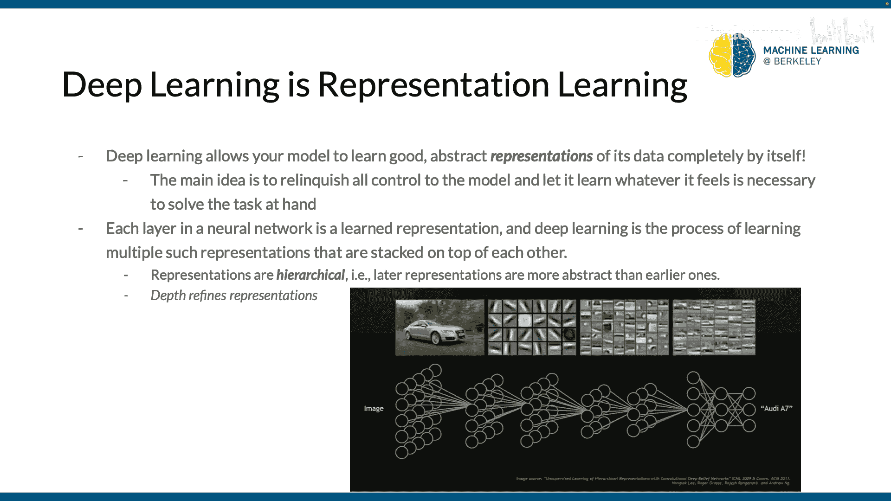
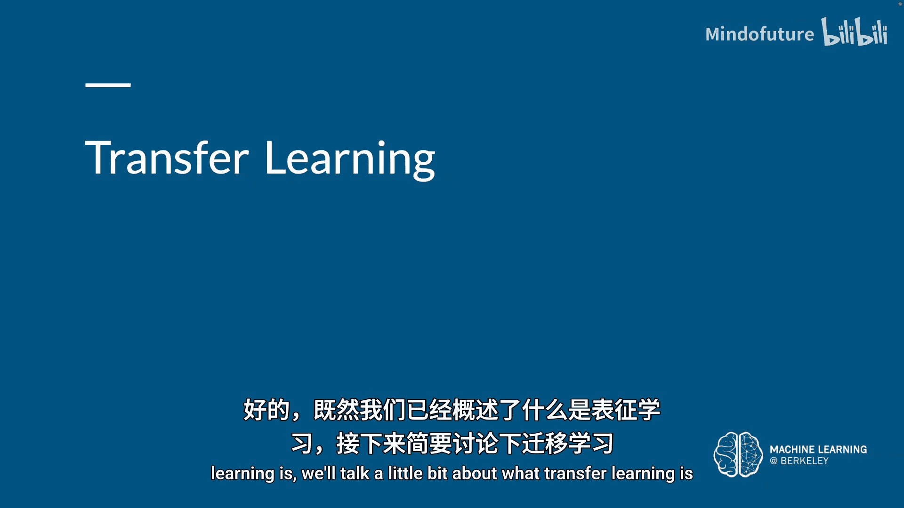
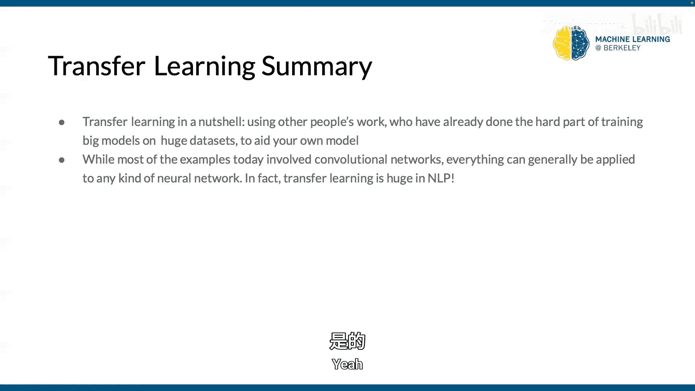
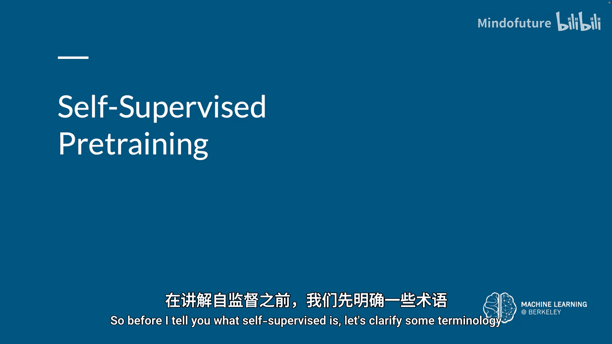
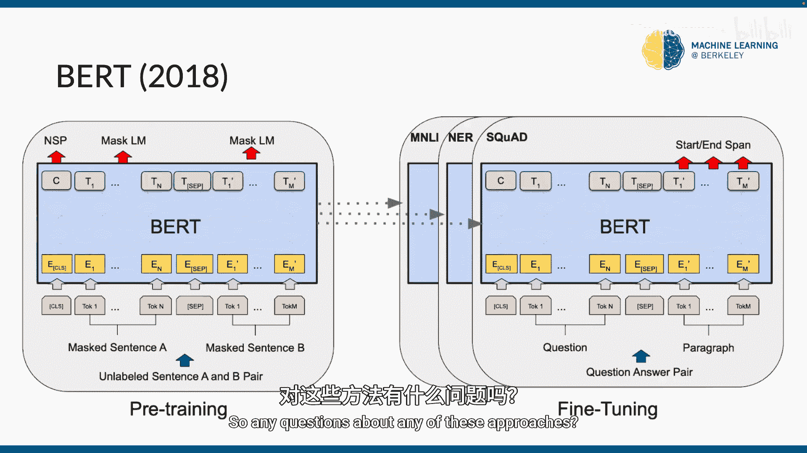
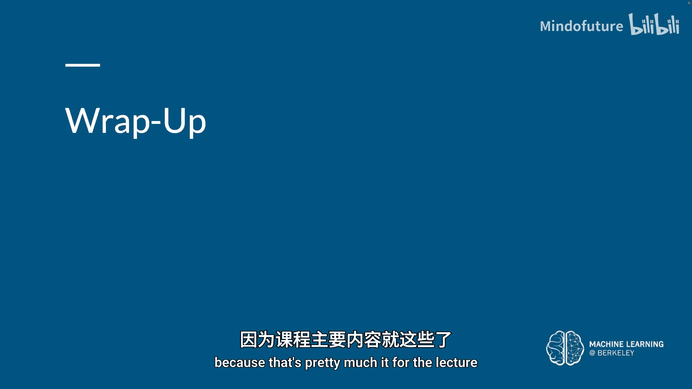
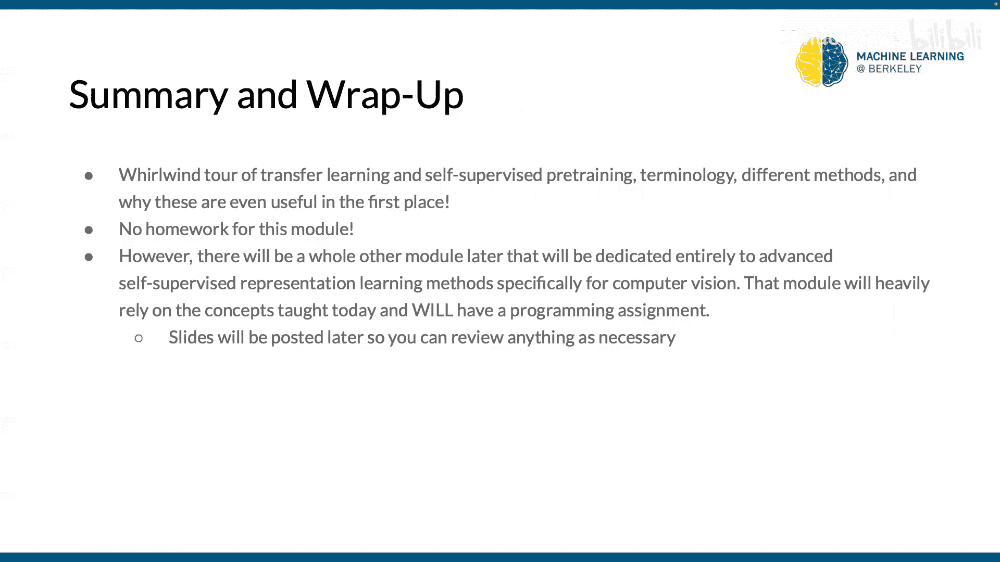

# 004：预训练与数据增强导论 🎯


在本节课中，我们将要学习深度学习中的两个核心概念：**预训练**与**数据增强**。我们将从**表征学习**的基础讲起，理解深度学习如何自动学习数据的有用特征。接着，我们将探讨**迁移学习**，学习如何利用已训练好的模型来解决新任务，从而节省时间和计算资源。最后，我们会介绍**自监督学习**，这是一种无需人工标注数据就能学习强大表征的方法。





## 从浅层学习到深度学习 🤖

上一节我们回顾了课程安排，本节中我们来看看机器学习的基本流程。

在传统的机器学习中，我们通常遵循一个固定的流程。首先，我们有一个输入 **X**。然后，我们需要从一个**特征提取器**函数 **φ** 中提取特征。这些特征随后被输入到一个由参数 **θ** 参数化的模型中，以得到输出 **y**。

**公式表示：** `y = model( φ(X); θ )`

这里的参数 **θ** 包含了所有需要学习的权重和偏置。我们不会直接将原始输入 **X** 送入模型，因为对于复杂数据（如图像、文本），直接输入是无效的。例如，预测房价时，我们需要手动提取房间数量、面积等特征。

这个过程存在一个关键问题：**特征提取器 φ 需要手动设计和编程**。对于不同任务（例如，一个任务关注图像颜色，另一个关注边缘），我们需要设计不同的特征提取器。这既复杂又难以通用。

深度学习解决了这个问题。它提出，我们不需要手动编程特征提取器，而是可以**同时学习特征提取和最终预测**。整个流程可以自动化。

在深度神经网络中，每一层都可以看作一个学到的特征提取器。网络将这些特征提取器堆叠起来，形成**层次化的表征**。早期层学习低级特征（如边缘、颜色），深层则学习更抽象的概念（如物体部件、完整物体）。

**核心观点：深度精炼了表征。** 网络从粗略信息开始，逐步提炼出精细的抽象概念。





## 迁移学习：站在巨人的肩膀上 🚀

上一节我们介绍了深度学习如何自动学习表征，本节中我们来看看如何利用已有的知识来加速新任务的学习。

从头开始训练一个模型通常需要大量的时间、计算资源和训练数据。幸运的是，许多大型模型已经在海量数据上训练好了。我们可以利用这些**预训练模型**，这就是迁移学习的思想。

迁移学习就像我们学习知识：学完一门编程入门课后，学习第二门课时就不必再从零开始。我们可以将已学到的技能和知识应用到新领域。

在神经网络中，即使任务不同（如猫狗分类 vs. 人脸检测），模型在底层都应该学会提取通用的低级特征（如形状、边缘、颜色）。高层特征则更专注于特定任务的抽象概念。

以下是利用预训练模型的主要技术：

**1. 冻结层**
冻结是指在新任务中，保持预训练模型的部分层权重不变。通常，我们冻结较早的、学习通用特征的层，只重新训练后面的高层。

**代码示例（概念）：**
```python
# 伪代码示例：加载预训练模型并冻结部分层
pretrained_model = load_pretrained_model()
for layer in pretrained_model.early_layers:
    layer.trainable = False  # 冻结这些层
# 然后添加并训练新的顶层以适应新任务
```

**2. 微调**
微调是指在新任务的数据上，继续训练整个或部分预训练模型。我们使用预训练的权重作为初始值，而不是随机初始化。

**代码示例（概念）：**
```python
# 伪代码示例：加载预训练权重并继续训练
model = MyModel()
model.load_pretrained_weights()  # 用预训练权重初始化
# 然后在新数据上继续训练整个或部分模型
```

如何选择冻结还是微调？主要考虑两个因素：
*   **新数据集的大小**
*   **新数据与原始数据的相似度**

以下是决策参考：
*   **数据少，相似度高**：建议冻结大部分层，只训练新顶层。
*   **数据多，相似度高**：可以微调更多层甚至整个网络。
*   **数据少，差异大**：可以冻结部分初始层，但需谨慎。
*   **数据多，差异大**：可以从头训练，但用预训练权重初始化通常仍有帮助。

## 嵌入与潜空间 📊

上一节我们讨论了迁移学习的具体技术，本节中我们来看看一个相关的核心概念：嵌入。

嵌入是离散变量的低维、连续向量表示。它们很有用，因为可以降低分类变量的维度，并在转换后的空间中有意义地表示它们。

潜空间是一个低维空间，它编码了高维数据的所有重要信息。我们常说高维数据被**嵌入**到一个低维的潜空间中。处理高维数据时，如果数据本身是低维结构，在高维空间中会非常稀疏，这被称为“维度灾难”。通过嵌入到潜空间，我们可以更高效地处理数据。

如何获得嵌入？我们可以将其作为神经网络目标任务的一部分进行学习。这样得到的嵌入是针对特定任务定制的。训练完成后，网络中间层的输出就可以作为输入数据的嵌入表示。





## 从监督学习到自监督学习 🔄

上一节我们介绍了嵌入的概念，本节中我们来看看如何在没有标签的数据上学习表征。

在典型的**监督学习**中，模型接收输入 **X**，输出预测 **ŷ**，并通过与真实标签 **y** 比较的损失函数来优化。标签为训练过程提供了“监督”。

**自监督学习**是一种特殊的学习范式。它仍然没有人工标注的标签，但模型通过**从数据自身创造监督信号**来学习。其一般技术是：预测输入的任何未观察到的（或隐藏的）部分或属性。

在自监督学习中，我们通常区分两种任务：
*   **前置任务**：用于训练表征的自监督任务（如预测图像的旋转角度）。
*   **下游任务**：最终要解决的实际任务（如图像分类、目标检测）。

以下是几个经典的自监督前置任务示例：

**1. Jigsaw Puzzles（拼图）**
将图像分成3x3的网格并打乱 patches 的顺序，让模型预测原始排列顺序。这迫使模型理解图像各部分之间的关系。

**2. Rotation Prediction（旋转预测）**
将图像旋转0°、90°、180°或270°，让模型预测旋转角度。这促使模型学习物体的朝向、语义内容等不变特征。

**3. 自然语言处理中的示例**
*   **Word2Vec**：通过预测上下文中的词（CBOW）或通过词预测上下文（Skip-gram）来学习词嵌入。
*   **BERT**：使用“掩码语言模型”任务，随机遮盖句子中的一些词，让模型预测这些被遮盖的词。同时它还进行“下一句预测”任务。BERT的成功极大推动了自监督学习在计算机视觉领域的复兴。

当前计算机视觉领域的许多先进方法都受到了BERT的启发。

## 总结 📝

本节课我们一起学习了深度学习中的关键预备知识。

我们首先回顾了从**浅层学习**到**深度学习**的演变，理解了深度学习通过端到端学习**层次化表征**的核心优势。

接着，我们深入探讨了**迁移学习**，学习了如何利用**预训练模型**，通过**冻结**和**微调**技术，高效地解决新任务，并节省大量资源和时间。

然后，我们介绍了**嵌入**和**潜空间**的概念，理解了如何将高维数据表示为有意义的低维向量。

最后，我们探索了**自监督学习**这一前沿领域，了解了如何在没有人工标注的情况下，通过设计巧妙的前置任务（如拼图、旋转预测）让模型从数据自身学习强大的通用表征，为下游任务提供良好的初始化。







这些概念为后续学习更具体的模型架构（如卷积神经网络）和高级技术奠定了坚实的基础。