# 005：卷积神经网络入门 🧠


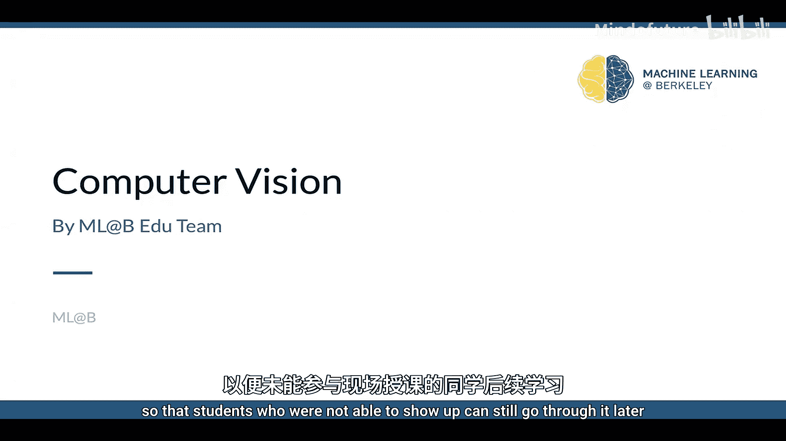

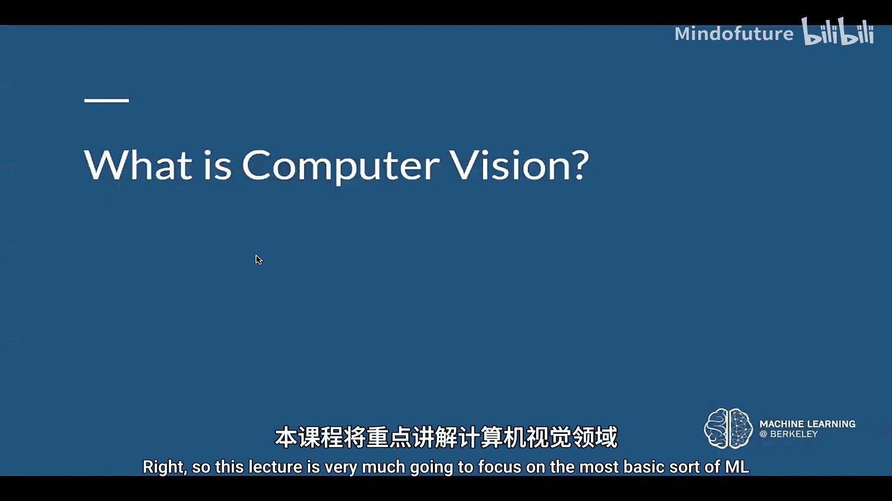

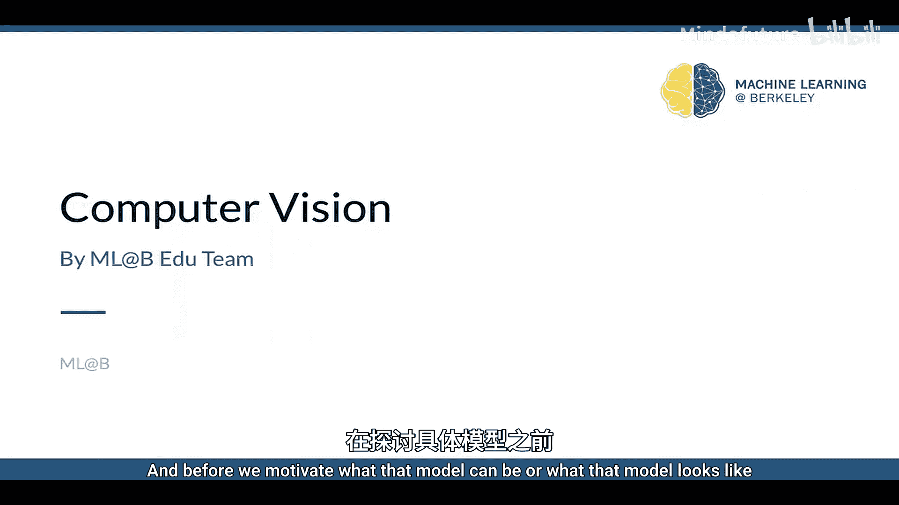

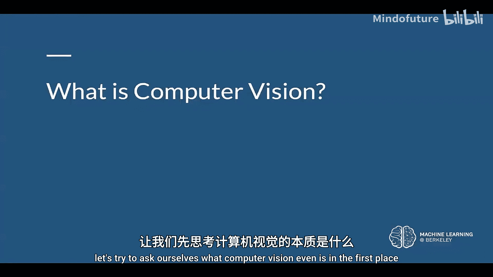

在本节课中，我们将要学习计算机视觉领域最基础且最重要的模型之一——卷积神经网络。我们将从计算机视觉的基本概念出发，逐步理解为什么需要CNN，并详细探讨其核心组件和工作原理。

## 什么是计算机视觉？ 👁️

计算机视觉是人工智能的一个分支，其核心目标是从图像中提取信息。从高层次看，它涉及任何需要从图像中获取信息的任务。从低层次看，它是一系列围绕分类、检测、分割等概念的任务，要求机器对图像内容有语义层面的理解。

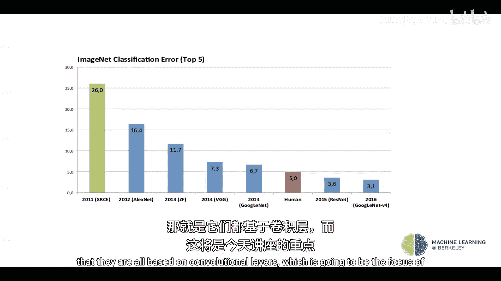

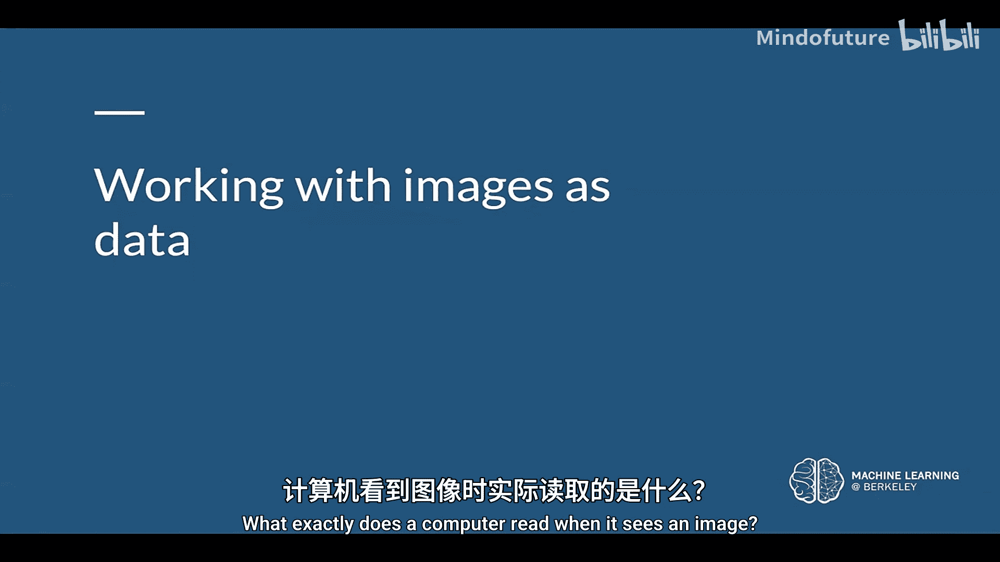

最常见的任务是图像分类，即识别图像中包含何种物体。但计算机视觉可以更进一步，例如目标检测（用边界框标出物体的位置）或实例分割（预测物体的精确轮廓）。所有这些任务都要求机器学习模型能够从像素中解读出高级语义信息。

## 从传统方法到深度学习 🔄

计算机视觉的根源可追溯到认知科学和心理学。1959年，神经生物学家Hubel和Wiesel通过对猫的视觉皮层实验发现，简单的边缘模式能引发最强的神经激活，这表明视觉系统首先通过识别边缘来分解图像。这一发现启发了早期的计算机视觉研究，人们开始设计基于边缘信息的手工特征提取器（如HOG、SIFT）。

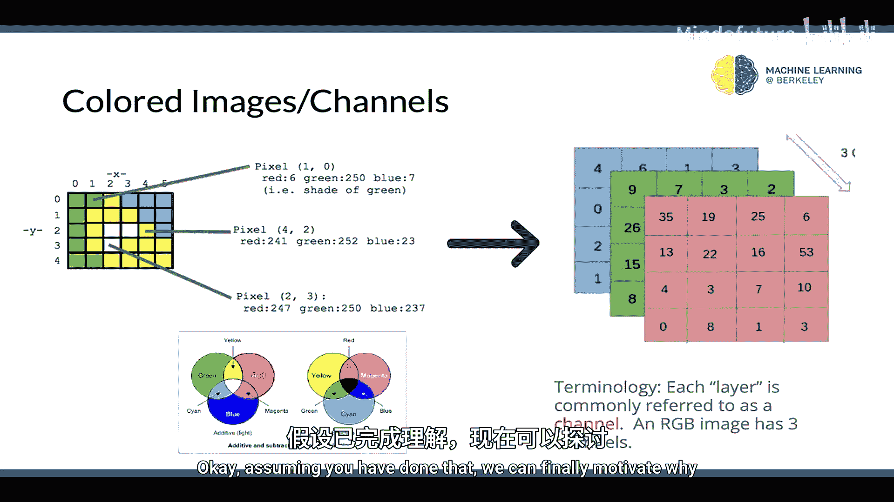

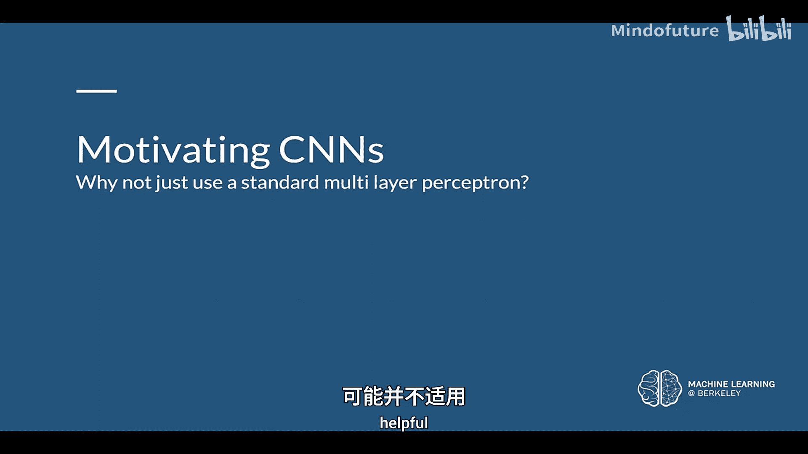

然而，深度学习的出现改变了这一范式。与需要手工设计特征的“浅层学习”不同，深度学习允许模型**自动学习特征提取器本身**。这一突破在2012年由Alex Krizhevsky等人实现，他们训练的AlexNet模型在ImageNet视觉识别挑战赛中大幅超越了传统方法，开启了深度学习革命。

## 图像的数字化表示 🖼️

在深入CNN之前，我们需要理解计算机如何表示图像。图像在数字上被表示为矩阵。

*   **灰度图像**：可以表示为一个二维矩阵，矩阵中的每个值代表一个像素的亮度（例如，0-255）。
*   **彩色图像**：通常使用RGB色彩空间，每个像素由红、绿、蓝三个通道的值组成。因此，一张彩色图像可以表示为三个堆叠的二维矩阵，形成一个三维张量，其维度为 `(通道数, 高度, 宽度)`。在深度学习中，我们常称这种三维结构为**张量**。

理解图像的通道概念对于后续学习至关重要。

## 为何需要卷积神经网络？ 🤔

上一节我们介绍了图像的表示方法，本节我们来看看为什么传统的全连接神经网络不适合直接处理图像数据。

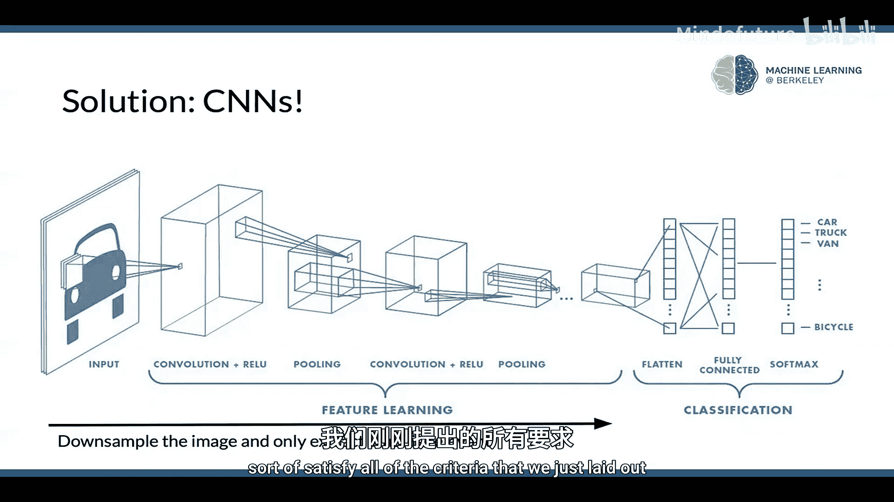

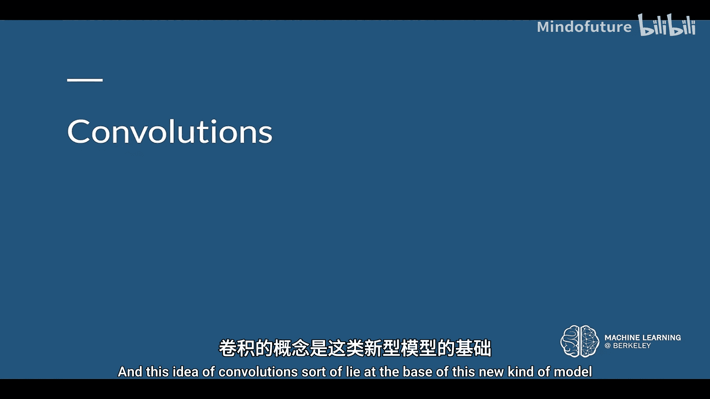

假设我们有一张200x200x3的RGB图像。要将其输入一个全连接层，首先需要将其展平为一个向量，维度高达120,000（200*200*3）。如果该层输出维度为10，仅这一层就需要超过120万个参数。对于更深的网络或更大的输出，参数量将变得极其庞大，难以训练。

此外，全连接网络将每个像素视为独立的特征，这不符合图像的固有特性。图像中相邻的像素通常是高度相关的，信息蕴含在局部区域（如边缘、纹理）中，而非孤立的像素点。人类识别物体时，也是通过观察图像的局部区域（如鸟喙、翅膀）并组合这些信息来实现的。

因此，一个理想的图像处理模型应具备以下特性：
1.  **局部连接**：关注图像的局部区域，而非单个像素。
2.  **参数共享**：对图像不同区域使用相同的特征检测器（滤波器），这有助于实现**平移等变性**（物体移动，其特征表示也随之移动）和**平移不变性**（无论物体在图像中何处，都能被正确识别）。
3.  **层次化表征学习**：能够从低级特征（边缘、纹理）逐步组合出高级特征（形状、物体部件）。

卷积神经网络正是为了满足这些需求而设计的。

## 卷积操作详解 ⚙️

上一节我们明确了CNN的设计目标，本节我们来深入看看其核心——卷积操作是如何工作的。

卷积操作涉及两个主要部分：输入图像和一个称为**滤波器**（或**卷积核**）的小矩阵。操作过程如下：
1.  将滤波器放置在输入图像的左上角。
2.  计算滤波器覆盖的局部图像区域与滤波器矩阵的**逐元素乘积之和**（即点积）。
3.  将结果作为输出特征图对应位置的值。
4.  将滤波器在图像上滑动（通常每次移动一个像素，即步长为1），重复步骤2和3，直到覆盖整个图像。

**公式**：对于一个局部图像块 `x` 和滤波器 `w`，该位置的特征值计算为：`output = sum(x * w) + b`，其中 `b` 是偏置项。

这个过程完美契合了我们的目标：
*   **局部连接**：每次只处理一个局部图像块。
*   **参数共享**：同一个滤波器滑过整个图像，权重是共享的。
*   **特征提取**：精心设计的滤波器可以提取特定特征。例如，一个检测垂直边缘的滤波器，在遇到垂直边缘时会产生高激活值。

在深度学习中，我们**不手动设计这些滤波器**，而是将其作为可学习的参数，让模型在训练过程中自动学习最适合当前任务的特征提取器。

## 卷积层：从2D到3D 🧱

上一节我们介绍了基础的2D卷积，本节我们将其推广到更通用的3D情况，即处理具有多个通道的输入（如RGB图像）。

当输入是一个三维张量（例如，3 x 高 x 宽）时，我们的滤波器也必须是一个三维张量，其深度与输入通道数相同。卷积操作在高度和宽度维度上滑动，并在所有通道上同时进行点积求和，最终输出一个二维的**激活图**。激活图中的高值表示输入中可能存在该滤波器所检测的特征。

为了提取多种特征，我们通常会使用多个滤波器。每个滤波器会产生一个独立的激活图。将这些激活图在深度维度上堆叠，就得到了一个三维的输出张量，其深度等于滤波器的数量。

因此，一个完整的卷积层可以概括为：
*   **输入**：一个形状为 `(C_in, H, W)` 的张量。
*   **参数**：`F` 个形状为 `(C_in, K, K)` 的滤波器（K为核大小）。
*   **输出**：一个形状为 `(F, H', W')` 的张量（`H'` 和 `W'` 取决于其他参数）。

这种抽象允许我们将卷积层堆叠起来，构建深度网络，每一层都在前一层提取的特征基础上学习更高级的表示。

## CNN的其他重要组件 🧩

除了卷积层，CNN还包含其他关键组件，它们共同协作以构建有效的网络。

### 池化层
池化层用于对特征图进行下采样，减少其空间尺寸（高度和宽度），从而降低计算量并扩大后续层的感受野。最常见的操作是**最大池化**，它在局部区域（如2x2窗口）内取最大值。这可以理解为保留该区域最显著的特征。

### 填充与步长
*   **填充**：在输入图像边缘添加额外的像素（通常为0），以控制输出特征图的大小。`same`填充旨在使输出尺寸与输入相同。
*   **步长**：滤波器每次滑动的像素数。步长大于1可以快速减小特征图尺寸，有时可替代池化层。

输出特征图尺寸的计算**公式**为：
`W_out = floor((W_in + 2*P - K) / S) + 1`
其中，`W_in`是输入宽度，`P`是填充大小，`K`是核大小，`S`是步长，`floor`是向下取整函数。

### 感受野
感受野是指网络中层的一个元素，其值所依赖的输入图像区域大小。随着网络加深，感受野会增大，使得高层神经元能够整合更大范围的上下文信息，这对于理解整体语义至关重要。

## 构建一个完整的CNN架构 🏗️

现在，我们将前面介绍的组件组合起来，看看一个典型的CNN分类架构是什么样子。

一个经典的CNN（如LeNet）通常遵循以下模式：
1.  **特征提取部分**：由交替的卷积层、激活函数（如ReLU）和池化层堆叠而成。现代网络还可能加入批量归一化层以稳定训练。
    *   **代码示例（PyTorch）**：
        ```python
        import torch.nn as nn
        # 定义一个卷积层
        conv_layer = nn.Conv2d(in_channels=3, out_channels=16, kernel_size=3, stride=1, padding=1)
        # 定义一个最大池化层
        pool_layer = nn.MaxPool2d(kernel_size=2, stride=2)
        # 激活函数
        activation = nn.ReLU()
        ```
2.  **分类部分**：在特征提取之后，将最终的三维特征张量展平为一维向量，然后传入一个或多个全连接层，最终输出类别预测。

这种设计模式将卷积网络作为强大的**自动特征提取器**，而全连接层则充当基于这些特征的**分类器**。

## 实践细节与常用数据集 📊

在结束之前，我们来了解一些训练CNN时的实用知识和常用基准数据集。

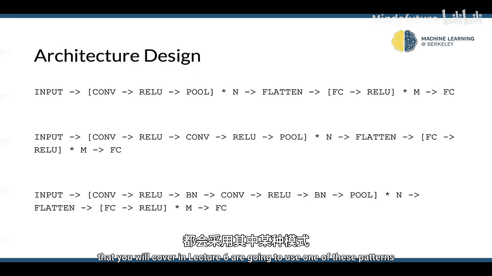

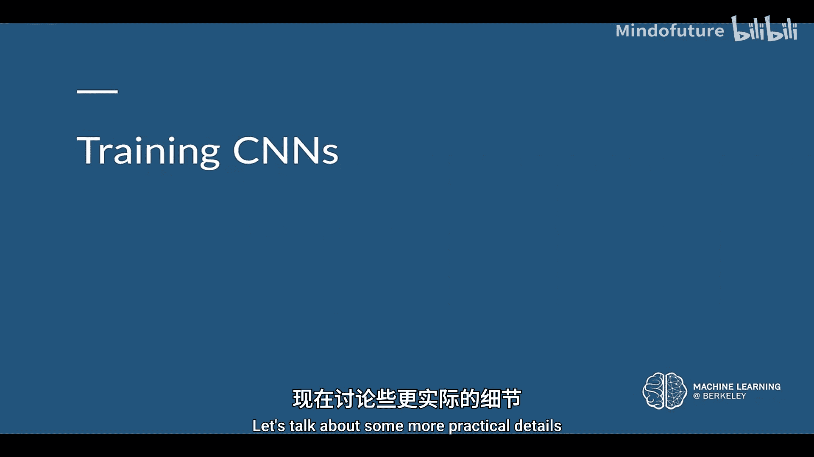

### 常用数据集
*   **MNIST**：手写数字灰度图像数据集，常用于入门和原型验证。
*   **CIFAR-10/100**：小型彩色图像数据集，包含10或100个类别，也是常用的测试基准。
*   **ImageNet**：大规模图像数据集，包含数百万张图像和上千个类别，是评估模型性能的权威基准。

### 数据预处理与增强
*   **归一化**：将像素值从0-255范围缩放到0-1或标准化，有助于训练稳定。
*   **数据增强**：通过对训练图像进行随机变换（如翻转、裁剪、颜色抖动）来人工扩充数据集，是防止过拟合、提升模型泛化能力的有效手段。

### 模型检查点
训练大型CNN可能耗时很长。**检查点**功能可以定期保存模型的权重。如果训练过程中断，可以从最近的检查点恢复训练，避免进度丢失。

## 总结 🎯

本节课我们一起学习了卷积神经网络的基础知识。我们从计算机视觉的定义和挑战出发，探讨了传统全连接网络处理图像的局限性，从而引出了CNN的设计动机。我们详细讲解了卷积操作的核心思想、局部连接和参数共享的优势，以及如何从2D推广到3D卷积。此外，我们还介绍了池化层、填充、步长、感受野等重要概念，并展示了如何将这些组件组合成一个完整的CNN分类架构。最后，我们简要回顾了常用的计算机视觉数据集和一些关键的训练实践技巧。

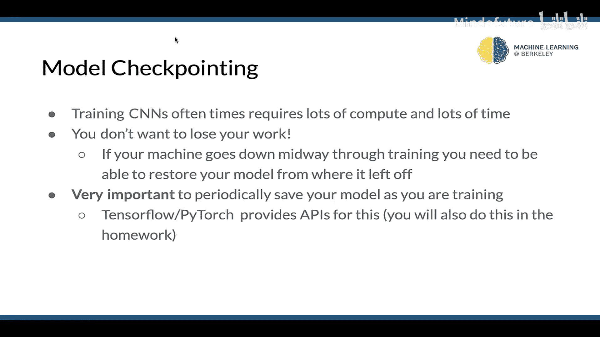

CNN是理解现代计算机视觉系统的基石，其设计思想也深刻影响了其他领域。掌握这些基础知识，将为后续学习更复杂的视觉模型和任务打下坚实的基础。