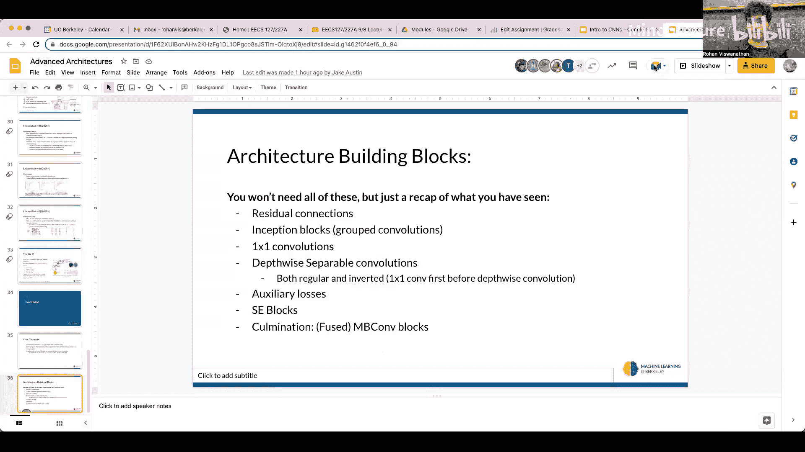

# 006：高级计算机视觉架构 🏗️

在本节课中，我们将要学习几种重要的卷积神经网络架构，了解它们如何解决深度网络训练中的关键问题，并探索提升模型效率的技术。我们将从经典的AlexNet和VGG开始，逐步深入到ResNet、MobileNet等更现代的架构。

## 回顾：卷积神经网络基础

上一节我们介绍了卷积神经网络的基本概念，本节中我们来看看如何将其与标准神经网络联系起来。

卷积操作被视为一个网络层。与标准全连接神经网络将矩阵乘法视为一层类似，卷积层拥有可学习的参数——即滤波器内的所有权重值，以及一个偏置项。每个滤波器在输入上滑动，进行逐元素相乘并求和，然后加上对应的偏置，最终生成一个输出特征图。

如果你有多个不同的滤波器，每个滤波器都会在输入上运行，产生一个输出特征图。所有这些输出特征图会被堆叠起来，形成一个具有多个通道的输出“体积”。完成卷积后，我们仍然会添加激活函数（如ReLU），并将其视为一个标准的网络层。由于损失函数对于所有这些参数都是可微的，我们仍然可以通过梯度下降法来更新它们。

简而言之，在处理图像时，CNN用卷积操作替代了标准神经网络中的矩阵乘法。其流程是：卷积 -> 激活函数 -> （可选）池化层。池化层（如2x2最大池化）用于减小特征体积的空间尺寸，从而降低计算量，同时理想情况下保留主要信息。

最终，当需要输出分类结果时，我们将最后的特征体积“展平”成一个一维向量，然后通过全连接层进行处理。

## 经典架构演进 📜

理解了CNN的基础后，我们来看看历史上几种标志性的架构，它们推动了计算机视觉领域的进步。

### AlexNet：深度学习的里程碑

AlexNet在2012年取得了突破性成果。它提出了堆叠卷积层、池化层，最后连接全连接层的模式。

以下是AlexNet架构的核心观察：
*   它包含5个卷积层和3个全连接层。
*   卷积层后通常跟随最大池化层以降低尺寸。
*   所有卷积层和池化层后使用ReLU激活函数。
*   网络末端使用Softmax函数输出分类概率。

AlexNet的成功证明了深度网络在图像分类任务上的巨大潜力，但其深度相对较浅，限制了学习更高阶特征的能力。

### VGG：走向更深

VGG可以看作是一个更深的AlexNet，其主要动机是构建更深的神经网络以提升性能。

VGG网络（如VGG16）使用更小的3x3卷积核，并通过堆叠更多的卷积层来增加深度。虽然深度增加带来了更强的表征能力，但也显著增加了参数数量和计算量。VGG架构表明，简单地增加网络深度是提升性能的一种直接途径。

## 核心挑战与创新方案 ⚙️

随着网络不断加深，研究人员遇到了一些关键问题。本节我们将探讨这些问题及其开创性的解决方案。

### 问题：为什么不能无限堆叠层？

直觉上，增加更多层不应该损害性能，因为新增的层可以学习恒等变换（即输出等于输入）。然而实际情况并非如此。深层网络训练面临的主要问题包括：
1.  **梯度消失/爆炸**：在反向传播的链式法则中，多个小于1的梯度连续相乘会导致梯度趋近于零（消失），而多个大于1的梯度相乘会导致梯度巨大（爆炸），这使得网络难以训练。
2.  **梯度破碎**：在极深的网络中，梯度可能变得像白噪声一样，失去了有效的学习信号。

### 解决方案：残差网络

ResNet的核心思想是让网络更容易学习恒等变换。它通过引入“快捷连接”或“跳跃连接”来实现。

**公式**：`输出 = F(x) + x`
其中，`x`是输入，`F(x)`是卷积层等学习到的变换。通过直接将输入`x`加到变换后的结果`F(x)`上，网络可以轻松地学习到：如果当前的变换`F(x)`不重要，只需将其权重学习为接近零，那么输出就近似等于输入`x`。

这种设计带来了两大好处：
1.  它极大地缓解了梯度消失和梯度破碎问题，使得训练成百上千层的超深网络成为可能。
2.  它确保了增加网络深度至少不会降低性能（因为可以学习恒等映射）。

残差块成为了构建现代深度网络的基石。

### 效率优化：MobileNet与深度可分离卷积

随着模型加深，通道数增多，计算量急剧上升。MobileNet采用深度可分离卷积来高效地减少计算量。

深度可分离卷积分为两步：
1.  **深度卷积**：一个卷积核只负责一个输入通道，在空间维度上进行卷积。
2.  **逐点卷积**：使用1x1的卷积核来组合深度卷积输出的各个通道。

这种方法能显著减少计算量和参数数量，同时保持较好的精度，特别适合在移动设备等计算资源受限的环境中使用。

## 其他重要技术 🛠️

除了核心架构，还有一些技术对现代CNN至关重要。

### 全局平均池化

全局平均池化被用来替代CNN末端的全连接层。它对最后一个特征体积的每个通道计算全局平均值，直接得到一个长度等于类别数的向量，然后输入Softmax层。

**好处**：
*   减少了大量参数，防止过拟合。
*   强制使特征图与类别之间产生对应关系。
*   对输入空间尺寸更鲁棒。

### Squeeze-and-Excitation 网络

SE网络是一种通道注意力机制。它通过以下步骤显式地建模通道间的依赖关系：
1.  **压缩**：对每个通道进行全局平均池化，得到通道描述符。
2.  **激励**：通过全连接层学习每个通道的权重（重要性）。
3.  **重标定**：将学习到的权重乘回原始的对应通道上。

这使网络能够自适应地强调重要特征，抑制不重要特征。

## 总结与展望 🚀

本节课中我们一起学习了计算机视觉中几种关键的深度学习架构。

我们从基础的CNN概念回顾开始，追溯了从AlexNet、VGG到ResNet的演进历程，理解了残差连接如何解决深度网络训练的根本性难题。我们还探讨了MobileNet的深度可分离卷积如何提升模型效率，并介绍了全局平均池化、SE网络等重要技术。

这些架构的本质是将不同的构建模块（如标准卷积、1x1卷积、残差连接、深度卷积、注意力机制）以创新的方式组合起来，以在精度、速度和模型大小之间取得最佳平衡。理解这些基本模块及其解决的问题，为我们学习当前更先进的架构（如基于Transformer的模型）奠定了坚实的基础。