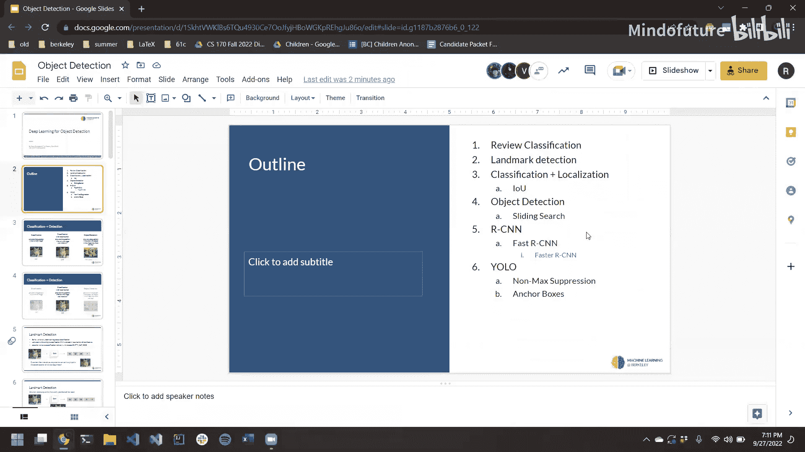
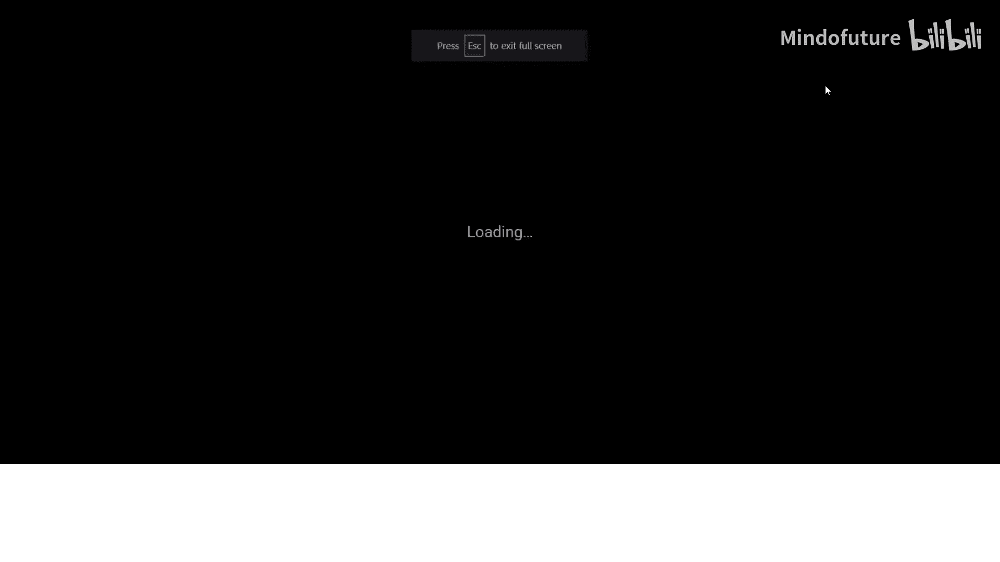
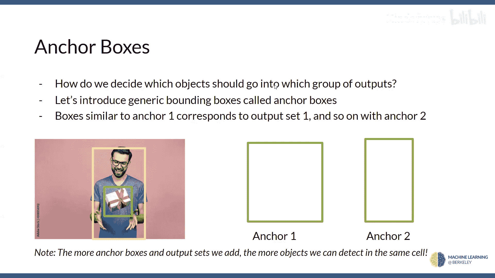

# 007：目标检测 🎯

在本节课中，我们将要学习目标检测。目标检测是计算机视觉中一项核心任务，它不仅需要识别图像中有什么物体，还需要确定它们的位置。我们将从基础的分类与定位开始，逐步深入到更复杂的多目标检测方法，并重点介绍YOLO这一革命性的算法。

## 从分类到定位

上一节我们介绍了图像分类，它回答的问题是“图像中有什么？”。本节中，我们来看看如何让模型不仅能识别物体，还能找到它的位置，这被称为“分类与定位”。

### 关键点检测

在进入完整的边界框定位之前，我们先从一个更简单的任务开始：关键点检测。假设我们有一个能分类猫、狗或其他物体的卷积神经网络（CNN）。它的输出是一个独热编码向量，例如 `[0, 1, 0]` 表示“猫”。

为了定位猫的鼻子，我们需要扩展这个网络。一个直接的解决方案是：在分类输出之外，额外增加两个输出节点，分别预测鼻子在图像中的归一化X坐标和Y坐标。例如，X=0表示图像最左侧，X=1表示最右侧。训练时，我们需要带有鼻子坐标标注的图像数据。

### 边界框定位

如何从检测一个点扩展到检测一个完整的边界框？我们可以进一步扩展网络输出。

以下是几种可能的方案：
*   输出边界框中心点的坐标以及框的宽度和高度。
*   输出边界框左上角和右下角的坐标。

在本教程中，我们采用第一种方案。因此，网络的最终输出将包含：分类概率（例如猫、狗、背景）以及四个定位值（`bx`, `by`, `bw`, `bh`），分别代表边界框的中心坐标、宽度和高度。

## 评估定位效果：交并比（IoU）

在分类任务中，损失函数可以简单地比较预测类别和真实类别。但对于边界框，我们需要一个衡量预测框与真实框匹配程度的指标，这就是**交并比**。

**交并比（IoU）** 的计算公式为：
`IoU = (预测框与真实框的交集面积) / (预测框与真实框的并集面积)`

IoU的值在0到1之间。如果两个框完全重合，IoU为1；如果完全分离，IoU为0。因此，我们可以设计损失函数来最大化预测框的IoU值。

## 多目标检测的挑战

上一节我们介绍了如何定位单个物体。本节中，我们来看看当图像中有多个物体时，检测任务会变得复杂得多。我们不知道物体的数量、位置，它们可能重叠，也可能是不同类别。

### 滑动窗口法

一个最基础的思路是滑动窗口法。该方法按以下步骤工作：
1.  在图像上以不同位置、大小和长宽比定义大量候选窗口。
2.  将每个窗口裁剪出的图像区域输入分类网络进行判断。
3.  如果某个窗口被分类为特定物体（如“人”），则将其标记为一个检测结果。

这种方法简单直观，但效率极低，因为需要运行成千上万次分类，计算成本高昂。如果为了减少计算量而增大滑动步长或减少窗口尺寸，又可能错过一些物体。

### R-CNN：区域提议网络

为了提高效率，R-CNN提出了一种思路：先猜测图像中可能包含物体的区域（即“区域提议”），然后只对这些区域进行分类。

R-CNN的工作流程如下：
1.  使用传统的图像分割算法（如选择性搜索）生成大量可能包含物体的候选区域。
2.  将每个候选区域变形为固定尺寸，并输入CNN提取特征。
3.  利用提取的特征对每个区域进行分类（是什么物体）和边界框回归（微调位置）。

虽然减少了一些计算，但R-CNN仍需对成千上万个区域进行独立的前向传播，速度依然较慢，且区域变形可能导致信息失真。

### Fast R-CNN：共享卷积计算

Fast R-CNN的核心改进是**共享计算**。它不再对每个候选区域单独运行整个CNN，而是：
1.  首先将整张图像输入CNN，生成一个**特征图**。
2.  对于每个候选区域，直接从共享的特征图上提取对应区域的子特征图。
3.  将这些固定尺寸的子特征图输入后续的全连接层进行分类和定位。

这样，耗时的卷积运算只在整张图像上执行一次，大大提升了效率。

## YOLO：统一的实时检测框架

Fast R-CNN仍然依赖外部算法生成区域提议。YOLO则采取了更彻底的端到端思路，其核心思想是：**将目标检测视为一个单一的回归问题**。

### YOLO的基本思想

YOLO的工作流程非常直接：
1.  将输入图像划分为 `S x S` 的网格。
2.  每个网格单元负责预测那些中心点落在该格子内的物体。
3.  每个网格单元会预测B个边界框（每个框包含位置信息和置信度）以及C个类别的条件概率。

最终，网络的输出是一个 `S x S x (B*5 + C)` 的张量。通过一次前向传播，即可得到图像中所有物体的类别和位置。

### 边界框预测

在YOLO中，每个边界框的预测值包含5个元素：`(x, y, w, h, confidence)`。
*   `(x, y)` 是边界框中心相对于其所属网格单元左上角的偏移量（归一化到0-1）。
*   `(w, h)` 是边界框的宽度和高度相对于整个图像尺寸的预测值。
*   `confidence` 反映了该框包含物体且预测准确的置信度。

### 非极大值抑制

由于多个相邻的网格单元可能对同一个物体做出预测，会导致重复的检测框。YOLO使用**非极大值抑制**来解决这个问题。

处理步骤如下：
1.  丢弃所有置信度低于设定阈值的预测框。
2.  在剩余的框中，选择置信度最高的框作为“保留框”。
3.  计算其他所有框与这个“保留框”的IoU。丢弃那些IoU超过设定阈值的框（因为它们很可能检测的是同一个物体）。
4.  对剩下的框重复步骤2和3，直到处理完所有类别。

### 锚框机制

如果一个网格单元中心存在多个物体怎么办？YOLO v2及后续版本引入了**锚框**机制。

锚框是一组预先定义好的、具有不同尺度和长宽比的基准边界框。网络不再直接预测边界框的绝对尺寸，而是预测相对于这些锚框的偏移量。每个网格单元会为每个锚框预测一组输出（包括类别和位置偏移）。这样，不同形状的物体可以被分配到不同的锚框通道进行预测，从而提高了模型处理重叠物体的能力。

## 总结

本节课中我们一起学习了目标检测的演进之路。
*   我们从**分类与定位**开始，学会了如何让网络输出物体的边界框。
*   我们认识了评估定位精度的关键指标——**交并比**。
*   面对多目标检测，我们分析了**滑动窗口法**的局限性。
*   接着，我们了解了**R-CNN**和**Fast R-CNN**如何通过区域提议和共享卷积计算来提升效率。
*   最后，我们深入探讨了**YOLO**这一革命性的框架，它通过将图像划分为网格、进行端到端的回归预测，并结合**非极大值抑制**和**锚框**机制，实现了准确且快速的实时目标检测。

YOLO展示了仅用单一神经网络解决复杂视觉任务的强大能力，是深度学习在目标检测领域的一个重要里程碑。