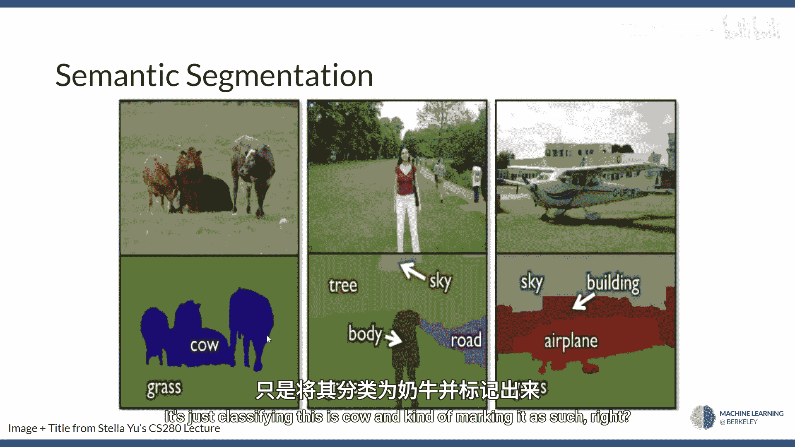
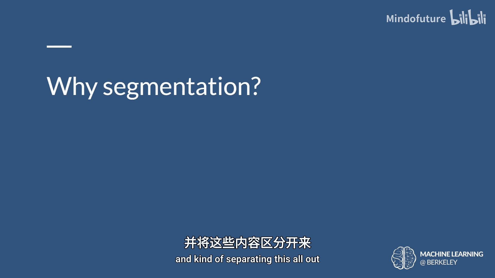
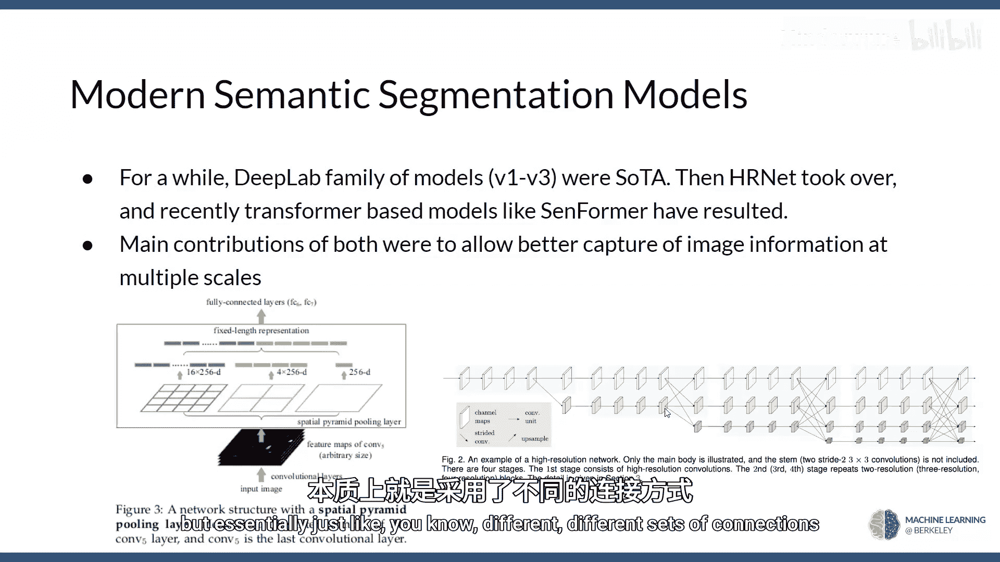
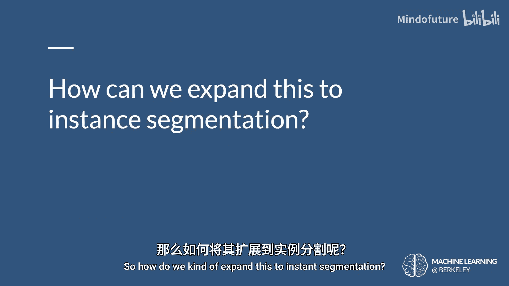
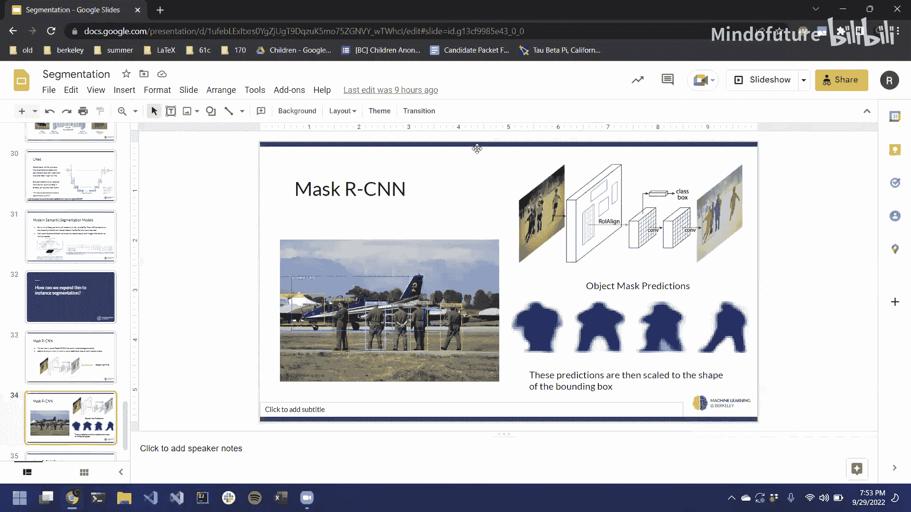
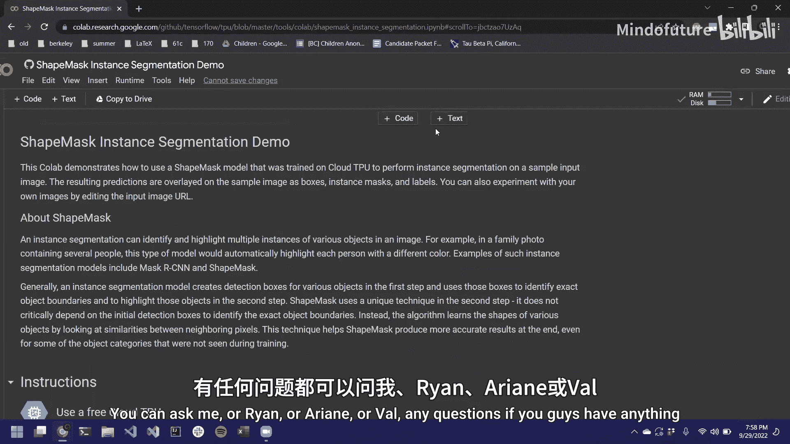

# 008：语义分割 🎯

在本节课中，我们将要学习图像分割，这是对上一讲物体检测内容的延续。我们将探讨如何识别图像中每个像素所属的类别，而不仅仅是物体的边界框。

## 从分类到分割 📈

上一讲我们介绍了分类网络，它能告诉我们图像中有什么。接着我们学习了定位分类和关键点检测，它们能告诉我们物体是什么以及它在哪里。然后我们学习了物体检测，它能识别图像中的多个物体及其位置。

本节内容的延续是**语义分割**和**实例分割**。语义分割的基本思想是，我们不仅要找到物体的边界框，还要找到该物体在图像中存在的**具体像素**。实例分割则更进一步，它要回答的问题是：图像中每个类别的每个实例具体在哪里。例如，在一张有多人的照片中，它不仅能识别出对应人的像素，还能区分出哪些像素属于哪个人。

## 为什么分割很重要？🤔

分割可能看起来工作量很大，但它非常有用。这涉及到**格式塔原则**，即图像的整体意义大于其各部分之和。为了理解图像的整体含义，我们需要能够更具体地识别其所有组成部分。

例如，即使只是确定一个物体是什么，也可能比想象中更具挑战性。我们的感知系统能够将不连续的、零散的视觉线索组合成一个有意义的整体（比如从一堆线条中“看到”一个圆）。分割能帮助我们识别哪些像素属于同一个物体，这对于高级视觉理解至关重要。

## 如何实现分割？🔍

实际上，我们在上一讲RCNN部分提到过分割，当时我们使用了一种“神奇”的经典区域提议方法来寻找潜在的物体边界。现在，我们将深入了解其实现方式。

实现分割最简单的方法之一是：基于某种相似性标准对像素进行分组，以创建连通的区域。

以下是实现此目标的一种方法：
*   我们可以定义一个函数来对像素进行分组。例如，选取图像中的两个相邻像素点 `(x1, y1)` 和 `(x2, y2)`。
*   我们有一个相似性函数，如果两个像素的差异低于某个阈值 `ε`，我们就把它们归为一组。
*   一个经典的相似性度量是像素的**强度**（可以理解为亮度）。如果两个相邻像素的亮度足够相似，它们就会被合并到同一个组中。
*   通过这种“漫灌”方式向外扩展，我们可以将图像分割成不同的区域。

这是一种非常基础的经典方法。接下来，我们将看看一些基于深度学习的新方法。

## 滑动窗口方法 🪟

一种更有趣的方法是回到我们周二讨论过的**滑动窗口**思想。但这次，我们的目标不是分类一个边界框，而是对窗口中心的像素进行分类。

具体操作如下：
*   让一个CNN在图像上滑动。
*   对于每个滑动窗口，CNN的目标是**分类该窗口中心像素**属于哪个类别。
*   然后，在输出的分割图上，将分类结果写入对应的像素位置。

这样，滑动遍历整个图像后，我们就能得到一张分割图，其中每个像素都被标记了类别。

然而，正如我们上次所见，滑动窗口方法效率非常低，因为它会重复计算大量共享特征。那么，如何改进呢？

## 全卷积网络方法 🧠

解决方案是使用**全卷积网络**。我们可以直接运行一个卷积网络来处理整个图像，而不是多次运行滑动窗口。

这里有一个需要注意的地方：在分割任务中，我们希望网络的**输出尺寸与输入图像相同**，每个像素位置都告诉我们它属于哪个物体。而在上一讲的定位任务中，输出是固定大小的（如类别和边界框坐标）。

全卷积网络的一个优点是它对输入尺寸不敏感。只要我们不使用池化层来减小尺寸，卷积层就可以在任意大小的图像上运行，并产生一个空间尺寸（宽和高）与输入相对应的输出特征图。输出的深度（通道数）通常等于类别数，每个通道对应一个类别的激活图。

但这里存在一个问题：直接在原始高分辨率图像上计算全卷积网络非常昂贵。例如，处理一张4K图像的计算量会很大。

## 下采样与上采样 🔄

一个潜在的解决方案是：先逐渐**下采样**图像，然后在最后再**上采样**回去。

具体过程如下：
*   我们让图像通过一系列卷积层，同时可能增加步长或减少填充，使得特征图的空间尺寸逐渐变小。这可以看作是在提取抽象信息的同时降低分辨率。
*   最终，我们得到一个很小的、深层的特征表示。
*   但我们需要输出与输入同尺寸的分割图。因此，我们需要一种方法将这个小的特征表示**上采样**回原始图像大小。

简单的上采样方法（如最近邻插值或双线性插值）只是拉伸和模糊图像，无法恢复丢失的细节。因此，我们需要一种能够**学习**如何上采样的方法。

## 转置卷积（反卷积） ⬆️

为了理解学习型上采样，我们先快速回顾一下标准卷积。在标准卷积中，一个滤波器滑过输入特征图，生成一个通常更小的输出特征图。

**转置卷积**（常被称为反卷积）可以看作是这个过程的反向。它的目标是将一个小的输入特征图“投影”到一个更大的输出特征图上。

其基本思想是：
*   我们有一个小的输入网格和一个卷积核。
*   对于输入中的每个像素，我们用其值乘以卷积核的权重。
*   然后，将这个加权后的卷积核“叠加”到输出特征图的对应区域（以该输入像素为中心）。
*   如果在输出图的同一位置有多个输入像素的贡献叠加，我们将这些值相加。
*   通过这种方式，我们可以将一个小特征图扩展成一个大特征图。

## U-Net 架构 🏗️

结合下采样和基于转置卷积的上采样，并添加一些改进，我们就得到了像 **U-Net** 这样的著名架构。

U-Net 的核心思想是**编码器-解码器**结构，并带有**跳跃连接**。
*   **编码器**（左侧）：通过卷积和池化逐步下采样，捕获图像的上下文信息。
*   **解码器**（右侧）：通过转置卷积逐步上采样，将特征图恢复至原始尺寸，用于精确的像素级定位。
*   **跳跃连接**：将编码器相应层的高分辨率特征图与解码器层的特征图连接起来。这帮助解码器在恢复尺寸时，也能利用编码器早期保留的细节信息，从而生成更精确的分割边界。

现代的分割模型（如 DeepLab 系列、基于 Transformer 的 SETR 等）大多是在此基础上的改进，主要关注如何更好地捕获多尺度信息。

## 从语义分割到实例分割 👥

到目前为止，我们讨论的都是语义分割（“这是一头牛”）。如何扩展到实例分割（“这是牛A，那是牛B”）呢？

我们可以回到老朋友 **R-CNN** 系列，并将其扩展以解决这个问题，这就是 **Mask R-CNN**。

Mask R-CNN 在 Faster R-CNN 的基础上增加了一个分支：
1.  首先，它像往常一样生成候选区域（边界框）并对框内的物体进行分类。
2.  同时，对于每个候选区域，它新增一个**掩码预测分支**。这个分支通常是一个小的全卷积网络，其任务是在该边界框内预测出目标的精确像素级掩码（即分割图）。
3.  这样，即使两个边界框都分类为“人”，由于它们预测出的掩码形状不同，我们也能知道这是两个不同的人。

Mask R-CNN 能够同时输出检测框、类别标签和每个实例的分割掩码，是实现实例分割的强大框架。

## 总结 📝

本节课中我们一起学习了图像分割。
*   我们首先了解了**语义分割**（为每个像素分配类别标签）和**实例分割**（进一步区分同一类别的不同个体）的概念及其重要性。
*   我们回顾了从滑动窗口到**全卷积网络**的演进，以高效处理像素级预测。
*   我们探讨了通过**下采样-上采样**结构来解决高分辨率计算问题，并介绍了**转置卷积**作为学习型上采样的关键操作。
*   我们学习了经典的 **U-Net** 架构，它利用跳跃连接融合多尺度信息，实现精确分割。
*   最后，我们了解了如何通过 **Mask R-CNN** 等模型将物体检测与分割结合，从而实现实例分割。

分割是计算机视觉中的一项核心任务，为图像理解、自动驾驶、医学影像分析等应用提供了更精细的感知能力。