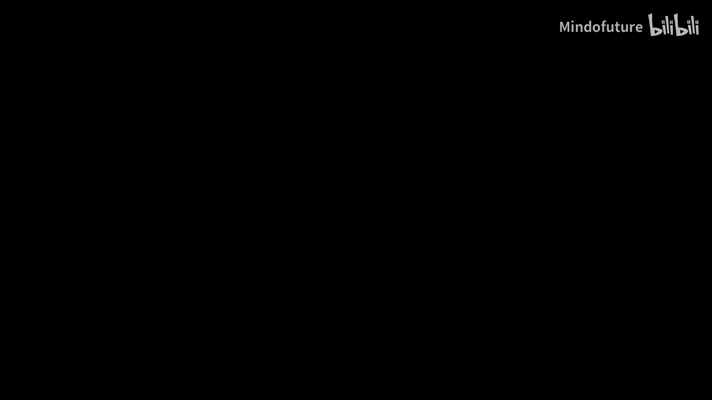
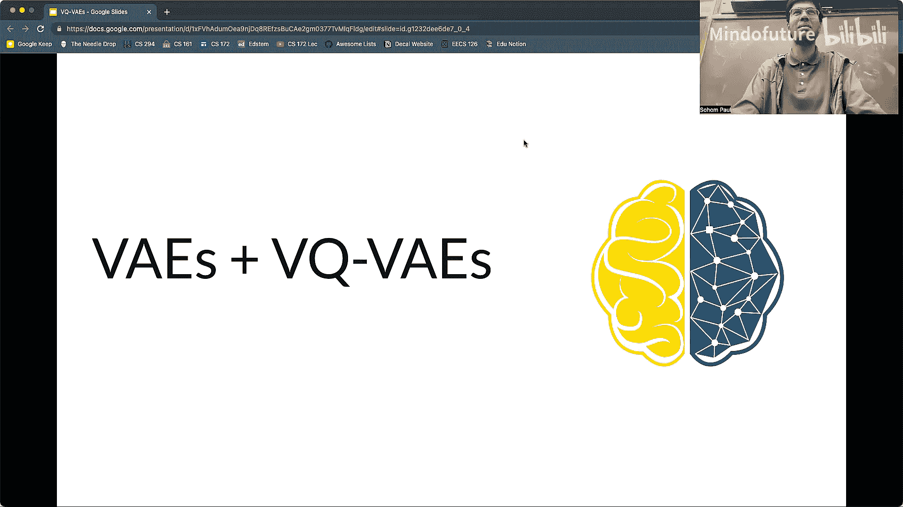
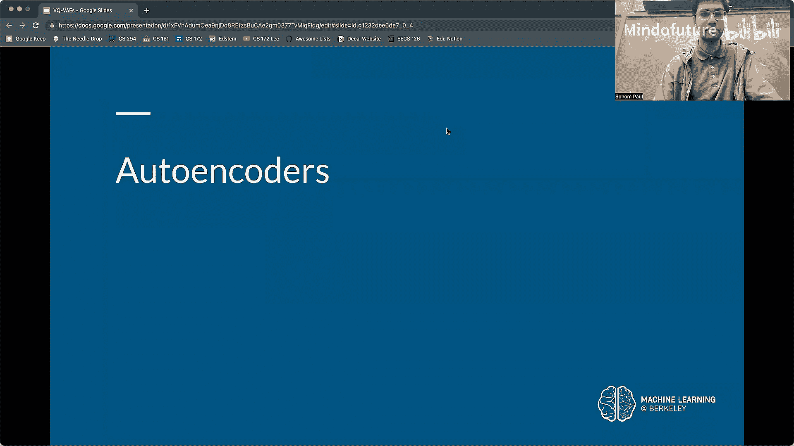
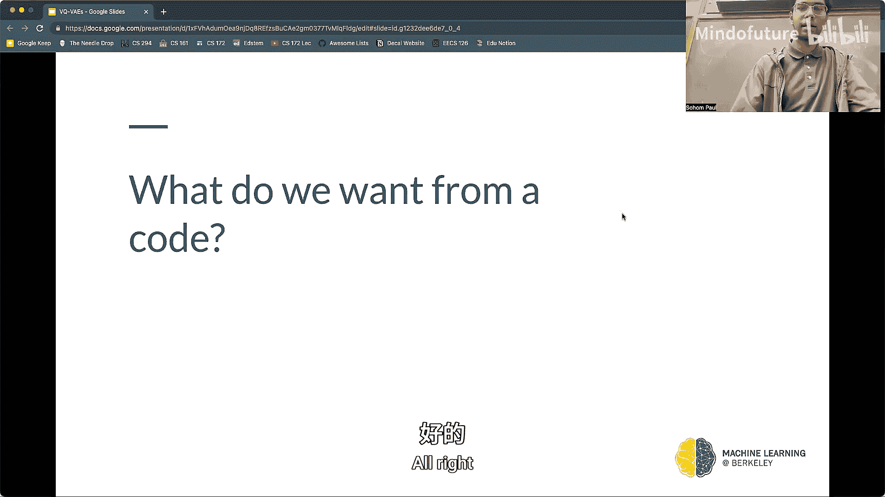
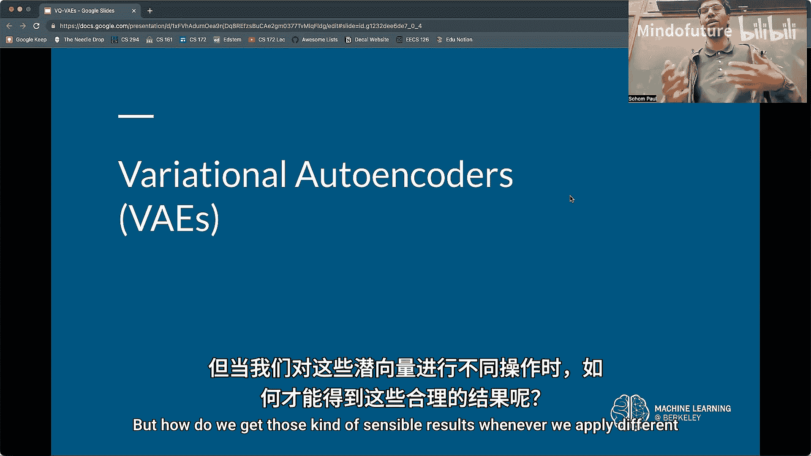
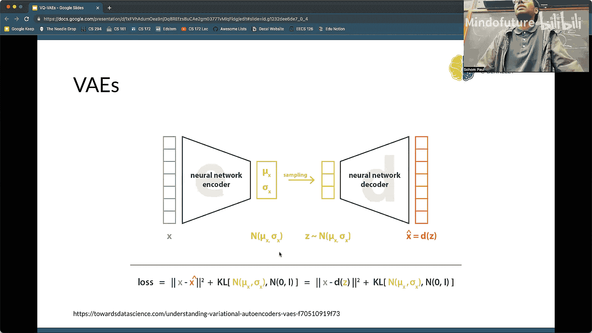
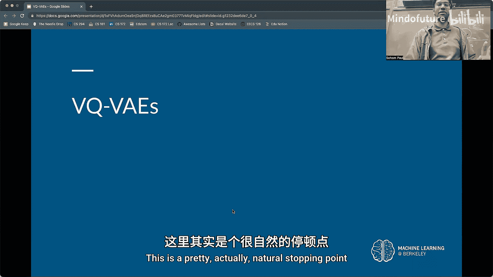
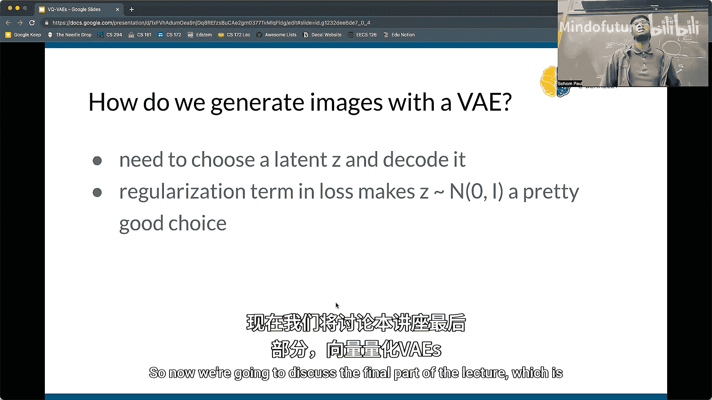
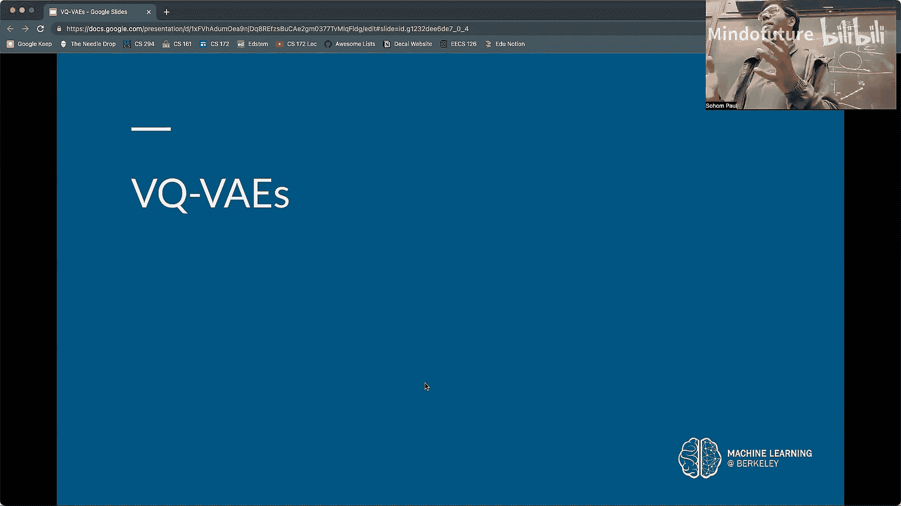
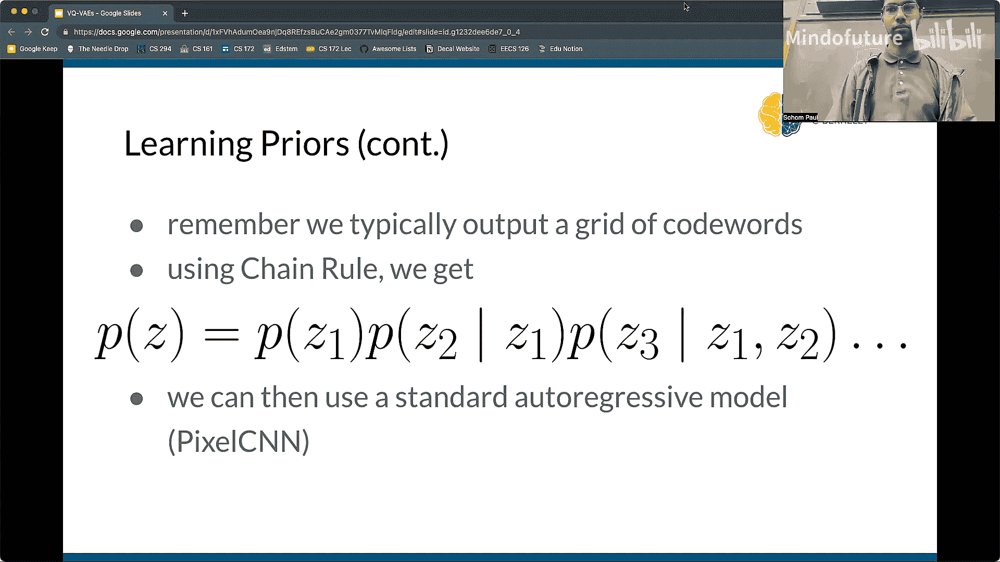

# 009：自编码器、VAEs与生成模型







在本节课中，我们将要学习生成模型的基本概念，特别是自编码器及其变体。我们将从数据压缩的原理出发，探讨如何让神经网络学习数据的本质特征，并最终能够生成全新的、合理的数据样本。

## 从数据压缩到特征理解

上一节我们介绍了课程的整体方向。本节中，我们来看看为什么数据压缩与理解数据特征密切相关。

一个高效的压缩算法必须理解数据的模式和结构。以JPEG图像压缩为例，它利用了“相邻像素颜色相似”和“人眼对高频细节不敏感”等先验知识，从而在保留主要视觉信息的同时大幅减小文件体积。

然而，JPEG是一种通用压缩算法。如果我们想专门压缩“猫”的图像，我们可以利用更深层的知识：猫有头部、躯干、四肢和尾巴，并且这些部分以特定的方式连接。如果我们能自动学习并编码这些高级特征，就能实现更高效的压缩。这正是机器学习，特别是自编码器，可以发挥作用的地方。

## 自编码器：学习压缩与重建

上一节我们讨论了压缩需要理解数据。本节中我们来看看如何用神经网络自动学习这种压缩表示，即自编码器。

自编码器是一种神经网络，其目标是学习输入数据的有效表示（编码），并能从该表示中重建原始数据（解码）。其结构通常是对称的：
*   **编码器**：将高维输入数据（如图像）映射到一个低维的“瓶颈”层，即**潜在编码**。
*   **解码器**：将低维的潜在编码映射回原始数据空间，试图重建输入。

其训练目标是最小化**重建损失**，即原始输入 `x` 与重建输出 `x_hat` 之间的差异（如均方误差）：
`Loss = ||x - x_hat||^2`

通过迫使网络通过一个狭窄的瓶颈来传递信息，我们强制它学习数据中最重要、最具代表性的特征，丢弃不重要的细节，从而实现了一种有损压缩。



一个简单的自编码器结构可能面临的问题是，它可能只是学会了“恒等映射”而没有真正压缩，或者其潜在空间的结构是混乱且不可解释的。



## 变分自编码器：构建结构化的潜在空间

上一节我们介绍了基础的自编码器。本节中我们来看看如何改进它，使其潜在空间具有良好、连续的结构，从而支持生成新样本。

基础自编码器的潜在编码是确定性的点，这导致潜在空间可能不连续，难以进行插值或采样。**变分自编码器** 通过引入概率思想解决了这个问题。

在VAE中，编码器不再输出一个确定的潜在向量 `z`，而是输出一个概率分布的参数（通常是高斯分布）。具体来说，对于输入 `x`，编码器输出均值 `μ` 和方差 `σ`，然后我们从该分布中采样得到潜在向量 `z`：`z ~ N(μ, σ^2)`。这个 `z` 再被送入解码器进行重建。

VAE的损失函数包含两部分：
1.  **重建损失**：确保解码后的输出接近原始输入。
2.  **KL散度损失**：强制编码器输出的分布接近标准正态分布 `N(0, I)`。

```
总损失 = 重建损失 + β * KL( N(μ, σ^2) || N(0, I) )
```

KL散度项的作用是正则化潜在空间，使其更连续、更规则。它鼓励所有数据点的潜在分布都聚集在原点附近，并防止编码器为不同输入分配彼此远离且方差极小的分布（即退化为普通自编码器）。

这种结构化的潜在空间带来了关键优势：由于潜在空间是连续且平滑的，我们可以对潜在向量进行有意义的操作。例如，在两个图像的潜在编码之间进行线性插值，解码后可以得到在两个图像间平滑过渡的新图像。

## 矢量量化VAE：处理离散数据







上一节我们讨论了适用于连续数据的VAE。本节中我们来看看如何将其思想扩展到文本等离散数据领域。



标准VAE的潜在变量是连续的，但许多数据类型本质上是离散的（如文本中的单词）。**矢量量化VAE** 在VAE框架中引入了离散化步骤。

VQ-VAE的工作流程如下：
1.  编码器将输入映射为一系列连续向量。
2.  **矢量量化**：每个连续向量被替换为**码本**中与之最接近的离散“码字”。码本是一个可学习的嵌入向量集合。
3.  解码器接收这些离散码字的索引，并将其解码回数据空间。

其损失函数通常包含三部分：
*   重建损失。
*   码本损失：推动码本向量向编码器输出靠近。
*   承诺损失：推动编码器输出向选定的码本向量靠近。

为了能用有限的码本生成大量多样的输出，VQ-VAE让一个输入对应多个离散码字（例如，将图像编码为32x32的码字网格）。这样，可能的组合数量呈指数级增长（`码本大小^(32*32)`），足以生成极其丰富的内容。

生成本身则涉及从学习到的**先验分布**（如自回归模型）中采样一个离散码字序列，然后通过解码器生成新数据。

## 总结



本节课中我们一起学习了生成模型的一个重要家族。我们从数据压缩的需求出发，引入了**自编码器**作为学习数据特征表示的工具。为了获得可解释、可操作的潜在空间，我们将其发展为**变分自编码器**，它通过概率编码和KL散度正则化，构建了连续、结构化的潜在空间，支持插值和采样生成。最后，为了处理文本等离散数据，我们介绍了**矢量量化VAE**，它在VAE中加入了离散量化步骤和可学习码本，将生成模型的能力扩展到了离散领域。这些模型为从数据中学习并创造新内容奠定了坚实的基础。