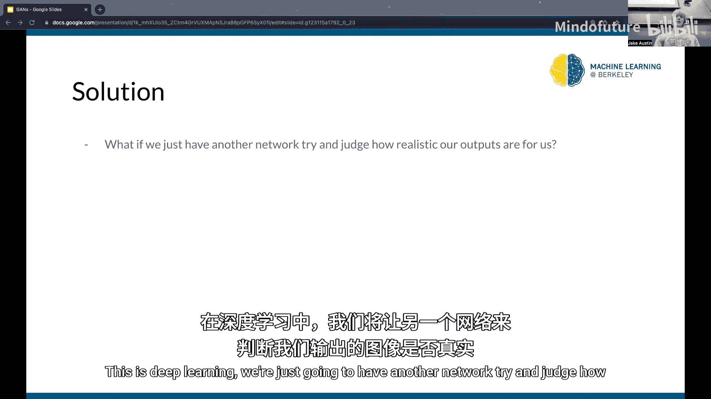
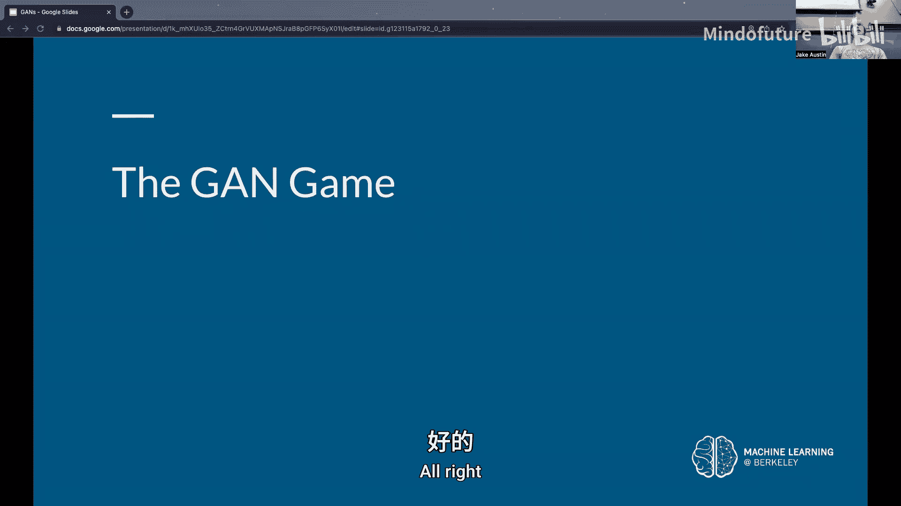
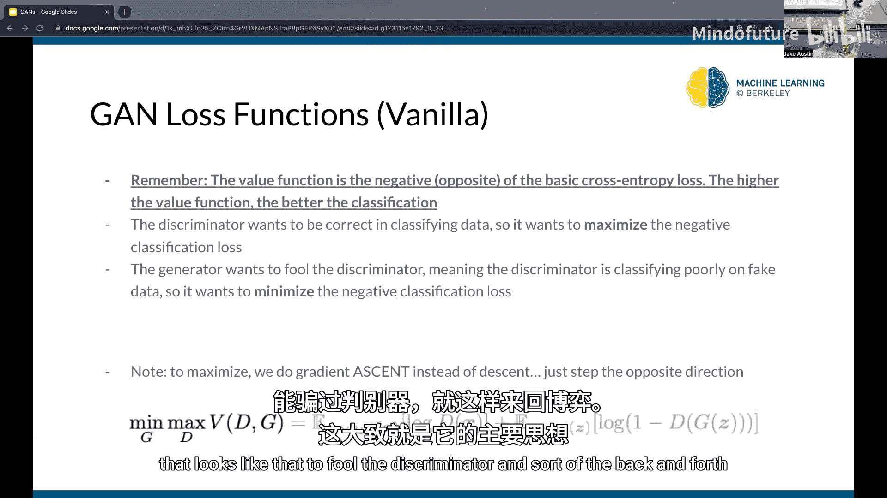
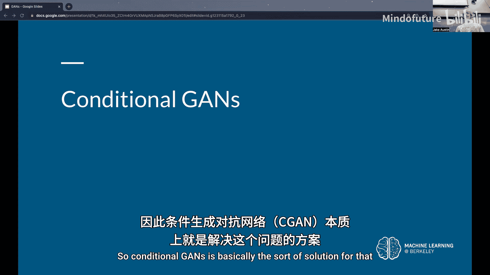
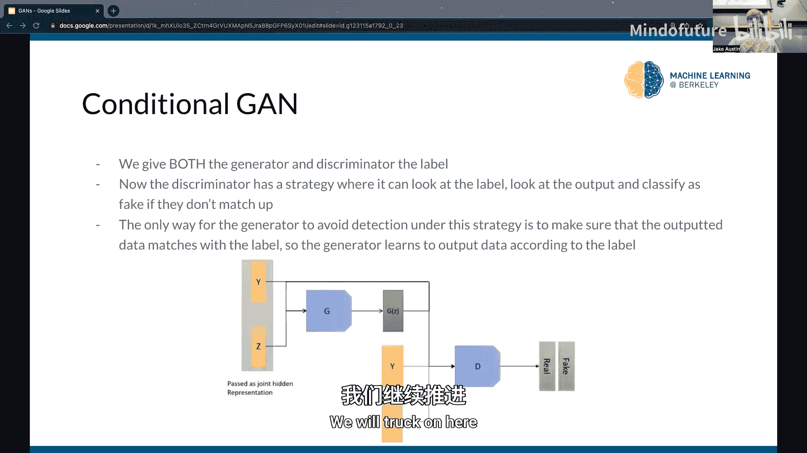
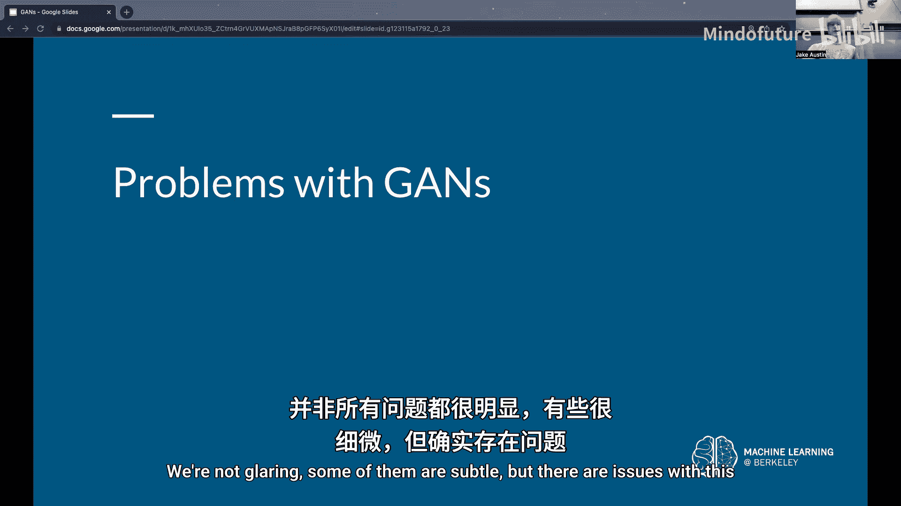
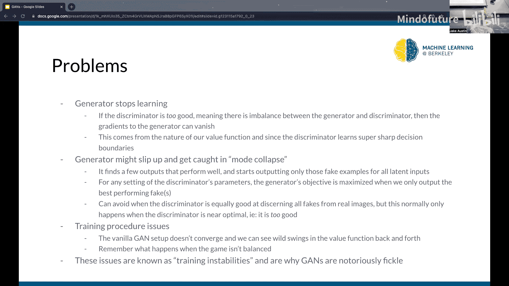
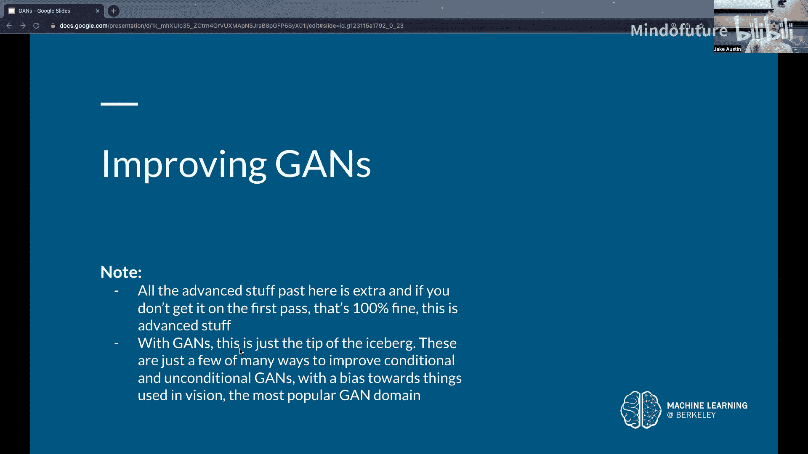
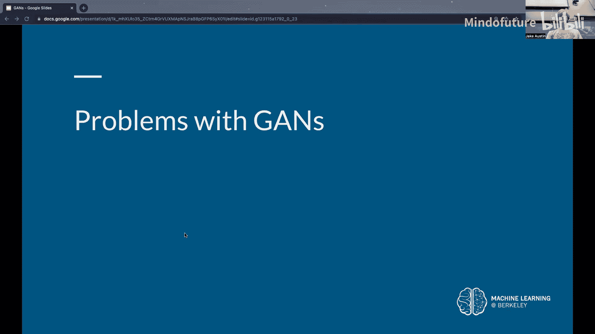
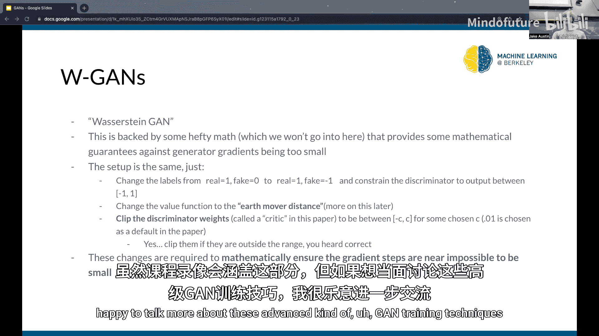

# 010：生成对抗网络 (GANs) 🎭

在本节课中，我们将要学习生成对抗网络（GANs）的核心概念、工作原理以及训练过程。GANs是一种强大的生成模型，通过让两个神经网络相互对抗来学习生成逼真的数据。

---

上一节我们回顾了自编码器及其潜在空间的概念。本节中，我们来看看如何将生成模型的目标从“重建”转变为“创造”。

## 核心概念：对抗游戏 🎮

生成对抗网络的核心思想是让两个网络相互竞争：
*   **生成器 (Generator)**：负责从随机噪声中生成假数据（如图像）。
*   **判别器 (Discriminator)**：负责判断输入的数据是来自真实数据集还是生成器产生的假数据。

这是一个博弈论场景。判别器的目标是最大化其正确分类的能力，而生成器的目标是生成足以“欺骗”判别器的数据，使其误以为假数据是真实的。

## 训练过程详解 🔄

以下是GANs的基本训练步骤：

1.  **训练判别器**：冻结生成器的权重。取一批真实图像和一批由生成器产生的假图像，训练判别器去正确区分它们。这本质上是一个二分类任务。
2.  **训练生成器**：冻结判别器的权重。取一批随机噪声，通过生成器得到假图像，然后输入给判别器。生成器的目标是调整自身参数，使得判别器将这些假图像判断为“真实”。通过反向传播，梯度可以从判别器的输出一直传递回生成器的权重。
3.  **交替迭代**：重复步骤1和2，让生成器和判别器在对抗中共同进步。

**关键点**：由于整个系统（生成器+判别器）是可微分的，我们可以使用梯度下降法来优化这两个网络。

## 架构与输入选择 🏗️

在构建GAN时，我们需要做出以下选择：

*   **潜在向量**：生成器的输入是一个随机噪声向量 `z`，通常从多元高斯分布中采样。其维度和分布是我们需要设定的超参数。
*   **生成器架构**：一个将噪声向量 `z` 上采样到目标数据（如图像）尺寸的网络。其结构与自编码器中的解码器类似。
*   **判别器架构**：一个将数据（真实或生成）下采样到一个标量值（如0到1之间，代表“假”或“真”的概率）的网络。其结构与自编码器中的编码器类似。

## 损失函数与目标 🎯

GAN的训练目标可以用一个价值函数 `V(D, G)` 来描述。对于判别器 `D` 和生成器 `G`，这是一个极小极大博弈：

**公式**：`min_G max_D V(D, G) = E_{x~p_data}[log D(x)] + E_{z~p_z}[log(1 - D(G(z)))]`

*   **判别器的目标**：**最大化** `V(D, G)`。这意味着它要努力将真实数据 `x` 判断为真 (`D(x)` 接近1)，将生成数据 `G(z)` 判断为假 (`D(G(z))` 接近0)。
*   **生成器的目标**：**最小化** `V(D, G)`。更准确地说，它希望最大化判别器对其生成数据的误判率，即让 `D(G(z))` 接近1。

在实际实现中，我们通常使用二元交叉熵损失，并通过优化器来分别实现判别器的梯度**上升**和生成器的梯度**下降**。

## 条件生成对抗网络 (cGAN) 🏷️

基本的GAN无法控制生成数据的类别。条件GAN通过为生成器和判别器同时提供额外的条件信息（如图像的类别标签）来解决这个问题。

**工作原理**：
1.  生成器的输入变为：`随机噪声z + 条件标签c（如“猫”）`。
2.  判别器的输入变为：`图像 + 对应的标签`。
3.  判别器现在需要判断“图像-标签”对是否匹配且真实。如果生成器生成了一个看起来像狗但标签是“猫”的图像，判别器可以轻易识破。
4.  因此，生成器被**迫使**去学习生成与给定条件标签相符的图像，否则就会被判别器轻易击败。

## GANs的挑战与问题 ⚠️

尽管强大，GANs的训练充满挑战：

*   **判别器过强**：如果判别器变得过于强大，能近乎完美地区分真假，那么传递给生成器的梯度会变得非常小（梯度消失），导致生成器无法学习。
*   **模式崩溃**：生成器可能发现少数几种能有效欺骗判别器的输出模式，并开始只生成这几种高度相似的样本，导致生成多样性严重不足。
*   **训练不稳定**：GAN的训练过程可能不会像传统模型那样收敛。损失值会持续波动，很难找到一个明确的停止训练的信号。生成器和判别器需要精心平衡。

## 改进：非饱和损失 💡

为了解决判别器过强时生成器梯度消失的问题，研究者提出了**非饱和损失**。它是对生成器目标的一个小改动：

*   **原始目标**：生成器最小化 `log(1 - D(G(z)))`。当 `D(G(z))` 接近0（判别器认为很假）时，这个函数的梯度很小。
*   **非饱和目标**：生成器改为**最大化** `log(D(G(z)))`。这样，当生成的数据被判别为很假时，生成器反而能获得更大的梯度，从而更快地学习改进。

这个简单的改变显著提高了训练的稳定性。

---

本节课中我们一起学习了生成对抗网络（GANs）的基本原理。我们了解到GAN通过设置生成器和判别器这两个相互对抗的网络，能够学习生成逼真的数据。我们探讨了其训练过程、架构、数学目标（极小极大博弈），以及条件GAN如何实现可控生成。最后，我们也指出了GAN训练中常见的挑战（如模式崩溃、不稳定性）以及一个重要的改进技巧——非饱和损失。GAN是生成模型领域的里程碑，尽管训练困难，但其思想影响深远。