# 011：高级GANs 🎨

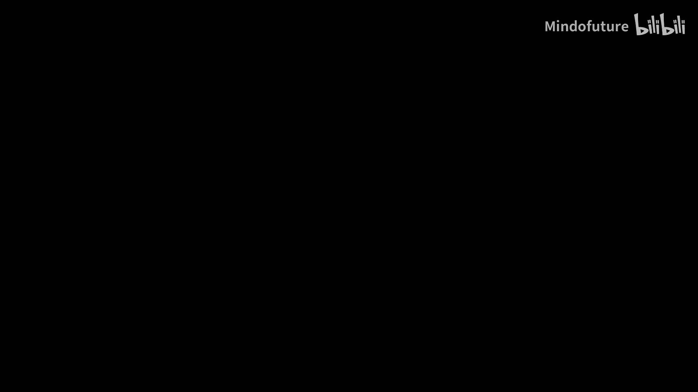

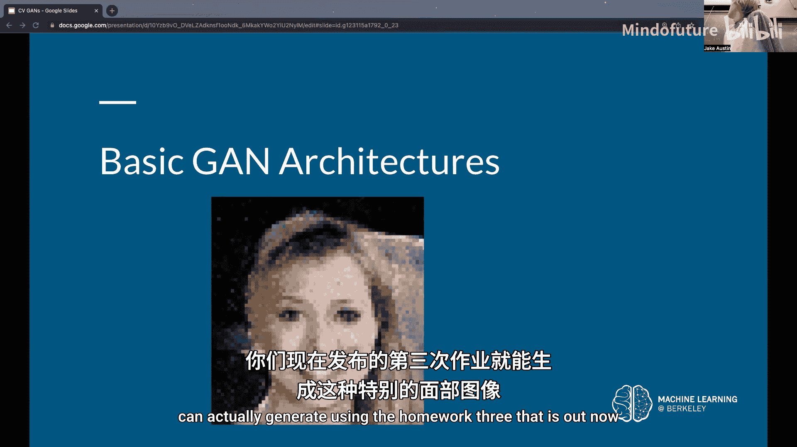

在本节课中，我们将要学习生成对抗网络在计算机视觉领域的几种高级应用。我们将探讨如何为视觉任务构建GAN架构，并深入解读三个具有代表性的论文：StyleGAN、CycleGAN和BigGAN。这些模型在图像生成、风格转换和大规模训练方面取得了显著进展。

## 基础视觉GAN架构 🏗️

上一节我们介绍了GAN的基本概念，本节中我们来看看如何为图像数据设计具体的生成器和判别器架构。

判别器本质上是一个用于分类的卷积神经网络。它接收图像输入，通过一系列卷积层逐步减少特征图的空间尺寸并增加通道数，最终输出一个真/假分类结果。其架构与我们在本课程中见过的分类CNN类似。

生成器的设计更具挑战性，因为它需要将随机噪声向量上采样为一张高度 x 宽度 x 3的图像。以下是几种常见的上采样方法：

*   **最近邻上采样**：将输入特征图中的每个像素复制并填充到其邻近区域。这种方法简单，但会导致生成的图像模糊。
    ```python
    # 伪代码示例：最近邻上采样
    upsampled = repeat_elements(input, scale_factor, axis=[1, 2])
    ```
*   **双线性上采样**：通过计算相邻像素值的加权平均来填充新特征图中的位置。这比最近邻方法能产生更平滑的结果。
*   **转置卷积**：通过在输入特征图元素间插入空白（步长>1时）并进行卷积操作，从而增大输出特征图的尺寸。这是一种更智能的上采样方式，允许网络在学习过程中调整上采样过程。
    ```python
    # 伪代码示例：转置卷积 (在深度学习框架中)
    output = Conv2DTranspose(filters, kernel_size, strides=2)(input)
    ```

对于**条件GAN**，生成器的输入除了潜在向量 `z`，还有一个条件向量 `c`（例如，指示生成图像的类别）。一种简单的处理方法是直接将两个向量拼接起来 `[z, c]` 作为生成器的输入。对于判别器，可以将条件向量广播后与图像特征进行拼接。

## 深入StyleGAN架构 🔬

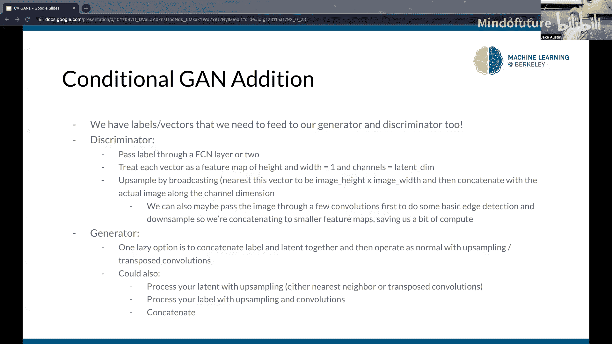

上一节我们介绍了基础的生成器结构，本节中我们来看看StyleGAN如何通过创新的架构设计来生成更高质量、更具细节的图像。StyleGAN主要解决了三个问题：潜在向量的预处理、风格信息在整个网络中的传播，以及为生成逼真纹理提供充足的随机性来源。

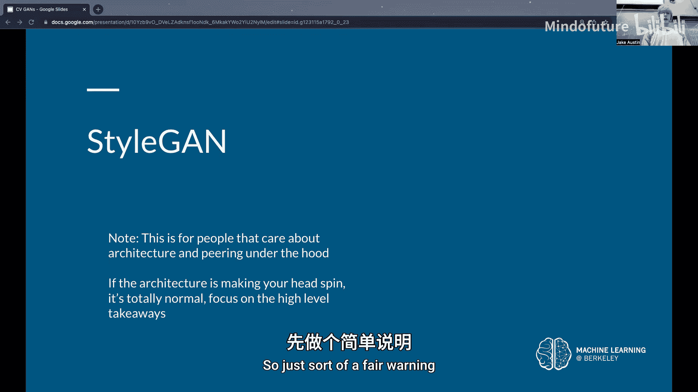

### 潜在向量映射网络

StyleGAN首先将输入的潜在向量 `z` 通过一个由8个全连接层组成的映射网络，转换为一个中间潜在向量 `w`。这样做的动机是，原始的潜在空间可能不是均匀分布的，映射网络可以学习将其转换为一个更解耦、更易于生成器解释的表示。

### 自适应实例归一化

这是StyleGAN的核心创新。传统的批量归一化公式为：
`y = γ * ((x - μ)/σ) + β`
其中 `γ` 和 `β` 是可学习的参数。

自适应实例归一化则不同，它将 `γ` 和 `β` 作为输入。具体来说，中间潜在向量 `w` 经过一个全连接层后，被用来为生成器中的每个卷积层之后的特征图提供缩放和偏置参数。这意味着**风格信息 `w` 通过控制每个特征图的归一化过程，被直接注入到网络的每一层**，从而精细地控制生成图像的风格。

### 添加随机噪声

为了生成更逼真的纹理（如头发、皮肤毛孔），StyleGAN在生成器的每个卷积层之后、进行AdaIN操作之前，向特征图添加一个每通道独立的高斯噪声图。网络还会学习一个每通道的缩放因子，用于控制该层添加的噪声强度，从而让网络自己决定在何处需要多少“随机性”来增强细节。

**StyleGAN的主要创新点总结如下：**
*   使用映射网络对潜在向量进行预处理。
*   通过自适应实例归一化将风格信息注入网络每一层。
*   在多个层级添加可控的随机噪声以改善纹理生成。

## 图像到图像的转换：CycleGAN 🔄

上一节我们探讨了改进单域图像生成的架构，本节中我们来看看CycleGAN，它实现了**无需成对训练数据**的跨域图像风格转换。

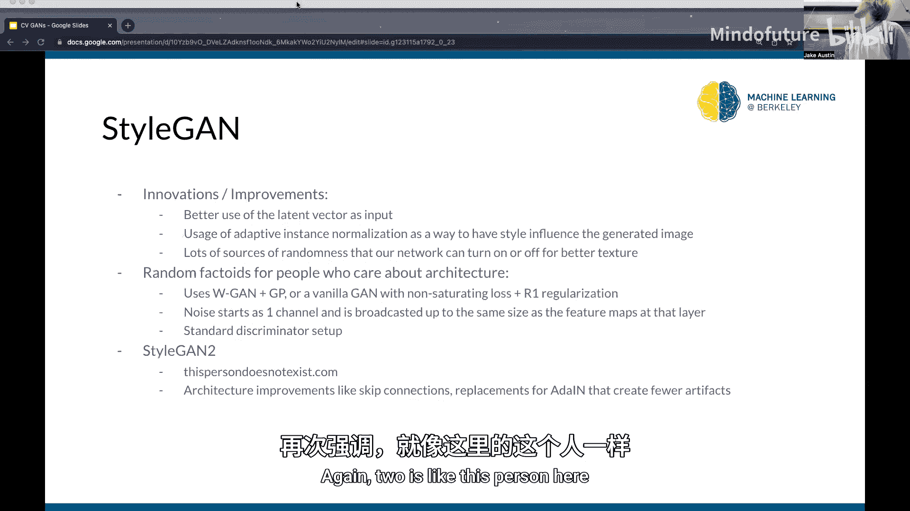

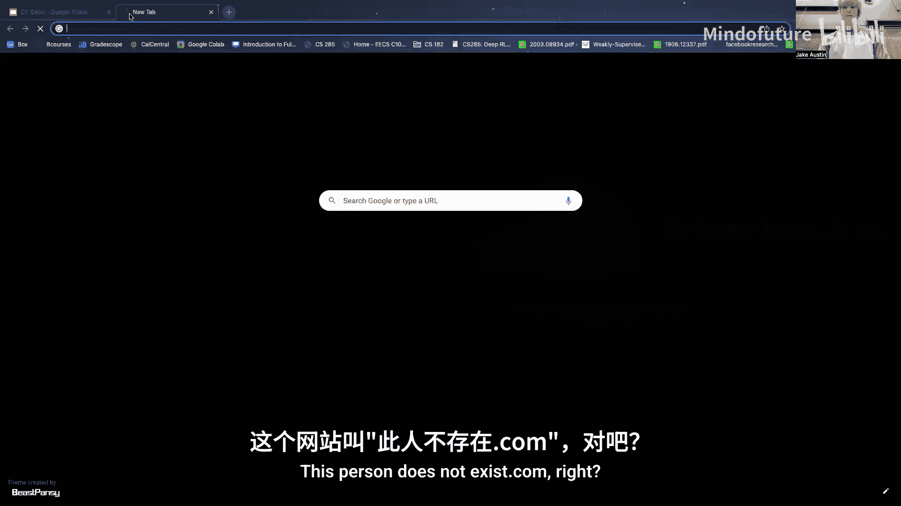

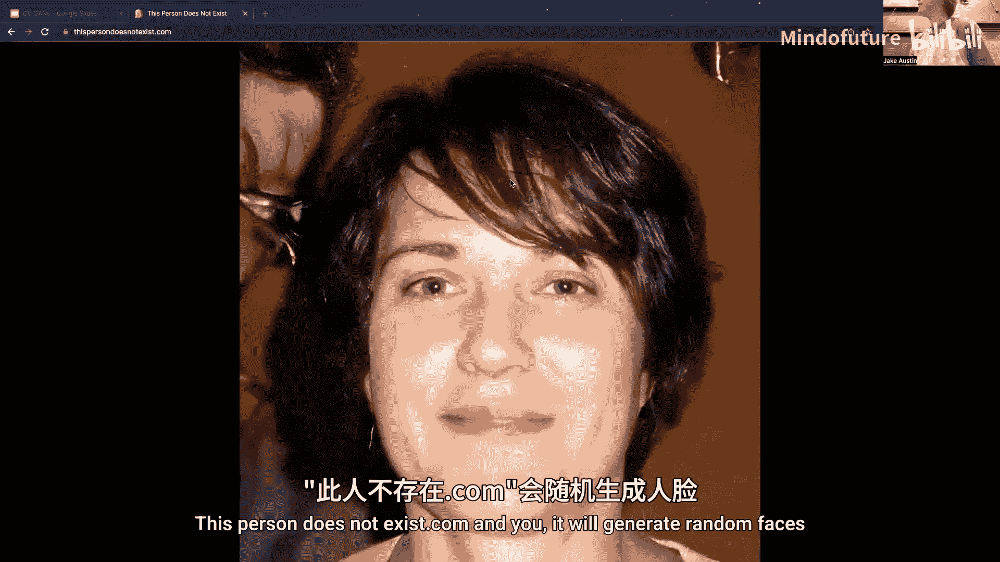

CycleGAN的目标是学习两个图像域（如`马`和`斑马`）之间的映射。它包含两个生成器（`G: 马 -> 斑马`， `F: 斑马 -> 马`）和两个判别器（`D_X` 判断是否为真马，`D_Y` 判断是否为真斑马）。

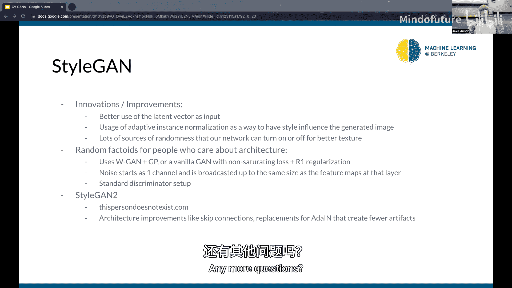

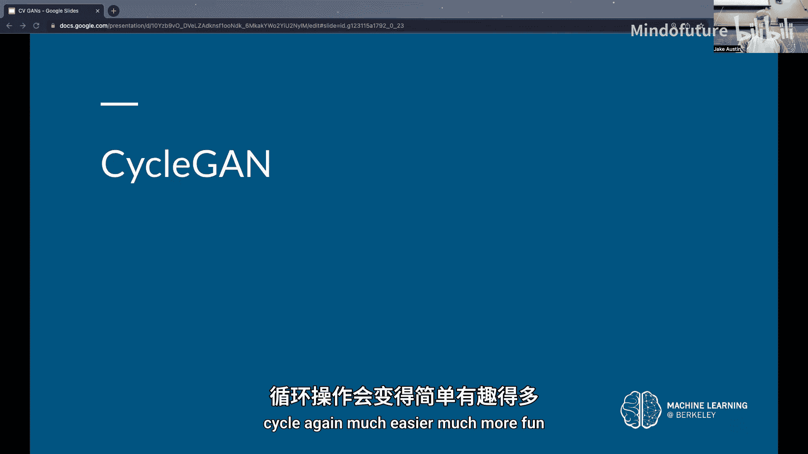

其损失函数包含两部分：
1.  **对抗损失**：确保生成的图像在目标域中看起来逼真。例如，`G` 生成的斑马应能骗过判别器 `D_Y`。
2.  **循环一致性损失**：这是关键创新。它要求转换是可逆的，即把一匹马变成斑马再变回马，应该得到与原始马相似的图像。公式上，它最小化 `F(G(马))` 与原始`马`图像之间的差异，以及 `G(F(斑马))` 与原始`斑马`图像之间的差异。

```
L_cycle = ||F(G(x)) - x|| + ||G(F(y)) - y||
```

这种设计使得CycleGAN能够学习到两个未配对数据集之间的本质风格映射，并成功应用于季节转换、绘画风格迁移等任务。

## 大规模训练：BigGAN 🐘

最后，我们来看BigGAN，它探索了如何将GAN成功应用于大规模、多类别数据集（如ImageNet）。其核心发现是：**扩大模型规模、批量大小和数据量可以显著提升生成图像的质量和训练稳定性**。

BigGAN采用了一种称为“SA-GAN”的自我注意力架构来帮助建模长距离依赖关系，并将条件信息（类别标签）通过“条件批量归一化”注入生成器。

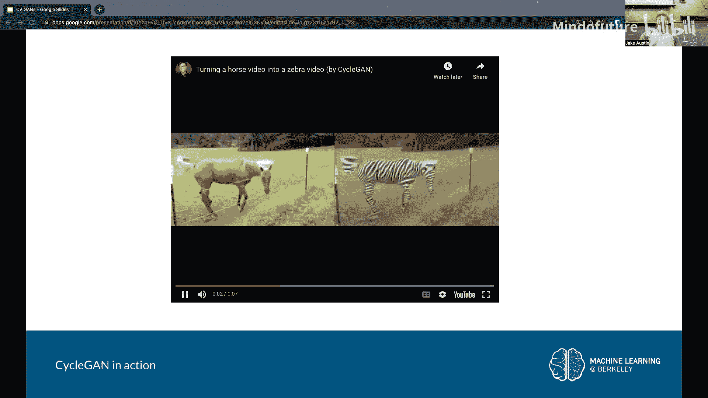

BigGAN论文中一个重要的实践洞见是**截断技巧**。在测试时，如果从标准正态分布中采样到的潜在向量 `z` 的某些维度值过大（处于分布尾部），生成质量可能会下降。截断技巧通过重新采样，只保留 `z` 中幅度在一定阈值内的值，可以提升单张图片的生成质量。但这也带来了**多样性-质量权衡**：过度截断会导致所有生成图像都趋于相似，缺乏多样性。

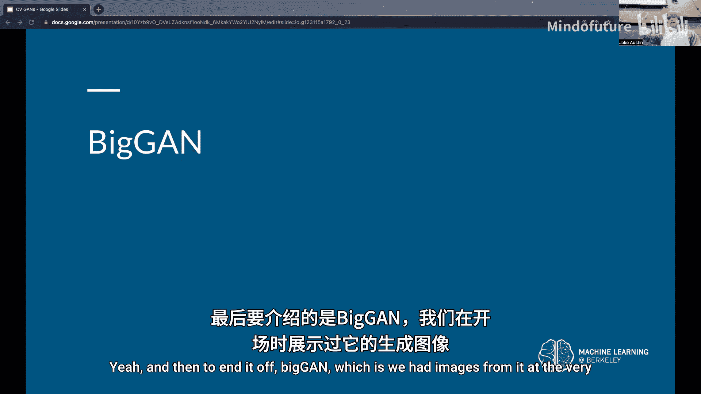

此外，论文指出，在追求高性能时，需要在一定程度上容忍训练的不稳定性。过度约束判别器使其“行为良好”，有时反而会损害最终的生成效果。

**BigGAN的主要启示：**
*   计算资源（大模型、大批次）是提升GAN性能的关键。
*   使用截断技巧可以在测试时权衡图像质量与多样性。
*   在大规模训练中，需要接受一定程度的训练不稳定性以换取更好的生成效果。

## 总结 📝

本节课中我们一起学习了三种高级GAN模型在计算机视觉中的应用。
*   **StyleGAN** 通过精妙的架构设计（映射网络、AdaIN、噪声注入）实现了对生成图像风格的高精度控制和细节刻画。
*   **CycleGAN** 利用循环一致性损失，开创了无需配对数据的跨域图像转换，扩展了GAN的应用范围。
*   **BigGAN** 则向我们展示了，当拥有充足的计算资源和数据时，GAN能够生成极其逼真和多样的大规模类别图像。

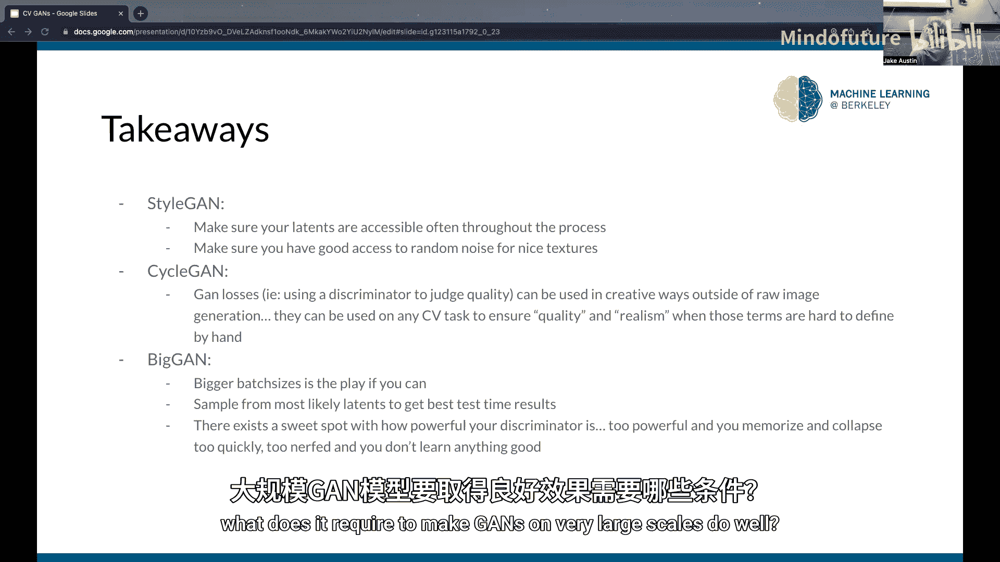

这些工作体现了生成对抗网络在解决复杂视觉任务上的强大能力和持续演进的方向。