# 012：扩散模型 🧠

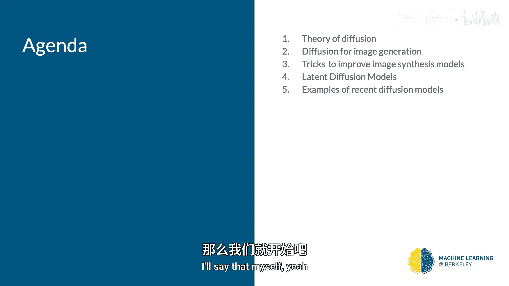

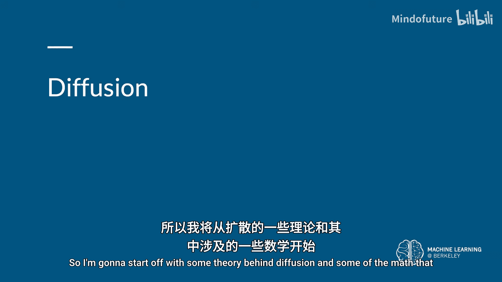

在本节课中，我们将要学习一种名为“扩散模型”的新型生成模型。这是我们在过去几周关于图像生成的系列讲座中的最后一讲，它将以一种优美的方式总结你目前所学到的所有知识。

需要说明的是，本讲内容在数学上比之前的讲座更为深入。我会提及这些细节，因为我认为忽略它们是对扩散模型的不公。然而，如果你在复杂的数学推导中感到困惑，这完全可以理解，你并不需要完全掌握这些细节。

## 生成模型概览

在机器学习中，我们通常假设数据来自某个潜在的分布。生成模型的目标就是学习这个分布，以便能够从中采样，从而生成看起来像是来自训练数据集的新数据点。

学习分布主要有两种方法：
1.  **最大化似然**：如果一个样本的似然值高，那么它很可能来自该分布。
2.  **最小化散度**：最小化数据分布与模型学习到的分布之间的某种散度度量。

我们学过的变分自编码器（VAE）和生成对抗网络（GAN）本质上都在做这两件事。VAE的损失函数是似然的一个下界，最小化它就是在最大化似然。而GAN的对抗损失则是在最小化数据分布与生成器分布之间的詹森-香农散度。

## 扩散模型的动机

上一节我们介绍了生成模型的基本目标，本节中我们来看看扩散模型的独特思路。

大多数生成模型（如VAE和GAN）从一个随机噪声向量开始，通过一个复杂的神经网络一步生成图像。这个单步过程难以分析和理解。

扩散模型则采取了不同的策略：它们不采取一个大的步骤，而是采取多个微小的步骤。这些步骤构成了一个马尔可夫链。这种多步、渐进的方法更容易分析，其灵感来源于非平衡统计力学。

## 扩散模型的核心过程

扩散模型包含两个主要部分：前向过程和反向过程。

### 前向过程：加噪

前向过程从一个干净图像 `x0` 开始，逐步向其添加高斯噪声。在 `T` 个时间步后，图像会变成纯噪声 `xT`。

每一步添加的噪声量由一个称为**噪声调度**的 `β_t` 序列控制。一个关键的数学技巧是，我们可以直接写出任意时间步 `t` 的噪声图像 `x_t` 与原始图像 `x0` 的关系，而无需逐步迭代：

`q(x_t | x_0) = N(x_t; √(ᾱ_t) x_0, (1 - ᾱ_t)I)`，其中 `α_t = 1 - β_t`，`ᾱ_t = Π_{s=1}^{t} α_s`

### 反向过程：去噪

仅仅将图像变成噪声并无用处。我们的目标是生成新图像，因此我们需要学习如何逆转这个过程。

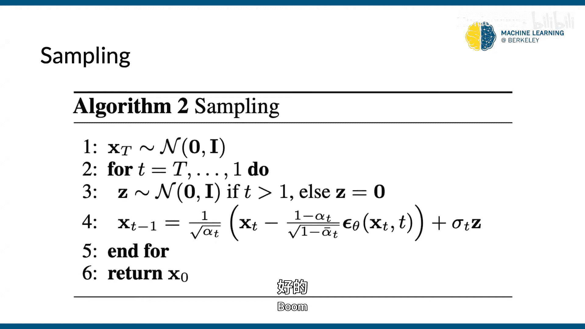

反向过程从纯噪声 `x_T` 开始，目标是逐步去除噪声，最终得到一个干净图像 `x_0`。然而，我们并不知道反向的条件分布 `q(x_{t-1} | x_t)`，直接计算它是不可行的。

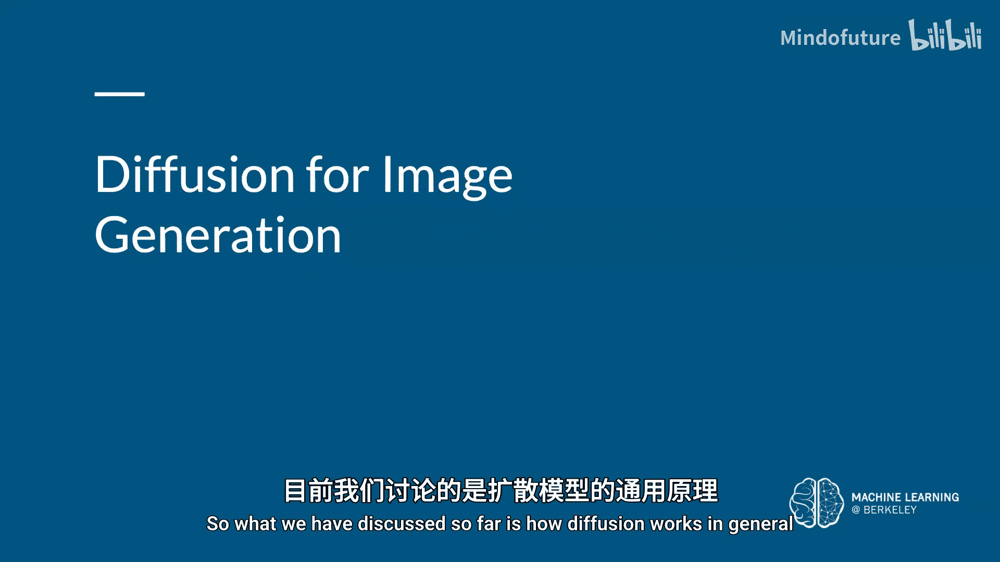

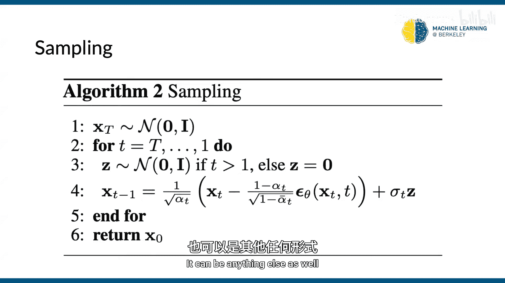

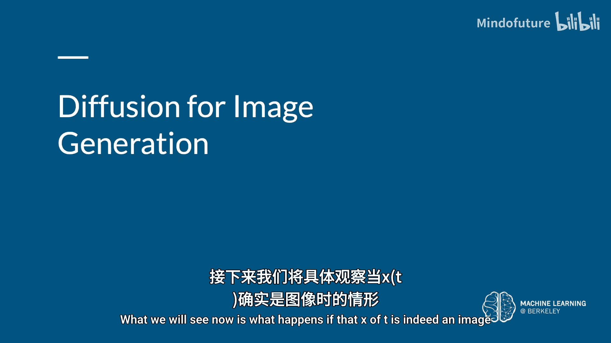

因此，我们使用一个参数为 `θ` 的神经网络 `p_θ` 来近似这个反向分布。一个重要的理论结果是，当 `β_t` 足够小时，这个反向分布也可以近似为一个高斯分布。因此，我们的神经网络只需要预测这个高斯分布的均值和方差。

## 训练目标与简化

我们的目标是最大化生成数据似然，但这同样难以计算。与VAE类似，我们可以转而优化其变分下界。

经过一系列推导（详见推荐阅读），这个下界可以转化为一个更直观的目标：神经网络需要预测在前向过程中添加到图像上的噪声 `ε`。

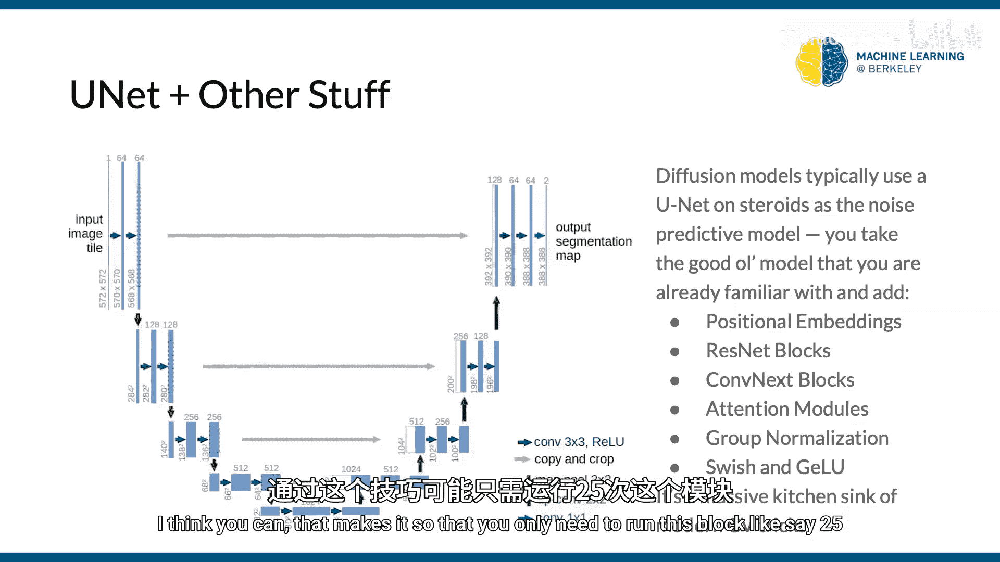

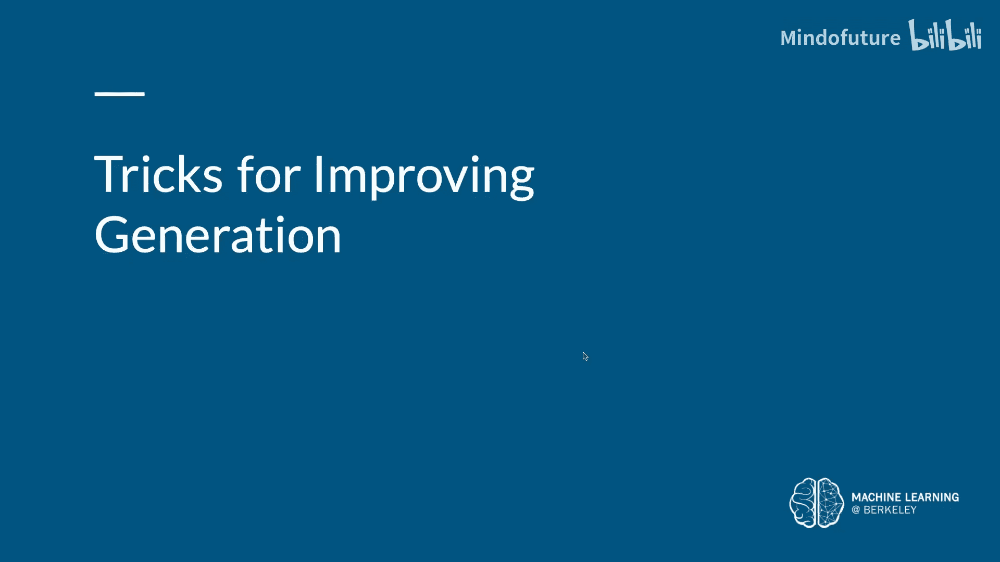

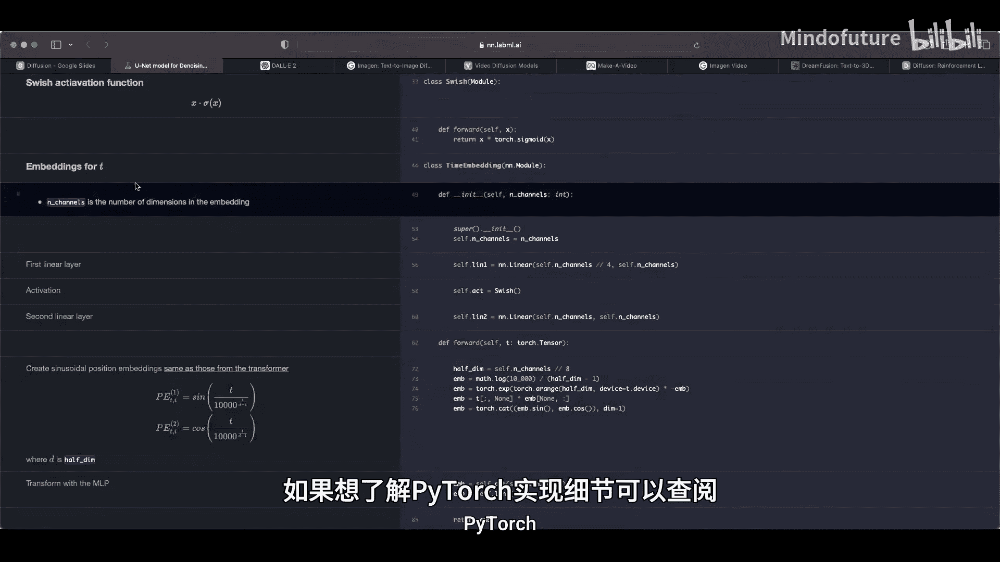

简化后的训练目标如下：
`L_simple(θ) = E_{t, x_0, ε}[|| ε - ε_θ(√(ᾱ_t) x_0 + √(1-ᾱ_t) ε, t) ||^2]`

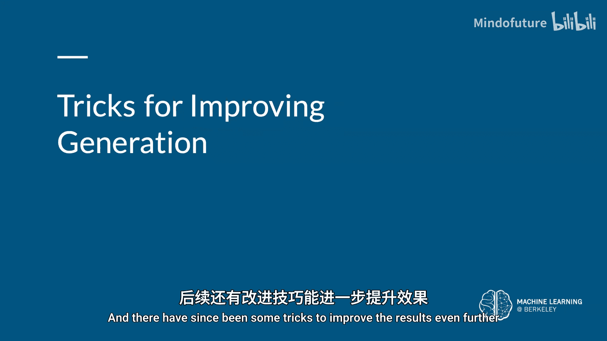

**核心直觉**：模型 `ε_θ` 学习预测在时间步 `t` 加入的噪声。如果我们从一张噪声图像中减去预测的噪声，就能得到更干净的图像。从纯噪声开始，重复此过程，最终就能生成全新的图像。

以下是训练和采样的算法概要：

**训练循环**：
1.  从数据集中采样干净图像 `x0`。
2.  随机采样时间步 `t` 和噪声 `ε ~ N(0, I)`。
3.  计算带噪图像 `x_t = √(ᾱ_t) x_0 + √(1-ᾱ_t) ε`。
4.  将 `x_t` 和时间步 `t` 输入神经网络，获得预测的噪声 `ε_θ`。
5.  计算预测噪声与真实噪声 `ε` 之间的均方误差损失，并更新模型参数。

**图像合成（采样）**：
1.  从纯噪声 `x_T ~ N(0, I)` 开始。
2.  从 `t = T` 到 `t = 1` 循环：
    *   使用神经网络预测噪声 `ε_θ(x_t, t)`。
    *   计算 `x_{t-1}`（根据公式，使用预测的噪声对当前图像进行“去噪”）。
3.  最终得到生成的图像 `x_0`。

## 实际应用：图像生成

到目前为止，我们讨论的是扩散模型的一般理论。当 `x_t` 是图像时，我们使用一个U-Net架构的神经网络作为噪声预测器 `ε_θ`。

这个U-Net集成了多种现代技巧以提升性能：
*   使用残差块和卷积块。
*   加入注意力模块。
*   用组归一化替代批归一化。
*   使用Swish/GLU等激活函数。

## 改进与技巧

研究人员提出了多种改进方法，使扩散模型更强大、更高效。

**改进的噪声调度**：使用线性调度会导致信息过快被破坏。采用余弦调度等更平缓的调度，可以让前向过程破坏信息的速度更慢，从而帮助模型更好地学习反向过程，提高图像质量。

**学习协方差**：原始模型将反向分布的协方差固定为常数。后来有工作表明，让神经网络同时学习协方差可以改善模型的似然，这通常意味着生成样本的多样性更好。

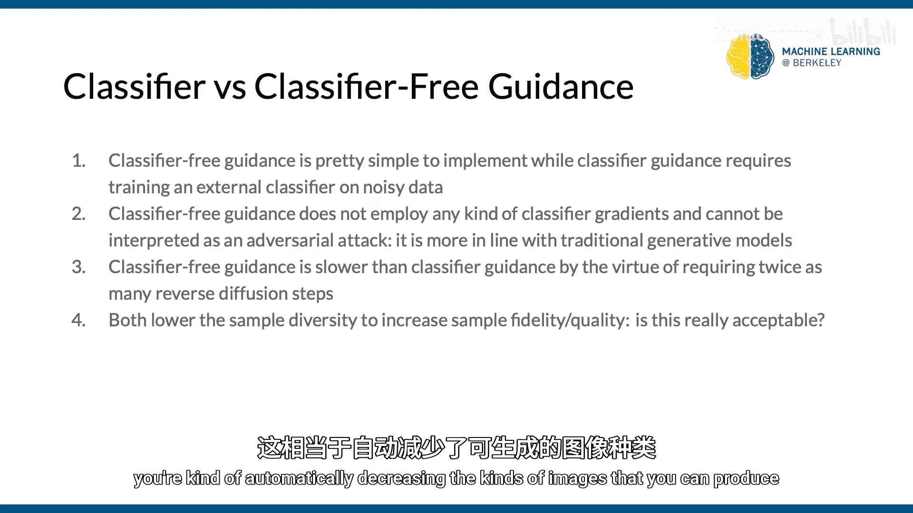

**引导生成**：为了控制生成的内容（如生成特定类别的图像），引入了“分类器引导”。它利用一个在噪声图像上训练的分类器的梯度来指导扩散采样过程，显著提高了生成质量。

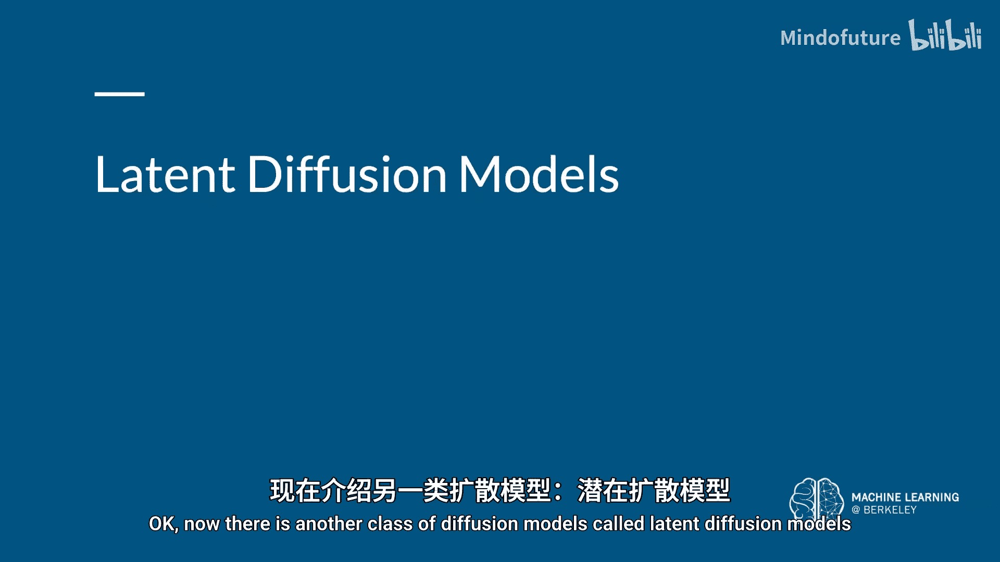

更进一步的“无分类器引导”技术，通过直接训练一个条件扩散模型（将类别标签作为输入），避免了训练额外分类器的需要，并且取得了更好的效果。需要注意的是，引导生成通常会以牺牲生成为代价来换取更高的生成质量。

## 潜在扩散模型

直接在像素空间进行扩散计算成本高昂。潜在扩散模型（LDM）先使用一个自编码器将图像压缩到一个低维的潜在空间，然后在潜在空间中进行扩散过程，最后再将结果解码回图像空间。

这种方法大大降低了计算开销，并且更专注于学习图像的语义信息。著名的**Stable Diffusion**模型就是基于此原理构建的。

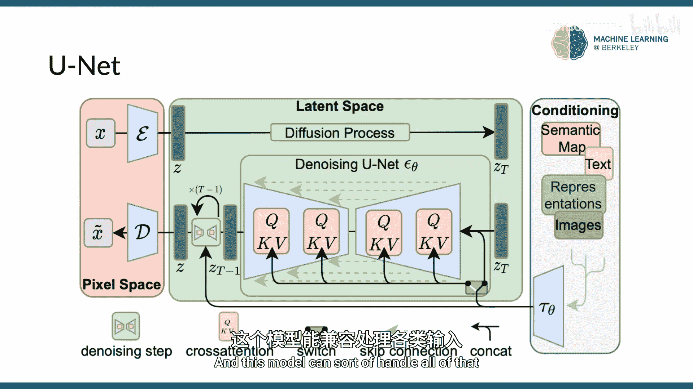

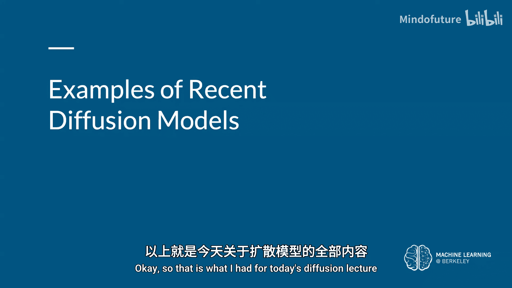

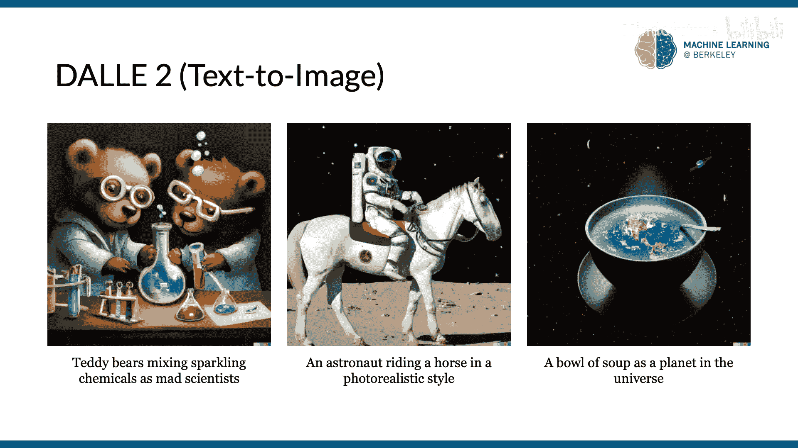

## 前沿进展与应用

扩散模型近年来发展迅速，已被应用于多种模态的生成任务：
*   **文生图**：DALL-E 2， Imagen。
*   **文生视频**：Google的Video Diffusion， Meta的Make-A-Video。
*   **3D生成**：从文本生成3D模型。
*   **强化学习**：用于轨迹规划和离线RL（如Diffusion QL）。

## 总结

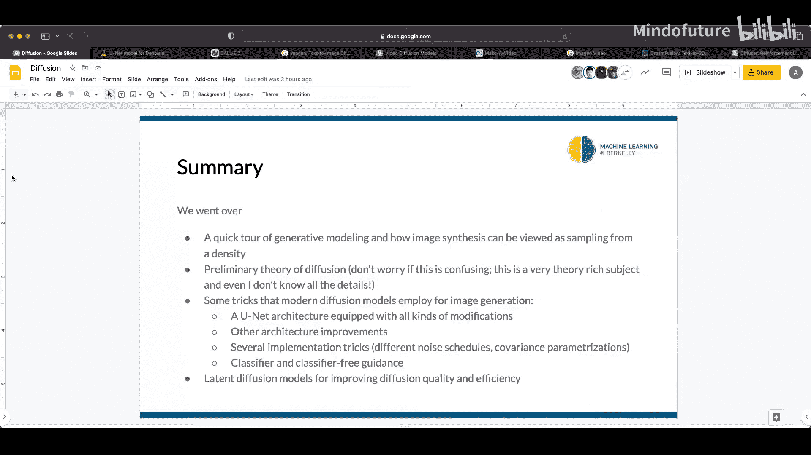

本节课中我们一起学习了扩散模型。我们从生成模型的基本目标出发，探讨了扩散模型通过多步马尔可夫链进行生成的核心思想。我们详细分析了前向加噪和反向去噪的两个过程，并推导出训练模型本质上是学习预测所添加的噪声。我们还介绍了U-Net在其中的应用，以及噪声调度、引导生成、潜在扩散等关键改进技术。最后，我们看到了扩散模型在图像、视频、3D等多模态生成任务中的强大能力和前沿进展。扩散模型目前是生成式AI领域的核心技术之一。