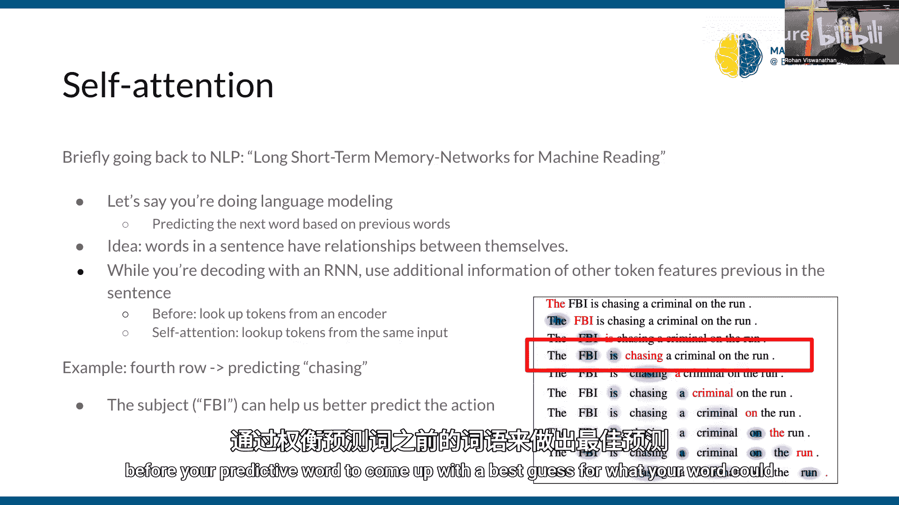
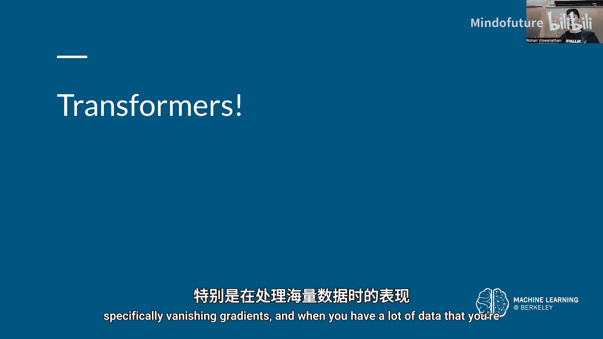
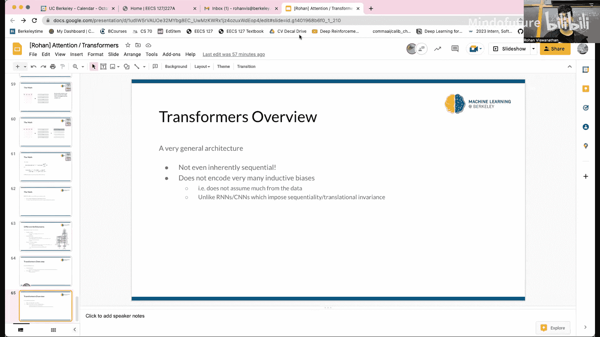

# 014：Transformers与注意力机制

在本节课中，我们将要学习注意力机制的核心概念，并了解它如何成为现代Transformer模型的基础。我们将从动机开始，逐步深入到Transformer架构的细节，并解释其如何解决传统序列模型（如RNN）的局限性。

## 注意力机制简介

上一节我们介绍了课程背景，本节中我们来看看注意力机制的基本思想。注意力机制允许模型在处理输入数据时，聚焦于其中重要的部分，而不是平等地对待所有信息。这类似于人类在书中查找特定信息时，会先定位到相关章节，再仔细阅读该部分内容。

注意力机制使用一个**查询-键-值**系统来做出更明智的决策。模型通过查询来寻找与当前任务最相关的键，并根据这些键对应的值来计算输出。

## 注意力机制的类型

以下是两种主要的注意力机制类型：

*   **硬注意力**：在特定时间步预测哪些索引是相关的。这需要在整个输入表示中搜索最相关的输入标记，计算量大且难以通过反向传播进行优化。
*   **软注意力**：为所有输入标记创建一组软权重，形成一个概率分布，表示每个标记的重要性。然后对值进行加权求和。公式表示为：
    `输出 = Σ (softmax(相似度(查询, 键_i)) * 值_i)`
    这是目前最常用的方法，也是Transformer模型的基础。

## 从RNN到注意力

上一节我们介绍了注意力的基本类型，本节中我们来看看它如何改进传统的编码器-解码器架构。在传统的RNN编码器-解码器模型中（例如用于机器翻译），编码器将整个输入序列压缩成一个固定的上下文向量，然后解码器基于此生成输出序列。这种方法在处理长序列时，信息容易丢失。

引入软注意力后，解码器在生成每一个输出时，都可以“查看”编码器所有隐藏状态，而不仅仅是最后一个。它通过计算当前解码器状态（查询）与所有编码器状态（键）的相似度，来动态地为每个编码器状态分配不同的权重（注意力分数），从而聚焦于最相关的输入部分。

## 视觉中的注意力

注意力机制同样可以应用于计算机视觉任务。例如：
*   **通道注意力**：如Squeeze-and-Excitation网络，学习每个特征通道的重要性权重。
*   **空间注意力**：学习图像中不同空间位置的重要性权重，常用于图像描述生成等任务，模型在生成每个词时关注图像的不同区域。

## 自注意力与Transformer

上一节我们看到了注意力在视觉中的应用，本节中我们来看看其核心演进：自注意力。在语言建模等任务中，一个句子内部的词语之间也存在重要关系。**自注意力**机制允许序列中的每个元素（例如一个词）与序列中的所有其他元素进行交互，以计算其新的表示。

Vaswani等人在论文《Attention Is All You Need》中提出的**Transformer**模型，完全摒弃了RNN的循环结构，仅依赖自注意力机制来建模序列关系，从而实现了极高的并行化能力。

## Transformer架构详解

Transformer模型的核心是**多头自注意力**机制。以下是其数据处理流程：

1.  **输入表示**：每个输入词被转换为词嵌入向量，并加上**位置编码**，以注入序列的顺序信息。位置编码可以是固定的（如正弦/余弦函数）或可学习的。
2.  **多头注意力层**：
    *   对于每个输入，通过线性变换生成**查询**、**键**和**值**。
    *   将查询、键、值矩阵拆分为多个“头”，在每个头上独立计算注意力。公式如下：
        `注意力(头_i) = softmax((Q_i * K_i^T) / sqrt(d_k)) * V_i`
        其中 `d_k` 是键向量的维度，缩放因子用于防止点积结果过大导致梯度消失。
    *   将所有头的输出拼接起来，再通过一个线性层进行融合。
3.  **前馈网络**：对注意力层的输出，每个位置独立地通过一个两层的前馈神经网络。
4.  **残差连接与层归一化**：在多头注意力层和前馈网络周围都使用了残差连接和层归一化。这有助于缓解梯度消失问题，稳定训练过程。

Transformer的编码器和解码器都由多个这样的块堆叠而成。由于其核心操作是矩阵乘法，因此非常适合在GPU上并行计算，极大地提升了训练效率。

## 总结

本节课中我们一起学习了注意力机制和Transformer模型。我们从注意力的动机出发，理解了其如何通过查询-键-值系统聚焦于重要信息。我们比较了软注意力与硬注意力，并看到了注意力如何改进传统的RNN编码器-解码器模型。接着，我们探讨了自注意力的概念，并深入剖析了Transformer架构的各个组成部分：输入嵌入与位置编码、多头注意力机制、前馈网络以及残差连接与层归一化。Transformer模型通过完全基于注意力机制和并行化计算，成功地解决了RNN在处理长序列和并行化方面的主要瓶颈，成为了当前自然语言处理和计算机视觉领域的基石模型。