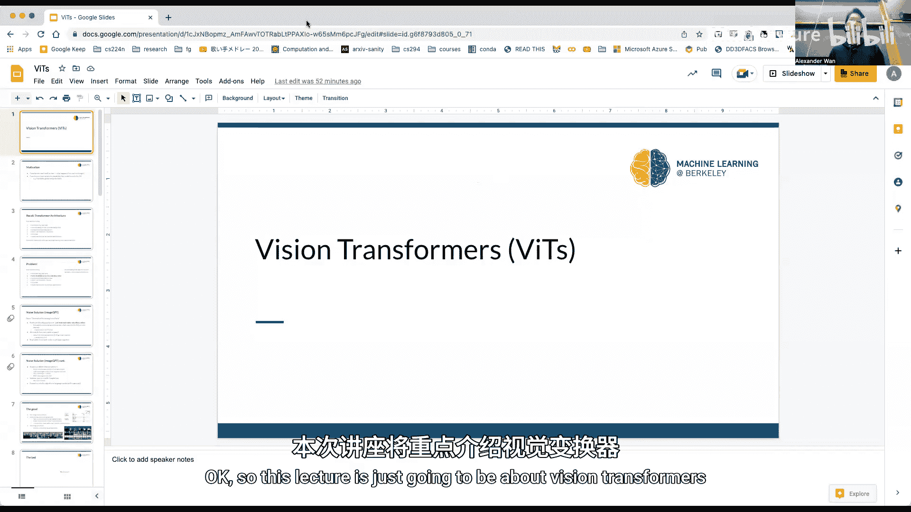
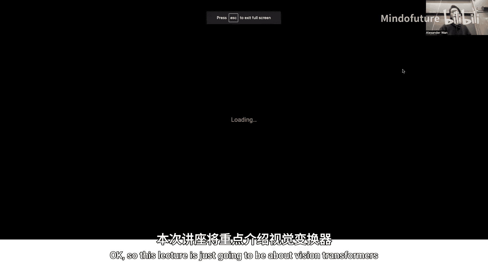
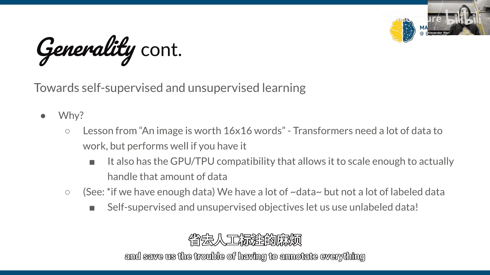
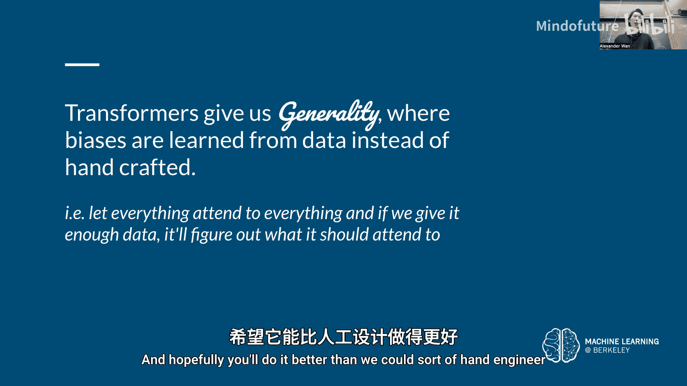
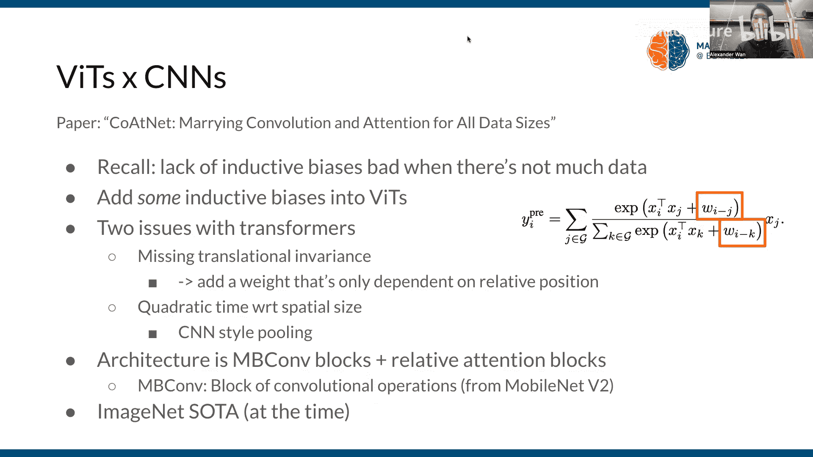

# 015：视觉Transformer模型 (Vision Transformers) 🧠

在本节课中，我们将要学习视觉Transformer模型。这是一种将最初为自然语言处理设计的Transformer架构成功应用于计算机视觉领域的方法。我们将探讨其基本原理、优势、挑战以及它如何改变我们处理图像数据的方式。

---

## 从文本到图像的迁移

上一节我们介绍了Transformer在文本领域的成功应用。本节中我们来看看如何将其核心思想迁移到图像处理上。

Transformer模型的核心是自注意力机制。在文本任务中，模型接收一系列词嵌入向量，通过自注意力层和全连接层（MLP）进行处理，并利用残差连接来构建深层网络。其目标是学习序列中元素之间的关系。

为了将这一架构应用于图像，我们需要找到图像的“令牌”表示。最直接的想法是将图像的每个像素视为一个令牌。然而，这带来了两个主要问题：
1.  **词汇表过大**：每个像素的RGB值有 `256 * 256 * 256 = 16,777,216` 种可能，这会导致嵌入表过于庞大。
2.  **计算复杂度高**：Transformer的计算复杂度是 `O(n²)`，其中 `n` 是输入序列长度。对于一张 `256x256` 的图像，`n=65,536`，这远超典型语言模型的输入长度（如BERT的512）。

一种早期的解决方案是**图像GPT**。它通过降低颜色精度（例如使用9位色彩）来减少词汇表大小，并使用较小的图像（如 `64x64`）来降低序列长度。模型通过**自监督目标**进行预训练，即给定前 `t-1` 个像素，预测第 `t` 个像素。这种方法的优势在于能学习到强大的图像表征，可用于小样本分类任务。

---

## 更实用的方法：Vision Transformer (ViT)

为了解决图像GPT的局限性，研究者提出了更实用的Vision Transformer架构，其核心思想是“一张图像值16x16个词”。

以下是ViT的关键步骤：
1.  **图像分块**：将输入图像分割成固定大小的非重叠块（例如 `16x16` 像素）。
2.  **线性投影**：将每个图像块展平，并通过一个可学习的线性层投影到一个固定维度的嵌入向量中。这取代了在庞大词汇表中查找像素值的步骤。
3.  **添加位置嵌入**：由于Transformer本身不感知顺序，需要为每个图像块添加可学习的位置嵌入，以保留其空间信息。
4.  **添加CLS令牌**：在序列开头添加一个特殊的分类令牌（CLS token），其最终的输出表征可用于图像分类等任务。
5.  **输入Transformer编码器**：将处理后的序列输入标准的Transformer编码器进行处理。

ViT通常先在大型数据集（如JFT-3亿）上进行有监督预训练，然后在特定任务（如ImageNet）上进行微调。这种方法在取得优异性能的同时，计算效率也显著高于之前的卷积神经网络。

---

## 归纳偏置：CNN vs. ViT

归纳偏置是模型因架构选择而做出的假设。理解CNN和ViT的归纳偏置差异至关重要。

**卷积神经网络 (CNN) 的归纳偏置：**
*   **局部性**：卷积核只处理局部邻域内的像素，认为邻近特征更相关。
*   **二维邻域结构**：使用二维卷积核，假设输入具有空间网格结构。
*   **平移等变性**：相同的权重在图像的不同位置滑动应用，意味着模型对物体的平移具有一定不变性。

**视觉Transformer (ViT) 的归纳偏置：**
*   **图像分块**：假设图像可以分割成块进行处理。
*   **位置嵌入**：通过可学习的位置编码来引入空间信息。
*   **更少的假设**：总体而言，ViT的架构假设更少，它没有内置的局部性或平移等变性，这些特性需要从数据中学习。

这种差异导致了一个关键现象：**数据量依赖**。当训练数据较少时，CNN凭借其强大的归纳偏置通常表现更好。而当拥有海量数据时，ViT能够学习到比手工设计的偏置更优的数据表征，从而超越CNN。

---

## ViT的优势与挑战

ViT架构带来了几个显著优势：

1.  **全局感受野**：从第一层开始，每个令牌（图像块）就能通过自注意力机制与图像中任何其他令牌交互。这与CNN形成对比，CNN需要堆叠很多层才能融合 distant 的信息。
2.  **可扩展性**：Transformer主要由矩阵乘法构成，能极其高效地利用GPU/TPU等硬件，使得模型能够轻松扩展到数十亿参数。
3.  **可解释性**：通过可视化注意力权重，我们可以观察模型在关注图像的哪些部分，这提供了一定的模型透明度。

然而，ViT也面临一些挑战：
*   **需要大量数据**：缺乏强归纳偏置意味着需要海量数据才能充分训练。
*   **计算复杂度**：`O(n²)` 的复杂度在处理高分辨率图像时仍是负担。
*   **细粒度信息丢失**：将图像分割成块可能会丢失精细的细节，对需要像素级预测的任务（如分割）构成挑战。

---

## 实际应用与未来方向

ViT及其变体已成为计算机视觉的主流架构。在ImageNet等基准测试的排行榜上，排名靠前的模型大多是基于ViT的，并且参数量巨大（十亿级别），依赖海量数据进行预训练。

为了克服ViT的局限性，研究者探索了多种改进方向：

以下是几种有前景的混合或改进架构：
*   **自监督ViT**：如DINO模型，通过自监督学习在无标签数据上预训练ViT，学习到的表征能很好地捕捉物体边界和场景布局。
*   **引入卷积偏置**：在ViT中显式加入相对位置编码，或设计**卷积与Transformer的混合架构**。例如，在浅层使用CNN进行下采样和局部特征提取，在深层使用Transformer进行全局关系建模，从而在效率和性能间取得平衡。

---

## 总结与展望

本节课中我们一起学习了视觉Transformer模型。我们从如何将文本Transformer迁移到图像开始，深入探讨了ViT的核心架构、它与CNN在归纳偏置上的根本区别，以及由此带来的优势和挑战。

ViT代表了向**更通用模型**的发展趋势：减少手工设计的归纳偏置，让模型从数据中自行学习最佳的表征方式。同时，**自监督学习**范式使得我们能够利用互联网上无穷无尽的未标注数据，与Transformer强大的可扩展性相结合，正推动着计算机视觉不断向前发展。

未来的方向可能包括设计更高效的注意力机制、更好地融合不同模态（如图像与文本），以及探索在有限数据下更有效的训练策略。视觉Transformer不仅是一个强大的工具，也为我们思考如何构建更通用、更智能的机器学习系统提供了新的视角。