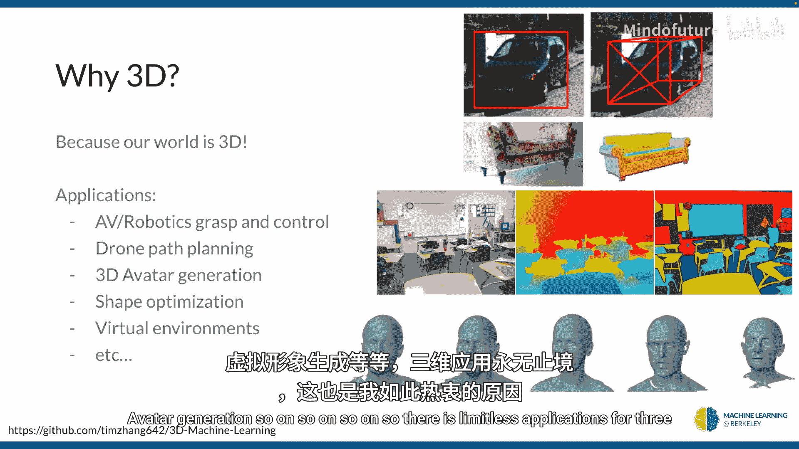
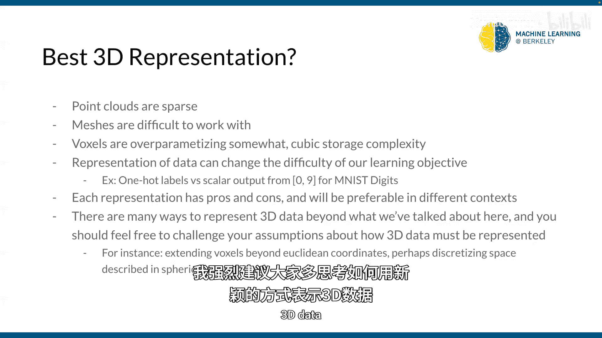
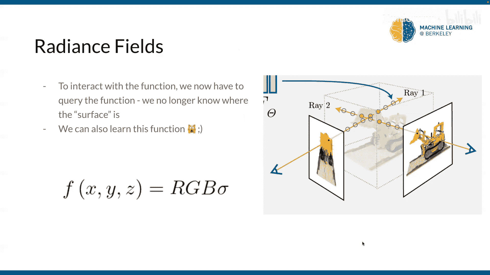

# 017：3D视觉概览（第一部分） 🎥

在本节课中，我们将要学习三维视觉的基础知识。我们将探讨为什么需要从2D转向3D，介绍几种常见的3D数据表示方法，并了解如何将这些3D表示渲染成2D图像。理解这些概念是处理自动驾驶、元宇宙、3D内容生成等应用的关键。

---

## 为什么需要3D视觉？ 🌍

我们之前讨论了大量关于2D计算机视觉的内容。这很酷，也很有意义，因为我们的眼睛看到的也是三维的。我们只是基于双眼视觉和我们已知的物体知识来“猜测”三维结构。正因如此，有时我们会看到一些2D图像（例如M.C.埃舍尔的画作），它们会扰乱我们的思维，因为我们试图猜测其三维结构，但它实际上只是一张平面的2D图像，所以结构不合理。

我们需要转向三维，是为了防止这种情况，我们需要添加一个在物理上合理的结构。这样做的根本原因在于，我们的整个世界是三维的。因此，三维视觉的应用几乎是无限的：从元宇宙、自动驾驶（需要知道周围车辆的三维位置）、形状优化、虚拟环境到增强现实生成等等。三维视觉的应用前景广阔，这也是它如此吸引人的原因。

---

## 3D数据表示方法 🧱

上一节我们介绍了转向3D的必要性，本节中我们来看看如何具体表示3D数据。与图像不同，我们需要新的数据结构。以下是一些常见的3D数据表示方法：

*   **2.5D (RGB-D)**：这是在2D图像的基础上，为每个像素额外存储一个深度值，表示物体到相机的距离。这可以通过立体视觉或手机上的深度传感器（如ToF）获得。从机器学习的角度看，这比较直接，任何处理RGB图像的CNN都可以扩展为处理四个输入通道（RGB + D）。

*   **点云**：点云是一组三维空间中的点。激光雷达或雷达等传感器会输出点云。它们向各个方向发射光束并接收返回信号，通过测量光束的方向和飞行时间来确定空间中点的位置。点云能大致告诉我们物体表面在哪里，但它通常是稀疏的，我们不知道点与点之间的区域是什么。

*   **网格**：为了解决点云的稀疏性问题，我们通常假设点云足够密集，然后通过连接这些点来构建网格。这类似于函数插值：用线段连接相邻的点，再用三角形填充这些线段之间的区域，从而形成一个由顶点、边和面组成的表面。网格是平滑表面的良好表示，但对于具有高频细节的粗糙表面，则需要极高的分辨率，导致存储开销巨大。此外，由于网格本质上是图结构，目前在机器学习中处理起来仍有一定挑战。

*   **体素网格**：体素是像素在三维空间中的类比，可以想象成乐高积木或《我的世界》中的方块。体素网格将三维空间离散化为一个个小立方体。每个体素可以存储属性，如颜色和密度（用于表示半透明物体）。其存储开销是立方的（O(n³)），因此在高分辨率下计算成本很高。一个优点是，我们可以将2D卷积自然地扩展到3D，使用3D卷积核在体素网格上滑动。

*   **辐射场**：这是一种连续的表示方法。它将3D空间视为一个函数 **F**，该函数接收空间坐标 **(x, y, z)** 作为输入，并输出该点的颜色 **(RGB)** 和密度 **(σ)**。可以将其理解为连续的体素表示。这种表示法非常灵活，能捕捉高频细节，但它失去了明确的“表面”概念，这使得渲染过程变得不同。

---

## 从3D到2D：渲染基础 🎨

上一节我们介绍了各种3D表示方法，本节中我们来看看如何将这些3D数据“绘制”成我们能看到的2D图像，这个过程称为渲染。理解渲染需要先了解成像的基本模型。

一个常用的教学模型是**针孔相机模型**。它假设光线向所有方向传播。为了形成清晰的图像，相机需要用一个小孔来过滤光线，使得空间中的每个点只对应图像中的一个点。在计算机图形学中，为了高效模拟，我们通常只考虑那些最终到达相机的光线。

以下是两种主要的渲染方式：

*   **前向光线投射**：从场景中的点（如点云中的每个点）出发，向相机原点（针孔）发射光线，计算这些光线落在图像平面（像素网格）上的哪个位置。这种方法适用于渲染点云。

*   **后向光线投射（光线追踪）**：从相机原点出发，穿过图像平面上的每个像素，向场景发射光线。我们寻找这条光线与场景中物体的**第一个交点**，并将该交点的颜色作为该像素的颜色。这种方法适用于渲染网格和体素，因为我们能明确计算出光线与表面的交点。对于半透明物体，则需要考虑光线路径上多个交点的颜色和密度进行混合。

---

## 渲染辐射场：体渲染简介 🌫️

对于辐射场这种没有明确表面的连续表示，我们无法直接计算光线交点。那么，如何渲染它呢？答案是**沿光线采样**。

在后向光线追踪中，对于从相机出发穿过某个像素的光线，我们在这条光线上按一定间隔选取 **N** 个样本点。将每个样本点的坐标 **(x, y, z)** 输入辐射场函数 **F**，得到该点的颜色 **c_i** 和密度 **σ_i**。

接下来的问题是如何将这 **N** 个样本点的信息融合成该像素的最终颜色。这通过**体渲染**公式来完成。其核心思想是：一个样本点对最终颜色的贡献，取决于它自身的颜色和密度，以及它前面所有物体（样本点）的累积遮挡程度（透射率）。高密度且前方遮挡少的点贡献大；低密度或被严重遮挡的点贡献小。

体渲染的数学表达是一个积分，在实际计算中我们用离散采样求和来近似：
`C(r) = Σ (T_i * α_i * c_i)`
其中，`T_i` 是累积透射率（表示光线到达第 `i` 个样本点前未被阻挡的概率），`α_i` 是由密度 `σ_i` 计算出的不透明度。

---

## 可微渲染 🤖

最后，一个对机器学习至关重要的概念是**可微渲染**。我们讨论的几乎所有渲染过程（网格、体素、辐射场）在数学上都是可微分的。这意味着我们可以计算渲染图像相对于3D场景参数（如顶点位置、体素颜色、神经网络权重）的梯度。

这一点非常重要，因为它允许我们使用梯度下降来优化3D场景。例如，我们可以让一个神经网络表示的辐射场 **F**，通过比较其渲染出的图像与真实照片的差异，并反向传播梯度来调整 **F** 的参数，从而让神经网络学会从2D图像中重建3D场景。这就是下一讲将要深入的核心内容。

需要注意的是，对于有明确表面的表示（如网格），梯度主要来自于**可见的表面**。而对于辐射场，由于每个采样点都可能对最终像素颜色有贡献，梯度信息更为丰富。

---

本节课中我们一起学习了3D视觉的入门知识。我们了解了为什么需要研究3D，探索了点云、网格、体素和辐射场等几种核心的3D数据表示方法，并学习了如何通过前向/后向光线投射将这些表示渲染成2D图像。我们还特别介绍了渲染无表面辐射场所需的体渲染技术，并提到了可微渲染这一关键概念，它为通过2D图像学习3D结构打开了大门。下一讲，我们将深入探讨如何利用这些技术，特别是辐射场和可微渲染，来从图像中重建和生成3D内容。