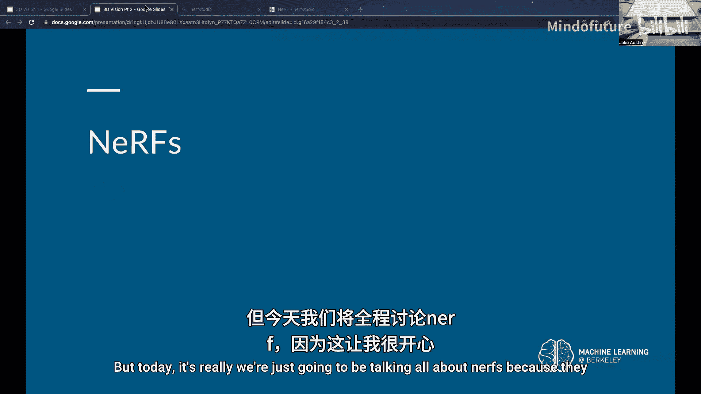
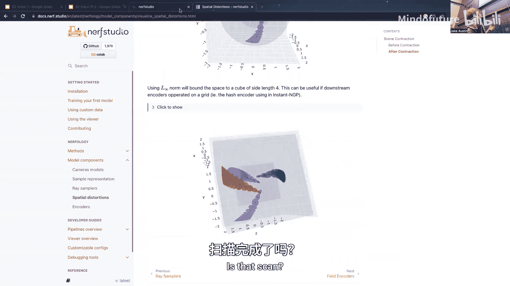

# 018：3D视觉概览（第二部分） 📚




在本节课中，我们将深入学习神经辐射场（NeRF）的核心原理、架构细节及其在3D视觉中的应用。我们将从基本概念回顾开始，逐步深入到网络结构、训练技巧，并通过实际演示来理解其工作原理。

---

## 神经辐射场（NeRF）核心概念回顾 🧠

上一节我们介绍了3D视觉的基本问题，本节中我们来看看神经辐射场（NeRF）的具体实现。

神经辐射场的基本思想是使用一个“黑盒”函数。该函数接收空间中的一个位置坐标 `(x, y, z)`，并输出该点的颜色 `(r, g, b)` 和密度 `σ`。如果我们想从特定视角观察一个物体，我们会从相机位置发射出许多光线，并查询沿这些光线分布的各个点的颜色和密度，这个过程称为“渲染”。

**渲染公式**可以概括为：最终像素颜色是沿光线所有采样点颜色的加权平均。权重与采样点的密度成正比，但与光线到达该点之前所经过的物质总量成反比。

这意味着，离相机最近的物体对最终颜色的贡献最大。即使远处的点密度很高，如果它前面有很多其他物质，其权重也会非常小。

---

## 为什么需要神经辐射场？ 🤔

一个自然的问题是：既然深度学习可以直接从图像生成新视图，为什么还需要学习一个中间的3D表示（如NeRF）？

答案是**形状一致性**。如果直接训练一个端到端的网络来预测新视角的图像，网络可能会为了匹配每个单独的2D图像而生成不一致的3D形状。这会导致在测试时，从不同视角生成的物体形状发生扭曲或变化。

通过NeRF这个“瓶颈”，我们强制模型学习一个统一的3D场景表示。这保证了无论从哪个新视角渲染，生成的图像都基于同一个一致的3D结构，从而得到逼真且连贯的结果。

---

## NeRF的网络架构 🏗️

现在，让我们深入看看这个“黑盒”函数内部的结构。它本质上是一个多层感知机（MLP），但有一些关键设计。

首先，我们之前说输入是 `(x, y, z)` 并输出颜色和密度，这并不完全准确。为了处理像镜面反射、高光这样的**视角相关**现象，网络还需要知道观察方向 `(θ, φ)`。因此，完整的输入是位置和视角方向的组合。

网络结构主要分为两部分：
1.  **第一部分（密度网络）**：输入位置 `(x, y, z)`，通过一系列全连接层，最终输出该点的密度 `σ`。**注意**，密度网络**不接收**视角方向，以确保几何形状与视角无关。
2.  **第二部分（颜色网络）**：输入包括视角方向 `(θ, φ)` 以及从密度网络中间层提取的特征。然后输出该点的颜色 `(r, g, b)`。这种设计允许网络在计算颜色时复用密度网络已学到的几何特征。

以下是其流程的简化表示：
```
输入: 位置 (x, y, z) + 视角方向 (θ, φ)
        ↓
[位置编码] → 密度MLP → (输出密度 σ & 中间特征)
        ↓
中间特征 + 视角方向 → 颜色MLP → (输出颜色 rgb)
```

---

## 关键技术细节 ⚙️

以下是实现高效、高质量NeRF的几个关键技术。

### 位置编码
如果直接将原始坐标 `(x, y, z)` 输入网络，模型往往只能学习到模糊、平滑的结果，难以捕捉物体表面的高频细节（如锐利边缘）。

**位置编码**通过将每个坐标值映射到一组正弦和余弦函数上，将其转换为更高维度的表示：
`γ(p) = (sin(2^0 π p), cos(2^0 π p), ..., sin(2^{L-1} π p), cos(2^{L-1} π p))`
这为网络提供了类似“二进制”的输入，使其更容易学习高频变化，从而生成清晰、锐利的边界。

### 分层采样
沿着每条光线均匀采样所有点效率很低，因为大部分空间是空的。NeRF采用**两阶段分层采样**策略：
1.  **粗采样**：首先沿光线均匀采样少量点（例如64个），通过第一个“粗”网络评估，大致确定物体可能存在的区域。
2.  **细采样**：然后，根据粗网络输出的密度分布，在物体可能存在的区域进行更密集的采样（例如128个），并将这些点输入第二个“细”网络进行精细渲染。这使网络能将更多容量专注于学习物体的细节。

### 损失函数
NeRF的训练仅依赖于2D图像的监督。损失函数是渲染得到的像素颜色与真实图像像素颜色之间的L2损失：
`L = Σ || C_c(r) - C(r) ||^2 + Σ || C_f(r) - C(r) ||^2`
其中 `C_c(r)` 和 `C_f(r)` 分别是粗网络和细网络渲染的颜色，`C(r)` 是真实颜色。

一个关键点是，**我们从未直接对密度值 `σ` 进行监督**。网络完全通过“要使渲染颜色正确，密度必须如何分布”这一间接信号来学习正确的3D几何。这之所以可行，是因为从多个视角穿过场景中同一点的许多光线提供了足够的约束，使得学习一致的密度场成为可能。

---

## 处理无界场景与演示 🌅

对于背景延伸到无限远的场景（如户外风景），直接建模整个空间非常困难。NeRF的变体通常采用**空间收缩**技术，例如将无限远的点通过一个连续函数映射到一个有限的球体或立方体内。这确保了网络输入值的范围是可控的，同时仍能表示遥远的背景。

为了直观理解NeRF的能力，我们可以观察其重建结果。与仅使用网格的方法相比，NeRF能够逼真地渲染复杂的材质效果，如半透明、烟雾和镜面高光。训练后的模型可以从任意新视角生成连贯且细节丰富的图像。

---



## 总结 📝

本节课我们一起深入探讨了神经辐射场（NeRF）。我们从其核心渲染原理出发，解释了为什么需要学习一个3D场景表示来保证多视角一致性。我们剖析了NeRF的网络架构，包括分离的密度和颜色MLP，以及关键的视角依赖输入。我们还介绍了位置编码、分层采样等关键技术，这些技术共同使得NeRF能够从多视角2D图像中高效、高质地学习3D场景。最后，我们了解了NeRF在处理无界场景时的扩展及其强大的渲染能力。NeRF为3D视觉提供了一种灵活而强大的表示方法，推动了该领域的快速发展。