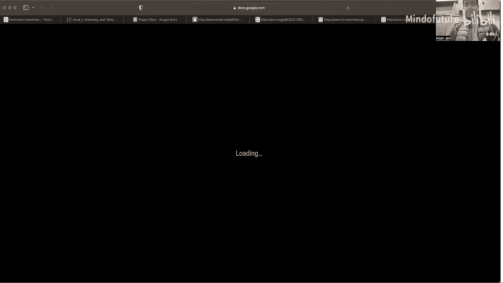

# 019：高级视觉预训练 🚀

在本节课中，我们将要学习计算机视觉中的自监督预训练方法。我们将回顾预训练和迁移学习的基本概念，然后深入探讨两种主流的自监督学习方法：对比学习和图像重建方法。课程将涵盖MoCo、SimCLR、BYOL、MAE等具体模型，并解释它们如何在不使用人工标注的情况下学习到强大的视觉表征。

---

## 回顾：预训练与迁移学习

上一节我们介绍了预训练的基本概念，本节中我们来看看其核心思想。

深度学习本质上是表征学习。其目标是提取数据中有意义的表征，以解决特定任务。

我们可以将一个网络学到的表征迁移到另一个网络中，这个过程称为迁移学习。实现方式有多种：
*   冻结预训练网络，在其输出的嵌入之上构建新网络。
*   直接对预训练网络进行微调。

预训练网络是指在大型数据集上预先训练好的网络。使用迁移学习的原因是，大型且多样的数据可以产生更好、更通用的表征。当我们只有小数据集时，可以借助在大数据集上预训练的模型来获得高质量的表征。

---

## 自监督学习简介

上一节我们回顾了有监督和无监督学习，本节中我们来看看自监督学习。

自监督学习是无监督学习的一个分支。其核心思想是：虽然没有人工标注的标签，但我们可以从数据本身创建标签。不同的自监督学习方法，其区别就在于创建这些“标签”的方式。

一个常见的例子是：在句子中随机掩码掉一些单词，让模型根据剩余部分预测被掩码的单词。模型接收整个句子作为输入，并从中学习语言结构。

有研究者将智能比作一个蛋糕：无监督学习（尤其是自监督学习）构成了蛋糕的主体，因为它从数据中获取了最多的信息；而有监督学习和强化学习则更像是蛋糕上的糖霜和樱桃。

---

## 对比学习

自监督学习的一种重要范式是对比学习。上一节我们了解了如何从数据中创建标签，本节中我们来看看对比学习如何定义“相似性”。

对比学习的目标是优化“相似性”。它试图学习一个低维的嵌入空间，在这个空间中，被认为是相似的对象彼此靠近，而不相似的对象则相距较远。通过这种方式对对象进行聚类，模型必须学习到对象本身有意义的特征。

以下是定义相似性的一种常见方式：同一张图像经过不同数据增强（如裁剪、颜色抖动）得到的两个视图被认为是相似的（正样本），而来自不同图像的两个视图则被认为是不相似的（负样本）。

### 对比损失函数

为了训练网络学习这种嵌入空间，我们需要使用特定的损失函数。以下是两种重要的对比损失：

**1. 三元组损失**
该损失函数旨在使输入样本 `x` 的嵌入与正样本 `x+` 的嵌入尽可能接近，同时与负样本 `x-` 的嵌入尽可能远离。
`L = max(0, ||f(x) - f(x+)||² - ||f(x) - f(x-)||² + margin)`

**2. 多负样本对比损失（如InfoNCE损失）**
这种损失将问题视为一个分类问题：给定一个上下文向量 `c`（如图像的一个视图），目标是从一组样本中识别出正样本 `x+`（如图像的另一个视图），而将所有其他样本 `{x-}` 视为负样本。其形式类似于交叉熵损失。
`L = -log[exp(sim(c, x+)/τ) / Σ_{i} exp(sim(c, x_i)/τ)]`
其中，`sim` 是相似性函数（如余弦相似度），`τ` 是温度超参数。

---

## 具体对比学习方法

以下是几种重要的对比学习方法。

### MoCo（动量对比）

MoCo 将对比学习定义为一个可微分的字典查找任务。它维护两个网络：一个查询编码器和一个键编码器。查询编码器处理查询样本（如图像的一个视图），键编码器处理键样本（如图像库）。目标是使查询与其对应的正键（同一图像的另一视图）相似，而与所有其他键（负样本）不相似。

为了使用大量负样本同时避免巨大的计算开销，MoCo 引入了两个关键技术：
1.  **动态字典队列**：维护一个先进先出的队列来存储负样本的键嵌入，从而可以重用历史批次的计算结果。
2.  **动量更新**：键编码器的参数不是通过梯度直接更新，而是作为查询编码器参数的移动平均进行更新。这确保了字典中的键嵌入虽然来自“旧”的编码器，但变化不会过于剧烈，保持了训练的一致性。

### SimCLR（一个简单的对比学习框架）

SimCLR 简化了对比学习的流程。它使用同一个编码器处理同一图像的两个增强视图，然后通过一个额外的投影头（小型MLP）将编码映射到另一个空间，再在此空间计算对比损失（InfoNCE损失）。

SimCLR 的关键发现包括：
*   在编码器后添加投影头可以显著提升学到的表征质量。
*   引入温度参数 `τ` 有助于优化。
*   某些数据增强组合（如颜色失真+裁剪）效果更好。
*   使用更大的批大小和更长的训练时间可以获得更好的性能。

SimCLR 是首个在ImageNet线性评估协议上超越有监督基线模型的自监督方法。

### BYOL（Bootstrap Your Own Latent）

BYOL 是一种非对比式的自监督方法。它同样使用两个网络（在线网络和目标网络），并处理同一图像的两个增强视图。但它的目标不是区分正负样本，而是直接让在线网络预测目标网络的输出。

其核心是“自举”思想：目标网络提供回归目标，其参数是在线网络参数的移动平均。在线网络通过最小化预测值与目标值之间的均方误差来学习。BYOL 不需要负样本，对批大小和数据增强的选择更为鲁棒，且性能优异。其成功的原因在理论上是研究热点。

---

## 图像重建方法

上一节我们探讨了对比学习方法，本节中我们来看看另一大类自监督方法：图像重建。这类方法通过破坏输入数据（如添加噪声、掩码部分内容），然后训练模型重建原始数据来学习表征。

### 去噪自编码器

去噪自编码器向输入图像添加噪声，然后训练一个编码器-解码器网络来重建原始的无噪声图像。其直觉是人类能够识别部分遮挡或损坏的图像。通过完成这个更具挑战性的任务，模型被迫学习图像中更鲁棒和本质的特征。

### 上下文编码器

上下文编码器将图像的一部分区域完全掩码掉（通常是一个大的连续块），然后训练模型根据周围的上下文信息来预测被掩码的区域。单纯使用像素级L2损失会导致重建结果模糊。因此，该方法结合了L2重建损失和对抗性损失（使用一个判别器），以鼓励生成既在像素上接近又看起来逼真的内容。

### MAE（掩码自编码器）

MAE 是近年来非常成功的图像重建方法。它使用Vision Transformer作为主干网络。其流程如下：
1.  将图像分割成块，并随机掩码掉很大比例（例如75%）的块。
2.  将未被掩码的块送入ViT编码器。
3.  在编码器的输出中，为每个被掩码的位置添加一个可学习的“[MASK]”令牌。
4.  将这个包含可见块嵌入和掩码令牌的序列送入一个轻量级Transformer解码器。
5.  解码器的目标是根据编码后的上下文信息，重建出被掩码的原始图像块（使用像素级损失，如MSE）。

MAE 的成功得益于：
*   **高掩码率**：使重建任务极具挑战性，迫使模型学习高级语义和全局信息。
*   **非对称设计**：编码器只处理可见块，大大减少了计算量；轻量级解码器用于重建。
*   **可扩展性**：模型能够从大规模数据和更长训练中持续受益。

MAE 在ImageNet微调任务上取得了当时最好的结果，并在多种下游任务（如目标检测、分割）和鲁棒性基准测试上表现出色。

---

## 方法比较与结合

对比学习和图像重建方法各有优势。评估时通常采用两种协议：
*   **线性探测**：冻结预训练编码器，仅训练一个线性分类器。
*   **微调**：允许在整个预训练模型上进行端到端微调。

实验发现，对比学习方法通常在**线性探测**上表现更好，而MAE等重建方法在**微调**后性能更优。

一个自然的想法是结合两者的优势。例如，**CMAE**模型同时进行对比学习、掩码图像重建和去噪预测。其损失函数是这三项损失的加权和。结果表明，这种结合了多种自监督信号的方法，在线性探测和微调协议上都取得了领先的性能。

---

## 总结与展望

本节课中我们一起学习了计算机视觉中的高级自监督预训练方法。

我们首先回顾了预训练和迁移学习的概念。然后，我们深入探讨了两大类自监督方法：
1.  **对比学习**：如MoCo、SimCLR和BYOL，通过拉近相似样本、推远不相似样本来学习表征。
2.  **图像重建**：如去噪自编码器、上下文编码器和MAE，通过破坏并重建输入数据来学习表征。

我们还比较了不同方法的特性，并看到了结合多种自监督信号的趋势（如CMAE）。

自监督学习是一个快速发展的研究领域，它使我们能够利用海量无标注数据学习通用视觉表征，为下游任务提供强大的基础模型。除了本节课介绍的内容，还有更多相关模型和目标函数等待探索。