# 020：图像风格化 🎨

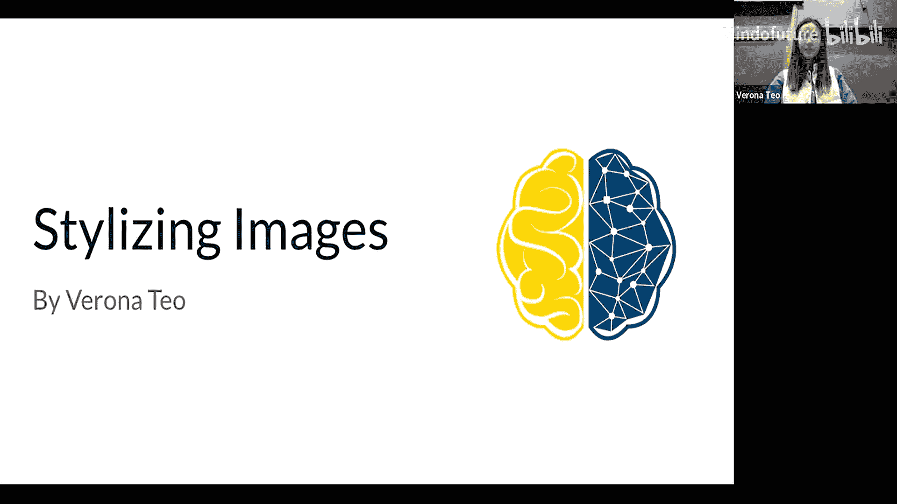

在本节课中，我们将学习图像风格化的核心概念，特别是图像到图像的翻译技术。我们将深入探讨神经风格迁移的原理，并介绍几种利用生成对抗网络（GAN）架构的模型，以及其他处理图像翻译任务的方法。

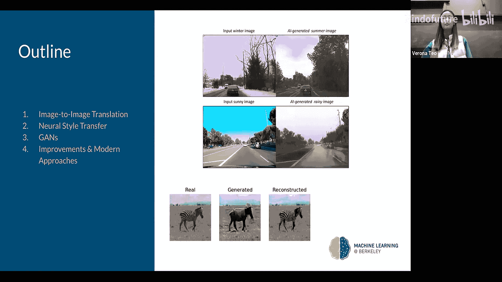

## 什么是图像到图像翻译？

上一节我们介绍了课程主题，本节中我们来看看图像到图像翻译的具体定义。

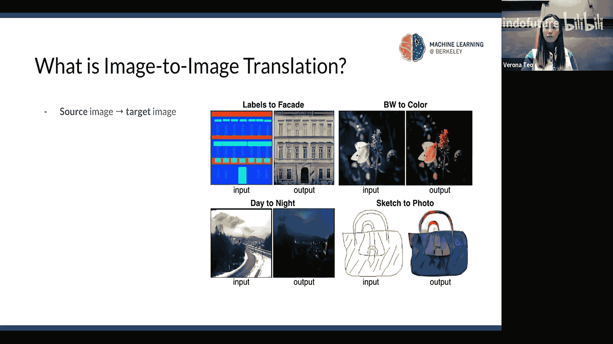

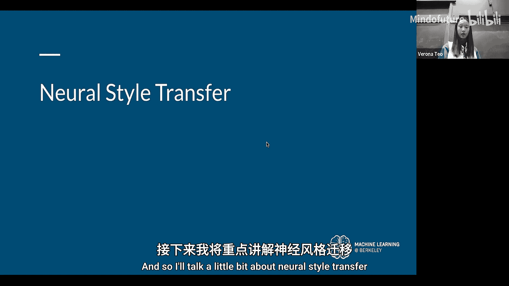

图像到图像翻译的一般任务是，将一个源数据集中的图像，转换到另一个目标域中的对应图像。其核心思想是保留特定图像的内容，但可能改变其风格以匹配另一张图像。这就是我们所说的风格迁移。

以下是几个相关的常见任务示例：
*   **图像合成**：从无到有或根据条件生成图像。
*   **图像着色**：将黑白图像转换为彩色图像。
*   **图像修复**：修复受损的图像。

## 神经风格迁移

了解了图像翻译的基本概念后，本节我们将聚焦于一个具体任务：神经风格迁移。

核心问题是：我们能否基于另一张图像的风格来创建新图像？答案是肯定的，这被称为神经风格迁移。你可以将其视为图像翻译中的一个特定优化任务。

它通常被视为一种通用的优化技术，用于将两张图像融合在一起。整个过程涉及三个主要输入：
1.  **内容图像**：你想要保留其主体内容和形态的图像（例如，一只狗）。
2.  **风格参考图像**：你希望生成图像所借鉴的艺术风格来源。
3.  **生成图像**：最终输出的、融合了内容与风格的新图像。

### 实现原理

那么，我们如何具体实现它呢？基本思路是优化输出图像（即生成图像），使其在内容上匹配内容图像，在风格上匹配风格参考图像。

我们通常使用卷积神经网络来从内容和风格图像中提取相关信息。在原始的神经风格迁移论文中，他们使用了一个非常深的典型分类CNN（VGG19）来完成这项工作。

整个过程基于我们之前讨论过的CNN原理。你有一个预训练的CNN，并添加了一些额外的损失函数来实现风格迁移。

### 网络结构与损失函数

接下来，我们看看网络是如何工作的，以及如何定义损失函数。

同样，你有三个主要输入：内容图像、风格参考图像和待优化的生成图像。

在CNN中，最初的几层激活输出对应的是低级特征（如边缘和纹理），随着网络加深，特征逐渐抽象为更高级的特征（如物体部件）。神经风格迁移的关键在于，我们选择CNN的某些中间层来同时表示图像的风格和内容，并从中获取中间特征图，然后基于此计算损失。

由于涉及内容和风格两部分，我们的损失函数也略有不同。

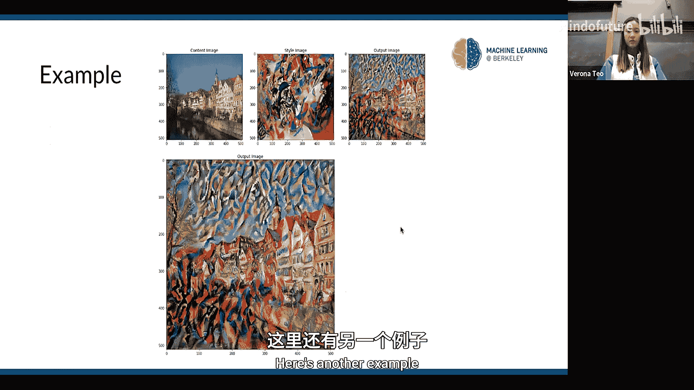

*   **内容损失**：相对简单。我们获取中间层的输出，然后计算生成图像与内容图像在这些特征上的**欧几里得距离**。公式可以表示为：
    `L_content = 1/2 * Σ (F[l] - P[l])^2`
    其中 `F[l]` 是生成图像在第 `l` 层的特征图，`P[l]` 是内容图像在同一层的特征图。

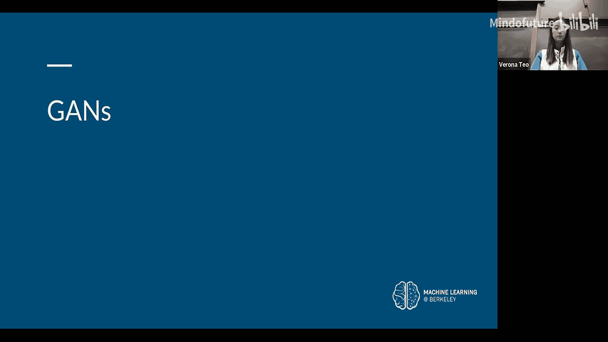

*   **风格损失**：更为复杂一些。它引入了一个称为**格拉姆矩阵**的概念。其思想是，通过计算不同特征图之间的相关性来理解图像的风格。格拉姆矩阵 `G` 可以通过计算特征图向量之间的点积得到，对于某一层，其元素 `G[i][j]` 表示第 `i` 个特征图与第 `j` 个特征图之间的内积。风格损失则是计算生成图像与风格参考图像在各层格拉姆矩阵之间的差异（通常也是欧几里得距离），并跨层求和。

得到内容损失和风格损失后，我们将它们加权相加，得到总损失。然后使用反向传播和优化器（如Adam）来最小化这个总损失，从而迭代更新生成图像，使其同时具备目标内容和目标风格。

## 基于GAN的图像翻译模型

在深入探讨了神经风格迁移后，本节我们来看看如何利用生成对抗网络（GAN）来完成更广泛的图像翻译任务。

### GAN与条件GAN回顾

首先简要回顾一下GAN的基本架构。一个基本的GAN包含两个部分：
*   **判别器**：一个基本的分类卷积神经网络，用于判断输入的图像是真实的还是生成器生成的。
*   **生成器**：接收一个随机噪声向量，通过上采样等操作生成新的图像实例。

条件GAN是GAN的一种扩展，它学习的是从输入图像到输出图像的映射。生成器不仅接收随机噪声，还接收一些附加条件信息（如输入图像、类别标签等）。这使得它非常适合于图像到图像翻译任务，因为我们可以将源图像作为条件输入，来生成对应的目标图像。

### Pix2Pix模型

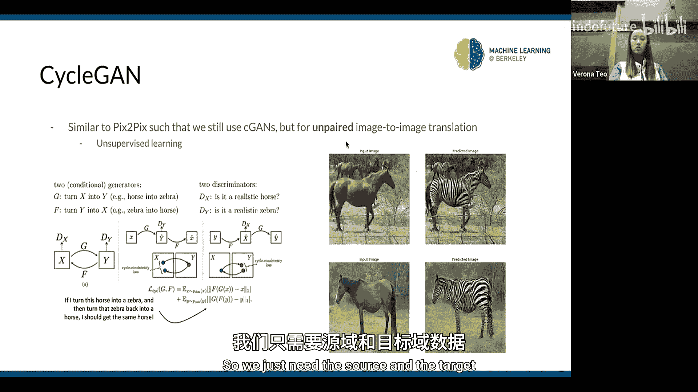

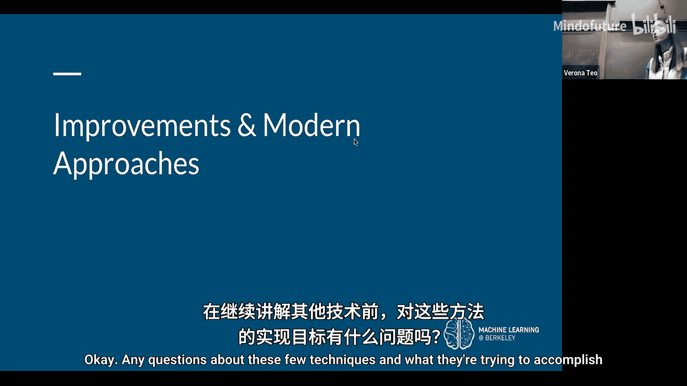

Pix2Pix模型就是一个使用条件GAN进行图像翻译的经典例子。然而，Pix2Pix的一个限制在于它需要**成对的数据**进行训练，即源域和目标域中严格对应的图像对（例如，同一建筑的素描图和真实照片）。这种数据有时难以获取。

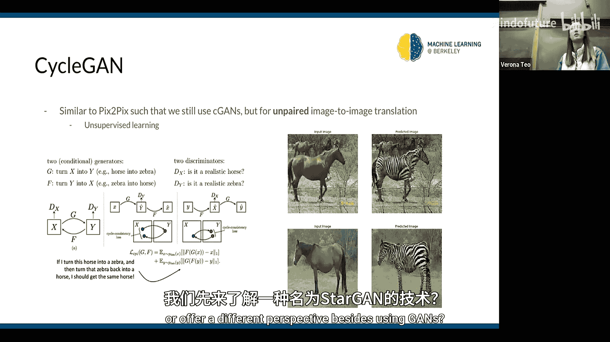

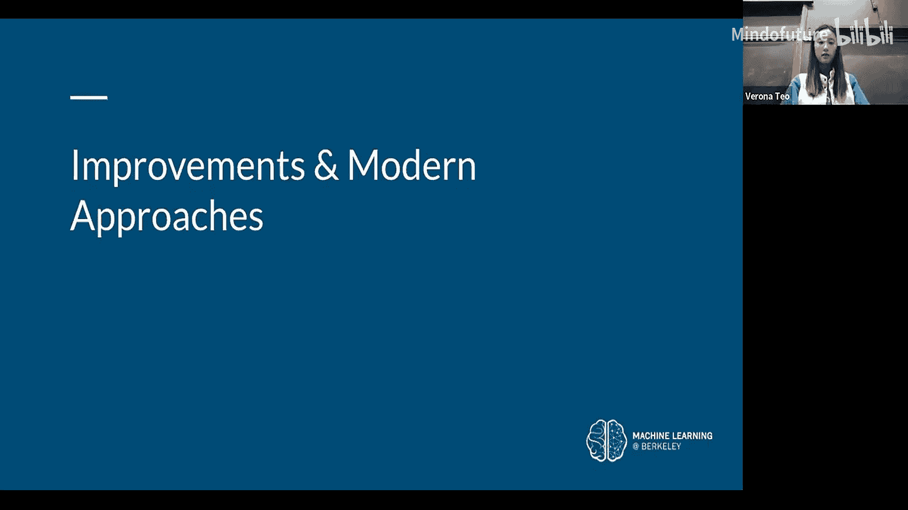

### CycleGAN模型

为了解决成对数据的需求，CycleGAN被提出。它同样使用条件GAN的思想，但用于**非成对的图像数据**。其核心创新是**循环一致性损失**：将一个图像从源域转换到目标域后，再转换回源域，应该能得到与原始图像相近的结果。这使得我们只需要两个独立的图像集合（例如，一堆马的照片和一堆斑马的照片），而无需它们一一对应，从而大大增加了灵活性。

## 高级图像翻译技术

在掌握了基础模型后，本节我们探讨一些更高级的、旨在解决特定局限性的图像翻译技术。

### StarGAN：多域图像翻译

之前的模型通常专注于两个域之间的转换。StarGAN则旨在解决**多域图像翻译**问题。它允许在多个属性域之间进行转换（例如，同时改变人像的发色、年龄、肤色等），而无需为每一对属性组合都训练一个单独的生成器。其关键思想是，生成器同时接收输入图像和**目标域信息**（例如，以二进制或one-hot编码表示的属性标签），从而学习一个灵活的、可控制多种属性的翻译模型。

### 多模态输出与BicycleGAN

Pix2Pix和CycleGAN等模型的一个局限是，对于给定的输入，它们往往只产生**单一或少数几种**输出，这被称为**模式崩溃**问题。但在现实中，一个输入可能对应多种合理输出（例如，一张夜景图可以对应多种不同风格的白昼渲染）。

BicycleGAN等模型的目标就是实现**多模态的无监督图像翻译**，即生成**多样且准确**的多种输出。其思路是，在条件GAN中，不仅将输入图像作为条件，还引入一个**低维的潜在编码**。生成器接收输入图像和一个随机采样的潜在编码，从而产生一个随机采样的输出。同时，模型还学习一个编码器，将输出图像映射回潜在空间，以确保不同的潜在码能产生不同的风格，从而鼓励输出的多样性。

### 未来方向：结合视觉Transformer

最后，我们简要展望一下未来方向。目前，图像翻译架构主要基于传统的CNN和GAN。而视觉Transformer在多项视觉任务中表现出色。一个自然的问题是：能否将Transformer的优势应用于图像生成和翻译任务？目前已有一些研究尝试将视觉Transformer与GAN结合（例如，TransGAN），以应对图像到图像翻译的挑战，尽管这比使用CNN更为复杂。

## 总结

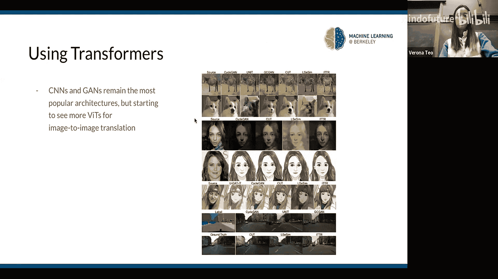

本节课中，我们一起学习了图像风格化的核心——图像到图像翻译。我们从神经风格迁移的原理入手，了解了如何通过优化内容损失和风格损失来融合图像。接着，我们回顾了GAN和条件GAN，并介绍了Pix2Pix（需要成对数据）和CycleGAN（无需成对数据）这两种重要模型。最后，我们探讨了更高级的技术，如StarGAN（多域翻译）和BicycleGAN（多模态输出），并简要提及了结合视觉Transformer的未来趋势。这些技术共同构成了将图像内容与风格分离并重组的强大工具箱。