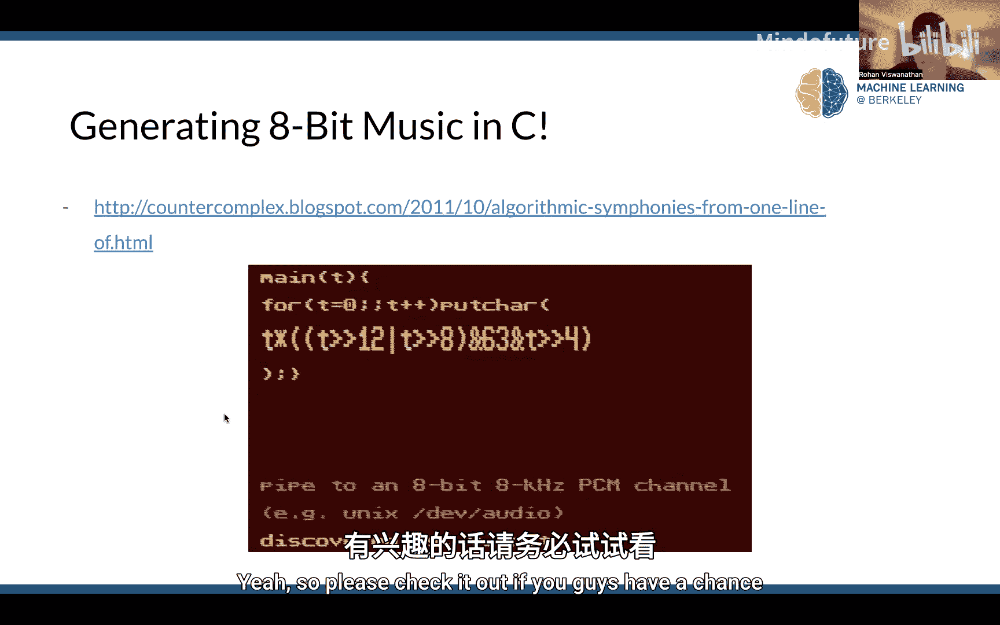
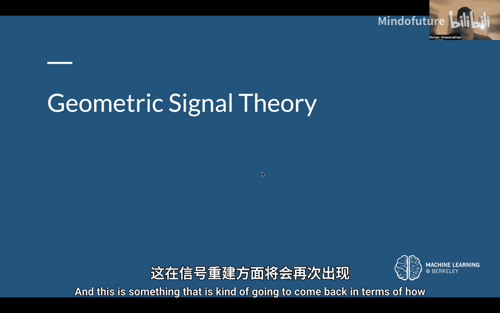
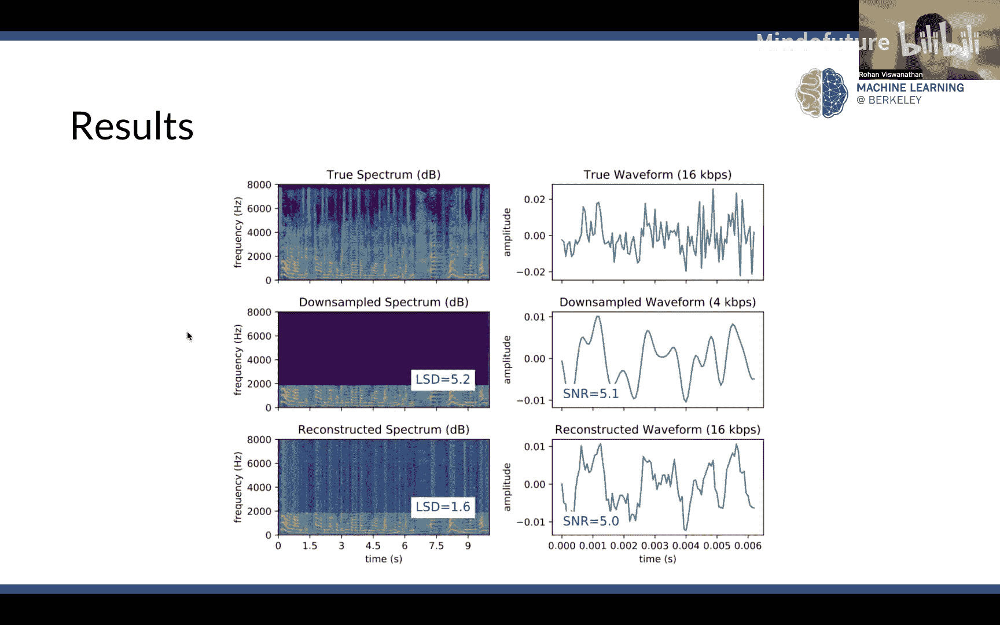
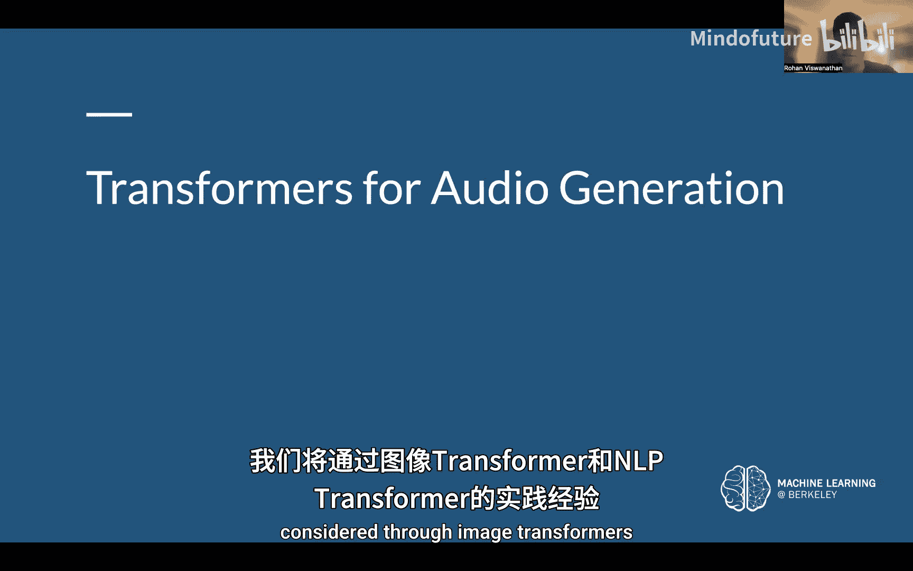
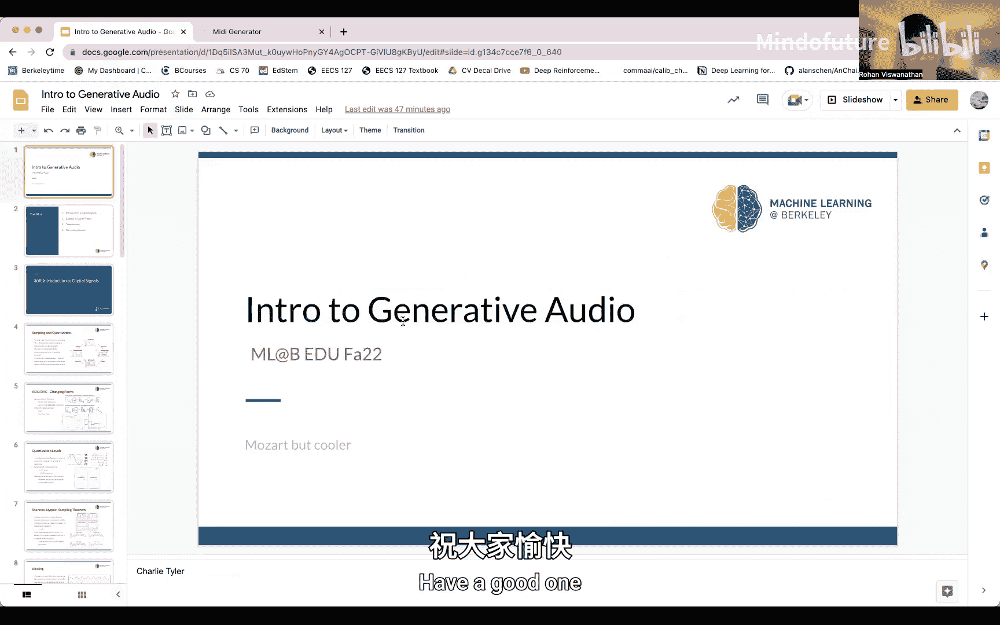

# 021：生成音频入门 🎵

在本节课中，我们将学习生成式音频的基础知识。虽然这与之前讨论的计算机视觉主题有所不同，但我们会将其与我们熟悉的模型（如去卷积和Transformer）联系起来，探讨它们如何用于音频生成。课程将首先介绍一些信号理论，然后过渡到我们更熟悉的内容，例如使用Transformer进行下一个音符的预测。

## 从模拟信号到数字信号 📊

上一节我们介绍了课程概述，本节中我们来看看如何将连续的音频信号转换为计算机可以处理的数字形式。

音频信号（如小提琴或钢琴的声音）在时间上是连续的。为了让计算机处理，我们需要通过**离散化**过程将其转换为数字信号。这主要涉及两个步骤：**采样**和**量化**。

*   **采样**：以固定的时间间隔（采样率）记录信号的幅度值。例如，每秒采样44，100次（44.1 kHz）。
*   **量化**：将连续的幅度值近似为有限个离散的级别。例如，使用16位（65，536个级别）来表示一个采样点的幅度。

将时间离散的采样信号与幅度量化的信号结合，就得到了**数字信号**。这确保了信号可以用数字表示，并极大地限制了需要处理的信息量。

## 模数转换与数模转换 🔄

在了解了数字信号的基本构成后，我们来看看信号在模拟与数字形式之间转换的具体方式。

模拟到数字的转换使用**模数转换器**，其核心算法之一是**逐次逼近寄存器算法**。该算法本质上是一种二进制搜索，用于找到模拟信号的最佳数字近似值。转换的精度取决于我们使用的**比特深度**。

数字到模拟的转换则使用**数模转换器**，通常配合一个**低通滤波器**来平滑输出，重建模拟信号。

## 采样定理与混叠现象 📐

信号转换的核心理论是**奈奎斯特-香农采样定理**。该定理指出：一个连续信号可以完全从其采样样本中无失真地重建，当且仅当原始信号的最高频率**不高于采样频率的一半**。

这个“采样频率的一半”被称为**奈奎斯特频率**。

如果采样频率低于信号最高频率的两倍，就会发生**混叠**。高频信号会被错误地重建为低频信号，导致信息丢失和失真。混叠现象在视觉（如锯齿状图形）和听觉中都会出现。

以下是不同采样率下的效果对比：
*   **欠采样**：采样率低于奈奎斯特频率，重建信号严重失真。
*   **临界采样**：采样率等于奈奎斯特频率，可以重建但容错率低。
*   **过采样**：采样率高于奈奎斯特频率，能高质量地重建原始信号。

## 几何信号理论简介 📐

在进入深度学习模型之前，我们先简要回顾一下用于信号重建的经典数学基础——投影。

**内积**用于衡量两个向量的相似性。**投影**是内积的一个应用，可以将一个向量映射到另一个向量的方向上。

如果一组向量**正交**且构成向量空间的**基**，那么该空间中的任何向量都可以表示为这些基向量投影的线性组合。这意味着，通过计算一个信号在一组正交基上的投影，我们可以完整地重建该信号。

## 使用U-Net进行音频超分辨率重建 🎧

现在，我们将熟悉的深度学习模型应用于音频处理。本节中，我们来看看如何使用U-Net架构将低质量音频重建为高质量音频。

这个用于音频超分辨率的模型结构与图像分割中使用的U-Net非常相似，但处理的是1D音频波形。其核心操作是**子像素卷积**（一种去卷积层），用于上采样。

以下是模型的工作流程：
1.  **下采样路径**：输入的低分辨率波形经过多个下采样块（包含步长为2的卷积层），逐步减少时间维度，同时增加滤波器数量（通道维度），以学习压缩表示。
2.  **瓶颈层**：连接下采样和上采样路径。
3.  **上采样路径**：包含多个上采样块，使用**子像素卷积**进行上采样。关键之处在于，上采样块与对应层的下采样块之间有**残差连接**，这有助于保留和传递低分辨率特征，提升重建质量。
4.  **输出层**：经过最后的卷积和重组操作，输出高分辨率波形。

该模型使用**均方误差**作为损失函数，比较生成的高分辨率波形与真实高分辨率波形。这种方法可用于修复和增强老式录音的音质。

## 使用Transformer生成音乐 🎹

最后，我们探讨如何利用Transformer模型进行音乐生成，例如预测旋律中的下一个音符。

我们的目标是构建一个音乐序列模型，输入一个音符序列，预测后续的目标序列。这分为两步：**数据标记化**和**模型构建与训练**。

### 音乐标记化的挑战

将音乐文件转换为模型能理解的标记序列，比文本或图像更复杂，因为音乐包含**音高**、**时长**、**和弦**（多个音符同时发声）等多维时间序列信息。

一种常见表示是**钢琴卷帘**，它在时间轴上显示音符的音高和长度。我们需要将这种2D信息编码成1D的标记序列。

以下是两种标记化思路：
*   **音符到多标记**：将单个音符（如“C四分音符”）编码为一个复合标记。缺点是词汇表会很大。
*   **多音符到序列**：使用分隔符标记来指示音符是同时开始还是顺序播放。例如，`[START, C, D, E, SEP, F, G]` 表示C、D、E同时开始，之后播放F和G。这样可以有效控制词汇表大小。

### 提升模型性能的技巧

为了训练出更好的音乐生成模型，可以采用以下策略：
*   **数据增强**：将一首曲子转调到12个不同的调上，可以立即将训练数据扩大12倍，帮助模型更好地泛化。
*   **位置与节拍编码**：除了标记本身，还向模型输入每个标记对应的**节拍位置**元数据。这类似于Transformer中的位置编码，让模型理解音乐的时间结构。
*   **教师强制与注意力掩码**：在训练时，使用注意力掩码防止模型“偷看”未来的标记，确保它真正学习基于历史信息进行预测。
*   **使用改进的架构**：例如**Transformer-XL**，它引入了相对位置编码和隐藏状态记忆机制，在生成长序列音乐时能实现更快的推理。

### 模型演示

一个训练好的模型可以用于续写经典旋律。例如，输入帕赫贝尔的《D大调卡农》片段，模型能够预测出符合音乐逻辑的后续音符，生成听起来连贯悦耳的旋律。

## 总结 📝

本节课中，我们一起学习了生成式音频的基础知识。我们从模拟信号的数字化（采样、量化）和核心理论（奈奎斯特定理、混叠）出发，回顾了基于投影的信号重建原理。接着，我们探讨了如何将U-Net架构应用于音频超分辨率重建，以提升音频质量。最后，我们深入研究了使用Transformer进行音乐生成的全过程，包括音乐特有的标记化挑战以及数据增强、节拍编码等提升模型性能的关键技术。生成式音频是一个充满活力的领域，结合了信号处理与深度学习，为音乐创作、音频修复等应用提供了强大工具。