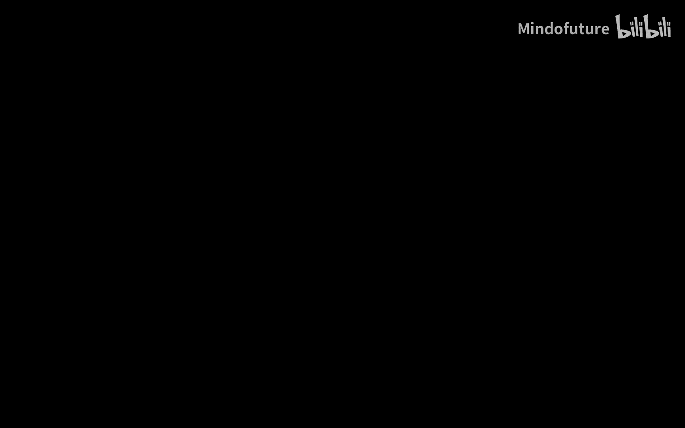
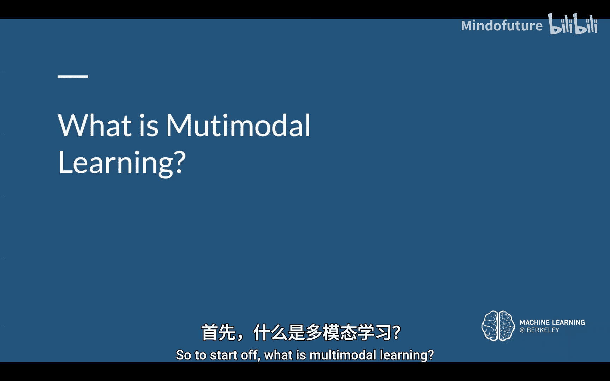
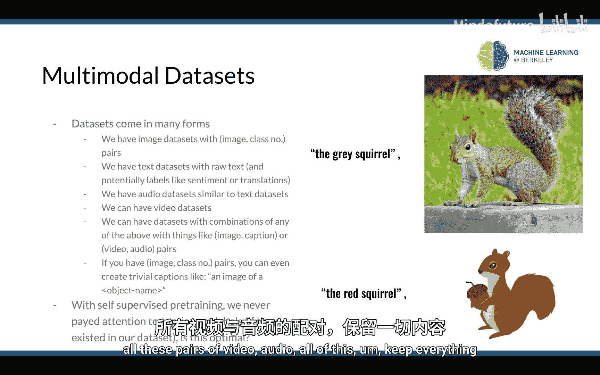
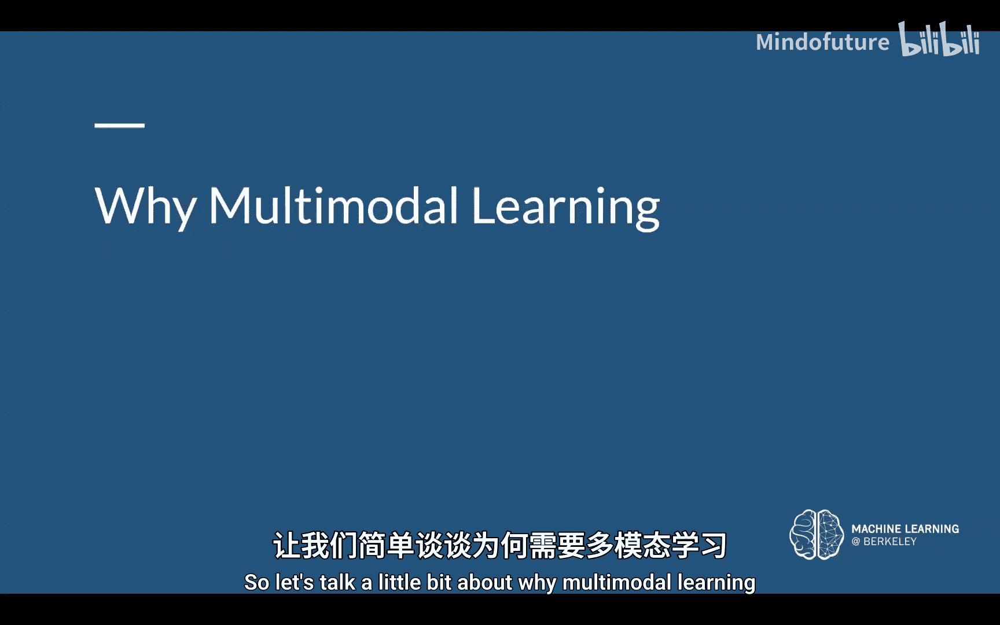
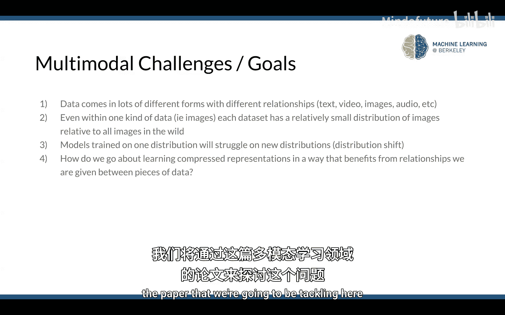
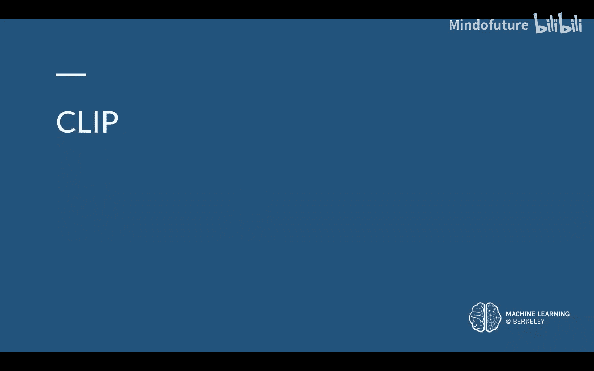
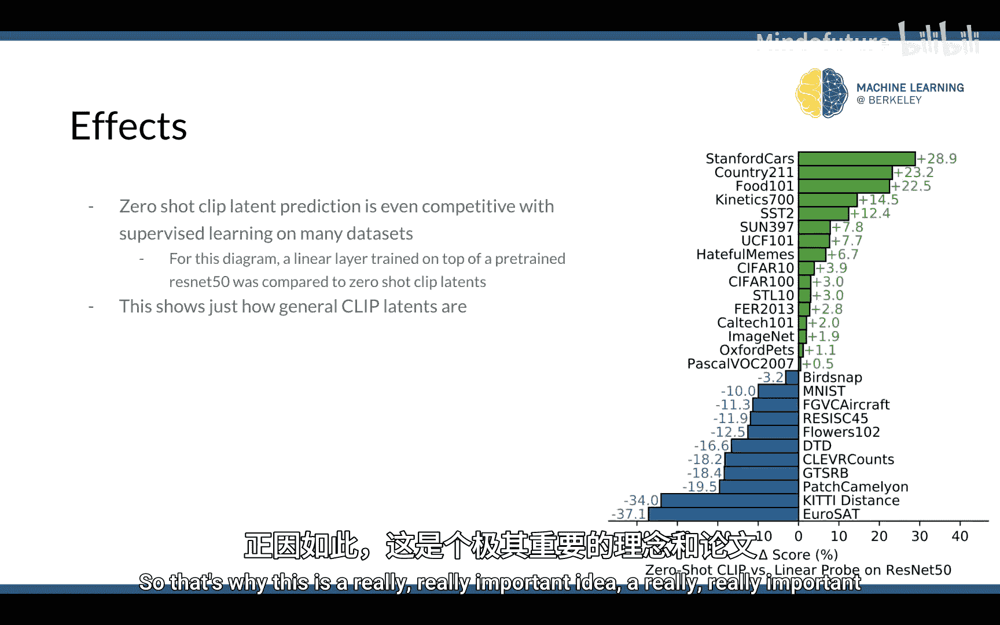
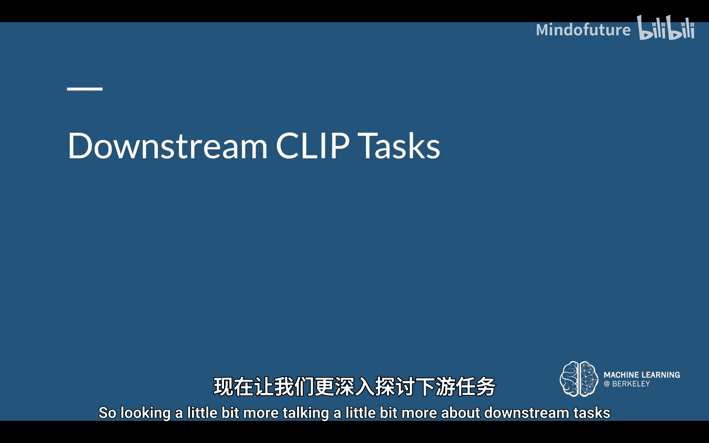
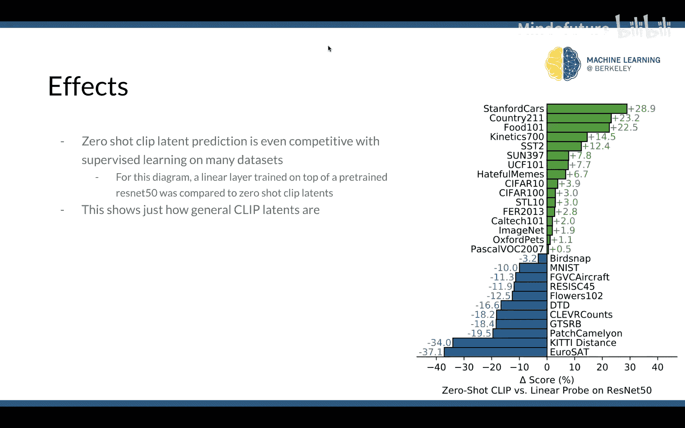
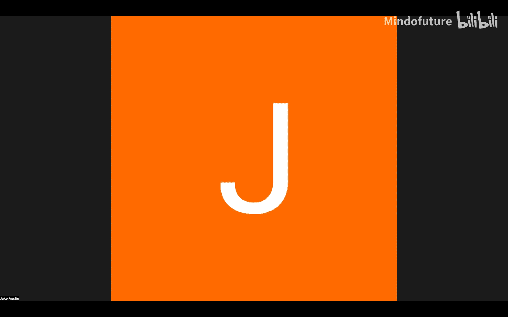

# 022：多模态学习 👁️🗨️





在本节课中，我们将要学习**多模态学习**。我们将探讨什么是多模态学习、为什么它很重要，并深入讲解一个名为 **CLIP** 的具体多模态表示学习方法。最后，我们会了解 CLIP 在下游任务中的应用。

## 什么是多模态学习？🤔

首先，我们来谈谈什么是“多模态”。同一个对象可以有多种不同的表示方式。例如，在幻灯片的右侧，你可以看到两组不同的文本（“灰松鼠”、“红松鼠”）和三张不同风格的松鼠图片。这些图片姿态相似，特征相近。

这说明了我们可以用文本、图像、视频、音频等多种数据形式来表示同一个事物。即使是同一种数据类型（如图像），其内部也存在差异，例如这三张松鼠图片在风格和绘制方式上各不相同。



我们的目标是，在表示这些数据时，既要捕捉到它们之间的相似性（都是松鼠），也要捕捉到它们内部的细微差别（不同的风格）。这类似于我们之前讨论过的词嵌入概念，其目标是将语义相似的词映射到潜在空间中距离较近的点。



总而言之，我们拥有：
*   相同但可以用不同方式表示的对象。
*   即使在同一数据类型内也存在差异的对象。

我们希望学习到的表示能够同时捕捉到这些共性和差异。

对于多模态数据集，我们的数据可能以多种形式出现。我们整个学期讨论了很多图像数据集，其中包含图像和类别编号的配对。我们也可以有文本数据集、音频数据集、视频数据集，以及上述数据类型的任意组合配对数据集，例如图像-描述配对或视频-音频配对。

幻灯片右侧展示的就是图像-描述配对：第一张图片是灰松鼠，对应的描述是“灰松鼠”；底部是红松鼠，对应的描述是“红松鼠”。即使是图像-类别编号配对，我们也可以轻松地为其创建简单的描述（例如，“一张[对象名称]的图片”）。

在之前讨论的自监督预训练中，我们通常不关心这些标签是否存在，甚至直接丢弃它们，因为自监督学习的目标是从无标签的图像中学习。但丢弃所有这些额外数据可能会导致信息损失。多模态数据集的概念就是：**保留所有这些信息**，包括所有的图像-描述配对、视频-音频配对等。

## 为什么需要多模态学习？🎯

上一节我们介绍了多模态数据的概念，本节我们来看看为什么这是一个值得关注的重要问题。

我们的数据可能来自许多不同的地方和数据集。例如，ImageNet 数据集主要包含逼真的照片，但其他数据集可能包含更多卡通、素描等风格的图像。不同的数据集可能包含完全不同的对象，而且像 ImageNet 这样的数据集通常只包含一个位于画面中央的主体对象。





我们将数据集中这些“不同”或“差异”称为数据分布。每个数据集都覆盖了所有可能数据的一个概率分布。例如，一个逼真的照片数据集，其包含卡通图像的概率非常低。在机器学习中，每个独立数据集的分布通常只覆盖了所有可能性中很小的一部分。

这就引出了一个重要问题：**分布偏移**。如果你有一个在 ImageNet 这样的逼真照片数据集上训练的计算机视觉模型，然后让它去识别一张手绘的松鼠素描，模型的表现很可能非常糟糕。这对于人类来说很容易识别，因此我们希望计算机视觉模型能够泛化到各种类型的数据。当我们从训练分布（逼真图像）转移到测试分布（卡通图像）时，就发生了分布偏移，模型性能会下降。

多模态学习正是试图解决常规学习中的这个问题。在现实世界中，互联网上存在着令人难以置信的数据多样性：不同风格、不同类型的图像、视频、文本、音频等各种数据格式。数据之间也存在不同的关系：有些数据集有图像和类别编号配对，有些只有原始图像，有些有图像和描述配对，等等。

多模态学习的目标是：**如何利用数据之间所有这些不同的表示和关系？如何做到不丢弃任何信息？** 这与我们过去只提取特定类型数据的做法相反。通过使用所有这些数据，我们可以在更多样化的数据上进行训练，从而获得更好的模型。同时，通过利用数据集中每一点数据之间的每一种关系，我们的目标是学习有意义的、压缩的表示。

总结一下：
*   数据以多种形式出现，具有不同的关系。
*   即使数据集内部，数据也存在差异。
*   任何现有数据集都只是现实世界中可能遇到的数据的很小一部分。
*   在一个分布上训练的模型，在新分布上通常会表现不佳。
*   多模态学习旨在探索如何利用不同数据片段之间的关系来学习压缩表示，从而受益。

## CLIP：对比语言-图像预训练 📄

上一节我们探讨了多模态学习的动机，本节我们将深入讲解一篇具体实现这一目标的论文：**CLIP**。

CLIP 代表“对比语言-图像预训练”。这篇论文专注于图像和文本之间的关系。我们可以想到像 Instagram 这样的平台，上面有大量的图像-描述配对。即使是有对象标签的图像数据集，我们也可以为其创建基本的描述，从而获得更多的图像-描述配对数据用于训练。

在这篇论文中，研究者结合了一个非常庞大的来自互联网的图像和描述数据集，其数据量远超任何单一数据集（如 ImageNet）。这个数据集包含了各种风格、各种模态的图像。

CLIP 的基本思想是：如果图像与其对应的描述相匹配，那么为两者学习到的表示应该是相似的。我们之前讨论过图像编码器，也简单提过文本编码器。在这里，我们不关心架构细节，只需将它们视为黑盒：一个用于处理图像的视觉变换器和一个用于处理文本的自然语言变换器。它们都输出一个固定维度的潜在向量（例如 512 维）。

核心思想是：如果我们取图像的潜在表示和描述的潜在表示，我们希望它们是相同的，因为描述描绘了图像，它们在语义上应该非常相似。理想情况下，学习到的表示也应该相同。需要注意的是，图像和文本是通过两个不同的模型处理的。

我们希望对比所有这些不同的配对，**断言匹配的图像-描述对具有相似的表示，而不匹配的对具有相距很远的表示**。再次强调，这里没有模型或架构上的创新，我们只是将语言变换器和视觉变换器作为黑盒，从头开始训练。

以下是 CLIP 训练过程的概述：
1.  **预训练**：我们取一批图像-描述配对。将所有图像通过图像编码器，得到一系列图像嵌入向量。同时，将所有描述通过文本编码器，得到一系列文本嵌入向量。
2.  **计算相似度**：计算每个图像嵌入与所有文本嵌入的点积，形成一个相似度矩阵。矩阵对角线上的元素是匹配对（如图像1与描述1）的点积，我们期望这个值很大。非对角线上的元素是不匹配对的点积，我们期望这个值很小。
3.  **损失函数**：我们将每一行（对于一个图像，其正确描述对应的点积应最大）和每一列（对于一个描述，其正确图像对应的点积应最大）视为一个分类任务，使用交叉熵损失。这促使图像编码器和文本编码器协同工作，使匹配对的点积尽可能大，不匹配对的点积尽可能小。

在测试时，如果我们想对一张新图像进行分类，可以进行**零样本预测**：
1.  我们为可能的类别创建描述，例如“一张飞机的照片”、“一张汽车的照片”、“一张狗的照片”、“一张鸟的照片”。
2.  将这些描述通过训练好的文本编码器，得到对应的文本嵌入。
3.  将待分类的图像通过图像编码器，得到图像嵌入。
4.  计算图像嵌入与所有文本嵌入的点积。
5.  点积最大的那个文本嵌入对应的描述，就是图像的预测类别。

这种零样本预测的能力，无需任何微调，就能展示出 CLIP 学习到的表示是多么强大和有意义。

以下是 CLIP 损失函数的伪代码表示，它清晰地体现了对比学习的思想：
```python
# I: 图像嵌入矩阵，形状为 [batch_size, embedding_dim]
# T: 文本嵌入矩阵，形状为 [batch_size, embedding_dim]
# 计算相似度矩阵
logits = I @ T.T # 形状 [batch_size, batch_size]
# 标签是 batch 中每个样本的索引（对角线位置）
labels = torch.arange(batch_size)
# 计算图像到文本和文本到图像两个方向的交叉熵损失
loss_i = cross_entropy_loss(logits, labels) # 图像分类文本
loss_t = cross_entropy_loss(logits.T, labels) # 文本检索图像
loss = (loss_i + loss_t) / 2
```

## CLIP 的效果与下游应用 🚀

上一节我们详细介绍了 CLIP 的原理，本节我们来看看它的实际效果以及如何应用。

CLIP 的效果非常显著。由于 CLIP 在极其多样化的数据上进行训练，其学习到的特征对**领域偏移**具有极强的鲁棒性，泛化能力极佳。在零样本预测任务中，CLIP 在多个数据集上的表现甚至可以与经过精调的传统模型相竞争。例如，在某些分布差异较大的数据集（如素描）上，CLIP 的零样本准确率远超在 ImageNet 上预训练的模型。这证明了 CLIP 学习到的潜在表示是极其通用和有意义的。





那么，我们可以用 CLIP 做什么呢？

**1. 零样本图像分类**
正如前面所述，这是 CLIP 最直接的应用。无需针对特定数据集进行微调，即可对新图像进行分类。

**2. 作为通用视觉编码器**
CLIP 的图像编码器输出的特征（潜在向量）可以作为其他任务的强大视觉表示。例如，在机器人领域，机器人感知的场景图像可以通过 CLIP 编码器转换为特征向量，然后输入给决策网络，用于路径规划、物体抓取等任务。这样就不需要为每个新任务从头训练一个视觉模型。

**3. 文本到图像生成与3D重建**
CLIP 的表示学习思想是文本到图像生成（如 Stable Diffusion）的核心之一。一个更酷的应用是在 3D 视觉领域。例如，可以优化一个神经辐射场，其损失函数是要求渲染出的图像的 CLIP 嵌入与给定文本描述的 CLIP 嵌入尽可能相似。
*   过程：从文本描述（如“清洗蓝莓”）开始，通过 CLIP 文本编码器得到文本嵌入。随机初始化一个神经辐射场，渲染出一张图像，通过 CLIP 图像编码器得到图像嵌入。计算两个嵌入之间的差异，并通过可微渲染将梯度反向传播回辐射场的参数，不断优化，直到渲染出的图像在 CLIP 空间中和文本描述“相似”。
*   结果：仅凭一句文本描述，就能生成一个对应的 3D 物体模型。这充分展示了 CLIP 嵌入的通用性和强大表征能力。

总而言之，因为 CLIP 利用了所有可用信息（图像和文本的配对关系），并在极其广泛的数据上进行预训练，它产生的用于任何句子或图像的潜在表示基本上可以开箱即用地应用于任何可能的领域。多模态学习远不止 CLIP，但 CLIP 无疑是这个子领域兴起过程中的一个重要里程碑。

## 总结 📝





本节课我们一起学习了**多模态学习**。我们从多模态数据的概念出发，探讨了其重要性，特别是解决数据分布偏移问题的潜力。然后，我们深入研究了 **CLIP** 这一具体方法，了解了它如何通过对比学习训练图像和文本编码器，使匹配的数据对在潜在空间中靠近。最后，我们看到了 CLIP 学习到的强大、通用的表示如何应用于零样本分类、机器人感知乃至 3D 生成等多种下游任务。CLIP 展示了充分利用不同模态间关系进行预训练的巨大价值。