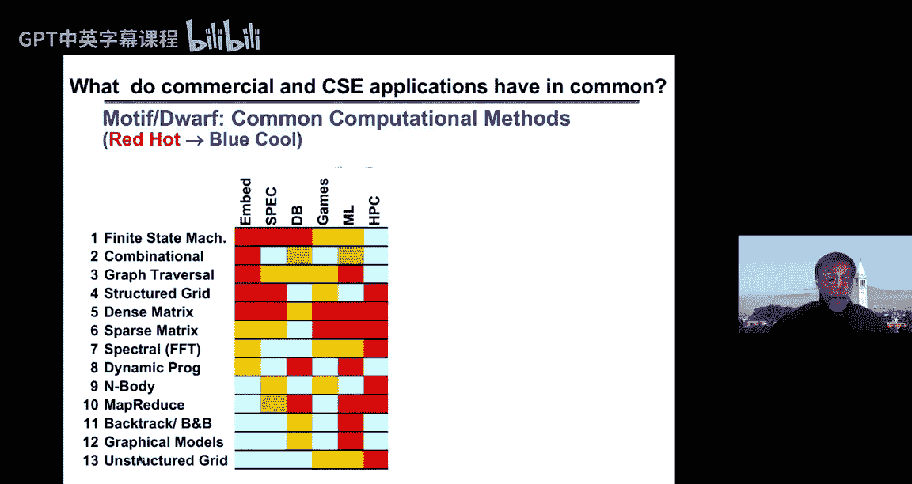
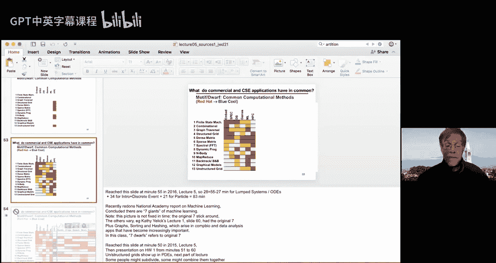
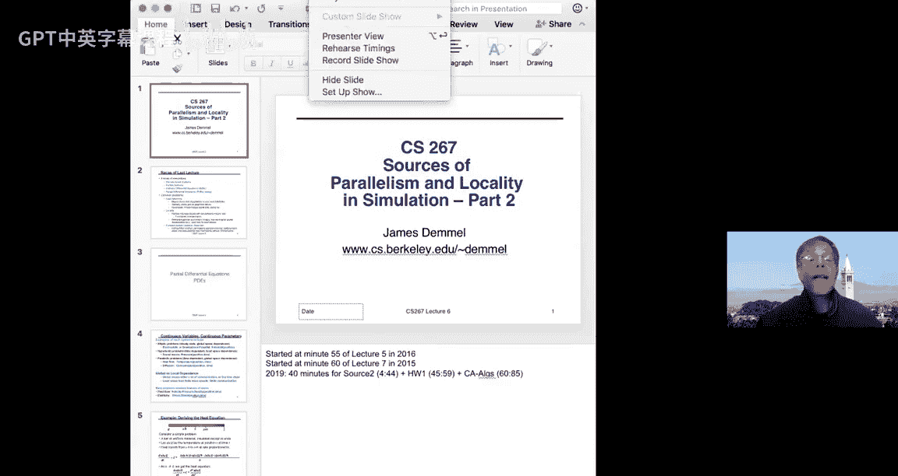
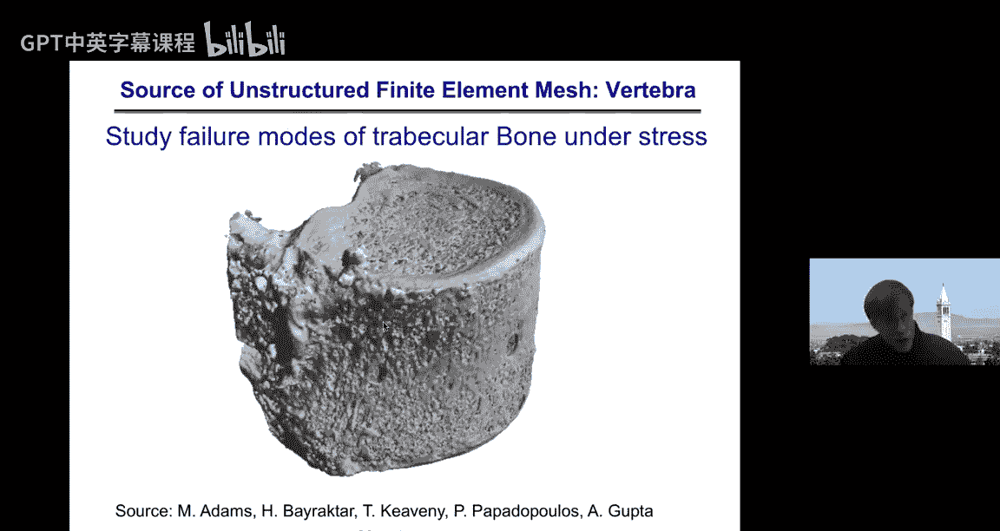
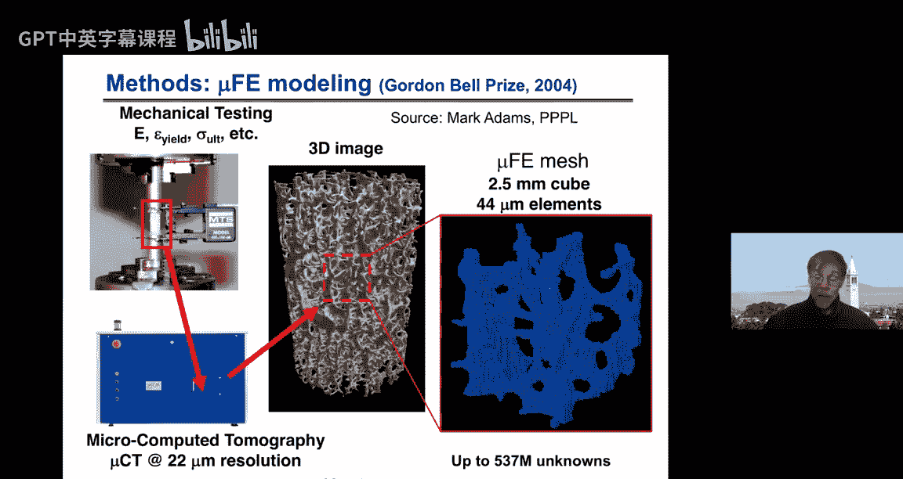
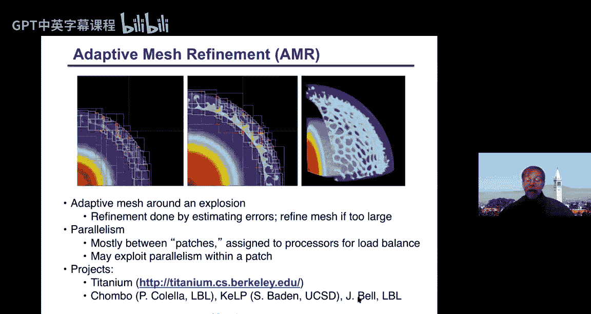
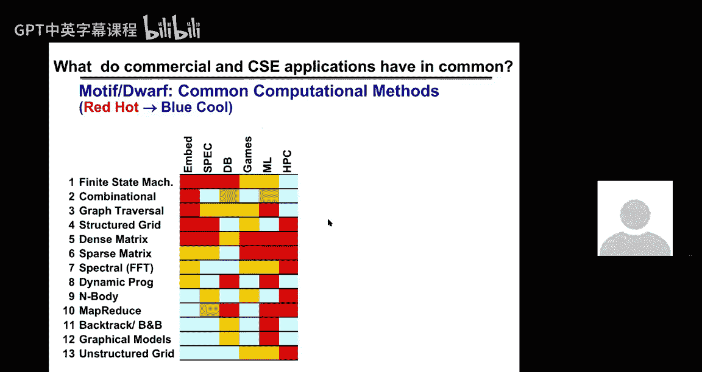
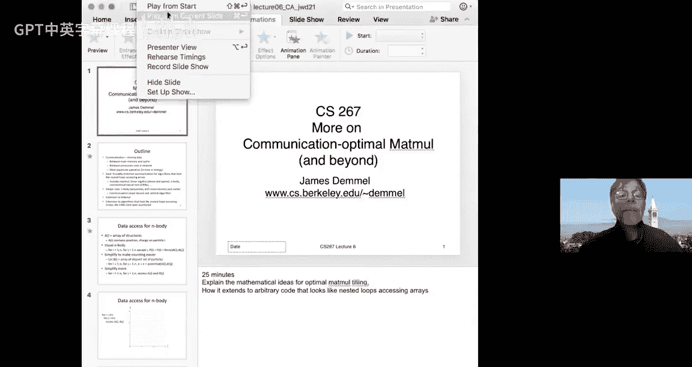
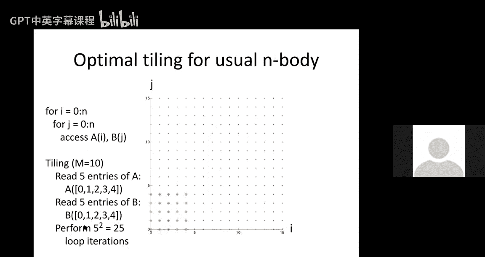

# 001：并行性与局部性的来源（第二部分）

在本节课中，我们将继续探讨并行性与局部性的来源，重点关注偏微分方程的求解方法，并深入分析通信最优算法的理论基础，特别是矩阵乘法和卷积神经网络中的通信下界。

## 偏微分方程求解方法概述

上一节我们介绍了常微分方程求解中的并行化方法，本节我们将转向偏微分方程。偏微分方程主要分为三类：椭圆型、双曲型和抛物型。每种类型对应不同的物理现象和并行化挑战。

### 椭圆型问题：全局依赖

椭圆型问题用于描述如重力或静电力等势场。其特点是，空间中任意一点的解依赖于系统中所有其他点的数据，这导致了**全局通信**的需求。泊松方程 `Lx = b` 是典型的椭圆型问题，其中 `L` 是拉普拉斯算子。

### 双曲型问题：局部依赖





双曲型问题描述了波的传播，如声波或光波。其特点是信息以有限速度传播，因此每个时间步的解仅依赖于其**最近邻**的数据。这允许高效的局部并行计算。



### 抛物型问题：混合依赖

抛物型问题，如热传导方程，结合了上述特点。它是时间相关的，但每个时间步的解依赖于前一时间步所有位置的数据，这引入了全局依赖的挑战。然而，通过隐式方法求解时，可以转化为求解大型稀疏线性系统。

## 热传导方程：一个模型问题

我们以一个简单的热传导方程为例，说明PDE求解中的核心计算模式。

**问题描述**：一根长度为1的金属棒，一端保持高温，另一端保持低温。我们希望计算棒上任意位置 `x` 在任意时间 `t` 的温度 `u(x, t)`。

**控制方程**（一维热方程）：
```
∂u/∂t = c * ∂²u/∂x²
```
其中 `c` 是热传导系数。

**离散化**：我们将空间离散为步长 `h`，时间离散为步长 `Δt`。令 `u[i, n]` 表示位置 `i*h`、时间 `n*Δt` 的温度。

**显式欧拉方法**（不稳定）：
```
u[i, n+1] = u[i, n] + (c*Δt / h²) * (u[i-1, n] - 2*u[i, n] + u[i+1, n])
```
这是一个**三点模板**计算，每个新温度值是其自身及左右邻居的加权平均。

**并行化**：在一维情况下，我们可以将计算域（金属棒）均匀划分为 `P` 块，分配给 `P` 个处理器。每个处理器负责更新其内部点的温度，仅需与左右相邻处理器交换边界数据。这实现了完美的负载平衡和最小化通信。

**稳定性问题**：显式方法要求 `(c*Δt / h²) ≤ 0.5`，否则解会发散。这意味着细化空间网格（减小 `h`）会迫使时间步长 `Δt` 以平方级减小，导致计算成本急剧增加。

**隐式欧拉方法**（稳定）：
为了解决稳定性问题，我们改用隐式方法：
```
u[i, n+1] - (c*Δt / h²) * (u[i-1, n+1] - 2*u[i, n+1] + u[i+1, n+1]) = u[i, n]
```
这需要在每个时间步求解一个线性系统 `(I - z*L) * u^{n+1} = u^n`，其中 `z = c*Δt/h²`，`L` 是离散拉普拉斯矩阵（三对角矩阵）。

**扩展到高维**：在二维或三维情况下，离散拉普拉斯矩阵 `L` 将分别具有五对角或七对角结构。求解此类稀疏线性系统成为计算核心。

## 稀疏线性系统求解算法选择

面对一个稀疏线性系统 `Ax = b`，算法选择取决于矩阵 `A` 的结构和性质。以下是一些常见选择：

*   **稠密LU分解** (`O(n³)`): 最通用，但对于稀疏矩阵效率极低。
*   **带状LU分解** (`O(n*b²)`): 适用于非零元集中在主对角线附近带状区域的矩阵。
*   **共轭梯度法** (`O(n^(3/2))` 用于2D泊松): 适用于对称正定稀疏矩阵。
*   **快速傅里叶变换** (`O(n log n)`): 适用于在规则网格上离散的泊松方程。
*   **多重网格法** (`O(n)`): 渐进最优算法，适用于广泛的椭圆型问题。

**性能权衡**：在选择算法时，需要在算法的**计算复杂度**和其**硬件实现效率**（如浮点运算速率）之间进行权衡。有时一个算法虽然每秒浮点运算次数较低，但因其总体计算量小得多，总运行时间反而更短。

## 不规则网格与自适应网格

实际工程问题（如骨骼强度分析、超新星模拟）通常涉及复杂的几何形状，需要使用不规则网格或自适应网格。

**挑战**：
1.  **网格生成**：从几何描述自动生成高质量的离散网格。
2.  **负载平衡**：在并行计算中，如何将不规则网格的计算任务均匀分配给各处理器。
3.  **数据局部性**：如何组织计算和数据访问以最小化处理器间通信。
4.  **动态适应性**：对于随时间变化的解（如火焰前锋），网格需要动态加密或粗化，增加了软件工程的复杂性。

**图划分是关键**：将计算网格视为图（顶点代表网格点，边代表连接），将网格划分给不同处理器的问题转化为**图划分问题**。目标是最小化割边（代表处理器间通信），同时保持各分区计算负载平衡。软件包如 `ParMetis` 专门用于此目的。

**软件支持**：
*   **迭代求解器库**: PETSc 提供了并行共轭梯度法、多重网格等算法的实现。
*   **直接求解器库**: SuperLU 提供了并行稀疏直接求解功能。
*   **网格生成工具**: Triangle (2D), TetGen (3D)。



## 通信最优算法理论





计算中的通信（数据在缓存与内存间或处理器间移动）通常是耗时和最耗能的部分。我们的目标是推导算法的通信下界并设计达到该下界的算法。

### N体问题：简单案例





考虑计算所有粒子对之间的相互作用：
```
for i = 1 to N
  for j = 1 to N
    E += potential(A[i], B[j]) // 假设计算势能
```
**几何模型**：将循环迭代 `(i, j)` 视为二维网格上的点。访问的数据 `A[i]` 和 `B[j]` 是该点在 i 轴和 j 轴上的投影。

**通信下界**：假设快速内存（缓存）大小为 `M`。可以证明，任何计算所有 `N²` 次迭代的算法，必须至少传输 `Ω(N² / √M)` 个字的数据。

**最优算法（分块）**：将 `(i, j)` 网格划分为大小为 `√M/2 × √M/2` 的块。依次处理每个块：将块所需的 `√M/2` 个 `A` 元素和 `√M/2` 个 `B` 元素读入缓存，然后执行块内所有 `M/4` 次迭代。此算法达到通信下界。

### 矩阵乘法：推广

矩阵乘法 `C = A * B` 涉及三重循环：
```
for i = 1 to N
  for j = 1 to N
    for k = 1 to N
      C[i,j] += A[i,k] * B[k,j]
```
**几何模型**：将循环迭代 `(i, j, k)` 视为三维立方体中的点。数据 `A[i,k]`, `B[k,j]`, `C[i,j]` 分别是该点在三个坐标平面上的投影。

**通信下界（顺序）**：利用Loomis-Whitney不等式，可以证明通信下界为 `Ω(N³ / √M)`。

**最优算法（分块）**：将三维迭代空间划分为大小为 `√M × √M × √M` 的立方体块。这就是我们在作业一中实现的分块矩阵乘法，它达到了通信下界。

**通信下界（并行）**：假设有 `P` 个处理器，每个处理器拥有 `O(N²/P)` 的本地内存。可以证明，任何并行矩阵乘法算法必须传输至少 `Ω(N² / √P)` 个字的数据。我们将在后续课程中介绍达到此下界的算法（如Cannon算法、SUMMA算法）。

### 一般循环嵌套：HBL理论

对于更一般的程序，包含任意多层循环、访问多个数组，且数组下标是循环索引的线性组合：
```
for i1 in I1, i2 in I2, ..., ik in Ik:
    A1[f1(i1,...,ik)] op= ...
    A2[f2(i1,...,ik)] op= ...
    ...
```
存在一个通用理论（Holder-Brascamp-Lieb不等式，HBL）来确定其通信下界。

**下界形式**：`Ω(#迭代次数 / M^(s-1))`，其中 `s` 是一个关键指数，通过求解一个线性规划问题得到，它编码了数组访问模式之间的相关性。

**可达性**：在满足一定条件（如循环可重排、分块大小合适）下，总可以构造一个分块策略来达到此通信下界。

### 卷积神经网络中的应用

CNN中的卷积层计算可以表达为多重循环嵌套。通常，业界通过 `im2col` 操作将卷积转换为矩阵乘法，以利用高度优化的GEMM库。

**通信优化潜力**：直接对卷积循环进行分块，有可能比转换为矩阵乘法后进行分块产生更少的通信。我们已推导出其通信下界，并在某些常见情况（如滤波器大小适中、数据无法完全放入缓存但单个滤波器可以时）下，证明了直接分块卷积可以超越基于矩阵乘法的实现的通信下界。

**挑战与开放问题**：实现一个能自动为各种CNN层生成最优分块策略的通用库仍然是一个开放的研究问题，涉及复杂的循环变换和参数空间探索。

## 总结

本节课中我们一起学习了：
1.  **偏微分方程**的三种主要类型及其并行化特征：椭圆型（全局通信）、双曲型（局部通信）、抛物型（混合）。
2.  使用**热传导方程**作为模型，说明了显式与隐式方法的区别，以及将PDE求解转化为**稀疏线性系统**求解的过程。
3.  面对不规则网格和自适应网格的实际挑战，**图划分**是实现负载平衡和最小化通信的核心工具。
4.  通信是高性能计算的主要瓶颈。我们学习了**通信最优算法理论**，从简单的N体问题到矩阵乘法，再到一般的循环嵌套（HBL理论）。
5.  该理论表明，通过精心设计的**分块**策略，可以逼近通信的理论下界。这在矩阵乘法中已成功应用，并在卷积神经网络等领域展现出优化潜力。



理解这些算法模式的通信和局部性特征，是设计高效并行程序的基础。在后续课程中，我们将深入探讨图划分、多重网格、以及达到并行通信下界的具体算法。