# 002：引言与概述

在本节课中，我们将学习并行计算的基本概念、其重要性、不同类型的并行计算机，以及它在科学和工业领域的应用。我们还将探讨推动并行计算发展的硬件趋势。

## 什么是并行计算机？

课程标题是“并行计算”。如果你走进一个超级计算中心的机房，比如离我此刻站立位置约50英尺的NERSC，你会看到连接着巨大机器的无数电缆。这张真实照片展示了电缆的数量之多，这说明了机器间互连的重要性。归根结底，它是一台由许多不同组件通过互连网络连接起来的机器，我们将看到它的不同变体。

我们为什么要这样做？这完全是为了从任何任务中获得高性能。如果计算的性能无法满足我们的需求，我们就会转向并行计算。

## 为什么需要并行计算？

让我们举一个简单的例子。假设你有大量数字需要进行因式分解。你可能会想，这是处理此事最简单的方法。因式分解对计算机来说是昂贵的。你可以说第一个数字由第一个处理器分解，第二个数字由第二个处理器分解，或者采用循环分配等其他划分方式。你可以将要分解的项目数量分配给处理器，这很简单。这种方法可能效率不高，因为你可能希望不同处理器共享某些工作，而这种粗暴的方法无法利用这一点。但这种方法非常简单，过去被称为“令人尴尬的并行计算”。现在人们不喜欢它的负面含义，所以改称为“值得骄傲的并行计算”。

这是另一个例子。假设你想对一堆数字求和。这不一定非得是加法，可以是任何归约操作，比如乘法、求最小值或最大值，只要满足结合律等限制条件。只要满足这些条件，你就可以在任何操作上运行此计算。串行计算非常简单，只需遍历列表并求和，对于大小为n的列表，其工作量为O(n)。在并行计算中，你可以构建一个树形结构，通常称为扫描操作或前缀和操作。你可以在O(log n)步内完成，假设你有n个处理器。这样你就能获得显著的加速。你可能会做更多一点的工作，但如果速度是你关心的，你可能会运行得更快。当然，如前所述，并行算法需要满足结合律才能正确，并与串行算法的结果匹配。

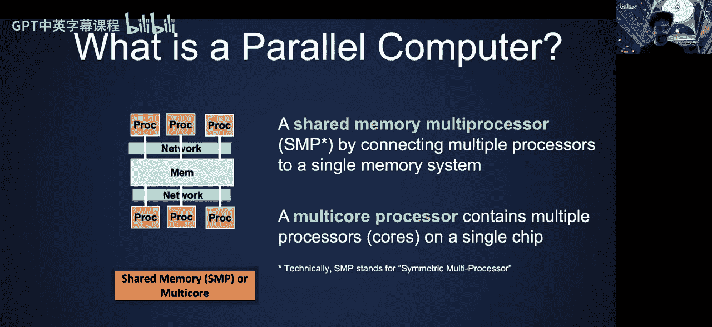

## 并行计算的重要性

关于使用并行计算，Cray公司有一句名言。你可能听说过超级计算机公司Cray，其创始人Seymour Cray。该公司大约五年前被HPE收购，至今仍在制造许多超级计算机，包括我们今天在NERSC使用的机器。这句名言是：“如果要犁一块地，你会用两头强壮的牛还是一千只鸡？”当然，类比是你会用鸡，因为……这取决于田地和你要犁的土壤硬度，但对于相对容易的田地，你会覆盖更多空间。这确实是一个令人困惑的类比，但任何硬件专家的实际答案是：提高性能唯一可持续的方式是增加并行性。

我们稍后会详细讨论为什么会这样，并给出一个具体例子：假设你想在特定大小的数据上达到一定速度，你会发现根据物理定律，用串行计算机无法做到。当然，还有其他多种原因。

## 并行计算机的类型

现在，让我们看看当今并行计算机的几个例子。主要有三大类计算机：左侧是共享内存机器，中间是分布式内存机器，右侧是单指令多数据机器。

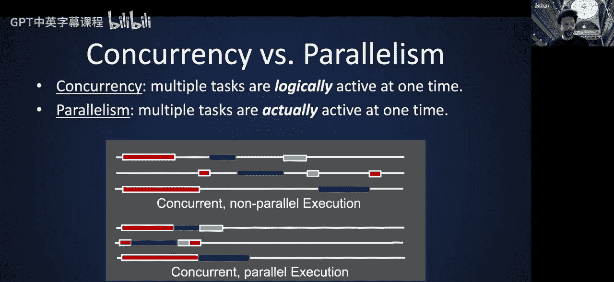

**共享内存多处理器**，字面意思曾是对称多处理器，这就是SMP的缩写。很多缩写会沿用并开始表示其他含义。实际上，在分布式内存编程讲座中，一些使用的缩写历史上意义完全不同，但巧合地符合了新的措辞。SMP就是一个例子，我们现在就称它为共享内存多处理器以避免混淆。所有处理器访问一个单一内存，可能有一组不同的处理器。它还包括一个称为多核处理器的子类，这些所谓的处理器在单个芯片上。但广义上说，它们不必在单个芯片上。你可以有像SGI这样的公司制造的机器，这些机器有16、32或更多不同的独立处理器，通过网络连接到一个单一内存。只要存在一个唯一的内存，对我们来说就是SMP。

**分布式内存机器**，也称为高性能计算系统。这些处理器拥有自己的内存，并且有一个网络允许这些处理器相互通信、移动数据、发送消息。这些也称为集群，因为它们是由不同的处理器集群组成。每个所谓的节点通常包含多个多核芯片插槽，这些节点通过某种机柜连接，机柜之间又通过更高级别的网络连接。因此，会有多层网络连接这些组件，并相应地进行扩展。我们将在几周后的相应讲座中具体介绍分布式内存机器的历史和当代架构。

**单指令多数据计算机**，实际上有多个处理器执行相同的操作。SIMD的缩写代表单指令多数据。你可以看到为什么这样称呼，因为所有这些小核心将对宽数据执行完全相同的指令，这种宽数据允许我们利用所谓的数据并行性。这实际上存在于几乎每台计算机中，包括你的笔记本电脑，它们有所谓的AVX指令、向量指令。但图形处理单元利用这一点达到了极致。GPU所做的很多工作就是SIMD。当然，我们也会有一节关于GPU的讲座。

## 高性能计算的核心等式

我有几个问题，以及Bill Dally（NVIDIA首席科学家，也隶属于斯坦福大学）的一句更好的名言：“为什么高性能计算等同于并行计算？”这是我们今天要多次回答的问题。“为什么我们如此关心互连和通信？”因为最后三张幻灯片基本上只是向你展示了这些处理器如何以不同方式相互连接。

他有两个我非常喜欢的等式，大约十五年前他讲授这些讲座时常用：
*   **性能 = 并行性**
*   **效率 = 局部性**

第一个等式真正回答了本幻灯片中的第一个问题，第二个等式真正回答了第二个问题。在很大程度上，这些等式在今天仍然是正确的，它们并没有过时。

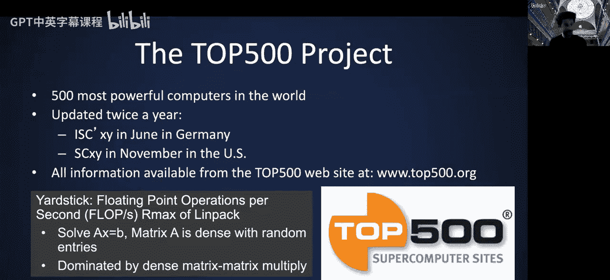

## 什么不是并行计算机？

那么，什么不是并行计算机？我们在本课程中不会涵盖什么？

有一种叫做**并发编程/并发计算**的东西。并发不一定是并行执行。你的系统可以通过在线程间分时来给你并行的错觉。例如，当你打开浏览器、同时打字和听音乐时，如果你只有一个处理器，你的操作系统会很好地处理所有这些任务，你不会感到任何卡顿，但那里并没有真正的并行发生，事物是并发执行的，处理器只是在任务之间快速切换，快到你感觉不到。作为用户，但这并不是真正的并行。并发当然可以包含并行性，但那是本课程中我们将要关注的部分：多个任务在某一时刻实际上是同时活跃的。

还有另一种你可能看到并感到困惑的东西，叫做**分布式系统**。你可以想到任何网站，比如在线银行，通常有一个服务器。当然，我们在这里将其画成一个单一的实体，但实际上，即使是服务器也是分布式的，以确保当一个组件故障时，你仍然可以访问在线银行账户，或者在负载高时，你仍然可以获得合理的响应时间。但暂时忽略服务器是分布式的这一事实，假设有一个服务器和许多来来往往的客户端。此时存在某种并行性和并发性，但这些客户端并非同时活跃，它们在特定时间点变得活跃。系统本质上是分布式的，这不同于我们所说的分布式内存计算机，在分布式内存计算机中，所有任务同时活跃，一切同时开始，同时结束。这就是我们真正使用并行HPC高性能计算计算机的方式。当我们谈论分布式内存时，并不是这张图意义上的分布式系统。

希望这澄清了一些术语之间的差异。

## 高性能计算的现状

让我们谈谈一些现实情况：至少我们知道且公开可用的最快计算机长期以来一直是并行的，我们相信那些不公开的计算机也是并行的。有一个名为TOP500的排名系统，我认为始于80年代末，大约有35年的历史，因此你可以获得很多历史数据。它对超级计算机进行排名，至少是那些公开已知的。有许多由公司和国防工业拥有的机器可能不公开，但具有同等的计算能力。所以，今天当你听到超级计算机时，我们实际上是在谈论并行编程。未来这可能会改变，超级计算机可能成为量子计算或其他可能克服标准冯·诺依曼架构障碍的技术的同义词，但今天当我们说超级计算机时，我们实际上是在谈论并行性。NERSC，也就是山上的那个，是你们大多数作业将要使用的机器Cori，它以第一位获得诺贝尔奖的美国女性Cori Theresa Cori命名，她出生在现已不存在的奥匈帝国。

在查看这个列表之前，我们如何衡量性能？高性能计算的实际度量单位通常是所谓的FLOPS，即每秒浮点运算次数。有些令人困惑的是，FLOPS如果不加斜杠，实际上指的是运算次数；如果加了斜杠和S，你实际上指的是每秒浮点运算次数。当然，我们也会谈论字节，因为这很重要，决定了你能运行多快以及通信成本有多大。对于10^3，有千兆，你可能从个人电脑上听说过这些，但可能没听说过太拉以上的单位。所以，P是10^15，E是10^18，这是我们希望在接下来12个月左右达到的目标，意味着将有一台机器能够每秒执行约10^18次浮点运算。当我们这么说时，我们指的是双精度运算。之后还有泽它、尧它等等。为了避免混淆并解决一场诉讼，人们实际上开始谈论KiB、MiB，而不是MB，它们代表字节。作为计算机科学家，你可以看到10^6和2^20几乎但不完全一样，所以通常有区别。实际上添加了“i”来解决差异。可能有一些测验问题需要你回答，只需阅读说明，了解你应该将“千”视为10^3还是2^10，所以请确保在问题中阅读细则。

再次，TOP500排名的是世界上最强大的计算机，每年在两大会议上更新，一个几乎总是在6月的德国，另一个几乎总是在11月的美国。衡量这些计算机的基准是运行所谓的LINPACK基准测试时的每秒浮点运算次数，该基准测试是求解一个稠密线性方程组。矩阵A是稠密矩阵，具有随机条目，如果你正确实现，成本将主要由稠密矩阵乘法主导。需要注意的是，尽管稠密矩阵乘法在现代架构中实现了非常好的性能，但这并非令人尴尬或值得骄傲的并行计算。此操作仍然涉及大量通信，不像图像处理那样，每个处理器获取自己的数据块并在没有通信的情况下处理数字。这里有很多通信发生，只是计算量比通信量高一个数量级，所以比我们今天要涵盖的其他一些计算要容易一些。

这是2021年11月的最新排名。颜色编码是这样的：我尝试将那些拥有NVIDIA加速器的政府机器标为红色。据我所知，“加速器”这个概念存在争议，所以我只称之为NVIDIA加速器。正如你所见，大多数位于特定的超级计算中心，如能源部的橡树岭、劳伦斯利弗莫尔和劳伦斯伯克利。这台机器实际上已经部分启动并运行，但尚未对所有人公开访问，这就是为什么我们还没有在那里做作业，希望明年可以。现在还有一家公司NVIDIA公开承认并提交了数字的机器，排名第六。绿色的机器，我将其标为绿色，因为根据某种论点，它们没有加速器，只有CPU。其中一些CPU不是我们今天使用的类型，比如Fugaku机器或神威太湖之光机器，它们不是你现在习惯的Intel或AMD CPU。最后，我标出了第10名，因为它实际上是一个云计算提供商的条目，是微软Azure，排名第十。

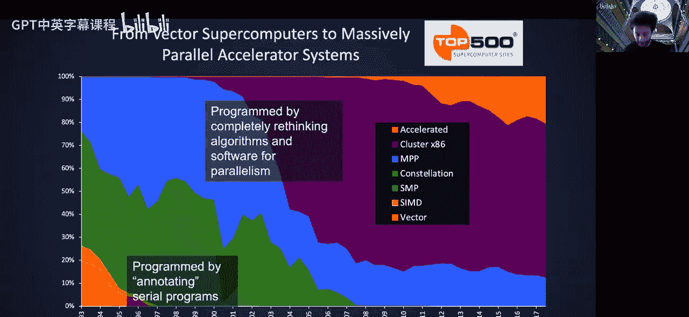

这里一个相对令人惊讶的事情是，前十名中没有美国国家科学基金会的机器。NSF在前十名之外有很多机器，但不再有机器进入前十名。美国最快的机器是Summit，它由节点组成，每个节点有两个所谓的插槽，这些相同的部件通过PCIe总线连接。每个节点有两个IBM Power9处理器和六个NVIDIA Tesla V100 GPU。它实际上执行exa-ops，但这些不是真正的FLOPS，因为它们不是双精度的，所以在争夺exaflop的竞赛中不计入。美国以外世界上最快的机器是日本的Fugaku，它有Fujitsu A64FX CPU，没有GPU，至少没有用于计算。你可以看到这里有一点不同：Summit只用了不到5000个节点，因为每个节点都非常“胖”，具有大量计算能力，有六个GPU。相比之下，Fugaku走了一条完全不同的路线，拥有几乎多两个数量级的节点，但没有加速器。因此，有不同的方式可以达到相同的性能。如果你查看其他关于这些机器能效的排名，实际上Fugaku更好，但我们不会过多涉及这一点。你们将要使用的Cori甚至不是伯克利最快的机器。我过去常说它是伯克利最快的，但现在我们有了Perlmutter。在目前公开可访问的机器中，它是伯克利最快的。它实际上有两个所谓的阶段，我们现在不再称它们为阶段，它就像这台机器的两个部分。其中一个有更传统的Haswell CPU，接近你习惯的多核处理器；另一个有所谓的KNL Knights Landing处理器，它们有更多的核心，但每个核心的功能较弱，你可以从每个核心的频率看出来。这是你们大多数作业将要使用的机器。

我之前说过，TOP500允许我们回顾过去，查看多年来的性能趋势。这非常好，因为它不仅显示了排名第一的机器（这条黄线），还显示了第500名的机器以及500强中所有条目的总和。从历史上看，最快机器的趋势至今仍然保持，自列表开始以来一直遵循某种趋势。相比之下，大约在2009年左右，第500名机器以及所有条目的总和开始偏离其趋势，进入了一个增长较慢的斜率。如果这种情况继续下去，第500名处理器将比其历史趋势线落后10倍。请注意，Y轴是对数坐标，变化可能看起来很小，但对实际数字有巨大影响。总和也在稍晚的时候开始偏离其历史趋势，比如你可以说2015年发生了这种情况。当然，你可以说我们可以更聪明，为什么只用一种特定方式求解线性方程组？事实上，研究人员当然也研究了这个问题，他们说，如果我们用不同的方法求解Ax=B，比如用高斯消元法以外的其他方法，我们可以用较低精度进行迭代，然后进行迭代精化，实际上可以获得显著更高的FLOPS速率，即所谓的混合精度高性能影响和exaflop。但不幸的是，基准测试规则不允许这样做，所以这不是一个被接受的条目。另一方面，你实际上可以获得与原始方法相同的精度。所以，我想在这里说的是，算法进步相对于这个基准测试是不被允许的，这真的是关于观察机器如何演变，而不是算法如何演变。

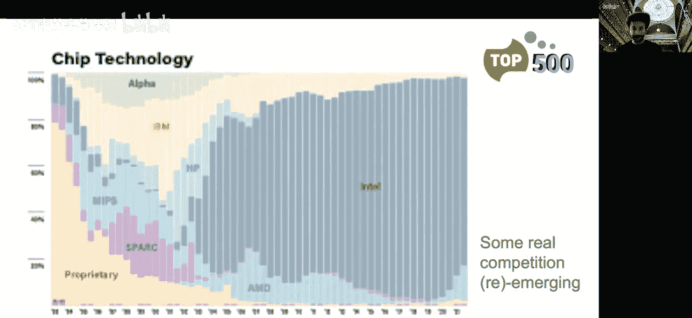

再次回顾历史，发生了什么？我没有在2018年之后更新这张幻灯片，主要是因为“加速器”的定义造成了足够的混淆和争论，以至于他们不再允许人们将其作为一个独立的类别。所以这张幻灯片将暂时保持为快照。但你可以看到集群占主导地位。即使是加速器部分实际上也是一个集群，它可能不是x86集群，也许它是x86，但它并非从CPU获得所有性能，而是从GPU获得大量性能。但总体而言，它是一个分布式内存集群的HPC系统。但情况并非总是如此，如果你回到四分之一世纪前，你会看到最快的机器实际上不涉及任何集群，它们有很多其他机器，包括对称多处理器和向量机。这告诉我们，在过去，构建一台具有非常昂贵互连的巨大机器实际上效果并不好，因为在你完成构建时，CPU速度正在摩尔定律充分发挥作用的情况下迅速提升，人们只需等待，每18个月更换一次共享内存系统，那将是那个十年的超级计算机。

## 并行编程的演变

在过去，当我们拥有对称多处理器、单一内存机器或向量机时，我们实际上可以让编译器做很多工作。你可以编写看起来几乎像串行的代码，并用某些编译指示进行注释，比如“这个循环是可并行的，没有任何依赖，请这样做”，它会正常工作，并相应地进行向量化和并行化。然而，如今，由于集群在这个时代占主导地位，几乎所有的计算都是通过重新思考算法和软件来完成的，依赖编译器不再有效，几乎每个人都通过从头开始重新思考过程来编写算法并进行并行化。

我不知道为什么这张幻灯片的分辨率变得这么差，我之前浏览这些幻灯片时它实际上很好。我只是想展示……这分辨率真的很奇怪。希望你能从网站下载一个分辨率更好的版本。如果那个版本看起来也很差，请告诉我，我会找到不同的方式将这张幻灯片的源文件发给你们。

那么，我们在这里看到了什么？这些是加速器，记住Intel KNL也算作加速器，还有一些AMD的，但大多数这些加速器是NVIDIA的GPU。它们达到的数字是150，从糟糕的分辨率中你可能看不到，但那实际上说的是略低于三分之一的系统今天拥有加速器和核心处理器。这只是系统数量。Y轴是系统数量，实际的性能份额要高得多。这就是趋势。

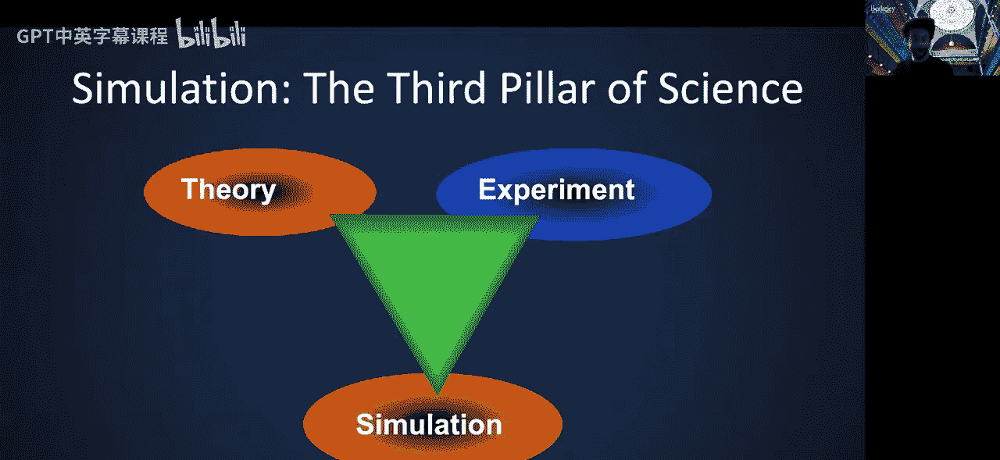

芯片技术如何发展？至少现在，我们看到一些真正的竞争重新出现。在过去的十年左右，我们看到Intel在CPU端的份额变得越来越大，几乎达到95%以上。同样，这不包括这里的GPU。如今，我们看到AMD在这场游戏中重新崛起，实际上有相当多的基于ARM的处理器，你可以在云实例上运行计算，这些没有在TOP500中报告。一个例子是亚马逊所谓的Graviton处理器，如果你没听说过，可以谷歌一下，它们现在已经发展到第三代。

## 其他变化

还有什么变化？正如我们所说，四分之一世纪前，你只需等待，而不是构建一台巨大的机器，你只需每18个月用更快的CPU代次频繁更换它。如今这不再发生，更换机器的成本对许多超级计算中心来说确实令人望而却步，因此更换时间显著增加，平均系统年龄与其历史趋势相比确实很高。当然，另一个原因是CPU速度不再以过去的速度增长，因此升级系统的增量价值较低。所以既有成本因素，也有价值因素。

我谈了很多关于TOP500排名处理器的事情，但还有另一种排名方式，即实际应用程序性能。Golden Bell奖，HPC领域的先驱之一说过，如果你能在真实应用程序上展示真正的加速，我会给你……我不知道历史上是多少，这么多美元。这成为了所谓的Gordon Bell奖，每年在SC会议上颁发。其范围已扩大到不仅包括真实应用程序的原始性能，还包括将高性能计算应用于科学、工程和数据分析问题的一般创新。你会看到2018年两个团队分享该奖的照片，其中一个团队实际上驻扎在劳伦斯伯克利国家实验室，右边的人大多来自那里。实际上并非如此，他们分布在各处，这张照片只是两个不同的团队，一个由橡树岭领导，一个由伯克利领导。是的，Kathy Yelick做了这个图，比较了Gordon Bell获奖者的性能与TOP500第一名的机器。Y轴是每秒浮点运算次数，带有漂亮的正斜杠。你会惊讶地发现，也许与直觉相反，趋势仍然保持。也许这只是Gordon Bell奖委员会选择性能非常高的项目的偏见，或者也许人们实际上能够像TOP500高性能LINPACK基准测试一样充分利用这些超级计算机。你看到这两个数字之间几乎存在很强的相关性。你可能觉得有点奇怪的是，在某些年份，Gordon Bell获奖者的运算性能速率高于TOP500。我们知道TOP500是一个相对容易的问题，求解稠密方程组。但我们也知道这不是一个令人尴尬的并行问题，所以它不是一个超级难的应用，但也不是微不足道的。但这可以高得多的真正原因是，记住Y轴是对数坐标，计算FLOPS有不同的方式。TOP500只报告双精度速率，而其中一些条目实际上不使用双精度。特别是，这个数字来自我在上一张幻灯片中展示的团队，这两个团队都使用了降低精度的操作，如8位、16位、4位，具体取决于应用程序，我们称它们为AI ops或AI FLOPS。这里没有双关语，因为它们可以使用降低精度的算术并仍然获得相同的结果。

## 高性能计算在科学中的应用

现在，我们将介绍一些使用HPC的科学例子。你可能见过这张图：科学的三大支柱过去是理论、实验和模拟。显然在此之前，科学有两大支柱：理论和实验。模拟成为第一个被普遍接受的科学第三支柱。模拟的真正含义是，我们将已知的数学定律放入计算机程序中，让所谓的计算机模型（无论我们试图模拟什么现象）随时间演化，这真的叫做模拟。

我们为什么要这样做？有时我们想观察太大或太小而无法观察的事物，发生得太快我们无法捕捉，或者发生得太慢我们无法等待，或者可能太危险。这些都是非常不同的例子。例如，宇宙，我们无法真正等待，也无法回到过去。气候变化，我们必须进行前向模拟，不能等到你知道的后天日食来临。喷气发动机，我们不能总是安全地进行实验，必须在获得认证前进行大量模拟，飞机在获得认证前必须进行大量关于可能出错的模拟等等。

我希望这个分辨率会好一些。但这只是展示了如果气候变暖几度，全球会发生什么的模拟。在这里你可以看到某些飓风正在形成。将其映射到超级计算机的方法是，你将地球划分为某些形状。显然有比其他方法更优的方法，科学家们研究了离散化地球的正确方法，他们用六边形等来做。每个处理器将获得一块进行模拟。这听起来太简单了，实际上并非如此，因为显然发生在位置A的事件会影响位置B，因为天气在全球移动，所以处理器之间必须进行大量通信。因此，你不能仅仅独立于其他处理器模拟自己的小块地球。

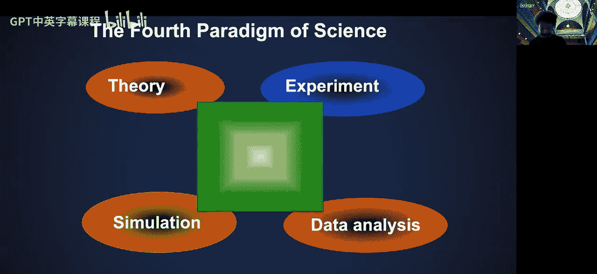

那么，为什么我们需要更快的计算机？让我们再播放一次。所以你在这里看到两张不同的图片。在不同世代的超级计算机上对同一现象的模拟，这就是为什么顶部的分辨率不同。顶部的分辨率是所谓的200公里，底部是25公里，所以好了8倍。这是真的吗？我想是的，底部的分辨率好了8倍。这是由更强大的超级计算机实现的。这不仅仅是视觉上更有趣，底部的视觉上更有趣，你可以看到很多在顶部看不到的东西。在顶部，由于缺乏分辨率，很多东西被平滑掉了，但你在底部实际上学到了更多。在200公里分辨率下，你看不到飓风和极端天气事件的形成，但在底部的图片中你可以看到。所以这不仅仅是视觉效果。

高性能计算和模拟在工业中也大量使用，多年来开发的许多相同技术实际上也可以在这个领域使用。这只是一个例子，这个名为Chombo的代码是为地球地下建模开发的。结果发现，你可以将这个东西应用于所谓的造纸制造中的制浆过程。造纸制造非常耗能，大部分能量浪费在烹饪木片以打开纤维的所谓制浆过程中，以创造造纸材料。我不知道是否有……是的，有一个模拟很好。所以你可以看到相同的代码如何用于这个目的与地球地下建模。这两个应用程序都使用了一种称为自适应网格细化的技术，即所谓的AMR。我们将在后面的讲座中介绍AMR的一些原理。

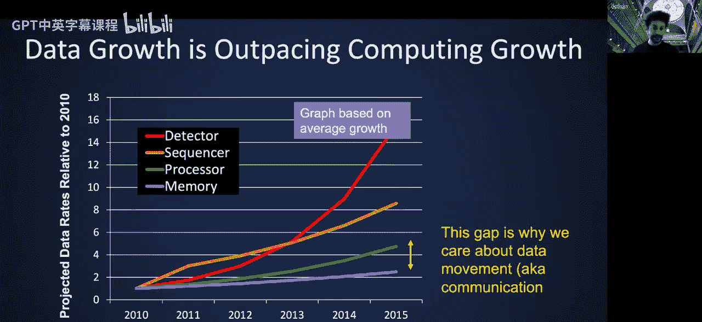

这是一个不同类型的应用程序。到目前为止，我们谈论的是真正的大规模模拟，一个巨大的模拟或一堆模拟，比如我们进行的气候建模，我们模拟10种不同的场景，但每个模拟都非常大。相比之下，这个材料项目始于高性能计算的高通量使用。因此，你会获得具有不同特性的不同材料，并对每种材料进行大量模拟，试图预测或模拟材料的特性。多年来，该项目已发展到使用越来越多的机器学习，特别是用于指导发现具有特定设计特性的新材料的搜索空间。但它确实是作为一个高通量、高性能计算项目开始的。

最后，不，不是最后，我还有几个模拟例子。你可以使用高性能计算和模拟来弄清楚如何捕获碳而不是将其释放回大气中，如何捕获它以避免地球变暖或气候变化，无论哪个是政治正确的用词。当然，它已被用于模拟可用作COVID-19药物的材料，你会看到这个领域发表了很多很多论文，哪些会更好地与刺突蛋白结合，你可以模拟FDA批准和使用的所有已知化合物，看看是否有任何东西实际上对我们有用。这已经完成了。还有很多其他事情也完成了，所以我将停止在这里举更多模拟应用的例子，但可以说，许多这些模拟项目现在是能源部这个大伞项目的一部分，即所谓的Exascale计算项目，我们在伯克利实验室本身，即劳伦斯伯克利国家实验室，参与了许多这样的项目。这张图中的最后两个不是模拟项目，基因组学和光子科学，我们将在几分钟后的高性能数据分析部分简要讨论基因组学案例。

## 科学的第四范式：数据分析

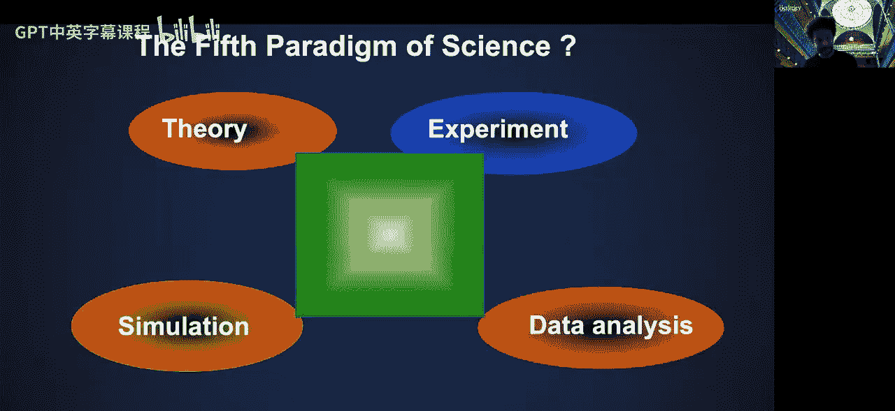

好了，我们涵盖了模拟以及高性能计算如何应用于此。科学的第四范式，我相信这也被普遍接受，是数据分析。记住十年前的大数据短语。记住，我们实际上不仅分析实验和观测数据，还可能分析模拟的输出。有时我们只是运行一个大型模拟，它就会产生太字节和拍字节的数据，然后我们必须对其进行分析。因此，我们可以分析两种数据：观测和实验数据，以及模拟的输出。

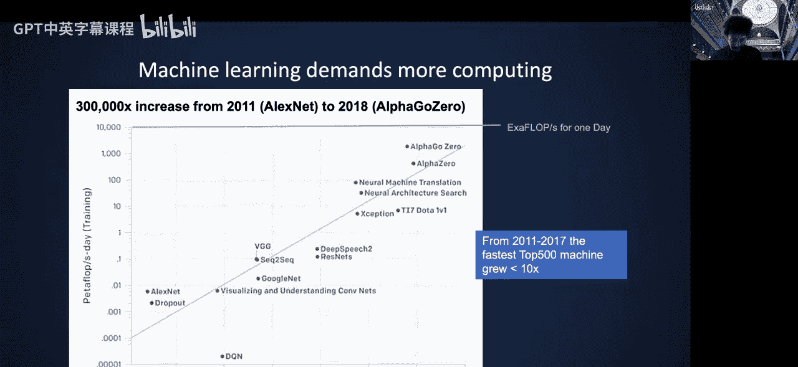

与模拟案例对称，这也用于数据集太大、太复杂、太快（意味着数据在我们捕捉之前移动得太快，这在粒子探测器和粒子物理中经常发生）、太嘈杂或太异构的情况。这里展示了其中几个例子，你可以说并非所有都只符合一个属性。例如，你可以说来自测序仪的基因组太大，但也可以说它们也太嘈杂，所以多个属性适用于每个问题。

那么，这张幻灯片有两个重点我想讨论。一是似乎我们的计算性能，至少在单个处理器上，跟不上某些数据集的增长。粒子物理的探测器输出是这条红线，基因组测序仪的测序仪输出是这条橙线，两者的增长速度都快于处理器速度、内存性能和I/O性能。这实际上意味着，为了能够分析来自这些数据源（如探测器和测序仪）的数据集，我们必须做的不仅仅是有效地将它们映射到计算机上，还必须利用并行性以及可能更聪明的算法。

另一个括号内的旁注，也是这张图片的结论，是处理器和内存之间的差距一直在扩大，这就是为什么我们关心数据移动，因为访问数据的成本相对于处理器速度正在相对增加。当然，Jim将在并行性来源讲座中涵盖很多关于通信避免算法的内容，我们将在整个学期中反复回到这个主题。

这个高性能数据分析项目，简称HPDH，用于基因组学，由Kathy Yelick领导，她曾是讲师之一，如前所述，她成为了研究副校长。这真的不是单个基因组，而是所谓的宏基因组，这是一组共同生活的生物体，如细菌、病毒、古菌和真菌，你可以观察诸如火灾后这些动态发生了什么，微生物如何影响我们关心的生物能源植物的疾病和生长等等。开发了许多机器学习算法，并在大型计算机上运行，包括我们在美国拥有的排名第一的Summit机器，当然还有我们在NERSC拥有的所有机器。这些数据集对于它们运行的计算来说是巨大的，每个都大于1太字节，高达10太字节。

高性能计算在基因组学中的另一个应用实际上来自2018年赢得Gordon Bell奖的那张图片，他们观察了执行某些任务的基因组合，这真的是一个巨大的所谓全基因组关联研究，研究哪些基因组合产生什么表型。他们首先查看了所有三向组合，我想，并且能够在Summit上使用GPU上的降低精度算术，实现了超过2 exa-ops每秒的性能。再次，由于使用较低精度，他们能够突破exascale障碍，因为该机器实际上无法执行双精度exaflop。

## 第五范式：机器学习

还有第五个科学范式吗？或者我们已经完成了？嗯，有一个论点认为科学的第五范式是机器学习。这尚未被普遍接受，你可以认为机器学习属于数据分析，或者认为机器学习也属于模拟，所以它介于两者之间。我们将在不强烈争论任何一方的情况下讨论它。

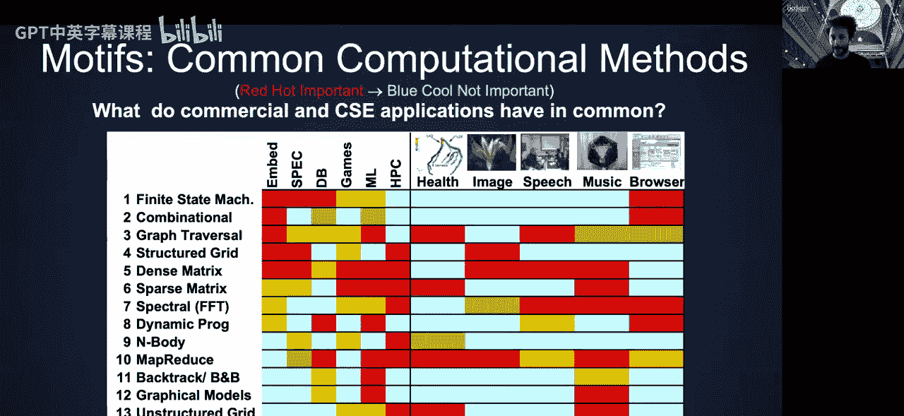

但从计算的角度来看，实际问题是这张来自OpenAI的图显示了不同深度学习模型多年来的计算需求，从2012年的AlexNet开始，我想，到2019年结束，我相信趋势仍在继续。在这九年中，这些模型的计算需求增加了惊人的30万倍。将其与TOP500中最快机器的性能进行比较，其性能只增加了不到10倍。这说明，为了跟上深度学习和一般机器学习不断增长的计算需求，我们未来可能会建造越来越强大的计算机。

是的。所以，这张幻灯片来自Prabhat，他曾领导伯克利实验室的数据分析小组，现在他在微软Azure运行他们的云服务，领导他们在云HPC方面的工作。但这只是向你展示了工业界和科学界如何用相似的技术做不同的事情。对图片中的对象进行分类显然涉及定位、对象检测、分割和分类。你可以直接将相同的想法应用于分类极端天气事件，无论是飓风还是大气河流。你可以说这种定位就是对象检测、分割和分类。因此，跨领域可能有相当多的技术转移。显然，规模非常不同，看这个数据，那个气候模拟，与图片相比是一个巨大的数据。但机器学习实际上在与模拟整体良好配合方面是成功的。

这再次来自同一个2018年Gordon Bell奖，因为我不断回到同一个奖，因为有两个不同的团队，所以我可以谈论它的不同部分。他们使用深度学习来预测极端天气事件，并且有地面实况可以衡量他们的成功。结果发现，深度学习的结果更好，意味着比他们以前使用的启发式标签更平滑，这再次在橡树岭Summit机器上实现了超过exaflop/exa-op的性能。

我们在这里看到的是……让我看看这里是否有动画。似乎没有动画。人们使用机器学习生成科学数据。所以一般来说，正如我所说，人们使用模拟生成科学数据，但你可以使用某些类型的机器学习方法，比如在这种情况下使用生成对抗网络来构建引力透镜的收敛图。重要的是，无论实际应用是什么，这种基于GAN的方法的输出在物理上是真实的，意味着在统计上与来自详细模拟的输出无法区分。那么我们为什么要这样做呢？潜在的GAN可以变得更准确或更快，因此它们有可能取代我们进行的一些模拟。

## 计算核心模式分类

好了，关于科学支柱已经讲得够多了。现在我们将回到并行计算，并根据其计算核心类型对不同的应用程序进行分类。此时你可能实际上感到不知所措，所以让我看看到目前为止是否有未回答的问题。我看到网站上的版本看起来很差。好的，我会把高分辨率图片发给全班同学，以替代那些低分辨率版本。看起来问题自行解决了，非常感谢。此时你可能感到不知所措，因为所有这些复杂的应用程序运行在这些复杂的硬件上。你甚至如何从这些东西中获得良好的性能？如何不断回到一个新的应用程序，弄清楚如何在超级计算机上运行它？这似乎是一项艰巨的任务，确实如此，但有些事情可以帮助我们，那就是我们可以查看一大类应用程序，找出它们之间的共同点。这真的很重要，否则你必须为每个应用程序从头开始，尝试重写所有内容，并学习你的同事已经学到的关于如何将该类应用程序映射到超级计算机的相同知识。

这始于Phil Colella。我想他现在是名誉教授，过去在实验室工作，他也从实验室退休了。他做了这个演讲，从未发表过，他在DARPA的演讲中谈到了科学计算的“七个小矮人”。他当时实际上只谈论模拟。记住，这几乎是二十年前的事了。他确定了七样东西：稠密线性代数、稀疏线性代数、粒子方法、结构化和非结构化网格、谱方法和蒙特卡洛模拟。我相信，除了蒙特卡洛，我们将在本课程中涵盖所有内容。由于各种政治原因，我们不再使用“小矮人”这个说法，但那是历史。如果你需要查找那个演示文稿，你必须输入确切的代码，在“dwarf dwarf pictures”下面。

由David Patterson领导的伯克利并行计算实验室内的一个大型项目。David Patterson是并行计算实验室的主任。并行实验室的目标是应对当时普遍存在且令行业望而生畏的多种并行性。在2000年代中期，Jim Demmel，我的合教讲师，实际上是这个实验室的一部分，而我在这个项目接近尾声时来到了劳伦斯伯克利国家实验室。他们研究了更广泛的应用程序类别，这些不一定是大规模分布式内存并行性，而是你每天在笔记本电脑多核处理器上运行的那种东西，所以包括很多像播放音乐或浏览网页等，而不仅仅是大规模并行模拟。他们确定了13种所谓的“ motif ”，然后颜色的密度或暖色标识了它对特定应用程序的重要性，基本上意味着对于稀疏矩阵，它们对某些基准测试或机器学习中等重要，对浏览器等可能完全不重要。

后来，国家科学院的报告，实际上伯克利的一些教师，包括统计系的Michael Mahoney，为此做出了贡献，将数据的“七个巨人”分类。他们想称之为“巨人”，我想是因为报告的标题谈到了大规模数据分析，所以称这些东西为“小矮人”或“ motif ”不够，必须称为“巨人”，他们又确定了七个，也许他们只是想与Phil Colella的“小矮人”保持对称。我们将看到，其中一些东西，如广义N体和对齐，在计算生物学中经常出现。总体而言，人们普遍认为，对于数据分析的基本计算核心来说，这是一个很好的起点，就像模拟的“七个小矮人”一样，除了少数例外，被普遍认为是新机器上真正应该优化的核心。

另一项由我贡献并由Kathy Yelick领导的研究，我们研究了基因组数据分析的 motif ，意味着你拥有大型基因组数据，我们广义地定义了基因组，包括许多东西，如转录组（即RNA蛋白质）和宏基因组（即我们谈到的共同生活的基因组集群）。并确定了一些常见的事情，即稠密/稀疏、对齐、广义N体和图。你会看到底部的这五个与数据“七个巨人”中的内容相同，除了序列和哈希表既没有被模拟的“七个小矮人”涵盖，也没有被国家科学院报告的数据“七个巨人”涵盖，所以这是这里的新内容。

## 为什么所有计算机都是并行计算机？

好了，我们现在处于一个很好的位置。旧版本的幻灯片说“为什么最快的计算机是并行的”，我们已经讨论过了，记住Bill Dally的代码，并行性是获得性能的唯一可持续方式。但我们有这个幻灯片的新版本，即“为什么所有计算机都是并行计算机”，包括你的手机、你的笔记本电脑，甚至可能你的汽车，它运行所有这些CarPlay等等，并检测过来的物体，并在你之前刹车或提醒你刹车等等。

让我们谈谈一个众所周知的定律，叫做摩尔定律。摩尔定律实际上谈论的是晶体管密度。Gordon Moore（英特尔的联合创始人）陈述的方式是，晶体管密度大约每18个月翻一番。首先，这个趋势你知道保持了很长时间，再次强调，这里没有定律，这不是物理定律，这是关于观察或未来预测的陈述。所以称它为定律有点不正确，但它保持了很长时间，首先它放缓了，变成了每两年一次，然后开始下降。但你可以看到，在很长一段时间里，事情进展顺利。实际上发生了两件不同的事情：不仅晶体管密度按照Gordon Moore预测的速度翻倍，而且CPU的时钟频率也按照特定的趋势增加，该趋势遵循预测。不一定是相同的斜率，但斜率在整个几十年中基本保持不变。所以，好的。最近的数据表明这不再会发生，但让我们谈谈其他几件事。当你试图将晶体管缩小到一定尺寸时会发生什么？

当你观察晶体管的一个维度时，你将其缩小了x倍。时钟速率上升x倍，因为电线变短了。我的意思是，存在一些关于功耗泄漏的问题，这就是为什么这不再成立的原因，但过去泄漏足够小，以至于它非常接近x。因为面积是一个维度的平方，每单位面积的晶体管数量增加x^2。通常芯片变得更大，晶粒尺寸增加，这大约是x。再次，幻灯片中的很多事情都是粗略估计，这就是人们实际经营这个行业的方式。因此，原始计算能力可能增加x^4。再次，面积增加x^2，时钟速率增加x，晶粒尺寸增加x，你把它们放在一起是x^4。通常x^3被用于更多的缓存或使用指令级并行性提取更多并行性，所以你得到了大约x倍的加速。总体而言。

但这个想法的极限是什么？你能把这个想法推进多少？再次，这是一个有点过度概括的例子。假设你想使用1太字节的数据构建一台1太flop的机器，并且你希望这台机器是顺序机器，你不想使用任何并行性。那么，你必须假设你将充分利用这些数据，所以你不能只是获取两个浮点值并无限相乘，那实际上会运行得很好。但假设你实际上在进行一个好的、重要的计算，访问这1太字节的数据，所以你必须来回从内存获取数据到处理器。如果你做数学计算，你会看到你必须将这些数据放在处理器的0.3毫米范围内，因为任何更远的话，你就无法足够快地获取数据以维持1太字节每秒的速率。因此，数据需要真正存在于处理器附近的某个区域内，这样你的处理器才不会因数据而饥饿。如果你在那之外做数学计算，如何将1太字节的存储放在如此靠近处理器的区域内？那意味着每个位必须占据1平方埃，这是一个小原子的大小。这看起来已经相当不可能了，但即使它发生了，那也将是你的极限。所以你基本上别无选择，只能增加并行性以获得更多性能。

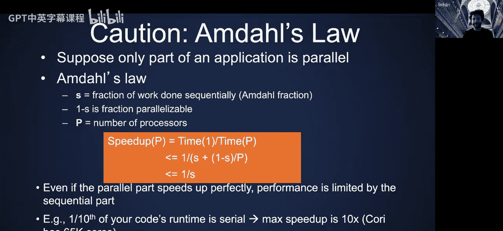

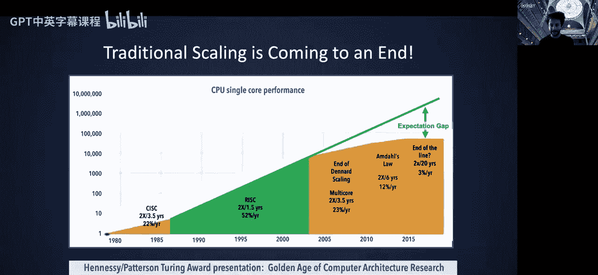

所以这真的是看待为什么需要并行性的一种方式。还有其他问题，比如热量，对吧？大约15年前的一个非常著名的图，人们发现，如果他们照常营业，并试图像90年代末那样提高频率，他们最终将达到太阳表面的功率密度。所以这就是为什么。我本科时得到了一台3 GHz的机器，已经很久了，我现在甚至得不到3 GHz的机器了，他们稍微降低了频率，以便能够添加更多核心。但这真的是关于泄漏，当晶体管变得如此之小时，很多功率实际上会耗散，这变得不可持续。所以你可以……动态功率与电压和频率的平方乘以电容成正比。人们找到的解决方案不是增加频率，他们仍然可以增加晶体管密度，但不增加频率，他们只是要添加更多处理器并放入越来越多的核心。这不仅是为了功耗，当然，那是真正的问题，即所谓的功耗墙。这样做的另一个好处是，串行处理器浪费了大量能量。为了提取大量性能，它们进行了大量推测执行，并在实际上从未实现的计算中浪费了大量能量。

所以我们仍然有更多的晶体管，从某种意义上说，摩尔定律，根据晶体管密度的定义，还没有消亡。它只是演变成了不同的东西：不是获得更高的时钟频率和更快的串行处理器（这通常无论如何都是一种幻觉），而是获得更多核心。消亡的是所谓的登纳德缩放，即晶体管尺寸按一定因子缩小，这使面积呈二次方减少，并形成了这种良性循环，最终功耗降低了50%。如果你太在意，可以阅读关于登纳德缩放的内容，但由于泄漏不再有效。

并行性的另一个好处是芯片制造商发现存在很多缺陷，他们不得不扔掉很多制造的处理器。所以如果他们在单个处理器中有很多核心，他们可以制造它，并设定一个最佳目标，比如他们可以对制造商说，给我们76个核心，如果其中最多8个是坏的，那也没关系，因为他们向客户宣传只有68个功能核心。这给了他们很大的余地，他们因此获得了良好的良率。所以有时当你购买芯片时，有可能里面有一些功能更多的芯片，只是没有启用，因为碰巧制造正确，公司并不指望它们功能正常。这是提高良率的一种方法。

我们已经讨论过这个，登纳德缩放已经消亡，因为功耗问题。期望是摩尔定律，晶体管密度将遵循它。但我们课程的要点是，软件将承担越来越重的负担，通过提取更多并行性来提供更好的性能。

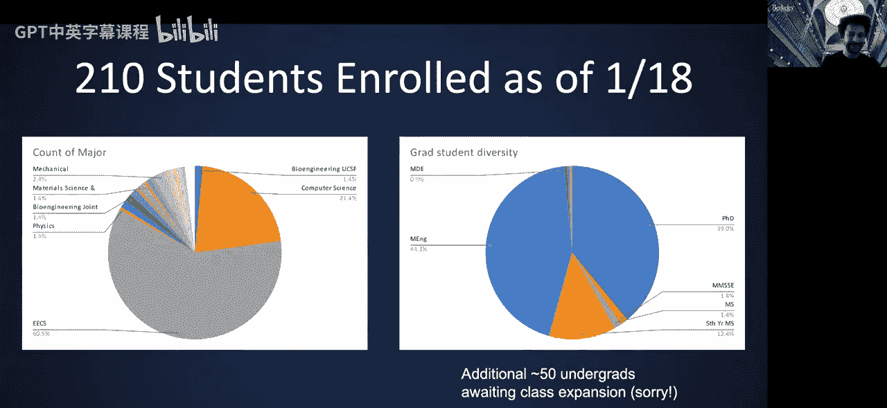

最后，我们得到了这个重新解释的摩尔定律：每个芯片的核心数量可以每两年翻一番，可能不会发生，但可以。时钟速度不会增加，可能只会降低，因为放入更多芯片可能会使你的整个处理器超出功耗预算，在这种情况下，芯片制造商可能会选择实际降低你的时钟速度。将会有很多并发线程，你必须处理线程间和线程内的并行性。实际上，如今有一种稍微不同的看法。如果你购买一台NVIDIA Mac笔记本电脑，你可能有一个M1处理器，它实际上是一个异构机器，里面有不同种类的CPU和不同种类的GPU，所以它也不再仅仅是同构并行性了。嗯，我不认为它结束了。仍然存在，所以也许在这之后我会更新幻灯片。

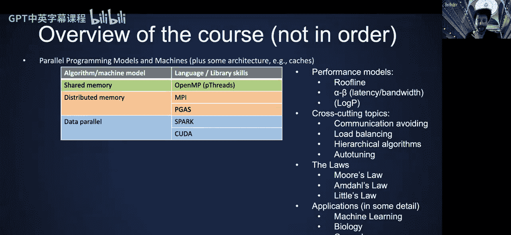

但总体而言，并行性无处不在。你能接触到的每一台机器都是某种并行性。这些图片实际上是同构核心。但很多从移动设备开始的东西，比如你的手机或iPad，已经拥有异构芯片，现在正进入更大的产品，比如我刚才提到的带有M1的笔记本电脑。因此将会有很多并行性，人们将利用它们。

## 阿姆达尔定律

有一个我们必须讨论的定律，叫做阿姆达尔定律。如果你有一个包含许多阶段的大型计算