# 003：内存层次结构与矩阵乘法

在本节课中，我们将学习计算机内存层次结构的基本原理，以及如何利用这些知识来优化算法性能，特别是矩阵乘法。我们将从简单的处理器模型开始，逐步深入到缓存、并行性等复杂概念，并通过一个具体的案例——矩阵乘法优化——来应用这些理论。

## 概述

在开始之前，有三件事需要提醒大家。

第一，请填写课前调查，以便我们更好地了解大家的背景，并为第一次小组作业进行分组。许多同学已经完成，但请尚未完成的同学尽快完成。

第二，课程项目的初步提案截止日期是1月27日。这并非最终决定，但我们会将其发布在B课程网站上，以便大家阅读、寻找有共同兴趣的同学，并可能为项目找到合作伙伴。

第三，大家应该已经收到了关于申请N账户以完成第一次作业的通知。

## 处理器与理想化模型

上一节我们介绍了课程的基本安排，本节中我们来看看单处理器的工作原理。讨论单处理器的原因是，大多数应用程序只能达到其峰值性能的10%左右，因此我们需要深入了解其内部机制。

### 理想化成本模型

最简单的处理器模型包含一个处理器和一片主内存。处理器执行操作时，需要从内存获取数据。

在这个模型中，程序中的变量（如整数、浮点数、数组、结构体）被映射到处理器可以理解的数据类型。处理器内部有专门的硬件单元（算术逻辑单元）来执行算术和逻辑运算。同时，处理器还需要控制指令的执行顺序，这由控制单元负责。

最简单的成本模型是：假设每个操作（如加法、乘法）的成本大致相同，并且忽略从主内存获取数据的成本。这就是理想化的成本模型。

### 现实成本模型

然而，现实情况并非如此简单。程序中的变量实际上是存储在地址空间中的字节和字，每个数据都有地址和大小，这会影响其访问成本。

编译器需要将高级语言中的语句（如if语句、循环）翻译成底层的机器指令。硬件则按照编译器指定的顺序执行这些指令。当写入数据时，数据会进入内存；当读取数据时，会获取最近写入的数据。编译器必须确保操作顺序正确，以保证程序的正确性。

以一个1GHz时钟频率的处理器为例，每个操作大约需要1纳秒。但从主内存读取数据的成本可能高达100纳秒，是加法、乘法等算术操作成本的100倍。

加载和存储操作在内存和寄存器之间移动变量，这些操作由编译器插入，对程序员基本不可见。这些“隐形”操作的成本可能比算术操作高出100倍。因此，理想化成本模型只是对现实成本的一个粗略近似。

### 编译器的作用

编译器通过生成汇编代码来工作。例如，对于语句 `C = A + B`，编译器需要执行以下步骤：从内存加载A到寄存器，加载B到另一个寄存器，将两个寄存器相加，最后将结果存回C对应的内存地址。

变量A、B、C在这里实际上是内存地址。正如之前所说，加载A、加载B、存储结果这三个指令的成本，可能比中间加法操作的成本高出100倍。

因此，编译器面临的问题是：如何利用有限的寄存器，最高效地使用从内存获取的数据？这是一个有大量研究的领域，这里只做简要介绍。

内存容量巨大（GB级别），而任何时刻可用于存储和进行算术运算的寄存器数量却很少（可能只有几十、几百或几千个）。

以下是编译器需要考虑的三行代码示例：

```
A = B + C
D = A * E
F = D - 1
```

编译器额外知道的信息是：在这段代码之后，变量A和E不再被使用，而变量B、C、D、F之后还会被使用。因此，编译器希望将B、C、D、F保留在寄存器中，避免再次存入内存的成本，而可以丢弃A和E。

优化的代码可能是：将B、C、D加载到寄存器中，然后计算A（可覆盖），接着计算E（可覆盖），最后计算F。这样，编译器用4个寄存器完成了原本需要6个寄存器的任务。

编译器通过构建一个图来分析变量之间的关系。图中的每个节点代表一个变量，如果两个变量在某个时刻需要同时存在（即“活跃”），则在它们之间连一条边。这样，编译器需要解决的问题就变成了：如何用最少的颜色（寄存器）为这个图着色，使得任何有边相连的两个节点颜色不同？这就是著名的**图着色问题**。

现代编译器（如Java的即时编译器）可能会使用更简单的方法，因为图着色分析本身需要一定的计算量。即使代码看起来很简单，编译器内部也隐藏着许多有趣的数学和算法。

### 编译器的优化

在后续课程，特别是第一次作业的提示中，我们会更多地讨论编译器的作用。以下是编译器可以执行的一些优化：

*   **循环展开**：将循环体复制多次，减少循环控制开销。
*   **循环融合**：将多个独立的循环合并为一个，减少控制开销。
*   **循环重排**：改变循环嵌套的顺序，以利用并行性或数据复用。
*   **死代码消除**：删除永远不会被执行到的代码。
*   **指令重排**：重新安排指令顺序，以复用寄存器中的数据，避免存入内存。
*   **强度削弱**：用更快的操作替换昂贵的操作，例如用移位代替乘以2的幂。

之所以介绍这些，是因为编译器虽然是我们的朋友，试图做最好的优化，但有时效果很好，有时则不然。程序员需要在一定程度上与编译器协调。例如，在矩阵乘法作业中，循环展开是一项优化。如果你手动进行循环展开，会影响编译器是否进一步展开循环的决策。因此，代码优化有时会变得比较复杂。

## 内存层次结构

我们已经讨论了处理器、寄存器和编译器的作用。现在，我们来看看内存层次结构。

### 更现实的处理器模型

当执行加载或存储指令，在处理器和主内存之间移动数据时，我们如何衡量其成本？实际上有两个硬件相关的参数。

第一个是**延迟**，即加载或存储一个特定数据所需的时间。在本课程中，我们将用 **α** 来表示延迟。

第二个是**带宽**，即如果你请求一长串连续的数据（一大块数据），数据会以流式方式传入，速度要快得多。第一个数据的到达需要等待延迟时间，但后续数据到达的速度要快得多。带宽通常用字节/秒表示，但我们取其倒数，即**每字节时间**，用 **β** 表示。

最简单的模型是：请求加载n个字所需的时间是 **α + β * n**，即延迟加上每字时间乘以字数。这是一个简单的线性模型。

为什么会有延迟和带宽两个参数？可以用水管来类比。带宽好比水管的粗细：细水管带宽低，单位时间流出的水少；粗水管带宽高。延迟则好比水管的长度：短水管延迟低，水很快到达；长水管延迟高，水需要更长时间才能到达。

### 带宽与计算速度的差距

计算机执行浮点运算的速度（以GFLOPS/秒衡量）远高于从内存获取数据的速度（以十亿字/秒衡量）。而且，这个差距（比率）随着时间的推移正在变得越来越大。

从1990年到2017年左右的历史数据图（纵轴为对数尺度）显示，带宽相对于浮点运算速度呈指数级下降，大约每5.2年慢一倍。因此，即使带宽今天不是瓶颈，明年或后年也可能成为瓶颈，算法设计需要考虑这一点。

内存延迟落后于浮点运算速度的程度更为严重，可能差好几个数量级。如果考虑网络（如以太网）或云计算中的通信，这些差距会更加巨大。

### 硬件的应对：缓存层次结构

硬件通过构建更多层次的内存（缓存）来应对这个问题。处理器和主内存之间会有多级缓存。

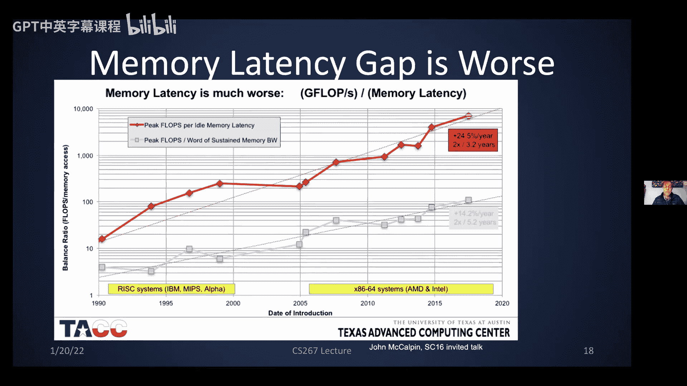

每一级缓存都比下一级更快，但容量更小。例如，芯片上的一级缓存可能比寄存器容量大100倍，但访问速度稍慢。由于一级缓存可能只有几千字的容量，仍然无法容纳所有数据，因此还需要片外容量更大、速度更慢的二级缓存，以此类推。

可以这样类比：假设你坐在书桌前需要写字，要找一支铅笔。
1.  首先看桌面，如果有铅笔，直接拿起来用（这相当于**寄存器**）。
2.  如果桌面上没有，你会打开抽屉，拿出一个小铅笔盒放到桌面上（这相当于**一级缓存**，铅笔盒相当于一个**缓存行**，因为你会一次性拿多支铅笔）。
3.  如果抽屉里也没有，你需要起身去壁橱拿一个大铅笔盒（这相当于**二级缓存**，耗时更长，但一次拿的铅笔更多）。
4.  最后，你可能需要去商店买铅笔，甚至砍树制作新铅笔（这相当于将数据存储到磁带或云端）。

随着缓存级别降低，其容量以数量级增加（KB、MB、GB、TB、PB），速度也以数量级下降（有时超过一个数量级）。

算法的目标是如何组织计算，以尽可能多地复用高速缓存中的数据。这里有两个关键思想：

1.  **空间局部性**：如果你要从主内存调入数组的一个元素，最好同时调入其相邻的多个元素，因为你很可能也会访问它们。这意味着访问之前访问过的地址附近的数据。
2.  **时间局部性**：重复使用之前访问过的数据项。例如，计算累加和时，累加变量`s`会被反复访问，因此应将其保留在缓存中。

硬件管理的缓存就是为利用空间和时间局部性而组织的。

### 缓存的工作原理

假设主内存中存储了一些值，问题是如何将它们放入缓存以便快速找到？由于缓存太小，无法存储所有数据，一个简单的方法是：根据内存地址来决定存储位置。

例如，如果你有一个值（比如基因组数据“ACTG”）存储在内存中，其地址以“00”结尾。那么，在缓存中，所有以“00”结尾的地址对应的数据都会存储在同一个位置。这意味着，如果有两个不同的内存条目都以“00”结尾，缓存只能选择存储其中一个。如果地址以“01”结尾，则存储在另一个位置。

对于一个大小为4的缓存，你可以查看地址的最后两位来决定存储位置。对于大小为1024的缓存，则查看最后10位。这是一种非常简单的缓存，称为**直接映射缓存**，因为通过地址的最后几位就能精确知道数据应放在缓存中的哪个位置，且每个位置只能存放一个值。这一切都由硬件管理。

当处理器执行加载指令时，如果所需数据已在缓存中（**命中**），则访问速度很快。如果所需数据不在缓存中（**缺失**），则需要更长时间，因为必须去主内存获取。

为了利用空间局部性，当处理器去内存获取某个特定地址（例如以“1100”结尾）的数据时，它不仅获取该地址的数据，还会获取相邻地址的数据。这些一次性获取的多个数据构成一个**缓存行**。这样，如果你的代码随后访问这些相邻数据，它们已经在缓存中，速度会快得多。

为了解决两个不同变量地址结尾相同、无法同时存入缓存的问题，硬件引入了**关联性**的概念。缓存允许在同一位置存储两个或四个（或其他数量）不同的值，这意味着缓存需要跟踪同一时刻有多少个不同的副本。

这在矩阵访问中很常见。假设一个二维数组按行存储。如果按行访问，相邻元素的地址是连续的，获取第一个元素时会同时获取该行的后续几个元素，访问效率高。如果按列访问，且矩阵维度是1024，那么同一列中相邻元素的地址最后10位总是相同，它们总是想去同一个缓存行，这会导致按列访问非常慢。而关联性允许同一列的几个元素同时存在于缓存中，从而提高了这类标准访问模式的速度。

### 多级缓存与复杂层次

为什么需要多级缓存？片上缓存（无需通过慢速片外连线访问）显然更快，但由于必须集成在芯片上，容量也更小。这意味着如果需要更大缓存，就必须使用片外缓存，而检查更长的地址和实现更高的关联性都需要更多时间。

因此，并非缓存级数越多越好。历史上，NCSA的一台旧超级计算机Cray T3E在两代产品之间就移除了一级缓存，因为缓存缺失检查的开销过大，移除一级反而减少了检查次数，提高了性能。

在Intel Haswell（Core架构的一部分）上，有一种特殊的缓存称为**受害者缓存**。当数据因为关联性不足而被从三级缓存中逐出时，不会直接放入慢速内存，而是存入这个受害者缓存。这避免了在数据不适合缓存时立即访问最慢内存的需要。

内存层次结构还有许多其他层面我们不会详细讨论。例如，如果数据无法完全放入DRAM，就必须使用磁盘，这时数据以**页**为单位进行交换（类似于缓存行，但大得多）。为了定位数据，有专门的硬件（**转译后备缓冲器**）来管理。

实际上，内存并不总是严格的层次结构。例如，在GPU编程中，我们会看到更复杂的结构。

### 应对内存延迟

内存延迟是最大的时间开销，最好的应对方法是尽可能多地复用高速内存中的数据。这意味着程序需要具备时间局部性，即重复使用已放入缓存的数据。

你也可以移动更大的数据块。例如，不是一次获取数组的一个元素，而是获取一整行甚至一个子矩阵，然后对其进行操作。这意味着算法需要具备空间局部性：访问一个数据时，很可能也会访问其附近的数据，因此最好一次性将它们全部调入。

有时，即使是在单处理器上，硬件也能在单条指令中执行多次读写。这些称为**SIMD指令**或**向量指令**。例如，可以同时将两个包含4个数的数组相加，硬件并行执行这4次加法。这是单处理器内部的并行性，你需要确保这4个数同时可用。

另一种方法是使用多线程来隐藏延迟。你可以让多个读写操作并行进行。例如，提前发出一个读取指令（**预取**），在真正需要数据时，它可能已经到达。编译器有时会帮你做这件事，或者你可以使用特殊的提示（如编译指导语句）来实现。

**写缓冲**是另一种技术，即等到更新完数据结构的所有条目后，再一次性写回内存。这两种技术（预取和写缓冲）都要求操作之间没有依赖关系，以确保不会读到过时的值。编译器需要非常小心地处理这些依赖。

### 隐藏延迟所需的并发度

为了以机器的全带宽速度运行，需要多少并发操作来隐藏延迟？排队论中有一个**利特尔定律**给出了答案：所需并发操作数等于延迟乘以带宽。

举个简单例子：假设延迟是10秒，带宽是2字节/秒。如果你一个接一个地加载数据，每10秒才能得到一个数据，远低于2字节/秒的速度。如果你希望硬件看起来在以2字节/秒的全速运行，可以想象同时发起20次读取请求。10秒后，20个字节到达，平均仍是2字节/秒。这样，你就通过足够的并发操作“掩盖”了延迟，以满带宽运行。

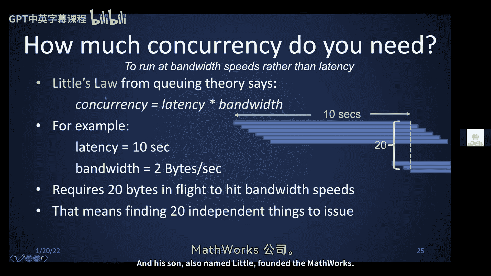

利特尔定律在两个方面使我们受益：其发明者是MIT教授，而他的儿子（同名）创立了MathWorks公司。如果你使用MATLAB，也间接受益于利特尔。

一个更现实的例子来自2005年的AMD Opteron处理器：延迟为160纳秒，带宽为6.4 GB/秒（即每64位缓存行10纳秒）。如果你能足够频繁地发出加载请求，让最多6个请求同时处于“在途”状态，就足以使带宽饱和。这些请求不需要同时发出，只需要**流水线化**即可。

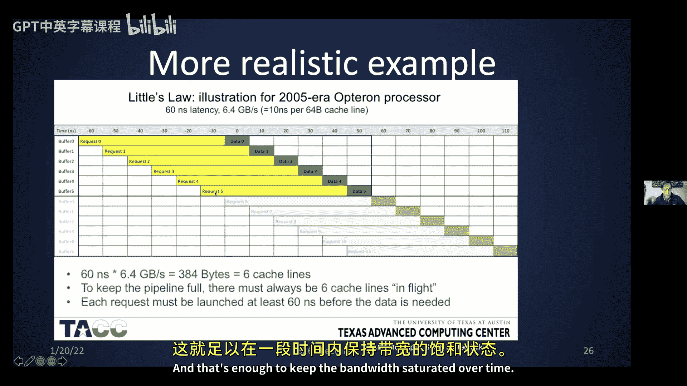

### 现代硬件示例：Core与KNL

以Core Haswell和KNL为例，了解现代硬件的概况。一个节点包含两个插槽，每个插槽有16个核心。每个核心运行在2.3 GHz，支持宽向量操作（一条指令可执行256位算术运算，相当于多个32位或64位操作）。理论上，每个节点的峰值性能可达1.2 TeraFLOPS。

KNL节点则有68个核心，每个核心速度较慢、功耗更低，但核心数更多。要充分利用它，需要找到更多的并行性。KNL内部有36个计算单元排列成6x6网格，通过2D网格互连，并连接本地RAM和片外资源。

面对如此复杂的硬件，如何抽象出一个简单的模型供程序员使用？答案是使用**基准测试**。

### 使用基准测试表征性能

**Cachebench**（或类似的**Stream**基准测试）可以用来估计硬件的延迟、带宽和缓存大小。其原理是：运行一系列不同长度的向量（数组）的循环，进行计时。

具体操作是：反复对数组所有元素求和，并计时。为了使计时准确，需要运行多次。多次运行还有另一个原因：如果数组长度小于缓存容量，第一次读取后数据会留在缓存中，后续迭代的访问会非常快。如果数组长度大于缓存容量，第一次读取后，部分数据会被后续读取的数据逐出缓存，导致第二次迭代需要重新从内存读取，速度会慢得多。

通过观察不同数组大小对应的运行速度（GB/秒），可以推断出缓存大小。图表中，速度平坦的区域表示数据完全在缓存中，速度陡降的点对应缓存容量边界。

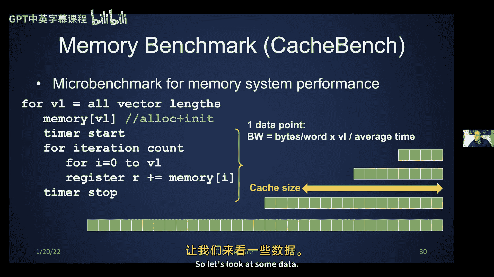

### 本节要点总结

本节要点如下：

1.  **性能是复杂的**：我们尚未解释基准测试图中所有的锯齿状线条，它们可能来自编译器优化或SIMD操作。
2.  **内存具有层次结构**：寄存器容量小，由编译器（或汇编程序员）管理；多级缓存由硬件管理。理解硬件行为对编写高效算法至关重要。不同层次在速度和容量上存在数量级差距，且这种差距随时间在扩大。
3.  **利用利特尔定律**：我们知道需要多少并发操作（同时进行的加载/存储）来隐藏延迟，以达到满带宽速度。

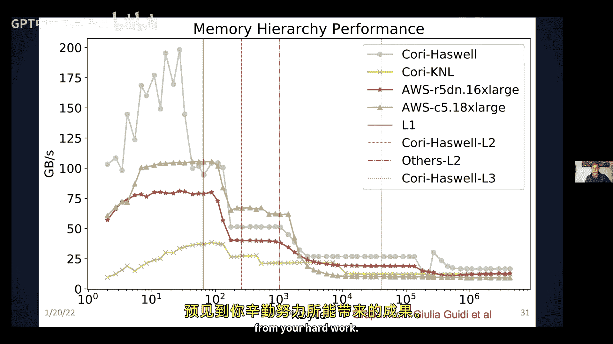

## 单处理器内部的并行性

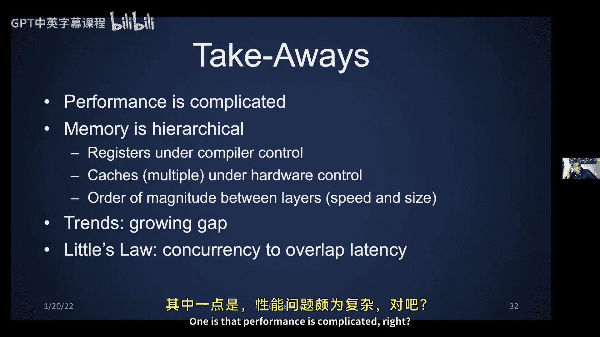

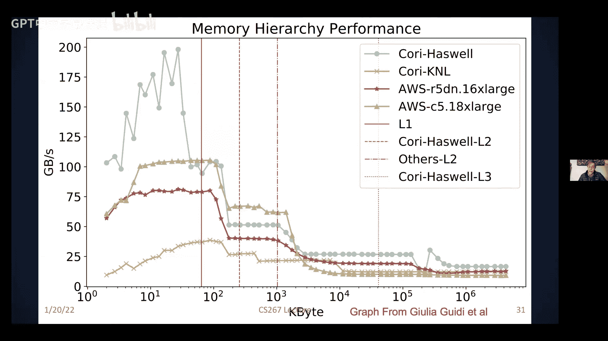

在深入矩阵乘法之前，我们先探讨单处理器内部的并行性，包括流水线。

### 流水线示例：洗衣店

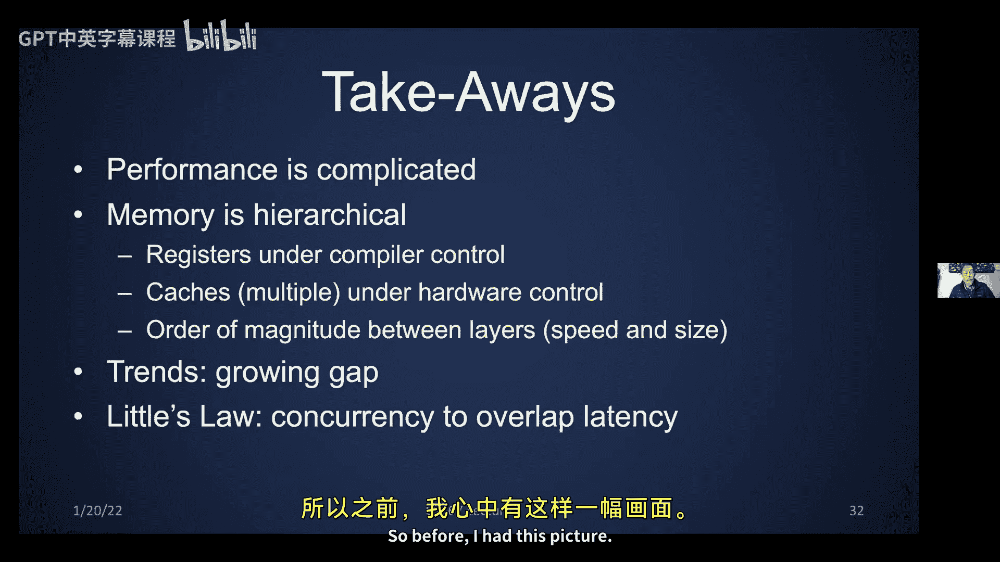

David Patterson教授常用洗衣店的例子来解释延迟和带宽。假设洗衣机需30分钟，烘干机需40分钟，折叠需20分钟。你有4桶衣物。

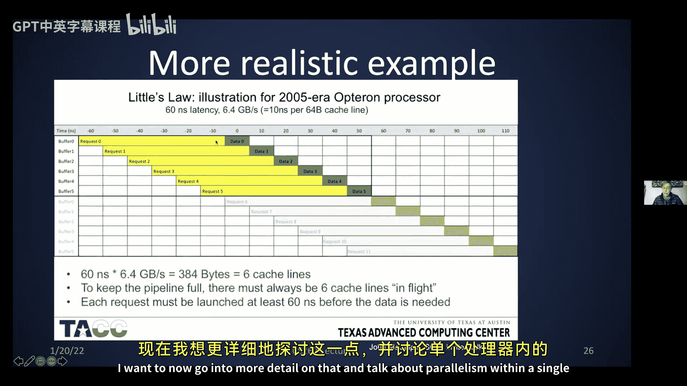

*   **非流水线方式**：等一桶衣物洗完、烘干、折叠完再开始下一桶，总时间为 4 * 90分钟 = 6小时。
*   **流水线方式**：一旦洗衣机空闲就启动下一桶洗衣，烘干和折叠也类似地重叠进行。这样，总时间约为3.5小时（启动时间30分钟 + 4桶*40分钟烘干 + 收尾折叠20分钟）。

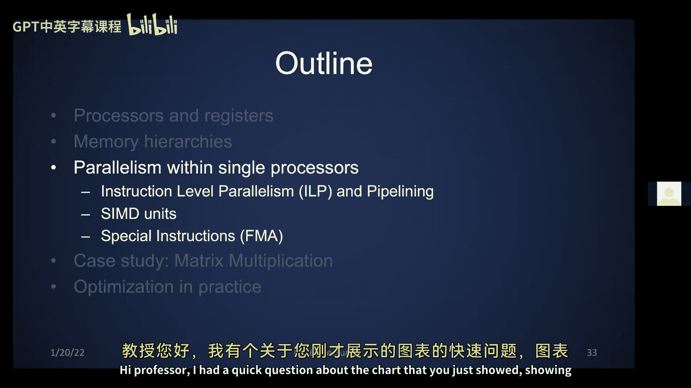

流水线不改变单桶衣物的处理延迟（仍是90分钟），但显著提高了吞吐率（带宽）。带宽受限于最慢的流水线阶段。在理想情况下，如果各阶段时间相等，峰值加速比上限就是流水线级数（本例中为3）。

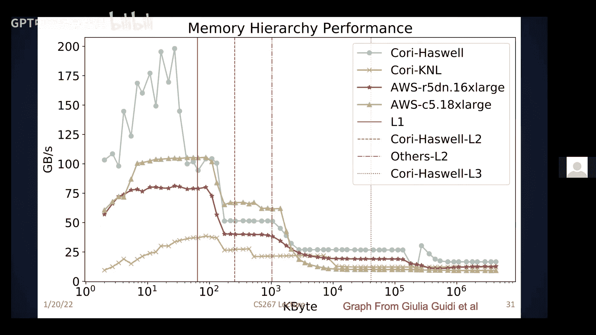

我们可以绘制洗衣效率随负载数量的变化图。负载越多，越接近峰值带宽。理想情况下，我们希望有大量任务通过流水线。

### 硬件中的流水线

流水线在硬件中广泛应用，甚至在执行基本指令时也是如此。典型的五级指令流水线包括：取指、译码、执行、访存（如果需要）、写回。硬件会智能地尝试并行执行不同指令，只要它们需要不同的硬件资源。

流水线也用于算术逻辑单元内部。例如，浮点乘法比加法慢，可能需要10个周期。但如果连续进行多个乘法，可以通过流水线使其达到每个周期完成一次的吞吐率。

### SIMD指令

大多数现代处理器支持**单指令多数据**指令。传统的加法操作是对两个寄存器中的单个数值进行运算。而SIMD指令可以同时对多个寄存器中的多个数值进行运算，例如，将四个寄存器中的四个值分别与另外四个寄存器中的四个值相加，结果存入另一组四个寄存器。

在KNL上，这通过AVX-512单元实现。该单元可以并行处理512位数据。例如，可以同时进行8次双精度加法（8 * 64位 = 512位），或16次单精度加法，甚至更多次低精度运算。硬件会自行重新配置以支持不同的数据类型。

所有这些操作（加法、乘法、逻辑运算）都是并行完成的。程序员需要通过循环展开或给编译器提示来暴露并行性。数据必须存储在连续的内存位置，编译器才有可能生成SIMD代码，并且通常应对齐到缓存行起始地址，以提高效率。

### 阻碍编译器优化的因素

为什么编译器不能总是自动进行这些优化？因为如果为了并行性而重新安排操作顺序，可能会得到错误的结果。硬件中称之为**冒险**，编译器中称之为**依赖**。主要有三种类型：

1.  **写后读冒险**：如果先执行 `B = x`，再执行 `x = A`，那么B得到的是x的旧值，而不是A的值。
2.  **读后写冒险**：如果先执行 `x = A`，再执行 `A = x`，那么A最终等于x的旧值，而不是B。
3.  **写后写冒险**：如果乱序执行两个对x的写操作，x最终的值可能是错误的。

好消息是，读后读没有风险，顺序无关紧要。

硬件或编译器如果检测到这类依赖，就不能重新调度指令，否则会得到错误答案。判断依赖是否会发生有时很困难，因此编译器可能采取保守策略。

另一个问题是**非连续内存访问**可能更慢。例如，按列访问按行存储的二维数组，或者使用间接寻址（通过一个数组的索引访问另一个数组的元素，称为**聚集**或**散播**）。判断两个访问是否会冲突可能非常复杂，有时需要程序员介入。这在图论和稀疏矩阵计算中很常见。

### 融合乘加指令

大多数硬件都有特殊的**融合乘加**指令。它接受三个数，计算 `a * b + c`，结果只进行一次舍入，比分别执行乘法和加法更快、更精确。这正是点积或矩阵乘法的内循环操作，利用它可以获得两倍的加速，并且对某些高精度算法也有用。

### 对程序员的启示

理想情况下，编译器应理解所有这些，并重新安排指令以最大化并行性，使用融合乘加和SIMD指令，同时理解所有依赖以避免冒险。但在实践中，编译器可能需要程序员的帮助，因为它可能不够智能。

例如，你可能知道两个数组不重叠，但编译器出于谨慎可能假设它们重叠，从而限制优化。你可以通过优化标志、重新组织代码或使用内部函数来帮助编译器。

对于像矩阵乘法这样已经高度优化的算法，你可能无需担心。但还有许多程序尚未得到如此充分的优化。

Graham教授及其学生有一篇优秀的综述，详细介绍了编译器通常进行的各种优化，包括更通用的代码重组，如循环合并、改变循环顺序（在依赖允许的情况下）以获得更多数据复用等。

### 本节要点总结

本节要点如下：

*   每个串行处理器内部实际上都隐藏着并行性，包括指令级并行、SIMD指令和融合乘加。
*   编译器会提供帮助，但程序员可以在其基础上做更多优化。

## 案例研究：矩阵乘法优化

现在，我们开始矩阵乘法的案例研究。今天不会讲完，我们会先建立一个简单的性能模型，分析一个更简单的算法（矩阵向量乘法）作为热身，然后介绍分块矩阵乘法。下节课我们将继续讨论缓存无关算法。

### 为什么选择矩阵乘法？

矩阵乘法是许多问题中的重要核心。稠密线性代数是各类应用中的常见模式，而矩阵乘法是所有其他稠密线性代数算法的基础。

它也适用于其他看似不同的问题，如图论中的传递闭包，本质上也是矩阵乘法。如今，大多数计算机时间可能花在训练神经网络上，而矩阵乘法正是其瓶颈。这就是为什么Google等公司专门构建张量处理单元来加速矩阵乘法。

矩阵乘法的优化思想可以推广到许多其他领域。从某种意义上说，它是“最佳案例”，我们可以获得数量级的加速。它确实是高性能计算中研究最深入的算法。

### 性能提升空间

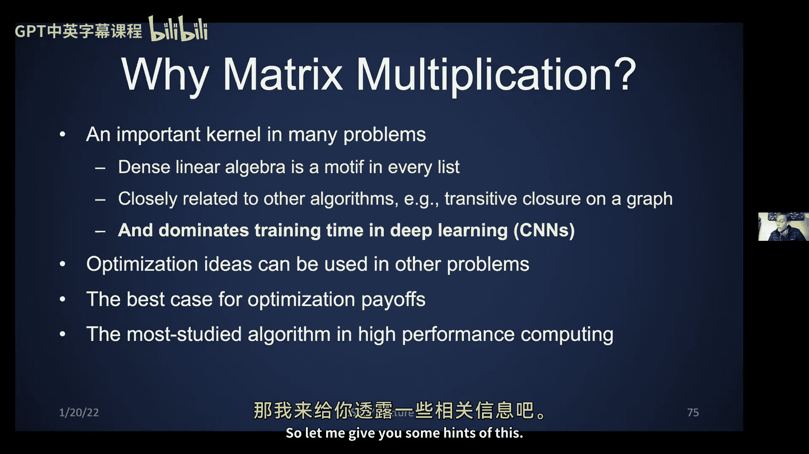

前UC Berkeley博士生（后成为康奈尔大学教授）的图表展示了矩阵乘法的三种性能曲线：纵轴是速度（越高越好），横轴是矩阵维度。

*   **朴素三层循环**：当矩阵大到无法放入缓存时，性能非常低。
*   **基础分块版本**：通过减少缓存缺失，性能显著提升，尽管理论上仍有改进空间。
*   **精心优化的实现**：获得了更高的性能分数。

与硬件供应商的优化版本相比，供应商的实现要快3到4倍，因为他们利用了迄今为止讨论的所有优化手段，甚至更多。这展示了在第一次作业中可能获得的性能提升空间。

### 内存模型与性能模型

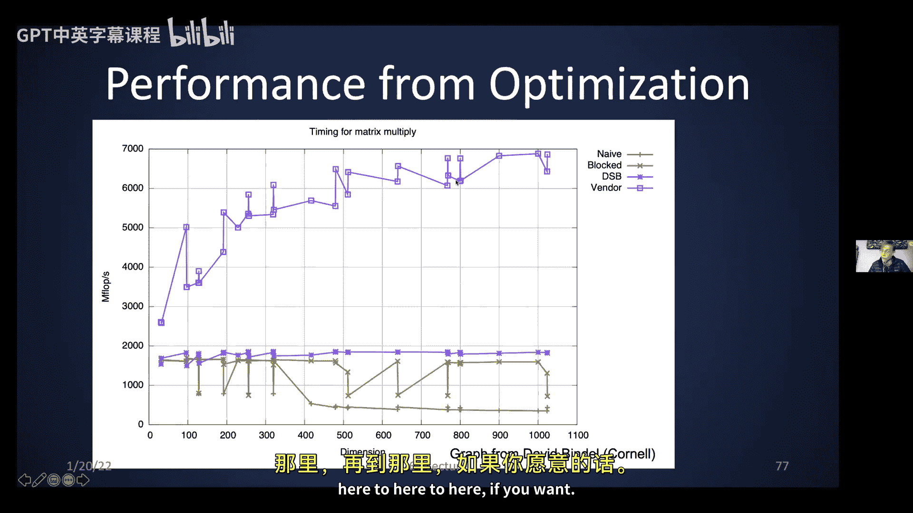

为了指导算法设计，我们建立一个简化的内存模型：假设只有两级内存（快和慢）。初始数据都在慢速内存中，我们关注在快慢内存之间移动的数据量。

我们将编写代码并建立性能模型。需要计算：
*   **M**：在快慢内存之间移动的字数，取决于算法。
*   **β**：每次慢速内存操作的时间（带宽的倒数），取决于硬件。
*   **F**：执行的浮点运算次数。对于经典矩阵乘法，`F ≈ 2 * n^3`。
*   **t_f**：每次算术运算的时间，远快于移动一个字的内存。

我们还将定义**计算强度**：算法执行的浮点运算次数除以其导致的慢速内存移动量。我们希望计算强度尽可能高，即在移动少量数据的同时进行大量计算。

算法的最小可能运行时间是当所有数据都已存在于快速内存中时，此时 `M = 0`，最小时间为 `F * t_f`。

实际运行时间是：`Time = F * t_f + M * β`。提取公因子 `F * t_f`，得到 `Time = F * t_f * (1 + (β/t_f) * (1/(F/M)))`。

其中，`β/t_f` 是**机器平衡**，由架构决定，我们无法控制。`F/M` 是计算强度，取决于算法。由于 `β/t_f` 通常很大，我们希望计算强度也很大，以使乘积项变小，时间接近最小值 `F * t_f`。

### 热身：矩阵向量乘法

我们先分析矩阵向量乘法 `y = A * x`。最简单的算法是两层循环：外层遍历行i，内层遍历列j进行点积。

假设快速内存足够容纳三个长度为n的向量（x, y, A的一行），但无法容纳整个矩阵A。初始数据都在慢速内存中。

操作计数：
*   读取x一次，读取y一次，写入y一次：`3n`次。
*   读取A的每一行一次：`n^2`次。
*   总内存操作：`M ≈ n^2 + 3n`。
*   算术运算：`F ≈ 2n^2`。
*   计算强度：`F/M ≈ 2`。

这个计算强度很低，意味着矩阵向量乘法受限于慢速内存速度，优化空间有限。

### 朴素矩阵乘法

现在看朴素的三层循环矩阵乘法 `C = A * B`。

*   算术运算：`F ≈ 2 * n^3`。
*   涉及的数据量：三个 `n x n` 矩阵，共 `3 * n^2` 个字。
*   理论上，如果奇迹般地只读一次A、B、C，计算强度上限可达 `O(n)`。这比矩阵向量乘法的上限 `O(1)` 好得多，表明存在优化潜力。

但在朴素实现中，我们假设快速内存只能容纳A的一行、B的一列和C的一个元素。分析其内存访问：
*   外层循环i：读入A的第i行。
*   中层循环j：读入C(i,j)。
*   内层循环k：读入B的第j列（每次内层点积都需要整个B列？实际上，对于固定的i, j，内层k循环遍历A的第i行和B的第j列进行点积。但B的同一列会被外层i循环重复读取）。
*   最终，B的每一列被读取n次（因为外层i循环n次），导致读取B的总次数为 `n^3`。
*   A的每一行读取一次：`n^2`。
*   C的每个元素读写各一次：`2 * n^2`。
*   总内存操作：`M ≈ n^3 + 3n^2`。
*   计算强度：`F/M ≈ 2`，与矩阵向量乘法一样糟糕。

### 分块矩阵乘法

存在更好的方法：**分块**或**平铺**。

我们将矩阵视为由 `B x B` 大小的块组成的 `N x N` 块矩阵，其中 `N = n / B`。算法变为六层循环：外层三层循环遍历块索引，内层三层循环在块内执行小矩阵乘法。

内层的小矩阵乘法（`B x B` 块）如果能够完全放入快速内存（即三个 `B x B` 块同时放入缓存），则在执行内层计算时就不再有额外的内存流量。这正是性能提升的关键。

具体能提升多少，以及如何选择最优的B，我们将在下节课详细讨论。

## 总结

本节课中，我们一起学习了：
1.  计算机内存层次结构的基本原理，包括缓存、空间局部性和时间局部性。
2.  如何利用基准测试来表征硬件性能。
3.  单处理器内部的并行性，如流水线和SIMD指令。
4.  编译器在优化中的作用及其局限性。
5.  通过一个简单的性能模型分析算法效率，并应用于矩阵向量乘法和朴素矩阵乘法。
6.  引入了分块矩阵乘法的概念，作为优化矩阵乘法的关键思路。

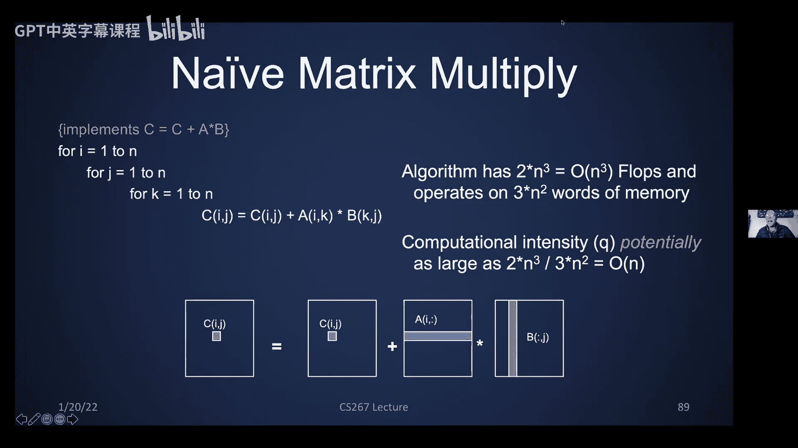

下节课我们将继续深入矩阵乘法的优化，并讨论缓存无关算法。