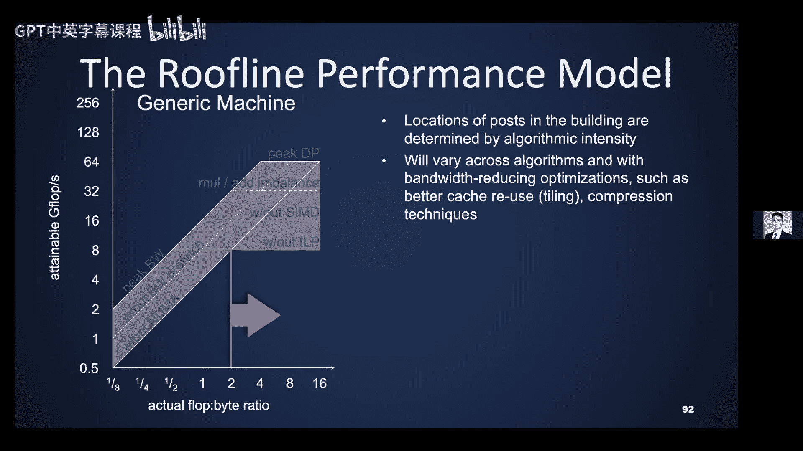

# 004：更多矩阵乘法与Roofline模型 🚀


在本节课中，我们将继续深入学习矩阵乘法，并介绍一个重要的性能分析模型——Roofline模型。我们将探讨如何通过优化算法来减少内存访问，从而提高计算效率。

## 概述 📋

我们将首先回顾一个简单的内存层次模型，并基于此模型分析矩阵乘法的性能瓶颈。接着，我们会介绍两种优化算法：分块矩阵乘法和递归矩阵乘法。最后，我们将引入Roofline模型，这是一个直观的工具，用于评估算法在特定硬件上的性能上限，并指导我们进行优化。

---

## 简单内存模型回顾 💾

上一节我们介绍了矩阵乘法的基本概念。本节中，我们来看看用于分析算法性能的一个简单内存模型。

我们假设内存层次结构只有两级：快速内存（如缓存）和慢速内存（如主存）。所有数据最初都位于慢速内存中。我们使用以下参数来衡量性能：
*   **M**：在快慢内存之间移动的字数。这是我们要通过优化算法来减少的瓶颈。
*   **T_m**：慢速内存读写一个字所需的时间。我们主要关注带宽，而非延迟。
*   **F**：算法执行的浮点运算次数。在本讲开头的算法中，这大约是 `2 * n^3`。
*   **T_f**：执行一次浮点运算的时间。
*   **计算强度**：定义为 `I = F / M`，即每次慢速内存访问平均执行的浮点运算次数。我们希望这个值尽可能高，以实现数据重用并最小化 `M`。

计算强度是衡量算法效率的指标。理想情况下，如果所有数据都能放入快速内存，最短时间为 `F * T_f`。但实际时间必须加上数据移动的时间：`T = F * T_f + M * T_m`。我们可以将其视为最小时间乘以一个大于1的因子：`T = F * T_f * (1 + (T_m/T_f) / I)`。

这里，`B = T_m / T_f` 被称为**机器平衡**，它表示在移动一个字的时间内可以执行的浮点运算次数。这个数字通常远大于1，并且随着技术进步而增长。我们希望计算强度 `I` 尽可能大，以使 `B / I` 这个乘积尽可能小。

---

## 朴素矩阵乘法及其问题 ❌

让我们回顾一下为什么朴素的矩阵乘法效率低下。

朴素算法就是三层嵌套循环。内层循环计算矩阵 `A` 的第 `i` 行与矩阵 `B` 的第 `j` 列的点积，结果存入 `C[i][j]`。在我们之前的分析中，如果矩阵无法完全放入快速内存（这是我们的假设），那么每次读取 `B` 的一列后，都需要为 `A` 的每一行重新读取该列以进行点积计算。因此，`B` 的每一列将被读取 `n` 次（`n` 为矩阵维度），导致对矩阵 `B` 的读取次数达到 `n^3` 量级。其计算强度大约只有 `2`（即每移动一个字执行约2次浮点运算），与矩阵向量乘法类似，没有获得任何数据重用的好处。

那么，我们如何改进呢？

---

## 分块矩阵乘法 🧱

上一节我们介绍了分块矩阵乘法的概念。本节中，我们来看看它的具体实现和性能分析。

其核心思想是将 `n x n` 的矩阵视为由 `B x B` 的小块组成的大矩阵。我们假设可以同时将三个这样的 `B x B` 块（分别来自 `A`、`B` 和 `C`）放入快速内存（缓存）。然后，我们读取 `A` 和 `B` 的对应块，在缓存中执行 `B x B` 的矩阵乘法来更新 `C` 的对应块。这样，我们只在必要时将每个数据块读入缓存一次。

以下是带注释的代码，便于我们统计读写次数：

```c
for (i = 0; i < N; i++) { // N = n/B， 大矩阵的维度
    for (j = 0; j < N; j++) {
        // 将 C[i][j] (B x B 块) 读入缓存（或初始化为零）
        for (k = 0; k < N; k++) {
            // 将 A[i][k] (B x B 块) 读入缓存
            // 将 B[k][j] (B x B 块) 读入缓存
            // 执行 C[i][j] += A[i][k] * B[k][j] (B x B 矩阵乘法)
        }
        // 将更新后的 C[i][j] 块写回慢速内存
    }
}
```

实际上，内部的 `B x B` 矩阵乘法本身也是三层循环，所以整个算法是六层嵌套循环。关键在于，如果三个蓝色块能同时放入快速内存，那么在执行内部的小矩阵乘法时，就不会产生额外的内存流量。

现在让我们更仔细地统计内存流量，假设三个 `B x B` 块能同时放入快速内存：
*   **C 的读写**：每个 `C` 的块被读写恰好一次。共有 `N^2` 个块，每个块大小为 `B^2`。总数据量为 `2 * N^2 * B^2 = 2 * n^2`（因为 `N * B = n`）。这是下界，即每个 `C` 的元素只被读写一次。
*   **A 的读取**：在内部的三层循环中，每个 `A` 的块被读取 `N^3` 次。总数据量为 `N^3 * B^2 = N * n^2`。
*   **B 的读取**：与 `A` 类似，总数据量也为 `N * n^2`。

因此，移动的总字数 `M` 约为 `2 * n^2 + 2 * (N * n^2)`。计算强度 `I = F / M ≈ (n^3) / (N * n^2) = n / N = B`。所以，只要矩阵足够大，计算强度就约等于块大小 `B`。

显然，我们希望 `B` 尽可能大以获得更高的计算强度。那么 `B` 能有多大呢？这受到我们假设的限制：三个 `B x B` 块必须能放入快速内存。即 `3 * B^2 <= M`（`M` 为快速内存容量）。解得 `B <= sqrt(M/3)`。这给出了使用这种方法所能达到的计算强度的理论上限。

---

## 递归矩阵乘法 🔄

分块算法需要根据硬件缓存大小来调整块大小。如果有多级缓存，实现将变得复杂。是否存在一种方法能避免这些复杂性呢？

答案是肯定的，我们可以使用递归矩阵乘法。这种方法在理论上能达到与分块算法相似的性能，但代码本身不显式依赖于硬件参数。

其思想源于一个代数恒等式：一个 `2x2` 的块矩阵乘法可以分解为8个子矩阵乘法和4个子矩阵加法。这个恒等式不仅对标量成立，当每个子块都是 `n/2 x n/2` 矩阵时也成立。这样，我们就将一个 `n x n` 的矩阵乘法递归地分解为许多更小的 `n/2 x n/2` 矩阵乘法。

以下是递归矩阵乘法的伪代码：

```c
function RMM(A, B, C, n):
    if n == 1:
        C[0][0] = A[0][0] * B[0][0] // 基本情况
    else:
        // 将 A, B, C 划分为 n/2 x n/2 的子块
        // 递归计算8个子矩阵乘法
        RMM(A11, B11, C11, n/2) // C11 = A11*B11
        RMM(A11, B12, C12, n/2) // C12 = A11*B12
        // ... 其他6个递归调用
        // 然后执行4个子矩阵加法（例如 C11 += A12*B21 等）
```

让我们分析其运算量和数据移动量。
*   **运算量**：设 `F(n)` 为规模 `n` 的运算次数。递归式为 `F(n) = 8 * F(n/2) + 4 * (n/2)^2`（当 `n>1`）。解此递归式可得 `F(n) ≈ 2 * n^3 - n^2`，与标准算法基本相同，只是运算顺序不同。
*   **数据移动量**：设 `W(n)` 为规模 `n` 时移动的字数。递归式为 `W(n) = 8 * W(n/2) + 4 * 3 * (n/2)^2`（当 `3 * n^2 > M`，即问题规模大于缓存时）。如果 `A`、`B`、`C` 能放入缓存，则 `W(n) = 3 * n^2`（读写各一次）。解此递归式可得 `W(n) = O( n^3 / sqrt(M) + n^2 )`，这与分块矩阵乘法的结果一致。

因此，递归算法无需知道架构细节就能达到近似最优的数据移动量。如果存在多级缓存，且缓存策略合理，该算法能自动最小化各级缓存间的数据移动。这种算法被称为**缓存无关算法**。

在实践中，递归不会一直进行到 `1x1`，而是在问题规模小到可以调用一个高度优化的微内核（针对特定大小，且数据已在缓存中）时停止。这样结合了递归的优雅和微内核的高效。

---

## 数据布局优化：拷贝优化与Z阶存储 📊

为了最大化内存带宽，连续访问内存通常效率最高。因此，有时在算法开始前对输入数据进行重排是值得的，这称为**拷贝优化**。

有两种常见的方法：
1.  **分块存储**：将矩阵划分为 `B x B` 的块，然后按块的行主序存储。这适用于单级缓存，但需要根据缓存大小选择 `B`。
2.  **Z阶存储**：这是一种递归数据布局。对于一个 `N x N` 的矩阵，先存储其左上象限，然后是右上、左下、右下象限。对每个象限，再递归地应用同样的Z形顺序进行存储，直到达到某个阈值后切换为简单的行主序存储。这种布局能保证无论访问哪个子矩阵，其数据在内存中大致连续，且不依赖于具体的缓存层次结构，但索引计算会更复杂。

---

## 理论下界与扩展 🧮

对于经典的 `2n^3` 次浮点运算的矩阵乘法，存在一个理论下界：任何只利用加法和乘法交换律、结合律进行重排的算法，其计算强度 `I` 不能超过 `O(sqrt(M))`。换句话说，在快慢内存间移动的数据量 `M` 的下界是 `Ω( n^3 / sqrt(M) )`。我们之前介绍的分块算法和递归算法都达到了这个下界（在常数因子内）。

这个理论可以扩展到许多其他场景：
*   **并行矩阵乘法**：存在可达到的通信下界。
*   **延迟优化**：除了带宽，延迟也是重要的优化目标。
*   **其他线性代数运算**：如高斯消元、最小二乘、张量收缩等。
*   **稀疏线性代数**。
*   **更通用的循环嵌套代码**：包括图算法（如全对最短路径）、N体问题等。

当然，对于存在计算依赖性的算法（如高斯消元中不能任意重排操作），如何结合依赖关系进行优化仍然是开放的研究问题。

---

## Strassen算法：超越n^3 🪄

到目前为止，我们讨论的都是 `O(n^3)` 复杂度的算法。但事实上，存在更快的矩阵乘法算法。

Strassen算法是第一个被发现的亚立方复杂度算法。其核心在于一个“魔法”般的 `2x2` 矩阵乘法公式，它只用 **7** 次乘法和18次加减法，而不是通常的8次乘法和4次加法。虽然对于真正的 `2x2` 矩阵这不划算，但当应用于分治算法时，7次递归调用比8次要少，而额外的加减法代价较低。

递归式为 `F(n) = 7 * F(n/2) + 18 * (n/2)^2`。这导致时间复杂度为 `O(n^{log_2 7}) ≈ O(n^{2.81})`。经过多年优化，Strassen算法在实践中对于大规模矩阵确实更快。

通信下界理论也可以扩展到Strassen类算法，其通信量下界为 `Ω( n^{log_2 7} / M^{(log_2 7)/2 - 1} )`，并且存在达到该下界的算法。

自1969年Strassen算法提出以来，矩阵乘法的指数被不断改进，但进展缓慢，主要是在尾数位上的优化。最新的世界纪录（2020年）将指数降至约2.37286。

尽管Strassen算法在数值稳定性上稍逊于经典算法，但其未被广泛使用的一个主要原因是行业基准测试（如LINPACK）要求使用经典 `O(n^3)` 算法进行公平比较，导致硬件厂商主要优化经典算法。

---

## 实践中的矩阵乘法：BLAS标准 📚

由于矩阵乘法极其重要，业界建立了BLAS标准来提供跨平台的优化例程。
*   **BLAS 1级**：向量运算（如点积），`O(n)` 运算量。
*   **BLAS 2级**：矩阵-向量运算，`O(n^2)` 运算量。
*   **BLAS 3级**：矩阵-矩阵运算，`O(n^3)` 运算量。

高级线性代数库（如求解线性系统）通常被重组成在内部循环中调用BLAS 3级例程（如矩阵乘法），以利用其高计算强度。

性能数据显示，优化良好的矩阵乘法（DGEMM）可以接近机器的峰值浮点性能，而矩阵-向量乘法（DGEMV）则只能达到峰值的一小部分，这凸显了计算强度的重要性。

---

## Roofline性能模型 🏠

现在，我们进入本讲的第二部分：Roofline模型。这是一个用于评估算法在给定硬件上性能上限的直观模型，能帮助我们识别性能瓶颈和优化机会。

### 为什么需要性能模型？
性能模型帮助我们理解算法在新架构上的行为，判断离硬件极限还有多远，以及优化工作是否值得。Roofline模型特别擅长可视化地展示算法是受限于计算能力还是内存带宽。

### 模型构成
Roofline模型包含三个部分，两个描述机器，一个描述应用：
1.  **机器峰值浮点性能**：单位是每秒浮点运算次数。这取决于时钟频率、指令级并行、SIMD、核心数等。
2.  **机器峰值内存带宽**：单位是每秒字节数。通常指从DRAM到最快缓存级别的带宽。
3.  **应用的计算强度**：单位是每次字节移动所执行的浮点运算次数。

### 模型图示
在一个双对数坐标图中：
*   **横轴**：计算强度。
*   **纵轴**：可达的每秒浮点运算次数。
*   **“屋顶”**：由两条线构成：
    *   **水平线**：代表机器的峰值浮点性能。这条线可能有多层，例如：峰值双精度性能、仅加法时的性能、无SIMD时的性能、无指令级并行时的性能。每一层都代表利用了一种硬件特性。
    *   **斜线**：代表受限于内存带宽的性能上限。其斜率为1（在对数坐标下），起点在横轴为0、纵轴为带宽的位置。这条线也可能有多层，例如：峰值带宽、无软件预取时的有效带宽、在非均匀内存访问中访问远端内存时的带宽等。

### 如何解读
在图中为你的算法画一个点，其横坐标是算法的计算强度，纵坐标是实测性能。
*   如果该点位于斜线区域，说明算法受**内存带宽**限制。优化方向是提高计算强度（如通过分块）或改善有效带宽（如使用预取）。
*   如果该点位于水平线区域，说明算法受**计算能力**限制。优化方向是更好地利用硬件并行性（如使用SIMD、提高ILP）。
*   该点与屋顶的垂直距离显示了性能提升的潜力。

### 示例与应用
*   **Triad基准测试**：`A[i] = B[i] + s * C[i]`。计算强度很低（约0.083），性能点位于斜线区域，受带宽限制。
*   **七点Stencil计算**：在三维网格中，每个点更新为其自身加上六个邻居的加权和。朴素实现计算强度低。如果通过循环重排利用时间局部性，可以将计算强度提高数倍，从而使性能点向右上方移动，更接近屋顶。
*   **实际算法分析**：对DGEMM、Stencil、稀疏矩阵向量乘等算法的Roofline分析显示，它们分布在图的不同位置，清晰地揭示了各自的瓶颈。

### 要点总结
Roofline模型是一个简单而强大的工具，它通过比较计算强度和硬件平衡点，快速给出性能上限。它最初用于单处理器和对称多处理器，现已广泛应用于各种需要区分计算瓶颈和内存带宽瓶颈的场景。对于课程项目，使用Roofline模型分析代码性能，可以帮助你明确优化方向和潜力。

---

## 总结 🎯

本节课中，我们一起深入学习了矩阵乘法的优化：
1.  我们回顾了基于两级内存模型的性能分析，并指出计算强度是关键。
2.  我们学习了**分块矩阵乘法**，通过数据重用显著提高了计算强度，其理论上限约为 `sqrt(M/3)`。
3.  我们介绍了**递归矩阵乘法**，这是一种缓存无关算法，无需显式参数就能达到近似最优的数据移动。
4.  我们探讨了**Strassen算法**，它通过巧妙的分解将复杂度降至 `O(n^{2.81})`，并且也存在相应的通信下界。
5.  我们了解了实践中通过**BLAS标准库**来调用高度优化的矩阵运算。
6.  最后，我们引入了**Roofline性能模型**。这个模型结合了硬件峰值性能、峰值带宽和算法的计算强度，以直观的方式揭示了算法的性能瓶颈和优化潜力，是指导高性能代码开发的重要工具。



理解这些概念和模型，将帮助你在未来设计或优化计算密集型应用时，能够系统地分析并提升其性能。