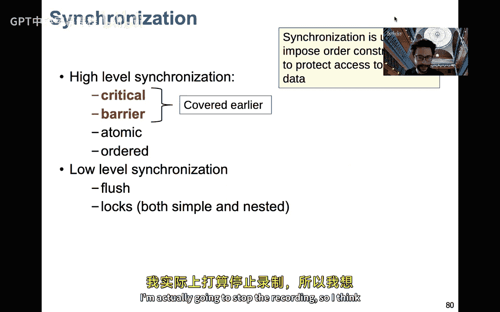

# 005：共享内存编程（主要使用OpenMP） 🧵


在本节课中，我们将学习共享内存编程的基础知识，并重点介绍你将用于完成作业的平台——OpenMP。我们将从共享内存架构的回顾开始，然后深入探讨OpenMP的语法、核心概念以及实际应用中的注意事项。

## 共享内存编程基础回顾

上一讲我们介绍了不同的并行架构。本节中，我们来看看共享内存架构的特点。

一个共享内存系统由多个处理器、一个连接处理器与内存的网络组成。这个网络的设计方式决定了它是共享内存架构还是分布式内存架构。

一个程序是多个控制线程的集合。线程可以在执行过程中动态创建。每个线程都有自己的私有变量（通常在栈上）和一些共享变量。线程间的通信通常不是通过显式的消息传递，而是通过读写共享变量隐式进行的。同步也通常基于共享变量。

你可以将其概念化为下图：每个线程有自己无法被其他线程访问的私有内存，以及一个所有线程都能访问的共享内存。

## 使用Pthreads进行编程

在深入OpenMP之前，我们先简要了解一种底层的共享内存编程方式：Pthreads。

Pthreads（可移植操作系统接口线程）是Unix-like平台上通用的线程编程接口。它支持并行性和同步，但没有对通信的显式支持。使用Pthreads时，你需要手动管理线程的创建、销毁和工作分配。

以下是一个创建线程的基本示例：
```c
#include <pthread.h>
void* say_hello(void* arg) {
    printf("Hello World\n");
    return NULL;
}
int main() {
    pthread_t threads[16];
    for (int i = 0; i < 16; i++) {
        pthread_create(&threads[i], NULL, say_hello, NULL);
    }
    for (int i = 0; i < 16; i++) {
        pthread_join(threads[i], NULL);
    }
    return 0;
}
```
使用 `-lpthread` 标志编译此代码，它会创建16个线程，每个都打印“Hello World”。

然而，Pthreads是命令式的：当你调用 `pthread_create` 时，线程必须被创建。这可能导致处理器超额订阅（创建过多线程）和显著的线程创建/销毁开销。为了获得良好的加速比，你需要手动将工作平衡地划分给线程，并确保每个线程有足够的工作量来分摊开销。

## 数据竞争与互斥锁

在共享内存编程中，一个核心且危险的概念是**数据竞争**。

当多个执行线程访问同一个变量，并且至少有一个线程进行写操作时，就会发生数据竞争。这会导致非确定性的、错误的结果。

例如，考虑两个线程同时更新一个共享变量 `s`：
```c
// 线程1
s = s + f(a[i]);
// 线程2
s = s + f(a[j]);
```
由于线程执行顺序不确定，`s` 的最终值将无法预测。

避免数据竞争的常见方法是使用**互斥锁**。互斥锁确保一次只有一个线程能执行受保护的代码区域（临界区）。

在Pthreads中，你可以这样使用互斥锁：
```c
pthread_mutex_t lock = PTHREAD_MUTEX_INITIALIZER;
pthread_mutex_lock(&lock);
// 临界区代码
s = s + f(a[i]);
pthread_mutex_unlock(&lock);
pthread_mutex_destroy(&lock);
```
使用锁时需要注意**死锁**。当两个或多个线程互相等待对方释放锁时，就会发生死锁。避免死锁的一个简单方法是确保所有线程以相同的顺序获取锁。

尽管Pthreads很强大，但手动管理线程、工作分配和同步容易出错且繁琐。因此，我们转向更高级的抽象——OpenMP。

## 走进OpenMP 🌟

OpenMP（Open Multi-Processing）是一个基于编译器指令的共享内存并行编程标准。它允许你通过向代码添加 pragma（编译指令）来增量地引入并行性，而无需完全重写算法。

OpenMP程序在并行区域（使用 `#pragma omp parallel` 标记）内并行执行，在区域外则串行执行。这让你可以轻松地将并行化集中在计算密集的循环上。

一个简单的“Hello World” OpenMP程序如下：
```c
#include <stdio.h>
#include <omp.h>
int main() {
    #pragma omp parallel
    {
        printf("Hello World from thread %d\n", omp_get_thread_num());
    }
    return 0;
}
```
使用 `-fopenmp` 标志编译（例如 `gcc -fopenmp hello.c -o hello`）。运行程序时，每个线程都会打印一条消息。线程的执行顺序是不确定的，因此输出顺序可能每次运行都不同。

进入并行区域时，会创建一个线程团队（数量通常等于处理器核心数，可调整）。退出区域后，恢复为单线程（主线程）。OpenMP运行时可以挂起线程并在后续并行区域中重用它们，以减少创建/销毁开销。

你可以通过环境变量 `OMP_NUM_THREADS` 或运行时函数 `omp_set_num_threads()` 来设置线程数。函数 `omp_get_num_threads()` 和 `omp_get_thread_num()` 可用于在并行区域内获取线程总数和当前线程ID。

## 工作共享构造：并行化循环

在科学计算中，最常见的并行化机会是循环。OpenMP提供了 `#pragma omp for` 指令来轻松划分循环迭代。

让我们通过计算π的经典例子来演示。我们使用数值积分公式：`π = ∫[0,1] 4/(1+x²) dx`。串行代码如下：
```c
double pi_serial(int num_steps) {
    double step = 1.0 / (double) num_steps;
    double sum = 0.0;
    for (int i = 0; i < num_steps; i++) {
        double x = (i + 0.5) * step;
        sum += 4.0 / (1.0 + x * x);
    }
    return step * sum;
}
```
为了并行化这个循环，我们最初的尝试可能是手动划分工作并使用临界区保护求和：
```c
double pi_manual(int num_steps) {
    double step = 1.0 / (double) num_steps;
    double sum = 0.0;
    #pragma omp parallel
    {
        double local_sum = 0.0;
        #pragma omp for
        for (int i = 0; i < num_steps; i++) {
            double x = (i + 0.5) * step;
            local_sum += 4.0 / (1.0 + x * x);
        }
        #pragma omp critical
        {
            sum += local_sum;
        }
    }
    return step * sum;
}
```
这里，`#pragma omp for` 自动将循环迭代划分给各个线程。每个线程计算自己的 `local_sum`，然后在临界区内将其加到全局 `sum` 上。由于临界区只执行线程数次，开销可以忽略。

OpenMP提供了快捷方式 `#pragma omp parallel for`，将两个指令合并：
```c
#pragma omp parallel for reduction(+:sum)
for (int i = 0; i < num_steps; i++) {
    double x = (i + 0.5) * step;
    sum += 4.0 / (1.0 + x * x);
}
```
`reduction` 子句告诉OpenMP对变量 `sum` 执行加法归约，自动处理私有副本和最终合并，无需显式临界区。这是并行化归约循环最简洁、最推荐的方式。

## 性能陷阱：伪共享

在共享内存系统中，处理器拥有私有缓存以减少访问主内存的延迟。缓存以**缓存行**（通常64或128字节）为单位从内存加载数据。

**伪共享**发生在不同处理器上的线程频繁读写**同一缓存行**中**不同变量**的时候。尽管变量逻辑独立，但缓存一致性协议会将整个缓存行在处理器间无效化和同步，产生大量不必要的内存流量，严重损害性能。

在我们最初的π计算并行版本中，如果使用数组存储每个线程的部分和，且数组元素在内存中紧密相邻，就可能发生伪共享。

缓解伪共享的方法包括：
1.  **填充**：在数组元素间插入无用数据，使它们位于不同的缓存行。
    ```c
    double sum[NUM_THREADS][8]; // 假设缓存行64字节，double为8字节
    ```
2.  **使用私有变量和归约**：正如我们上面所做的，让每个线程使用完全独立的私有变量（在栈上），最后再合并。OpenMP的 `reduction` 子句或手动使用私有变量都能有效避免伪共享。

## 调度策略

`#pragma omp for` 默认使用**静态调度**：在循环开始前，迭代块被平均分配给各线程。这对于负载均衡良好的循环很有效。

对于每次迭代工作量不确定或变化很大的循环，可以使用**动态调度**：
```c
#pragma omp for schedule(dynamic, chunk_size)
```
`dynamic` 调度在运行时动态分配迭代，有助于负载均衡，但会引入一些调度开销。`chunk_size` 指定每次分配给线程的迭代数。

另一种是 `guided` 调度，它开始时分配较大的块，然后逐渐减小块大小。

选择策略的依据是：
*   `static`：迭代工作量可预测且均衡。
*   `dynamic`：迭代工作量变化大，且每次迭代工作量较小。
*   `guided`：折衷方案，试图减少动态调度的开销。

## 数据作用域属性

在OpenMP并行区域内，变量的共享/私有属性有默认规则，但显式声明更安全。

*   **shared**：在并行区域外声明，所有线程共享同一存储位置。
*   **private**：每个线程创建该变量的独立副本。**原变量在区域内的值未定义，区域后的值也是未定义的**。
*   **firstprivate**：类似 `private`，但每个线程的私有副本会用区域前的值初始化。
*   **lastprivate**：类似 `private`，但会将**最后一次循环迭代**（对于 `for` 循环）或**最后执行的任务**中的值，赋回给区域后的原变量。
*   **default**：使用 `default(shared)` 或 `default(none)`。`default(none)` 要求程序员显式指定每个变量的作用域，有助于避免错误。

示例：
```c
int a = 1, b = 1, c = 1;
#pragma omp parallel private(b), firstprivate(c)
{
    // a 是共享的 (默认)
    // b 是私有的，初始值未定义
    // c 是私有的，初始值为1
    a++; // 所有线程可能修改a
    b = omp_get_thread_num();
    c++;
}
// 离开区域后：
// a 的值是并行区域内修改后的结果
// b 恢复为1（原值）
// c 恢复为1（原值）
```

## 同步构造

*   **临界区 `critical`**：确保代码块一次只被一个线程执行。可以命名。
    ```c
    #pragma omp critical(updatesum)
    {
        sum += local_sum;
    }
    ```
*   **屏障 `barrier`**：所有线程必须在此点同步，然后才能继续。
    ```c
    #pragma omp barrier
    ```
    许多OpenMP指令（如 `parallel`、`for`、`single` 末尾）有**隐式屏障**。可以使用 `nowait` 子句移除隐式屏障以提升性能，但必须确保安全。
    ```c
    #pragma omp for nowait // 循环结束后不等待
    for(...) {...}
    // 其他可立即开始的工作
    ```

## 任务并行

对于不规则或递归算法（如遍历树、快速排序），循环并行可能不适用。OpenMP提供了**任务**模型。

任务是一个独立的工作单元，包含要执行的代码及其数据。线程从任务池中获取并执行任务。

使用任务的基本模式：
```c
#pragma omp parallel
{
    #pragma omp single // 只有一个线程创建任务
    {
        #pragma omp task
        function_call_A();
        #pragma omp task
        function_call_B();
    }
    // 隐式屏障：所有线程等待single区域结束
    // 但任务可能还在执行
}
```
*   `#pragma omp task`：创建任务。
*   `#pragma omp taskwait`：等待当前任务的所有子任务完成。
*   任务中的数据共享属性：默认情况下，在任务区域内声明的变量是 `firstprivate`，在外部声明的变量是 `shared`。可以使用 `shared`、`private`、`firstprivate` 子句显式控制。

一个经典的例子是递归计算斐波那契数（仅用于演示，效率极低）：
```c
int fib(int n) {
    if (n < 2) return n;
    int x, y;
    #pragma omp task shared(x)
    x = fib(n-1);
    #pragma omp task shared(y)
    y = fib(n-2);
    #pragma omp taskwait // 等待两个子任务完成
    return x + y;
}
int main() {
    int result;
    #pragma omp parallel
    {
        #pragma omp single
        result = fib(10);
    }
    printf("%d\n", result);
    return 0;
}
```
注意：OpenMP默认可能限制嵌套并行深度（`omp_get_max_active_levels()`）。对于深度递归的任务并行，可能需要增加这个值。

## 总结

本节课中，我们一起学习了共享内存编程的核心知识。我们从底层的Pthreads模型及其挑战（如手动管理、数据竞争、死锁）入手，然后重点学习了OpenMP这一更高级的抽象。

我们探讨了：
*   OpenMP的基本结构：`parallel` 区域。
*   如何用 `for` 指令轻松并行化循环。
*   使用 `reduction` 子句安全高效地处理归约操作。
*   重要的性能陷阱——**伪共享**及其规避方法。
*   不同的循环**调度策略**（`static`, `dynamic`, `guided`）及其适用场景。
*   如何通过 `shared`、`private`、`firstprivate` 等子句显式控制变量的**数据作用域**。
*   **同步构造**：`critical` 和 `barrier`。
*   用于不规则并行模式的**任务**模型。



OpenMP通过编译器指令极大简化了共享内存编程，让你能增量式地并行化现有代码。然而，你仍然需要理解并发访问、数据依赖和性能影响因素，才能编写出正确且高效的并行程序。在接下来的作业中，你将有机会实践这些概念。