# 006：图形处理器（GPU）入门教程 🚀

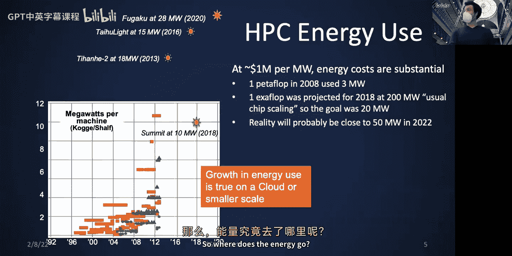

在本节课中，我们将要学习图形处理器（GPU）的基本概念、架构原理以及如何对其进行编程。GPU最初为图形处理设计，如今已成为高性能和高效能计算的关键组件。我们将探讨GPU与CPU在设计哲学上的根本差异，理解其高并行性和高吞吐量的特性，并学习使用CUDA进行GPU编程的基础知识。

---

## 核心概念：CPU与GPU的设计差异

上一节我们提到了大规模计算中的能耗挑战。本节中我们来看看CPU和GPU在架构设计上的根本区别，这直接导致了它们性能与能效的差异。

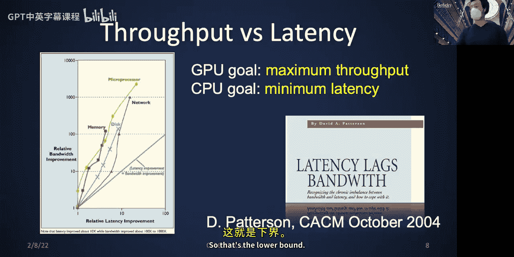

CPU（中央处理器）的设计目标是**最小化单一线程的延迟**。它通过复杂的控制逻辑（如乱序执行、分支预测、大容量缓存）来加速单个任务的完成。这使其非常适合处理复杂的、串行逻辑强的任务。

GPU（图形处理器）的设计目标是**最大化整体计算的吞吐量**。它通过集成大量简单的计算核心，并让它们同时执行相同的指令流（SIMT，单指令多线程），来并行处理海量数据。这使其在数据并行计算上极具优势。

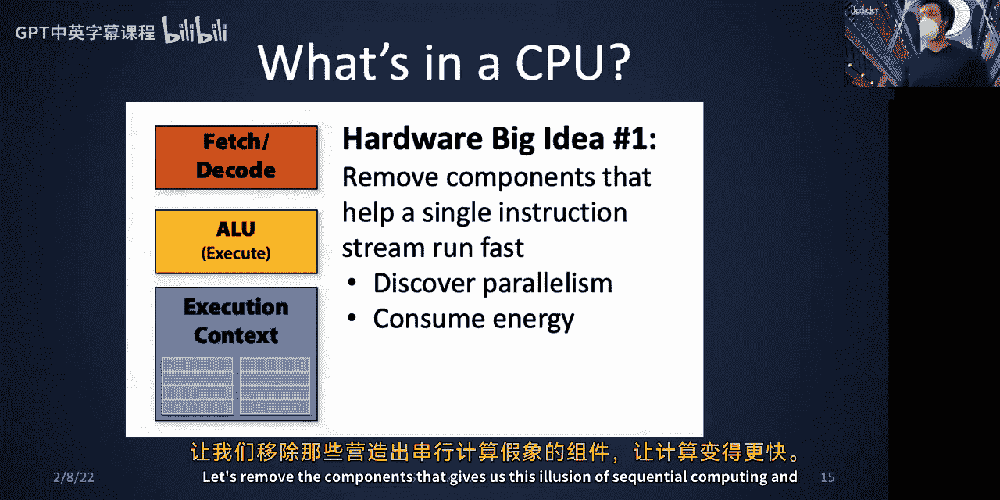

**公式：性能 = 并行度**
提升性能的关键在于发掘和利用并行性。GPU通过极高的硬件线程并行度来实现高性能。

---

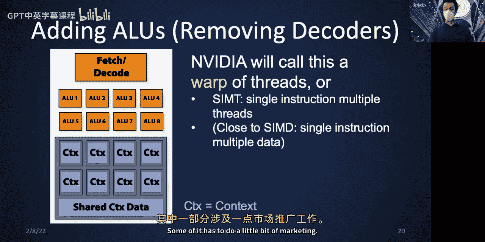

## GPU架构详解：从图形处理到通用计算

理解了基本设计目标后，我们深入GPU内部。GPU本质上是一个**异构多核处理器**，包含多种为图形管线不同阶段（如着色、纹理映射、光栅化）优化的专用核心。

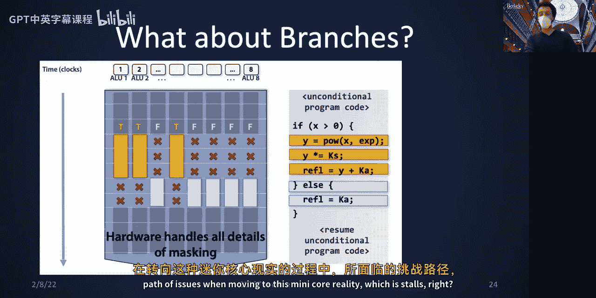

然而，对于通用计算（GPGPU）而言，我们主要关注其**流式多处理器**。其核心思想是：
1.  **移除为单线程加速的复杂部件**（如复杂的取指/译码单元、大容量缓存），简化单个核心。
2.  **在芯片上集成大量简化后的核心**，形成许多“迷你核心”。
3.  **采用SIMT执行模型**：一个指令译码单元控制一大批（如32个）算术逻辑单元，所有单元在同一周期执行相同的指令，但操作不同的数据。

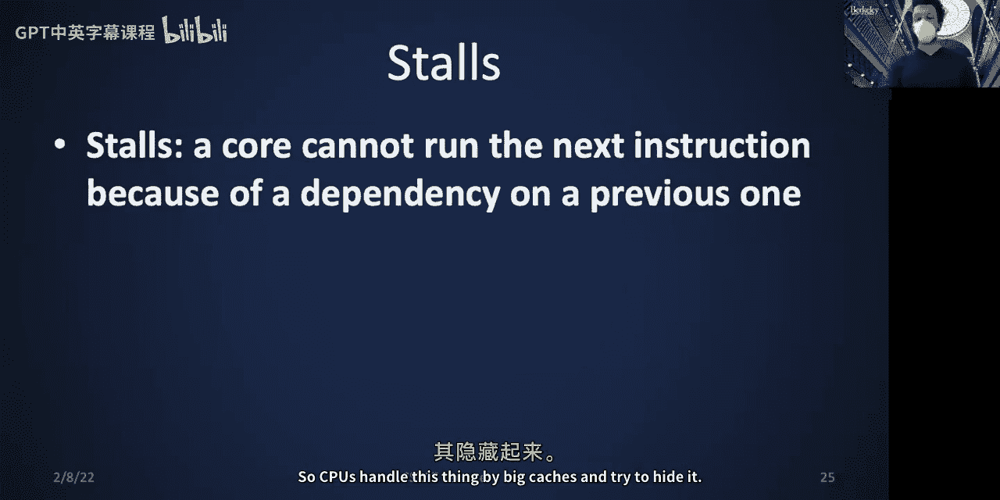

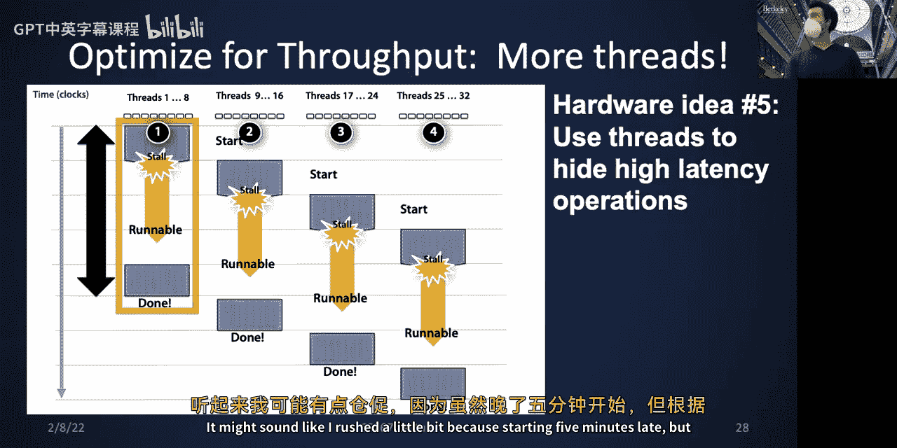

这种设计带来了极高的理论计算吞吐量和能效比，但要求程序必须能提供**海量的数据并行性**来“喂饱”所有这些计算单元。

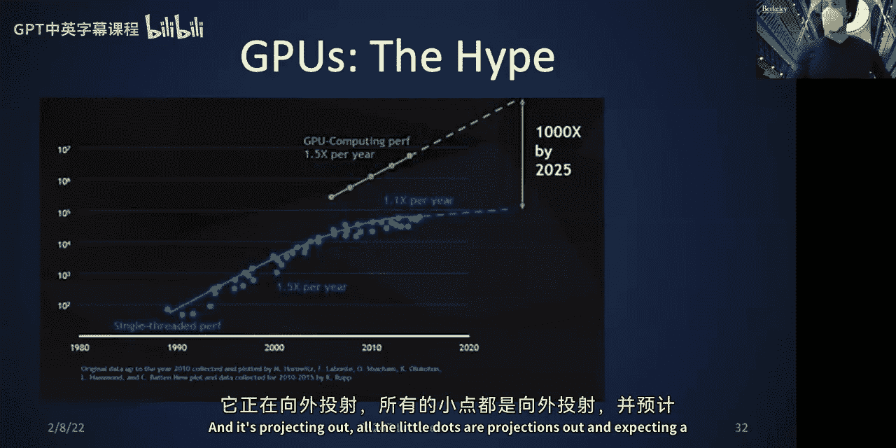

---

## GPU编程模型：CUDA基础

现在我们将理论付诸实践。CUDA是NVIDIA推出的GPU编程平台。其核心思想是**异构计算**：主机（CPU）负责逻辑控制和串行部分，设备（GPU）负责大规模并行计算。

一个典型的CUDA程序流程如下：
**代码：基本CUDA程序结构**
```c
// 1. 在CPU（主机）上分配和初始化数据
float *h_x = (float*)malloc(N * sizeof(float));
// ... 初始化 h_x ...

// 2. 在GPU（设备）上分配内存
float *d_x;
cudaMalloc(&d_x, N * sizeof(float));

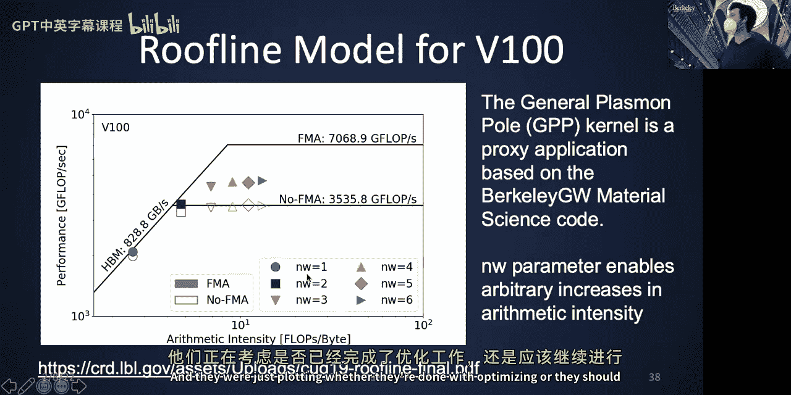

// 3. 将数据从主机复制到设备
cudaMemcpy(d_x, h_x, N * sizeof(float), cudaMemcpyHostToDevice);

// 4. 在GPU上启动核函数执行计算
vector_add<<<num_blocks, threads_per_block>>>(d_x, ...);

// 5. 将结果从设备复制回主机
cudaMemcpy(h_x, d_x, N * sizeof(float), cudaMemcpyDeviceToHost);

// 6. 释放设备内存
cudaFree(d_x);
```
其中，在GPU上执行的函数称为**核函数**，用 `__global__` 关键字修饰。调用核函数时使用 `<<<...>>>` 语法配置执行参数。

---

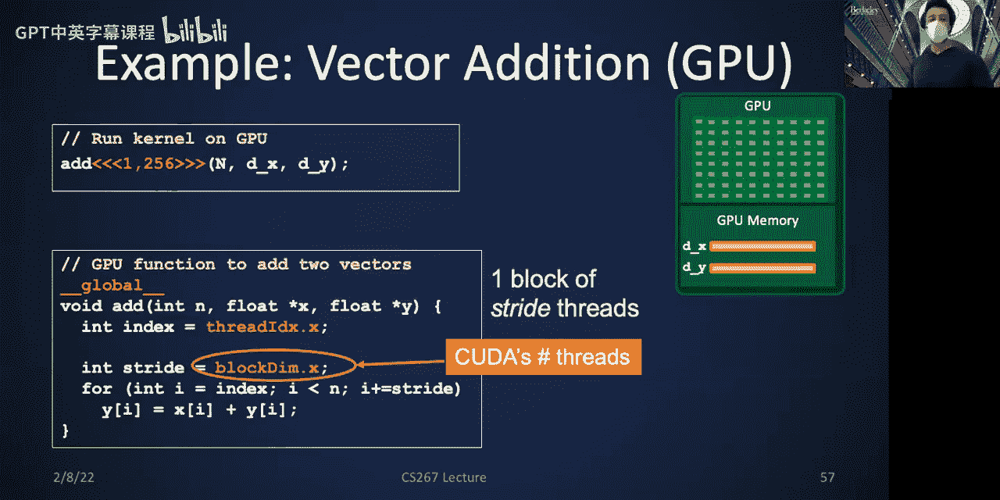

## 线程层次结构：网格、块与线程

为了组织海量的并行线程，CUDA使用了分层的线程结构。理解这个层次是编写高效GPU程序的关键。

CUDA将线程组织为：
*   **线程**：最基本的执行单元。
*   **线程块**：一组线程的集合。块内的线程可以：
    *   通过**共享内存**进行快速数据交换。
    *   通过 `__syncthreads()` 函数进行同步。
*   **网格**：所有线程块的集合。不同块间的线程默认不能直接通信或同步，它们通过**全局内存**进行协作（需谨慎处理竞态条件）。

核函数启动配置 `<<<num_blocks, threads_per_block>>>` 即定义了网格中块的数量和每个块中线程的数量。线程可以通过内置变量（如 `threadIdx.x`, `blockIdx.x`, `blockDim.x`）来唯一确定自己的全局ID，从而处理不同的数据。

**代码：计算全局线程ID**
```c
int global_id = blockIdx.x * blockDim.x + threadIdx.x;
```

---

## 内存层次与数据管理

GPU拥有复杂的内存层次，访问速度差异巨大。合理利用各级内存是优化性能的核心。

以下是主要的内存类型：
1.  **寄存器**：速度最快，每个线程私有。编译器自动分配。
2.  **共享内存**：位于芯片上，速度很快，**一个线程块内的所有线程共享**。由程序员显式管理，用于实现块内线程间的通信和数据复用。
3.  **全局内存**：容量大（即GPU显存），速度慢，**所有网格中的线程都可以访问**。主机与设备数据传输的目标。
4.  **常量内存和纹理内存**：具有缓存特性的特殊只读内存。

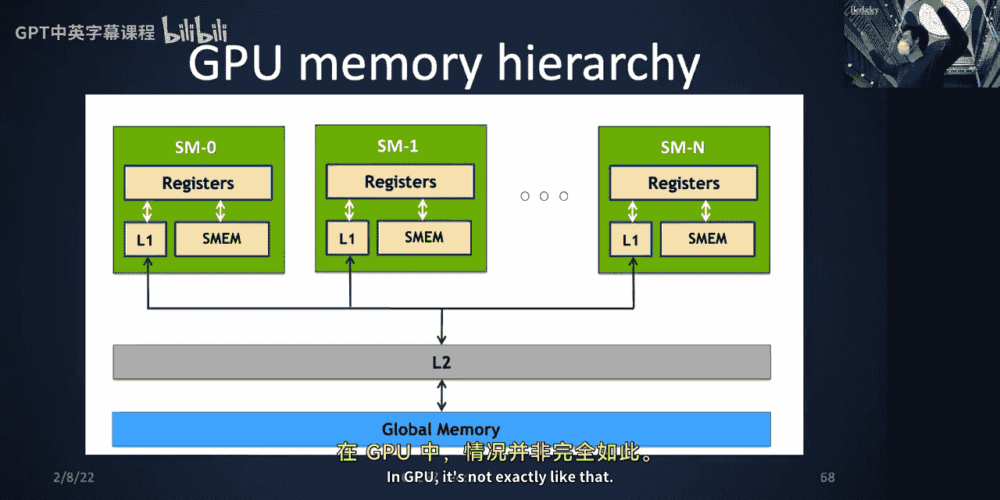

**优化准则**：尽可能将需要频繁访问的数据保存在寄存器或共享内存中，减少对全局内存的访问。

---

## 实战案例：一维模板计算

让我们通过一个“一维模板计算”的例子，综合运用线程组织、共享内存和同步。

**问题描述**：计算输出数组 `y`，其中每个元素 `y[i]` 是输入数组 `x` 中以其为中心、左右各 `radius` 个元素的累加和（例如，5点模板的 `radius=2`）。

**优化策略**：
1.  **所有者计算**：每个输出元素 `y[i]` 由其对应的线程独立计算，避免写冲突。
2.  **利用共享内存**：每个线程块将所需的一段 `x` 数据（包含左右`radius`宽度的**光晕区**）加载到共享内存中。这样，块内线程对核心数据的多次访问将变得非常快速。
3.  **块内同步**：在从共享内存读取数据进行计算之前，必须使用 `__syncthreads()` 确保所有线程已完成数据加载，防止读未初始化的数据。

**代码：使用共享内存的模板计算核函数（伪代码）**
```c
__global__ void stencil_1d(float *in, float *out, int N, int radius) {
    // 声明共享内存，大小为块大小加上左右光晕
    __shared__ float smem[BLOCK_SIZE + 2 * radius];
    int gid = blockIdx.x * blockDim.x + threadIdx.x; // 全局索引
    int lid = threadIdx.x + radius; // 在共享内存中的局部索引

    // 1. 将主数据加载到共享内存
    if (gid < N) {
        smem[lid] = in[gid];
    }
    // 2. 加载左光晕（由块内前`radius`个线程负责）
    if (threadIdx.x < radius && gid >= radius) {
        smem[lid - radius] = in[gid - radius];
    }
    // 3. 加载右光晕（由块内后`radius`个线程负责）
    if (threadIdx.x >= blockDim.x - radius && gid < N - radius) {
        smem[lid + radius] = in[gid + radius];
    }

    // 4. 等待所有数据加载完成
    __syncthreads();

    // 5. 进行计算（仅处理有效的输出元素）
    if (gid < N) {
        float sum = 0.0f;
        for (int i = -radius; i <= radius; i++) {
            sum += smem[lid + i];
        }
        out[gid] = sum;
    }
}
```

---

## 性能优化要点

编写正确的GPU程序只是第一步，要获得高性能还需注意以下关键点：

*   **最大化并行度**：配置足够的线程和线程块，以充分利用GPU的所有流式多处理器。
*   **内存合并访问**：确保一个线程束（Warp，通常是32个线程）访问的全局内存地址是连续的。这样硬件可以合并这些访问为一次大事务，极大提升内存带宽利用率。**非连续访问会导致性能严重下降**。
*   **分支发散**：在同一个线程束内，应尽量避免复杂的条件分支（如if-else）。因为线程束所有线程必须执行相同的指令路径，不同路径会被串行执行，导致部分线程空闲。
*   **资源限制**：线程块使用的共享内存和寄存器数量是有限的。使用过多会导致活动线程块减少，影响并行度。

---

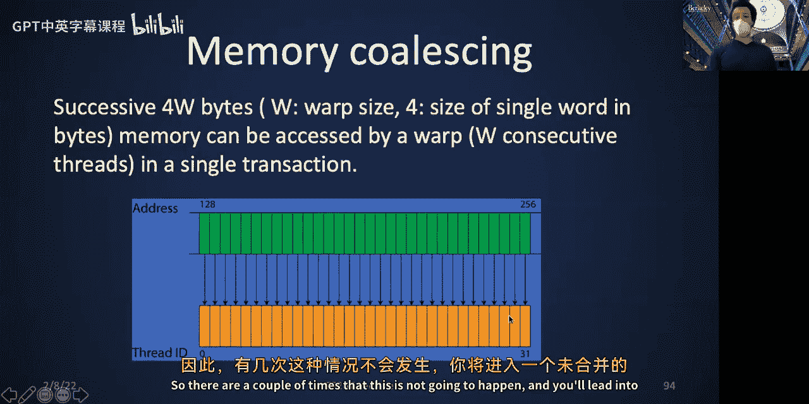

## 总结

本节课中我们一起学习了图形处理器（GPU）的基础知识。我们从能耗和性能挑战入手，理解了GPU以**高吞吐量**和**数据并行**为核心的设计哲学，这与CPU优化**低延迟**的目标截然不同。我们深入探讨了CUDA编程模型，包括其**网格-块-线程**的层次化组织、**共享内存与全局内存**的区别与用法，以及通过 `__syncthreads()` 实现**块内线程同步**。通过一维模板计算的实战案例，我们展示了如何利用共享内存和光晕区技术来优化数据访问模式。最后，我们总结了内存合并访问、避免分支发散等关键性能优化准则。掌握这些概念是进行高效GPU编程的基石。