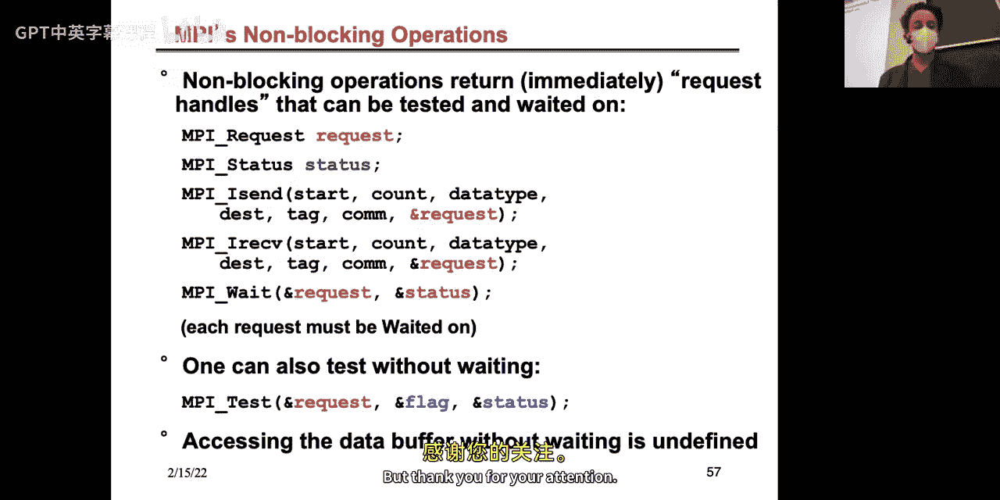

# 007：分布式内存机器与编程

## 概述
在本节课中，我们将学习分布式内存架构的基本概念、性能模型、网络拓扑结构，并开始介绍如何为这类机器编程。这是你即将发布的作业2.2的主题，我们将在周四的课程中完成这个话题。

---

## 分布式内存架构概述

上一讲我们讨论了共享内存编程。本节中，我们来看看另一种主流的并行计算范式：分布式内存机器。

目前，在基于高性能LINPACK基准测试排名的全球Top 500超级计算机中，集群（即分布式内存机器）的份额自2005年左右以来持续增长，并已占据主导地位。这意味着，对于真正需要竞争顶级性能的应用，分布式内存架构是目前无可争议的选择。

早期的分布式内存机器设计用于最近邻通信。它们由一组微处理器组成，每个处理器都有队列，可以存储并转发数据包到其最近的邻居。这意味着运行时间很大程度上取决于消息传递所需的“跳数”。如今，我们有了诸如虫孔路由等技术，消息无需存储转发，但早期的设计影响了当时的网络拓扑理念。

理解这些网络的一个最佳类比是将其视为街道：
*   网络中的一条**链路**就像一条街道。
*   一个**交换机**就像一个十字路口。
*   以跳数衡量的**距离**就像需要经过的街区数量。
*   你在谷歌地图上的旅行计划就是网络中的**路由算法**。

与共享内存中完全连接的总线不同，分布式网络总是存在某种拓扑结构，因为将成千上万个节点完全互连的成本过高。

---

## 网络性能关键概念

在深入拓扑结构之前，我们需要理解两个核心性能指标：

**延迟**：在理想无拥塞条件下，将一条消息从点A发送到点B所需的时间。这就像高速公路上只有你一辆车时，到达目的地的最快时间。其公式可以表示为发送一条消息的固定启动时间。

**带宽**：单位时间内可以通过链路的数据量。这就像单位时间内可以通过高速公路的汽车数量。其公式通常表示为 `数据量 / 时间`。

你可以通过“增加车道”（即添加更多物理连线）来增加带宽，但延迟受物理定律（如光速）和硬件限制，降低起来困难得多。因此，对于包含大量小消息的程序，延迟通常是决定性因素；而对于传输大消息的程序，带宽则更为关键。

需要注意的是，我们区分**硬件延迟**（信号在线上传输的理论时间）和**软件延迟**（在你的程序中调用发送函数到消息被接收的实际时间）。软件延迟还包括了消息传递接口（如MPI）的开销，这对应用程序性能更为相关。

历史数据表明，最快的网络延迟几十年来并未显著降低（似乎存在约1微秒的下限），但慢速网络的延迟已大幅改善，整体差异变小。带宽则随着技术进步有更好的提升。

---

## 网络拓扑结构

以下是几种常见的网络拓扑结构及其关键指标（直径和二分带宽）的简要介绍。理解这些有助于在特定硬件上优化程序布局。

*   **线性阵列**：处理器以线性方式仅与最近邻居连接。
    *   **直径**：`N - 1`
    *   **二分带宽**：`1`

*   **环**：在线性阵列两端添加一条连接，形成环。
    *   **直径**：`N / 2`
    *   **二分带宽**：`2`
    *   *应用实例*：旧款IBM Cell处理器（曾用于Xbox 3）的片上网络。

*   **网格**：二维的线性阵列。
    *   **直径**：`2 * sqrt(N)` （假设为正方形网格）
    *   **二分带宽**：`sqrt(N)`

*   **环面**：在网格的基础上添加环绕连接。
    *   **直径**：`sqrt(N)` （正方形网格）
    *   **二分带宽**：`2 * sqrt(N)`
    *   *应用实例*：IBM Blue Gene系列、NERSC的上一代机器（如Edison）使用高维环面（3D/4D）。

*   **超立方体**：一种高维拓扑，每个节点有 `log2(N)` 个邻居。
    *   **直径**：`log2(N)`
    *   **二分带宽**：`N / 2`
    *   *缺点*：节点数必须为2的幂，且交换机需要支持高扇出（很多链路）。

*   **胖树**：对传统树的改进，越靠近树根，链路带宽越高，以避免根部成为瓶颈。
    *   **直径**：`2 * log2(N)`
    *   **二分带宽**：`N / 2`
    *   *应用实例*：Thinking Machines CM5， Summit超级计算机。

*   **蝶形网络**：可以看作是“展开”的超立方体，使用多个低扇出交换机替代一个高扇出交换机，在过去高扇出交换机昂贵时很流行。

了解拓扑结构的重要性在于，如果你的算法能映射到硬件拓扑上，性能可能大幅提升。例如，在允许进程映射的IBM Blue Gene机器上，有效带宽随节点数增加而上升；而在不允许映射的Cray机器上，有效带宽则下降。

---

## 蜻蜓拓扑

当前许多超级计算机（如NERSC的Cori系统）使用**蜻蜓拓扑**。它的设计动机是利用电互连（便宜、短距离快）和光互连（昂贵、长距离带宽高）在成本与性能上的差异。

蜻蜓拓扑是一种分层设计：
1.  **组内**：多个节点通过**电互连**（如全连接或其他拓扑）形成一个“组”。
2.  **组间**：各个组之间通过**光互连**以近似全连接的方式链接。

其名称来源于蜻蜓的身体结构——密集连接的躯干（组内）和细长的翅膀（组间光链接）。

为了在蜻蜓网络上平衡负载、避免特定链路拥塞，通常采用**随机路由算法**（由Leslie Valiant提出）。该算法不总是选择最短路径，而是先随机跳转到一个中间组，再前往目的地。这增加了路径长度（例如从3跳增至5跳），但通过分散流量，避免了最坏情况下的拥塞，提高了整体性能。这类似于现代地图应用有时会建议一条稍长但更畅通的路线来均衡交通流量。

---

## 性能模型：α-β模型

对于分布式内存编程，我们需要一个考虑通信成本的模型。最常用的是 **α-β模型**。

在该模型中，发送一条长度为 `n` 个字的消息所需时间 `T` 为：
`T = α + β * n`

其中：
*   **α** 是**延迟**，即消息启动的固定开销（单位：时间）。
*   **β** 是**逆带宽**，即传输每个字所需的时间（单位：时间/字）。`1/β` 就是带宽。

需要记住的关键事实是：`α >> β >> 执行一次浮点运算的时间`。因此，为了让应用高效扩展，你需要保持较高的**计算与通信比**。

该模型的一个**局限性**是，它假设每个节点只有一个进程访问网络。在现代多核/多GPU节点上，多个进程可能共享同一个网络接口卡（NIC），导致有效带宽下降，尤其是在大量进程同时通信时。因此，在实践中需要谨慎选择每个节点上活跃的通信进程数量。

---

## MPI编程入门

现在，我们开始学习如何为分布式内存机器编程。业界标准是**消息传递接口**。

MPI是一个广泛使用的、可移植的消息传递库标准。它遵循 **SPMD（单程序多数据）** 编程模型：同一份程序副本在多个处理器上启动，每个副本处理不同的数据。

一个MPI程序的基本结构包括初始化、获取进程信息、通信、以及最终化。

以下是获取进程信息的示例代码：
```c
#include <mpi.h>
#include <stdio.h>

int main(int argc, char** argv) {
    int rank, size;

    MPI_Init(&argc, &argv); // 初始化MPI环境
    MPI_Comm_rank(MPI_COMM_WORLD, &rank); // 获取当前进程的编号（秩）
    MPI_Comm_size(MPI_COMM_WORLD, &size); // 获取进程总数

    printf("I am process %d of %d\n", rank, size);

    MPI_Finalize(); // 终止MPI环境
    return 0;
}
```
使用 `mpirun -n 4 ./my_program` 运行此程序，会启动4个副本，每个输出自己的秩。

---

## 点对点通信

MPI的核心操作是发送和接收消息。最基本的函数是 `MPI_Send` 和 `MPI_Recv`。

以下是点对点通信的示例：
```c
if (rank == 0) {
    int data = 123456;
    MPI_Send(&data, 1, MPI_INT, 1, 0, MPI_COMM_WORLD); // 发送给进程1
} else if (rank == 1) {
    int received_data;
    MPI_Status status;
    MPI_Recv(&received_data, 1, MPI_INT, 0, 0, MPI_COMM_WORLD, &status); // 从进程0接收
    printf("Received %d\n", received_data);
}
```
`MPI_Send` 参数：发送缓冲区地址， 元素个数， 数据类型， 目标进程秩， 消息标签， 通信域。
`MPI_Recv` 参数类似，但需要提供接收缓冲区地址，并可返回一个状态对象用于查询消息详情。

默认的发送和接收是**阻塞式**的：`MPI_Send` 在发送缓冲区可安全重用前返回（数据可能已发出，也可能被库缓冲）；`MPI_Recv` 在数据完全存入接收缓冲区后返回。

---

## 集体通信

除了点对点通信，MPI提供了更高效、更方便的**集体通信**操作，涉及通信域内的所有进程。

常见的集体通信包括：
*   **广播** (`MPI_Bcast`)：一个进程将数据发送给所有其他进程。
*   **规约** (`MPI_Reduce`)：所有进程提供数据，通过一种操作（如求和、求最大值）合并到一个进程。
*   **全规约** (`MPI_Allreduce`)：规约结果广播给所有进程。
*   **散射** (`MPI_Scatter`)：一个进程将数据块分发给所有进程。
*   **聚集** (`MPI_Gather`)：所有进程将数据发送到一个进程进行合并。

使用集体通信通常比手动使用点对点操作更高效且不易出错。

---

## 示例：使用MPI计算π

让我们用一个经典的数值积分法计算π的示例来结合所学内容：
```c
#include <mpi.h>
#include <stdio.h>
#include <math.h>

int main(int argc, char** argv) {
    int rank, size, n_intervals = 1000000;
    double my_pi = 0.0, pi_approx, step, x;

    MPI_Init(&argc, &argv);
    MPI_Comm_rank(MPI_COMM_WORLD, &rank);
    MPI_Comm_size(MPI_COMM_WORLD, &size);

    // 将区间数广播给所有进程
    MPI_Bcast(&n_intervals, 1, MPI_INT, 0, MPI_COMM_WORLD);

    step = 1.0 / (double) n_intervals;
    // 每个进程计算自己负责的矩形面积（循环划分）
    for (int i = rank; i < n_intervals; i += size) {
        x = (i + 0.5) * step;
        my_pi += 4.0 / (1.0 + x * x);
    }
    my_pi *= step; // 每个进程的局部和

    // 将所有进程的局部和规约到进程0，进行求和操作
    MPI_Reduce(&my_pi, &pi_approx, 1, MPI_DOUBLE, MPI_SUM, 0, MPI_COMM_WORLD);

    if (rank == 0) {
        printf("Approximated Pi: %.15f\n", pi_approx);
        printf("Error: %.15f\n", fabs(pi_approx - M_PI));
    }

    MPI_Finalize();
    return 0;
}
```
这个程序演示了 `MPI_Bcast` 和 `MPI_Reduce` 的用法。

---

## 避免死锁与非阻塞通信

编写点对点通信代码时，需要注意**死锁**。例如，如果两个进程都先执行 `MPI_Send` 等待对方执行 `MPI_Recv`，而系统缓冲区不足，就会发生死锁。

解决方法包括：
1.  调整调用顺序，使发送和接收配对。
2.  使用 `MPI_Sendrecv` 函数交换数据。
3.  使用**非阻塞通信**：`MPI_Isend` 和 `MPI_Irecv`。这些函数立即返回一个“请求句柄”，实际通信在后台进行。程序员随后调用 `MPI_Wait` 来等待通信完成。这提高了通信与计算重叠的可能性。

```c
MPI_Request request;
MPI_Isend(&data, count, MPI_INT, dest, tag, MPI_COMM_WORLD, &request);
// ... 这里可以执行一些计算 ...
MPI_Wait(&request, MPI_STATUS_IGNORE); // 等待发送完成
```

---

## 总结




本节课中，我们一起学习了分布式内存计算的基础知识。我们首先了解了为什么分布式内存集群成为主流，并探讨了网络性能的关键指标：延迟和带宽。接着，我们回顾了多种网络拓扑结构及其特性，重点介绍了现代超级计算机使用的蜻蜓拓扑及其随机路由算法。然后，我们引入了用于分析通信成本的α-β性能模型。最后，我们开始了MPI编程的学习，涵盖了MPI程序的初始化和基本结构、点对点通信、集体通信，并通过计算π的示例进行了实践。我们还简要讨论了通信模式（阻塞/非阻塞）和避免死锁的方法。下节课我们将继续深入MPI的高级特性及其他通信库。