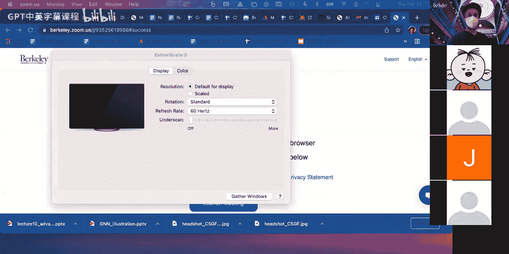
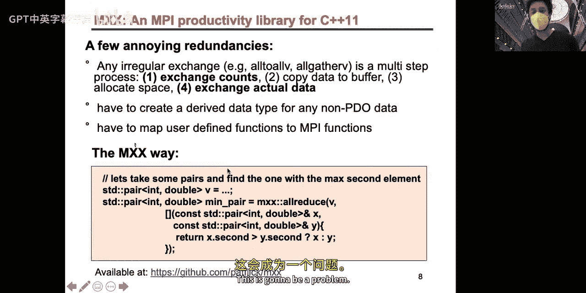
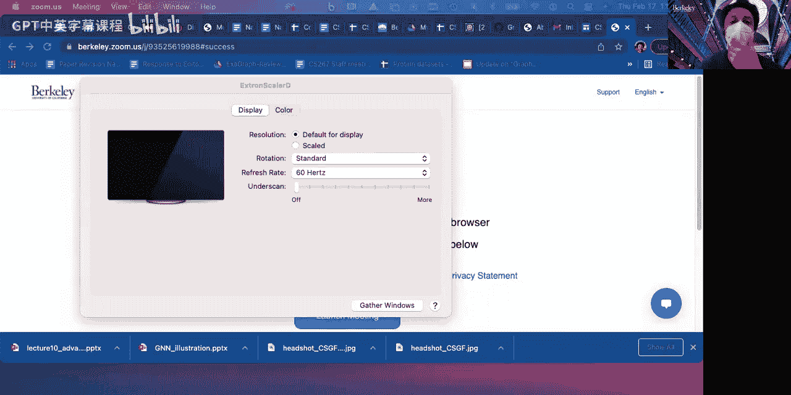
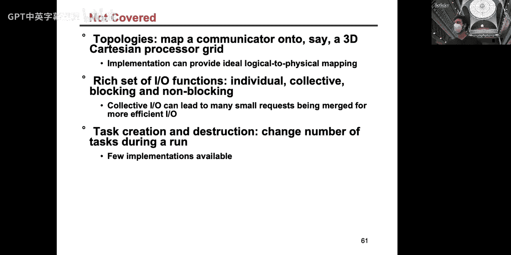
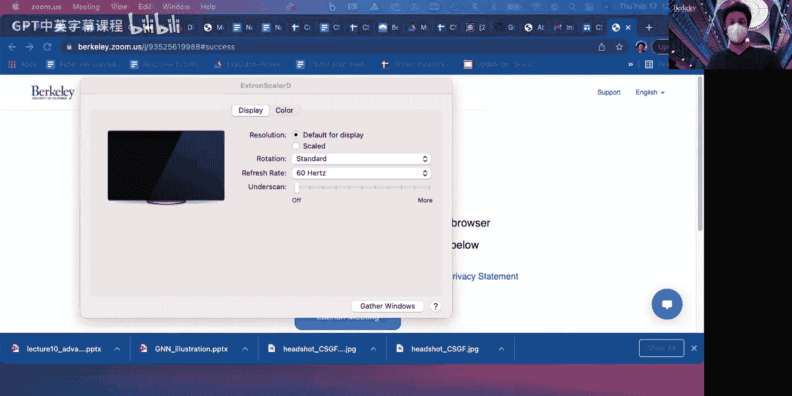

# 008：高级MPI与集合通信




在本节课中，我们将学习MPI中更高级的概念，特别是集合通信。我们将探讨如何将MPI视为一个用于执行集合操作的接口，而不仅仅是发送和接收消息。这将使我们的并行编程更加高效和安全。

## 集合通信概述

上一节我们介绍了MPI的基本点对点通信。本节中，我们来看看集合通信。集合通信是指一组进程（一个通信器内的所有进程）共同参与的数据交换操作。与点对点通信相比，集合通信能更好地组织进程间的通信，使所有进程同时开始和结束，从而避免死锁并提高编程效率。





集合通信的核心思想是，所有进程在通信器中同步执行操作。如果某个进程没有调用集合通信函数，程序将会挂起，因为集合通信隐式地包含了一个屏障（barrier）。

## 集合通信的类型

以下是MPI中几种主要的集合通信操作：

*   **广播（Broadcast）**：一个根进程将其数据发送给通信器中的所有其他进程。
*   **收集（Gather）**：每个进程都有一块数据，所有数据被收集到根进程中。
*   **散播（Scatter）**：根进程将其数据块分割并分发给通信器中的所有进程。
*   **归约（Reduce）**：所有进程提供数据，通过一个操作（如求和、求最大值）进行合并，结果存储在根进程中。
*   **全收集（Allgather）**：类似于收集，但结果数据会被复制到所有进程，而不仅仅是根进程。
*   **全归约（Allreduce）**：类似于归约，但结果数据会被复制到所有进程。
*   **全到全（All-to-all）**：每个进程都向所有其他进程（包括自己）发送不同的消息。

## 集合通信算法与性能

上一节我们了解了集合通信的类型。本节中，我们来看看实现这些操作的算法及其性能考量。

对于集合通信，存在理论上的性能下限。例如，广播的延迟下限是 `O(log P)`，其中 `P` 是进程数。带宽下限则取决于需要传输的数据总量。

实现集合通信有多种算法，选择哪种算法取决于消息大小和进程数量：

*   **环算法（Ring Algorithm）**：每个进程将数据发送给右侧邻居，并从左侧邻居接收数据。该算法带宽利用率最优，但延迟较高（`O(P)`），适用于进程数较少或消息较大的情况。
*   **递归倍增算法（Recursive Doubling）**：进程在每一步与距离为 `2^t` 的伙伴交换所有已累积的数据。该算法延迟较低（`O(log P)`），但带宽开销可能更高，且对非2的幂次方进程数处理较复杂。
*   **Bruck算法**：类似于递归倍增，但在 `floor(log P)` 步后停止，并通过一次额外交换完成通信。它在非2的幂次方进程数时通常比递归倍增更优。

一个好的MPI实现会根据消息大小和进程数量在这些算法之间自动切换，以达到最佳性能。

## 非阻塞集合通信

我们之前讨论了非阻塞的点对点通信。类似地，MPI也提供了非阻塞的集合通信操作，例如 `MPI_Ibcast`。

非阻塞集合通信的主要目的是**重叠通信与计算**。程序可以启动一个集合通信操作，然后立即返回，在后台进行通信的同时执行本地计算，最后再等待通信完成。

然而，需要注意的是，非阻塞调用返回并不保证通信会立即在后台取得进展。这取决于MPI实现的质量和底层硬件（如RDMA引擎）的支持。

使用非阻塞集合通信的另一个微妙好处是**解耦数据传递与同步**。这可以提高程序对系统噪声（如某个进程因硬件纠错而变慢）的抵抗力，避免过度的全局同步放大局部延迟的影响。

## 子通信器（Subcommunicators）

在复杂的并行算法中，我们经常需要将进程组分成更小的团队进行独立的集合通信。MPI提供了 `MPI_Comm_split` 函数来创建子通信器。

其算法很简单：所有调用该函数的进程根据指定的 `color` 参数被分组。具有相同 `color` 值的进程被分配到同一个新的通信器中。`key` 参数用于确定新通信器中的进程排名顺序。

例如，在一个2D网格的矩阵乘法算法（如Cannon算法或SUMMA算法）中，我们需要按行和按列进行广播：
```c
// 假设进程排列在 sqrt(P) x sqrt(P) 的网格上
int row_color = my_rank / sqrt(P); // 行颜色
int col_color = my_rank % sqrt(P); // 列颜色
MPI_Comm row_comm, col_comm;
MPI_Comm_split(MPI_COMM_WORLD, row_color, my_rank, &row_comm);
MPI_Comm_split(MPI_COMM_WORLD, col_color, my_rank, &col_comm);
// 现在可以在 row_comm 中进行行内广播，在 col_comm 中进行列内广播
```
这允许我们在进程子集内进行高效的、局部的集合通信。

## MPI与多线程

现代计算节点通常拥有多核处理器。为了充分利用所有核心，我们可以结合使用MPI和多线程编程模型，例如MPI+OpenMP。

MPI定义了四个线程支持级别，需要在初始化时通过 `MPI_Init_thread` 请求：

1.  **MPI_THREAD_SINGLE**：仅支持单线程（等价于 `MPI_Init`）。
2.  **MPI_THREAD_FUNNELED**：支持多线程，但只有主线程可以调用MPI函数。
3.  **MPI_THREAD_SERIALIZED**：支持多线程，多个线程可以调用MPI函数，但不能同时调用。调用必须被序列化（例如使用 `#pragma omp critical`）。
4.  **MPI_THREAD_MULTIPLE**：支持多线程，多个线程可以同时并发地调用MPI函数。

对于初学者，建议从 `MPI_THREAD_FUNNELED` 开始，这是最安全的模式。`MPI_THREAD_MULTIPLE` 性能潜力最大，但编程也最复杂，需要仔细处理数据竞争和调用顺序。

一个重要的规则是：**阻塞式MPI调用只会阻塞调用它的线程，而不会阻止同一进程中的其他线程运行**。这有助于避免一些死锁场景。

## 单边通信（One-Sided Communication）

我们之前介绍的通信都是“双边”的，需要发送方和接收方协同。MPI还支持“单边”通信（远程内存访问，RMA），它进一步**解耦了数据移动和同步**。

在单边通信中，进程可以将其部分内存声明为“窗口”（Window），使其对其他进程可远程访问。其他进程则可以直接对这个窗口进行 **`MPI_Put`**（写入）、**`MPI_Get`**（读取）或 **`MPI_Accumulate`**（原子累加）操作，而无需目标进程主动参与。

单边通信的魔力在于，它通常可以由网络接口卡（NIC）上的RDMA引擎直接处理，无需打扰目标进程的CPU。这提高了通信效率，并增强了程序对计算负载不平衡的容忍度。

创建窗口有多种方式，例如 `MPI_Win_create`（基于现有缓冲区）或 `MPI_Win_allocate`（由MPI分配对称内存）。为了使用窗口中的数据，必须通过“epoch”进行同步，例如在被动目标模式下使用 `MPI_Win_lock` / `MPI_Win_unlock` 来界定一个访问周期，确保操作完成。

## 总结





本节课中我们一起学习了MPI的高级主题。我们认识到将MPI视为集合通信接口的重要性，它比单纯使用点对点通信更安全、更高效。我们探讨了各种集合通信操作及其底层算法，了解了如何通过非阻塞操作和单边通信来重叠计算与通信、解耦同步。我们还学习了如何使用子通信器组织复杂的通信模式，以及如何结合MPI与多线程编程以充分利用现代硬件。掌握这些概念将帮助你编写出更高效、更健壮的大规模并行程序。