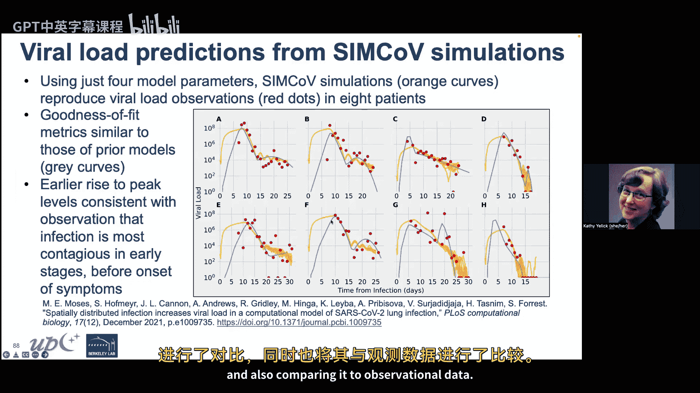
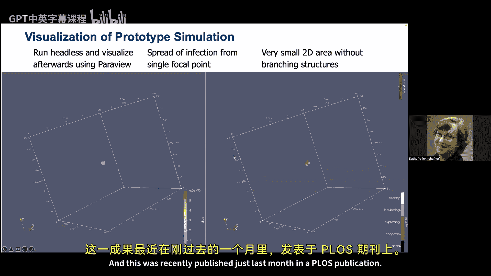
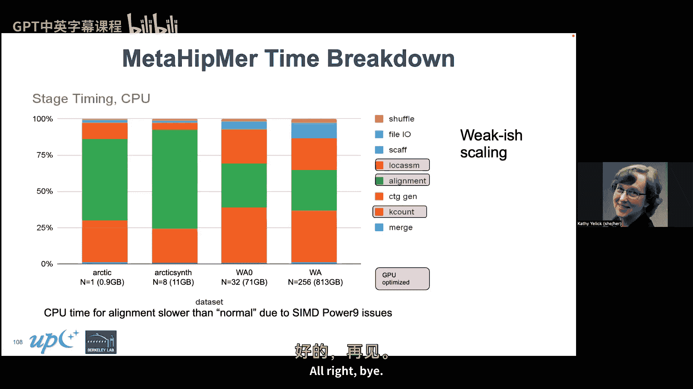

# 009： 一个异步RMA/RPC库


在本节课中，我们将要学习UPC++，这是一个用于大规模并行或分布式内存C++应用程序的编程模型。我们将了解其异步、单边远程内存访问和远程过程调用的核心概念，并通过实例学习如何使用它来编写高效的并行程序。

## 课程概述与动机

大家好，我是Kay Yick。今天我将为大家讲解UPC++。首先，我想提醒大家，本周四所有的GSI将介绍他们的研究及其与并行计算的关系，希望能为你们的期末项目提供一些思路。

今天，我将主要介绍UPC++，这是一个基于C++的并行计算编程模型。我们称之为异步RMA/RPC库。RMA代表远程内存访问，RPC代表远程过程调用。它适用于大规模分布式内存C++应用，可以看作是MPI和OpenMP的某种结合。这个项目主要由美国能源部资助，是Exascale计算项目的一部分。

### 并行机器的抽象模型

在深入UPC++之前，我们先回顾一下并行机器的几种抽象模型：
*   **共享内存模型**：如OpenMP编程。进程通过读写共享变量和数据结构进行通信。编程相对容易，但可扩展性有限，通常只能扩展到数十个核心。
*   **分布式内存模型**：如MPI编程。进程通过网络发送和接收消息进行通信。优势在于可扩展性极强，可以构建拥有成千上万核心的大型机器。
*   **分区全局地址空间模型**：这是介于两者之间的模型。它在物理上可以是共享或分布式内存硬件，但在逻辑上，程序员可以像在共享内存模型中一样，通过读写“共享”变量进行通信，但这些变量实际上分布在不同的内存中。关键在于，PGAS模型**不缓存远程内存**，这避免了维护缓存一致性的巨大开销，从而能获得与MPI相媲美的效率和可扩展性。

### 为何需要PGAS和UPC++？

PGAS语言主要受到两方面趋势的推动：应用需求和硬件发展。

**1. 应用需求：处理不规则问题**
许多应用不适合传统的MPI“发送-接收”模型，特别是那些具有**不规则数据结构和不可预测通信模式**的应用，例如：
*   自适应网格
*   稀疏矩阵
*   哈希表和直方图
*   图分析算法
*   动态工作窃取

在这些问题中，通信的对象、时机和数据大小往往在运行时才能确定。例如，构建一个大型直方图时，每个处理器处理输入数据流，需要更新分布在不同处理器上的计数器。处理器无法预知会收到哪个词的更新请求，这就需要一种更灵活的异步通信机制。

**2. 硬件趋势：低开销通信与延迟隐藏**
随着系统规模扩大，每个节点的核心数在增长，但每个核心的内存容量在下降，而网络延迟受限于光速和软件开销，改善有限。为了降低通信成本，关键技巧是**用其他工作重叠通信延迟**。现代硬件提供了**远程直接内存访问**功能，允许处理器不经过对端CPU，直接通过网络读写远程内存。这催生了“单边”通信模型。

**单边 vs. 双边通信**
*   **双边通信**：如MPI的`Send/Recv`。消息包含数据载荷和消息ID。接收操作必须预先发布，以匹配到来的消息，并将数据存入指定地址。这需要发送方和接收方的协调。
*   **单边通信**：如`Put`操作。消息包含数据载荷和**目标内存地址**。网络接口卡可以直接将数据写入目标内存，无需对端CPU介入。这通常能带来更好的性能。

下图展示了基于GASNet（UPC++底层网络库）的性能数据，可以看到在某些消息大小和机器上，单边通信的带宽显著高于传统的双边MPI通信。

## UPC++ 简介

UPC++是一个基于C++的PGAS库。它的特点是：
*   **免编译器**：它不依赖特殊的编译器，可以使用任何标准C++编译器，通过库的形式提供功能。
*   **基于GASNet EX**：利用其低开销通信和RDMA功能。
*   **支持主动消息**：作为构建高层RPC机制的基础。
*   **高度可移植**：从笔记本电脑到主要超级计算机。
*   **支持互操作性**：可以与MPI混合编程。

### 第一个程序：Hello World

UPC++采用**单程序多数据**执行模型，与MPI和GPU编程模型类似。所有进程同时启动，执行同一个程序。

以下是一个简单的Hello World程序：

```cpp
#include <upcxx/upcxx.hpp>
int main(int argc, char* argv[]) {
    upcxx::init();
    std::cout << "Hello from rank " << upcxx::rank_me() << std::endl;
    upcxx::barrier();
    if (upcxx::rank_me() == 0) {
        std::cout << "All done!" << std::endl;
    }
    upcxx::finalize();
    return 0;
}
```
程序解析：
1.  `upcxx::init()` 和 `upcxx::finalize()` 初始化和终止UPC++运行时环境。
2.  `upcxx::rank_me()` 返回当前进程的ID。
3.  `upcxx::barrier()` 是同步屏障。
4.  所有进程都会执行第一个`cout`打印。屏障之后，只有0号进程执行第二个打印。

运行这个程序，四个进程的输出顺序是不确定的。

## 核心概念：全局指针与通信

要编写有意义的并行程序，进程间需要通信。UPC++通过**全局指针**和**异步操作**来实现。

### 全局指针与地址空间

UPC++程序的内存分为两部分：
*   **私有内存**：每个进程独有的内存，例如函数内的局部变量。
*   **全局地址空间**：逻辑上共享、物理上分布的内存区域。

**全局指针**用于指向全局地址空间中的对象。它不仅仅包含内存地址，还包含**该对象所 affinity 的进程ID**。Affinity 意味着数据对象“属于”某个进程，通常存储在该进程的本地内存中。

例如，一个分布在多个进程上的链表，每个节点存储在当前进程的全局地址空间中，而`next`指针则是一个全局指针，可以指向位于其他进程上的节点。

如果某个全局指针指向的数据正好位于当前进程（即当前进程对该数据有affinity），则可以将其转换为高效的本地C++指针。

### 远程内存访问

UPC++主要通过两种方式通信：
1.  **RMA**：基于`Put`（写）和`Get`（读）操作，是低开销的单边通信。
2.  **RPC**：远程过程调用，可以在远程进程上执行一段代码。

这些操作默认都是**异步**的。发起操作后，当前进程不会等待操作完成，而是立即继续执行后续不依赖该操作结果的代码。这是隐藏网络延迟的关键。

#### 异步操作与Future

异步操作（如`rget`）会立即返回一个`future`对象。`future`像一个“盒子”，最终会装有操作的结果（例如读取到的值）。当程序需要用到这个结果时，调用`future.wait()`来等待并取出值。

示例：
```cpp
upcxx::global_ptr<int> gptr1 = ...; // 假设已初始化，指向远程数据
upcxx::future<int> f1 = upcxx::rget(gptr1); // 异步读取，立即返回future
// ... 这里可以执行其他不依赖f1的工作 ...
int value = f1.wait(); // 等待读取完成，并获取值
```
`future`还可以检查操作是否已完成（`ready()`），并且可以链接回调函数（`then()`），在操作完成后自动触发执行特定代码。

## 实践示例：蒙特卡洛法计算π

我们将通过一个逐步优化的例子来演示UPC++编程。目标是使用“投飞镖”蒙特卡洛方法估算π值：在单位正方形内随机投点，统计落在内切圆内点的比例。

### 版本1：无通信（不正确）

每个进程独立投掷飞镖并计算自己的π估计值，结果互不相同。这实际上不是并行合作。
```cpp
// 伪代码概览
upcxx::init();
long long hits = 0;
// 每个进程独立投掷 trials 次
for (int i = 0; i < trials; i++) {
    hits += hit(); // hit()返回1（在圆内）或0
}
double pi_estimate = 4.0 * hits / trials;
std::cout << "Rank " << rank << " estimates pi = " << pi_estimate << std::endl;
upcxx::finalize();
```

### 版本2：引入共享变量与广播

我们需要一个所有进程都能访问的共享变量来累加总的命中数。首先，在0号进程上分配一个共享整数，然后通过广播让所有进程获得指向它的全局指针。
```cpp
upcxx::global_ptr<long long> shared_hits;
if (upcxx::rank_me() == 0) {
    // 只在0号进程分配并初始化
    shared_hits = upcxx::new_<long long>(0);
}
// 广播：0号进程发送指针，所有进程接收
shared_hits = upcxx::broadcast(shared_hits, 0).wait();
```
现在，所有进程的`shared_hits`都指向0号进程上的同一个共享变量。

### 版本3：尝试使用RMA（存在竞态条件）

每个进程在循环中读取共享计数值，加上本次投掷结果，再写回。
```cpp
for (int i = 0; i < my_trials; i++) {
    upcxx::future<long long> f = upcxx::rget(shared_hits);
    long long current = f.wait();
    current += hit();
    upcxx::rput(current, shared_hits).wait();
}
upcxx::barrier();
```
**问题**：`rget`和`rput`不是原子操作。多个进程可能同时读取到相同的旧值，然后分别增加并写回，导致更新丢失。这是一个典型的**竞态条件**。

### 解决方案A：使用原子操作

UPC++提供了原子操作，如`fetch_add`，能确保读-修改-写操作的原子性。
```cpp
// 首先，创建一个支持 fetch_add 操作的原子域
upcxx::atomic_domain<long long> ad({upcxx::atomic_op::fetch_add, upcxx::atomic_op::load});
// 分配一个共享的原子整数
upcxx::global_ptr<long long> atomic_hits = upcxx::new_<long long>(0);
// 在循环中原子地增加
for (int i = 0; i < my_trials; i++) {
    ad.fetch_add(atomic_hits, hit(), std::memory_order_relaxed).wait();
}
upcxx::barrier();
// 读取最终结果时也要使用原子操作
if (upcxx::rank_me() == 0) {
    long long total_hits = ad.load(atomic_hits, std::memory_order_relaxed).wait();
    double pi_estimate = 4.0 * total_hits / total_trials;
}
```

### 解决方案B：使用集合通信（推荐）

更高效的模式是让每个进程先在本地累加，最后通过一次**归约**操作将所有本地计数求和到根进程。
```cpp
long long my_hits = 0;
for (int i = 0; i < my_trials; i++) {
    my_hits += hit(); // 纯本地计算，无通信开销
}
// 将所有进程的 my_hits 求和到0号进程
upcxx::future<long long> total_future = upcxx::reduce_one(my_hits, upcxx::op_fast_add, 0);
if (upcxx::rank_me() == 0) {
    long long total_hits = total_future.wait();
    double pi_estimate = 4.0 * total_hits / total_trials;
}
```
`reduce_one`是异步归约操作，性能更好，且完成后隐含了同步。

### 解决方案C：使用RPC

我们也可以使用RPC，让每个进程将本地计数发送到0号进程进行累加。
```cpp
// 在0号进程上定义一个全局变量用于累加
long long global_hits = 0;
// 每个进程计算完本地 my_hits 后
upcxx::rpc(0, [](long long increment) {
    global_hits += increment;
}, my_hits).wait();
upcxx::barrier();
```
RPC会在目标进程（0号）上串行执行传入的函数。对于简单的累加，这不如归约高效，但展示了RPC的用法。更优的做法是每个进程只发起一次RPC，传递本地累加的总值，而不是每次命中都发起。

## 高级特性与数据结构

### 分布式对象

对于像直方图这样被分块分布在不同进程上的数据结构，UPC++提供了`dist_object`抽象。它表示一个在进程团队上分区的对象，每个进程持有其中一部分。

示例：分布式哈希表
可以基于C++标准库的`unordered_map`构建分布式哈希表。插入或查找时，通过对键进行哈希来确定目标进程，然后使用RPC在目标进程的本地map上执行操作。
```cpp
template<typename Key, typename Val>
class distributed_map {
    upcxx::dist_object<std::unordered_map<Key, Val>> local_maps;
public:
    // 插入操作
    upcxx::future<> insert(const Key& key, const Val& val) {
        int target_rank = hash(key) % upcxx::rank_n();
        return upcxx::rpc(target_rank,
            [](std::unordered_map<Key, Val>& local_map, const Key& k, const Val& v) {
                local_map[k] = v;
            }, *local_maps, key, val);
    }
    // 查找操作类似
};
```
这种设计模式使得构建复杂的分布式数据结构变得清晰且高效。

### 确保进展

由于RPC和回调是异步执行的，UPC++运行时需要在后台处理它们。在长时间的计算循环中，为了确保挂起的RPC能得到及时执行，可以显式调用`upcxx::progress()`来推进通信进展。像`wait()`和`barrier()`这类阻塞调用内部会自动推进进展。

### 内存种类与异构计算

UPC++支持不同的内存空间，例如GPU显存。可以在特定的内存种类上分配对象，并在RMA操作中指定源或目标内存种类，从而方便地实现CPU与GPU之间或GPU与GPU之间的数据通信。

## 应用案例

UPC++已被用于多个不规则、具有挑战性的应用中：

1.  **SimCoV**：一个模拟肺部对COVID-19免疫反应的空间模型。这是一个大规模的智能体模拟，模拟了数百亿个上皮细胞和数亿个T细胞。其复杂的、类似分形的肺部结构和大量随机交互非常适合用UPC++的RPC模型来实现。

2.  **MetaHipMer**：一个大规模宏基因组组装器。用于处理TB级别的微生物基因组数据。组装过程涉及多个阶段，大量使用哈希表、图遍历等不规则算法。UPC++的分布式数据结构和异步通信能有效处理这种负载不平衡和动态通信模式。该应用的部分阶段已针对GPU进行优化，利用了UPC++对异构内存的支持。





## 总结

本节课我们一起学习了UPC++并行编程模型。我们从PGAS模型的基本思想出发，探讨了其结合共享内存编程便利性和分布式内存可扩展性的优势。我们深入了解了UPC++的核心概念：**全局指针**、**异步RMA操作**（`put`/`get`）、**Future**、**远程过程调用**以及**分布式对象**。

通过蒙特卡洛计算π的实例，我们实践了从串行到并行、从存在竞态条件到使用原子操作和集合通信进行正确的同步与优化。我们还简要了解了UPC++在确保进展、支持异构计算方面的特性，并看到了它在真实世界不规则应用（如生物模拟和基因组学）中的成功用例。



UPC++为C++程序员提供了一套强大的工具，用于编写可扩展、高性能的分布式内存应用程序，尤其擅长处理那些通信模式不规则、动态性强的复杂问题。