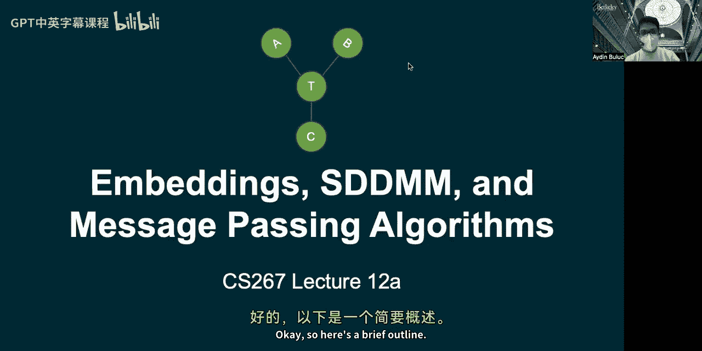
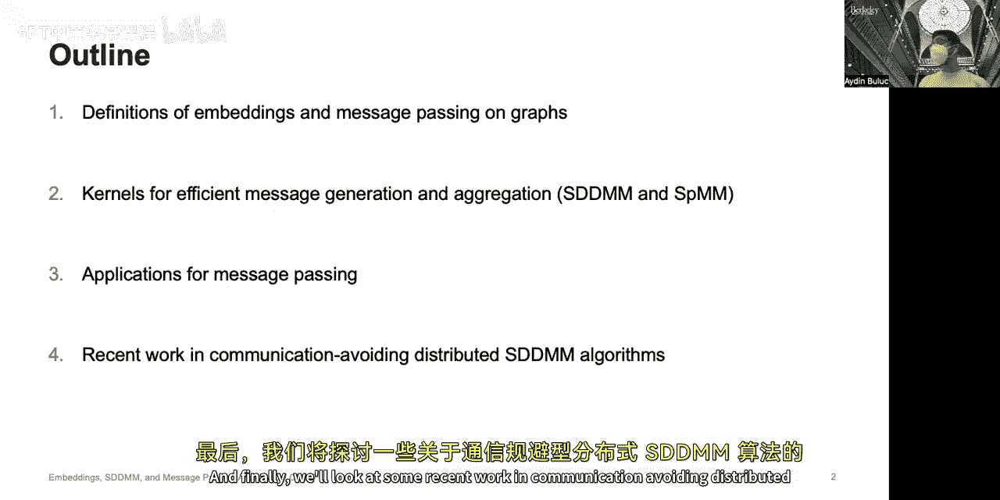
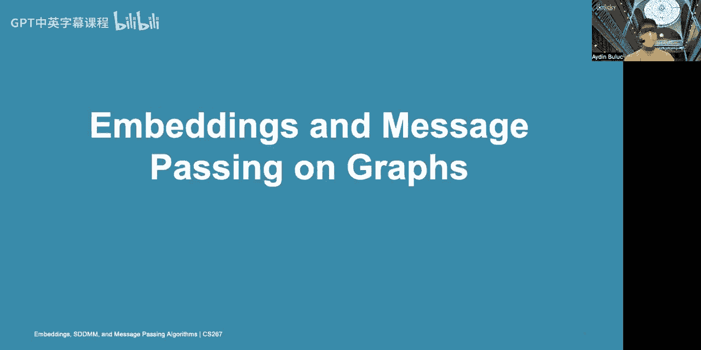
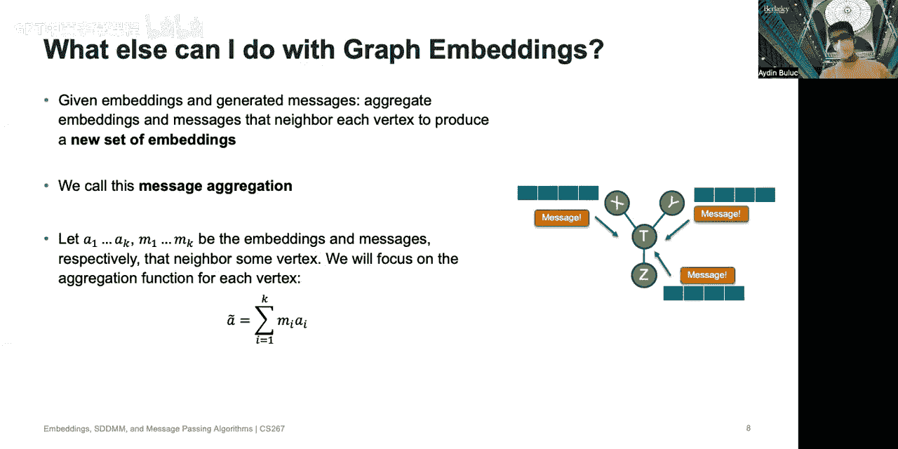
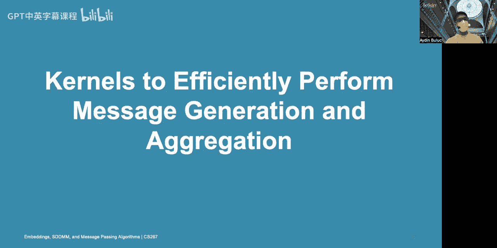
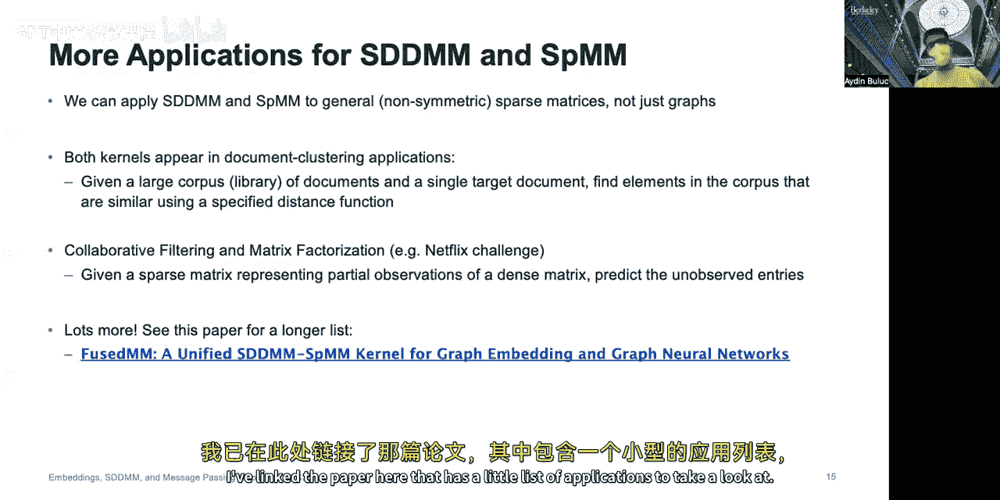
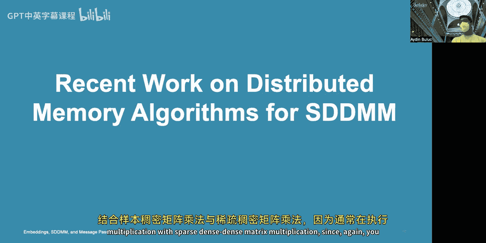
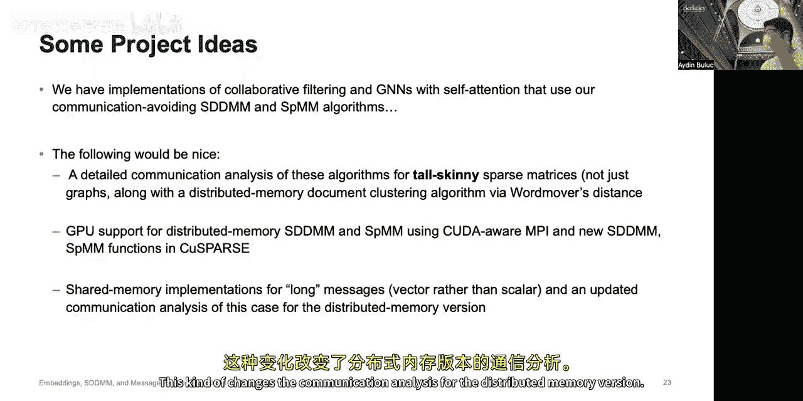

# 010：GSI 研究展示

在本节课中，我们将学习四位研究生的研究项目，内容涵盖图神经网络中的高效计算、模型压缩、分布式训练中的通信优化以及自动化模型并行化。这些主题展示了并行计算在机器学习前沿研究中的关键应用。

## 嵌入与图上的消息传递算法

上一节我们介绍了本讲的主题，本节中我们来看看第一个核心概念：图嵌入与消息传递。

嵌入是将离散集合中的元素映射到连续向量空间的一种方法。嵌入向量编码了每个元素的信息。例如，三种饮料（牛奶、可乐、水）的简单标签（1，2，3）不包含任何有用信息。但如果为每种饮料提供一个包含营养成分的向量，这个向量就编码了关于这些饮料的内容信息，因此更有用。

嵌入具有一些理想特性：
*   嵌入向量由可微分参数组成，可以将其作为更大机器学习框架的一部分，并使用 PyTorch 或 TensorFlow 的反向传播进行训练。
*   假设嵌入训练得当，两个嵌入向量之间的距离（例如 L2 或 L1 范数）可以提供对象之间相似性的度量。

在图计算中，一个典型问题是：给定一个由顶点和边组成的图，我们希望为图中的每个顶点学习一个嵌入。

为了讨论图嵌入，我们需要一些符号定义：
*   假设图有 **N** 个顶点。
*   用 **S** 表示图的邻接矩阵，它是一个稀疏矩阵，如果索引 i 和 j 之间存在边，则 S_ij = 1，否则为 0。
*   假设每个顶点有一个长度为 **R** 的嵌入。将所有嵌入堆叠起来，产生一个 **N × R** 的矩阵，称为 **A**。

有了图嵌入，我们可以进行两个关键操作：

以下是消息生成操作：
*   **消息生成**：对于每条边，使用连接该边的两个顶点的嵌入来计算一些信息（通常是一个标量消息）。
*   设 **a_i** 和 **b_j** 是两个相邻顶点的嵌入向量。生成标量消息的方法有很多，例如计算两个向量差值的范数、将两个向量传递给一个小型神经网络，或者简单地计算两个向量的点积。为简化讨论，我们聚焦于点积的情况，但其数据访问模式与其他方法类似。

以下是消息聚合操作：
*   **消息聚合**：给定一组嵌入和在每条边上生成的消息，我们可以聚合每个顶点邻居的嵌入和消息，为每个顶点生成一组新的嵌入。
*   我们聚焦于以下形式的聚合函数：新的嵌入 **h_t** 是邻居嵌入向量 **a_i** 的加权和，权重为对应的消息 **m_i**。公式表示为：**h_t = Σ (m_i * a_i)**。

## 高效内核：SDDMM 与 SpMM

上一节我们介绍了消息传递的基本操作，本节中我们来看看如何通过稀疏线性代数中的特定内核来高效执行这些操作。

首先从消息生成开始。我们讨论的第一个内核是**采样稠密-稠密矩阵乘法**。

给定维度为 N×R 的稠密矩阵 **A** 和 **B**，以及维度为 M×N 的稀疏矩阵 **S**，SDDMM 定义为 **S** 与矩阵乘积 **A × B^T** 的逐元素乘积。其输出矩阵的非零位置与 **S** 相同，值是对应位置的点积结果。

在实际操作中，我们绝不会通过先进行完整的矩阵乘法再进行逐元素乘积来执行此内核，因为那样极其浪费。我们只需要在 **S** 的非零位置进行计算。可以使用与作业1中类似的分块技术来优化此内核，以鼓励缓存重用。

接下来讨论如何高效聚合消息。我们使用**稀疏-稠密矩阵乘法**内核。

给定维度为 N×R 的稠密矩阵 **A** 和维度为 N×N 的稀疏矩阵 **S**，SpMM 就是计算 **S** 和 **A** 的矩阵乘积。输出的稠密矩阵的每一行都是通过聚合产生的新嵌入，这个聚合操作正是上一节在图上展示的聚合操作。

如果想用消息（而不仅仅是邻接矩阵）来加权嵌入，即聚合每条边上生成的消息，可以将 **S** 替换为 SDDMM 操作的输出（一个稀疏矩阵 **S_pe**）。这样就得到了完整的消息生成与聚合流程。

## 消息传递的应用

上一节我们介绍了执行消息传递的核心计算内核，本节中我们来看看这些内核的具体应用。

首先是一个动态示例：弹簧嵌入。在这个应用中，图的每条边都有已知的长度，但顶点的空间位置未知。目标是找到顶点的空间位置，使其符合已知的边长。这里的嵌入有明确的物理意义，即顶点在 2D 或 3D 空间中的位置。算法从随机位置开始，将每条边视为一个弹簧，根据其当前长度与理想长度的偏差处于拉伸或压缩状态。消息生成步骤是计算每条边（弹簧）对两端顶点的力，消息聚合步骤是使用 SpMM 计算每个顶点上的合力总和，然后根据牛顿第二定律更新顶点位置。

另一个更重要的应用是图卷积神经网络中的消息传递。GNN 使用一系列图卷积操作（本质上是 SpMM 内核）、线性变换和非线性激活函数来处理图数据，可用于节点分类、链接预测（如知识图谱）或整个图的分类（如分子分类或化合物能量计算）。SDDMM 和 SpMM 同样是其中的关键计算内核。例如，在自注意力机制中，消息生成步骤是计算相邻节点嵌入之间的注意力分数，消息聚合步骤则是将邻居节点的嵌入按注意力分数加权求和。

此外，这些内核还可以应用于更一般的非对称稀疏矩阵，而不仅仅是图。它们出现在文档聚类（寻找与目标文档相似的文档）和协同过滤/矩阵补全（如 Netflix 挑战赛）等应用中。

## 分布式 SDDMM 算法的最新研究

上一节我们看到了消息传递的广泛应用，本节中我们深入探讨一下针对这些计算内核的最新分布式算法研究。

SDDMM 和 SpMM 内核具有相同的数据访问模式：每个稀疏矩阵的非零元 (i, j) 都会与稠密输入矩阵的两行交互。它们之间的唯一区别在于将哪些操作数视为输入或输出。

已有大量关于这两种内核的共享内存算法研究，以及针对 SpMM 的分布式内存算法。研究发现，可以通过一个简单的转换过程，将 SpMM 的分布式内存算法转化为 SDDMM 的算法，反之亦然。因此，我们现在拥有了一系列分布式内存 SDDMM 算法，对每种算法都进行了通信分析，并实现了具有统一接口的版本，可以方便地嵌入到不同应用中。

这些分布式内存算法通过在不同处理器间复制部分输入或输出来节省通信开销（通过广播或规约操作）。通过将 SDDMM 和 SpMM 两个内核融合在一起，可以进一步节省通信开销，消除不必要的通信阶段，并改变所需的复制量。

我们的算法是稀疏性无关的，不依赖于对稀疏矩阵非零元的任何重排序。它们以类似于分布式环境中稠密矩阵乘法算法的方式运行。关键在于平衡算法执行过程中进行复制的时间与中间子矩阵移位的时间。

基准测试表明，我们的多种算法变体在性能上显著优于流行的科学机器学习工具包 PETSc。算法的选择取决于稀疏矩阵的密度，我们对此有相应的计算指导。最后，我们成功将算法嵌入到使用交替最小二乘法和图注意力网络的协同过滤应用中。

## 模型压缩与高效推理

上一节我们讨论了分布式训练中的计算优化，本节我们将视角转向模型本身，看看如何通过模型压缩在资源受限的设备上实现高效推理。

随着模型规模和计算量的急剧增长，云计算并非总是可行，主要受限于隐私、功耗和延迟三个问题。模型压缩是加速神经网络并在边缘设备上运行的关键技术。

模型压缩包含多个方向：
*   **量化**：将全精度神经网络映射到较低精度（如8位或4位），以减少模型大小、加速推理并降低功耗。
*   **剪枝**：移除网络中不重要的参数。
*   **知识蒸馏**：用大模型（教师）训练小模型（学生）。
*   **分解**：将大矩阵分解为小矩阵的乘积。

我们的研究探索**混合精度量化**，即为网络的不同层分配不同的量化位宽。这导致了指数级的搜索空间。我们采用**二阶敏感性分析**来解决这个巨大的搜索空间，通过海森矩阵的迹或最大特征值等度量来评估不同参数对量化扰动的敏感性，并据此分配位宽。

为了在硬件平台上更高效地部署量化后的网络，我们需要编译器（如 TVM）将软件代码转换到不同的硬件平台。我们进一步实现了硬件-软件协同搜索，同时考虑硬件延迟和软件量化敏感性。实验表明，低位宽（如整型4位）操作在优化良好的情况下，可以比整型8位操作带来显著的加速潜力。

## 分布式训练中的梯度稀疏化与通信优化

上一节我们探讨了通过模型压缩减少推理时的计算和存储，本节我们回到分布式训练过程，看看如何优化其通信开销。

在数据并行训练中，模型同步（梯度聚合）可能消耗大量时间。梯度稀疏化是一种重要的优化方法，它只通信重要的梯度，丢弃其他梯度。然而，现有方法需要极高的稀疏度（如99.8%）才能克服通信开销，并且难以扩展到大量GPU（因为稀疏梯度聚合后可能变稠密）。此外，当前方法平等对待所有参数，而不同部分的参数重要性可能不同。

我们提出的解决方案是，利用海森信息来指导不同参数的重要性评估，并采用**通道级结构化稀疏**，而非元素级稀疏。这意味着我们以通道为单位进行剪枝和通信，稀疏模式在每次迭代中可能会变化，且稀疏程度需要在训练效率和最终性能之间权衡。

因此，设计一种适用于这种特定稀疏场景的、高效的**稀疏 All-Reduce** 方法是一个重要的项目方向。这需要考虑服务器拓扑结构（例如，在 DGX 服务器中，GPU 之间的连接并非全连接）。此外，优化新型卷积操作（如深度可分离卷积）以及设计 GPU 友好的高效算子（充分利用 Tensor Core 的 int8/int4 支持）也是值得探索的项目方向。

## 通信最优的集体通信与模型并行推理

上一节我们讨论了数据并行中的梯度通信优化，本节我们介绍两种更根本的通信优化方案。

首先介绍 **Blink** 项目，旨在为数据并行训练提供最优的模型同步方案。现有的环状 All-Reduce 算法在异构链路（如 PCIe 和 NVLink 共存）和集群资源碎片化导致的非规则拓扑下效率不高。Blink 的核心思想是**打包生成树**而非形成环。在给定任意网络拓扑下，Blink 尝试打包尽可能多的生成树用于集体通信，从而保证最优性能。它能够探测可用链路、在异构链路上并发传输数据，并在无法形成环时使用更灵活的生成树。

另一个项目是 **SENet**，旨在消除模型并行推理中的通信。对于在线实时推理，数据并行和模型并行都会引入通信开销。SENet 采用“分而治之”的策略，将基础模型解耦为多个互不连接的子网络（每个子网络是一个二分类器），分别负责判断输入是否属于某个特定类别。在推理过程中，这些子网络之间完全不需要通信，仅在最后聚合各个子网络的输出（一个浮点值）即可做出最终决策，从而显著降低延迟。我们还在其基础上增加了容错性和对无人机控制系统的扩展。

## 自动化模型并行系统 Alpa

上一节我们看到了针对特定场景的通信优化，本节我们介绍一个更通用的自动化系统 Alpa，它旨在统一各种模型并行策略。

训练大型模型需要结合数据并行、张量并行和流水线并行等多种技术，手动设计并行策略需要大量工程努力。Alpa 是一个编译器系统，能够自动为大规模神经网络生成最优的模型并行计划。

Alpa 将现有的并行技术分类为两层：
*   **算子内并行**：将一个算子的不同部分分配到多个设备上执行（如数据并行、张量并行）。
*   **算子间并行**：将计算图的不同部分分配到多个设备上执行（如设备放置、流水线并行）。

这种层次结构自然地映射到当今常见的 GPU 集群层次结构：节点内是高速互联（NVLink），节点间是相对较慢的网络（以太网）。Alpa 将算子间并行映射到慢速连接，将算子内并行映射到快速连接。

Alpa 的编译流程如下：
1.  **算子间并行 Pass**：将计算图切分为多个流水线阶段，并将设备集群切分为多个子设备网格。
2.  **算子内并行 Pass**：对每个流水线阶段，将其计算图中的每个算子在对应的子设备网格上进行划分。
3.  遵循流水线调度，编译生成每个设备网格的可执行文件，然后分发执行。

其中，算子内并行 Pass 通过求解整数线性规划问题来寻找最优的算子划分策略；算子间并行 Pass 通过动态规划算法来寻找最优的图切分与设备网格分配方案。实验表明，Alpa 在 GPT、混合专家模型等大规模模型上能够匹配甚至超越手工设计的并行策略的性能。

基于 Alpa，可能的后续研究方向包括：为模型并行训练设计更优的跨设备网格通信库，以及将自动化模型并行方法扩展到新的神经网络架构（如 NeRF、AlphaFold、图神经网络）。

## 总结

本节课中，我们一起学习了并行计算在机器学习前沿研究中的四个关键方向：
1.  图神经网络中基于 SDDMM 和 SpMM 内核的高效消息传递机制及其应用。
2.  通过量化、剪枝等模型压缩技术实现高效推理，以及在分布式训练中通过梯度稀疏化优化通信。
3.  针对数据并行训练中集体通信的 Blink 优化方案，以及用于低延迟模型并行推理的 SENet 方法。
4.  自动化模型并行系统 Alpa，它通过编译器技术统一并自动优化算子内与算子间并行策略，以训练超大规模神经网络。

这些研究展示了并行计算思想、算法与系统设计在解决当前机器学习领域计算与通信瓶颈中的核心作用。