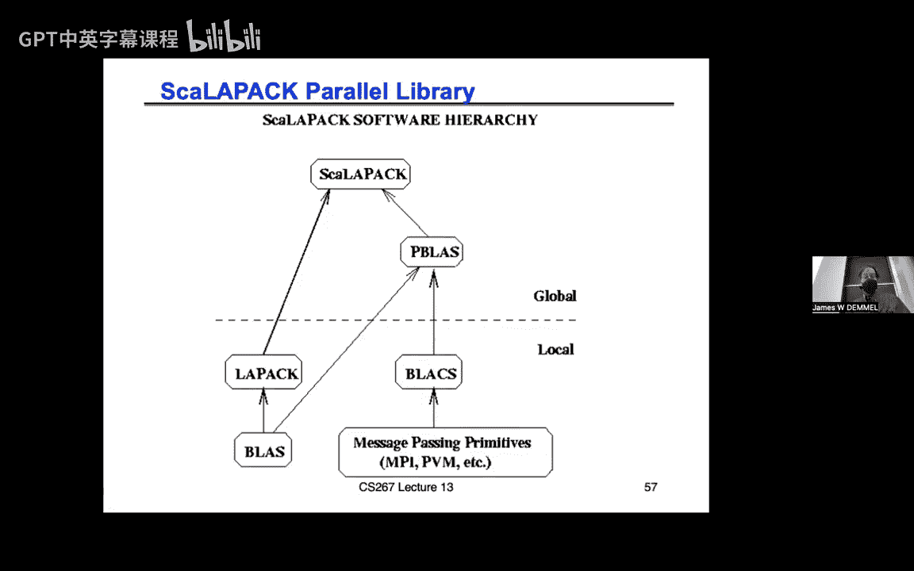

# 011：历史与结构 📚


在本节课中，我们将要学习稠密线性代数的历史背景、核心概念以及如何通过并行计算优化矩阵乘法等关键操作。我们将从基本概念入手，逐步深入到并行算法的设计与优化。

---

## 概述 📖

稠密线性代数不仅仅是我们在作业一中接触的矩阵乘法，它还包括求解线性方程组、最小二乘问题、特征值与特征向量计算、奇异值分解等。这些操作在科学计算、机器学习、工程仿真等领域有广泛应用。本节课将回顾稠密线性代数的发展历史，探讨如何通过优化通信来提升计算效率，并详细介绍并行矩阵乘法的实现方法。

---

## 历史与动机 🕰️

稠密线性代数的发展经历了多个阶段。最初，人们使用简单的循环（do loop）来实现线性代数运算。随着计算需求的增长，出现了标准化的基础线性代数子程序（BLAS），这些子程序被优化以适应不同的硬件架构，从而提高了计算效率。

BLAS 的发展分为三个阶段：
1.  **BLAS1**：主要针对向量操作，如向量加法、点积等。
2.  **BLAS2**：扩展到矩阵与向量的操作，如矩阵向量乘法。
3.  **BLAS3**：进一步扩展到矩阵与矩阵的操作，如矩阵乘法。

这些标准库的出现使得线性代数运算可以在不同硬件上高效运行，同时也为更复杂的算法（如 LAPACK）奠定了基础。

---

## 通信的重要性 📡

在并行计算中，算法的性能不仅取决于计算量，还取决于数据移动（即通信）的成本。通信包括处理器之间的数据传输以及内存层次结构（如缓存与主存）之间的数据交换。为了最大化计算效率，我们需要最小化通信。

以下是通信成本的模型：
- **计算量**：浮点运算次数（Flops）。
- **数据移动量**：传输的数据量（Words）。
- **消息数量**：传输的次数（Messages）。

通信成本通常远高于计算成本，因此优化通信是提升并行算法性能的关键。

---

## 矩阵乘法的通信下界 📉

对于矩阵乘法，我们可以推导出通信的下界。假设我们使用 $n \times n$ 的矩阵，并在 $p$ 个处理器上进行并行计算，每个处理器的本地内存大小为 $m$。通信的下界可以表示为：

**数据移动量下界**：
$$
\text{Words Moved} \geq \frac{\text{Flops}}{\sqrt{m}}
$$

**消息数量下界**：
$$
\text{Messages} \geq \frac{\text{Words Moved}}{m}
$$

这些下界为我们设计优化算法提供了目标。

---

## 并行矩阵乘法 🧮

并行矩阵乘法的实现依赖于数据布局和通信模式。以下是几种常见的数据布局：

1.  **列块布局**：每个处理器负责矩阵的一部分列。
2.  **行块布局**：每个处理器负责矩阵的一部分行。
3.  **二维块循环布局**：将矩阵划分为小块，并按照循环方式分配给处理器。

二维块循环布局通常能提供更好的负载均衡和通信效率。

---

### 并行矩阵乘法算法

以下是并行矩阵乘法的核心步骤：

1.  **数据分布**：将矩阵 $A$、$B$ 和 $C$ 按照二维块循环布局分配给处理器。
2.  **局部计算**：每个处理器计算其负责的矩阵块的部分结果。
3.  **通信**：通过广播和归约操作交换数据，确保每个处理器获得计算所需的所有数据。
4.  **结果合并**：将局部结果合并为最终结果。

以下是并行矩阵乘法的伪代码示例：

```python
for k in range(num_blocks):
    # 广播 A 的块
    broadcast(A_block, row_group)
    # 广播 B 的块
    broadcast(B_block, col_group)
    # 局部矩阵乘法
    C_local += A_block * B_block
```

---

## 优化通信的策略 🚀

为了进一步优化通信，我们可以采用以下策略：

1.  **增加数据副本**：通过增加数据副本，可以减少通信量，但需要更多内存。
2.  **使用三维网格布局**：将处理器组织成三维网格，可以进一步优化通信模式。
3.  **利用 Strassen 算法**：通过减少计算量来间接降低通信成本。

这些策略可以帮助我们接近通信下界，从而提升算法的整体性能。

---

## 总结 📝

本节课我们一起学习了稠密线性代数的历史背景、通信的重要性以及并行矩阵乘法的实现方法。我们了解到，优化通信是提升并行计算性能的关键，而通过合理的数据布局和算法设计，我们可以接近通信的理论下界。在下一节课中，我们将进一步探讨其他稠密线性代数操作的并行化方法。

---

## 参考资料 📚

1.  BLAS 标准库文档。
2.  LAPACK 用户指南。
3.  并行计算相关研究论文。



通过深入学习这些内容，你将能够更好地理解并行计算在稠密线性代数中的应用，并为实际项目中的性能优化提供指导。