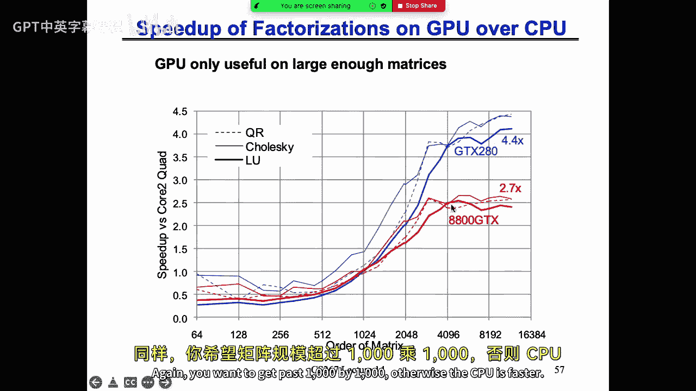
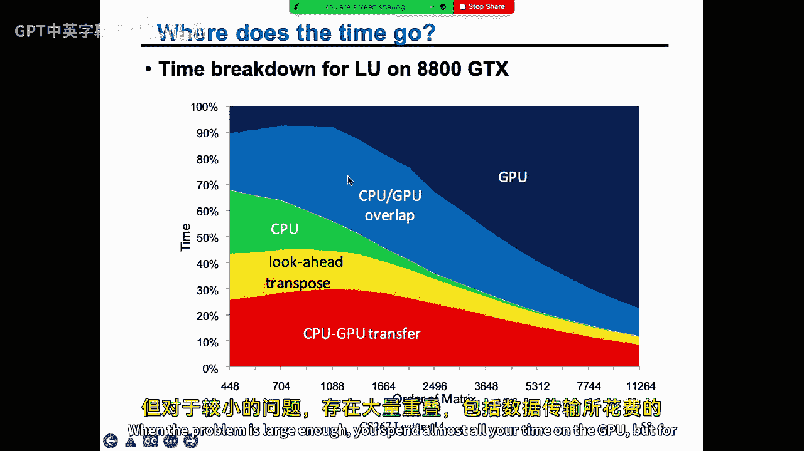
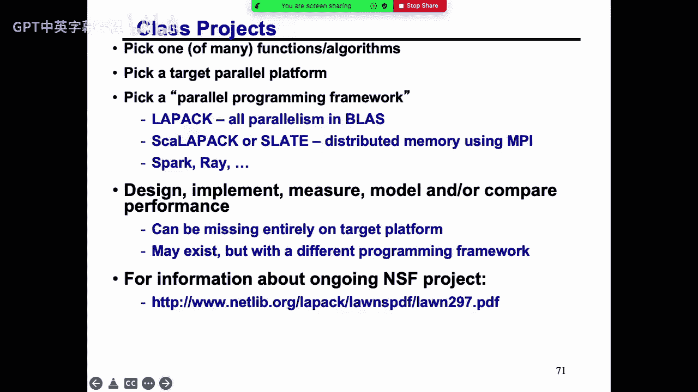
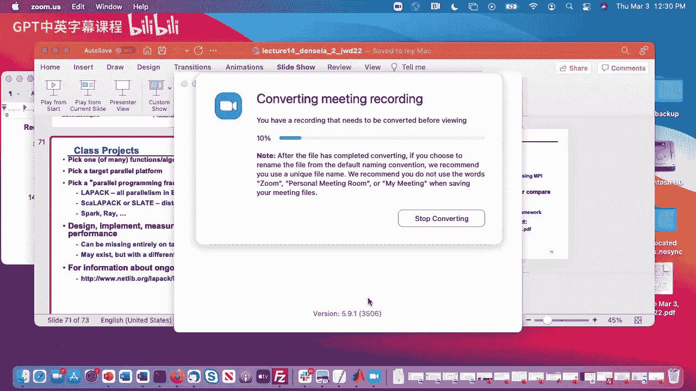

# 012：并行高斯消元法

## 概述

在本节课中，我们将学习稠密线性代数中的核心算法——高斯消元法及其并行化。我们将从回顾优化目标开始，逐步深入到算法细节、数据布局、通信优化，并探讨在GPU和多核架构上的实现策略。课程将涵盖从基础的三层循环代码到复杂的递归算法和通信避免技术。

---

## 优化目标回顾：最小化通信

上一讲我们讨论了矩阵乘法。本节中，我们来看看高斯消元法的优化目标，其核心同样是**最小化通信**。

我们的目标是：
*   在保持浮点运算次数大致相同的前提下，最小化数据移动（带宽）和消息传递次数（延迟）。
*   对于高斯消元，其通信下界与矩阵乘法类似。在一个两级存储层次（缓存大小M）中：
    *   移动的字数下界：`Ω(n³ / √M)`
    *   消息数下界：`Ω(n³ / M^(3/2))`
*   在并行环境下，若数据有C份副本，通信下界可以进一步降低。

---

## 高斯消元法基础

在深入优化之前，我们先回顾高斯消元法求解线性方程组 `Ax = b` 的基本原理。我们从大学阶段熟悉的版本开始，并将其转化为简洁的三行代码，以便于分析。

### 从三层循环到三行代码

基础算法通过循环遍历所有列，将主元下方的元素消为零。以下是其核心的三层循环结构：

```fortran
for i = 1 to n-1
    for j = i+1 to n
        A(j,i) = A(j,i) / A(i,i)  ! 计算乘子
        for k = i+1 to n
            A(j,k) = A(j,k) - A(j,i) * A(i,k) ! 更新行
        end for
    end for
end for
```

通过一系列优化（如预计算乘子、避免计算已知的零、将乘子存储在零元素位置），我们可以将其重构为更高效的形式。最终，算法可以抽象为三个关键步骤，对应三次BLAS（基本线性代数子程序）调用：

1.  **标量除法/向量缩放**：计算当前列的乘子。`A(i+1:n, i) = A(i+1:n, i) / A(i, i)`
2.  **秩1更新**：用当前列和当前行更新右下角的子矩阵。`A(i+1:n, i+1:n) = A(i+1:n, i+1:n) - A(i+1:n, i) * A(i, i+1:n)`
3.  **隐含的LU分解**：上述过程等价于将矩阵A分解为下三角矩阵L和上三角矩阵U的乘积：`A = L * U`。其中L的主对角线为1，下三角部分存储乘子；U是上三角矩阵。

利用LU分解，求解 `Ax = b` 分为两步：
1.  前向替换求解 `Ly = b` 得到 `y`。
2.  后向替换求解 `Ux = y` 得到解 `x`。

### 选主元的重要性

基础算法存在数值稳定性问题。如果主元 `A(i,i)` 为零或非常小，除法会导致数值错误或溢出。解决方案是**部分选主元**：在消去第i列时，从第i行及以下寻找绝对值最大的元素，将其所在行与第i行交换。这确保了乘子的绝对值不大于1，提高了数值稳定性。

引入选主元后，分解变为 `PA = LU`，其中P是排列矩阵。求解时需先对b应用排列：`Ly = Pb`，再解 `Ux = y`。

---

## 顺序情况下的优化：分块与递归算法

上一节我们介绍了基础算法和选主元。本节中我们来看看如何通过分块和递归来优化顺序执行时的高斯消元，以减少通信。

### 分块算法（Blocked Algorithm）

直接使用上述三行代码（对应BLAS 1级和2级运算）无法达到机器峰值性能。关键思想是**延迟更新**：将多个秩1更新累积起来，一次性用矩阵乘法（BLAS 3级运算）完成，从而利用更高的计算效率。

**算法步骤**：
1.  将矩阵划分为大小为 `B x B` 的块。
2.  对当前列块（一个“面板”，Panel）进行带选主元的高斯消元（使用BLAS 1/2级运算）。这产生该面板的LU分解。
3.  使用三角求解（BLAS 3级）更新面板右侧的列块。
4.  使用矩阵乘法（BLAS 3级）更新右下角的子矩阵。

通过选择合适的分块大小B（通常使面板能放入缓存），大部分计算量集中在第4步的矩阵乘法上，从而接近峰值性能。

### 递归算法（Recursive LU）

分块算法在矩阵中等大小时（能放入一列但放不下一个平方块）无法达到通信下界。为此，需要**递归算法**。

其思想与递归矩阵乘法类似：
1.  将矩阵A垂直分割为左右两部分：`A = [A1, A2]`。
2.  递归地对左半部分 `A1` 进行LU分解：`[L1, U1] = LU(A1)`。
3.  求解 `L1 * Y = A2` 的上半部分，更新 `A2`。
4.  更新右下角子矩阵：`S = A22 - Y * U1` 的下半部分（一个矩阵乘法）。
5.  递归地对更新后的子矩阵S进行LU分解：`[L2, U2] = LU(S)`。

递归算法能近乎达到带宽下界（相差一个对数因子），但达到延迟下界需要更复杂的技巧。

---

## 并行高斯消元：数据布局与算法

上一节我们讨论了顺序优化。本节中我们来看看并行环境下的挑战，特别是数据布局和经典的ScaLAPACK算法。

### 数据布局的重要性

在并行机上，数据如何分布到各个处理器上至关重要。对于高斯消元：
*   **坏布局1**：按列块连续分配。导致负载极度不均衡，先完成的处理器早早空闲。
*   **坏布局2**：按列交叉分配。改善了负载均衡，但破坏了数据的局部性，难以进行高效的矩阵乘法。
*   **好布局**：**二维块循环布局**。将矩阵划分为 `B x B` 的小块，并以网格方式循环分配给处理器网格。这种布局在负载均衡和通信局部性之间取得了良好平衡，是ScaLAPACK等库的基础。

### ScaLAPACK中的并行LU算法

算法流程与分块算法对应，但所有操作都在处理器网格上协同完成：
1.  **面板分解**：负责当前面板列的处理器组通过归约操作找到主元行，广播该行，然后本地进行消元。
2.  **交换行**：将选主元产生的行交换信息广播给所有处理器，并执行全局的行交换。
3.  **三角求解**：将面板的L因子广播给右侧处理器，各处理器本地进行三角求解更新右侧列块。
4.  **矩阵乘法更新**：将面板右侧更新后的列块向下广播，将面板U因子向右广播，各处理器本地进行矩阵乘法更新右下子矩阵。

该算法在字数移动量上接近下界，但由于每一步都需要为选主元进行归约操作，导致**消息数量为 `O(n log P)`**，远高于下界 `O(√P)`，成为大规模并行时的瓶颈。

---

## 通信避免LU（Communication-Avoiding LU）

上一节指出经典并行LU的消息开销过高。本节中我们介绍一种通过改变选主元方式来避免通信的新算法。

### 选主元带来的通信瓶颈

传统部分选主元需要为每一列进行一次归约操作（`O(log P)` 条消息），总共 `O(n log P)` 条消息。

### 锦标赛选主元（Tournament Pivoting）

核心思想：**一次性为一个面板（B列）选出B个主元行**，而不是逐列选择。
1.  每个处理器对自己本地存储的面板部分行，进行本地带选主元的LU，选出本地最佳的B个候选行。
2.  处理器间通过一棵归约树（如二叉树）进行协作：在树的每一层，两个处理器将各自的B个候选行合并（形成一个 `2B x B` 的矩阵），再次进行带选主元的LU，选出新的B个最佳行。
3.  归约到根处理器后，就得到了全局的B个主元行。然后一次性将这B行置换到面板顶部。
4.  后续对该面板的消元可以**不带选主元**地进行，因为主元已经选定。

这种方法将消息数量从 `O(n log P)` 降低到了 `O(log P)`（每个面板一次归约）。虽然选出的主元与传统算法不同，但已被证明具有相当的数值稳定性。

### 性能收益

这种通信避免技术（CA-LU）在处理器数很多、问题规模相对较小时，能带来显著的加速（理论上可达数十倍），因为它消除了选主元带来的大量小消息通信。

---

## 扩展到其他稠密线性代数运算

高斯消元法的优化思想可以推广到其他稠密线性代数运算。

### QR分解

QR分解将矩阵A分解为正交矩阵Q和上三角矩阵R的乘积（`A = QR`），常用于最小二乘问题。
*   **通信避免QR（TSQR）**：采用与锦标赛选主元类似的归约树思想。每个处理器先对本地行做QR，得到本地R因子。然后处理器间通过归约树，将两个R因子合并成一个新的矩阵再做QR，逐级向上，最终得到全局R因子。全局Q因子由树上的所有局部Q因子隐含表示。
*   这种方法特别适合 tall-skinny 矩阵（行远多于列），并能极大减少通信，甚至在数据无法装入内存时也能高效运行（避免磁盘抖动）。

### 现状总结

研究人员已经为大多数稠密线性代数运算（如Cholesky分解、对称特征值问题、奇异值分解等）设计了通信最优或近似最优的算法。有些是递归的，有些采用了随机化技术。许多算法已被集成到LAPACK和ScaLAPACK库中，但仍有部分算法尚待实现或优化，特别是在新的异构架构上。

---

## GPU上的高效实现

上一节我们关注了分布式内存系统。本节中我们来看看在GPU这种异构架构上实现高斯消元的独特挑战和策略。

### GPU的挑战
*   **复杂的内存层次**：寄存器、共享内存、全局内存等，速度和大小各异，需要显式管理。
*   **CPU-GPU分工**：GPU擅长大规模数据并行计算（如矩阵乘法），但启动开销大，不擅长标量或小规模运算。
*   **数据布局偏好**：CPU适合列优先存储，而GPU（为了合并内存访问）可能更适合行优先存储。

### 优化策略
1.  **任务划分**：让CPU负责面板分解（涉及选主元和BLAS 1/2级运算），让GPU负责后续的矩阵乘法更新（BLAS 3级运算）。
2.  **流水线操作**：CPU在分解当前面板时，GPU同时更新上一个面板影响到的子矩阵，实现重叠计算。
3.  **数据布局转换**：在CPU（列优先）和GPU（行优先）之间传输数据时进行转置。虽然增加了开销，但能极大提升GPU内核的内存访问效率。
4.  **核函数优化**：针对GPU特性编写高效内核，例如，优先使用寄存器，谨慎使用共享内存，选择合适的数据块大小和线程束大小。

通过这些优化，GPU上的LU、QR等运算在足够大的矩阵上可以显著超越多核CPU的性能。

---





## 多核架构上的动态调度

对于共享内存的多核系统，挑战在于如何调度具有复杂依赖关系的众多任务（如小块矩阵运算），以最大化核心利用率。

### 基于任务依赖图的调度
1.  **构建任务图**：将分块后的算法（如分块Cholesky）表示为一个有向无环图。节点是任务（如小矩阵乘法、三角求解），边代表依赖关系（一个任务的输出是另一个的输入）。
2.  **动态调度**：运行时系统（如OpenMP 4.0的`task`依赖特性）动态跟踪哪些任务的所有依赖已满足，并将其分配给空闲的核心执行。这比静态调度更能适应负载变化和复杂依赖。
3.  **性能收益**：良好的动态调度可以最小化核心空闲时间，实现更高的并行效率，尤其对于不规则的任务图效果显著。

---

## 总结

在本节课中，我们一起学习了稠密线性代数核心算法——高斯消元法的并行化与优化。我们从优化目标（最小化通信）出发，回顾了算法基础，并深入探讨了：
*   顺序情况下的分块与递归算法，以优化缓存使用。
*   并行情况下的二维块循环数据布局和ScaLAPACK算法。
*   为突破消息传递瓶颈而设计的**通信避免LU**算法，其核心是锦标赛选主元。
*   该思想向QR分解等其他运算的扩展。
*   在GPU异构架构上通过CPU-GPU分工、数据布局转换实现的性能优化。
*   在多核系统上利用任务依赖图进行动态调度的策略。





这些优化技术使得大规模稠密线性代数计算能够更高效地利用现代并行计算硬件，接近理论上的性能极限。