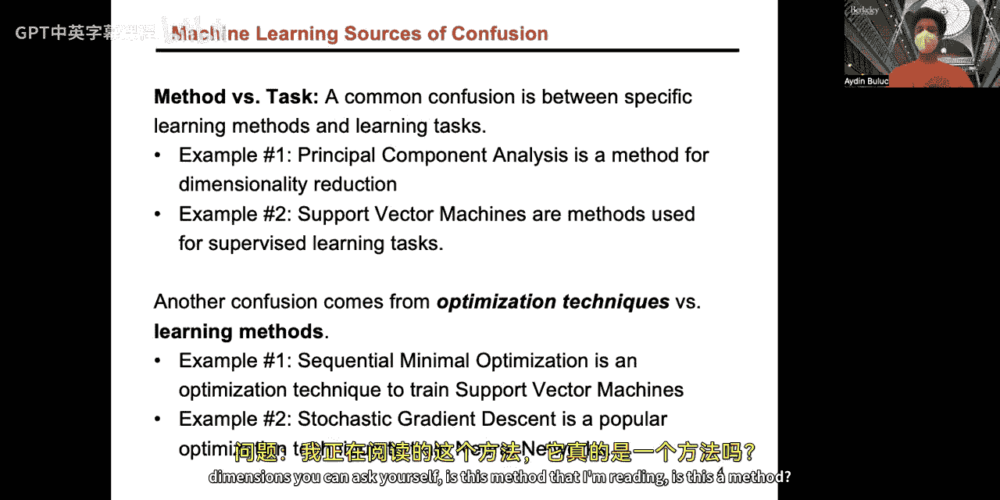
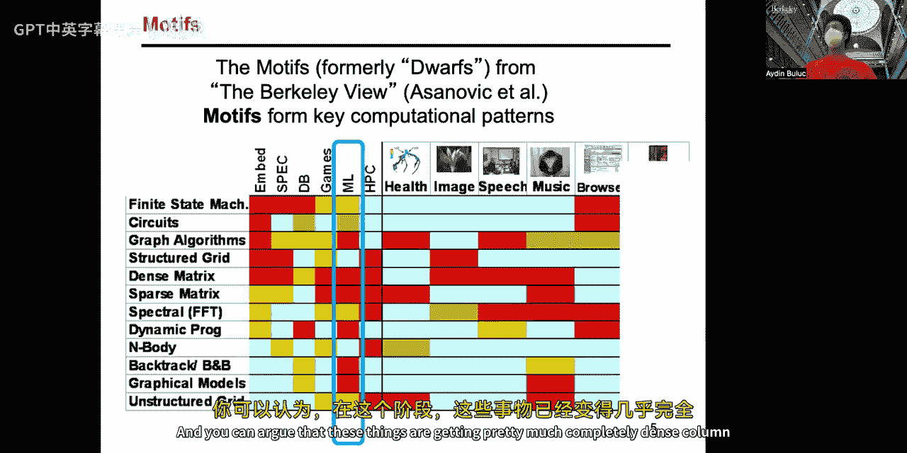
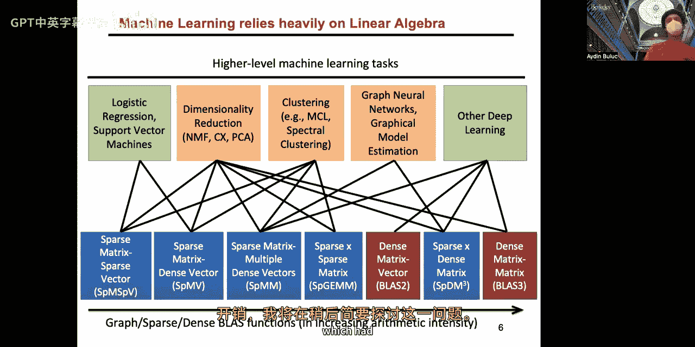
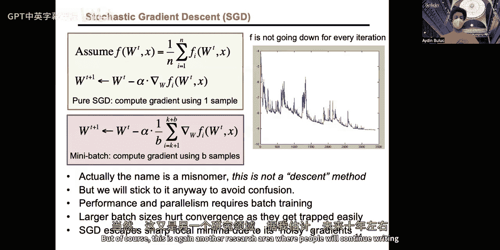
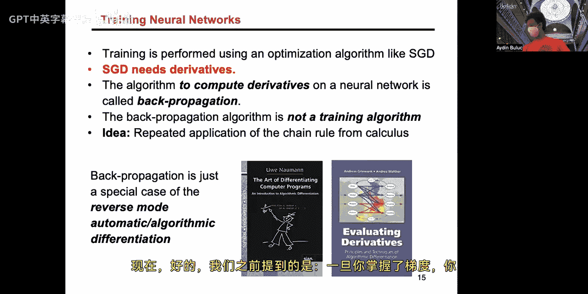
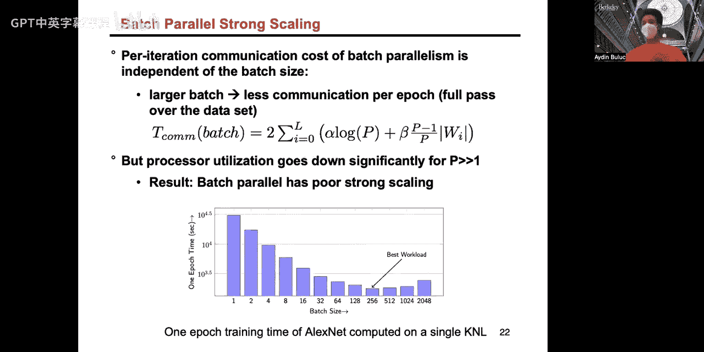
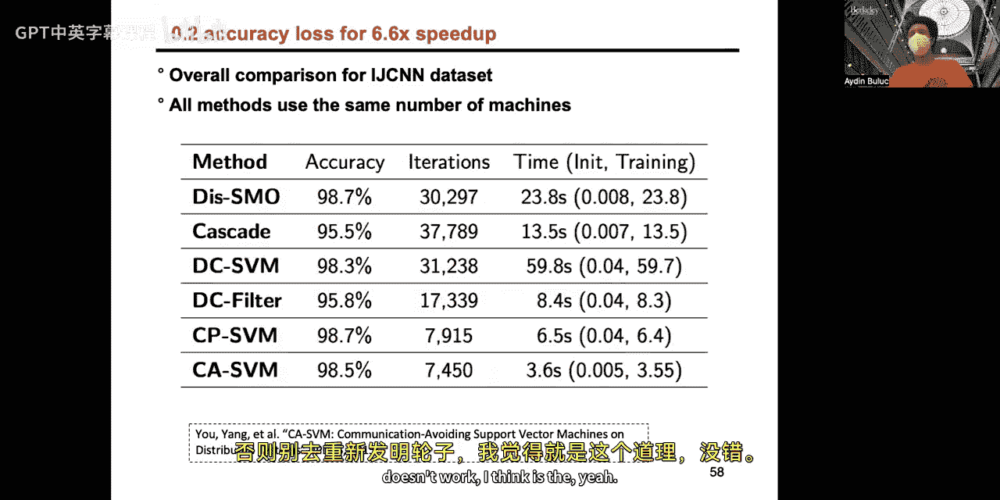

# 013：并行机器学习 1（监督学习）🎯

在本节课中，我们将要学习并行机器学习的基础知识，特别是监督学习领域。我们将重点探讨深度学习及其并行化策略，并简要介绍支持向量机，以了解其他机器学习方法的并行化思路。

## 概述 📋

机器学习旨在构建能够通过经验自动改进的系统。近年来，机器学习，尤其是深度学习，已成为推动高性能计算发展的重要力量。本节课将首先回顾机器学习的基本分类，然后深入探讨深度神经网络的训练过程及其并行化方法。

## 机器学习基础 🧠

机器学习主要分为监督学习、半监督学习、无监督学习和强化学习。本节课我们将专注于监督学习。

一个常见的混淆点在于区分**学习方法**和**学习任务**。例如，主成分分析是一种用于**降维任务**的**方法**。在监督学习中，我们的**任务**是利用已有标签的数据进行训练，并对未标记的数据进行预测。完成此任务的**方法**包括深度学习和支持向量机。

另一个混淆点在于**优化技术**。大多数机器学习方法最终都转化为优化问题，即最小化某个目标函数。例如，随机梯度下降是训练深度神经网络常用的优化技术。

## 并行计算与机器学习 🔗

从计算模式来看，机器学习几乎涉及所有经典的高性能计算内核，如线性代数、图算法等。这表明机器学习与高性能计算紧密相连。

在并行化策略上，我们可以从两个层面考虑：
*   **隐式并行化**：保持算法外层结构不变，仅并行化内层计算（如线性代数运算）。优点是算法收敛性不变，但并行度受限于单次迭代。
*   **显式并行化**：从根本上重组算法以暴露更多并行性。这通常会导致算法行为发生变化，但可能获得更好的可扩展性。

## 深度神经网络训练 🧵

深度神经网络训练的核心是**反向传播算法**，它是自动微分的一个特例。训练过程可概括为：输入数据和标签，通过网络前向传播得到预测，计算预测与标签的误差，然后反向传播误差以更新网络权重（参数）。

权重更新的基本方法是**梯度下降**，其公式为：
`W_new = W_old - α * ∇L(W_old)`
其中 `α` 是学习率，`∇L` 是损失函数关于权重的梯度。

然而，计算整个数据集的梯度（批量梯度下降）开销巨大。因此，实践中普遍采用**随机梯度下降**或其变体**小批量随机梯度下降**。后者每次使用一小批（`B`个）数据样本来计算梯度并更新模型，在并行效率和收敛性之间取得了平衡。

## 深度学习的并行化策略 ⚙️

深度学习的并行化主要从数据、模型和流水线三个维度展开。

### 1. 数据并行 📊

数据并行是最直观的策略。每个处理器拥有完整的模型副本，但处理不同的数据子集（批次）。前向传播和大部分反向传播无需通信。唯一的通信发生在每个处理器计算完本地梯度后，需要**全局归约**所有梯度以更新全局模型参数。

**通信成本分析**：
梯度归约的通信量只与模型参数数量有关，与批次大小 `B` 无关。这意味着增大批次大小不会增加通信开销，这是数据并行的一大优势。

然而，数据并行存在限制：
*   当每个处理器分到的数据量（`B/P`）过小时，矩阵运算效率会下降。
*   过大的批次大小可能损害模型的收敛速度和最终精度。

### 2. 模型并行 🤖

当模型参数过大，无法在单个处理器内存中存放时，就需要模型并行。它将模型的参数（权重矩阵）划分到不同处理器上。

考虑一层神经网络的前向传播：`Y = W * X`。
*   在模型并行中，我们划分权重矩阵 `W`。
*   为了计算输出 `Y`，需要从其他处理器收集部分结果（All-Gather通信）。
*   反向传播时，计算权重梯度 `ΔW` 可能无需额外通信（若激活 `X` 被复制），但计算激活梯度 `ΔX` 需要归约操作（Reduce-Scatter）。

**通信成本分析**：
模型并行的通信量与激活张量的大小相关，而与参数大小无关。因此，对于参数多、激活少的层（如全连接层），模型并行是首选。

### 3. 混合并行：通信避免算法 🔄

为了结合数据并行和模型并行的优点，可以使用类似于通信避免矩阵乘法的思想。例如，一种“1.5维”算法将处理器组织成网格，同时在数据和模型维度上进行划分和复制。这种方法通常能获得比单一策略更优的性能。

### 4. 流水线并行 🚀

对于层数很深的网络，可以采用流水线并行。它将模型的不同层分配给不同的处理器。为了填充流水线，需要将小批次数据进一步划分为更小的微批次。这样，多个微批次可以同时在网络的不同层中处理。

流水线并行的关键挑战在于**流水线气泡**和**梯度同步**。有同步（如定期同步权重）和异步（如各自维护权重副本并偶尔合并）两种同步策略。

流水线并行本质上是模型并行和批次并行的结合，其可获得的额外并行度上限是网络的深度。

### 5. 域并行（空间并行） 🌐

对于单个样本就很大的情况（如超高分辨率图像或视频），可以采用域并行。它将单个输入样本的空间维度进行划分（如图像分块），每个处理器处理一块。在卷积等操作需要邻域信息时，通过**幽灵区**通信来交换边界数据。这与我们在之前作业中实现的Stencil计算类似。

## 支持向量机的并行化 ⚖️

支持向量机是另一种经典的监督学习方法，其目标是找到一个最大化分类间隔的超平面。训练SVM可以形式化为一个二次规划问题。

标准的序列最小优化算法每次只更新两个拉格朗日乘子，计算量小但并行度极低。

早期的并行SVM尝试（如级联SVM）将数据随机分片，在各分片上独立训练SVM，然后仅传递支持向量给下一层。但随机分片可能导致局部支持向量无法代表全局解，损害精度。

后续研究提出了改进：
1.  **传递所有数据**而非仅支持向量，以提高精度，但牺牲了速度。
2.  使用**核K均值**对数据进行聚类分片，使得每个分片更具代表性。
3.  最终方案是**通信感知的SVM**：先用核K均值聚类，再以负载均衡为目标将聚类合并后分配给处理器。这样既保证了各分片模型的局部有效性，又实现了良好的负载均衡，在精度损失很小的情况下获得了显著的加速。

这是一个**显式并行化**的成功例子，通过改变算法本身获得了更好的可扩展性。

## 总结 🎓

本节课我们一起学习了并行机器学习的基础知识。
*   我们了解了机器学习的基本分类和并行化思路。
*   重点探讨了深度神经网络的训练过程，以及**数据并行**、**模型并行**、**流水线并行**和**域并行**等核心并行化策略及其通信模式。
*   我们认识到，对于卷积层（激活大、参数小），数据并行是首选；对于全连接层（参数大、激活小），模型并行是首选；而混合策略通常能取得更好效果。
*   最后，我们以支持向量机为例，看到了如何通过显式并行化（如核K均值聚类与负载均衡结合）来并行化传统机器学习算法。

下节课我们将继续探讨无监督和半监督学习的并行化。